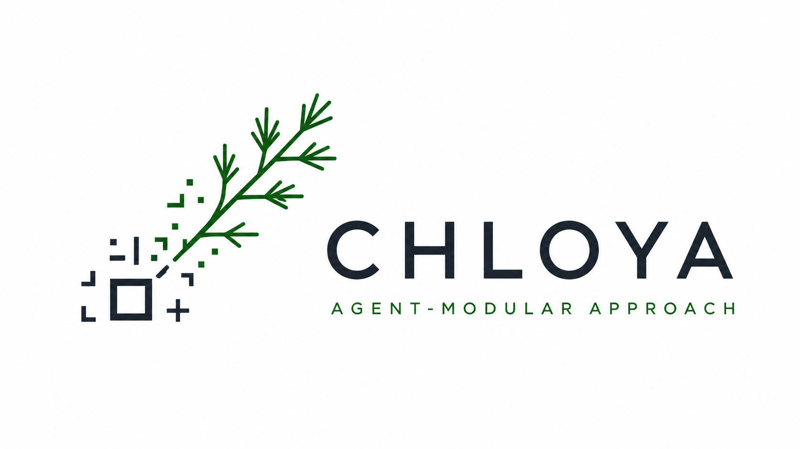

  

  <strong>Constrained Handoffs · Local Ownership · Yield Assurance</strong>

  <strong>English</strong> · <a href="README.ru.md">Русский</a>

  
  

# CHLOYA

**An agent-modular approach to software development with AI.**

> Humans set the direction and make consequential decisions.  
> AI executors operate within constrained authority.  
> Context is transferred in small, verifiable packages.  
> Project knowledge stays with the project, and completion is supported by evidence.

> **Project status:** CHLOYA is currently being developed as a methodology. Its terminology, processes, and document formats will evolve through discussion and practical validation.

## What is CHLOYA?

CHLOYA is an open approach to organizing software development involving AI models and agentic tools.

The methodology treats AI not as the autonomous owner of a project, but as a temporary executor. Humans retain control over goals, architecture, acceptable risk, and acceptance of the result.

Work is divided into bounded areas. Each task receives the minimum sufficient context, an explicit set of permitted actions, completion criteria, and required checks.

Project knowledge is preserved in portable, human-readable documents rather than existing only in chat history or in the internal memory of a particular tool.

CHLOYA is not tied to a single model, development environment, or AI provider.

## What does the name mean?

### Constrained Handoffs

Passing a task to a person, model, or agent should not require transferring the entire project history.

Instead, the handoff is represented by a bounded package that may contain:

- the task objective;
- the permitted scope of change;
- the minimum sufficient context;
- allowed actions;
- related contracts;
- known risks;
- completion criteria;
- evidence from completed checks.

Transferring context does not automatically transfer all authority.

### Local Ownership

Every system area, decision, contract, and change should have a clear area of responsibility.

An AI executor does not become the owner of the architecture or project memory. It performs a bounded task and can be replaced by another executor without losing the current state of the project.

Local ownership means responsibility for a defined area of the system. It does not require all data to be stored only on a local computer.

### Yield Assurance

A plausible model response or successfully generated code does not mean that a task is complete.

Completion should be supported by verifiable results such as:

- code changes;
- automated tests;
- contract validation;
- impact analysis;
- manual testing;
- updated documentation;
- a description of residual risk;
- a rollback plan for high-risk changes.

A technically prepared change should not necessarily be activated automatically in a production environment.

## Why is this approach needed?

Modern AI tools can:

- read large repositories;
- modify many files;
- run commands and tests;
- add dependencies;
- create migrations;
- interact with infrastructure;
- delegate tasks to other agents.

The speed of these actions often exceeds the maturity of the processes used to govern them.

AI can quickly produce a convincing result that still:

- does not fully match human intent;
- exceeds the boundaries of the task;
- introduces hidden dependencies;
- adds unnecessary architectural complexity;
- relies on untrusted or outdated context;
- follows instructions embedded in untrusted data;
- becomes difficult for the next developer to understand;
- passes tests formally while failing to solve the original problem.

CHLOYA treats context, trust, authority, maintainability, and human understanding as engineering resources in their own right.

## Core principles

### 1. Humans retain control

Humans define goals, constraints, and acceptable risk, approve consequential decisions, and accept the result.

### 2. An agent is a temporary executor

A model or agent does not own the project, its architecture, or its project memory.

### 3. Context should be minimally sufficient

An executor receives the information required for the task, not the entire available project by default.

### 4. Context should have provenance

For significant information, it should be possible to determine:

- where it came from;
- how much it can be trusted;
- which area it applies to;
- whether it is still current.

### 5. Data is not instruction

Text inside a repository, document, issue, comment, or web page may be analyzed, but it must not automatically alter the rules governing the agent.

### 6. Analysis does not imply authority

A model's ability to read a command or propose an action does not grant permission to execute it.

### 7. Project memory belongs to the project

The current state of the project should be preserved in portable, versioned, human-readable form.

### 8. Explicit contracts are preferable to hidden coupling

Interactions between parts of the system should be explicit and, where possible, verifiable.

### 9. High-risk changes should be reversible

Changes with elevated risk should include additional checks, backups, limited rollout, observation, and a rollback path.

### 10. Completion is supported by evidence

Task status depends on completed checks, not on the model's confidence in its own output.

### 11. Process should be proportional to risk

A small local change should not follow the same procedure as a change involving payments, permissions, personal data, or production infrastructure.

### 12. The methodology should be validated in practice

CHLOYA should evolve through pilot projects, measurements, and analysis of real failures rather than through theory alone.

## A possible task workflow

A typical process may include the following stages:

1. A human defines the objective, constraints, and expected result.
2. The affected areas, contracts, data, and risks are identified.
3. A bounded task package is prepared.
4. An AI executor works within the permitted area.
5. The result is accompanied by tests, documentation, and an impact description.
6. The result and residual risk are reviewed.
7. A human accepts or rejects the change.
8. The current project state is preserved for the next executor.

The exact implementation depends on project size, team composition, and risk level.

## Context modules

A context module is an area of the system that can be analyzed or changed with limited knowledge of the rest of the project.

A module may describe:

- purpose;
- boundaries;
- responsibility;
- entry points;
- input and output contracts;
- data it uses;
- dependencies;
- required checks;
- decision ownership;
- escalation conditions.

A context module does not have to match a directory, package, or standalone service.

In an existing project, it may begin as a logical area that groups files from several directories. Code should be physically reorganized only when doing so provides practical value.

CHLOYA does not require a microservice architecture.

## Project memory

Project memory should make it possible to continue work without mandatory access to an old chat history or the internal state of a particular model.

It should be:

- human-readable;
- compact;
- versioned;
- suitable for diff review;
- portable across tools;
- recoverable from the project repository.

Databases, vector indexes, and caches may be used as supporting layers, but they should not be the only source of truth.

Possible project-memory entities include:

| Entity | Purpose |
|---|---|
| `Project` | Goals, constraints, technology stack, and risk mode |
| `Module` | Boundaries and area responsibility |
| `Contract` | Rules of interaction between areas |
| `Task` | Objective, change scope, and completion criteria |
| `Decision` | Chosen option, alternatives, and consequences |
| `Risk` | Risk, controls, and residual risk |
| `Evidence` | Results of automated and manual checks |
| `ChangePackage` | Changes, documentation, checks, and rollback information |
| `Handoff` | A package passed to the next executor |

The final structure of these entities has not yet been fixed and will be developed separately.

## Security

CHLOYA security should not depend only on a model's ability to recognize a dangerous instruction.

Key directions include:

- separating analysis, authorization, and execution;
- minimizing permissions for reading, writing, network access, and command execution;
- restricting the agent's working area;
- recording context provenance;
- requiring separate approval for dangerous actions;
- protecting secrets and confidential data;
- using isolated test environments;
- auditing performed actions;
- preparing rollback plans;
- applying additional review to high-risk changes.

Without additional safeguards, the same model should not simultaneously:

1. read untrusted data;
2. decide whether instructions found in that data are safe;
3. authorize those instructions;
4. execute them with elevated privileges.

## Use of external code

A decision to add an external dependency should not be based only on the number of functions that will be used.

Relevant factors include:

- complexity of an in-house implementation;
- maturity and provenance of the project;
- maintenance activity;
- number of transitive dependencies;
- attack surface;
- license restrictions;
- update and maintenance cost;
- ability to isolate the required functionality.

When only one small and understandable function is needed from a large package, an in-house implementation may be simpler and safer.

When the functionality is complex, critical, or requires deep domain expertise, a mature and well-reviewed external implementation may be preferable.

Dependency updates should be reviewed before use in sensitive or production environments.

## What CHLOYA is not

CHLOYA is not:

- a fully autonomous software-development system;
- a universal AI-model orchestrator;
- a platform for running large numbers of agents;
- a replacement for Git, CI/CD, testing, or DevOps;
- a requirement to adopt microservices;
- a methodology tied to one model or development environment;
- a promise that every project will automatically become faster;
- a mandatory tool through which all development must pass.

The methodology is intended to complement existing engineering processes, not replace them with a parallel ecosystem.

## Project formats

As CHLOYA develops, the project may include:

- a core methodology document;
- separate topic-focused documents;
- definitions of terms and principles;
- project-memory templates;
- examples of tasks, decisions, risks, and handoff packages;
- guidance for working with different AI tools;
- skills for supported agent environments;
- experimental integrations where practical value is clear;
- reports from pilot projects.

Building a single integration platform for models, agents, and development environments is not a goal of the project.

## Roadmap

- [x] Define the initial CHLOYA concept.
- [x] Define the meaning of the name and the main directions of the methodology.
- [ ] Split the methodology into topic-focused Markdown documents.
- [ ] Review and refine each document through several iterations.
- [ ] Publish the first public version of the methodology.
- [ ] Prepare a glossary of core terms.
- [ ] Develop initial project-memory templates.
- [ ] Describe practical usage scenarios.
- [ ] Validate the approach on pilot projects.
- [ ] Compare it with conventional AI-assisted development.
- [ ] Prepare skills and supporting materials for selected tools.
- [ ] Assess the need for MCP-based integrations using real scenarios.

## Practical validation

CHLOYA does not assume that using AI always accelerates development.

Validation should measure:

- time spent defining a task;
- time spent reviewing the result;
- volume of transferred context;
- number of changes outside the intended scope;
- number of defects and rework cycles;
- cost of model usage;
- time required to transfer a task to another executor;
- documentation freshness;
- a human's ability to explain the decisions made;
- maintainability after the agent finishes its work.

It should also assess the risks of:

- excessive bureaucracy;
- outdated documentation;
- false confidence in module boundaries;
- excessive human approval load;
- data leakage;
- different models interpreting the same documents differently.

## Contributing

At this stage, the following contributions are especially useful:

- critique of terminology and principles;
- real experiences with coding agents;
- examples of failures caused by lost context;
- threat models;
- prompt-injection scenarios;
- proposals for project-memory structures;
- ideas for pilot projects;
- measurable effectiveness criteria;
- examples of applying the approach to existing repositories.

Suggestions and discussions can be opened through [GitHub Issues](../../issues).

## Contact and discussion

For questions, suggestions, or discussions about CHLOYA, use the contact details in the project author's profile or one of the following channels:

- **Telegram:** [@FyodorMalkov](https://t.me/FyodorMalkov)
- **Email:** [iksut@ya.ru](mailto:iksut@ya.ru)
- **LinkedIn:** [in/fmalkov](https://www.linkedin.com/in/fmalkov/)
- **Facebook:** [fyodor.malkov](https://www.facebook.com/fyodor.malkov)
- **Reddit:** [u/kroxut](https://www.reddit.com/user/kroxut/)

## Licenses

Source code, executable examples, and technical integrations are licensed under the [Apache License 2.0](LICENSE).

The methodology, documentation, diagrams, text, and other non-code materials are licensed under the [Creative Commons Attribution-ShareAlike 4.0 International License](LICENSE-CC-BY-SA-4.0).

Derivative materials must preserve attribution and be distributed under compatible terms.
