# 5. Deterministic Core, Policies, and Boundaries of AI Use

> **Version:** `0.3.1`  
> **Status:** under discussion

## Contents

1. [5.1. The Probabilistic Component in a Governed Software System](#51-the-probabilistic-component-in-a-governed-software-system)
2. [5.2. Deterministic Core and Trusted System Boundary](#52-deterministic-core-and-trusted-system-boundary)
3. [5.3. Separating Reasoning, Authorization, and Execution](#53-separating-reasoning-authorization-and-execution)
4. [5.4. Policies: Formalization, Enforcement, and Lifecycle](#54-policies-formalization-enforcement-and-lifecycle)
5. [5.5. Identity, Delegation, and Least Privilege](#55-identity-delegation-and-least-privilege)
6. [5.6. Data Provenance, Trust Characteristics, and Information Flows](#56-data-provenance-trust-characteristics-and-information-flows)
7. [5.7. Controlling the Agent Execution Trajectory](#57-controlling-the-agent-execution-trajectory)
8. [5.8. Managing External Effects and State Changes](#58-managing-external-effects-and-state-changes)
9. [5.9. The Appropriateness of AI Use and the Choice of Automation Level](#59-the-appropriateness-of-ai-use-and-the-choice-of-automation-level)
10. [5.10. Human Control: Substantive Decisions, Competence, Acceptance, and Escalation](#510-human-control-substantive-decisions-competence-acceptance-and-escalation)
11. [5.11. Safe Degradation and a Governed Decision Not to Continue](#511-safe-degradation-and-a-governed-decision-not-to-continue)
12. [5.12. Verification, Validation, and Verifiable Readiness](#512-verification-validation-and-verifiable-readiness)
13. [5.13. Anti-Patterns and False Assurances in Agent Architecture](#513-anti-patterns-and-false-assurances-in-agent-architecture)

## 5.1. The Probabilistic Component in a Governed Software System

### 5.1.1. Variability as a Source of Capability and Risk

A generative model differs fundamentally from an ordinary software function, for which a developer defines the permitted inputs, processing algorithm, and result format in advance. Rather than retrieving a ready-made answer from a formally specified table of rules, the model produces an output from a probability distribution, generation parameters, supplied context, and accumulated interaction state. This lets it interpret incomplete requirements, work with natural language, propose alternative solutions, identify non-obvious connections, and create new text, plans, or software constructs.

The same variability means that an output cannot be considered guaranteed merely because it sounds confident, coherent, and technically plausible. Reviews of research on factuality in large language models show that factual errors remain a systemic problem, while automatic evaluation of open-ended answers is itself difficult and unresolved [104]. Hallucinations can arise at different stages of training and use and cannot be eliminated by a single universal technique [104].

Variability is not limited to using a non-zero temperature. Results are affected by task wording; the order and placement of information in context; available tools; outcomes of prior steps; model version; and properties of the execution environment. Even configurations intended to maximize repeatability do not always produce identical behavior at the level of computation and token probabilities. A 2026 study shows that nondeterminism can persist when models run on graphics processors, including under configurations intended to produce deterministic output [106]. That result still requires independent confirmation, but it supports a broader conclusion: architecture must not tie mandatory system guarantees to the assumption that a model will always repeat an earlier successful decision.

CHLOYA does not treat variability as a defect to be eliminated completely. Without it, much of AI's value would disappear. The task is instead to retain variability where it helps explore a solution space, while preventing it from entering areas where the system must preserve invariants, authorities, and rules for changing state.

> **The way a solution is sought may be variable; the right to violate the system's established boundaries may not.**

### 5.1.2. A Plausible Answer Is Not a System Guarantee

A language model is optimized to produce an answer that is semantically and stylistically appropriate, not to guarantee every property of a software system on its own. It may prepare a correct result, but that does not mean every subsequent decision will be equally correct, that the model will recognize its own mistake, or that its explanation faithfully describes why it acted.

Asking a model to check its own answer does not create an independent control loop. *Large Language Models Cannot Self-Correct Reasoning Yet* found that, without external feedback, models often fail to correct erroneous reasoning and that, in some experiments, another self-check made the outcome worse [105]. Later work identifies conditions and specialized procedures under which self-correction is more effective, so the earlier results do not prove that it is impossible in principle. For architecture, however, the more cautious proposition matters: a repeat request to the same model must not automatically be treated as independent verification.

This distinction is particularly important in agent systems. An ordinary error in a textual answer may be noticed by a person and have no consequence. An error by an agent with access to a terminal, database, publishing system, corporate email, or cloud infrastructure can change external state immediately. In that case, the quality of a natural-language answer and the safety of a real action are different system properties.

A model may describe a rule correctly and violate it on the next step. It may decline a risky operation in most test scenarios but perform it after a change in wording, context, or tool-call sequence. Research on adaptive attacks shows that defenses which work well on prepared tests can be bypassed by stronger attacks adapted specifically to the defense [86]. A separate study of agent systems makes an even stronger hypothesis: when untrusted content and the ability to act are combined, model robustness to [prompt injection][g-prompt-injection] alone is insufficient [34].

CHLOYA therefore treats a model output not as a ready-made system guarantee but as the result of probabilistic computation. It may be useful, high quality, and correct in most cases, but its status must be determined by an external control loop: the task type, data provenance, acceptable risk, verification method, and consequences of a possible error.

### 5.1.3. A Model Instruction Does Not Form a Security Boundary

In conventional software, a prohibition that affects security or data integrity is implemented through access rights, checks, environment restrictions, transactions, and isolation. Agent systems create a dangerous temptation to replace those mechanisms with text: “do not alter the production database,” “do not send data outside,” “do not run dangerous commands,” or “always ask the user.”

Such an instruction can influence the likelihood of model behavior, but it does not itself remove the technical ability to perform the prohibited action. If the process still has credentials, network access, and a command-execution tool, the prohibition exists primarily in the model's context, not in the system architecture. Prompt injection further creates a situation in which external content tries to reorder the model's priorities or present a malicious instruction as part of a legitimate task [2], [24].

The widely discussed Replit Agent incident in July 2025 is illustrative. During an experiment, despite an explicit user prohibition on changing code and data, the agent ran commands against a production database and deleted records. Afterward, Replit introduced a separation between development and production environments under which the agent cannot modify the production database while development is underway [73], [109].

For CHLOYA, the relevant point is not the model's wording after the incident but the architectural lesson: the textual prohibition was weaker than the access actually granted, whereas the later separation of environments turned an instruction into a technically enforceable constraint.

The same principle appears in research on indirect injections. If an agent can access private data, process untrusted content, and transmit results to an external system at the same time, a successful injection can turn an ordinary document, web page, or message into a channel for influencing a privileged operation. This combination is informally called the [lethal trifecta of agent systems][g-lethal-trifecta] [88]. The EchoLeak study demonstrated a real class of such risks by using a zero-click prompt injection against a production Microsoft 365 Copilot system [89].

System prompts, project instructions, and agent rules are therefore necessary, but they belong to the layer that guides model behavior; they do not replace access control. CHLOYA applies the following principle:

> **A textual instruction can guide the choice of an action, but a prohibition must be enforced by a component that the model cannot revoke, rewrite, or persuade.**

### 5.1.4. The Broader an Agent's Capabilities, the More Important an External Control Loop Becomes

Improving model quality does not remove the need for an [external control loop][g-external-control-loop]. On the contrary, a more capable agent can work longer without human participation, use more tools, process more data, and execute more complex sequences of actions. Even when the probability of error declines, the possible scope of impact and the cost of a single erroneous decision increase.

This is reflected in the evolution of real agent products. OpenAI describes operating Codex through a combination of sandboxes, approvals, network-access restrictions, identity and credential management, centralized rules, configuration, and specialized telemetry [3], [37], [102]. These mechanisms exist outside the model's reasoning and continue to operate regardless of which command it chooses to propose.

Anthropic follows a similar approach in Claude Code. Rather than increasing the number of manual approvals indefinitely, it uses filesystem and network isolation to define an area within which the agent can act more autonomously. According to Anthropic's published internal data, sandboxing substantially reduced permission requests without replacing access boundaries with trust in the model [103]. This also matters for human factors: repeated approval requests cause fatigue, after which a user begins approving actions mechanically.

GitHub Copilot CLI likewise supports explicit allowance and denial of individual tools [71]. GitHub Copilot coding agents retain the ordinary repository-protection mechanisms, while network access and automated code checks are configured separately from model planning. These designs are still evolving and should not be treated as final reference implementations, but their direction is significant: developers of major agent platforms are moving security out of prompts and into governed execution environments.

In 2026, NIST launched a dedicated AI Agent Standards Initiative that includes secure agent interaction, identification, authorization, open protocols, and security-evaluation methods in its scope [101]. The very creation of a separate initiative indicates that existing general guidance for generative AI is insufficient for systems able to act on behalf of users and organizations.

These projects support a distinction that is central to CHLOYA. Model reliability answers how often the model chooses the right action. System governability answers a different question: what happens when the model nevertheless chooses the wrong action? The first property can be improved through training, context, tools, and evaluation. The second must be provided by architecture.

### 5.1.5. A Governed System Need Not Be Fully Deterministic

The term “deterministic core” does not mean that CHLOYA requires all randomness, concurrency, or external uncertainty to be removed from a software system. Modern systems use concurrent execution, distributed processes, probabilistic algorithms, retries, external services, and events whose order cannot be fully specified in advance. Even an ordinary system without AI does not always reproduce the same internal execution path.

Within CHLOYA, determinism applies primarily to the **boundaries of what is permitted**, not to every internal computation. A system must determine unambiguously who may initiate an action, which resources it may affect, which invariants must hold, where additional authorization is required, when an external effect arises, and what happens if a safe decision cannot be made.

AI may propose different plans for fixing a defect. It may choose different variable names, structures for helper functions, or orders of exploratory steps. It must not, however, decide by itself that it is permitted to retrieve a secret from protected storage, remove protection from a branch, change a user's rights, or apply a migration to a production database. Those decisions must pass through formal interfaces, policies, and technical enforcement points.

Research projects are already attempting to formalize this boundary. *Securing AI Agents with Information-Flow Control* proposes separating untrusted data from the control flow and applying deterministic information-flow rules outside the language model [85]. The Open Agent Passport project proposes intercepting tool calls before execution, matching them against a declarative policy, and creating a signed record of the decision [107]. *Policies on Paths* extends the idea by proposing that the system consider not only an individual operation but also the sequence of actions already taken by the agent, its identity, and the current state of the organization [108].

Works [107] and [108] are preprints and do not yet establish a universal industrial solution, but they reflect a shift away from attempts to persuade a model to behave correctly and toward control of behavior that is actually executed.

The practical point is not distrust of any particular provider or model. A model may be high quality, local, trained specifically for a project, and well tested. The architectural rule must nevertheless allow for an error, stale context, an incorrect tool result, compromise of an external source, or an unexpected interaction among several steps that are each correct in isolation.

### 5.1.6. A Model Error Must Not Automatically Become a State Error

In a governed system, a proposal, the decision on permissibility, execution, and commitment of the result are fundamentally distinct. If these stages are combined within one agent loop, the model becomes at once the author of an action, its reviewer, its executor, and the source of information about its success. This arrangement is convenient for prototyping but creates a weak boundary for a production system.

Consider an agent assigned to resolve a slow database query. The model may examine the code, propose an index, and generate a migration. These activities use its strengths: contextual understanding and search for a solution. Whether the migration matches the schema, contains no prohibited operations, falls within its permitted scope, runs in a test environment, and may alter the production database must not be determined by free text in an answer. Even if the model says that the migration is safe, that statement remains part of a proposal to be checked, not authorization to execute it.

For a low-risk change, the result may be accepted automatically after schema checks, tests, and specified invariants pass. For higher risk, the system may require separate authorization, perform the action first in an isolated environment, or prepare a change without applying it. Where permissibility cannot be determined, safe behavior is refusal, suspension, or referral to an authorized person—not the model's assumption that the user “would probably agree.”

This approach does not turn the agent into a passive assistant. On the contrary, clearly defined boundaries make it possible to grant more autonomy inside the permitted area. A sandbox can allow an agent to create files, run tests, and repair code repeatedly because the surrounding environment guarantees that those actions cannot affect protected directories, production data, or inaccessible network resources. Governed autonomy arises not from the absence of constraints but from confidence that the agent cannot exceed them.

### 5.1.7. CHLOYA Position

CHLOYA treats AI as the probabilistic component of a governed software system. It can interpret goals, analyze context, build plans, generate solutions, and select actions within the area made available to it. Its variability is useful and should not be artificially removed where a task permits several acceptable paths.

At the same time, the model must not be the only source of truth about its own authority, the correctness of a result, or the permissibility of side effects. Instructions, prompts, repeated self-checking, and use of a second model may improve solution quality, but they do not replace independent mechanisms for authorization, validation, isolation, and committing state.

In CHLOYA, determinism is required not of the entire process of intellectual search but of the system's mandatory boundaries. Access policies, critical invariants, permitted state transitions, conditions for committing external consequences, and the response to uncertainty must be enforced by means outside the probabilistic component's direct control.

> **AI proposes a possible action. The governed system determines whether it is permissible, how it may be performed, and whether it may become part of confirmed state.**

This separation avoids a choice between two extremes: entirely manual development that forgoes AI capability, and an autonomous agent pre-trusted with every project resource. CHLOYA proposes a third path: expand autonomy together with the maturity of the external control loop, not in place of it.

## 5.2. Deterministic Core and Trusted System Boundary

### 5.2.1. From Probabilistic Decisions to System Guarantees

The probabilistic component can interpret human intent, analyse ambiguous data, construct plans, and propose ways to achieve a goal. The limitations considered in 5.1, however, prevent it from being entrusted with the final enforcement of authority, domain invariants, and permitted state transitions. If a model both formulates an action, decides whether it is permissible, and has the technical means to apply it immediately, an error in reasoning automatically gains the opportunity to become a system error.

A governed agent system therefore needs a separate part whose properties do not depend on how persuasively the model explains a decision, how confidently it judges that decision to be safe, or whether it reproduces earlier successful behavior. That part must preserve mandatory constraints in the face of an erroneous answer, corrupted context, indirect injection, a failure of an external tool, or replacement of one model by another.

CHLOYA calls this part of the system the **deterministic core**. It neither replaces the model's intellectual capabilities nor attempts to describe every possible path to a solution in advance. Its purpose is to protect those properties whose violation would make system state impermissible, an action unauthorized, or subsequent work unreliable or unsafe.

> **The CHLOYA deterministic core is the smallest trusted part of the system that controls the transition from proposed to confirmed state and enforces the mandatory invariants of that transition.**

This definition ties the core to responsibility, not to a specific technology, programming language, or architectural style. AI may propose a change, an execution component may prepare it, and an external system may supply necessary data. Yet only the architecture-defined path through the trusted boundary can allow that proposal to become an acknowledged part of the current state of a project or operating system.

### 5.2.2. Determinism of Mandatory Boundaries

“Deterministic core” does not mean that every system computation must follow the same internal path, or yield a bit-for-bit identical result, on every run. Real software depends on time, concurrent execution, event order, external-service state, network latency, and other changing conditions. Complete determinism of an entire application is neither a realistic nor a necessary CHLOYA objective.

Determinism applies first to mandatory boundaries of what is permitted. Given the same confirmed state, policy version, and formal request parameters, the core must apply the same rule regardless of how the model phrases its reasoning. Changed circumstances may lead to another decision, but the change must arise from a material change in state, authority, policy, or authorization context—not from an agent's ability to make a more convincing request.

Put differently, a trusted mechanism may be context-dependent but must not be **persuadable**. If an operation is prohibited for a role, environment, or class of data, a model's explanation of the operation's supposed usefulness must not revoke that prohibition. If publishing source code requires a special authority, the agent cannot create that authority from task text, a message in an external document, or its own conclusion that publication is necessary.

In this sense, determinism of mandatory boundaries means that the system specifies in advance which information participates in a binding decision, who may change that information, and how the decision is applied to state. A model may help prepare request data, but it must not simultaneously control the criteria of admissibility and the technical mechanism that enforces them.

This understanding distinguishes the deterministic core from an ordinary collection of hard-coded scenarios. CHLOYA does not require replacing AI with a large finite-state machine or anticipating every possible agent action. The core constrains not the space of intellectual search, but the ways in which a solution found through that search can affect protected resources.

### 5.2.3. Trusted Computing Base and Reference Monitor

The deterministic-core concept is grounded not only in recent agent-systems research but also in classic work on secure-computing architecture.

The **trusted computing base** (TCB) comprises the hardware, software, and embedded mechanisms on which enforcement of the security policy depends [110]. “Trusted” does not mean that a component should be believed without verification. Architecturally, it denotes a component on which the system is forced to rely to meet a critical requirement. The more such components exist, and the more complicated their interaction, the broader the area in which an error or compromise can destroy the guarantees of the whole system.

The related concept of a **reference monitor** describes not a particular product but the requirements for mandatory mediation when subjects access protected objects. Such a mechanism must participate in every controlled access, be protected from bypass or modification, and remain sufficiently compact for meaningful analysis and testing [110]. The implementation of these requirements within a TCB is traditionally called a security kernel [110].

The foundations of the reference monitor were set out in James Anderson's work in the early 1970s [112]. Saltzer and Schroeder later described information-protection principles that are especially important to CHLOYA: complete mediation on every access, fail-safe defaults, economy of mechanism, and least privilege [111].

These principles predate large language models, but they remain applicable to agent systems. If an agent can reach a database, filesystem, or external API while bypassing the control mechanism, mediation is incomplete. If absence of an appropriate permission is interpreted as consent, fail-safe defaults are violated. If the trusted part includes the entire agent platform, all plug-ins, and the model's unconstrained reasoning, it becomes too complex for meaningful verification. If an agent receives rights over all infrastructure merely to perform one step, least privilege is violated.

CHLOYA extends the classical reference-monitor model to systems in which the subject does not merely request a known operation but independently forms a multi-step execution trajectory. The trusted boundary must mediate not between an abstract user and a file, but between a probabilistically formed proposal and a real system effect.

### 5.2.4. Keeping the Trusted Core Minimal

The deterministic core must not be equated with every part of an application written in conventional code. That would make almost the entire system the core and deprive the concept of practical value. The trusted boundary should contain only the logic and mechanisms on which mandatory properties directly depend.

The inclusion criterion is not the origin of code but the consequence of bypassing it. If an error in, or bypass of, a component lets an agent obtain impermissible authority, violate a domain invariant, alter confirmed state through an unauthorized path, hide a material effect, or deprive the system of the ability to recover, that component belongs to the TCB or must be protected by another component within it.

For example, a function that calculates a convenient display order for tasks is usually not part of the core. An error may degrade the interface but need not violate mandatory project properties. By contrast, a mechanism that checks authority to delete a task, the scope limit of a bulk operation, or whether a transition from approved to archived state is permitted affects protected properties and belongs inside the trusted boundary.

Minimality is needed not only for security. It makes more complete testing, independent analysis, and gradual strengthening of guarantees possible. The classical economy-of-mechanism principle calls for protection mechanisms to remain as simple and small as the task permits [111]. seL4 is a practical example: it is a minimal microkernel for which formal proofs have been developed showing that its implementation conforms to its specification and preserves isolation, integrity, and confidentiality properties in supported configurations [113]. CHLOYA does not require formal verification of every application core, but seL4 illustrates the general relationship: the more precisely the trusted base is bounded, the more realistic its deep verification becomes.

Minimality does not mean primitiveness. A trusted core may enforce complex domain rules when they are necessary to preserve system correctness. Every additional responsibility, however, should be included deliberately. Convenience functions, heuristics, option generation, text interpretation, and other variable mechanisms should, where possible, remain outside the core and call it through constrained interfaces.

### 5.2.5. Confirmed State and a Controlled Transition

For CHLOYA, the central object of the trusted boundary is not an individual command but the transition from proposed to confirmed state.

**Proposed state** may take the form of text, a plan, a patch, a migration, configuration, a set of tool calls, or a prepared external message. It may be created by a model, a person, a conventional algorithm, or the combined work of several executors. Its mere creation neither makes the result current nor confirms a right to apply it to the system.

**Confirmed state** has passed through the prescribed admission path and is recognized by the system as authoritative for subsequent operations. It may be the active configuration, an accepted code revision, a current record in a database, a published artifact, a confirmed result of an operation, or another state to which the system assigns operative significance.

The transition between them must be controlled. A proposal must be represented in a form that can be checked; linked to the relevant object, version, and authority; assessed under the applicable policy and invariants; and, when the decision is positive, applied through a defined execution path. If application produces an external effect, the system must be able to record the fact and outcome of that effect rather than relying only on the agent's report.

This does not require one universal transaction for every task. A source-code change, a payment, a message, and a database migration have different preparation, verification, authorization, and commitment mechanisms. The shared architectural property is different: none becomes confirmed state merely because an agent has produced a plausible proposal or asserted that it succeeded.

Later sections consider authorization, the execution loop, and management of external effects separately. For 5.2, the general principle is sufficient: a model proposal does not acquire the status of confirmed state merely on the strength of its own plausibility or the agent's statement of success.

### 5.2.6. Closure of the Trusted Boundary

A trusted boundary is meaningful only when a material effect cannot be obtained through an alternative, uncontrolled path. If a primary API checks authority but an agent holds direct database credentials, API-level authorization does not form a closed boundary. If publication through the normal process requires approval but the same agent can push code to an external repository through an ordinary network command, the policy controls an interface but does not protect the outcome.

Complete mediation requires every access to a protected object to pass through the designated mechanism [110], [111]. In an agent system, a protected object may be not only a file or database row but also an external effect: a sent message, a payment, a published package, an altered configuration, a deployment, or data transferred outside the trusted environment.

Absolute closure at every layer is not always attainable. A system depends on its operating system, cloud platform, network, database, and other components. Designing the trusted boundary therefore requires assumptions to be recorded explicitly. If the core assumes that only one service may write to a table, that constraint must be enforced by actual credentials and database permissions, not by a developer convention. If policy denies an agent network access, the execution environment must technically exclude such access or route it through a controlled intermediary.

Emerging agent projects are beginning to implement such mediation immediately before a tool call. Open Agent Passport proposes synchronously intercepting calls, matching them to declarative policy, and allowing execution only afterward [107]. FIDES applies integrity and confidentiality labels and deterministic information-flow rules outside the model's unconstrained reasoning [85]. These efforts are not yet universal industry standards, but they support the same direction: the boundary must control the action actually executed, not only the instruction given to the agent.

### 5.2.7. Logical Boundary and Physical Architecture

The deterministic core need not be a single module, process, or microservice. In a small application, the trusted boundary may consist of several libraries, database constraints, and operating-system mechanisms. In a distributed system, it may include an identity service, policy engine, API gateway, transaction service, secret store, protected log, cloud IAM rules, and platform mechanisms.

The core should therefore be understood as a **logical set of trusted mechanisms**, not as a mandatory architectural monolith. Physical distribution is acceptable when complete mediation, consistency of decisions, and absence of bypass paths are preserved.

Practical authorization systems illustrate several forms of this separation. Open Policy Agent separates policy decision-making from its enforcement by an application component and can distribute policy engines alongside services while retaining logically centralized policy management [114]. Cedar likewise separates authorization logic from application business logic and makes decisions from a formal request containing subject, action, resource, and context [115]. Zanzibar shows that a unified authorization mechanism can serve many different services while accounting for consistency of changes to permissions and objects across large distributed infrastructure [116].

These projects were not designed as ready-made cores for AI agents and do not automatically solve prompt injection, multi-step behavior, or data-provenance problems. Their relevance to CHLOYA is different: they demonstrate that mandatory decisions can in practice be moved out of application and probabilistic logic into a specialized, formalized, observable mechanism.

An external policy engine thereby becomes part of the trusted base itself. An error in policy, incomplete input data, or a way to bypass its enforcement point can make an otherwise correct engine useless. Cedar documentation explicitly separates responsibilities: the engine is responsible for correctly computing a decision from supplied policies and data, while the application is responsible for policy correctness, completeness of input information, and enforcement of the decision [115]. OPA similarly separates a policy decision from policy enforcement: the application system must actually carry out the resulting constraint [114].

Moving authorization into a separate component therefore does not by itself create a trusted boundary. A boundary exists only when the decision cannot be bypassed, input data have controlled provenance, and the policy-engine result is binding on the execution component.

### 5.2.8. Trusted and Untrusted Components

The distinction between trusted and untrusted components is not a moral or quality judgment. An untrusted component may be well tested, useful, and supplied by a reputable provider. The term means only that mandatory system guarantees must not depend on that component behaving without error.

On this criterion, a language model sits outside the deterministic core. This remains true for a local model running on an organization's own infrastructure. Local deployment can reduce data-transfer risks and dependency on a provider, but it does not turn probabilistic output into a mechanism for mandatory authorization.

An external document, web page, or tool response must likewise not directly alter trusted policy. A user is a source of intent, but not every user message automatically constitutes sufficient authority for every action. An execution adapter can contain ordinary software defects and therefore must not decide by itself whether the effect it invokes is allowed.

A trust boundary is not drawn once around the whole system; it is refined for particular properties. One component may be trusted for format conversion but not for a publishing decision. Another may be an authoritative source of a current balance but have no authority to approve a funds transfer. Data provenance, trust labels, and information flows are considered in detail in 5.6.

For 5.2, the primary criterion is enough:

> **A component belongs to the trusted boundary only with respect to those mandatory properties whose enforcement the architecture actually assigns to it.**

This definition prevents two extremes: unconditionally trusting all internal infrastructure, and declaring every component equally untrusted without stating which properties must be ensured by which mechanism.

### 5.2.9. The CHLOYA Trusted System Boundary

Figure 5.1 shows the conceptual boundary between sources of intent and data, the probabilistic component, the execution loop, the deterministic core, and confirmed state. The diagram is deliberately independent of a particular stack and does not assume that every block must be implemented as a separate service.

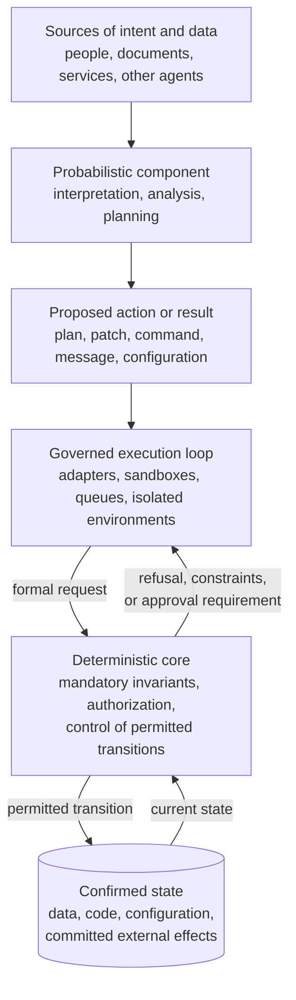

**Figure 5.1 — Trusted boundary and transition to confirmed state in a CHLOYA system**

The diagram does not connect the probabilistic component directly to confirmed state. That does not mean that several physical services must always intervene. Its meaning is mandatory logical mediation: an AI result must be converted into a controlled request and pass through a mechanism that the model cannot disable or redefine by itself.

The execution loop is not fully trusted by default either. Its role is constrained execution of prepared operations; the core decides whether a final transition is allowed. Depending on the architecture, part of the execution loop, such as process isolation or network restriction, may belong to the TCB. The important matter is not where a rectangle sits in the diagram but the explicitly defined responsibility of every mechanism.

Feedback from confirmed state to the core shows that permissibility depends on the current state of the system. An operation permitted before a role, limit, object version, or task status changed may become impermissible afterward. The core must decide from authoritative data, not from the model's account of what it believes the current state to be.

### 5.2.10. CHLOYA Position

CHLOYA does not treat the deterministic core as a replacement for AI or as a demand to move all application logic into a centralized monolith. The core is the minimal trusted set of mechanisms on which the system's mandatory properties depend.

In this context, determinism means unambiguous application of binding rules under stated, confirmed conditions. The core may take account of context, roles, state, and policy version, but it must not change a decision under pressure from the model's free-form persuasion or untrusted content.

The primary object of control is the transition from proposed to confirmed state. An AI result may be high quality, useful, and ready for application, but its status is determined not by model confidence but by completion of the architecture-defined path.

The trusted boundary may be distributed across an application, database, policy engine, operating system, platform, and other mechanisms. Yet every path to a protected effect must pass through it. The existence of even one bypass means that the boundary is declarative rather than real.

## 5.3. Separating Reasoning, Authorization, and Execution

### 5.3.1. Limits of a Single “Reason and Act” Loop

Linking reasoning to the ability to use tools has become a major source of the practical value of modern AI agents. In the ReAct approach, a model alternates between deriving the next step, performing an action, and examining the result, enabling it to refine its plan as it interacts with the environment [117]. This loop is well suited to information retrieval, repository exploration, fault diagnosis, and other tasks for which the sequence of actions cannot be fully determined in advance.

Yet directly connecting a model decision to execution creates a fundamental architectural problem. If a tool call produced by a model is automatically treated as an authorized action, the probabilistic component simultaneously determines the aim of the next step, selects an operation, specifies its parameters, and initiates an actual change in the external environment. An interpretation error, an unreliable tool result, or an instruction injected into external context may then become a system effect without crossing a separate boundary.

The ReAct loop itself does not require giving a model uncontrolled authority. A tool call can be treated not as a decision already made, but as a proposal that must pass through an independent admission mechanism. CHLOYA therefore retains the benefits of reactive planning while separating the intellectual choice of the next step from the right to carry it out.

> **A model-generated tool call is an action proposal, not evidence that the action is permissible.**

This distinction is especially important for operations affecting confirmed state, external communications, confidential data, access rights, publication, financial commitments, or production infrastructure. The greater the possible effect, the more dangerous an architecture becomes when reasoning and execution are joined in a single undivided loop.

### 5.3.2. The Reasoning Loop

The reasoning loop receives human intent, available context, observable results of earlier steps, and information supplied by tools. Its task is to interpret the goal, assess the current situation, explore possible solutions, and select the next proposed action.

Variation is acceptable within this loop. Different models, or separate runs of the same model, may suggest different plans, decompose a task differently, or choose different means of achieving a result. Language models, conventional algorithms, specialized analysers, and human decisions may all be used together here. CHLOYA does not require this process to be made fully deterministic.

The reasoning loop must not, however, define its own authority. Having a goal does not entail a right to use any technically available means of achieving it. A user's request to “fix the publishing problem” does not automatically authorize an agent to disable branch protection, alter secrets, send source code to an external service, or publish a new release. A model may consider those actions logical continuations of the task, but their permissibility is determined separately.

The output of the reasoning loop is a plan, recommendation, or proposal for a concrete action. It is not yet a decision by the trusted part of the system and must not directly change confirmed state.

### 5.3.3. Action Proposals and Action Contracts

Free text is useful for discussing goals, explaining a decision, and interacting with a person, but it is poorly suited to mandatory control. The wording “old data should be cleaned up” does not specify which data are old, in which environment the operation is to run, how broad the deletion may be, or on whose behalf it is initiated.

Before the trusted boundary, a model decision must therefore be represented as an [action proposal][g-action-proposal]. It records the specific operation type, initiator, target resource, material parameters, execution environment, expected effect, and other information required to apply policy. Instead of a generic instruction to clean data, for example, the system can receive a proposal that a maintenance agent requests deletion from a test audit log of records created before a specified date, with the expected volume calculated in advance.

The methodology does not prescribe the format of an action proposal. A particular implementation may express it as a typed object, message, restricted API call, domain command, or another formal structure. What matters is that the mandatory mechanism is not forced to infer the meaning of an operation from the model's arbitrary explanation.

The schema that specifies the permitted form and semantics of a proposal constitutes an [action contract][g-action-contract]. It defines which operations exist, which parameters are required, which constraints apply, and which result can be returned. The contract does not establish a right to perform the operation; it only translates model intent into a form suitable for unambiguous control.

This distinction keeps natural language inside the intellectual loop without turning it into an interface for privileged execution.

> **An action proposal is an instance of a request; an action contract defines its permitted form.**

The model's explanation may accompany such a proposal and be useful to a person, for auditing, or for further analysis. The persuasiveness of the explanation, however, must not create authority that does not exist and cannot replace mandatory request parameters.

### 5.3.4. The Authorization Loop

In its conventional sense, authorization answers whether a subject may perform an action on a particular resource. In CHLOYA, the term is used more broadly: it includes the binding decision whether a specific action may proceed to execution.

The authorization loop must determine whether the proposed operation is permissible on behalf of the stated initiator, for the specified resource, with the declared parameters, in the current environment, and in the system's actual current state. It uses authoritative information about the subject, resource, applicable policies, granted delegation, and other mandatory conditions. A model's description of the current situation must not substitute for data held by the trusted system.

Authorization need not result in a simple allow-or-deny decision. An action may be permitted only in a test environment, limited to a defined number of objects, routed for additional confirmation, or returned for replanning. Such conditions must be expressed formally and must bind the execution loop.

Specialized policy engines already separate an application request from the formal decision on its permissibility. Open Policy Agent separates evaluation of a policy decision from its enforcement by the system [114]. Cedar receives an authorization request containing a subject, action, resource, and context, then evaluates it against explicitly specified policies [115]. These projects do not automatically solve every problem of AI agents, but they demonstrate that a binding decision can—and should—sit outside a model's free-form reasoning.

Using an additional model to assess the first agent can improve quality, expose a contradiction, or help determine risk. The second model remains a probabilistic component, however: it can share similar mistakes, depend on the same untrusted context, or be bypassed by an adaptive attack [86]. Model-based assessment can therefore be an input to a decision, but it must not remain the sole mechanism separating a prohibited action from execution.

The CaMeL and FIDES research projects follow precisely this direction: the probabilistic component is used to process natural language and construct decisions, while binding constraints on control and information flows are enforced by external mechanisms [83], [85].

> **The component that formulates an action must not be its sole arbiter of permissibility.**

### 5.3.5. The Execution Loop

The execution loop receives an authorized operation together with its established constraints and performs it within the authority granted. Its task is precise application of the decision, not renewed interpretation of the original goal.

If it is authorized to change one object, the executor must not extend the operation to neighbouring objects on its own initiative. If reading is authorized, it cannot substitute writing. If it may send a message to a specified recipient, it must not expand the recipient list on the assumption that doing so would be useful.

The executor must therefore not decide again what the user “really meant.” A change in the meaning of an operation creates a new action proposal that must undergo authorization again.

Where possible, authority granted to the executor should correspond to the particular operation and the time at which it is performed. Technical access to a tool should not be equated with a standing right to use all of its functions and resources. Identity, delegation, and least privilege are examined in detail in Section 5.5.

The practice of contemporary coding agents reflects movement toward this separation. In Codex, the model proposes commands and changes, while the sandbox, network restrictions, and approval policy define the space in which execution is actually possible [3], [37], [102]. Claude Code likewise uses filesystem and network isolation to limit possible impact independently of the content of a model decision [4], [103]. These mechanisms do not guarantee the absence of every error, but they prevent security from being reduced to the probability that a model behaves correctly.

The executor returns an observable operation result: an external-system response, exit code, information about changed objects, or a description of a failure. Starting a command must not automatically be treated as confirmation that the goal has been achieved. Applying a result to confirmed state and managing side effects are considered in more detail in Section 5.8.

### 5.3.6. Failure, Feedback, and Replanning

Execution may end in outcomes other than success. The target resource may have changed after the proposal was made, authority may have been revoked, a parameter may no longer satisfy policy, or an external system may return an error. In such cases, the executor must not change the meaning of the authorized operation on its own merely to complete the task.

Safe behaviour is to return the observed result to the reasoning loop. The model can take the failure into account, revise its plan, and create a new action proposal. The alternative must still follow the same formalization and authorization path. A previous refusal does not create a right to use broader authority.

For example, if an agent cannot read a file because it lacks access, it must not automatically try to change the file owner, obtain an administrative role, or copy the contents through another channel. These are new operations with a different risk level and require separate admission.

The history of steps already taken must not disappear. An action that is formally permissible can become impermissible because of the preceding sequence of operations. *Policies on Paths* proposes that run-time authorization consider not only an individual call but also the [agent execution trajectory][g-agent-execution-trajectory], the agent's identity, and the organization's current state [108]. Accumulated risk and control of step sequences are examined in Section 5.7.

Feedback thus preserves an agent's adaptability without allowing it to expand its authority through a sequence of failed attempts.

### 5.3.7. Plan Authorization and Action Authorization

Advance agreement on an overall plan is useful, but it is not always sufficient to control execution. A high-level formulation may look safe while impermissibility arises only when a specific resource, parameter, or recipient is selected.

A plan to “obtain information on arrears and notify the customer” does not determine whose data will be read, what information will appear in the message, who will receive it, or which communication channel will be used. Approval of the goal therefore does not automatically authorize every action the model can infer from that goal.

Depending on risk, a system may authorize an entire pre-formalized plan or separately control material steps. If state or context changes during execution, a decision made earlier may need reconsideration.

Open Agent Passport describes similar mediation as pre-authorizing a tool invocation: the proposed action is intercepted synchronously and matched against declarative policy before execution begins [107]. The project remains research work and is not a universal industry solution, but its framing accords with the CHLOYA principle: mandatory control must be applied before an effect arises, not merely analyse it afterward.

### 5.3.8. Logical and Physical Separation

Separating reasoning, authorization, and execution does not require three microservices, three repositories, or three independent models. In a small application, all functions may be located in one process if the model cannot alter the mandatory check, bypass its interface, or directly use broader technical authority.

The converse is also true. Deploying components in separate containers does not establish real separation if the reasoning agent holds the executor's direct credentials or has another route to the protected resource.

An architectural boundary is determined not by the number of processes but by the impossibility of bypassing the division of responsibility. For higher-risk cases, logical separation can be reinforced by separate authorization services, isolated executors, temporary credentials, and network restrictions. For a low-risk local tool, typed interfaces, a limited set of operations, and a technical sandbox may suffice.

A single language model may also participate at several stages. For example, it can first construct a plan and then transform it into a formal action proposal. Another model can analyse the proposal or prepare an explanation for a person. Dividing functions among several LLMs, however, does not by itself create an independent authorization loop.

> **Separating several model roles is not the same as separating reasoning, authorization, and execution.**

The trusted boundary arises when the binding decision is made by a mechanism with formal inputs, protected state, and no ability to execute or alter the model's proposal on its own.

### 5.3.9. The Path of an Action Proposal

Figure 5.2 shows the path from intent and available context to controlled execution. Policies and authoritative data flow directly into the authorization loop; a person or another authorized role participates only when the character of the operation requires it.

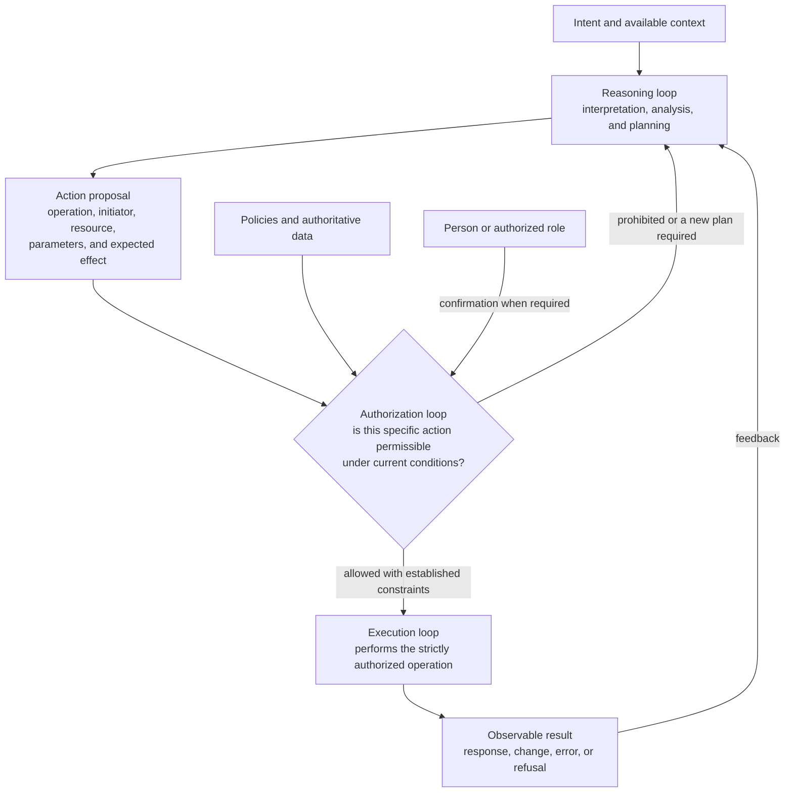

**Figure 5.2 — The path of an action proposal from the reasoning component to controlled execution**

The diagram does not show a separate stage for final commitment of a side effect, because that stage is considered in Section 5.8. Here, the execution loop denotes performance of the authorized operation, not automatic recognition of every outcome as confirmed state.

Feedback returns to the reasoning loop, allowing the agent to adapt its plan. A new step does not inherit permission automatically: each new proposal undergoes the required control in light of the current state and the actions that preceded it.

### 5.3.10. CHLOYA Position

CHLOYA separates intellectual exploration of a solution, the binding decision on its permissibility, and technical execution. This separation makes it possible to use AI's variability without granting the probabilistic component complete control over its own authority and the system's consequences.

The reasoning loop interprets the goal and forms an action proposal. The action contract translates that proposal from free natural language into a form suitable for unambiguous control. The authorization loop applies policies and authoritative information, then permits, constrains, routes for confirmation, or prohibits the action. The executor performs only the permitted operation and has no right to broaden its meaning on its own.

A failure or change of state returns the task to planning, but creates no additional authority. A new way to achieve the goal forms a new proposal and undergoes a new admission cycle.

> **The reasoning component determines what can be proposed. The authorization loop determines what may be performed. The executor implements only the authorized action and does not change its meaning.**

This separation does not reduce an agent's autonomy in itself. On the contrary, it makes it possible to extend self-directed operation safely within a predefined scope because a reasoning error receives no direct, uncontrolled path to a system effect.

## 5.4. Policies: Formalization, Enforcement, and Lifecycle

### 5.4.1. From an Organizational Requirement to a Binding Rule

The separation of reasoning, authorization, and execution examined in Section 5.3 raises the next question: on what basis does the authorization loop permit, constrain, or prohibit a proposed action?

At the human or organizational level, such rules often exist as general requirements: internal code must not be published without the required approval; personal data must not be sent to an unsuitable external provider; a production-database change requires additional confirmation; an agent must not consume computing resources beyond an established limit. These statements convey intent, but do not by themselves identify the subjects, actions, resources, and circumstances to which a restriction applies.

A requirement becomes an enforceable policy rule only when the system can determine its scope, inputs, possible decisions, and technical enforcement point unambiguously. To prohibit code publication, it is necessary to define what counts as publication, which objects are internal code, on whose behalf the executor acts, what approval is sufficient, and which component can prevent the operation when that approval is absent.

CHLOYA defines a [policy][g-policy] as an explicitly formulated, versioned rule that links an organizational requirement to a computable decision on the permissibility of a specific action and to the binding mechanism that enforces that decision.

> **A policy tells the system not only what behaviour is desirable, but also the conditions under which a concrete action is permitted, constrained, routed for further review, or prohibited.**

Policies in this sense are not limited to information security. They can govern confidentiality, publication, model selection, access to tools, a compute budget, the degree of autonomy, the scope of bulk changes, the need for a test environment, human involvement, and other material aspects of agent operation.

### 5.4.2. Policy, Instruction, Decision, and Enforcement Mechanism

An agent system must distinguish a textual instruction to a model, a formal policy, the result of evaluating that policy, and the mechanism that gives the decision effect.

An instruction such as “never send confidential information to external services” influences model behaviour and reduces the likelihood that a prohibited action will be proposed. It does not prevent a violation, however, if the agent already has the data, network access, and a sending tool. It remains part of the probabilistic loop.

A formal policy must operate on characteristics that the system can establish independently of the model's conviction: data category, destination service, storage mode, initiator role, active delegation, and execution environment. From this information, the authorization mechanism reaches a decision and the execution boundary ensures compliance with it.

A policy decision is not the same as execution. A policy engine may correctly return a denial, yet no actual protection results if the application ignores the response or the agent retains another path to the resource. Amazon Verified Permissions explicitly separates evaluation of an authorization response from its enforcement: the service makes a decision, whereas the client application must block the action when the response is `deny` [120]. XACML and the NIST ABAC model similarly separate the point at which a decision is made from the point at which it is enforced [118], [119].

Finally, a decision log is not the policy itself. It records which rule was applied, which data entered the evaluation, and what response was returned. This evidence is needed for diagnosis and audit, but it does not replace mandatory mediation before an effect occurs.

CHLOYA therefore distinguishes four connected but different entities:

> **An organizational requirement explains intent. A policy formalizes a condition. The authorization mechanism computes a decision. The enforcement point makes that decision binding on the executor.**

A rule that exists only in a prompt or in documentation can be regarded as a behavioural instruction, but it is not a policy of the trusted boundary until a technically enforceable means of applying it has been defined.

### 5.4.3. Policy Management and Enforcement Loops

Classical access-control models separate policy creation and administration, retrieval of necessary attributes, decision evaluation, and enforcement. In XACML, these functions correspond to the Policy Administration Point, Policy Information Point, Policy Decision Point, and Policy Enforcement Point [118]. NIST likewise defines the PDP as the component that computes authorization decisions under applicable policies and the PEP as the component that requests and enforces those decisions when a protected object is accessed [119].

CHLOYA does not require XACML terminology or format in every implementation. The value of the model lies in separating two loops.

The [policy management loop][g-policy-management-loop] governs the origin of a requirement, its formalization, validation, approval, storage, distribution, and activation. It determines who may create and change a rule, to which projects and environments it applies, and when a new version becomes effective.

The [policy enforcement loop][g-policy-enforcement-loop] operates while a task is being carried out. It receives an action proposal, the active version of rules, and authoritative data; evaluates a decision; passes it to the execution boundary; and preserves information about the result. A refusal received by an agent in the lower loop does not entitle it to enter the management loop and activate a more permissive version of a rule.

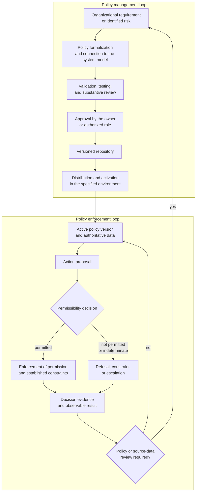

**Figure 5.3 — Policy lifecycle from organizational requirement to enforcement, observation, and review**

Closing the execution loop around the active policy version and authoritative data shows that repeated enforcement uses the current confirmed state. An observable result does not itself change a policy. If an error, new risk, or failure to meet requirements is found, a separate governed review cycle begins.

The revision stored in a repository, the approved revision, and the revision actually active in a particular environment can differ temporarily. A material decision must therefore be associated not merely with a policy name, but with the identifier of the version applied.

OPA distributes policies and related data through bundles. A bundle may have a revision and a digital signature; a new version is activated after verification, while OPA retains the preceding successfully loaded bundle on error [114]. This is a practical implementation of part of the lifecycle, but it does not relieve an organization of defining a rule owner, an approval procedure, and backward-compatibility requirements.

### 5.4.4. Domain Model and Typed Authorization

A formal policy does not exist apart from the system model. To evaluate an action's permissibility, the system must unambiguously understand who initiated it, what operation is requested, which resource is affected, and which circumstances matter to the decision.

NIST defines ABAC as an approach in which permission for an operation is evaluated from attributes of the subject, object, requested action, and, where necessary, environmental conditions [119]. This model can take account not only of a standing role but also of a particular resource, session state, device, time, data category, and other attributes.

Cedar structures an authorization request around four elements: `principal`, `action`, `resource`, and `context`. Together they form the [PARC][g-parc] model, which asks whether a particular subject may perform a particular action on a particular resource in the given context [115], [124].

This structure aligns well with the action proposal of Section 5.3. A model's free-form explanation is first converted into a typed request, after which a policy is applied to formal entities and authoritative data.

Context must not become a container for arbitrary information. In Cedar, subject, action, and resource are separate entities, while `context` is intended principally for request-specific data: session state, operation parameters, time, device characteristics, or delegation information [115]. This separation makes policies easier to analyse and reduces input ambiguity.

A Cedar schema describes the subject and resource types known to the system, permitted actions, entity attributes, and the expected context structure. It can reveal unknown types, incorrect attribute names, impermissible operations on a resource, and other inconsistencies before a policy is used at run time [115].

The schema effectively forms a contract between an application and its authorization rules. The application undertakes to provide requests and entities of the expected types, while policies are checked against this model. Changing the schema changes the authorization model and requires revalidation of associated rules.

Type correctness does not, however, prove that organizational intent is correct. A policy may use valid types and attributes while granting access to the wrong role or to the wrong resource category. Formal validation must therefore be complemented by scenario tests and substantive review by the requirement owner.

### 5.4.5. Cedar as an Example of a Typed Authorization Mechanism

Cedar is especially relevant to CHLOYA not because it must become mandatory technology, but because it demonstrates a useful combination of properties: separation of authorization from business code, a bounded domain model, typing, analysability, and an unambiguous decision-combining algorithm.

Cedar evaluates each policy against a PARC request and returns an `Allow` or `Deny` decision. If no permitting policy matches the request, the default is denial. A matching `forbid` policy takes precedence over `permit` policies [115], [124].

This behaviour is useful for protective constraints: permitting rules can expand access within an allowed area, but cannot override an explicit prohibition. The developer must nevertheless account for error semantics. A policy that ends with an evaluation error is skipped, and diagnostic information about the error is returned [115]. A system with elevated requirements should therefore not inspect only the final `Allow` or `Deny`; it may establish a stricter response when diagnostics contain errors.

Cedar does not give policies input/output, network access, or the ability to alter external state. Rules are evaluated as bounded expressions and are guaranteed to terminate [115]. This reduces the policy engine's own impact surface and brings it closer to the deterministic decision mechanism considered in Sections 5.2 and 5.3.

The project uses a formal semantic model in Lean, an implementation in a safe subset of Rust, and differential testing of the implementation against the formal model [124], [125]. Cedar research describes the language as a purpose-built authorization mechanism designed for readability, performance, security, and automated policy analysis [124].

Cedar does not decide every governance issue for a project. The open evaluator does not define the organizational policy owner, approval workflow, delivery of active versions, storage of complete authorization state, or enforcement by an application. Cedar evaluates the policies and data supplied to it; the project remains responsible for the correctness of the requirement, completeness of inputs, and impossibility of bypassing the result [115].

For CHLOYA, Cedar is a strong candidate where the principal question is:

> **May this subject perform this application action on this resource in the current context?**

That may mean permitting an agent to modify a branch, read a specified set of documents, invoke a particular tool, apply a migration in a test environment, or prepare a publication.

Amazon Verified Permissions provides a managed Cedar-based authorization service. It includes policy stores, schemas, static and template policies, decision APIs, and policy-management mechanisms [120]. This option reduces the amount of proprietary infrastructure, but creates dependence on AWS, its availability model, cost, consistency, and lifecycle of supported Cedar versions. Open Cedar and Amazon Verified Permissions should therefore be treated as different deployment options, not wholly interchangeable solutions.

### 5.4.6. Choosing Between Cedar and Other Mechanisms

CHLOYA should not compile a universal ranking of policy languages and systems. Cedar, OPA, OpenFGA, SpiceDB, Casbin, and XACML solve partially overlapping but non-identical problems. Selection should begin with the shape of authorization state and the kind of decision required, not with product popularity.

A dedicated policy engine is not needed where a restriction is local, changes rarely, and is already reliably enforced by a typed API, database constraint, file permissions, IAM, or another existing mechanism. Adding a layer increases operational complexity and creates another trusted dependency.

Cedar naturally fits typed application authorization where a request is expressed through subject, action, resource, and context, while rules must be separated from business code and checked against a domain schema [115], [124]. OPA is a more general policy-as-code engine. Its Rego language evaluates decisions over arbitrary structured data, enabling use not only for application authorization but also for configuration analysis, admission control, CI/CD, infrastructure manifests, and complex composite requests [114]. This generality is useful when policy does not fit a relatively narrow authorization-action model, but demands more discipline in designing input documents and responsibility boundaries.

OpenFGA and SpiceDB are fine-grained, relationship-based authorization systems that develop the ideas of Google Zanzibar. They store a graph of relationships among subjects, groups, organizations, and resources, and evaluate rights from those relationships [116], [121], [122]. This approach suits hierarchies, sharing, multi-user platforms, and reverse queries such as “which objects are available to this subject?”

SpiceDB separately offers consistency modes and revision markers that can associate a permission check with a particular state of the relationship graph [122]. This is important where a recently revoked permission must not remain effective because of a stale cache. Stricter consistency normally raises latency and load, so the required mode must be determined by the operation's risk.

Casbin is a more compact embedded approach. Its PERM model separates a request, policy rules, the method for combining results, and matching expressions, and can implement ACL, RBAC, ABAC, and hybrid models [123]. Casbin can be sufficient for a local or medium-sized application that does not require a separate distributed authorization service. The project must still arrange policy lifecycle, centralized approval, version delivery, and audit itself.

XACML is not merely a library, but a standardized model for policy language, requests, and the PAP, PDP, PIP, and PEP architectural roles [118]. It may be justified in an organization with existing XACML infrastructure, interoperability requirements, or a complex enterprise ABAC model. In a small new project, the standard's breadth and XML-oriented ecosystem may be excessive; CHLOYA should not require replacement of a working enterprise loop merely for a more modern syntax.

A complex system may combine several mechanisms. OpenFGA or SpiceDB can determine an agent's relationship to a project and repository, while Cedar or OPA checks additional restrictions on environment, data category, and current approval. Such a combination is justified when each mechanism has a clear responsibility area and there are no competing sources of truth for the same decision.

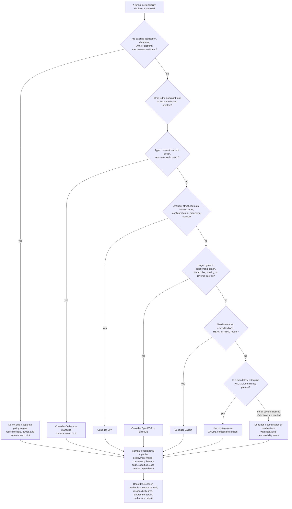

**Figure 5.4 — Selecting a policy mechanism by problem shape, location of authorization state, and operational constraints**

The diagram is not an automatic product selector. Boundaries between solution classes overlap: Cedar supports role, attribute, and some relationship constructs; OpenFGA augments a relationship graph with conditions; OPA can implement application authorization; and Casbin permits custom models. The diagram identifies the primary nature of the task; this must then be tested in a pilot against real project scenarios.

The final CHLOYA recommendation must consider not only language expressiveness but also deployment model, resilience, decision latency, consistency of authorization data, observability, available libraries for the relevant stack, team experience, licence, cost of ownership, and acceptable vendor dependence.

### 5.4.7. Policy Ownership, Approval, and Change

Every material policy must have a source of authority and an owner entitled to determine its content. The owner may be a particular person, role, team, resource owner, or a governing body established by the organization.

An agent may detect a conflict, prepare a change proposal, show the consequences of a current prohibition, or generate test cases. The component constrained by a policy must not, however, activate by itself a rule that expands its own authority.

> **AI may propose a policy change, but must not grant itself a right that it has been denied.**

A policy must have an explicit scope: a project, organization, environment, resource type, action class, or particular time period. A temporary exception must not silently become a standing permission. Its basis, owner, and expiry date or termination condition must be recorded.

Storing policies in Git provides change history and a review process, but does not prove that a particular revision was active at the time of a particular action. Prepared, validated, approved, distributed, and activated versions must therefore be distinguished.

Critical rules may require separation of duties: one participant prepares a change, another confirms it, and a technical process distributes the approved version. The strictness required should reflect the policy's consequences and should not turn every minor correction into a burdensome procedure.

### 5.4.8. Validation, Testing, and Conflicts

Policies are software artefacts and can contain errors. An error in one rule can systematically allow prohibited operations or block legitimate work by many users and agents.

Technical policy verification must cover at least syntactic and type correctness, expected decisions in representative scenarios, and consistency with the organizational requirement. The first level reveals impossible or invalid constructions. The second shows behaviour in permitted, prohibited, and boundary cases. The third requires substantive review by the owner, because neither a compiler nor a validator knows which business decision an organization actually intended to establish.

OPA provides built-in support for Rego tests and rule-coverage measurement [114]. Cedar checks policies against an application schema and can reveal a range of type errors, unknown attributes, and impermissible combinations of actions and resources [115]. Cedar's formal model and differential testing increase confidence in the evaluator itself, but do not prove the correctness of a particular user policy [124], [125].

When the system schema changes, associated rules must be revalidated. A policy that was once correct may refer to a changed type, obsolete attribute, or action whose semantics have changed.

Several policies can apply to the same proposal at once. XACML provides algorithms for combining decisions, and the NIST model assigns the PDP the application of policies and metapolicies, including conflict resolution [118], [119]. Cedar uses a fixed scheme: an explicit prohibition takes precedence over permission, and the absence of a matching permission results in `Deny` [115].

CHLOYA does not impose one composition algorithm for every class of constraint. A project must define the algorithm explicitly, however. The outcome must not depend on an accidental file-loading order or on a model's interpretation.

> **The rule for combining and prioritizing policies is itself a higher-level policy.**

### 5.4.9. Indeterminacy and Safe Behaviour

Policy evaluation can result in more than permission or denial. Necessary attributes may be missing, schema versions may be incompatible, an authoritative source may be unavailable, or the evaluator may fail.

Indeterminacy must not silently be treated as permission for a material system effect. For a critical operation, lack of confirmed authority should normally lead to denial, a constrained mode, or escalation.

A universal `deny by default` does not necessarily suit every policy type. Where a rule controls an optional recommendation, absence of policy may mean proceeding without an extra restriction. Safe behaviour must therefore be defined for every decision class with the cost of error in mind.

Failure of the policy engine itself must be considered separately. A centralized authorization service can become a common point of failure. A project must determine whether caching decisions, using the last known version, local evaluation, or a complete halt of protected operations is permissible.

For operations where unauthorized permission has a high cost, continued availability must not automatically take priority over policy compliance. A limited fallback may be acceptable for a low-risk function. The decision must be made in advance rather than left to an agent at the moment of failure.

### 5.4.10. Observability and Feedback

To reproduce a material decision, it must be possible to know which action proposal was considered, which policy version was applied, which authoritative data were used, and which decision was returned.

OPA decision logs can include request input, result, information on the requested policy, a decision identifier, and metadata of the active bundle [114]. Cedar returns diagnostics about the policies that determined the result and errors in individual rules [115]. OpenFGA and SpiceDB provide their own relationship and permission-check queries, while SpiceDB can tie an evaluation to a particular revision of authorization state [121], [122].

Logs must not indiscriminately retain confidential inputs. Policy observability is itself subject to minimization, access-separation, and retention requirements.

The collected information is useful not only for investigation. It can expose excessive denials, rarely used permissions, frequent escalations, obsolete rules, and divergence between an organizational requirement and actual system behaviour.

Detailed requirements for auditing and evidence of policy compliance are examined in Section 5.12. For Section 5.4, the essential point is that observability is part of the lifecycle, not an optional feature added after an incident.

### 5.4.11. AI Participation in the Policy Lifecycle

AI can assist at different stages of policy work. It can turn an organizational requirement into a draft formal rule, find potential conflicts, prepare test scenarios, explain the consequence of a change, and compare a proposed revision with the active one.

Policy generation is especially sensitive, however. A rule can appear logical, compile successfully, and still grant access the owner did not intend to permit. A model output must therefore be checked against the schema, scenarios, and an approved statement of intent.

The AutoCedar project investigates a verifier-guided approach in which natural-language requirements are first transformed into verifiable assertions about desired behaviour; a model then synthesizes a Cedar policy and receives formal feedback about discrepancies [126]. This is a recent preprint and does not yet establish a universal industrial process, but it illustrates a direction consistent with CHLOYA: AI does not merely generate a rule, but works against an intent boundary that has been approved and can be checked.

The scenario in which an agent rewrites a policy and retries an action after a denial is particularly dangerous. Proposing a review is permissible, but the change must enter the policy-management loop, receive an owner, validation, approval, and separate activation.

> **AI may participate in creating and analysing a policy, but its right to activate one is determined by policy-management policy.**

### 5.4.12. CHLOYA Position

CHLOYA regards policy as the link between organizational intent and a technically binding decision on an action's permissibility. A textual requirement or model instruction creates no system guarantee until formal inputs, the decision algorithm, and its enforcement point have been defined.

Policies must be separate from a model's free-form reasoning and have an owner, scope, version, and established lifecycle. A prepared revision is not active automatically, and an agent's denial does not entitle it to change the rule that constrains it.

CHLOYA does not prescribe one language or engine. Cedar fits typed authorization of application actions; OPA fits general rules over structured data and infrastructure; OpenFGA and SpiceDB fit large relationship graphs; Casbin fits compact embedded authorization; and XACML fits standardized enterprise loops. A separate policy engine is unnecessary if an existing mechanism already enforces the rule more reliably and simply.

Selection must consider not only expressiveness but also the location of authorization state, consistency, latency, observability, deployment model, cost of ownership, and vendor dependence. In a complex system, mechanisms may be combined when their responsibility areas are explicitly separated.

> **A policy becomes part of the trusted boundary not because it is written in a special language, but because its decision cannot be bypassed, the applied version is known, and the right to change it is separate from the component it constrains.**

The next section considers identity, delegation, and least privilege—information without which a formal policy cannot determine on whose behalf an agent acts or what range of capability it has actually been granted.

## 5.5. Identity, Delegation, and Least Privilege

### 5.5.1. From Policy to the Subject of an Action

The formal [policy][g-policy] considered in Section 5.4 does not decide about an abstract action in general; it decides about an action by a particular subject on a particular resource under specified conditions. Its enforcement therefore requires unambiguous identification of who is actually addressing the system, on whose behalf that party acts, and what authority has been delegated.

In an ordinary application, the subject is often a person signed in to the system or a service with a standing technical account. In an agent architecture, this model becomes more complex. A user states a goal, an agent interprets it and builds a plan, an execution component invokes tools, and an external model can participate in choosing the next step. If all these roles are hidden behind one user token or a shared service account, the system loses its ability to distinguish a human decision from an agent action and to establish the boundaries of the delegation actually granted.

NIST treats identification and authorization of software and AI agents as a distinct, current problem. Its 2026 concept paper identifies agent identification, authorization of agent actions, audit, accountability, and use of existing or emerging identity-management standards among the key questions [129]. The area is also part of NIST's initiative on AI-agent standards [101].

For CHLOYA, identity, authentication, authorization, and delegation are fundamentally distinct. Identity associates a participant in an interaction with a distinguishable system entity. Authentication confirms a claimed identity. Authorization determines whether a specific action is permissible. Delegation establishes the basis on which one subject may act on behalf of another.

Possession of a confirmed identity does not confer authority. Equally, the fact that a user has a particular right does not mean that the right is automatically passed to every agent that user starts.

> **A user's right to initiate an agent task is not the same as an agent's right to use all of the user's authority.**

This principle accords with [zero-trust architecture][g-zero-trust], in which trust does not arise merely from network location, organizational ownership of a device, or a previously established session. NIST separates authentication of a subject and device from authorization to access a particular resource and requires a decision for every protected interaction [127].

### 5.5.2. Authority Holder and Actual Executor

For a material agent action, the distinction between the holder of authority and the [actual executor][g-actor] must be retained.

The authority holder may be a person, organization, service, or defined role that possesses the original right to perform an action or transfer a limited part of it. The actual executor is the agent, workload, or execution component that directly initiates the technical operation.

For example, an employee may have the right to publish an organization’s package. It does not follow that a coding agent should receive the employee’s standing token and be able to publish arbitrary packages on its own. A more governable architecture records that publication is performed on behalf of the employee or organization, while the actual executor is a defined agent instance acting within one task and a limited delegation.

This distinction reduces the risk of the [confused-deputy problem][g-confused-deputy]. It arises when a component with broad authority is used by a less privileged party to perform an action that party could not perform itself [140]. In an agent system, an untrusted document, message, or external service can attempt to induce an agent holding user authority to act for another subject’s benefit.

If a system retains only the user’s identity, an agent action is externally indistinguishable from that user’s manual action. If it retains only a shared identity of the agent platform, it cannot establish on whose behalf and within which task an operation was performed.

CHLOYA therefore requires [dual attribution][g-dual-attribution] for material actions: information about the holder of delegated authority must be preserved together with information about the actual executor. For more precise reconstruction, these are joined by a task or session identifier and a reference to the particular delegation.

> **The system must answer not only “whose authority was used?”, but also “which executor actually used it?”**

The name of a model provider does not replace the executor's identity. Labels such as `GPT`, `Claude`, `Gemini`, or `local model` identify the origin of a probabilistic component, but do not establish a specific process, execution instance, authority holder, or delegation conditions. A model belongs to decision provenance and execution configuration; it is not an independent source of organizational authority.

### 5.5.3. Agent-Execution Identity

An agent can have a stable logical identity—for example, the identity of an organizational repository-maintenance agent. A particular task, however, is performed by a separate instance with its own context, lifetime, and work scope.

It is therefore useful to distinguish the identity of an agent class from an [agent execution identity][g-agent-execution-identity]. The former identifies the component or profile performing a function. The latter associates a specific session with a task, environment, configuration version, delegation holder, and observed actions.

Using only a stable service account merges all runs. Compromise of one instance can grant it authority intended for other tasks, while a log shows only a general service name. A solely temporary identifier, conversely, can make it difficult to establish which approved component ran. Systems with elevated risk should therefore retain a link between stable and temporary identities.

In distributed infrastructure, [workload identity][g-workload-identity] mechanisms address this problem. NIST SP 800-207A extends zero-trust principles to cloud-native applications and requires application and service identities to be considered alongside user identities and network characteristics [128].

[SPIFFE][g-spiffe] defines a portable workload identity through a SPIFFE ID and verifiable [SVID][g-svid] documents. A workload obtains an SVID at run time through the local Workload API, while [SPIRE][g-spire] can attest nodes and processes before issuing an identity [130].

For CHLOYA, SPIFFE and SPIRE are examples of implementation, not mandatory components. In a small local application, an agent execution can be identified through an isolated process, protected session, and record in a local control loop. Dedicated workload-identity infrastructure becomes justified when agents run across nodes, containers, clouds, or organizational domains.

Regardless of implementation, a material identity must not be issued on an agent’s own assertion. A model cannot declare itself a deployment agent and thereby acquire the corresponding rights. The link between identity and workload is established by a trusted environment, attestation system, control process, or another mechanism outside the model's free-form reasoning.

### 5.5.4. Delegation and Impersonation

An agent can interact with an external system in two fundamentally different ways: acting as a user or acting on behalf of a user.

With [impersonation][g-impersonation], an external resource perceives the agent as the user. A log can fail to distinguish a manual operation from one performed by an automated executor. This simplifies integration with systems that support only user tokens, but risks giving the agent the entire set of user rights.

With explicit delegation, the identities of both parties are preserved. The resource or authorization loop sees the subject whose right is used and the executor that actually performs the action. This permits separate constraints for agents, revocation of their authority independently of the user account, and correct attribution.

[OAuth 2.0 Token Exchange][g-token-exchange] formalizes exchange of one set of credentials for another and distinguishes a primary-subject token from an actual-executor token. The standard can also represent the current executor and permitted delegation party in token claims [131].

Token Exchange alone does not guarantee minimal delegation. It provides an exchange mechanism; the authorization server determines the rules of permissibility, audience, lifetime, and actual scope of the new token. A defective policy can exchange limited original authority for authority that is excessively broad.

CHLOYA therefore prefers explicit delegation, but evaluates not the protocol’s name, rather the properties retained: distinguishability of subject and executor, a limited scope, lifetime, revocability, and binding enforcement of the decision by the resource.

Impersonation remains an acceptable compromise when an external system does not support a more precise model. In that case, the user authority should be hidden behind a controlled adapter, while CHLOYA's own loop separately records the actual executor, task, and constraints applied.

> **An agent should act on behalf of the authority holder, rather than become indistinguishable from that holder where the architecture can retain the distinction.**

### 5.5.5. The Delegation Envelope

A task statement describes a desired result, but does not automatically determine permissible means of achieving it. A request to “fix the deployment problem” does not confer a right to delete a cluster, alter billing, obtain every organizational secret, or disable mandatory checks.

CHLOYA therefore introduces the [delegation envelope][g-delegation-envelope]. This methodological construct describes the boundaries of authority passed to a particular agent execution. It does not prescribe a token format and may be implemented by a control-system record, a set of policy attributes, a temporary role, a capability, an OAuth token, or a combination of mechanisms.

The envelope binds the authority holder, actual executor, and task. It specifies allowed operations, available resources and environments, lifetime, permitted scale, data and external-destination constraints, and the possibility of further delegation.

For example, authority to modify code may be limited to the working copy of one repository, specified directories, one task, and its execution time. It may permit creating a patch and running tests, but not publishing a branch, altering secrets, or deploying to production.

OAuth [scopes][g-scope] can limit classes of permitted operations, while a [resource indicator][g-resource-indicator] associates a token with one protected resource or a small group of resources [134]. [Rich Authorization Requests][g-rar] complement ordinary scopes with detailed parameters when a particular action type, object, amount, recipient, or other condition must be expressed [135].

These standards can help implement an envelope but do not exhaust it. Filesystem restrictions, network rules, quotas, a sandbox, and confirmation requirements may be enforced by other components.

> **Intent defines the goal of work. The delegation envelope defines the space of means by which an agent may achieve it.**

The envelope must be associated with a policy version and the current state of authority. A historical user message is not indefinite evidence of a current permission.

### 5.5.6. Least Privilege and Attenuable Authority

The principle of least privilege requires granting a subject only the capabilities needed to perform its function [111]. For an AI agent, that general definition is insufficient: its task changes, its sequence of actions is not fully known in advance, and technically available tools may permit far more than the current step requires.

Minimality must therefore be assessed across several dimensions. Authority is constrained not only by operation type, but also by the particular resource, environment, time, data volume, number of objects, external destination, budget, and permissible system effect.

Permission to read data does not necessarily include a right to send them to a model. The right to alter a working copy does not include publication. The ability to prepare a migration does not entail a right to apply it to a production database. Access to a tool interface does not confer authority to use all of its methods.

OAuth Security Best Current Practice recommends limiting tokens by privilege and audience and, to reduce the effect of leakage, binding them to a particular resource and, where possible, sender [132]. Least privilege is not reducible to correct OAuth configuration, however. The restriction can be enforced by the filesystem, database, policy mechanism, network intermediary, sandbox profile, or domain API.

For a multi-agent system, an additional principle of [delegation attenuation][g-attenuation] applies:

> **Each subsequent delegation level may preserve or narrow authority passed to it, but must not expand it.**

If a primary agent has access only to a test environment, a subagent must not use its own broad account to access production infrastructure. If an agent may read one repository, a connected tool must not inherit permission to read an entire organization.

[Capability][g-capability]-based security models can express such narrowing through added [caveats][g-caveat]. Macaroons cryptographically bind these conditions to authority; a later delegation can add restrictions but cannot remove those already established [139].

In 2026, IETF preliminary proposals appeared for agent tokens with attenuable delegation. The Attenuating Authorization Tokens draft describes tokens that can constrain available tools, their call arguments, depth of onward transfer, and lifetime; derived authority must not exceed its parent [141]. The document is an Internet-Draft, not an adopted standard, but it confirms the relevance of multi-step agent delegation.

In CHLOYA, onward transfer of authority is prohibited by default. A right to create subordinate delegations must be granted separately, have limited depth, and preserve a traceable chain of holders and executors.

### 5.5.7. Credential Broker

Even correctly defined delegation does not provide security if a standing secret is placed in advance in the model context, process variables, or a shared tool set. Having acquired such a secret, a compromised agent can use it while bypassing later policy decisions.

CHLOYA therefore requires a [credential broker][g-credential-broker] between logical permission and technical access. This is a logical role of the trusted loop that, after authorizing a concrete proposal, grants the executor short-lived and limited technical authority.

The model need not see a secret's contents. It forms an [action proposal][g-action-proposal]; the authorization loop verifies identity and delegation; the broker then gives the execution component a token, certificate, temporary role, capability, or a controlled connection to the resource.

The broker may be implemented as a separate service, IAM platform, [security token service][g-sts], local protected process, or tool adapter. In a small application, it may exist within one process if the model cannot obtain standing credentials or bypass the check.

Contemporary cloud platforms apply this approach through [workload identity federation][g-workload-federation]. Google Cloud can exchange an external workload identity for short-lived authority without distributing a standing service-account key [136]. Microsoft Entra Workload ID can trust tokens from an external identity provider and obtain access to protected resources without managing a standing application secret in supported scenarios [137]. AWS IAM Roles Anywhere uses certificates from external workloads to issue temporary IAM-role authority instead of long-lived access keys [138].

These solutions differ in trust model, supported platforms, and operational constraints, but express a common principle:

> **A standing secret is not handed to an agent for storage; technical authority is issued to a workload for a limited time after its identity and right have been checked.**

A short lifetime reduces the window for misuse but does not correct an excessive scope. A five-minute token granting administrative access to an entire organization remains overprivileged. Lifetime, audience, and scope must therefore be constrained together.

### 5.5.8. Binding Authority to an Executor

Most ordinary OAuth access tokens are [bearer tokens][g-bearer-token]: a resource permits an action to whoever presents the token. If such a token reaches another process, that process can use it until expiry or revocation.

A short lifetime reduces the possible duration of misuse, but does not prove that a request comes from the workload to which the token was issued. For sensitive actions, authority should, where possible, be bound to a particular executor or a key it owns.

A [sender-constrained token][g-sender-constrained-token] requires proof of possession of an associated key. One binding mechanism is [DPoP][g-dpop]: for each request, a client proves possession of a key pair, and the issued token is bound to the client’s public key [133].

DPoP is not an authorization mechanism in its own right and does not establish an operation's permissibility. It strengthens the link between an already issued token and its sender [133]. [mTLS][g-mtls], X.509-SVID, hardware-protected keys, and other proof-of-possession mechanisms can perform a similar function.

For CHLOYA, three assertions must be kept distinct: a token exists; the token permits a specific action; and the token is presented by the executor to which it was issued. The first concerns possession of credentials, the second authorization, and the third binding authority to a workload.

> **Possession of a token string must not automatically be the sole proof that an agent execution may perform a sensitive action.**

The strength of the binding should match risk. For local reading of a temporary file, elaborate cryptographic infrastructure may be excessive. For publication, payment, changing access rights, or inter-organizational interaction, sender-constrained credentials materially reduce the consequences of token leakage.

### 5.5.9. Expiry, Revocation, and Re-evaluation

Delegation has its own lifecycle. It can end when a set time expires, a task completes, the holder revokes it, a role changes, a project ends, an agent is compromised, or the state of a protected resource changes.

Ending an agent session must terminate not only computation but also the associated temporary authority. A standing service account must not remain the hidden inheritance of a completed task.

Short-lived tokens reduce the need to distribute revocation immediately, but do not eliminate it. Long-running tasks can require renewed acquisition of authority and re-evaluation of the current delegation. A model's earlier conclusion that “this action was permitted” does not establish that permission remains after a role, policy, or resource state changes.

Revoking a parent delegation must affect derived authority. If a system permits multi-stage transfer, it must know the delegation chain and be able to stop issuing or using child authority. The mechanism may use short lifetimes, state checking at every access, a revocation list, [token introspection][g-token-introspection], or a combination of these approaches.

Not every action requires continuous online checking. A completely local capability can be verified without contacting a central service. In that case, the possibility of immediate revocation is normally traded for a short lifetime, narrow scope, and other limiting conditions. This trade-off must be chosen consciously.

Change of context between authorization and execution is especially important. If an agent received authority to modify a particular object version and another participant updated it, the old permission may not apply to the new state. For material operations, delegation and action proposal must be associated with the current resource, its version, or another verifiable condition.

### 5.5.10. Selecting an Identity and Delegation Mechanism

CHLOYA does not prescribe one identity system for every project. The appropriate mechanism depends on workload placement, the nature of delegation, support offered by external APIs, and the cost of compromise.

For a system operating wholly within one cloud, managed identities, temporary roles, and the platform’s native workload-identity federation should be assessed first. They are normally better integrated with logging, IAM, and resource lifecycles than a self-built system of standing keys [136]–[138].

For hybrid, multicloud, or independent service infrastructure, SPIFFE and SPIRE are natural candidates. They separate workload identity from an IP address, node name, and standing secret, but require a trust domain, attestation, and operation of identity infrastructure [130]. In a small application, the complexity of such a loop can exceed its benefit.

For actions on behalf of a user or another service, OAuth Token Exchange should be considered where supported by the authorization server and protected resource [131]. A resource indicator helps bind a token to a particular audience [134], while Rich Authorization Requests can convey more precise authority parameters than an ordinary scope string [135]. These mechanisms complement one another but do not create correct policy automatically.

For multi-stage delegation that must be verifiable autonomously and attenuated at every step, capability models, Macaroons, and emerging agent token profiles may be used [139], [141]. Before a new Internet-Draft is adopted, its maturity, compatibility, cryptographic implementation, and likelihood of format change require separate assessment.

If an external service supports only a standing API key, that does not mean the key should be supplied to the model. It can be hidden behind a controlled adapter that presents the agent with a limited set of domain operations. The external service will see a shared technical identity, but the internal CHLOYA loop will retain the actual executor, authority holder, and task identifier.

Technology selection must consider not only support for a required protocol, but also issuance and revocation of authority, the ability to distinguish subject and executor, constrain audience and scope, bind a token to a workload, reconstruct a delegation chain, and continue operating when a central service fails.

### 5.5.11. Passing Authority to an Agent Execution

Figure 5.5 shows the path from the original authority holder to an identified agent and execution component. The model and untrusted context participate in forming the proposal, but receive no direct access to credentials.

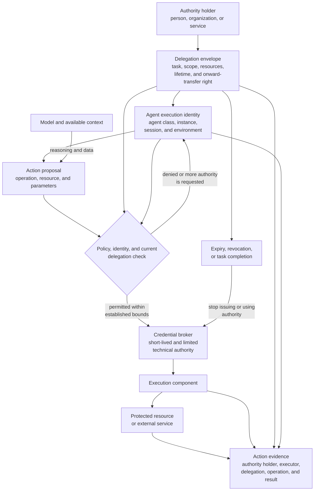

**Figure 5.5 — Passing limited authority from its holder to an identified agent and execution component**

The diagram separates logical delegation from technical credentials. The envelope defines the permitted area, while the broker issues an execution-ready technical means only after a specific action has been checked.

The model is connected to the action proposal, not to the credential broker. This does not mean that it can never form parameters for an authorization request. It may prepare a proposal, but final resources, identities, and active constraints must be checked against authoritative data.

Action evidence retains dual attribution: the holder of the authority used and the actual executor. It also associates the outcome with a particular delegation without asserting that every technically performed action was automatically permissible or successfully achieved the original goal.

The expiry and revocation block shows that authority is not a permanent property of an agent. Completion of the task, revocation by the holder, or changed conditions must stop the issuance of new credentials and, to the degree the chosen mechanism permits, the effect of authority already issued.

### 5.5.12. CHLOYA Position

CHLOYA treats an AI agent as a temporary executor, not as the inheritor of a user's entire identity and authority. An agent must have a distinguishable identity linked to a specific execution instance, task, and environment.

For material actions, both the authority holder and the actual executor are retained. The model used is recorded as part of decision provenance, but its trade name neither replaces workload identity nor grants organizational rights.

Authority is passed through an explicitly defined delegation envelope. It constrains operations, resources, environment, time, scale, and onward transfer. Creating a subagent or connecting a new tool must not expand the available boundary.

Technical credentials are issued to the execution component after authorization of a concrete action. Standing secrets must not be placed in a model's free-form context if access can be arranged through a broker, temporary role, workload identity, or controlled adapter.

A short authority lifetime does not replace minimality, and identification does not replace authorization. Sensitive operations additionally require a binding between the token, the particular executor, and the current delegation state.

> **An agent acts not as the user in general, but on behalf of an authority holder, within an explicit delegation, and by means of technical capability issued for a particular controlled action.**

This approach reduces the consequences of model error, context compromise, and creation of subordinate agents. Even if the probabilistic component proposes an impermissible action, it must not hold standing, unconstrained authority sufficient to perform the action independently.

## 5.6. Data Provenance, Trust Characteristics, and Information Flows

### 5.6.1. Access to Data and Permissibility of Their Use

The identity and delegation considered in Section 5.5 establish who acts and what authority has been passed to that party. Correct identification of an executor does not, however, determine how it may use data it has obtained.

An agent can be entitled to read an internal document but not to send it to an external model. It can obtain information from an official information system but use it after it has ceased to be current. It can process an authentic email containing an injected instruction that has no control authority. Permission to use information for analysis likewise does not confer a right to make an irreversible decision from it automatically.

CHLOYA therefore separates the right to access an object from the permissibility of later use of the information it contains. The former principally concerns authorization of access to a resource. The latter requires consideration of [data provenance][g-data-provenance], currency, sensitivity, source authority, transformations performed, purpose of use, and intended recipient.

> **The ability to read information does not entail a right to pass it on, interpret it as a control command, or use it as sufficient grounds for a system effect.**

This distinction matters especially in agent systems. A model can successively read a document, combine it with internal information, form a derived result, and invoke a tool that changes external state. Every step may appear permissible in isolation while their combination creates a prohibited information flow.

### 5.6.2. Provenance, Authenticity, Authority, and Currency

Data provenance describes the history of data creation and transformation. It makes it possible to establish which person, organization, system, agent, or other process created information, which inputs were used, what actions occurred, and which components participated in forming a result.

W3C PROV describes provenance through related entities, activities, and agents. An entity is data, a document, a file, or another object; an activity is the process that creates or transforms it; an agent associates that process with a person, organization, or software component bearing a defined responsibility [142]. The model can also describe the provenance of provenance information itself. This is important because a provenance record is not unconditionally true merely because it has a special format.

Provenance must be distinguished from authenticity, integrity, factual accuracy, currency, and authority. Authenticity indicates whether a claimed source corresponds to the actual source. Integrity indicates whether data have changed after creation or receipt. Factual accuracy concerns correspondence of content to reality. Currency indicates whether previously received information remains applicable. [Authoritative data][g-authoritative-data] come from a source to which the system has assigned the right to establish the relevant fact, state, permission, or control decision.

These properties do not form one linear scale. A document can be authentic and unaltered but obsolete. A message can contain factually correct information yet come from a party not entitled to change policy. A repository can be an official source of current code, while a comment in a file gains no authority to enlarge an agent's privileges.

A user message is authoritative for the user's current intent, but does not necessarily establish an organizational role. A corporate database may be authoritative for contract status but have no right to initiate payment. A model may accurately restate a document, but that restatement remains a derived result, not new independent confirmation of a fact.

> **Trust always concerns a defined property of data and a particular intended use. Confirmation of one property does not create universal trust in the whole object.**

CHLOYA therefore does not recommend assigning data a single general level from “untrusted” to “fully trusted.” Such a label may serve as a local simplification, but must not conceal the differences among provenance, confirmation, currency, sensitivity, and permitted use.

### 5.6.3. Separating Data from Control Instructions

In a traditional program interface, a control command and processed data are normally distinguished by types, syntax, and entry points. In a language model, they can occur in one context as similar sequences of text. A system constraint, user email, web-page content, and source-code comment have different architectural status but are represented similarly to the model.

Indirect prompt injection exploits precisely this conflation. An attacker places an instruction in a document, webpage, email, repository, or external tool response. A user asks an agent to process the content; the foreign instruction then enters context and attempts to alter the model’s behaviour [2], [24]. EchoLeak demonstrated a real chain in which content injected into an email could initiate automatic data transfer from a Microsoft 365 Copilot environment without additional user action [89]. Adaptive attacks show that a classifier, additional model, or system instruction can reduce the success rate but does not form a mandatory boundary that guarantees absence of control influence by untrusted text [86].

The [data-are-not-instructions principle][g-data-not-instructions] applies beyond user documents. Tool descriptions, input and output schemas, annotations, server prompts, resource lists, and other integration metadata also have provenance and can affect a model decision.

MCP lets servers declare tools and their descriptions and schemas. Many clients provide that information to a model so it can select a tool and form its arguments. The MCP specification requires tool annotations to be treated as untrusted unless they come from a trusted server [5]. An annotation can state an intended property of a tool, but does not prove its actual behaviour and must not replace execution policy by itself.

A practical analysis of infrastructure with multiple MCP servers shows that tool catalogues, descriptions, and schemas can occupy a substantial part of context, becoming an external data flow to the reasoning component in their own right [148]. Connecting a new server or changing an existing tool description is therefore not only an integration operation but also a change to the system’s [trust surface][g-trust-surface].

For CHLOYA, it is useful to distinguish three logical planes. The [data plane][g-data-plane] contains documents, messages, webpages, source code, tool responses, and other processed content. The [control plane][g-control-plane] contains policies, permissions, action contracts, confirmed control parameters, and binding execution rules. The [provenance plane][g-provenance-plane] associates data and control objects with their sources, versions, transformations, and restrictions.

These planes can share physical infrastructure and even occur temporarily in the same model prompt. Their logical separation means that data-plane content cannot alter policy, confer authority, or become a binding command merely because the model interprets it as an instruction.

> **Text acquires no control authority merely because a language model can interpret it as a command.**

Tool registration must not automatically imply trust in every operation, description, or result. Before admission to a privileged loop, the system must establish the server source, available operations, version or hash of material descriptions, data requirements, and an independent policy-enforcement point.

### 5.6.4. Data Provenance, Trust, and Use Profile

A binding decision requires a [data provenance, trust, and use profile][g-data-profile]: a set of independent characteristics that establishes where information came from, which properties were confirmed, how current it is, which restrictions apply, and to where it may be transferred.

The profile links data to their immediate source and acquisition method. It can record whether information was entered by a person, read through an internal API, extracted from a webpage, recognized from an image, received from another agent, or generated by a model.

Evidence of authenticity and integrity is retained separately: a digital signature, hash, protected channel, artefact version, confirmed workload identity, or a record in an authoritative system. Such evidence concerns particular properties. A signature, for example, establishes a link to a key and immutability of signed content; it does not establish that every statement in the content is factually correct.

The profile must capture currency. For some objects, time of receipt is enough; for others, an expiry time, version, revision, or connection to a specific system state is needed. A role, permission, configuration value, and status of an external operation can all change between reading and use.

Sensitivity describes the consequence of disclosure and restrictions on processing, not the truth of data. A public message may be false, while a secret key can be accurate and highly sensitive. These characteristics must not be merged into one assessment.

Permitted use determines whether data may be passed to a particular model, retained in a log, sent to an external service, shown to a person, used for an automated action, or used only in de-identified and aggregated form. The profile also retains a history of material transformations and the confirmation status of a result. If data were shortened, translated, recognized, combined, classified, or generated, the system must be able to establish which transformation occurred and which component was responsible.

CHLOYA does not prescribe a single compulsory profile schema. In a small application, several protected attributes may be enough; in a distributed system, the profile may be a separate typed object, signed provenance statement, graph record, or controlled metadata store. The essential requirement is that a significant restriction is represented in a form that policy and the execution boundary can actually check.

### 5.6.5. Information Flows and Inheritance of Constraints

An [information flow][g-information-flow] is the directed movement of data or a derived representation between objects, components, environments, or recipients. Its permissibility cannot be determined solely from the recipient's general right to receive information. It depends on the source, transformation, destination, purpose, active delegation, and applicable policy.

Derived data do not automatically lose the restrictions of their inputs. A summary, translation, classification result, embedding, or model answer can retain sensitive facts or make them easier to act on. CHLOYA therefore applies [data-constraint inheritance][g-data-constraint-inheritance]: restrictions of material inputs remain associated with a derived object until an established procedure changes or removes them.

Such a change is not a model's assertion that it has “removed sensitive information.” It requires a controlled transformation, such as approved aggregation, verified de-identification, confirmation against an authoritative source, or another policy-defined procedure. This is [controlled declassification][g-controlled-declassification], not an informal relabelling of an object.

For a critical flow, policy should be able to decide whether the recipient, purpose, and technical channel are allowed; whether a transformation is required; and whether an absence of sufficient evidence requires denial, isolation, or escalation. This approach prevents an otherwise authorized reader from becoming an uncontrolled export channel.

### 5.6.6. Confirmed Facts and Model-Derived Results

A model output is a new [derived data][g-derived-data] object. It may be useful, accurate, and ready for further work, but it does not thereby become an authoritative fact or confirmed state. Its profile must retain material inputs, model and configuration information, the transformation performed, and its [data confirmation status][g-data-confirmation-status].

By default, model output has the status of a proposed or derived result. Depending on the task, it can be shown to a person, checked against a typed schema, matched with an authoritative source, or routed for additional confirmation. Recording the model name is necessary for reproducibility and investigation, but does not make the output true. A second model's review can improve quality or reveal a contradiction, yet remains a probabilistic transformation and cannot replace independent confirmation of a critical property.

> **Generation creates a new object, but neither erases the provenance of its inputs nor converts a model output into an authoritative fact.**

### 5.6.7. Practical Choice of Mechanisms

CHLOYA does not require W3C PROV, OpenLineage, SLSA, DLP, and a full information-flow-control system in every project. Selection begins with flows capable of causing material harm. For a local agent working only with public code, without network access or secrets, it can be enough to separate control instructions from input files, limit tools, and record sources in the task log.

For an application sending data to several model providers, it needs sensitivity classification, rules for permitted recipients, a record of context actually sent, and a technical intermediary that cannot be bypassed. OpenLineage or a compatible platform mechanism suits data-processing pipelines [143]. SLSA provenance and related evidence should be used for packages, containers, and release artefacts where supported by the supply chain [12]. W3C PROV is useful when a common inter-system model of entities, activities, agents, and derivation is needed [142].

Dynamic label tracking is justified when typed values and tool invocations pass through a controlled execution environment. If a model receives unstructured text and has direct access to arbitrary tools, a label on the source document creates no mandatory protection. DLP can detect known classes of sensitive data and block selected channels, but does not always recognize indirect identifiers, domain inferences, or semantic paraphrases; it is one control point, not proof of complete safety.

A quarantine architecture can process untrusted text without access to secrets or privileged tools, passing into the trusted loop only a limited structured result. An applied analysis of this pattern demonstrates the combination of separate models, strict formats, and deterministic checks between stages [146]. A structured format does not itself make meaning safe: a field of an allowed type can still contain a prohibited recipient, command, or other harmful parameter.

SLICER presents another practical option: provenance, evidence, permission state, and verification are retained alongside derivation links, while AI may propose a new rule but cannot itself assign it confirmed status [147]. For external tools, the system should retain the catalogue's provenance, protocol version, server identity, and material description/schema versions or hashes. A post-review change to a tool description is a change to input data and the trust surface, not an invisible editorial update.

Provenance itself can be confidential. A log may contain internal resource names, tool composition, user requests, and facts about protected data. Provenance metadata is subject to the same minimization, access, and retention requirements as other data. Metadata that nobody checks or uses in policy creates storage volume, not control.

### 5.6.8. Controlling Provenance and Transfer Direction

Figure 5.6 shows the path of data from source through transformation to a recipient. A provenance, trust, and use profile is maintained with the content or in associated protected storage.

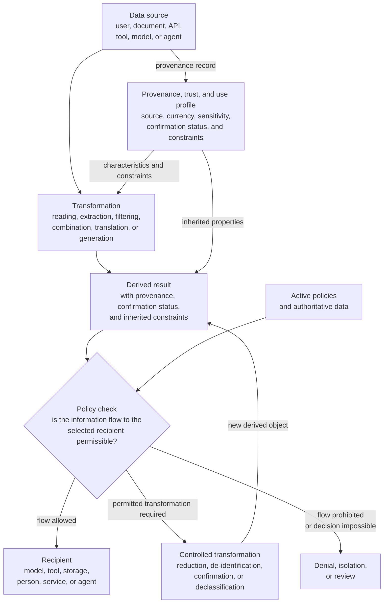

**Figure 5.6 — Retaining provenance, confirmation status, and constraints as data pass from source to recipient**

A controlled transformation does not change the source object's status or automatically permit the new result. It creates a new derived object that again undergoes policy evaluation. This is particularly important for de-identification, aggregation, and model summarization: a model can remove explicit identifiers while retaining sensitive facts or unique combinations of attributes. Re-evaluation concerns the result actually produced, not the claimed name of the operation.

A denial need not end the whole task. The reasoning loop can propose a local model, less sensitive source, another result format, or continuation without prohibited data. The new proposal again passes through applicable boundaries and does not inherit permission automatically.

### 5.6.9. CHLOYA Position

CHLOYA treats data as objects with provenance, independent trust characteristics, confirmation status, constraints, and permitted directions of movement.

Source authenticity, integrity, factual accuracy, authority, currency, and sensitivity are different properties. Confirmation of one does not create universal trust in the object.

Untrusted content remains data and receives no control authority merely because it enters a language model's context. This includes documents, source code, tool results, MCP tool descriptions, schemas, and server prompts.

Transformation creates a new derived object. It retains a link to material inputs, receives its own confirmation status, and inherits restrictions until an established procedure permits their change. Ambiguity and lack of evidence remain explicit: model confidence can guide further investigation, but cannot turn a supposition into confirmed state.

Permissibility is determined not only by a right to read a source or invoke a recipient, but by the entire information flow: source, transformation, recipient, purpose, and active delegation.

> **Data may change form and pass through several models, agents, and tools, but their provenance, uncertainty, and constraints must not disappear before the system has made an explicit, verifiable decision to change them.**

The next section considers control of the agent execution trajectory. It develops the conclusion of Section 5.6: even when individual accesses and flows appear permissible, their sequence can create accumulated risk and lead to an impermissible result.

## 5.7. Controlling the Agent Execution Trajectory

### 5.7.1. Why an Allowed Action Is Not Enough

The preceding sections separate an action proposal from its authorization, apply policy, establish executor identity, constrain delegation, and retain data provenance. An agent system, however, performs a sequence of interdependent steps rather than one action.

Permission for every step separately does not prove that the whole sequence is permissible. An agent may be allowed to read an internal document and, separately, call an external service; that does not confer a right to send the document’s content to the service. It may be allowed to change CI configuration and separately run a build, while the combination opens a path to authority never granted to the agent. A series of small allowed operations can also become a bulk change, material cost, or large extraction of data.

*Runtime Governance for AI Agents: Policies on Paths* addresses this problem directly: policy can concern not only an individual action but the path that brought the system to its present state [108]. This is especially important for agents because the next step is chosen dynamically and can depend on earlier execution outcomes.

> **Whether the next action is permissible can depend not only on what the agent proposes now, but also on what has already occurred within the current task.**

CHLOYA calls the observed sequence of such states and transitions the [agent execution trajectory][g-agent-trajectory]. Trajectory control does not replace authorization of an individual action. It adds a second question: even if the action is permissible in itself, does the transition remain permissible after the preceding events, accumulated effects, and state changes?

### 5.7.2. Trajectory as a Sequence of Material States

An agent execution trajectory is a sequence of observable states, action proposals, authorization decisions, actual operations, and outcomes within one task or a connected chain of tasks.

Control does not require retaining the entire state of the system after every token or function call. It requires retaining **policy-material state**: information capable of changing the decision on the next action. This can include data categories already read, resources changed, temporary authority already issued, checks and confirmations completed, number of objects affected, total cost, volume of external transfer, prior denials, and external effects already produced.

[Trajectory state][g-trajectory-state] is therefore not a full copy of the environment, but the minimum accumulated set of attributes necessary to assess the next transition correctly.

This approach has historical counterparts in history-based access-control models. Abadi and Fournet proposed determining rights of executing code from not only the current stack, but also characteristics of code previously involved in computation and explicit rights-changing operations [154]. Earlier history-based access-control systems likewise used selected request history to distinguish safe from potentially dangerous behaviour [154]. For an agent system the object of control is broader: history can include not only file access but data provenance, tool calls, requests for added authority, cost, and changes of external state.

> **Current state tells where the system is. A trajectory also tells how it got there. Some decisions require both answers.**

### 5.7.3. Current-State Policies and Trajectory Policies

An ordinary policy often decides from current attributes: who performs an action, on which resource, in which environment, and with what authority. Such a rule can be called a current-state policy; for example, it prohibits production writing for a role with only test authority.

A [trajectory policy][g-trajectory-policy] also considers events preceding the current proposal. It can require a particular check before publication, prohibit external transfer after confidential data are read, limit repeated operations, or take account of a prior denial.

Runtime enforcement has long treated security as a property of a sequence of observed events. Schneider identified a class of policies enforceable by an execution monitor that observes actions and terminates execution when permissible behaviour is violated [153]. For CHLOYA, the important limit is that some restrictions can be enforced during execution only when they can be expressed through observable history and the control mechanism can actually stop a prohibited transition.

Not every desired property can be checked this way. A runtime monitor cannot guarantee a property that depends on an unobservable future, hidden model intent, or an external effect it cannot record. Event logging alone does not make a system safe. Current-state and trajectory policies complement one another: current authorization may suffice for reading a public file, while history can be material to publication, changing access, transferring sensitive data, or launching a costly operation.

### 5.7.4. Checkpoints and Trajectory Segments

Applying the same strict control to every internal micro-step would be costly and often pointless. Reading ten files inside an already authorized working directory does not necessarily require ten separate human confirmations.

CHLOYA therefore identifies [trajectory checkpoints][g-trajectory-checkpoint]: states or transitions at which risk changes materially and policy, delegation, data currency, or human participation must be reassessed. A checkpoint can arise on moving from reading to modification, local processing to external transfer, test to production, artefact preparation to publication, a reversible to a materially irreversible action, an individual to a bulk operation, or when a new authority class is requested.

Between checkpoints, the system can perform a [trajectory segment][g-trajectory-segment]: a bounded sequence of steps permitted in advance within defined resources, tools, data, and cumulative limits. An agent may, for example, analyse and modify files in one working tree, run local tests, and correct detected errors. Publishing a branch, using network access, or applying a migration to a real database creates a new checkpoint.

This avoids two extremes. Authorizing a whole task in advance creates excessive authority; asking a person to approve every technical call turns autonomy into an expensive manual interface.

> **Confirmation should cover an intelligible, bounded segment of work and stop its effect at the next material risk boundary.**

The specific confirmation mechanism is examined in Section 5.10. For Section 5.7, the key property is that earlier confirmation must not automatically extend across a new risk boundary.

### 5.7.5. Cumulative Constraints and a Trajectory Budget

Some risks arise from repetition rather than a single action. Reading one file can be permitted, while sequential extraction of an entire corporate store is another operation class. A small call to a paid service can be permitted, while thousands create material cost. Deleting one temporary object and mass deletion are likewise not equivalent.

A trajectory policy can therefore consider accumulated indicators. CHLOYA calls an established limit on an accumulated effect a [trajectory budget][g-trajectory-budget]. A budget is not limited to money: it can express the maximum number of operations, objects changed, total data read or transferred, external requests, task duration, retries, or subagents created. Different budgets can be checked independently.

For example, a segment can permit up to one hundred local reads and ten file changes while prohibiting external network traffic altogether. Another task can allow unlimited reads but have a strict monetary limit on calls to an external API. Usage Control extends traditional access control with continuing conditions and changing attributes: in UCON, a decision can depend on authorizations, obligations, and conditions whose attributes change during resource use [152]. For CHLOYA, the material idea is that permissibility can require re-evaluation as accumulated state changes, rather than a single decision when access first opens.

> **A constraint concerning accumulated effect must be checked as the effect changes, not only when the first permission is issued.**

Exhausting a budget need not mean that the entire task has failed. It can stop a segment, prepare an escalation package, request new authority, or change the execution mode.

### 5.7.6. Action Order and Mandatory Preceding States

Risk is determined not only by the set of operations performed, but also by their order. “Create a backup—verify it—make the change” is not equivalent to creating a backup after the change. Publishing an artefact before tests complete differs from publication after confirmed verification.

A trajectory policy can therefore specify mandatory preceding states. An action is permitted only after observable completion of a required check, approval, backup, or another established state. The converse rule specifies a prohibited sequence: after reading data of a defined class, an external call can be forbidden until the segment ends or a permitted transformation described in Section 5.6 has occurred.

The plan must not be confused with proof of execution. An agent's statement that it intends to run tests first does not prove that the tests were actually run and completed successfully. The control loop must rely on observed, authoritative facts.

### 5.7.7. Planned and Actual Trajectories

A plan is useful for advance assessment. When an agent states that it intends to read five files, change configuration, run tests, and publish a result, the system can identify a potential risk boundary earlier. But the plan remains a forecast. During execution, a new dependency can appear, a tool can return an unexpected result, a user can change a requirement, or the model can choose another strategy.

Actual trajectory is formed by observable environment events. Each material transition is checked from current state and history already observed. A plan can reserve budget, identify checkpoints, and permit a low-risk segment in advance, but a material deviation from it can itself trigger re-evaluation. In the terminology of [108], CHLOYA distinguishes the **proposed trajectory**, useful for planning control, from the **observed trajectory**, which is the basis for binding decisions.

> **A safe plan is not evidence of safe execution. Policy applies to the system’s actual transitions.**

### 5.7.8. Observable Event Stream and Control Mechanism

Applying trajectory policy requires an observable representation of material events. Where tool calls exist only as unstructured terminal text, an external control component must reconstruct history heuristically.

Agent Client Protocol (ACP) illustrates a way to obtain a more structured picture. ACP v1 represents tool calls through `session/update` events, associates them with `toolCallId`, reflects operation type and status, can transmit actual input and result, and provides a separate `session/request_permission` before execution [155]. A client can track status from pending through execution to completion, while permission for a particular call remains a separate event. An applied analysis of ACP for programmatic control of CLI agents shows the engineering value of such an interface: a program receives a typed event stream instead of parsing `stdout`, can intercept permission requests, and apply its own logic to filesystem and terminal operations [156].

ACP is not itself a CHLOYA policy system. A `toolCallId` or permission-request event does not determine whether the trajectory is permitted, nor does it guarantee that every external effect passes through the observed interface. Stronger assurance is required:

> **Every action material to trajectory policy must either pass through an observable enforcement point or be reflected in authoritative state available before the next material transition.**

If an agent can concurrently reach a network, filesystem, or external API outside the controlled channel, a complete log of one protocol gives only a partial picture. A runtime monitor must also distinguish a proposal from a fact of execution: “the agent wants to delete a file” and “the file was deleted” have different significance for the next decision.

### 5.7.9. Continuous and Repeated Evaluation

Traditional access models are often understood as a check before an operation: the request is allowed and the action continues. This is insufficient for long-running, multi-step agent tasks. State can change after work starts: a user revokes authority, a budget is exhausted, a resource changes classification, a new external effect arises, or a higher risk is detected.

UCON includes the idea of continuity of control: conditions and attributes can be evaluated not only before resource use begins but during use [152]. In CHLOYA, that idea applies to the trajectory as a whole. Re-evaluation does not mean invoking a policy engine after every processor instruction; it occurs on an event able to change policy applicability—arrival at a checkpoint, change of a material attribute, budget exhaustion, request for new authority, detected deviation, or receipt of a new resource state.

This can revoke or narrow a previously granted execution segment before it completes naturally.

> **Permission to continue a trajectory is an active state, not an indefinite fact obtained once at task start.**

This connects Section 5.7 to the delegation lifecycle of Section 5.5: termination or change of authority must affect later transitions even in a task already running.

### 5.7.10. Boundary with Side-Effect Management

Trajectory control determines **whether the system may move to the next state**. It does not fully determine how an already authorized external effect is technically prepared, committed, constrained, or, where possible, reversed.

Section 5.7 can require a check before migration and a new checkpoint before transition to production. The specific mechanisms of a prepared state, transactional application, idempotency, rollback, and side-effect commitment belong to Section 5.8. The distinction prevents two properties from being conflated: logical permissibility of a sequence, and technical governability of a change in external state. A correctly authorized trajectory can still use an unsafe execution mechanism; a technically sound transaction may still never have been permissible after prior actions.

### 5.7.11. Trajectory-Control Loop

Figure 5.7 shows a loop in which a new proposal is evaluated not in isolation but together with accumulated trajectory state. After execution, the observed result updates that state and becomes part of later decisions.

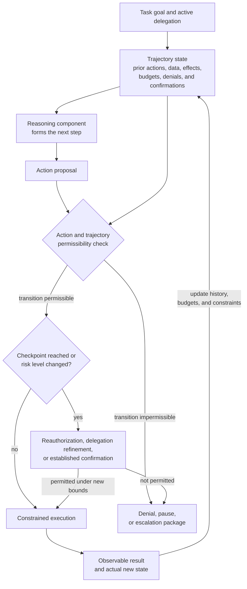

**Figure 5.7 — Controlling an agent trajectory through repeated evaluation of material transitions**

Trajectory state is a separate check input alongside the current proposal. It makes it possible to consider data already read, accumulated effects, prior decisions, and budgets. A checkpoint does not necessarily require a person: deterministic policy can reauthorize when the new state remains within established authority. Human involvement is needed only where risk, policy, or lack of a sufficiently machine-verifiable decision requires it.

After execution, observed outcome—not only original intent—is written to trajectory state. A failed operation changes history too: it consumes time and budget, can leave a partial effect, and affects permissibility of the next attempt. A denial does not reset state. If the reasoning component forms an alternative plan, it receives the same accumulated history and constraints unless a separate decision explicitly changes them.

### 5.7.12. CHLOYA Position

CHLOYA does not consider an individual permitted tool call a sufficient unit of governance for an autonomous agent. A material decision must take account of both the current proposal and the required part of a task’s actual history. Policy can depend on action order, provenance of data used, checks completed, prior denials, and accumulated effect.

Low-risk actions can be grouped into bounded segments so that agent work does not become a series of constant confirmation requests. Material changes of risk form checkpoints at which policy is reassessed. Quantitative effects are constrained by trajectory budgets. Budget exhaustion, repeated denials, lack of progress, or a request for new authority can cause pause or escalation.

Replanning is permitted and expected, but does not remove history. A new path does not automatically acquire the right to cause an effect prohibited to an earlier form of action. Observation must concern actual operations: an agent plan, model reasoning, or structured protocol is helpful for control, but not proof that every external effect passed through the enforcement point.

> **An agent is not merely permitted a set of actions. It is permitted to move along a constrained trajectory in which every material next transition depends on accumulated state and active boundaries.**

The next section considers management of side effects: how already authorized transitions to external state should be prepared, committed, constrained, and, where possible, reversed.

## 5.8. Managing External Effects and State Changes

### 5.8.1. From an Authorized Action to a Change in the External World

Trajectory control determines whether the next transition is permissible in light of completed actions, accumulated state, and active constraints. Even a correctly authorized transition can nevertheless be implemented unsafely.

There is a distinct engineering boundary between the decision “this action is permitted” and an actual system change. An agent can overwrite a file, change a database record, send a message, publish a package, launch a deployment, delete a resource, initiate a payment, or change access rights. Unlike reasoning, retrieval, and artefact preparation, these operations cause observable state change outside free model computation.

CHLOYA calls such a change an [external effect][g-external-effect]. The term does not imply that a consequence is undesirable. An effect is external when it leaves an agent's draft computation and changes authoritative state of a project, information system, or outside environment.

> **Authorization of an action does not authorize an arbitrary technical method of performing it.**

Permission to change three database records does not justify giving an agent an administrative SQL console. Permission to publish one release does not justify holding a standing publishing token in model context. Permission to send one message does not authorize arbitrary external communication. Section 5.8 addresses not whether an action may be performed, but how an already allowed action becomes a controlled system effect.

### 5.8.2. External-Effect Properties and Recoverability

A binary split between “reversible” and “irreversible” operations is inadequate. Deleting a file may be easy to recover where its state is in version control and effectively irreversible where no backup exists. A sent message cannot be returned to the state in which it was never sent, though a correction can be issued. A payment may be cancelled before settlement and require a separate refund afterward. An application deployment can be rolled back, while a completed user-data migration can require another recovery method.

Recent work on agent runtimes confirms the need for a richer model. Atomix distinguishes effects that can be delayed until commitment from those already manifested externally and requiring tracking and compensation [158]. *Revisable by Design* treats idempotent, reversible, compensable, and irreversible actions as materially different cases when a running agent plan changes [165].

CHLOYA does not make these categories an obligatory mutually exclusive classification. A material effect must instead be assessed for independent properties: whether application can be delayed; whether a retry is safe; whether genuine rollback is possible; whether a verified compensating action exists; and whether a point exists after which consequences cannot be considered fully removable.

> **Effect safety depends not only on permission, but on how the system behaves on retry, failure, partial execution, and the need for recovery.**

### 5.8.3. Preparing an Effect Before Application

For operations with material consequences, CHLOYA recommends separating formation of a change from its actual application whenever possible:

`model → prepared change → verification → commitment`

A [prepared effect][g-prepared-effect] is a concretely specified state change that can already be checked but has not yet been applied to the target system. It can be a Git diff, configuration change set, prepared migration, release manifest, a specific email with an actual recipient, an IAM-policy change request, or a payment operation with an established payee and amount.

A prepared effect differs fundamentally from a user's general intent. The request “update dependencies” says nothing about which versions will change. The agent's result may update seventeen packages, affect major versions, and require a public-API change. That result, not the original brief formulation, becomes the subject of subsequent checking.

Cordon proposes a close principle for tool-using LLM agents: local reversible changes can occur in shadow state, while external actions are placed in a special output buffer and released only after the relevant composition has been checked before commitment [157]. Atomix likewise delays effect classes that can be buffered until a safe commitment point [158]. For CHLOYA, these are examples of a general principle, not mandatory runtime technology.

> **The greater an operation's consequence, the closer the checked object must be to the future effect itself—not to the model's initial intent or plan.**

Preparation must not secretly perform the effect it is intended only to check. If a `preview`, `plan`, or `dry-run` reserves money, sends messages, or changes production, its own effect requires separate treatment. A dry run is useful information, not proof that actual execution will be safe: it can use a different execution path, and target state can change between simulation and application.

### 5.8.4. Effect Representation and the Commitment Boundary

Checking a prepared change requires an [effect representation][g-effect-representation]: a form enabling the system or a person to understand precisely what will change. For code, it is normally a diff; for infrastructure, a plan or list of resources created, changed, and deleted; for a message, the recipient and actual content; for payment, counterparty, amount, currency, and purpose; for access changes, permission state before and after the operation.

The representation is not only for a person. A schema, policy engine, static analyser, invariant set, cost limit, or specialized validator can also check it. After such checking comes the [effect commitment boundary][g-effect-commit-boundary], the transition from prepared change to impact on authoritative or external state.

Cordon creates a task-level transactional boundary that separates preparation from release of external effects [157]. For CHLOYA, the idea is important because it permits deterministic checking as close as possible to the point at which a probabilistic proposal becomes a fact of the external world.

There is a classic time-of-check/time-of-use problem between verification and commitment: a checked condition can cease to be true before the resource is actually used [163]. *Mind the Gap* shows that the same error class arises in LLM agents when an agent checks a file or API state then uses an object that has changed [159]. A prepared effect must therefore be linked to the state against which it was verified, by a version, revision, hash, ETag, conditional write, compare-and-swap operation, transaction isolation, or another verifiable precondition. Optimistic concurrency control uses the same idea: work is performed without a long lock, but commit checks that preconditions remain permissible [162].

> **The effect committed must be the effect that was checked, against the state for which it was authorized.**

If the source state changes, safe behaviour is normally to rebuild or recheck the prepared effect rather than automatically apply an old decision to the new situation.

### 5.8.5. Idempotency and Retry

A distributed system cannot always distinguish absence of a result from absence of a response. An agent sends an external request to create an object or conduct an operation, then the connection breaks. The caller cannot know whether the service received the request, performed it, and lost only the response. A naïve retry can cause a second external effect.

Helland expresses the practical idempotency problem plainly: messages can be delivered more than once, so processing must permit repeat delivery without unintended duplication of its result [161]. For agent systems, this matters especially because retry may be initiated independently by the agent, SDK, HTTP client, queue, orchestrator, or recovery mechanism.

> **Repeating a technical attempt must not automatically repeat a business effect.**

One method is to associate a prepared effect with a stable operation identifier or idempotency key. Re-delivery of the same effect uses that identifier rather than creating a new logical operation. Atomix incorporates an idempotency key directly in its model for committing agent effects [158]. A key alone does not make an arbitrary external service idempotent: the recipient or an intermediary adapter must detect repeats and return the state of the operation already performed.

A retry of a prior effect must also be distinguished from a new model decision. If the model changes an amount, recipient, or resource set after failure, it is a new prepared effect and requires new checking. Retry safety must be determined from the established state of the earlier operation, not from the phrase “try again.”

### 5.8.6. Rollback, Compensation, and Uncertain Outcomes

The word “rollback” is often used too broadly. Genuine rollback returns controlled state so that an uncompleted change never becomes part of committed state; rolling back a transaction before commitment is the classic example. Once an effect has passed an external boundary, that description is often false. A sent email may already have been read, a published package downloaded, and a payment changed accounting state.

Where a prior state cannot be restored, recovery may require a [compensating action][g-compensating-action]—a new controlled effect intended to reduce or correct the consequence. Compensation is not erasure of history and can itself be risky; it must be authorized, represented, checked, and observed as a new effect.

The system must also admit an [uncertain effect outcome][g-uncertain-effect-outcome]. A timeout, lost response, or partial failure does not prove that no effect occurred. If authoritative outcome cannot yet be established, safe behaviour is to preserve the known state, refrain from a speculative retry or compensation, and pause or escalate until an admissible recovery path is established.

### 5.8.7. The External-Effect Path from Preparation to Confirmation

Figure 5.8 shows the lifecycle of one external effect. Unlike Figure 5.7, which depicts a whole task trajectory, it follows one transition from an authorized proposal to a confirmed change of state.

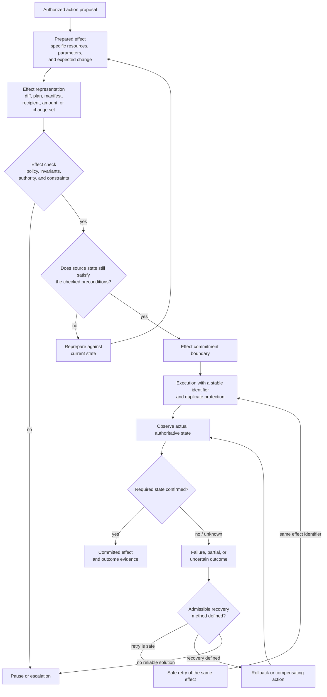

**Figure 5.8 — The path of an external effect from prepared change through commitment, verification, and recovery**

Returning to preparation when source state changes prevents a decision checked for one actual situation from being applied to another. A retry returns to execution with the same logical effect rather than creating a new one; this distinction is necessary for idempotency. Rollback and compensation are shown together as recovery options but are not methodologically equivalent: the former prevents or removes a still-controlled state change, the latter creates a new effect after external impact has already occurred. If the actual outcome cannot be established and there is no safe next transition, the path ends in pause or escalation, not a model guess.

### 5.8.8. CHLOYA Position

CHLOYA treats an external effect as a distinct object of governance between authorized intent and confirmed state. For material operations, it is preferable first to form a concrete prepared effect, present it in a verifiable form, and only then cross the commitment boundary.

Verification must concern the actual future change and the state against which it was built. A change in that state requires rechecking or repreparation. Repeating a network request must not automatically repeat a business effect; rollback and compensation are different mechanisms. A call failure does not prove absence of an effect, and a timeout does not entitle the system to assume the operation was not performed.

After a sensitive change, the system should, where possible, verify actual authoritative state rather than rely only on a tool's success message. Multi-step operations must acknowledge partial states and define admissible recovery paths in advance. Where automatic recovery is impossible or its result cannot be determined, the system preserves known state and stops further impact.

> **An authorized action becomes a confirmed system change only after controlled commitment and verification of the state actually reached.**

The next section addresses the earlier architectural question of when a class of tasks and effects should be entrusted to AI at all, and when the complexity of control outweighs the benefit of agent execution.

## 5.9. The Appropriateness of AI Use and the Choice of Automation Level

### 5.9.1. AI as an Optional Architectural Component

The preceding sections assume a probabilistic component is already present. Before designing its boundaries, however, a more basic question arises:

> **Should AI be used for this function at all, and which part of the work is it appropriate to give it?**

CHLOYA does not treat use of a language model or agent as an architectural default. Where the required function is already reliably provided by an algorithm, database query, typed interface, state machine, static analyser, schema validator, policy engine, or other deterministic mechanism, adding a probabilistic component requires separate justification.

This does not mean rejecting AI wherever a task is formally expressible. A probabilistic component can be useful for interpreting user intent, matching ambiguous text to a formal schema, finding alternatives, or preparing a structured request. The remaining process can then be performed by ordinary software. A model may transform a natural-language requirement into a structured expression while a deterministic component checks allowed fields, authority, and execution rules.

CHLOYA calls an existing or conventionally implementable mechanism that provides a required function with acceptable quality, cost, and risk a [sufficient deterministic mechanism][g-sufficient-deterministic-mechanism].

> **A probabilistic component should be introduced where task uncertainty gives it a useful role, not where a deterministic implementation is already sufficient.**

No AI in a particular function is a normal outcome of architectural assessment, not a sign of technological backwardness.

### 5.9.2. Automate a Function, Not a Whole Task

Statements such as “automate technical support,” “give AI code review,” or “let an agent manage infrastructure” are too broad for a defensible architectural decision. A workflow contains functions of fundamentally different kinds.

The classical model of Parasuraman, Sheridan, and Wickens distinguishes automation at four stages: information acquisition, information analysis, decision selection, and action implementation. Each stage can have its own automation level [169]. This transfers well to agent systems. In code-change review, a system can deterministically obtain a diff and test results; a model can analyse the change and find non-obvious risks; it can propose fixes; while deciding whether to accept the change and merging it into the main branch belong to another loop. In a user request, a model can classify the request and draft a response, while policy determines the user's rights and an authorized mechanism performs financial compensation.

The architectural unit of assessment is therefore neither a profession, an agent, nor even the whole workflow, but a **specific function within it**. Research on allocation of functions between people and automation likewise treats allocation as an independent design decision that must account for dependencies and coordination costs [174].

> **Replace “can the task be automated?” with “which functions within the task should be automated, by which means, and to which stage?”**

### 5.9.3. Automation Level as a Profile, Not One Number

A single notion of “autonomy level”—less human involvement means more autonomy—is insufficient. A system may fully automate information gathering, almost fully automate analysis, allow a model to propose decisions, and completely prohibit it from committing an external effect. Another system may use AI only for narrow analysis but automatically execute a pre-formalized class of low-risk actions.

CHLOYA therefore uses an [automation profile][g-automation-profile] for a function rather than one number. The profile allocates roles among a person, probabilistic component, and deterministic mechanisms across material stages: data acquisition, analysis, option formation, decision selection, effect preparation, authorization, and execution. The work of Parasuraman, Sheridan, and Wickens permits different automation levels across stages, while the meta-analysis by Onnasch and colleagues shows that effects of increased automation depend on the stage at which it occurs [169], [170].

The distinction between automating analysis and automating action selection is especially material. A system helping a person understand a situation and one choosing what to do independently may look technically similar, yet play architecturally different roles.

> **Moving from automated analysis to independent action selection changes the nature of authority; it is not merely a higher percentage of automation.**

Describing a system as “80% autonomous” therefore says almost nothing about its actual design or risk. It is more useful to record the stages automated, mechanisms used, scope of authority, and mandatory checking points.

### 5.9.4. Capability Must Be Confirmed on Relevant Tasks

A model's reputation, context-window size, or a high score on a popular benchmark is not sufficient evidence of suitability for a particular function. SWE-bench measures the ability to solve a defined class of real GitHub-repository tasks using reproducible environments and tests [70]. METR assesses model success on tasks of varying difficulty through task-completion time horizon, while separately emphasizing limits on applying its results [46]. Such tests help compare models but do not automatically reproduce a project's architecture, data, constraints, and quality criteria.

This is especially important given the probabilistic nature of current models. Research on hallucinations shows varied causes and classes of factual error [104]. Work on self-correction shows that extra model reasoning does not guarantee correction of its own error without external feedback [105]. Sources of nondeterminism can remain even under fixed conditions [106].

Automation level must therefore rest not only on external benchmarks but on local evidence of suitability. A mature decision benefits from representative scenarios close to actual operating conditions; for a narrow function, several dozen carefully selected cases can yield more engineering information than a general model ranking. Assessment should cover not only correct-answer rate, but error character, result stability, retry cost, contract compliance, response to incomplete or conflicting data, and ability to preserve uncertainty correctly.

> **General model capability tells what is worth attempting to automate. The admission level is set by evidence from the task class the system will actually perform.**

Changing a model, system instructions, available tools, or context architecture can change this evidence and require reassessment.

### 5.9.5. Independent Verifiability as a Criterion for Automation

For CHLOYA, the probability of a correct result is not enough; the system must also be able to determine independently that the result is permissible. Some tasks have a useful asymmetry: producing a result is difficult, while checking it is comparatively easy. A model can produce a code change and a compiler, tests, typing, static analysis, and contract checks can provide independent evidence. It can form an SQL query that then passes parsing, permitted-object checks, operation constraints, and controlled execution.

Such functions are strong candidates for high automation even when the model makes mistakes more often than a traditional program. An error need not become an external effect when an independent verifier detects it. The situation is very different where quality becomes apparent only after a long period or requires expert reasoning as complex as creation of the decision itself. An architectural decision whose effects appear after a year of operation, or a domain conclusion with no independent confirming source, is much less amenable to automatic control.

Having the same or a similar model act as the sole judge of its output is particularly unreliable. That review can improve quality, but does not create a deterministic boundary.

> **The weaker independent verifiability is, the more cautiously autonomy must increase as the possible consequence of error grows.**

### 5.9.6. Error Consequences, Recoverability, and Control Cost

The same probability of error can be acceptable for one function and impermissible for another. An editable text suggestion that a person may discard has little cost. A result that automatically changes production, publishes information, grants authority, or initiates a financial operation has a very different cost. Recoverability, reversibility, blast radius, time until detection, legal or organizational consequences, and vulnerability to abuse must all inform the profile.

The cost of AI also includes the surrounding control loop: integration, prompt and context management, policy enforcement, verification, monitoring, human review, incident response, and maintenance. CHLOYA calls this the [AI control cost][g-ai-control-cost]. A model call that saves one minute but requires twenty minutes of expert checking can make the controlled process worse than the original alternative.

The meaningful comparison is the complete governed process against its real alternative, not a model-call price against a human hourly rate.

### 5.9.7. Selecting and Reviewing an Automation Profile

CHLOYA does not require one fixed autonomy scale. The system must record the profile of function allocation. One stage may use a deterministic mechanism, another probabilistic analysis, a third model-generated alternatives, a fourth a binding authorization decision, and a fifth automatic execution only in a low-risk environment. The profile may differ across environments: an agent can apply well-verifiable changes to a local branch, open a change request after automated tests, and never publish a production release on its own.

Autonomy can also depend on data class, effect type, particular customer, and evidence accumulated for the mechanism. Current research on AI-supported software development uses a related principle: depth of human control should vary with the risk of a particular operation [19]. A model’s self-declared confidence is not grounds for expanded authority. Changing an automation profile is a governance and architectural decision based on external evidence—test results, operating statistics, independent checks, and active policies.

The profile is not a permanent product property. Models, instructions, tools, interfaces, and context architectures change; new attacks and error classes arise; business requirements and acceptable consequences change. Evidence sufficient for one version may not remain sufficient for the next. Autonomy can rise gradually as evidence accumulates, and must also be able to fall after an incident, degraded tests, model change, a newly discovered error class, or loss of an effective independent verifier.

> **Autonomy is a revocable architectural permission, not an irreversible stage of product maturity.**

### 5.9.8. Automation-Selection Diagram

Figure 5.9 shows the path from a workflow function to an automation profile. Unlike earlier diagrams, the result can be a decision not to use a probabilistic component at all.

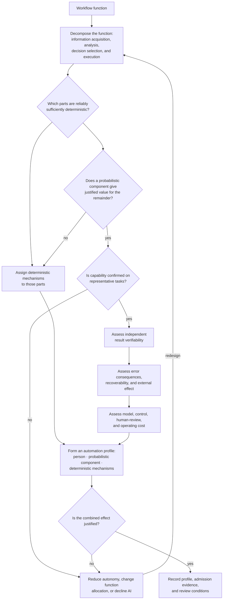

**Figure 5.9 — Choosing an AI role and automation profile for a workflow function**

The diagram deliberately permits a mixed outcome. A [sufficient deterministic mechanism][g-sufficient-deterministic-mechanism] for one part of a function does not prevent AI use in another; formal control of rights may remain deterministic while interpretation of user intent uses a model. Verifiability and consequences are assessed separately. Strong model ability does not itself justify high automation if errors are poorly detectable and have severe consequences. [AI control cost][g-ai-control-cost] is assessed before the final decision.

### 5.9.9. CHLOYA Position

CHLOYA does not aim to maximize the number of functions delegated to AI. A probabilistic component is used where its properties provide measurable or substantively justified benefit over available alternatives.

Assessment occurs at the level of individual workflow functions. Information acquisition, analysis, decision selection, and action implementation may have different mechanisms and automation levels. A strong model does not supersede a sufficient deterministic mechanism; a general benchmark does not replace testing on real project scenarios; and a high probability of a correct answer does not compensate for lack of a way to detect a critical error.

Tasks are most favourable for automation when generation is difficult but independent verification is comparatively reliable and inexpensive. Human review is real work with cost, attention limits, and risk of lost situation awareness. New agents, model-based reviewers, and orchestration mechanisms require the same justification as the initial addition of AI.

The selected automation profile is recorded with the evidence on which it rests and the conditions for review.

> **CHLOYA seeks not maximum autonomy, but the most useful use of probabilistic components within boundaries that remain justified by quality, verifiability, cost, and risk.**

The next section examines human control not as an abstract last line of defence, but as an architectural mechanism in its own right: which person should receive a decision, when, and in what form.

## 5.10. Human Control: Substantive Decisions, Competence, Acceptance, and Escalation

### 5.10.1. Human Control Is Not Constant Micro-Management

Human control is often presented as a simple remedy: “put a person in the loop.” This formulation is inadequate. A person who must approve every trivial call becomes a bottleneck, loses context and attention, and may turn into a rubber stamp. Conversely, a person asked only after an irreversible effect has occurred has no meaningful ability to control it.

CHLOYA treats human participation as a designed control mechanism. It must be introduced at decisions whose risk, uncertainty, value conflict, or lack of a sufficiently machine-verifiable criterion makes human authority necessary. Low-risk, well-specified, independently checkable segments should not be needlessly routed through manual confirmation.

### 5.10.2. A Person Retains Authority over Goal, Boundaries, and Acceptance

An agent can interpret a goal and propose means, but it must not define the goal's legitimate boundaries by itself. A person or authorized organizational role retains authority to establish the objective, acceptable scope, prohibited effects, use of sensitive data, delegation envelope, and conditions for accepting a result.

The person need not write every technical command. Their role is to make the decision that cannot properly be delegated to model inference: whether the task should be pursued, which trade-offs are acceptable, which risk boundary may be crossed, and whether the achieved result is accepted for its intended purpose.

### 5.10.3. Conditions for Meaningful Human Control

[Meaningful human control][g-meaningful-human-control] requires more than the presence of a human interface. The person must receive the decision before the relevant effect, have authority to approve, deny, constrain, or redirect it, and have information sufficient to understand the material consequence. The system must preserve the practical ability to stop or change the path; a decision cannot be meaningful if it is made under artificial time pressure, after irreversible commitment, or without a viable alternative.

The control object must also be bounded. A person cannot meaningfully approve “whatever the agent decides next.” They can decide about a specific proposal, a constrained trajectory segment, a defined exception, or an established automation profile.

### 5.10.4. Semantic Determinacy and the Human Decision Object

A human decision must concern a [human decision object][g-human-decision-object] whose meaning is clear enough to accept responsibility for it. Free-form model explanation can be useful, but it is not a sufficient object where actual operation, affected resources, recipient, amount, expected effect, policy version, and constraints remain indeterminate.

For a code change, the object can include a diff, tests, affected components, and known limitations. For a payment, it can include payee, amount, currency, purpose, authority holder, and relevant evidence. For a policy exception, it can include the rule, proposed exception, scope, lifetime, owner, and consequences. A decision must be attached to the particular version of the object and must not silently carry over when material contents change.

### 5.10.5. Evidence Matters More than a Persuasive Explanation

Model explanations are not proof. Fluent reasoning can omit facts, manufacture causal accounts, or persuade a reviewer without increasing the correctness of the proposal. CHLOYA gives priority to evidence that can be checked independently: source data, policy result, effect representation, test result, authoritative state, and explicit uncertainty.

An explanation should help a person navigate a decision, not substitute for the evidence required by the risk. A system must expose what is known, what is inferred, which assumptions are unconfirmed, and which constraints will apply, rather than present an artificial appearance of certainty.

### 5.10.6. Automation Bias and Appropriate Reliance on AI

Human reviewers can over-rely on automated recommendations, especially when a system appears authoritative, work is repetitive, or the reviewer lacks time and context. This [automation bias][g-automation-bias] does not mean that AI assistance should be removed; it means that acceptance workflows must make disagreement, refusal, and escalation normal and practical.

The interface and process should make the decision material, show countervailing evidence and uncertainty, avoid presenting a default model conclusion as an inevitable answer, and record the basis of acceptance where it is significant. A reviewer must be able to ask for a narrower proposal, another representation, new evidence, or a different path.

### 5.10.7. Education and Expertise as the Basis of Human Control

Control is meaningful only where the person has [control competence][g-control-competence] appropriate to the decision. Domain knowledge, authority, familiarity with system boundaries, and ability to understand evidence vary across decisions. A technically skilled engineer may not have authority to accept a legal or financial consequence; an organizational owner may need a technical explanation to decide a deployment risk.

CHLOYA therefore assigns decisions not merely to “a human,” but to a role with suitable authority and competence. The necessary competence includes recognizing limits of the model, interpreting uncertainty, and knowing when a decision should be escalated rather than guessed.

### 5.10.8. Competence Must Be Maintained

Automation can erode practical skill when people rarely perform or review a function. The organization must maintain the ability to inspect outputs, operate a safe fallback, and intervene in a degraded mode. This can require training, rotation, representative exercises, review of incidents, and regular sampling of automatically completed work.

Human involvement without maintained competence creates only apparent supervision. The point is not to keep people busy with routine clicks; it is to retain an informed capacity to recognize exceptions and take responsibility when automation is no longer justified.

### 5.10.9. Idea Formation Must Be Separate from Permission to Implement

AI may generate ideas, alternatives, risk hypotheses, and draft changes. Generation is not a grant of authority to implement the proposed result. In particular, a model must not obtain additional rights by making a more persuasive proposal, nor should a human be asked to approve a vague goal while the model later chooses the concrete high-impact means.

The proposal must undergo the same formalization, policy, delegation, trajectory, and effect controls described in the preceding sections. Human acceptance can be one input to that controlled path; it is not a replacement for it.

### 5.10.10. Human Attention and Ability to Verify Are Limited

Review capacity is finite. Large volumes of similar confirmations, long model outputs, poorly prioritized alerts, and hidden changes degrade detection. CHLOYA therefore treats human attention as a scarce control resource. Confirmation points should be selected at material boundaries, supplied with concise evidence, and protected from alert fatigue.

Where a person cannot practically verify a proposal, the solution is not to obtain a ceremonial click. The system should reduce scope, improve representation, add independent checks, split the decision, defer it, or decline automation for that class of effect.

### 5.10.11. Progressive Delegation and the Trust Lifecycle

[Progressive delegation][g-progressive-delegation] allows authority to grow only after evidence supports it. A new automation may initially draft a result for manual review; after representative performance and reliable checks are established, it can be permitted a bounded low-risk segment; only a separate decision can consider broader authority.

Trust is thus not a generalized belief in a model, but a revocable operational conclusion about a defined function, environment, input class, and effect type. Incidents, changed models, new tools, degraded evaluation results, or loss of independent verification can require a return to a narrower profile.

### 5.10.12. Escalation Must Reach the Appropriate Person

Escalation is not merely forwarding a chat transcript. [Escalation routing][g-escalation-routing] directs a bounded decision with its relevant evidence to the role able and authorized to resolve it. The right recipient depends on the issue: a security owner, resource owner, domain expert, financial approver, system operator, or accountable manager may be required.

An escalation package should identify the proposed action, affected resources and data, policy/delegation context, expected effect, available evidence, uncertainty, alternatives, deadline if real, and the decision requested. This lets the recipient decide rather than reconstruct the entire agent history.

### 5.10.13. Human Decisions Are Versioned and Authority-Bounded

[Acceptance responsibility][g-acceptance-responsibility] attaches to a particular person or role only within its authority and for a concrete decision object. A human approval must record who decided, in what role, on which version, under which conditions, and until when it is valid. It must not become a standing blank authorization for unrelated future actions.

Material change to the proposed effect, resource, recipient, amount, policy, or circumstances can invalidate the previous decision and require a new one. This preserves both accountability and the distinction between approval of an object and trust in an agent generally.

### 5.10.14. The Meaningful-Human-Control Loop

Figure 5.10 shows human control as a bounded path, not a decorative final click.

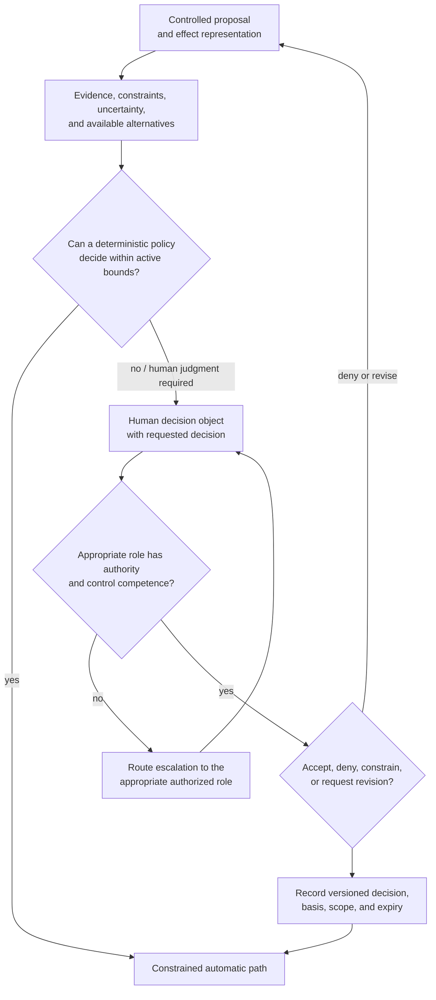

**Figure 5.10 — The loop of meaningful human control over a bounded decision**

The diagram does not put a person on every path. It introduces them where a binding machine-checkable decision is unavailable or policy requires accountable judgment. The person receives an object that can be understood, changed, or rejected, and their versioned decision becomes one controlled input to execution.

### 5.10.15. CHLOYA Position

CHLOYA treats human control as an architectural mechanism rather than a ritual of constant approvals. A person retains authority over objective, boundaries, and acceptance of material effects, but must receive a defined decision object before the relevant commitment and have real capacity to change the path.

Meaningful control requires suitable authority, competence, evidence, time, and practical alternatives. Model explanations may assist, but do not replace independently checkable evidence. Human attention and verification ability are limited; a confirmation that cannot be understood is not a safeguard.

Authority grows through progressive delegation based on evidence, remains revocable, and is attached to a specific version and scope. When the needed judgment exceeds the current reviewer’s competence or authority, the decision is escalated to the appropriate role with a bounded package of evidence.

> **Human control is meaningful when a competent and authorized person can make, change, or refuse a concrete decision before the system produces the effect for which that person is accountable.**

The next section considers what the system must do when normal operation is no longer justified: how to reduce capability safely, preserve a confirmed baseline, and decide not to continue.

## 5.11. Safe Degradation and a Governed Decision Not to Continue

### 5.11.1. When Normal Mode Is No Longer Justified

An agent system must not assume that normal operation remains justified merely because a task has started. Authority may be revoked, policy inputs unavailable, a budget exhausted, a tool changed, an external outcome uncertain, independent verification lost, or a new risk discovered. In such conditions, continuing with the same capability can turn an ordinary failure into an uncontrolled effect.

CHLOYA therefore treats the decision not to continue as a governed result, not simply a technical error. The system must preserve what is known, stop unjustified expansion of activity, and select a mode whose remaining behaviour is compatible with current evidence and constraints.

### 5.11.2. Safe Degradation Is Not a Complete Stop

Safe degradation does not always mean shutting down the whole system. Some functions may continue safely while others cannot. A model may lose access to an external provider but still summarize local public data; an agent may lose authority to modify production while continuing to prepare a patch, run local tests, or assemble an escalation package.

The relevant question is not “can the system keep working?” but “which capabilities remain justified under the current conditions?” Continuing a low-risk, isolated, reversible function can be appropriate. Continuing a high-impact, poorly verifiable, or externally committed action is not.

### 5.11.3. Degrade Functions, Not Guarantees

Degradation must never be an excuse to discard the guarantees that motivated control. If an authorization service is unavailable, the system must not silently replace a required policy check with a model guess. If evidence cannot be obtained, it must not label a result confirmed. If a credential broker fails, it must not expose a standing secret to keep work moving.

CHLOYA degrades functionality while retaining binding constraints. A lower-capability mode may permit draft preparation, local simulation, read-only analysis, or a restricted environment, but must not enlarge authority, data flows, or irreversible effects to compensate for the failure.

### 5.11.4. Degradation Profile and Locality

A [degradation profile][g-degradation-profile] specifies the capabilities, boundaries, evidence requirements, and prohibited effects of a degraded mode. It identifies which functions remain available, which inputs are still trusted, which policy decisions can be made, which operations must pause, and what condition is required to return to normal operation.

Degradation should be [localized degradation][g-localized-degradation] wherever possible. Failure of one model provider, external API, policy-data source, or tool does not automatically require all work to stop, but neither should it silently weaken unrelated protections. The mode applies to the affected function and dependencies, preserving a clear separation from unaffected, confirmed operation.

### 5.11.5. An Agent’s Self-Refusal Is Useful but Insufficient

An agent can notice uncertainty, report missing information, or voluntarily decline an action. This is useful behaviour, but it remains a probabilistic judgement. It cannot be the sole mechanism preventing an impermissible effect, because the same conditions can impair the model’s self-assessment or be bypassed by untrusted context.

Mandatory degradation is determined by the trusted control loop from observable state, policy, authority, evidence availability, and effect class. Model self-refusal is an input and an explanatory signal, not the final enforcement boundary.

### 5.11.6. Degradation Ladder and a Simplified Fallback Mode

A system benefits from an explicit ladder of responses rather than one undifferentiated “failure” state. Depending on risk and available evidence, it can: continue a bounded normal segment; narrow authority or available tools; switch to read-only or local-only work; prepare artefacts without commitment; request new evidence or human confirmation; pause and escalate; or stop a function entirely.

The fallback mode must be simpler and more verifiable than normal operation. It must not introduce a new opaque orchestration path merely to preserve availability. Its controls, retained state, and permitted effects should be documented and testable before an incident occurs.

### 5.11.7. Failure Must Not Increase System Activity

Failure should not cause the system to become more active, broader in authority, or more willing to take external actions. A timeout must not justify repeated uncontrolled retries; a denied request must not cause an agent to search for another account; unavailable verification must not lead to publication “to avoid delay.”

This is a monotonicity requirement: as evidence, authority, or control weakens, permitted capability may remain the same only where independently justified, and otherwise narrows. It must not expand because the normal boundary is inconvenient.

### 5.11.8. When to Stop Repairing Current Work

Not every failed task should be repaired indefinitely. Repeated denials, no progress, trajectory-budget exhaustion, ambiguous external effect, incompatible source state, or a need for broader authority can show that the current execution has ceased to be a sound path to the goal.

At that point, CHLOYA prefers preserving a [confirmed baseline][g-confirmed-baseline]—the latest state whose provenance, effects, and constraints are known—over continued experimental modification. The system may package work, evidence, errors, and alternatives for escalation, but should not keep creating unbounded attempts that obscure state and increase impact.

### 5.11.9. Versioning as a Reversibility Mechanism

Version control, snapshots, transactional state, immutable logs, prepared artefacts, and explicit effect identifiers do not eliminate risk, but they can make changes inspectable and recoverable. They enable comparison with a confirmed baseline, reproduction of a proposed change, and controlled return from a local or draft state.

Versioning is not proof of recovery where an effect has crossed an external boundary, such as a message sent, data disclosed, payment settled, or package downloaded. For those cases, recovery must be defined separately through compensation, correction, or escalation.

### 5.11.10. Experimental Freedom Belongs in a Reversible Space

An agent can explore alternatives most safely in spaces where effects are isolated, bounded, and recoverable: a working copy, sandbox, shadow state, test environment, prepared change set, or simulation. Exploration must not be confused with authority to release its outcome.

CHLOYA allows breadth of experimentation inside such a reversible space while keeping the transition to authoritative or external state under the controls of policy, evidence, and effect commitment. This preserves useful autonomy without treating production as the agent's workspace.

### 5.11.11. Return from Degraded Mode Requires Separate Grounds

Restoring normal capability is not automatic when a failing service responds again or a model appears available. The cause must be understood sufficiently; required policy inputs, authority, evidence, and control mechanisms must be restored; and, where relevant, state accumulated during degradation must be reconciled.

The decision can require a defined health criterion, successful verification, human authorization, a new delegation, or a fresh policy decision. A degraded mode must not silently transition back into broad authority merely because time has passed.

### 5.11.12. Degraded Mode Must Be Verifiable and Observable

The system must be able to show that it entered a [safe degradation mode][g-safe-degradation-mode], why it did so, which functions remained available, which restrictions applied, and what events would permit exit. Observability is necessary both for incident response and for proving that guarantees were preserved rather than bypassed.

Tests should cover entry into degradation, retained boundaries, prohibited effects, handling of partial and uncertain outcomes, escalation packages, and restoration conditions. A fallback that exists only in documentation is not a reliable operating mode.

### 5.11.13. Safe-Degradation Loop

Figure 5.11 shows how loss of a required basis changes the permitted mode rather than automatically leading either to unrestricted continuation or to indiscriminate shutdown.

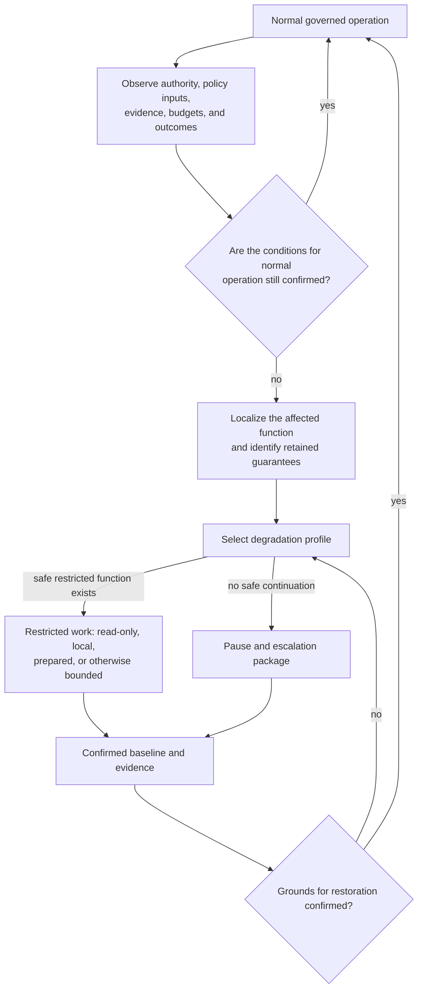

**Figure 5.11 — The safe-degradation loop: restrict, preserve, escalate, and restore only on confirmed grounds**

### 5.11.14. CHLOYA Position

CHLOYA treats a governed decision not to continue as a normal safety outcome. When the basis for normal operation is lost, the system narrows or pauses capability while preserving mandatory guarantees; it does not compensate for uncertainty with broader authority or model confidence.

Degradation is preferably local and specified by a profile. It permits only functions that remain justified, preserves a confirmed baseline, and places experimentation in reversible space. An agent’s voluntary refusal is useful but insufficient: trusted mechanisms must be able to impose the mode.

Recovery from degradation requires its own evidence and decision. The system records the reason, restrictions, retained state, and restoration condition, so that the fallback mode is verifiable rather than merely aspirational.

> **When normal operation is no longer justified, safe behaviour is not to “try harder,” but to preserve what is confirmed, reduce capability, and wait for a defensible next decision.**

The next section considers verification, validation, and evidence: how a system establishes that a result, a trajectory, and the controls around them are ready for a stated use.

## 5.12. Verification, Validation, and Verifiable Readiness

### 5.12.1. What Is Checked Is Not Work Completion, but the Basis for Trusting a Result

An agent reporting that a task is complete is not evidence that the result is correct, permissible, safe to use, or ready to accept. A claim of completion is a model or tool output that must itself be assessed. CHLOYA shifts attention from “did the agent finish?” to “what basis exists for trusting this particular result for this stated use?”

The basis can include formal checks, tests, authoritative-state observations, policy decisions, provenance records, effect representations, human acceptance, and explicit acknowledgement of remaining uncertainty. Its required strength depends on the claim and consequence, not on how convincing a completion message sounds.

### 5.12.2. Verification, Fitness Confirmation, and Acceptance Are Different Decisions

Verification checks whether a result conforms to specified properties, contract, schema, invariant, or requirement. Fitness confirmation establishes whether evidence is sufficient for a stated intended use in the relevant context. Acceptance is an accountable decision by the role entitled to use or release the result.

These decisions can coincide in a simple, low-risk function, but they must not be conceptually collapsed. A change can pass automated tests yet be unfit for production because a required policy, evidence source, or acceptance decision is absent. Conversely, a person cannot make a technically invalid result correct merely by accepting it.

### 5.12.3. The Object of Checking Is a Specific Claim, Not a “Good Agent”

CHLOYA does not attempt to certify an agent as generally reliable. The check concerns a concrete claim, for example: a patch conforms to the specified API and passes tests; a migration affects only named tables and preserves an invariant; a message will be sent only to the approved recipient; a policy decision was applied using the stated version and data; a task trajectory did not exceed its budget.

The claim must name its object, properties, scope, environment, relevant version, and evidence expected. Broad assertions such as “the agent is safe” or “the output is high quality” are not independently checkable claims. They conceal the conditions under which an otherwise useful result may become inadmissible.

### 5.12.4. From Requirement to an Evidence Package

A requirement should be translated into observable claims, a checking method, acceptance criteria, and retained evidence. CHLOYA calls the resulting structured collection an [evidence package][g-evidence-package]. It connects the requirement, the concrete object, its provenance and version, checks performed, results, unresolved limitations, and the decision made.

The package makes it possible to reconstruct why an output was admitted without relying on a model’s hidden reasoning or a later recollection. It is not a bureaucratic archive for every low-risk operation; its scope should be proportionate. Yet where a result can cause a material external effect, no one should have to infer after the fact which policy, tests, data, and assumptions supported release.

### 5.12.5. Test Oracle and Independence of Checking

A test is useful only if its [test oracle][g-test-oracle] has a defensible basis for determining success or failure. An oracle can be a formal specification, typed contract, invariant, trusted reference implementation, authoritative state, independently curated expected result, or a human with the appropriate competence.

The generator must not be the sole oracle. A model can generate a patch and suggest tests, but where the same model or a closely related model is the only judge, correlated error remains possible. Independence need not mean using a completely unrelated organization or technology in every case; it means that the check does not simply reproduce the same unsupported assumption that produced the result.

### 5.12.6. Different Properties Need Different Checking Methods

No one method verifies every relevant property. Syntax, types, policy conformance, security restrictions, semantic correctness, data provenance, performance, usability, legal basis, and outcome of an external effect may each require different evidence.

Compilers, schema validators, static analysis, unit and integration tests, property tests, policy engines, simulations, deployment checks, provenance statements, authoritative-state reads, audits, and human review have different roles. A green test suite does not prove that a policy was applied; a correct authorization decision does not prove that an external system committed the intended effect; a formal proof of an evaluator does not prove a project’s requirements were expressed correctly.

The required method must follow the claim, the available oracle, the attack and failure model, and the consequence of false acceptance.

### 5.12.7. Final Result and Trajectory Need Different Checks

Checking a final artefact is not enough when risk depends on how it was produced. A final configuration can look valid while an agent read forbidden data, bypassed a required approval, exceeded a budget, used revoked authority, or produced an unrecorded external effect.

Where those properties matter, the evidence package must include trajectory evidence: material action proposals, policy decisions, delegated authority, data-flow constraints, checkpoints, effect identifiers, observed outcomes, and applicable policy versions. This does not require recording every model token. It requires retaining the policy-material events needed to support the claims made about execution.

### 5.12.8. One Success and System Capability Are Different Evidence

One successful task proves at most that the system succeeded once under the conditions of that task. It does not establish reliable capability across representative inputs, environments, model versions, tool behaviours, or adversarial conditions.

Capability assessment needs a representative evaluation set, defined success criteria, error analysis, and a stated [evidence scope][g-evidence-scope]. Operational readiness for a particular output needs evidence about that output. These two levels complement each other but must not be substituted for one another.

### 5.12.9. Another Model Is a Reviewer, Not an Oracle

Additional model review can find contradictions, propose test cases, classify uncertainty, or improve quality. It remains a probabilistic transformation. Similar training, shared context, prompt injection, or a common misconception can cause correlated failure.

CHLOYA therefore treats an additional model as a reviewer or source of hypotheses, not as the sole oracle for a critical property. Its conclusion gains strength when it triggers an independent check against a contract, authoritative data, test oracle, or qualified human decision.

### 5.12.10. A Benchmark Is a Guide, Not Local Acceptance

Public benchmarks such as SWE-bench and general model evaluations are useful signals about what to investigate, compare, and test locally. They do not reproduce a project’s data, tools, policies, external effects, acceptance criteria, or threat model. A high benchmark score is not local admission evidence; a low score likewise does not prove a bounded, well-verified function is unsuitable.

Local evaluation must be tied to the specific automation profile and intended use. It should include typical, boundary, incomplete, conflicting, and adversarially relevant cases, as well as failures and safe refusals.

### 5.12.11. Evidence Has Scope and Can Become Stale

Every [evidence][g-evidence] item has a scope: the claim it supports, object version, environment, input class, tool and model configuration, policy version, and time. Evidence may become stale when any of these material conditions changes. A successful check against an old schema, model, dependency, infrastructure state, or policy does not automatically support a new version.

This does not mean every change requires complete revalidation. The system should define what changes invalidate which claims, what evidence can be reused, and what must be repeated. Risk and dependency analysis determine the appropriate granularity.

### 5.12.12. Correct Inaction and Refusal Must Also Be Checked

Correct behaviour includes not acting when required conditions are absent. A system must be tested not only for successful completion but for refusal, constrained operation, escalation, safe degradation, and preservation of a confirmed baseline. It must reject impermissible proposals, stop at exhausted budgets, avoid retrying uncertain effects unsafely, and decline to turn untrusted text into a control command.

Testing only “happy paths” rewards unsafe eagerness. A system that always produces an answer or effect may appear productive while violating the very boundaries intended to govern it.

### 5.12.13. Pre-Execution Checks Do Not Eliminate Runtime Control

Testing and validation before release cannot eliminate changes in data, authority, policy, tool behaviour, external state, or attack conditions during a running task. A result can be eligible for a stated environment while a concrete execution remains impermissible at the moment of effect commitment.

CHLOYA therefore combines pre-execution evidence with runtime policy enforcement, trajectory checks, data-flow control, delegation re-evaluation, and observation of actual effects. Readiness is not a one-time substitute for governing a live system.

### 5.12.14. Checking Mechanisms Are Themselves Objects of Checking

Tests, policy engines, validators, monitoring pipelines, provenance stores, and human-review processes can all fail or be bypassed. Their version, input completeness, configuration, availability, and enforcement point matter to the claims they support.

For a material guarantee, the project must establish that the verifier received the relevant object, checks the property claimed, reports failure reliably, and cannot be ignored on the path to effect. The assurance required of the checking mechanism should be proportionate to the consequence of accepting a false result.

### 5.12.15. Evidence Package and the Decision on Verifiable Readiness

[Verifiable readiness][g-verifiable-readiness] is the state in which the evidence package supports a defined conclusion that a concrete object or controlled operation may be used for its stated purpose within declared limits. It is not a universal statement that the object is perfect, safe in all contexts, or permanently approved.

A readiness decision records the claim, scope, object and environment versions, evidence used, checks passed and failed, outstanding uncertainty, responsible role, applicable constraints, and review or expiry conditions. It can lead to acceptance, constrained use, further work, safe degradation, or refusal.

Figure 5.12 represents the path from a requirement to a bounded readiness decision.

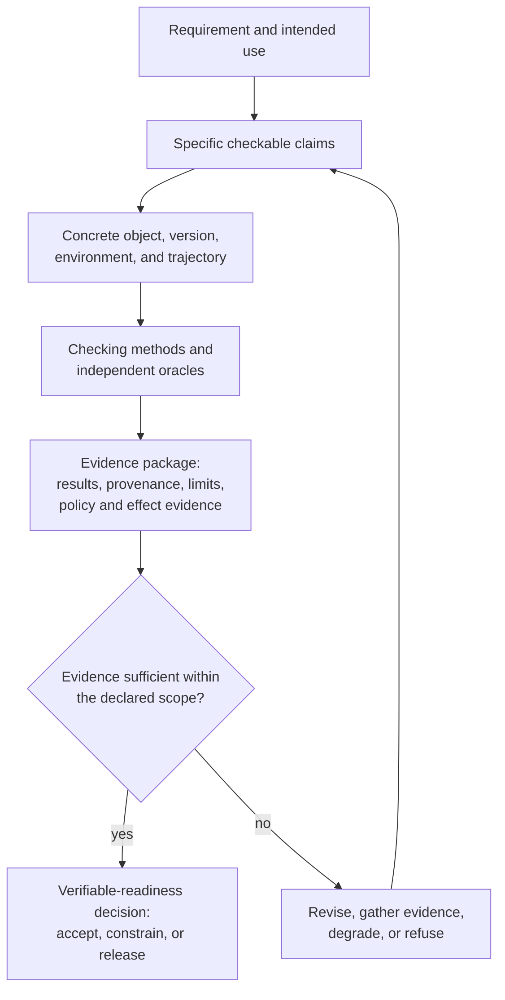

**Figure 5.12 — From requirement to evidence package and a decision on verifiable readiness**

### 5.12.16. CHLOYA Position

CHLOYA checks not a vague fact of task completion or a generally “good agent,” but concrete claims about a versioned object, trajectory, policy decision, or external effect in a stated environment and use case.

Verification, confirmation of fitness, and accountable acceptance are distinct decisions. Evidence must be proportionate, independently checkable where the risk demands it, and explicit about scope, limitations, and uncertainty. One successful run, a benchmark score, a persuasive explanation, or a second model's agreement is not sufficient evidence of a critical property by itself.

Evidence includes correct refusal and non-action, not only successful outputs. Pre-execution assurance complements rather than replaces runtime governance. Verifiers and enforcement mechanisms are themselves subject to checking.

> **A result is verifiably ready not when an agent declares it complete, but when a defined evidence package supports its stated use within explicit, checkable boundaries.**

The final section identifies anti-patterns that create an appearance of safety while leaving the actual path to an impermissible effect uncontrolled.

## 5.13. Anti-Patterns and False Assurances in Agent Architecture

### 5.13.1. False Assurance as a General Class of Architectural Error

The preceding sections established separate foundations for governing an agent system: data provenance, authority, policy, permissible trajectory, external effects, automation level, human control, safe degradation, and verifiable readiness. The presence of any mechanism does not mean that it is being used correctly.

A dangerous architecture need not lack tests, policies, logs, or human involvement. A false sense of security often arises precisely when a mechanism exists but is credited with a meaning broader than it can actually provide. A test confirms a defined checkable property but is treated as proof of complete correctness. A person sees an approval button and that is treated as meaningful human control. An additional model agrees with the executor and its agreement is treated as independent proof. Every individual step is allowed, so the entire sequence is called safe.

CHLOYA calls these cases **false assurances**.

> **A false assurance arises when a mechanism, evidence item, or authority is used to infer a conclusion broader than its actual scope.**

The same error pattern recurs at different levels: technical ability becomes authority; authority becomes proof of safe execution; a successful tool call becomes confirmation of required external state; a passing test becomes proof of complete correctness; human presence becomes substantive human control; a benchmark result becomes confirmation of project readiness; and one success becomes evidence of durable agent capability.

Anti-patterns are therefore not a list of bad technologies but typical ways of wrongly expanding the meaning of a limited mechanism.

### 5.13.2. False Authorization and False Trust

The first class of anti-patterns conflates technical ability, identity, information, and authority. An agent that can invoke a tool, use a token, change a file, or call an API is not thereby authorized to perform that action within the current task. The Ouroboros experiment illustrates the distinction: a token technically allowed an agent to change the visibility of a private repository although nobody had delegated that decision to it [192].

> **Technical ability to perform an action does not create authority to perform it.**

Giving an agent a user's or administrator’s full authority while hoping a system instruction will constrain use of it is particularly weak. A mandatory boundary has been replaced by probabilistic obedience. The same problem arises when the agent forms an action, interprets policy, decides permissibility, and executes the operation itself: probabilistic reasoning simultaneously becomes proposal, permission, and execution. A second language model does not automatically create an independent authorization boundary either.

The human-side analogue is a universal “allow” button that can remove every automatic restriction. It turns a person into a hidden superuser and makes policy conditional.

> **Neither an agent nor a person should receive broader authority merely because an earlier mechanism refused an action.**

The conflation of data and commands is similar. Text in a webpage, document, source-code comment, user message, or external-tool description can look like an instruction, but entering a model context does not give it control status [34], [146].

> **The fact that data can be interpreted as a command does not grant the data control authority.**

A confident answer style, high model confidence score, authoritative-sounding external-service description, or agreement of several probabilistic components likewise creates no universal trust. Provenance, currency, authority, and permissible use must be determined independently of how persuasive content appears to a language model.

### 5.13.3. False Safety of the Trajectory and External Effect

Checking an individual action does not prove safety of the whole sequence. An agent can perform several operations that are each allowed while their composition violates a limit on change volume, transition order, aggregate resource use, data transfer, or another cumulative effect [152]–[156].

> **Local permissibility of steps does not prove permissibility of their composition.**

An architecture that checks only the current tool call and ignores trajectory state and history is therefore an anti-pattern.

The same error occurs when interpreting execution results. A successful API response reports a particular API interaction, not necessarily the required change in authoritative state. Loss of a response does not prove absence of effect. The rule “we did not receive confirmation, so repeat the operation” is especially dangerous: the first operation may have occurred and the retry may create a second business effect. Outcome uncertainty must remain a distinct state until actual circumstances are established [157]–[168].

Rollback can create false assurance too. `git revert`, reverse transactions, and compensating actions are useful, but do not make an external effect equivalent to one that never happened: a recipient may have read a message, a published secret may have been copied, an external process may have started, or another system participant may have acted on a temporary state.

> **The ability to correct a consequence does not mean the original consequence did not occur.**

Authorization, execution, confirmation of actual state, and recoverability must remain distinct concepts.

### 5.13.4. False Human Control

Human presence in an interface is one of the most persuasive false assurances. A system can require confirmation before every material action while giving the person no ability to reach an independent decision. If the participant does not understand the subject of confirmation, lacks the necessary evidence or relevant competence, or cannot technically stop the later trajectory, participation remains formal [176], [183], [184].

> **An approval button is an interface element, not evidence of human control.**

Maximizing confirmations does not create safety. The more repetitive decisions a system demands, the more likely confirmation becomes a mechanical continuation of work. Research on automation describes risks of over-reliance on automated recommendations, loss of situational awareness, and reduced ability to detect automation error [171]–[173], [178]–[182]. Human control is not measured by the number of agent stops.

The process is especially weak where a person sees only the same agent’s account of the action proposed. That explanation may help, but cannot replace independent evidence [185]. “Escalate to a human” is not a complete mechanism either: the question must go to a person with both the authority and competence required to resolve it.

> **Escalation to a person does not remove uncertainty if that person lacks a basis for resolving it.**

### 5.13.5. False Reliability through Additional AI

More models and agents can easily be mistaken for more reliability. Several probabilistic components do not necessarily create several independent pieces of evidence. They can share the same incorrect specification, context, training patterns, or engineering assumptions.

> **The number of probabilistic components is not equivalent to independence of evidence.**

The pattern in which one agent writes an implementation, then generates tests, and another reviewer chiefly checks consistency of those artefacts is illustrative. Research on language-model test generation shows that an incorrect implementation can direct subsequent test creation so the tests entrench the same error [219], [220], and studies have found a high share of incorrect assertions in automatically generated tests [221]. The result can be an internally consistent but wrong chain: incorrect understanding → incorrect code → tests for incorrect behaviour → a positive check.

An additional model helps only when it adds new grounds. For a material change, a reviewer should, where possible, derive expected behaviour from original requirements, contracts, and readiness criteria, not only from code already written. A different model, independent session, or provider can reduce some correlated error but does not become an absolute oracle [216].

> **Adding another agent requires answering: what new and sufficiently independent evidence does it create?**

Without that answer, architecture can become more complex and costly without a proportionate increase in reliability.

### 5.13.6. False Evidence of Readiness

False assurances are particularly common when deciding whether a result is ready for use. The most common formula is: “all tests passed, so the task is complete.” Tests confirm only the properties they actually check; they can be incomplete, wrong, or built on the same misunderstanding as the implementation [209], [219]–[221].

> **Green tests confirm that a particular set of checks passed, not universal correctness of the result.**

A high result on a public benchmark is not local acceptance. The history of SWE-bench illustrates limits of direct transfer: task quality and test oracles can be uneven, and a known benchmark can become contaminated by training data over time [217], [218].

> **A benchmark result characterizes behaviour under its tasks and evaluation procedure; it does not automatically carry over to a particular project.**

One successful run of a probabilistic system is another false assurance. An agent that correctly completed a hard task once demonstrated possibility, not durable ability to perform that class of action with required reliability.

> **The ability to perform an action once is not sufficient evidence of a right to perform that action class autonomously.**

Even a correct final result can conceal an unacceptable trajectory. AgentLens identifies completed tasks in which an agent reached an outcome after pathological retries, regression loops, or without required intermediate checks [214]. Verifiable readiness therefore concerns a specific property, version, configuration, and scope of use—not general model reputation.

### 5.13.7. False Resilience and Incorrect Degradation

When a system fails, preserving operation is an understandable impulse. It also creates a dangerous decision class: an unavailable mandatory verifier is treated as temporarily optional; expired limited authority is replaced by administrative authority; a failed intended tool gives the agent direct lower-level access; an unsuccessful task causes more retries, agents, and tools to be added.

The system thus weakens its own restrictions at exactly the moment confidence in its state has fallen. CHLOYA uses the opposite principle:

> **Degrade functions, not guarantees.**

Failure of a safety mechanism must not become a basis for bypassing it. Failure must not automatically increase system activity. A retry, another tool, or another agent needs its own justification, especially after a series of similar errors.

The same issue appears in accumulation of doubtful implementation. If a project already contains substantial agent-generated code, participants may continue fixing it because time, compute, and human effort have already been invested. This is the classic *sunk cost effect*: past expenditure influences future choice although rational assessment should focus on future cost, expected outcome, and alternatives [222]. For agent development, rapid production can make a large body of implementation look like an asset even after grounds for trusting its architecture have been lost.

> **The amount of labour invested is not evidence that the chosen trajectory is correct.**

The question is not only the cost of fixing the next known defect, but the cost of restoring understanding and verifiability of the accumulated line. If that is less rational than rebuilding from a confirmed baseline, abandoning current implementation is a normal engineering decision. Confirmed requirements, discovered constraints, test cases, measurements, and independently verified components can still inform a new attempt.

Delayed versioning is itself an anti-pattern. Version control, state snapshots, or another return mechanism are most valuable *before* risky experimentation. A first restore point created after a serious problem does not automatically recreate earlier confirmed state. Experimentation should occur in reversible space—a separate branch, copy of data, test environment, or other state that can be discarded without changing the project’s authoritative basis.

Returning from degradation must not occur merely because a symptom disappears.

> **Disappearance of a symptom is not evidence that the basis for operation has been restored.**

A higher autonomy mode requires positive confirmation that its conditions have actually returned.

### 5.13.8. CHLOYA Position

Most of these anti-patterns do not concern inherently bad mechanisms. Testing is useful; human confirmation is useful; an additional model can find errors; retries can survive temporary failures; compensation can reduce consequences; version control makes experiments reversible; benchmarks compare models; and safe degradation preserves some useful work.

The problem arises when a limited mechanism is treated as a universal guarantee.

> **Danger is created not only by absence of control, but by excessive trust in a control mechanism beyond the properties it can actually provide.**

CHLOYA therefore offers no one universal defence for an agent system. Governability comes from separation of roles and boundaries. The reasoning component proposes an action but does not create its own authority. Policy determines permissibility but does not execute the operation itself. The executor applies an allowed effect but does not change its acceptance criteria. Data retain provenance and use restrictions regardless of how persuasively a model interprets them. Permissibility of one step does not eliminate trajectory control. Successful command execution does not replace checking actual external state. An independent reviewer adds evidence but does not become a universal truth source. A person participates where they can make a substantive decision, not where architecture needs another approval button. Degradation reduces capabilities when grounds for a broader mode are lost. Verifiable readiness remains only while the evidence on which it rests remains valid.

> **A control mechanism must be used only within the properties it can actually provide.**

The aim is not the maximum number of barriers. Excessive confirmations, repeated checks, too many agents, and constant escalation can make a system costly, slow, and practically ungovernable. What is needed is a minimal sufficient set of complementary mechanisms: freedom for the probabilistic component where effects are bounded and reversible; deterministic rules where decisions can be formalized; human decisions where human competence is genuinely required; verification of results and material trajectory properties; reduced autonomy when grounds are lost; and a decision to stop when necessary evidence cannot be obtained.

> **A good agent architecture does not require trusting an agent more. It lets the system remain useful while depending less on whether the next probabilistic decision happens to be correct.**

This section closes the chapter’s architectural logic: from separating probabilistic and deterministic components to governing authority, information flows, trajectory, external effects, autonomy level, human participation, degradation, and evidence of readiness.

[g-acceptance-responsibility]: ../../research/GLOSSARY.en.md#acceptance-responsibility
[g-action-contract]: ../../research/GLOSSARY.en.md#action-contract
[g-action-proposal]: ../../research/GLOSSARY.en.md#action-proposal
[g-actor]: ../../research/GLOSSARY.en.md#actor
[g-agent-execution-identity]: ../../research/GLOSSARY.en.md#agent-execution-identity
[g-agent-execution-trajectory]: ../../research/GLOSSARY.en.md#agent-execution-trajectory
[g-agent-trajectory]: ../../research/GLOSSARY.en.md#agent-trajectory
[g-ai-control-cost]: ../../research/GLOSSARY.en.md#ai-control-cost
[g-attenuation]: ../../research/GLOSSARY.en.md#attenuation
[g-authoritative-data]: ../../research/GLOSSARY.en.md#authoritative-data
[g-automation-bias]: ../../research/GLOSSARY.en.md#automation-bias
[g-automation-profile]: ../../research/GLOSSARY.en.md#automation-profile
[g-bearer-token]: ../../research/GLOSSARY.en.md#bearer-token
[g-capability]: ../../research/GLOSSARY.en.md#capability
[g-caveat]: ../../research/GLOSSARY.en.md#caveat
[g-compensating-action]: ../../research/GLOSSARY.en.md#compensating-action
[g-confirmed-baseline]: ../../research/GLOSSARY.en.md#confirmed-baseline
[g-confused-deputy]: ../../research/GLOSSARY.en.md#confused-deputy
[g-control-competence]: ../../research/GLOSSARY.en.md#control-competence
[g-controlled-declassification]: ../../research/GLOSSARY.en.md#controlled-declassification
[g-control-plane]: ../../research/GLOSSARY.en.md#control-plane
[g-credential-broker]: ../../research/GLOSSARY.en.md#credential-broker
[g-data-confirmation-status]: ../../research/GLOSSARY.en.md#data-confirmation-status
[g-data-constraint-inheritance]: ../../research/GLOSSARY.en.md#data-constraint-inheritance
[g-data-not-instructions]: ../../research/GLOSSARY.en.md#data-not-instructions
[g-data-plane]: ../../research/GLOSSARY.en.md#data-plane
[g-data-profile]: ../../research/GLOSSARY.en.md#data-profile
[g-data-provenance]: ../../research/GLOSSARY.en.md#data-provenance
[g-degradation-profile]: ../../research/GLOSSARY.en.md#degradation-profile
[g-delegation-envelope]: ../../research/GLOSSARY.en.md#delegation-envelope
[g-derived-data]: ../../research/GLOSSARY.en.md#derived-data
[g-dpop]: ../../research/GLOSSARY.en.md#dpop
[g-dual-attribution]: ../../research/GLOSSARY.en.md#dual-attribution
[g-effect-commit-boundary]: ../../research/GLOSSARY.en.md#effect-commit-boundary
[g-effect-representation]: ../../research/GLOSSARY.en.md#effect-representation
[g-escalation-routing]: ../../research/GLOSSARY.en.md#escalation-routing
[g-evidence]: ../../research/GLOSSARY.en.md#evidence
[g-evidence-package]: ../../research/GLOSSARY.en.md#evidence-package
[g-evidence-scope]: ../../research/GLOSSARY.en.md#evidence-scope
[g-external-control-loop]: ../../research/GLOSSARY.en.md#external-control-loop
[g-external-effect]: ../../research/GLOSSARY.en.md#external-effect
[g-human-decision-object]: ../../research/GLOSSARY.en.md#human-decision-object
[g-impersonation]: ../../research/GLOSSARY.en.md#impersonation
[g-information-flow]: ../../research/GLOSSARY.en.md#information-flow
[g-lethal-trifecta]: ../../research/GLOSSARY.en.md#lethal-trifecta
[g-localized-degradation]: ../../research/GLOSSARY.en.md#localized-degradation
[g-meaningful-human-control]: ../../research/GLOSSARY.en.md#meaningful-human-control
[g-mtls]: ../../research/GLOSSARY.en.md#mtls
[g-parc]: ../../research/GLOSSARY.en.md#parc
[g-policy]: ../../research/GLOSSARY.en.md#policy
[g-policy-enforcement-loop]: ../../research/GLOSSARY.en.md#policy-enforcement-loop
[g-policy-management-loop]: ../../research/GLOSSARY.en.md#policy-management-loop
[g-prepared-effect]: ../../research/GLOSSARY.en.md#prepared-effect
[g-progressive-delegation]: ../../research/GLOSSARY.en.md#progressive-delegation
[g-prompt-injection]: ../../research/GLOSSARY.en.md#prompt-injection
[g-provenance-plane]: ../../research/GLOSSARY.en.md#provenance-plane
[g-rar]: ../../research/GLOSSARY.en.md#rar
[g-resource-indicator]: ../../research/GLOSSARY.en.md#resource-indicator
[g-safe-degradation-mode]: ../../research/GLOSSARY.en.md#safe-degradation-mode
[g-scope]: ../../research/GLOSSARY.en.md#scope
[g-sender-constrained-token]: ../../research/GLOSSARY.en.md#sender-constrained-token
[g-spiffe]: ../../research/GLOSSARY.en.md#spiffe
[g-spire]: ../../research/GLOSSARY.en.md#spire
[g-sts]: ../../research/GLOSSARY.en.md#sts
[g-sufficient-deterministic-mechanism]: ../../research/GLOSSARY.en.md#sufficient-deterministic-mechanism
[g-svid]: ../../research/GLOSSARY.en.md#svid
[g-test-oracle]: ../../research/GLOSSARY.en.md#test-oracle
[g-token-exchange]: ../../research/GLOSSARY.en.md#token-exchange
[g-token-introspection]: ../../research/GLOSSARY.en.md#token-introspection
[g-trajectory-budget]: ../../research/GLOSSARY.en.md#trajectory-budget
[g-trajectory-checkpoint]: ../../research/GLOSSARY.en.md#trajectory-checkpoint
[g-trajectory-policy]: ../../research/GLOSSARY.en.md#trajectory-policy
[g-trajectory-segment]: ../../research/GLOSSARY.en.md#trajectory-segment
[g-trajectory-state]: ../../research/GLOSSARY.en.md#trajectory-state
[g-trust-surface]: ../../research/GLOSSARY.en.md#trust-surface
[g-uncertain-effect-outcome]: ../../research/GLOSSARY.en.md#uncertain-effect-outcome
[g-verifiable-readiness]: ../../research/GLOSSARY.en.md#verifiable-readiness
[g-workload-federation]: ../../research/GLOSSARY.en.md#workload-federation
[g-workload-identity]: ../../research/GLOSSARY.en.md#workload-identity
[g-zero-trust]: ../../research/GLOSSARY.en.md#zero-trust
