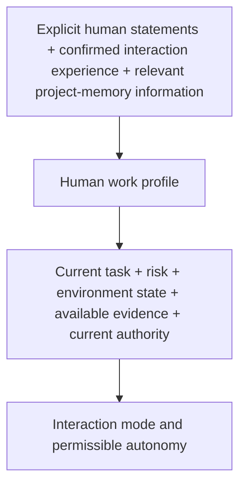

# Human Profile and Adaptive Autonomy

> **Version:** `0.3.1`  
> **Status:** under discussion

## Contents

- [10.1. The Human Work Profile in Governed Interaction with AI](#101-the-human-work-profile-in-governed-interaction-with-ai)
- [10.2. Composition of the Human Work Profile](#102-composition-of-the-human-work-profile)
- [10.3. Expertise, Ability to Perform a Task, and Ability to Verify a Result](#103-expertise-ability-to-perform-a-task-and-ability-to-verify-a-result)
- [10.4. Origin, Reliability, Currency, and Lifecycle of the Human Work Profile](#104-origin-reliability-currency-and-lifecycle-of-the-human-work-profile)
- [10.5. Autonomy as a Multidimensional Profile](#105-autonomy-as-a-multidimensional-profile)
- [10.6. What Permissible Autonomy Depends On](#106-what-permissible-autonomy-depends-on)
- [10.7. Progressive Delegation, Revocation, and Expiration of Autonomy](#107-progressive-delegation-revocation-and-expiration-of-autonomy)
- [10.8. Human Attention and Verification Capacity](#108-human-attention-and-verification-capacity)
- [10.9. Shared Working Understanding Between a Person and an Agent](#109-shared-working-understanding-between-a-person-and-an-agent)
- [10.10. Adapting Interaction to the Person](#1010-adapting-interaction-to-the-person)
- [10.11. Task Autonomy Profile and the Main Antipatterns](#1011-task-autonomy-profile-and-the-main-antipatterns)

## 10.1. The Human Work Profile in Governed Interaction with AI

In the preceding chapters of CHLOYA, the person was considered primarily as a participant in the governance loop: they set goals, establish permissible boundaries, make consequential decisions, evaluate the result, and intervene in the work of AI when necessary. For an architectural description, this is sufficient only up to a point. In a real process, the concept of “a person” is too general to determine the form of interaction and the permissible independence of AI.

The formal presence of a person in the loop does not mean that they are able to perform the function assigned to them substantively. One specialist may understand the subject area well but not know the structure of a particular software system. Another may be able to verify an implementation but lack the authority to accept the associated business risk. A product owner may have the right to determine the required system behavior but lack the knowledge needed to assess a cryptographic implementation independently. A developer who works confidently with application code is not necessarily able to verify a solution in network security, accounting, or law.

Role, authority, and actual ability to participate in a decision must therefore be considered separately. Chapter 7 already separates a participant's role from their technical capabilities and granted authority. This chapter adds another dimension: the characteristics of a particular person that matter for a particular class of joint work with AI.

CHLOYA uses the concept of a **[human work profile][g-human-work-profile]** to represent those characteristics.

A **[human work profile][g-human-work-profile]** is a limited, verifiable, and changeable representation of the characteristics of a person that matter for a particular class of joint work with AI: understanding the task, evaluating alternatives, verifying the result, making a decision, and organizing the interaction.

Such a profile is not a description of the person's personality as a whole. CHLOYA does not require a psychological portrait or an assessment of intelligence, character, temperament, or other properties unrelated to the work being performed. Nor should it become a universal user rating, a social score, or a long-term dossier from which the system automatically derives permissible actions.

The profile covers only properties that have a practical connection to the particular interaction.

Relevant examples may include a person's knowledge of the project's architecture, experience operating a particular DBMS, ability to verify a change to a programming interface, familiarity with the subject area, understanding of the consequences of a data migration, or previously and explicitly stated criteria for choosing among permissible solutions. These items have different scopes of applicability. A person's ability to verify a PostgreSQL change substantively says nothing about their ability to assess a cryptographic protocol. Familiarity with one project does not automatically transfer to another.

CHLOYA therefore does not treat labels such as “expert,” “beginner,” “technical user,” or “trusted user” as a sufficient description of a person. Such labels may be convenient in ordinary conversation, but they are too coarse for governing autonomy. An engineering process needs an answer to a more specific question: **what function can this person perform substantively with respect to this decision, and under what conditions?**

This distinction is especially important for human control. Research on human oversight shows that merely inserting a person into a decision chain does not provide substantive control. At a minimum, such control requires access to material information, the ability to understand the object of the decision, the ability to intervene, and real authority to affect the system's subsequent action [18], [19], [225], [226]. If a person merely presses a confirmation button without sufficient grounds for an independent assessment, the presence of a human participant creates the appearance of control rather than an additional safeguard.

The [human work profile][g-human-work-profile] is needed not to determine a person's value or trustworthiness, but to avoid assigning them functions they cannot perform substantively and to avoid basing AI autonomy on a false assumption of human control.

A person's ability to perform work, ability to understand how it is structured, ability to verify the result, and authority to make the final decision are not the same property. A person may be unable to create manually the entire result that AI can produce, yet retain enough understanding of the system to evaluate its purpose, boundaries, invariants, dependencies, failure modes, and conditions for safe recovery. Conversely, the ability to perform a technical operation independently does not imply the right to make the associated organizational or risk-bearing decisions alone.

These capabilities are distinguished in greater detail below, but even at the level of defining the profile it is important to reject the assumption that competence is a single universal quantity.

The [human work profile][g-human-work-profile] includes not only information about a person's knowledge and capabilities. In joint work, the **decision criteria** that the person explicitly uses when choosing among several permissible options may also matter.

When selecting a technology, for example, portability, ease of maintenance, availability of specialists, and the project owner's ability to understand the resulting code independently may matter. When selecting a name for an open standard, relevant properties may include ease of pronunciation, the ability to recover the spelling unambiguously from hearing it, international comprehensibility, absence of material conflicts, and the nature of the cultural associations it evokes.

Such criteria must not be treated as immutable or universal personal preferences. They exist within a particular class of decisions and may be revised as new information appears.

This can be seen clearly in the iterative search for a format name. A particular association may initially have been treated as a potential drawback, but after discussion the person may reinterpret it as an acceptable or even useful property of the future brand. In such a situation, the agent must not continue to use its own initial interpretation as an established fact. The person's explicit clarification changes the basis of the subsequent search.

This yields the following CHLOYA principle:

> **A machine inference about a person's preference, criterion, or capability remains a hypothesis until it has sufficient confirmation, and it must yield to an explicit human correction unless that correction conflicts with mandatory project rules.**

This principle is necessary for adaptive interaction. AI will inevitably detect recurring patterns in a person's decisions: which explanations they usually need, which options they reject, which properties they consider material, in which areas they verify a result independently, and where they request additional confirmation. Such observations can reduce repetitive coordination and improve the quality of joint work.

The ability to draw conclusions from interaction history also creates the opposite risk, however. A single decision may be mistakenly turned into a permanent preference. A local criterion may be carried over into an entirely different domain. An observation that was once valid may continue to be used after the person's experience, project, or goals have changed. The profile must therefore remain not an accumulation of immutable traits but a system of assertions with known provenance, scope, and possibility of revision. These properties are discussed in detail in § 10.4.

The history of previous decisions must not mechanically constrain subsequent work either.

If an option has already been investigated and rejected for a known reason, the agent should not present it again as new merely because another local search has rediscovered attractive properties of that option. Such behavior forces the person to repeat cognitive work that has already been performed and demonstrates a loss of continuity in the interaction.

The opposite extreme is equally undesirable. A previously rejected option must not become permanently forbidden. If the requirements have changed, the former drawback has disappeared, or new material grounds have emerged, the agent may return the option to consideration while stating explicitly why the previous decision is now being reconsidered.

The [human work profile][g-human-work-profile] and interaction history must thus provide **continuity without ossification**: previous decisions retain their significance while the grounds for those decisions remain valid.

This principle applies not only to individual proposals but also to the strategy of the joint search.

Adaptation to the person must not be reduced to changing response length, the amount of technical detail, or the form of an explanation. As shared context accumulates, the nature of the work itself may change: the breadth of the option space under consideration, the depth with which particular directions are investigated, the need to revisit previously rejected alternatives, the number of intermediate questions, and the point at which the search ends.

At the beginning of a research task, a broad search may be useful. Once stable criteria have been identified, the option space should be narrowed. Once a decision has been made, the task may move from exploration to verification, recording, and implementation. Continuing unconstrained generation of alternatives after that transition can make the work worse even if each individual alternative appears reasonable in isolation.

The state of the human decision therefore becomes part of the joint process. The agent must distinguish at least among situations in which a decision is still being explored, the criteria have already stabilized, the remaining options need to be compared, and the decision is sufficiently final that further exploration is justified only by new material grounds.

Such adaptation of the interaction does not grant AI additional authority.

The [human work profile][g-human-work-profile] is not a source of rights for either the person or the agent. A user's high competence does not authorize the agent to bypass established policy, obtain access to a production environment, waive mandatory independent verification, or expand the scope of the delegated task on its own. Likewise, a history of successful joint work must not become a universal basis for increasing authority.

Authority, technical capabilities, action risk, and the [human work profile][g-human-work-profile] belong to different layers of governance. The profile may change the manner of interaction within an established boundary, but it must not silently change the boundary itself.

This makes it possible to draw a fundamental distinction between **interaction adaptation** and **weakening safeguards**.

An expert may need fewer introductory explanations and more direct technical evidence. A person unfamiliar with a particular domain may need an additional explanation of the consequences or the participation of another specialist. Mandatory verification, however, must not disappear merely because the profile characterizes the user as experienced. If policy requires independent confirmation of a critical property, the [human work profile][g-human-work-profile] determines the form of the person's participation rather than eliminating the requirement itself.

The human profile is therefore one input to adaptive autonomy, but it is neither the only input nor the principal source of permission. Permissible independence must simultaneously account for task properties, risk, uncertainty, reversibility of the action, the possibility of independent verification, environment state, available evidence, and the characteristics of the participants able to make or verify the particular decision.

Research on [adjustable autonomy][g-adjustable-autonomy] has long shown that it is appropriate to vary the degree of a system's independence according to the situation rather than impose one permanent level on every action [20], [236]. CHLOYA extends this logic to the human side: the same technical task may require different forms of interaction with different people, while the requirements for safety and demonstrable properties of the result must not change arbitrarily.

The [human work profile][g-human-work-profile] is also connected to the problem of shared understanding between a person and AI. Joint work requires not only access to the same facts but sufficient alignment in the understanding of the goal, criteria, constraints, and significance of material facts for the current decision. Research on human-agent interaction treats the formation of such common ground as a distinct collaboration mechanism [445], while contemporary studies of software-agent behavior show that developers expect agents not only to perform technical tasks but also to observe processes, quality requirements, and norms of joint work [444].

Adaptation must therefore reduce unnecessary communication without eliminating necessary alignment of meaning. The better the agent understands the [human work profile][g-human-work-profile] and the history of accepted decisions, the less need there is to discuss established criteria again. But if a material divergence in the understanding of a goal, constraint, or consequence of an action is detected, a history of successful interaction is not a basis for a silent assumption.

CHLOYA thus treats the person neither as a constant system parameter nor as a universal source of truth. Their knowledge changes, their experience accumulates and can become outdated, their criteria are revised, their familiarity with a project deepens or fades, and the scope of substantive verification depends on the particular task.

The [human work profile][g-human-work-profile] is therefore a **local, changeable, and domain-bounded representation**, used only where a person's characteristics genuinely affect the organization of joint work.

The chapter's principal rule can be stated as follows:

> **CHLOYA adapts interaction not to an assumed personality, but to verifiable conditions of joint work: the person's relevant knowledge, ability to understand and verify a particular class of decisions, explicitly stated selection criteria, established authority, and history of corrections to the joint process.**

This approach avoids two opposite extremes. On the one hand, a person is not treated as the same universal controller for every task. On the other, AI is not allowed to construct an opaque personality model independently and use it to change the boundaries of permissible action.

The [human work profile][g-human-work-profile] is used not to assess the person but to structure joint work more precisely. The following sections examine its composition, the relationship between expertise and [control competence][g-control-competence], the origin and currency of profile information, and then how the human profile, together with task properties, risk, and available evidence, participates in the formation of adaptive autonomy.

[Back to contents](#contents)

## 10.2. Composition of the Human Work Profile

The preceding section defined the [human work profile][g-human-work-profile] as a limited and changeable representation of the characteristics of a person that matter for joint work with AI. This definition does not imply that the methodology should gather the most detailed possible information about a user in advance. On the contrary, the value of a profile is determined not by how completely it describes a person, but by how well the information it contains helps organize particular work without creating unnecessary assumptions or expanding the scope of profiling without need.

The [human work profile][g-human-work-profile] is therefore built on the principle of a **minimally sufficient representation**. It includes only characteristics capable of changing the formulation of a task, the way options are presented, the possibility of substantive verification, the need for additional coordination, or the permissible mode of interaction. Information with no such connection must not be collected merely because it can technically be obtained.

This distinguishes the [human work profile][g-human-work-profile] from a universal user dossier.

What matters to CHLOYA is not who the person is in general, but **which functions they can perform substantively with respect to a particular class of decisions**. The same person may be highly competent in database operations, have limited experience developing its internal extensions, and have almost no basis for an independent assessment of a cryptographic scheme. Collapsing all these differences into the single category “expert” destroys precisely the information for which the profile is introduced.

The profile must therefore be multidimensional and domain-bounded.

One of its foundations is **domain competence**: understanding the field in which the decision arises. This may concern how a business operates, the rules of a domain model, infrastructure operations, information security, user experience, legal constraints, or another area material to the particular task.

Domain competence is not the same as technical mastery of a tool. A person may understand PostgreSQL operations, backup, and recovery deeply without developing DBMS kernel components. Likewise, a specialist may be highly proficient in a programming language while failing to understand the domain consequences of changing a financial algorithm.

**Technical competence** is therefore considered separately: the ability to work with particular technologies, tools, architectural mechanisms, and implementation methods.

Even that distinction is not enough. Knowledge of a technology does not imply knowledge of a particular project.

An experienced specialist may encounter for the first time a system governed by architectural trade-offs, historical constraints, and local rules unknown to them. At the same time, a person with less broad professional training may have maintained a particular project for many years and know the reasons behind decisions that appear arbitrary or mistaken to an outside expert.

**Project familiarity** is therefore an independent component of the [human work profile][g-human-work-profile].

Project familiarity characterizes not the volume of information stored about the system, but the person's ability to use that information in work: to understand architectural relationships, recognize options already considered, account for known constraints, compare a new change with previous decisions, and notice situations in which a formally correct proposal conflicts with the accumulated structure of the project.

The project knowledge itself must not be copied into the [human work profile][g-human-work-profile]. Architecture, decision history, reasons for rejecting alternatives, and current constraints belong to [project memory][g-project-memory] and context management. The profile records only the relevant characteristic of the person, such as sufficient familiarity with a particular area of the project to participate in a particular decision.

This separation prevents a second, parallel store of project knowledge from emerging inside the user profile.

A special place belongs to **[control competence][g-control-competence]**, already introduced in CHLOYA: the combination of current knowledge, technical understanding, and practical experience sufficient for an independent assessment of an AI decision or result in a particular class of tasks.

[Control competence][g-control-competence] cannot be inferred automatically from a person's ability to perform similar work. The relationship between creating and verifying a result is complex. In some tasks, verification is substantially easier than creation: a person may be unable to reproduce the entire result manually yet understand its properties, constraints, and correctness criteria well enough. In other fields, substantive verification requires almost the same depth of knowledge as independent implementation.

The [human work profile][g-human-work-profile] must therefore be able to record [control competence][g-control-competence] separately from the ability to execute the work.

This capability is particularly important where a person participates in the process as a verifier or accepts the result. Research on [meaningful human control][g-meaningful-human-control] shows that a person's formal presence is insufficient: they must possess the knowledge, have access to material information, be able to understand the object of the decision, and be able to affect the system's subsequent action in practice [225], [226].

The [human work profile][g-human-work-profile] must not replace such an assessment with a job title, length of service, or the person's self-description.

For example, the entry “senior developer” says almost nothing about the ability to verify a change to a particular authentication scheme independently. Similarly, long experience operating one version of a technology does not guarantee current competence with respect to a tool that has changed substantially. The next section examines in detail the differences among expertise, the ability to perform work, the ability to understand it, and the ability to verify the result.

In addition to a person's capabilities, **decision criteria** matter in joint work.

Many engineering tasks admit several technically acceptable options, and the choice among them cannot be derived completely from formal correctness. Maintenance cost, reversibility, implementation complexity, portability, availability of specialists, development speed, transparency of the design, possibility of independent verification, and other properties become material.

The composition and importance of such criteria depend on the class of decision.

When choosing a technology for a small project, for example, the owner's ability to understand and verify the code independently may be more important than maximum performance. For an infrastructure component, predictable behavior, maturity of the tool, and recoverability may come first. For the name of an open international standard, ease of pronunciation, recoverability of spelling from hearing it, naturalness of the expansion, cultural associations, and absence of conflicts in the relevant field may matter.

A useful representation of a criterion must consequently preserve its scope of application.

The statement “the person prefers Python” is too broad and will almost inevitably cause a past choice to be transferred incorrectly to a new task. A much more substantive assertion is that, for a particular class of small projects maintained personally, the owner's ability to read and verify the implementation is considered a material technology-selection criterion.

This distinction makes it possible to use accumulated decision history without turning it into a set of permanent preferences.

The [human work profile][g-human-work-profile] may also contain **interaction parameters** when they genuinely affect the effectiveness of joint work.

One person may prefer to see the overall structure of a solution first and then reveal the technical details. Another may need a comparison of several alternatives before a consequential architectural choice. Frequent intermediate checkpoints are useful in one process and create unnecessary interruptions in another. Some information is best presented immediately as evidence and concrete changes; other information should be preceded by an explanation of the consequences.

Here it is especially important not to conflate individual adaptation with general requirements for correct work.

For example, proposing a previously rejected option again without new grounds is not merely a violation of a user preference. It is a more general defect in the continuity of the joint process. Likewise, the requirement to state [substantial uncertainty][g-substantial-uncertainty] explicitly must not disappear merely because a particular person usually prefers concise answers.

The [human work profile][g-human-work-profile] therefore includes only individually significant interaction parameters, while general requirements for quality, safety, provenance of information, and preservation of decisions remain rules of the methodology and the project.

A person's **authority** must exist separately from the [human work profile][g-human-work-profile].

Competence and authority answer different questions.

The [human work profile][g-human-work-profile] helps establish whether a person can substantively understand, verify, or evaluate a particular object. The [authority profile][g-permission-profile] and governance rules determine whether that person has the right to make the corresponding decision.

These properties may coincide, but neither follows from the other.

A specialist may possess sufficient technical competence to evaluate a change but lack the right to authorize its use in a production environment. A product owner may be authorized to accept a particular business risk but lack the [control competence][g-control-competence] needed to verify the technical premises of that decision independently.

CHLOYA must therefore not store access rights or authority as an inherent property of the [human work profile][g-human-work-profile].

The connection is possible only through the current state of the governance loop:

**The [human work profile][g-human-work-profile] answers whether a person is capable of participating; the [authority profile][g-permission-profile] answers whether they have the right to make or execute the decision.**

This distinction is particularly important in long-term work. Competence may remain after a job role changes even though authority has already been revoked. Conversely, appointing a person to a new role may grant them the organizational right to make a decision without automatically creating the competence needed to verify all of its technical aspects independently.

Alongside relatively stable characteristics, there is a **current state of participation** that must not automatically become a permanent profile characteristic.

A person may possess sufficient competence but be unable to conduct a substantive verification at a particular moment. The reason may be a lack of time, a high current workload, a long interruption in work with a particular technology, lack of access to necessary data, or the person's own statement that in their present state they are not ready to make a particular class of decisions.

Such a state directly affects joint work, but its scope is limited to the particular situation.

For example, the statement “I have not worked with this version of Kubernetes for a long time and am not ready to confirm the architectural decision independently right now” must not become the long-term assertion “this person does not know Kubernetes.” It should temporarily affect the current verification loop and, where necessary, lead to involving another specialist, obtaining additional evidence, or reducing autonomy.

This distinction connects the [human work profile][g-human-work-profile] to the later discussion of human attention and [verification capacity][g-verification-capacity]: possessing competence does not imply having sufficient resources to apply it at a particular moment.

The [human work profile][g-human-work-profile] is not an interaction log either.

Dialogue history, options discussed, decisions made, reasons for rejecting alternatives, and recorded constraints belong to [project memory][g-project-memory], task history, or another appropriate source. Moving all that content into the human profile would create a duplicate store with rapidly growing volume and unclear status.

The profile should contain only **relevant generalizations** derived from such sources.

For example, the decision to use the name IMXO belongs to the state of the project. The history of names previously investigated and rejected belongs to the history of the decision. A confirmed observation that ease of pronunciation and recoverability of spelling matter for this class of naming tasks may become an element of the [human work profile][g-human-work-profile] if that information is genuinely needed for a subsequent search.

The provenance of such a generalization must remain traceable. The profile must not turn an agent's observation into an unattributed fact about a person.

It is therefore useful to distinguish three levels:

**source event or statement -> generalization about the person -> application of that generalization in a new task.**

Each transition can introduce an error.

The person may have changed their mind. The agent may have misunderstood the reason for the decision. The new case may only appear similar. Detailed rules for the provenance, confirmation, currency, and revision of [human work profile][g-human-work-profile] elements are therefore considered separately in § 10.4.

For the composition of the profile, it is enough to establish that an element with no known scope of applicability and no grounds of provenance must not be used as a reliable characteristic of a person.

This yields another constraint: the profile must not be elaborated in advance to the greatest possible level of detail.

It is formally possible to create a vast matrix of a person's knowledge across technology versions, individual mechanisms, operations, and types of decision. Such a representation would quickly become unmaintainable, while its apparent precision would exceed its actual reliability.

The opposite extreme, a single entry such as “PostgreSQL: expert,” is also insufficient.

The detail of the [human work profile][g-human-work-profile] must therefore be **proportionate to the decision** for which the profile is used.

If a task concerns PostgreSQL backups, it may be enough to establish the presence of current [control competence][g-control-competence] in the relevant operational area. A question about the design of an internal extension in C requires a different characteristic. There is no need to decompose the entire professional field into hundreds of potential subfields in advance while that detail does not affect a real decision.

CHLOYA thus uses the principle of **lazy profile elaboration**: refinement occurs when the existing level of representation becomes insufficient for organizing particular work.

This approach both reduces the amount of data that must be maintained and limits unnecessary profiling.

The logical relationship between the work profile and the rest of the CHLOYA architecture can be represented as follows:

This diagram does not mean that the [human work profile][g-human-work-profile] is calculated automatically from the user's entire history. It shows the separation of responsibilities among layers.

[Project memory][g-project-memory] is responsible for preserving project state and decision history. Context management is responsible for selecting information and preserving its provenance. The governance loop is responsible for authority and action boundaries. The [human work profile][g-human-work-profile] represents only those characteristics of a particular person that are needed for joint work in the given class of tasks.

The [human work profile][g-human-work-profile] may therefore include information about domain and technical competence, familiarity with a particular project, [control competence][g-control-competence], relevant decision criteria, and individually significant interaction parameters. None of these components, however, is mandatory in itself. The need for a particular element is determined by whether its absence affects the quality of joint work or the selection of a permissible autonomy mode.

Two principal constraints follow.

First, **a profile property must not be extended beyond the domain for which grounds exist to apply it**. Competence in one technology, a criterion for one class of decisions, or a preferred interaction method does not transfer automatically to another domain.

Second, **the profile must not be more detailed than the current class of joint work requires**. The more information the system attempts to infer about a person without practical need, the greater the risk of false generalizations, obsolescence, and transformation of a working mechanism into opaque profiling.

The [human work profile][g-human-work-profile] in CHLOYA is therefore built not around the question “what does the system know about this person?” but around the narrower question:

> **What confirmed information about the person is necessary to organize this particular joint work correctly and avoid assigning a function to either the person or AI on the basis of a false assumption?**

This representation creates the basis for subsequently determining adaptive autonomy, but it does not yet determine autonomy by itself. It is first necessary to examine the most complex profile component in greater detail: human competence and the distinction among the ability to perform work, understand it, verify the result, and make the corresponding decision.

[Back to contents](#contents)

## 10.3. Expertise, Ability to Perform a Task, and Ability to Verify a Result

The [human work profile][g-human-work-profile] cannot be built around a single general attribute of expertise. Descriptions such as “experienced developer,” “PostgreSQL expert,” or “nontechnical user” are too coarse to determine which function a person can perform substantively in joint work with AI.

Expertise always has a scope of applicability. A specialist may understand PostgreSQL operations, failure recovery, and replication deeply while not developing internal DBMS extensions. An experienced application developer may confidently verify program logic while lacking the preparation needed for an independent assessment of a cryptographic protocol. Knowledge of a programming language likewise does not imply understanding of the domain in which code written in that language is used.

CHLOYA therefore does not treat expertise as a universal human property, much less as a numerical level that automatically extends to new tasks. Expertise may provide one basis for a hypothesis about a person's capabilities, but those capabilities must themselves be considered relative to a particular class of work.

At least four different properties must be distinguished:

**ability to perform a task**: the ability to obtain the required result independently;

**[operational understanding][g-operational-understanding]**: sufficient understanding of the system's purpose, boundaries, material dependencies, invariants, principal failure modes, verification methods, and recovery methods;

**[control competence][g-control-competence]**: the ability to assess a decision or result independently and detect a material discrepancy;

**authority to make the decision**: the right to approve the result, accept the associated risk, or authorize the transition to the next state.

These properties may be related, but none should be inferred automatically from another.

A person able to perform the work independently usually possesses much of the knowledge needed to verify it, but even this does not guarantee sufficient [control competence][g-control-competence] across every aspect of the result. The implementer may understand the implementation well while failing to understand some consequences for security, operations, or the domain.

The reverse relationship is even less clear-cut. A person may be able to verify some results substantively although they could not reproduce them quickly on their own. They may understand the required behavior, know the critical invariants, recognize a violation of an architectural boundary, and have sufficient means of verification without creating the entire artifact manually.

For this reason, requiring “the person must be able to do everything the AI does” would be excessive. It would effectively eliminate much of the benefit of automation.

The opposite assumption, “AI will create it and the person will always be able to verify it,” is just as mistaken.

For some tasks, substantive verification requires nearly the same depth of professional knowledge as independent execution. A person who does not understand the cryptographic properties of a protocol does not become a competent verifier merely because they can read an AI-generated explanation. Likewise, understanding program syntax does not imply an ability to detect erroneous financial, medical, or legal logic.

Human verification must therefore be treated as a capability in its own right, not as a function automatically available to any participant in the process.

Research on [meaningful human control][g-meaningful-human-control] confirms the importance of this distinction. Cavalcante Siebert et al. connect meaningful control not merely with the presence of a person, but with conditions under which that person can actually affect the system and perform the corresponding function [184]. Sterz et al. show that effective oversight depends on real access to necessary information, the ability to understand what is happening, and the ability to influence the result [225]. Van de Sande et al. examine the same problem, emphasizing that a formal “human-in-the-loop” arrangement does not by itself guarantee substantive human oversight [226].

For CHLOYA, this yields the following principle:

> **A person must be assigned not an abstract role of verifier, but a control function for which sufficient grounds exist to believe that they can perform that particular verification.**

This principle does not require turning every joint activity into an examination of human qualifications. It requires a narrower caution: the system must not treat human confirmation as complete evidence merely because confirmation was obtained.

**[Operational understanding][g-operational-understanding]** is especially important here.

As AI develops, a person may cease to perform a substantial portion of low-level work directly. This does not necessarily mean losing substantive command of the system. A person may no longer write most of the concrete code manually while retaining a sufficient model of the system to govern its changes meaningfully.

Such understanding does not mean knowing every line of the implementation. It means being able to answer higher-level questions: why a component exists, where its boundaries lie, which properties must not be violated, what it depends on, how it can fail, how a change can be verified, and how the system can be restored to a safe state.

In this sense, [operational understanding][g-operational-understanding] is an intermediate level between reproducing the work in full and superficial familiarity with the result.

It allows a person to retain a substantive role even when direct execution has been partially delegated to AI.

[Operational understanding][g-operational-understanding] is not, however, a universal substitute for deep professional competence. For some classes of decisions, understanding external properties, invariants, and verification mechanisms is sufficient. For others, assessing material risk requires knowledge of internal design. The required depth of human understanding is therefore determined not by an abstract desire to “keep the person informed,” but by the decision they must make and the properties of the result they must confirm.

This yields another important distinction:

> **The ability to understand a result is not the same as the ability to verify its correctness.**

A person may understand an architectural explanation well and see the overall logic of a proposed solution while lacking grounds for an independent conclusion about its safety or correctness.

Generative AI makes this substitution especially dangerous because it can both produce a solution and explain persuasively why that solution is correct.

The sequence

**AI creates a solution -> AI explains the solution -> a person accepts the same AI's explanation as confirmation of correctness**

does not create independent verification.

Research on human-AI interaction likewise gives no basis for treating explanation as a universal remedy against uncritical adherence to a recommendation. Chen et al. showed that the effect of explanations depends on their form and on a person's ability to relate the explanation to their own knowledge [258]. In a series of experiments, Cecil et al. found that the presence of explanations did not eliminate the negative effect of erroneous AI recommendations on human decisions [261].

CHLOYA therefore adopts a narrower conclusion:

> **An explanation can improve understanding of a result, but by itself it neither creates [control competence][g-control-competence] nor constitutes independent evidence that the explained decision is correct.**

A person must be able not only to understand the reasoning but also to challenge it, verify it against an independent source, apply their own knowledge, or use another verification mechanism.

Automated evidence can substantially change the nature of human work.

If AI hands a person a large volume of generated code without supporting evidence, much of the burden lies in manually reconstructing the logic and searching for possible errors. If the result is accompanied by reproducible tests, static analysis, contract verification, comparison with the initial state, and other independent evidence, the object of human verification changes.

A person no longer has to recheck every low-level property manually if an appropriate mechanism genuinely confirms it. Their task can shift to higher-level questions: whether the property under verification was formulated correctly, whether it corresponds to the original intent, whether the evidence has sufficient scope, and which material risks remain unverified.

Thus:

> **Automated evidence does not eliminate human competence; it can shift that competence from repeating low-level verification to evaluating the formulation, sufficiency, and scope of evidence.**

This principle connects the [human work profile][g-human-work-profile] with the CHLOYA architecture of evidence and verifiable readiness introduced earlier. The more properties of a result can be confirmed by reproducible mechanisms, the less need there is to make human review the sole basis of correctness. But automated verification does not permit properties that the particular mechanism does not actually check to be treated as proven.

Research also shows that a person's domain preparation affects how they interact with AI. In an experiment by Dikmen and Burns, additional domain knowledge affected participants' ability to distinguish situations in which system recommendations deserved different degrees of trust [257]. Peng et al. found an interaction between user preparation and AI capabilities, with the effect of human experience on the joint result proving more complex than a simple rule that “a more experienced user always performs better” [260].

This further demonstrates why the [human work profile][g-human-work-profile] must not be reduced to a single scale of expertise.

Self-assessment creates an additional problem.

A person may consider themselves competent in a field and overestimate their ability to conduct independent verification. The opposite is also possible: a specialist may underestimate their knowledge and delegate to AI a decision they could control substantively themselves. Grawitch, Winton, and Mudigonda show that subjectively perceived personal competence can affect the use of AI recommendations even when it does not coincide with actual knowledge [262].

A person's assertion of their own expertise is therefore useful input, but not universal evidence of [control competence][g-control-competence].

Likewise, job title, education, certification, length of service, and number of completed projects may support a profile assessment, but none alone confirms the ability to verify a particular decision.

Research by Perry et al. further illustrates the danger of confidence in a result when using AI: in the tasks they studied, participants assisted by AI not only produced less secure code but also more often rated their result as secure [74]. This finding concerns a limited set of tasks and must not be interpreted as a universal effect of AI assistants, but it clearly illustrates the general risk: a person's subjective confidence is not the same as demonstrated correctness of the result.

CHLOYA must consequently distinguish a **feeling of understanding** from a **sufficient basis for control**.

This distinction can even affect engineering technology choices.

When designing a system, technical solutions are usually compared in terms of performance, maturity, library availability, portability, maintenance cost, and other characteristics. Agentic development may add another criterion: the project owner's ability to retain [operational understanding][g-operational-understanding] and [control competence][g-control-competence] with respect to the system being created.

This factor appeared, for example, in the design of CommentRake. Choosing Python was considered not only as a choice of implementation language, but also as a way to preserve the project owner's ability to read AI-generated code independently, understand proposed changes, and intervene in the implementation when necessary. This does not establish a rule to “always use only technologies already familiar to the person.” If another technology is necessary for performance, security, or architectural reasons, human familiarity must not outweigh more material constraints.

The example demonstrates something else:

> **A person's ability to retain substantive command of the system being created may be an independent engineering criterion when several technical alternatives are otherwise permissible.**

The [human work profile][g-human-work-profile] can thus affect not only the form of dialogue with AI but also the structure of the work itself.

[Control competence][g-control-competence] must not be conflated with decision-making authority.

A technical specialist may be able to assess an implementation well but lack the right to accept a business risk alone. A manager or product owner may have the right to accept the risk but be unable to confirm the technical premises of the decision independently.

In such a case, a substantive process can separate several objects of human decision.

A specialist confirms a technical property. Another participant accepts the associated organizational or business trade-off. Automated mechanisms confirm properties for which reproducible verification is available. The final decision is assembled from different grounds rather than replaced by a single formal confirmation button.

This separation corresponds to the distinction among role, capability, and authority already introduced in CHLOYA.

The reverse substitution would be especially dangerous: assuming that authority automatically makes a person a competent verifier.

The organizational right to authorize an action does not create technical knowledge.

Another principle can therefore be stated:

> **Authority determines who has the right to make a decision; [control competence][g-control-competence] determines who can verify the corresponding property substantively. These functions may belong to the same person, but the methodology must not assume that they coincide by default.**

Expertise remains a useful but derived concept.

Repeatedly confirmed experience in a particular class of tasks may provide strong grounds for expecting corresponding execution and control capabilities. But one successful result, several successful interactions with AI, or an absence of detected errors does not yet provide sufficient grounds for a universal conclusion about expertise.

Competence also changes over time.

Technologies develop, projects change, a person may spend a long time away from a particular field, and some skills may degrade as a result of automation. Even a capability well confirmed in the past must therefore not become an indefinite property of the [human work profile][g-human-work-profile].

The provenance, scope, currency, and modification of such information are considered in the next section.

At the level of this section, it is enough to establish the principal rule:

> **CHLOYA does not require a person to reproduce manually all work performed by AI. It requires the function left to the person in the joint loop to match that person's real ability to perform that particular function substantively.**

If a person makes a domain decision, they must understand its meaning and consequences.

If they are expected to conduct a technical verification, they need the corresponding [control competence][g-control-competence].

If they accept residual risk, they need sufficient understanding of that risk and the corresponding authority.

If any of these conditions is absent, formal human participation does not close the resulting gap.

A person therefore does not have to surpass AI in the ability to create a result in order to retain a governing role. But they must remain sufficiently competent in precisely those properties of the result for which substantive assessment or a decision is expected from them.

This distinction allows CHLOYA to design for the joint use of human and machine competence rather than opposing them. AI can perform an increasing share of direct work, reproducible mechanisms can confirm an increasing number of verifiable properties, and people can retain control where domain understanding, assessment of evidence sufficiency, choice of trade-off, or acceptance of consequences is required.

The next question is no longer which kinds of human capability exist, but **where the system obtains information about those capabilities, how much that information can be trusted, and how long it remains current**.

[Back to contents](#contents)

## 10.4. Origin, Reliability, Currency, and Lifecycle of the Human Work Profile

A [human work profile][g-human-work-profile] is useful only when the characteristics it contains can justifiably be used in the current work. It is not enough to record once that a person is familiar with a technology, can verify a class of decisions, or considers a particular criterion material. For every such assertion it is important to understand **where it came from, which domain it applies to, how well it is confirmed, and whether it remains current when used**.

An element of the [human work profile][g-human-work-profile] in CHLOYA should therefore be treated not as a permanent property of a person, but as a bounded assertion with grounds and a scope of applicability.

An entry such as

`PostgreSQL: expert`

does not reveal exactly what was confirmed, when it was established, or for which work the assertion may be used. A representation whose meaning can be stated as follows is much more substantive:

> there are grounds to believe that the person can substantively verify a particular class of PostgreSQL operational changes under specified conditions.

Such an assertion does not claim to describe the person in general. It connects a specific capability with a specific domain and leaves room for later clarification or revision.

This approach continues the context-management logic introduced in Chapter 8. There, the reliability of information is not inferred merely from the presence of text: provenance, scope, currency, and intended use are taken into account. The [human work profile][g-human-work-profile] requires the same discipline because an incorrect assertion about a person can lead not only to an inconvenient response format but also to an incorrectly designed human-control arrangement.

For example, if a system mistakenly considers a person able to verify a class of changes independently, it may construct a process in which human confirmation is formally present but substantive verification is actually absent. Research on human oversight shows that the mere presence of a person does not provide effective control: the person must be able to understand the decision, have access to material information, and have a real ability to affect the system's subsequent action [184], [225], [226].

The [human work profile][g-human-work-profile] must consequently preserve not only the inferred conclusion, but also **the grounds on which that conclusion is used**.

The sources of such grounds may differ in nature.

The most direct source is an explicit statement by the person. A user may report that they know a particular area well, have previously worked with a particular technology, do not consider themselves capable of verifying a certain class of decisions, or, conversely, are prepared to assume the corresponding control function.

Such information is highly valuable because it expresses the person's position directly, but it does not automatically become proven [control competence][g-control-competence].

A person can both underestimate and overestimate their own knowledge. Research by Grawitch, Winton, and Mudigonda shows that subjectively perceived competence can affect the use of AI recommendations even when it diverges from actual knowledge [262]. Self-assessment must therefore be treated as evidence in its own right, not as unconditional confirmation of capability.

Another source consists of organizationally established information: the person's project role, assigned area of responsibility, participation in maintaining a component, or right to make a particular class of decisions.

Such information is especially useful for determining **which area the person is responsible for**, but it must not replace an assessment of **what they can verify substantively**.

Appointing a person as a system owner confirms an organizational relationship to the system but does not automatically create technical knowledge. Likewise, a degree, certificate, job title, or length of service may serve as evidence of professional preparation but provides no universal guarantee of current [control competence][g-control-competence] for every task in the corresponding class.

A stronger basis may be formed from confirmed practical experience.

If a person has repeatedly performed or verified comparable tasks, their decisions have passed independent review, and the results retained the required properties, this history supports the corresponding capability much more strongly than a single statement or job designation.

Even here, however, a simple cumulative logic must not be used.

The number of successful episodes alone does not define the scope of competence. Ten similar low-complexity tasks do not necessarily confirm the ability to solve one fundamentally different case. Successful work with one version of a technology does not guarantee knowledge of a substantially changed version. The absence of detected errors is not equivalent to proven absence of errors.

Interaction history is therefore a **source of evidence**, not an automatic mechanism for assigning a trust level to a person.

Inferences made by AI itself from observed human behavior require particular caution.

An agent can notice recurring selection criteria, a preferred interaction form, areas of confident intervention, or typical reasons for rejecting proposals. Without such generalizations, adaptive joint work would quickly become a constant repetition of information already known.

A machine inference nevertheless remains an interpretation.

During a search for a format name, for example, the agent may initially interpret a property of an option as a drawback, while after discussion the person regards it as acceptable or positive. The system must then update its representation rather than continue to use its own prior interpretation as the more “objective” one.

An explicit human correction therefore takes precedence over a machine hypothesis about the person when that correction does not affect independently established safety rules, authority, or other mandatory constraints.

This does not mean that any human self-description must replace independent facts. If a person states that they can verify a technical result, the system may accept the statement as part of the profile but need not treat it as sufficient evidence of [control competence][g-control-competence] for a critical task. The correction concerns primarily **what the person themselves regards as their knowledge, preference, or criterion**, while engineering verification requirements continue to be determined by risk and the necessary grounds.

Sources of profile information therefore do not form a single universal scale of reliability.

What matters is a combination of factors: the directness of the source, the number and quality of confirming cases, correspondence with the current class of task, independence of the evidence, and currency.

This yields a more general principle:

> **Specific and current evidence of capability in a comparable domain matters more to the present decision than a general label, an old reputation, or a machine generalization of human behavior.**

One of the most important characteristics of the [human work profile][g-human-work-profile] is its **currency**.

Human competence is not an immutable asset that can only accumulate once acquired.

Technologies change. Projects evolve. Practical skills may weaken through disuse. A person may change fields or go a long time without encountering a particular class of tasks. Even a familiar system may be redesigned so substantially that prior project competence no longer corresponds to its current state.

This is especially important in long-term use of AI.

Automation can reduce the direct practice on which human competence was originally built. Albada's book identifies skill degradation as routine activity is delegated to agents as one of the risks to human control over agentic systems [194]. CHLOYA has already formulated this mechanism as the **[verification competence paradox][g-verification-competence-paradox]**: the larger the share of practical work delegated to AI, the fewer natural opportunities remain for a person to acquire and maintain the skills needed to verify that work.

This creates a potential feedback loop.

High human competence makes it safer to delegate part of direct execution to AI. Increased delegation reduces the amount of manual practice. A prolonged reduction in practice can weaken some of the competence that originally served as a basis for human control. If autonomy continues to grow without revisiting that basis, the system may gradually reach a state in which the person formally remains the controlling participant but no longer possesses the former ability to intervene in an atypical failure.

CHLOYA does not conclude from this that all manual work must be preserved artificially.

Training, supervised practice, incident reviews, exercises, independent verification, and periodic direct performance of selected tasks can maintain competence in other ways. The possibility of degradation nevertheless means that a profile must not assume indefinite retention of a previously confirmed capability.

The [human work profile][g-human-work-profile] must therefore be able not only to accumulate confirmations but also to **reduce confidence in earlier conclusions**.

This does not necessarily mean automatically downgrading a person to “incompetent.”

It is more accurate to distinguish the historical fact itself from the ability to use it as grounds for a current decision.

For example, the assertion

> the person maintained a particular version of PostgreSQL for several years

may remain historically true indefinitely.

But the conclusion

> therefore, today they can independently verify a change in a substantially newer version

may cease over time to have sufficient grounds.

Thus:

> **Historical evidence may remain true while losing its sufficiency for a current conclusion.**

This distinction avoids two extremes.

The system must not erase past experience merely because it is old. But neither must it apply old evidence to new decisions forever as though time and changes in the domain did not matter.

The lifecycle therefore applies primarily not to the fact of a past event, but to **the applicability of the derived [human work profile][g-human-work-profile] assertion**.

A similar constraint is needed for the scope of competence.

Success in one field must not be extended automatically to an adjacent field. A repeatedly confirmed ability to verify application-level Python code does not prove an ability to assess independently the implementation of a system component in C. Experience operating a DBMS is not evidence of competence in developing its internal storage mechanism. Familiarity with one project does not imply knowledge of another project on the same technology stack.

A material profile element must therefore have a comprehensible scope of applicability.

That scope need not be a detailed formal classification of every possible skill. As in the preceding section, the principle of lazy elaboration applies: boundaries are refined only to the degree that they genuinely affect the decision.

If an existing description is sufficient for a low-risk task, there is no need to construct a detailed tree of professional competencies. If new critical work arises, a prior generalization may require clarification.

Information in the [human work profile][g-human-work-profile] can also appear to conflict.

For example, a person may previously have excluded a technology from consideration and later permitted its use.

That alone does not indicate an error in the profile.

The statements may concern different projects, classes of tasks, or conditions. “Do not use Rust for a small desktop application that I want to maintain myself” does not conflict with a decision to use Rust in a system component when its requirements justify that choice.

When a discrepancy is found, the scope of the assertions must therefore be checked before one is selected as “true.”

If the person has genuinely changed the decision, the new current assertion must not destroy the history of the old one.

The reasons for the earlier choice may remain useful for understanding how the decision evolved. Its status changes: the earlier assertion ceases to be used as a current basis but remains as a historical fact.

This is especially important for project continuity. Without history, the system may later propose an old option again without understanding why it was previously rejected. Without a mechanism for updating currency, it can fall into the opposite trap and continue treating an old decision as binding after its grounds have disappeared.

Consequently:

> **A past profile state must retain explanatory value without acquiring indefinite normative force.**

A person must be able to correct the [human work profile][g-human-work-profile].

If the system uses an inference to change the form of interaction, select a checkpoint, or determine a permissible autonomy mode, the person must be able to state that the inference is wrong, outdated, applies only to another task, or was generalized improperly.

Such a correction does not necessarily require destruction of the historical record.

If the person genuinely avoided a technology in the past, that fact may remain part of decision history. It simply ceases to be used as a current universal preference.

The lifecycle of the [human work profile][g-human-work-profile] is therefore not limited to “create” and “delete” operations. It may include refining the scope, strengthening confirmation, reducing confidence, temporarily suspending application, superseding an assertion with a more current one, and ceasing to use it without destroying history.

Information about the **current state of participation** must have an especially short lifecycle.

“I do not have time for a deep review right now” matters for a particular task but must not become a permanent human characteristic. Likewise, temporary uncertainty about a technology, fatigue from a large verification stream, or lack of access to a necessary environment may constrain current ability to participate in a decision without changing the long-term characterization of competence.

A temporary state must therefore have a natural expiration condition: the end of a task, session, work period, or another explicitly bounded context.

If the period of applicability is unknown, it is safer to clarify the state again at the next consequential decision than to use an old temporary limitation as a permanent characteristic.

The [human work profile][g-human-work-profile] also requires a minimization principle.

Because the profile contains information about a person, the technical ability to obtain additional data does not by itself justify storing it.

To determine whether a person can verify a database migration, the system does not need their everyday habits, psychological characteristics, or other information unrelated to the function under consideration. Even within the professional domain, characteristics that cannot change the organization of joint work must not be collected.

This principle serves two functions at once.

First, it reduces the risk of erroneous conclusions from irrelevant attributes. Second, it prevents the [human work profile][g-human-work-profile] from becoming hidden, long-term user profiling.

The CHLOYA [human work profile][g-human-work-profile] must answer the question:

> **what information is necessary to organize this joint work?**

not:

> **what else can be learned about this person?**

Constructing a single cumulative trust score is especially undesirable.

Research on trust in automation has long shown that the objective is not maximum trust, but reliance on a system calibrated to its actual capabilities and limitations [178]. The same principle applies in the reverse direction: the system does not need a universal indicator of how “reliable” a person is in general.

A history of successful decisions may confirm particular capabilities in particular domains. It must not become an indicator such as

`human_trust = 0.93`.

Highly confirmed competence in one domain does not compensate for lack of knowledge in another. Several successful decisions do not eliminate the need to account for the complexity of a new task. A person's reputation does not replace verifiability of a particular result.

The [human work profile][g-human-work-profile] therefore contains **bounded assertions about capability and the conditions of joint work**, not an assessment of a person's value or reliability as a subject.

The lifecycle of such an assertion can be represented as a sequence:

**grounds appear -> assertion is formed -> scope of applicability is defined -> assertion is used -> new evidence or correction is received -> assertion is confirmed, refined, weakened, expired, or no longer applied.**

It is essential that movement need not occur only toward greater confidence.

The following transitions are normal for a [human work profile][g-human-work-profile]:

`unknown -> confirmed`;

`hypothesized -> confirmed`;

`hypothesized -> refuted`;

`confirmed -> scope narrowed`;

`confirmed -> reconfirmation required`;

`current -> outdated`;

`temporarily active -> expired`.

This lifecycle differs substantially from a cumulative-rating model.

It recognizes that knowledge about a person is a bounded and changeable engineering basis, just like other information used in decisions.

This yields one of the central principles of this section:

> **The [human work profile][g-human-work-profile] must be able to lose confidence and narrow its scope as naturally as it accumulates new information.**

This principle is especially important for adaptive autonomy.

If a particular mode of AI independence was justified in part by the presence of competent human control, a change to the corresponding part of the [human work profile][g-human-work-profile] must trigger a reassessment of that mode.

The [human work profile][g-human-work-profile] does not itself make that decision, however.

This section answers only whether a particular assertion about a person may still be used as a current basis. Section 10.7 considers how a change in that basis leads to expansion, retention, restriction, or revocation of autonomy.

The [human work profile][g-human-work-profile] is therefore not a static user card.

It is a collection of traceable, domain-bounded, and revisable assertions sufficient to organize joint work with AI. Interaction history provides evidence but does not create indefinite characteristics. A person's self-assessment is a significant source but not universal proof. Past experience retains value, but its applicability must be evaluated against the current task, the state of the technology, and time.

The principal rule can be stated as follows:

> **CHLOYA stores not assertions about “what a person is like in general,” but grounds for specific conclusions about which function that person can perform substantively under particular conditions of joint work.**

This model makes it possible to use human experience to adapt interaction without turning past decisions into dogma, machine hypotheses into hidden facts, or a history of success into an indefinite trust score.

[Back to contents](#contents)

## 10.5. Autonomy as a Multidimensional Profile

The preceding sections considered the [human work profile][g-human-work-profile] as one source of information about the function a person can perform substantively in joint work with AI. The existence of such a profile does not yet answer the next question: what exactly does it mean to give AI more or less autonomy?

The simplest model represents autonomy as a single scale: a system either acts as a tool under direct human control or receives increasing independence up to almost complete execution of a task without intervention. This model is convenient for a general description but insufficient for engineering governance of an agentic system.

The same work consists of different functions, each of which may have different boundaries of independence.

An agent may independently collect information about system state, analyze dependencies, propose several change options, create a database migration, execute it in a test environment, and verify the technical result. It does not follow that the same agent is permitted to choose the final architectural option or apply the migration in production independently.

Conversely, a person may determine the goal and required policy completely while delegating almost all technical execution of an unambiguously specified and readily verifiable solution to AI.

The question

> **“How autonomous is this agent?”**

is therefore too broad in most practical cases.

For CHLOYA, a different question is more substantive:

> **“In which functions, with respect to which work transitions, in which environment, and under which conditions may the agent act independently?”**

The classic model by Parasuraman, Sheridan, and Wickens divides automatable human activity into information acquisition, information analysis, decision selection, and action implementation [99]. This division is a useful starting point for CHLOYA, but agentic engineering work requires a more detailed treatment.

Collection and preparation of context, interpretation of current state, design of alternatives, selection of an option, artifact creation, technical verification, assessment of evidence sufficiency, application of a change, observation of consequences, and recovery from an unsuccessful action may each be delegated to AI separately.

This list is not a mandatory universal pipeline. Different tasks have different structures. What matters is the principle: **independence in one function must not extend automatically to the others**.

An agent may have high autonomy in research and almost none when making an irreversible decision. It may implement a selected solution independently but not select it. It may have the right to conduct checks but not declare them sufficient for release. It may have the right to apply a preapproved change while being required to stop if an unknown state arises.

For this reason, CHLOYA treats autonomy as a **multidimensional profile**, not a single number.

Contemporary models of agentic systems also attempt to identify levels of autonomy. Feng, McDonald, and Zhang propose five levels distinguished by the human role, from operator to observer [446]. Such a model is useful for describing the general character of an interaction, but for CHLOYA a single sequential scale remains insufficient. In a real workflow, a person may simultaneously be an observer with respect to low-level execution, an approver for introducing an effect into production, and a direct participant in selecting an architectural trade-off.

One interaction therefore need not correspond to one autonomy level.

For a database-schema change, for example, an agent may independently study data structures and dependencies, prepare forward and reverse migrations, execute them in an isolated environment, collect test results, and assemble an evidence package. Selecting a material change to the data model may remain with the person, while executing the migration in production may require separate authorization.

In this case, autonomy is simultaneously high in research, creation, and part of verification; limited in selection of the decision; and still more limited in introducing the effect into production.

Reducing such an arrangement to “level 3” or “70% autonomy” hides the most important information.

The distinction between **creating a result** and **introducing its effect into an environment** is especially important.

An agent may be fully authorized to prepare a letter, SQL migration, configuration, new program version, or publication. Creating the corresponding artifact does not, however, imply the right to send the letter, execute the migration, change the production configuration, release the version, or publish the material.

This boundary is fundamental for agentic systems.

While a result exists as a prepared artifact, it can usually be inspected, compared, rejected, or changed without an external effect. Once activated, it can change the state of another system, user, organization, or external environment.

CHLOYA therefore applies the following principle:

> **Creating an artifact is not the same as authorization to introduce its effect into an environment.**

This boundary is especially clear in software engineering. An agent's ability to change local files does not imply a right to merge those changes into the main branch independently. The ability to prepare a migration does not imply a right to run it against the production database. The ability to create a release does not imply a right to make it available to users.

This model continues the previously established separation of capability and authority.

Technical capability answers whether the system can perform an action. Permitted autonomy answers a different question: under which conditions the system has the right to initiate, select, or complete the corresponding action independently.

Contemporary work by Zheng et al. specifically formalizes this distinction between a system's autonomous capability and its permitted level of autonomy, showing that high technical capability does not require granting equally high operational independence [447].

For CHLOYA, this means:

> **an agent's capability is a prerequisite for action, but not grounds for authority to act independently.**

An agent may technically have access to deleting a table, sending a message, changing infrastructure, or publishing a release. The existence of such a facility does not itself mean that the agent has the right to decide independently when to use it.

An [autonomy profile][g-autonomy-profile] must therefore not be built as a reflection of the agent's list of technical capabilities.

It describes **the permitted use of capabilities under particular conditions**.

A similar distinction already exists in the [adjustable autonomy][g-adjustable-autonomy] of multi-agent systems. Scerri, Pynadath, and Tambe consider dynamic changes to the degree of independence and transfer of control according to the current situation [236]. CHLOYA develops this idea into a domain-bounded profile in which different functions and work transitions are governed separately.

Multidimensionality does not mean that every dimension needs a numerical level.

A construction such as

`analysis = 0.9`

`planning = 0.7`

`execution = 0.4`

creates the appearance of precision while saying almost nothing about the real operating mode. It is unclear what 0.7 means, which actions it permits, and under what circumstances it should change.

An [autonomy profile][g-autonomy-profile] is therefore better represented not as a set of percentages but as a set of bounded rules.

Semantically, such a profile may establish that an agent may independently investigate a particular area, create reversible artifacts, run reproducible checks in an isolated environment, and correct local errors. An architectural decision may still require human selection, while a change to production may require additional confirmation and a specified body of evidence.

What matters is not a numerical level of independence, but the **condition for a transition between work states**.

A workflow can be treated as a sequence of transitions: the initial state is investigated, a solution is formed, a result is created, verification is performed, the result is accepted, and then its external effect is introduced where necessary.

Each such transition may have its own autonomy rule.

Who has the right to initiate the transition? Is prior confirmation required? What evidence must exist? Is independent execution permitted? Can the effect be reversed? What happens in an unknown state?

This representation connects autonomy directly to a governed state change rather than to an abstract property of an agent.

This yields a working definition:

> **An [autonomy profile][g-autonomy-profile] is a domain- and context-bounded description of which functions and transitions of joint work AI may perform independently, which require additional conditions or external confirmation, and which must be transferred to a person or another governance mechanism.**

An [autonomy profile][g-autonomy-profile] applies to particular work and the conditions under which it is performed. It is not a permanent characteristic of a model, agent, or user.

The same agent may have substantially different autonomy profiles in different environments.

For example, the same database migration may be permitted to execute automatically in a local laboratory, execute in a test environment with subsequent notification, and be prohibited from production without prior confirmation.

If the migration is irreversible or affects critical data, additional independent verification may be required even when human confirmation exists.

What differs is therefore not the agent's ability to perform the migration, but whether the transition may occur independently given the environment and consequences of the action.

This shows why autonomy must be tied to context.

The same technical action may carry entirely different risk depending on whether it is performed against a temporary copy, test data, or the only instance of a production system.

Autonomy therefore cannot be assigned permanently even to a particular class of operations.

Verification occupies a special place in the [autonomy profile][g-autonomy-profile].

Verification autonomy is often treated incorrectly as only the agent's ability to run tests or other controls independently. But performing verification and deciding that the result has been verified sufficiently are different functions.

An agent may independently create tests, run them, perform static analysis, and collect other evidence. It does not follow that it should decide independently:

> “this set of checks is sufficient to treat the change as ready.”

That conclusion belongs to determining the sufficiency of evidence.

In a low-risk and well-formalized task, it too may be automated. In more consequential work, the corresponding transition may remain with a person, an independent agent, or another control mechanism.

It is therefore useful for the [autonomy profile][g-autonomy-profile] to distinguish at least **performing verification** from **deciding that verification is sufficient**.

This is especially important when the same agent creates a result, verifies it, and then authorizes its application independently.

Such an arrangement is not automatically wrong. It may be rational for bounded, readily reversible, and readily verifiable actions. Concentrating several functions in one execution loop must, however, result from an explicit decision about permissible autonomy rather than arise accidentally because the agent in use is technically capable of every stage.

Autonomy likewise must not be understood as the direct opposite of human control.

A simple model assumes:

**more AI autonomy -> less human control**.

That relationship does not always hold in a real engineering system.

A competent person can formulate precise constraints, define acceptance criteria, select reproducible verification mechanisms, and give an agent substantial freedom in low-level execution. As a result, the agent gains more useful independence while human control becomes more substantive because it is concentrated on genuinely consequential transitions.

Quality control therefore does not necessarily require more human interventions.

Sometimes the reverse is true: a large number of minor confirmations hides critical decisions among routine requests and turns the person into a formal gateway.

The [human work profile][g-human-work-profile] is needed here not to reduce AI autonomy mechanically around a less experienced user or increase it around an expert.

It helps determine **what human control actually exists at a particular point in the process**.

If a transition requires substantive technical verification, the presence of a person with the right to press a confirmation button is insufficient. A participant with the corresponding [control competence][g-control-competence] or another independent verification mechanism is required.

Transferring a decision to a person therefore reduces AI's actual independence only when human participation genuinely performs the intended governance function.

Nor does this imply a rule that “the more competent the person, the less autonomous the agent.”

In some cases, high human competence permits more low-level work to be delegated safely to AI because the person is better able to set boundaries, assess evidence, and recognize when a situation has left the expected operating mode.

The [human work profile][g-human-work-profile] thus affects not so much the total amount of autonomy as **the placement of control transitions and the form of control**.

The multidimensional profile makes another important arrangement possible: high execution autonomy with low goal-setting autonomy.

A person may define the required result and mandatory constraints, after which an agent independently decomposes the work, creates the implementation, conducts local checks, and corrects detected errors. Changing the original goal remains outside its permitted autonomy.

In another task, an agent may independently choose the processing order for a large number of low-risk items while every external action passes through a separate authorization mechanism.

Consequently:

> **high autonomy in one dimension says nothing about autonomy in another.**

This fundamentally distinguishes a profile from a single ladder of independence.

An [autonomy profile][g-autonomy-profile] must also include the option **not to perform a transition**.

Autonomy is often described through only two modes: the agent either acts independently or asks a person. This is insufficient for an engineering process.

If necessary evidence is missing, an unknown state is detected, a mandatory precondition is violated, or an action belongs to a prohibited class, the correct result is to stop the corresponding transition.

Depending on the situation, the agent may transfer the decision to a person, request additional information, move to a safer option, or cease work on that branch.

Refusal to act independently is therefore not the system's rejection of autonomy in general, but a **normal element of its [autonomy profile][g-autonomy-profile]**.

An agent must be able to act independently where grounds exist and be equally able to recognize independently the boundary beyond which grounds are insufficient.

This corresponds to the principle of [adjustable autonomy][g-adjustable-autonomy]: what is useful is not maximum independence, but the ability to remain independent within a justified domain and transfer control upon leaving it.

At the level of this section, the [autonomy profile][g-autonomy-profile] does not yet determine **why** one action is permitted independently while another requires additional control.

It only establishes the object of governance: autonomy is distributed among functions, transitions, environments, and conditions rather than assigned to an agent as one permanent property.

Thus, instead of asking

> **“What level of autonomy does the agent have?”**

CHLOYA uses a more precise construction:

> **“Which functions and transitions of this particular work may the agent initiate, select, and complete independently, in which environment, under which preconditions, and up to what boundary?”**

This representation preserves both high useful autonomy in well-bounded parts of a process and strict control over transitions whose consequences require additional grounds.

The next section considers the mechanism of that distinction: how risk, reversibility, uncertainty, verifiability, environment state, the [human work profile][g-human-work-profile], and accumulated evidence affect permissible autonomy.

[Back to contents](#contents)

## 10.6. What Permissible Autonomy Depends On

An [autonomy profile][g-autonomy-profile] determines which functions and transitions of joint work AI may perform independently. By itself, however, it does not explain why one action permits broad independence while another requires a human decision, independent verification, or complete prohibition.

Permissible autonomy in CHLOYA is not a characteristic of agent quality and is not derived from a general level of trust in a person or system. It is determined by the conditions of the particular work.

The same agent may perform the same technical operation with substantially different boundaries of independence. A configuration change may be performed freely in a local laboratory, applied automatically in a test environment after verification, and require separate authorization in production. The difference lies not in the agent's ability to perform the action, but in the consequences of error, properties of the environment, ability to detect and correct the problem, and quality of available control.

Permissible autonomy must therefore be treated as a local engineering decision.

In general, it is influenced simultaneously by the [human work profile][g-human-work-profile], task properties, possible consequences of error, uncertainty, [reversibility][g-reversibility] of the action, verifiability of the result, environment state, available evidence, and applicable technical or organizational constraints.

This dependency can be represented provisionally as:

**human work profile + task properties + risk + uncertainty + reversibility + verifiability + environment state + available evidence -> autonomy profile for the particular work.**

This is not a mathematical formula. CHLOYA does not propose calculating a universal numerical autonomy indicator by summing weights. The listed factors differ in nature, and some constraints must not be offset by other advantages at all.

Good verifiability, for example, does not override an established prohibition. High human competence does not create missing authority. A large number of successful previous runs does not permit mandatory independent verification to be ignored when project policy requires it.

Adaptive autonomy therefore operates within established boundaries, not in their place.

The first material factor is consequence risk.

Selecting autonomy requires more than classifying a task as simply “low risk” or “high risk.” Risk is determined by a combination of characteristics: the scale of possible harm, number of affected objects and users, sensitivity of data, duration of the effect, cost of recovery, and ability to detect an error before it spreads.

A low probability of error does not necessarily mean low risk when the consequences are extreme. Conversely, a relatively frequent error may be acceptable in an isolated experiment if its consequences are completely contained, detected automatically, and easily corrected.

Autonomy must therefore be related not only to the probability of error but also to the cost of an erroneous action in the particular environment.

One of the most practical factors is [reversibility][g-reversibility].

An action whose result can be reversed reliably generally permits more independence than an action with irreversible consequences. Creating a temporary file, changing an isolated branch, or starting a container in a laboratory does not require the same degree of control as deleting production data, performing an irreversible migration, or publishing information to an external system.

The formal existence of a rollback command is not enough, however.

A backup may be incomplete. Rolling back a database may require prolonged downtime. A sent message cannot technically be “taken back” from a recipient who has already read it. A public release may propagate through mirrors and caches before an error is found.

For determining autonomy, what matters is therefore not declared [reversibility][g-reversibility], but a demonstrated ability to restore an acceptable state within acceptable time and at acceptable cost.

[Reversibility][g-reversibility] is closely connected to observability of consequences.

Even an easily reversible action becomes more dangerous if an error remains unnoticed for a long time. If the system immediately reveals a material deviation and can stop further propagation of the effect, the agent may be given more independence.

Chapter 5 already considered observability and safe degradation as properties of a governed process. In the context of autonomy, they acquire additional significance: the ability to detect an error quickly and contain its consequences affects how far an agent may proceed without an additional decision.

Verifiability is another central factor.

The more reliably material properties of a result can be verified before an expensive external effect occurs, the more room exists for autonomous execution.

An agent may create and modify program code independently when the result passes reproducible tests, static analysis, contract verification, and isolated execution before release. An entirely different mode is required for a decision whose correctness cannot be assessed convincingly before it affects the real environment.

It is necessary to distinguish **verifiability** from **evidence actually obtained**.

Verifiability is a property of the task and result: whether methods exist to establish the required property independently.

Evidence is the concrete result of verification already performed.

A readily verifiable system is not verified merely because tests exist for it. And a large number of completed checks is insufficient if they do not confirm the property material to the particular risk.

Hundreds of serialization-correctness tests, for example, prove nothing about the correctness of an access policy.

Evidence therefore expands permissible autonomy only with respect to the property and transition that it actually confirms.

Permissible autonomy also depends on the independence of verification.

If one agent formed a solution, created its own tests, interpreted their result, and then concluded that verification was sufficient, all these actions may share a common failure mode.

For a low-risk and readily reversible action, concentrating functions this way may be acceptable. As possible consequences increase, the value of an independent control loop increases: another verification mechanism, a formal tool, an independent agent, a specialist, or another control point not wholly dependent on the initial line of reasoning.

Independence is not determined by the number of checks. Several checks based on the same false premise are not necessarily stronger than one genuinely independent check.

Uncertainty is the next factor.

An agentic system inevitably operates with incomplete knowledge. Unknowns do not by themselves require every activity to stop. What matters is what will happen if the agent resolves the unknown by an incorrect assumption on its own.

If uncertainty concerns an insignificant presentation detail, the choice may be made automatically.

If different interpretations change the architecture, public interface, security policy, data composition, an irreversible action, or allocation of responsibility, an independent assumption can produce a result that is well implemented formally but wrong in substance.

For such cases, CHLOYA uses the concept of **[substantial uncertainty][g-substantial-uncertainty]**.

Uncertainty is substantial when resolving it incorrectly can change a consequential decision, violate a mandatory constraint, increase risk, or produce an effect that is difficult to reverse.

An increase in such uncertainty must reduce autonomy not for the system in general, but for the part of the process that the uncertainty actually affects.

If the agent does not know whether an existing mechanism must be replaced or a second parallel mechanism added, it should not select the architectural intent independently. The absence of that decision does not necessarily prevent it from studying the existing system, identifying dependencies, preparing several options, assessing the consequences of each, and formulating a precise question for the person.

This approach avoids both hidden guessing of user intent and a complete halt for every ambiguity. Unambiguous and independent parts of the task may continue, while the transition dependent on [substantial uncertainty][g-substantial-uncertainty] is postponed until sufficient grounds appear.

This is especially important for architectural and other difficult-to-reverse decisions.

If several options are reasonable and the choice depends on criteria that cannot be derived from technical correctness, the agent must present the material alternatives, criteria, and consequences. After the human choice, much of the subsequent implementation may again proceed autonomously.

Uncertainty thus affects not only the amount of independence but also the form of interaction.

The novelty of the situation also affects permissible autonomy.

Repeated successful experience with a particular class of tasks can provide strong grounds for more independent work. Those grounds apply only within the limits of comparability, however.

If the environment changes, a new dependency appears, a different type of data is involved, the scale becomes substantially larger, or an unknown failure mode arises, previous history must not transfer automatically to the new case.

A history of success answers how the system behaved in a class of conditions already observed. It does not prove reliability outside that class.

This principle continues the lifecycle logic of the [human work profile][g-human-work-profile] from § 10.4. There, past evidence about a person could remain true while losing sufficiency for a new conclusion. Likewise, an agent's successful work history retains informational value without becoming a universal right to perform any outwardly similar task independently.

Contemporary guidance on agentic-system risk management reaches a similar conclusion. The companion report to the 2026 Singapore Consensus proposes relating human control points to risk, [reversibility][g-reversibility], sensitivity, and complexity of actions, and connecting expansion of autonomy to demonstrated reliability rather than granting it by default [448].

For CHLOYA, this principle must be supplemented by a requirement that evidence apply locally: demonstrated reliability concerns a particular class of actions and conditions, not an agent in general.

Environment state is a separate factor.

The environment determines the real cost of an action.

The same command may be almost risk-free in a temporary laboratory and critical in the only production system. Autonomy must therefore take into account not only the operation type, but also the object against which it is performed.

The value of current state, presence of users, sensitivity of data, availability of backups, possibility of isolation, cost of downtime, applicable mandatory procedures, and other environmental properties matter.

A PostgreSQL configuration change, for example, may be performed fully autonomously on a local testbed, automatically after checks in a test cluster, and only after an external decision on a production node.

If the change affects recovery, data integrity, or fault tolerance, even authorization to apply it may not eliminate the requirement for independent verification.

The environment is thus part of the basis for autonomy, not an external property of an action already selected.

The [human work profile][g-human-work-profile] also enters this system.

Its influence cannot be reduced to either “the more competent the person, the more autonomy AI receives” or the opposite rule, “the less capable the person, the less autonomy AI receives.”

High human [control competence][g-control-competence] can sometimes make it safer to delegate more low-level work to an agent: the person can establish appropriate boundaries, assess evidence, and recognize a situation requiring intervention.

The absence of such a person does not mean that a decision should automatically be transferred to a less competent person and formally confirmed.

If a participant cannot verify the required property substantively, their presence does not create control.

The loop itself must then change: reduce the scope of autonomy, involve another specialist, strengthen automated verification, use an independent tool, or divide parts of the decision among participants with the corresponding competence.

For example, a product owner may accept business risk after a security specialist or independent verification mechanism confirms the technical premises. Asking the product owner to confirm a cryptographic implementation independently merely to provide a human button would replace control with its imitation.

The [human work profile][g-human-work-profile] can also reveal the reverse situation: the person has the necessary competence in general but is unfamiliar with the particular part of the project, relies on outdated knowledge, or states directly that they are not prepared to conduct a substantive verification.

The mere presence of a person in the loop therefore does not reduce risk automatically. What matters is the quality of the specific human function.

The listed factors do not form a simple aggregate score.

Some create grounds for expanding independence. Good verifiability, high recoverability, limited scope of consequences, low [substantial uncertainty][g-substantial-uncertainty], a stable environment, and a confirmed history of comparable actions permit more direct execution to be delegated to AI.

Other factors constrain that scope: a high cost of error, difficult reversibility, weak observability, absence of independent verification, a new environment, or [substantial uncertainty][g-substantial-uncertainty].

Finally, **hard boundaries** exist that do not participate in this balancing.

A technical prohibition, absence of necessary authority, mandatory independent verification, an established access boundary, or another normative constraint must not disappear merely because the remaining conditions are favorable.

Missing authorization cannot be offset by more tests. A mandatory procedure cannot be offset by high user expertise. A prohibition on disclosing data cannot be offset by an agent's successful work history.

This makes it possible to distinguish two layers.

The first establishes non-overridable boundaries of the permissible.

The second determines which part of the work within those boundaries may be performed independently under current conditions.

Adaptive autonomy operates in the second layer.

This representation resembles the principle of least privilege but applies to more than technical access rights. CHLOYA seeks neither maximum agent independence nor minimum independence as an end in itself, but autonomy sufficient for effective work while preserving the required safeguards.

Overly broad autonomy increases the scope of possible harm.

But excessively narrow autonomy also creates a systemic problem: the person begins confirming a large number of low-risk, readily verifiable, repetitive actions. Such confirmations consume attention and can become ritual over time, reducing the probability of substantive control precisely where it is genuinely needed.

A good [autonomy profile][g-autonomy-profile] must therefore place human control points where the human function actually adds verification, a decision, or accountability. The limits of human attention and the capacity for such verification are considered separately in § 10.8.

CHLOYA consequently determines permissible autonomy through several related questions: how large the possible harm is; whether an error can be detected and corrected; how well the result can be verified before an external effect; whether independent evidence exists; how much [substantial uncertainty][g-substantial-uncertainty] remains; whether the situation is comparable to confirmed cases; in which environment the action occurs; whether substantive human or other control exists; and whether a hard policy prohibits the transition.

These factors are not used to calculate a general trust indicator. They are used to determine a concrete scope of permitted independence.

The central principle of the section can therefore be stated as follows:

> **Permissible autonomy is a local engineering decision about which functions and transitions of particular work may be delegated to AI given the current properties of the task, environment, risk, verifiability, available evidence, and control participants, without crossing established boundaries of authority and policy.**

Risk, uncertainty, or insufficient verifiability must not reduce an abstract “trust in the agent.” They must constrain precisely those functions and transitions for which the previous independence no longer has sufficient grounds.

Conversely, accumulating relevant evidence and improving verifiability, observability, and recoverability may expand the corresponding scope of autonomy without weakening mandatory safeguards.

This section thus defines the conditions under which the current [autonomy profile][g-autonomy-profile] is permissible. The next section considers how that profile changes over time: how accumulated experience may justify [progressive delegation][g-progressive-delegation], why expanded autonomy must remain revocable, and how it loses force when its grounds change.

[Back to contents](#contents)

## 10.7. Progressive Delegation, Revocation, and Expiration of Autonomy

An [autonomy profile][g-autonomy-profile] must not remain unchanged throughout a system's operation. Section 10.6 defined the conditions under which particular AI independence is permissible at the current moment. Operation produces new evidence, however: successful actions recur, new failure modes are discovered, and the environment, model, tools, human control, and project requirements themselves change. The boundaries of delegation must change accordingly.

The simplest approach would be to accumulate trust: an agent performs a task successfully several times and then receives more freedom. For CHLOYA, this model is insufficient.

Successful experience does not confirm the reliability of an agent in general. It provides evidence only about a particular class of actions performed under particular conditions.

If an agent repeatedly updates a dependency within one major version without error, performs the prescribed checks, and preserves safe rollback, that history may justify removing a separate preliminary approval for subsequent comparable updates. It does not justify automatically permitting the agent to upgrade to a new major version, change a database schema, or publish a release independently.

CHLOYA therefore uses **[progressive delegation][g-progressive-delegation]**: gradual change in permitted independence on the basis of accumulated evidence applicable to a particular class of work and its operating conditions.

What matters is not the number of successful cases in itself, but their applicability to the next action.

One successful result is evidence but rarely sufficient grounds for a material expansion of autonomy. Several recurring successes provide stronger grounds, yet may still confirm only a narrow operating mode. One hundred successful executions of almost the same operation do not necessarily show that an agent can handle a fundamentally new exception or unknown state independently.

[Progressive delegation][g-progressive-delegation] must therefore not be reduced to a mechanical rule such as:

`number of successful executions >= N -> increase autonomy`.

Such a rule effectively turns work history into a hidden numerical trust scale and loses the material information about **what exactly was confirmed**.

Instead, new evidence must be related to the element of the [autonomy profile][g-autonomy-profile] to which it applies.

If history confirms the agent's ability to run checks independently in a test environment, it may permit preliminary human confirmation to be removed specifically for that transition. It does not permit independent introduction of the result into production. If accumulated data confirms safe automatic rollback for a particular class of changes, the corresponding part of the profile expands, not the agent's entire autonomy.

Thus:

> **A successful history expands not the autonomy of an agent in general, but a particular class of transitions under comparable conditions.**

This approach keeps changes to autonomy local.

[Progressive delegation][g-progressive-delegation] also does not mean simply removing the person from the process.

As independence expands, the structure of control itself may change.

At an early stage, an agent may prepare a change that a person verifies before application. Once sufficient evidence has accumulated and stable automated checks exist, the same change may be applied independently in a test environment, with the result and collected evidence then presented to the person.

Prior confirmation may be replaced by subsequent audit. Manual verification of every action may be replaced by automated invariant checks. Continuous human presence may be replaced by intervention only when a deviation is detected.

[Progressive delegation][g-progressive-delegation] therefore does not necessarily mean less control. It may mean **moving control to another level or another point in the process**.

This is especially important for repetitive engineering work. When a low-risk action is well formalized, verifiable, and repeatedly confirmed, continuous human coordination may cease to add substantive value. Retaining it merely to keep a person present consumes human attention and creates formal rather than meaningful control.

[Progressive delegation][g-progressive-delegation] does not, however, have a mandatory endpoint of full autonomy.

For some classes of work, a stable and rational state may be a profile in which the agent independently investigates a task, creates an implementation, performs checks, and prepares a change, while introducing the effect into production always requires an external decision.

Such a state is neither intermediate nor incomplete.

CHLOYA does not treat maximum autonomy as the natural goal of agentic-system development. Progressiveness means that boundaries can change when sufficient grounds appear, not that they must continually expand.

Expanded autonomy is therefore a **conditional permission**, not an acquired status of the agent.

It exists only while the grounds on which it was granted remain valid.

The requirement of revocability follows directly.

If a material condition of work changes, the corresponding part of the [autonomy profile][g-autonomy-profile] must be reconsidered. The cause may be an incident, emergence of a new class of errors, or a change to the environment, model, toolset, system instructions, policy, verification mechanism, or [human work profile][g-human-work-profile] participating in control.

Revoking autonomy is not a punishment of the agent and does not amount to a general declaration that it is unreliable.

If the detected problem concerns only a particular class of actions, only that class should be constrained.

For example, an error in independent application of a certain type of migration may justify restoring human confirmation for such migrations without preventing the agent from analyzing the schema, creating SQL, performing checks, and preparing a reverse transition independently.

This continues the locality principle introduced in the preceding sections.

When grounds are lost, CHLOYA does not require an immediate shift from high autonomy to fully manual control. Where possible, the system should return to **the nearest mode for which grounds still remain**.

If an agent can no longer apply a change independently, it may continue to create and verify it. If the basis for independent option selection is lost, it may continue to investigate and prepare alternatives. If uncertainty concerns only one transition, the remaining unambiguous parts of the work need not be blocked.

This transition applies the previously introduced principle of safe degradation to autonomy.

The reverse aspect also matters: a constraint may be introduced before an error occurs.

A person or governance mechanism may detect that a situation has become unusual, risk has increased, new requirements have appeared, or the previous scope of the evidence no longer corresponds to the current task. An incident need not occur before autonomy is reduced.

This is fundamental to a governed system:

> **The absence of an error that has already occurred is not a condition for preserving previously granted autonomy.**

If the grounds have become insufficient, the profile may be narrowed proactively.

At the same time, a person does not necessarily have a symmetrical right to expand autonomy arbitrarily.

A user may ask an agent to stop coordinating certain low-risk actions with them when that delegation lies within their authority and established policies. But “continue on your own” must not override mandatory independent verification, a technical prohibition, an access boundary, or another non-overridable constraint.

As before, adaptability operates only within the permitted space.

In addition to explicit revocation, an [autonomy profile][g-autonomy-profile] requires a mechanism of **expiration**.

Some permissions cease to have sufficient grounds even without an incident or explicit revocation decision.

For example, expanded autonomy may have been granted for a class of changes after a long sequence of successful applications. Several months later, the system has changed substantially, dependencies have been updated, the model has been replaced, the verification mechanism has been redesigned, and the agent's toolset has changed. The historical successful actions remain real facts, but they no longer necessarily confirm the safety of the current mode.

The same principle applied to the [human work profile][g-human-work-profile] in § 10.4 applies here:

> historical evidence may remain true while ceasing to be sufficient grounds for a current decision.

Previously justified autonomy must therefore not be treated as indefinite.

Expiration need not be tied only to calendar time. It may result from changes to the conditions to which the original evidence applied.

Changes to the executor itself are particularly material.

From the user's perspective, a software product may continue to use “the same agent” even though its model has been replaced, system instructions changed, new tools connected, rights expanded, orchestrator changed, or memory mechanism redesigned.

Such changes can materially affect behavior.

If an [autonomy profile][g-autonomy-profile] was justified by the history of a previous configuration, transferring accumulated evidence to a new configuration requires separate grounds.

This does not require all autonomy to be reset after every update. A new version may pass regression checks, trials on comparable tasks, or other reconfirmation procedures. The important point is that transfer must be justified rather than occur automatically merely because the system retains the same name.

The same principle applies to the environment.

A history of successful work with one technology version, project architecture, or test infrastructure does not necessarily transfer to a substantially changed environment. When conditions change, it is necessary to establish which accumulated evidence remains applicable and which requires reconfirmation.

An [autonomy profile][g-autonomy-profile] is therefore connected not only to a class of action but also to the **class of conditions** in which its permissibility was confirmed.

An incident is especially strong new evidence, but its consequences must likewise be assessed substantively.

A single error does not require an automatic complete reset of all autonomy. It is necessary to determine which assumption or control mechanism the error refuted.

If an error resulted from a rare mode of a particular operation, constraining the corresponding class of actions may be sufficient. If a verification mechanism supporting many permissions is found systematically unable to detect a critical type of error, a broader part of the profile must be reconsidered.

The significance of an incident is thus determined not by the fact of error alone, but by **which grounds for autonomy cease to be sufficient after it**.

[Progressive delegation][g-progressive-delegation] must also account for the human side of the governance loop.

Expansion of agent autonomy often becomes possible because a person can define boundaries, verify material results, and intervene in an atypical state. As autonomy grows, however, the person may perform direct work and verification less often.

This creates the [verification competence paradox][g-verification-competence-paradox] already considered: delegation initially based on strong human competence can, over time, reduce the practice that maintains that competence.

The sustainability of an autonomous mode therefore cannot be assessed solely from the agent's continued successful operation.

The system must retain the ability to **detect loss of the grounds for autonomy**.

If an agent performs tasks without error for a long time while independent verification disappears, observability declines, the competent participant is lost, or the escalation mechanism ceases to work, the system becomes less governable despite unchanged statistics of successful actions.

The broader the granted independence, the more important are mechanisms for observing its boundaries: verification of material properties, detection of departure from the confirmed class of conditions, escalation, local revocation, and preservation of information about the grounds on which a particular permission was granted.

This is especially important in multi-agent and long-running systems. Contemporary delegation mechanisms already treat limitations by scope, duration, and depth, as well as revocability, as properties of delegation itself [357]. CHLOYA applies the same principle beyond technical authorization: permitted independence in the workflow is itself bounded and revisable.

The existing CHLOYA glossary already defines [progressive delegation][g-progressive-delegation] as a governed and revocable expansion of the class of independent actions on the basis of external evidence. This section refines that definition: not only expansion and the ability to reduce autonomy matter, but also locality of evidence, comparability of conditions, the absence of mandatory movement toward maximum autonomy, and natural expiration of permission when its grounds are lost.

Autonomy must therefore not accumulate as reputation or permanent trust in an agent.

It is a set of conditional permissions connected with particular functions, transitions, and conditions of work.

The central principle of the section can be stated as follows:

> **Autonomy in CHLOYA does not accumulate as trust and is not granted forever: it expands only within a confirmed class of work, remains while its grounds hold, and is narrowed locally, expires, or is revoked when those grounds change.**

This arrangement allows a system to learn from successful operation without turning past success into an indefinite right to act independently. It also provides the basis for a larger problem: even correctly placed human control points have a physical limit. A person can substantively verify only a bounded stream of decisions and results. The next section considers this limit.

[Back to contents](#contents)

## 10.8. Human Attention and Verification Capacity

Even a correctly designed [autonomy profile][g-autonomy-profile] does not guarantee [meaningful human control][g-meaningful-human-control]. Control points may be defined correctly and only decisions formally requiring human participation may be sent to a person, yet verification can still become a formality over time. The reason is that the human ability to perceive, understand, and verify results has finite capacity.

Section 10.3 considered whether a particular person can verify a particular class of results substantively. Possessing that capability does not mean that the person can verify the entire stream of results with the required depth and within the required time.

This distinction becomes especially important when AI agents are used.

The cost of creating another solution option, code fragment, configuration, document, test suite, or analytical result can become much lower than the cost of understanding and verifying it substantively. One agent may generate results faster than a person can accept them. Several agents working in parallel may widen this gap further.

The limiting resource of the system then becomes not the ability to produce a new result but the ability to bring it to a verified and accepted state.

This yields an important distinction between **generation speed** and **the capacity of the entire work system**.

If an agent can prepare twenty changes in a given period while the control loop can assess only four substantively, the other sixteen do not represent a corresponding productivity gain. Until verified, they form a queue of unfinished work that requires context storage, later synchronization with the changing project, and additional human attention.

Therefore:

> **An unverified result is not completed productivity; it is accumulated work in progress.**

When such a queue accumulates for a long time, another problem arises. Every result ages relative to project state. Dependencies change, other decisions appear, and some premises cease to be current. During a late review, the person must first reconstruct the context in which the result was created and only then assess the result itself.

Excessive generation can thus not only create a verification queue but also increase the cost of every subsequent verification.

CHLOYA uses the concept of **[verification capacity][g-verification-capacity]** to describe this constraint.

[Verification capacity][g-verification-capacity] is not determined by the simple number of results a person can inspect per unit of time. Results differ in complexity, novelty, risk, and required depth of analysis. One architectural fork may require more attention than dozens of well-formalized, automatically verified local changes.

The quality of presentation, amount of source context needed, availability of reproducible evidence, and degree of the person's familiarity with the domain also matter.

The same number of control points can therefore create very different workloads.

Five short requests, each requiring reconstruction of a complex architectural history, may be more demanding than fifty uniform checks whose material properties are confirmed automatically and presented compactly.

The existing concept of **[adequate attention capacity][g-sufficient-attention-resource]** describes a local state: whether a person has enough time and cognitive capacity at a particular moment to consider a delegated decision substantively. [Verification capacity][g-verification-capacity] concerns the system as a whole: what stream of decisions a human or mixed control loop can process without unacceptable loss of quality.

These concepts are related but not identical.

A person may have [adequate attention capacity][g-sufficient-attention-resource] for one review while participating in a process that produces more reviews than they can process in aggregate.

This is why the formal presence of a person at every control point does not ensure [meaningful human control][g-meaningful-human-control].

Research on automation has long shown that human attention changes during prolonged work with an automated system and that overreliance on automation can affect control quality [179]. Contemporary research on human oversight likewise emphasizes that control requires not merely a designated place for a human decision, but time, information, and a real ability to evaluate the result [226].

The problem becomes still more visible in agentic systems because of the rate at which requests for approval can be generated.

Turan treats human oversight as a finite resource consumed by each escalation [449]. In the proposed model of agent actions, increasing the number of requests to a person does not monotonically increase safety: when reviewer fatigue is taken into account, excessive escalation can reduce actual control quality. The author expressly notes that these results come from simulation rather than an experiment involving real human fatigue, so the work must not be interpreted as establishing a universal quantitative threshold. For CHLOYA, the systemic conclusion itself matters: a human verifier is not an infinitely available and invariably reliable resource.

With a small number of genuinely consequential decisions, a person can consider each carefully. Under a continuous stream of uniform approvals, verification behavior itself changes. Time pressure arises, repetition reduces vigilance, and each new request is more readily perceived as another standard case.

At the limit, the control point remains technically present but ceases to perform a governance function.

The person still presses the confirmation button, but the probability that they recheck the premises, evidence, and consequences of every action decreases substantially.

Therefore:

> **A control point whose flow exceeds substantive verification capacity risks changing from a control mechanism into an approval ritual.**

This does not mean that every human bottleneck is an error.

For some decisions, intentionally low capacity is a protective system property. An irreversible production change, acceptance of material residual risk, or modification of a critical policy may justifiably require slow and careful consideration.

In such cases, a speed constraint is part of the safety system.

The problem arises when scarce human attention is consumed by actions that do not require a human function or could be handled reliably in another way.

If a person must manually approve many low-risk, reversible, and fully verifiable operations, this does not necessarily strengthen governance. Routine approvals instead compete for the same attention resource as rare decisions for which human judgment is genuinely necessary.

Human attention must consequently be treated as a **bounded governance resource** allocated according to the significance of decisions.

This connects the section directly to [risk-adaptive autonomy][g-risk-adaptive-autonomy].

Low-risk, readily verifiable, repetitive, and reversible actions should, where possible, be handled without a mandatory individual human decision. The value of human participation increases with risk, [substantial uncertainty][g-substantial-uncertainty], novelty, or insufficient evidence.

Adaptive autonomy therefore does more than constrain AI. It also protects human control from overload.

If every action is sent to a person regardless of its properties, the system effectively refuses to distinguish the value of human attention.

The opposite response, eliminating people as far as possible to increase capacity, is equally mistaken. The objective is not to minimize the number of human decisions, but to preserve them where human participation genuinely changes the quality of governance.

Much of the burden comes not from assessing a result itself but from reconstructing the context in which it arose.

When an agent gives a person only a completed change without explaining its basis, the verifier must rediscover which problem was being solved, which constraints existed, which options were considered, why this option was selected, which properties have already been checked, and what uncertainty remains.

Part of the limited attention resource is then spent reconstructing the agent's work history rather than making the decision.

A result transferred for human verification must therefore be prepared for verification.

The person should receive a minimally sufficient representation of what changed, why it changed, which material properties are affected, which checks were performed, which evidence was obtained, what remains uncertain, and exactly which decision is required from them.

This does not mean turning every change into a large report.

Excessive description also consumes attention. The objective is to reduce the cost of reconstructing material context without hiding the grounds of the decision.

This is where the connection with [progressive disclosure][g-progressive-disclosure] appears.

The first level of presentation should let a person quickly understand the meaning of the change, its risk, and the decision required from them. If that is insufficient, it must remain possible to proceed to more detailed evidence, the change itself, source data, and the history of consequential decisions.

Optimizing human attention must therefore not be reduced to simply shortening the information shown.

An especially dangerous arrangement is one in which an agent creates a complex result, independently selects which information about it is material, and gives the person only a short summary that does not permit the completeness of the selection to be verified.

If the agent's error is precisely a mistaken understanding of the significance of some factor, the same error may cause that factor to be omitted from the summary.

A compact presentation must therefore remain traceable to its grounds.

> **Human attention is conserved not by hiding complexity, but by placing material information correctly and preserving access to its grounds.**

The [human work profile][g-human-work-profile] allows this presentation to be adapted further.

A specialist familiar with the particular system may need much less explanation to reconstruct context than a person participating in this class of decisions for the first time. A participant accepting business risk needs a different presentation from a specialist verifying technical correctness.

Adapting the form must not substitute for evidence quality, however.

Existing evidence can be presented more compactly to an experienced person, but their experience alone does not justify abandoning mandatory verification.

Likewise, a less technical participant should not be shown formally complex material merely to demonstrate completeness when their actual function concerns another decision.

The organization of verification must correspond to the object of the human decision.

The limit of human attention also affects the size of transferred changes.

A large change is often difficult to verify because it simultaneously affects too many premises and dependencies. Reducing the scope of one change therefore often improves verifiability.

Decomposition has its own limit, however.

If one consequential transformation is divided into many formally independent microsteps, each may appear safe while their cumulative effect gradually changes the architecture, security, or external contract.

In such a process, a person sees local differences clearly but loses a holistic view of the direction of change.

The optimal object of verification must consequently provide both **local comprehensibility and visibility of the accumulated effect**.

This is another reason why capacity cannot be evaluated by the number of verified operations alone.

For large homogeneous streams, once sufficient evidence has accumulated, verification of every result may be replaced by other control mechanisms.

Automated verification can run for every item while a person assesses only deviations, a random or risk-oriented sample, or periodically inspects the entire mechanism. [Progressive delegation][g-progressive-delegation] from § 10.7 allows repetitive work to move from prior manual approval to observation, audit, and intervention when it leaves the confirmed domain.

Sampling makes sense only when the class of work is sufficiently homogeneous and mechanisms exist to detect material deviations.

If it is unknown which cases differ from the ordinary ones, sampling may merely reduce the visibility of problems.

Reducing the share of manual verification must therefore be accompanied not by disappearance of control but by a change in its structure.

Parallel agent work creates a special problem.

If one agent already produces results faster than a person can verify them, adding agents without changing the control loop only increases the queue.

Moreover, every parallel stream creates its own working context. The person must switch among tasks, reconstruct different premises, and track their interdependencies.

Generation speed then increases while the actual capacity for completed work may remain almost unchanged or even decrease.

The number of parallel agents must therefore also be related to the possibility of downstream control.

The system must not produce new candidates indefinitely merely because generation is technically available and relatively cheap.

If the verification loop is saturated, permissible responses include limiting new tasks, reducing parallelism, improving automated verifiability, preparing results better for review, combining uniform decisions, or adding another competent control resource.

What matters is feedback from verification to generation.

> **The flow of work creation must account for the ability of subsequent stages to verify and accept that work.**

Without this feedback, cheap generation becomes a mechanism for accelerated accumulation of unfinished work.

This principle also has economic significance.

Computational resources spent creating unverified options do not create value automatically. If a result does not reach a state in which it can justifiably be accepted and used, its generation cost remains an investment in unfinished work.

After the verification loop is saturated, further increases in generation may raise costs faster than useful productivity.

For commercial and engineering assessment, a metric such as “how many results did AI create?” is therefore insufficient by itself.

The number of results that completed the entire required cycle from creation through verification and acceptance to useful application is more significant.

This understanding also changes how the human bottleneck is viewed.

A person must not be removed from a process automatically merely because they are its slowest part. The function they perform must first be determined.

If the human decision is what keeps material risk within acceptable boundaries, limited speed may be a justified cost of control.

If the person only mechanically confirms what automated rules and evidence already determine reliably, that control point should be reconsidered.

The objective of CHLOYA is therefore not to eliminate the human bottleneck as such, but to eliminate **meaningless load on a bounded human resource**.

Operational productivity of the entire human-agent system must consequently be assessed not by the speed of its fastest participant, but by the ability of the entire loop to bring work sustainably to a verified state.

Higher generation speed is useful only while subsequent stages can convert the additional stream into accepted results without degradation of control quality.

The central principle of this section can be stated as follows:

> **The speed of an agentic system must be assessed by the capacity of the entire loop through verified and accepted state; human control points remain meaningful only while their flow is compatible with substantive verification.**

This approach connects human attention to the [autonomy profile][g-autonomy-profile]. If the result stream exceeds [verification capacity][g-verification-capacity], the response may include not only adding verifiers but changing the structure of autonomy itself: automating low-risk transitions, strengthening evidence, moving control to deviations, and concentrating human attention on decisions where it is genuinely necessary.

The next section considers another condition of such joint work. Even with sufficient time and correctly selected control points, a person and agent may rely on different representations of the goal, project state, and meaning of prior decisions. Sustainable interaction therefore requires a [shared working understanding][g-common-working-understanding].

[Back to contents](#contents)

## 10.9. Shared Working Understanding Between a Person and an Agent

Even with a correctly selected [autonomy profile][g-autonomy-profile], sufficient human [control competence][g-control-competence], and acceptable [verification capacity][g-verification-capacity], joint work may remain unreliable. A person and agent can formally work on the same task while relying on different representations of its goal, current state, accepted decisions, and material constraints.

The problem in such a situation does not necessarily arise from a lack of information. Both participants may possess a large body of information while treating different parts as current, interpreting the status of prior decisions differently, or not knowing which assumptions the other side uses.

Sustainable interaction therefore requires not the maximum amount of shared context, but a **sufficient [shared working understanding][g-common-working-understanding]**.

In CHLOYA, [shared working understanding][g-common-working-understanding] does not mean complete identity of the internal representations held by a person and AI. Such a requirement would be both unverifiable and excessive. The person and model may represent a problem differently, possess different amounts of knowledge, and use different reasoning methods.

A different criterion matters for engineering work: whether the participants have sufficiently aligned representations of the premises that affect the current next step.

Research on common ground in human-agent interaction shows that successful collaboration depends not merely on exchanging individual messages, but on forming and maintaining a mutually accessible working basis through which subsequent actions are interpreted [445]. CHLOYA applies this idea practically: shared understanding must be sufficient not for an abstract feeling of alignment, but for performing a particular transition without a hidden divergence in material premises.

Therefore:

> **[Shared working understanding][g-common-working-understanding] does not require identical knowledge of the entire project; it requires alignment on what matters to the current decision.**

This limitation is fundamental.

An agent may know details of a library or protocol that the person has never studied. Conversely, the person may remember organizational reasons for an old architectural decision that are absent from the agent's immediate working context. This asymmetry is not itself a problem.

A problem arises when the differing information begins to affect a decision but remains hidden from the other side.

For example, a person may believe that an option has already been investigated and rejected while an agent treats it as a new permissible candidate. Formally, both participants are solving the same task, but they are using different states of project history.

A similar situation arose while selecting the IMXO format name.

The option SXIM had already been considered and rejected, in part because of pronunciation, recoverability of spelling, and artificial use of the letter X. Later, the same option appeared again among proposed candidates as technically clean.

The problem was neither the agent's ability to propose a name nor insufficient human competence. Continuity of the working state had been broken.

For the person, the effective state was:

**option already investigated -> reasons for rejection known -> reconsideration requires new grounds.**

The agent effectively used a different state:

**option appears suitable -> it may be proposed again.**

This gap is an example of losing [shared working understanding][g-common-working-understanding].

The opposite extreme is also undesirable.

If a decision once made becomes permanent dogma, the system ceases to account for changing requirements and new grounds.

In the same project, similarity between IMXO and IMHO could initially be interpreted as a drawback. The person later proposed another interpretation: for an open standard, an association with “opinion” could support the ideas of discussion, openness, and participants' ability to offer their own assessments.

The old interpretation did not become historically false. It ceased to be a current basis for selection.

This shows that [shared working understanding][g-common-working-understanding] must provide both **continuity of decisions and the possibility of justified revision**.

Preserving only the final text of a decision is insufficient. Its status matters.

An assertion in the working context may be a hypothesis, an option under consideration, an accepted decision, a temporary constraint, an open question, or an earlier decision superseded by a new one.

If that status cannot be distinguished, the information itself may be interpreted incorrectly.

For example, the entry

> “use a custom container”

has fundamentally different meanings depending on whether it is:

a preliminary hypothesis;

an option for investigation;

an accepted architectural decision;

or a historical decision later revised.

[Shared working understanding][g-common-working-understanding] therefore depends not only on facts, but also on **the role of each material assertion in the current state of work**.

Open questions are especially important.

In engineering and research work, “not yet decided” is a normal and substantive state. It is not a context defect that an agent must immediately fill with the most likely option.

If the method of storing fonts in a new format has not yet been selected, the correct shared project state may be precisely that several options are under investigation and the decision is intentionally deferred until more data is available.

Therefore:

> **An unresolved question must be represented as explicitly as an accepted decision.**

Without this, an agent may silently turn a temporary hypothesis into a fact, and subsequent reasoning will begin to rely on a decision that the person never made.

[Shared working understanding][g-common-working-understanding] must distinguish decisions from assumptions for this reason.

An agent's statement

> “I am assuming that encryption is not supported in the first version”

may reflect an accepted project constraint or merely an inference from incomplete context.

In the first case, subsequent work may use the assertion as a basis. In the second, the consequential decision must remain an assumption until verified.

A hidden assumption is more dangerous in this process than explicit ignorance.

Explicit ignorance can be clarified, investigated, or referred to a person. A hidden assumption can pass through several subsequent steps and become architectural constraints, code, and documentation even though its original grounds were never confirmed.

The concept of [substantial uncertainty][g-substantial-uncertainty] from § 10.6 is therefore directly connected to [shared working understanding][g-common-working-understanding]. If a difference in premises can change a consequential decision, the misalignment must be detected before the corresponding transition.

This does not require asking a person constantly whether the agent understands every detail correctly.

Chapter 8 already established mechanisms for provenance, currency, and applicability of context. If [project memory][g-project-memory] contains an old decision and a newer, explicitly recorded decision that supersedes it, the agent can use the current state without an additional question.

Human intervention is required primarily when a material divergence cannot be resolved unambiguously from the available grounds.

Maintaining shared understanding must therefore also account for the bounded human attention considered in § 10.8.

Constant requests such as “have I understood correctly?” can themselves become another stream of formal confirmations. Synchronization should concentrate on material premises, especially before expensive, difficult-to-reverse, or architecturally consequential transitions.

For such a transition, the agent may present the current state briefly:

what is treated as settled;

what remains open;

which constraints apply;

which assumption is being used;

which next result is expected.

If the understanding aligns, work continues without reconstructing the entire history. If it does not, the person corrects the particular state element where the divergence arose.

This is much less expensive than discovering a misunderstanding after a large series of completed changes.

A material human correction must not end with the current message alone, however.

If the person states:

> “we already investigated SXIM and rejected it for these reasons,”

an agent's reply of “understood” does not by itself restore continuity.

If the decision matters to subsequent work, project state must change: the option must be represented as previously considered, the reasons for rejection preserved, and reconsideration tied to the appearance of new grounds.

This yields an important principle:

> **A material correction must change the state of joint work, not only the current dialogue.**

This does not mean that every message must be retained in long-term memory.

As with context in general, the principle of minimum sufficiency applies. Information should be retained when its loss can lead to repetition of completed work, misinterpretation of the current decision, or violation of a material constraint.

[Shared working understanding][g-common-working-understanding] is therefore not another complete repository of project information.

It must be distinguished clearly from [project memory][g-project-memory].

[Project memory][g-project-memory] may contain a long history of decisions, investigations, changes, rejections, architectural records, and evidence.

[Shared working understanding][g-common-working-understanding] is a **current working projection** of that memory together with current context and relevant participant characteristics.

Current work on the physical model of the IMXO container does not require the entire history of the format-name search to be brought into context every time. It is enough to know that the name IMXO and its normative expansion have been fixed, the naming question is closed, and renewed investigation of alternatives is outside the current task unless new grounds appear.

Different CHLOYA mechanisms therefore perform different functions.

Chapter 8 defines how context is stored, distinguished, and evaluated.

Chapter 9 treats code and other external artifacts as a shared language and working surface for people and AI.

This section answers a different question:

> **which part of the available knowledge must be represented consistently to the participants now so that they can perform the next consequential step?**

External artifacts are particularly important here.

Research on programmers' mental models shows that understanding of programs and tasks is distributed, changeable, and dependent on the available representation of the system [370]. For joint work between a person and an agent, this means that stability must not depend only on the temporary content of a dialogue.

Accepted decisions, material constraints, open questions, and verifiable properties should, where possible, acquire an external representation in artifacts natural to the project: specifications, code, tests, architectural decisions, tasks, decision registers, or other forms accessible to both people and machines.

This creates a shared working reference.

A person and agent may have different internal representations while consulting the same current artifact state, the same accepted decision, and the same set of verifiable constraints.

Such an external reference is especially important for long-running work, replacement of an agent, context recovery after an interruption, and interaction among several executors.

It reduces the project's dependence on the memory of an individual session and helps distinguish actual system state from assumptions about it.

The human profile and [project memory][g-project-memory] must not be conflated.

For example, a sufficiently confirmed observation that recoverability of spelling from pronunciation matters to a particular person when selecting international names may belong to their [human work profile][g-human-work-profile].

But the assertion

> “the option SXIM was already considered in the IMXO project and rejected for specific reasons”

belongs to the history of the particular project.

[Shared working understanding][g-common-working-understanding] uses both sources when they are relevant to current work but does not transform one into the other.

This architecture avoids hidden profiling of a person through project history while avoiding forcing [project memory][g-project-memory] to store general user characteristics as properties of a particular system.

[Shared working understanding][g-common-working-understanding] does not mean agreement between a person and an agent either.

Both participants may understand the available options, constraints, and consequences in the same way while evaluating the preferred decision differently.

An agent may consider one option technically cleaner while the person selects another because of maintenance cost, strategic goals, or criteria outside local technical optimization.

This is a normal state of joint work.

The purpose of shared understanding is not to eliminate disagreement, but to make it **substantive**.

If the participants begin from the same current state and understand the material constraints in the same way, it becomes possible to identify where the disagreement lies: assessment of risk, forecast of consequences, priority of criteria, or selection of a trade-off.

A much more dangerous situation is one in which outward agreement is achieved only because the parties are actually discussing different states of the task.

For the same reason, shared understanding must not be built on unconditional acceptance of the person's latest statement as project truth.

If the person says:

> “we already decided to use JUMBF,”

while traceable project history shows that JUMBF was selected only for investigation and the container decision remained open, the agent must not silently rewrite state for the appearance of agreement.

It must point out the divergence between the current assertion and the recorded decision status.

The person may then confirm a new decision, correct their wording, or identify a missing part of the history.

[Shared working understanding][g-common-working-understanding] is thus built by alignment with traceable state, not mechanical submission to either side.

This makes it part of governed interaction.

The agent must be able not only to use working state but also to notice signs of misalignment: a new instruction that conflicts with a prior decision, a repeated proposal of an already rejected option, a difference between the actual artifact and recorded state, or the absence of a decision on which current work purports to rely.

Not every such discrepancy requires an immediate stop. Some conflicts can be resolved automatically through provenance, currency, and scope of the information. But a material unresolved divergence must become explicit before it turns into an irreversible action.

[Shared working understanding][g-common-working-understanding] can therefore be regarded as a connecting layer among context, [project memory][g-project-memory], the [human work profile][g-human-work-profile], and the current execution process.

It does not duplicate these sources, but selects and aligns their minimally sufficient part for the current class of decisions.

The central principle of the section can be stated as follows:

> **[Shared working understanding][g-common-working-understanding] in CHLOYA is not identity of the internal representations held by a person and AI, but sufficient alignment of the goals, state, decisions, constraints, assumptions, and open questions material to current work, anchored in a traceable working context.**

Such understanding allows an agent to continue autonomous work without constantly repeating the entire history and allows a person to intervene without reconstructing context from scratch. At the same time, it preserves the ability to detect and correct divergences before they become erroneous decisions.

The next section considers how the form of this interaction may be adapted to a particular person—their competence, decision criteria, need for detail, and mode of participation—without changing mandatory safeguards or turning adaptation into hidden psychological profiling.

[Back to contents](#contents)

## 10.10. Adapting Interaction to the Person

The [human work profile][g-human-work-profile], [shared working understanding][g-common-working-understanding], and history of joint work make it unnecessary to begin every interaction from zero. An agent can account for a person's already confirmed knowledge, decision criteria, usual method of verifying results, and previously established rules of joint work. Such adaptation is useful only while it reduces unnecessary cognitive cost without substituting for the requirements of safety, verifiability, and substantive choice.

In CHLOYA, **[interaction adaptation][g-interaction-adaptation]** therefore means not changing requirements to suit an assumed user personality, but changing **how joint work is organized** within an already permissible space.

The most superficial form of such adaptation is changing the amount of explanation. A specialist who regularly works with PostgreSQL usually does not need the basic purpose of the write-ahead log explained again every time WAL is mentioned. A person encountering a particular mechanism for the first time may, by contrast, need additional context.

Adaptation is not limited to response length.

It may affect how broadly an agent explores the option space, when it asks clarifying questions, which alternatives it foregrounds, which intermediate actions it shows the person, how much initiative it takes, how it presents evidence, and when it stops further exploration.

[Interaction adaptation][g-interaction-adaptation] must therefore be treated as part of the engineering process rather than cosmetic interface personalization.

Guidance for human-AI interaction already presumes that a system should support correction of its assumptions, account for context of use, and give people understandable ways to govern subsequent interaction [98]. Classic work on mixed initiative likewise shows that allocation of initiative between a system and a person depends on context and the cost of erroneous intervention [100]. CHLOYA connects these ideas with the [human work profile][g-human-work-profile], the scope of its characteristics, and the multidimensional [autonomy profile][g-autonomy-profile].

Adaptation should first reduce repetition of what is already known.

If it has been established consistently that a person prefers a graphical interface for a particular class of tasks, the same question need not be asked again for every local decision. If the required level of technical detail is known, the agent can select an appropriate presentation immediately. If selection criteria were explicitly established earlier, they can be used in subsequent exploration.

Interaction history should eliminate **repeated questions**, not **new substantive forks**.

A preference for a graphical interface in one class of applications does not mean that every subsequent project must be built around a graphical interface. Selecting Python in a project where the owner's ability to read and verify the code independently was an important engineering factor does not make Python a universal preference for all subsequent systems.

Every adaptive rule therefore retains a scope of applicability.

This directly continues the lifecycle logic of the [human work profile][g-human-work-profile] from § 10.4: a confirmed characteristic may be used only where grounds exist to treat the current situation as comparable.

It is especially important to distinguish a **preference, a selection criterion, and a mandatory constraint**.

A preference helps order permissible options. A person may, for example, find short international names or a more compact presentation of results more convenient.

A criterion participates in evaluating solutions. A requirement that a name be relatively easy to reconstruct from pronunciation can affect the search for options itself.

A mandatory constraint defines the boundary of the permissible space. If a name must not conflict with an existing prominent format, or an action is prohibited by established policy, the condition cannot be treated merely as an individual preference.

Conflating these levels creates two symmetrical errors.

A weak preference may become a hard rule and narrow the solution space artificially. Conversely, a mandatory constraint may be treated as user taste that the system may ignore in favor of a more attractive option.

Adaptation must therefore account not only for the content of a characteristic but also for its status.

The search for the IMXO format name is a useful example.

The work gradually revealed criteria material to the particular task: international pronounceability, recoverability of spelling, absence of an obvious conflict with an existing format, acceptable sound in Russian and English, and the ability to explain the selected name substantively.

Once this information had accumulated, further exploration should no longer resemble generation of a random set of four-letter combinations. Confirmed criteria can narrow the space of weak options in advance and change the order of investigation.

This is adaptation of search strategy.

The association between IMXO and IMHO demonstrates the limit of such adaptation, however.

The agent could initially interpret the similarity mainly as a risk. The person proposed another interpretation: for an open standard, an association with expression of opinion could support the ideas of discussion, verification, and community participation.

Even a repeatedly used criterion must therefore not become an indisputable model of a person's preferences. An explicit current correction must change subsequent work.

The [human work profile][g-human-work-profile] helps the system avoid repeating completed reasoning, but does not acquire a right to decide what the person ought to like.

This distinction is especially important for search and creative tasks.

The better the system knows a person's past choices, the easier it becomes to generate increasingly similar results. Such consistency is often useful for repetitive engineering work. In the search for a new architecture, visual concept, or name, it may create fixation on an already familiar solution space.

Adaptation must therefore not mean constant movement toward ever-narrower personalization.

Depending on the goal, the person may instead request a broader search and temporarily suspend some ordinary preferences:

> “for this task, propose options from scratch”;

> “do not orient yourself toward my usual stack this time”;

> “deliberately look for solutions outside the familiar direction.”

Such an instruction must change the search mode when it does not affect mandatory constraints.

This makes it possible to use the [human work profile][g-human-work-profile] to reduce unnecessary cost rather than as a filter that confines exploration to what the person liked before.

Adaptation must not hide material alternatives either.

If the system knows that a user usually prefers a technology, it may account for familiarity with that technology as one criterion. A familiar technology may reduce maintenance cost, simplify verification, and support [operational understanding][g-operational-understanding].

But if another technology has a material advantage in security, compatibility, performance, or another critical property, it must not disappear from consideration merely because the person is less likely to select it.

Otherwise personalization begins to create an information bubble.

The [human work profile][g-human-work-profile] may therefore affect **the order and form in which alternatives are presented**, but must not eliminate a material alternative when excluding it could change the quality of the decision.

This approach is especially important in engineering work, where familiarity with a technology is a legitimate factor but rarely the only one.

Using Python in CommentRake, for example, allowed the project owner to retain the ability to read and verify a substantial part of the code produced by the agent. This could be an advantage when comparing several technically acceptable options.

It does not imply the methodological rule “select only technologies familiar to the person.” Given sufficiently strong requirements, another stack may be better justified, and the loss of some direct familiarity will need to be offset by documentation, verification mechanisms, training, or another organization of control.

Adaptation should thus help account for a person's ability to maintain a solution without turning existing competence into a technical prohibition on development.

The same logic applies to the level of explanation.

Basic information that a person is confirmed to know need not be repeated in every task. This reduces context volume and conserves attention.

Familiarity with a technology in general does not, however, imply knowledge of all its new versions, rare modes, or the features of a particular project.

Adaptation should therefore reduce repetition of the known while preserving the visibility of **new material information**.

It is especially important to distinguish shortening an explanation from reducing evidence.

Verification results can be presented compactly to an experienced person. Instead of explaining every step in detail, it may be enough to state which properties were checked, by which mechanism, and where the full results are available.

Human expertise is not grounds for performing weaker checks, however.

> **The presentation of evidence is adapted, not the required strength of evidence.**

If risk is the same, mandatory properties of the result must be confirmed with the same sufficiency regardless of who will then receive the verification package.

The means of accessing that evidence may differ.

One person needs a detailed explanation. Another needs only a short result with the ability to reveal details. A participant making a business decision may need a presentation of consequences and residual risk, while a technical specialist needs concrete test results and state changes.

This distinction improves the [verification capacity][g-verification-capacity] considered in § 10.8 without weakening verification itself.

The frequency of clarifying questions is also subject to adaptation.

If an agent continually asks about something already established consistently and within the current scope of work, it shifts the cost of its own inability to use history onto the person.

The opposite extreme is also dangerous.

A system must not silently transfer a prior decision to a substantially new situation merely to appear more autonomous.

Interaction history should therefore eliminate repeated clarifications without hiding new forks.

The boundary lies where an incorrect transfer of an old condition could materially change the result.

This again connects adaptation to [substantial uncertainty][g-substantial-uncertainty]: if a new situation lies outside the confirmed scope of an earlier preference, it is better to make the divergence explicit than to extrapolate the human profile silently.

The **breadth of search** requires separate attention.

A broad search is often useful at an early stage of research. Diverse options must be collected, alternative approaches tested, and premature fixation avoided.

As criteria are refined, the search space naturally narrows.

After a decision has been made, further generation of alternatives may no longer create value.

A good agent must therefore adapt not only the content of proposals but the search mode itself: when to broaden the space, when to investigate several competing directions, and when to stop generating new options.

The last point is especially important.

An AI system can easily continue generating options merely because doing so is technically possible. After an explicit human decision, such initiative may destroy achieved stability and reopen a closed fork.

The history of work on Kumixo's visual design illustrates this case. Once suitable references had been obtained, an explicit decision was made to stop searching for new visual concepts and develop the selected direction.

After that decision, another series of fundamentally new designs would not constitute useful initiative. It would ignore the current decision state.

Therefore:

> **An accepted decision must narrow the space of subsequent exploration until new grounds appear to broaden it again.**

This does not prohibit reconsideration. It requires grounds for returning to an already closed fork.

Such grounds may include changed requirements, new information, a discovered defect, or an explicit human request.

This logic avoids both forgetting history and ossifying past decisions.

The degree of agent initiative must also adapt.

In a research task, it is useful to notice related problems independently, broaden the option space, and propose new directions.

In an emergency production repair, the same initiative may be harmful: the person needs local restoration of service, not an unrequested architectural transformation.

Initiative must consequently not be treated as a permanent characteristic of the relationship between a person and agent.

It is determined by the current goal, risk, and permissible space of change.

The same person may expect active co-authorship in one mode and strictly bounded execution in another.

The [human work profile][g-human-work-profile] therefore provides initial information for adaptation, but the current task may override the interaction mode.

This leads to a useful three-layer model.

The first layer consists of **boundaries immutable under adaptation**: current policies, authority, safety requirements, mandatory checks, access restrictions, and other conditions that must not be weakened because of human preferences.

The second layer consists of **confirmed working characteristics of the interaction**: appropriate depth of explanation, relevant selection criteria, customary organization of verification, permissible breadth of search, and other characteristics of the [human work profile][g-human-work-profile].

The third layer represents **current state and explicit instruction**: a request for a concise answer, the broadest possible search, no transition to implementation, temporary disregard of an ordinary technology preference, or, conversely, strict work within the selected direction.

These layers have different status.

A current explicit instruction must take precedence over an earlier machine hypothesis or working preference when it does not conflict with mandatory constraints.

Neither a current instruction nor accumulated history may override first-layer requirements.

If a person says:

> “stop asking me and apply everything yourself,”

the system may honor the request only within the domain in which independent application is already permissible.

Mandatory independent verification, missing authority, or a technical prohibition does not disappear because the person wants fewer confirmations.

Adaptation thus changes use of the **permitted space**, not its outer boundaries.

This distinction prevents adaptation from becoming cumulative trust in a particular user.

The system must not reason:

> “this user is experienced, so the risk need not be shown”;

or:

> “they usually accept such changes, so approval is now unnecessary.”

Experience may permit information to be presented more compactly and the moment of human participation to be selected better. Removing a control point, however, requires independent grounds in the [autonomy profile][g-autonomy-profile], not merely the system's familiarity with the user.

Visibility of risk is especially important.

A preference for concise answers is not grounds for hiding a critical warning in details. The description can be shortened, the technical rationale moved to a revealable layer, and repeated information removed, but material risk must remain visible.

Adaptation of form must therefore not impair a person's ability to recognize a material state.

The same principle applies to uncertainty.

A system seeking to be convenient for an experienced user must not hide missing grounds merely because it predicts which option the user usually selects.

Useful adaptation reduces noise. It does not mask the unknown.

Nor must adaptation use the [human work profile][g-human-work-profile] to steer a person's choice invisibly.

Knowledge of past preferences makes it possible to organize information better, but does not justify framing it covertly to increase the probability of a particular decision.

The purpose of adaptation is to make material data and criteria more accessible for the person's particular function, not to replace the person's criteria with the system's own.

Otherwise the [human work profile][g-human-work-profile] changes from a means of reducing cognitive cost into a mechanism for influencing the user.

Adaptation must therefore remain verifiable.

It is unnecessary to explain every change of form with “I did this because of your profile.” Such constant metacommunication would itself create an additional burden.

But if adaptation materially affected the search space or course of work, its basis must be recoverable.

When asked:

> “why was this option not considered?”

the system must be able to give a substantive answer: it conflicted with a previously established constraint; the direction was closed after an accepted decision; a particular criterion was applied; or the system made an assumption that must now be corrected.

If the reason is not traceable, adaptation becomes an opaque filter.

A person's right to correct the interaction mode explicitly is therefore especially important.

The [human work profile][g-human-work-profile] should prevent the person from having to repeat their settings for every task, but must not become the owner of those settings.

The person may clarify:

> “explain this question in detail”;

> “offer more options here”;

> “do not account for my usual technology preference this time”;

> “that choice was specific only to the previous project.”

Such corrections must change subsequent work within the corresponding scope.

Together with § 10.4, this means that an adaptive system not only uses a profile but continually preserves the ability to correct and override it locally.

[Interaction adaptation][g-interaction-adaptation] consequently becomes a connecting mechanism among several elements of the chapter.

The [human work profile][g-human-work-profile] provides confirmed information that can reduce repetition.

[Shared working understanding][g-common-working-understanding] determines which task state is currently treated as authoritative.

[Verification capacity][g-verification-capacity] creates the need to use human attention economically.

The [autonomy profile][g-autonomy-profile] determines which actions may be delegated to an agent at all.

[Interaction adaptation][g-interaction-adaptation] changes the form of joint work within those boundaries.

It must not substitute for any of these mechanisms.

The central principle of the section can be stated as follows:

> **CHLOYA adapts neither safety requirements nor the content of facts to a person, but the method of joint work: the amount and form of explanations, search structure, presentation of evidence, frequency of clarification, and allocation of initiative—within current policies and with the possibility of explicit human correction.**

Good adaptation reduces repetition, the cost of reconstructing context, and unnecessary human load. But it must not hide new risks, material alternatives, uncertainty, or changed conditions merely because prior history makes the user's most likely choice predictable.

The [human work profile][g-human-work-profile] thus becomes an interaction-governance instrument rather than a personality model. Its purpose is to make joint work more consistent and economical in human attention while preserving the person's ability to change direction, challenge an assumption, and request exploration outside the familiar solution space.

The final section of the chapter brings these mechanisms together in a unified [task autonomy profile][g-task-autonomy-profile] and considers the main antipatterns that arise when they are combined incorrectly.

[Back to contents](#contents)

## 10.11. Task Autonomy Profile and the Main Antipatterns

The preceding sections examined in sequence a person's characteristics, the quality of their participation in verification, the provenance and currency of the [human work profile][g-human-work-profile], the multidimensional nature of autonomy, the grounds for its permissibility, [progressive delegation][g-progressive-delegation], the limits of human attention, [shared working understanding][g-common-working-understanding], and [interaction adaptation][g-interaction-adaptation]. For practical application, however, these elements must be brought together in one decision about particular work.

The working construct for doing so is the **[task autonomy profile][g-task-autonomy-profile]**.

It is not a new independent mechanism existing alongside the [autonomy profile][g-autonomy-profile] already introduced. Rather, it is the concrete application of the general profile to a particular task, current environment, available executors, applicable authority, evidence, and state of joint work.

If the general [autonomy profile][g-autonomy-profile] answers which kinds of functions and transitions may in principle be performed independently under different conditions, the [task autonomy profile][g-task-autonomy-profile] records **what exactly is permissible in this case now**.

It can be represented as the result of interaction among several groups of grounds:

**human work profile + task properties + authority profile + risk + environment state + verifiability + substantial uncertainty + available evidence + history of comparable work + shared working understanding -> task autonomy profile.**

As in § 10.6, this is not a computational formula. It shows the structure of the dependency and does not propose reducing autonomy to a single indicator.

The practical value of a [task autonomy profile][g-task-autonomy-profile] lies precisely in rejecting answers such as:

> “autonomy is high”;

> “level 4”;

> “the agent can be trusted 80%.”

Such labels may be used as a simplified external representation, but they do not contain enough information to govern real actions.

The same task may combine nearly complete AI independence during research, limited independence in artifact creation, mandatory independent verification before application, and complete prohibition of a particular external effect.

A practically meaningful profile must therefore describe not an agent's autonomy in general, but permitted and prohibited **transitions of a particular workflow**.

When changing a PostgreSQL configuration, for example, an agent may independently inspect current state, analyze documentation, prepare the configuration, create checks, and apply the change on an isolated laboratory testbed. Application in a test environment may be permitted only after a specified set of automated checks. For production, the same agent may prepare the change and evidence of correctness, but introducing the effect requires a separate external decision. If the backup state is not confirmed or [substantial uncertainty][g-substantial-uncertainty] exists about replication, a particular transition may be blocked completely until the unknown is resolved.

Such a profile is far more substantive than saying that “the agent has medium autonomy.”

It shows where the boundary of independence lies, which conditions permit further transition, and what must happen when those conditions are absent.

This connects the [task autonomy profile][g-task-autonomy-profile] with CHLOYA's general model of governed state transitions.

The system is in a particular state; a proposed next transition is formed; its conditions, authority, and evidence are checked; and the transition is then performed, transferred to another participant, deferred, or prohibited.

Actions that may superficially appear to be parts of one operation must therefore be distinguished in the [autonomy profile][g-autonomy-profile].

Creating an SQL query and executing it against a production database are not the same autonomy element.

Creating a release and publishing it to an external channel are likewise different transitions.

Preparing a letter and sending it in a person's name have different scopes of consequence.

Analyzing a configuration and committing a change to production must be treated separately.

The state transition is what determines the real external effect.

Authorization to create an artifact must therefore not extend automatically to its application.

A [task autonomy profile][g-task-autonomy-profile] always has a scope.

It is not meaningful to record:

> “the agent updates dependencies independently.”

It is necessary to know which project is involved, which dependencies belong to the permissible class, in which environment the change occurs, which checks are mandatory, which versions and constraints are supported, and which events require the prior permission to be reconsidered.

Otherwise local experience silently becomes global trust.

The same applies to the executor.

The product or agent name is insufficient for governing autonomy.

Behavior depends on the model, system instructions, available tools, permissions, memory, orchestration mechanisms, and other elements of the executor configuration.

If a material part of that configuration changes, prior operational history may retain informational value, but its applicability to the new executor must be confirmed separately.

This does not require a complete profile reset after every update. It requires only that transfer of prior grounds be deliberate and verifiable.

This approach prevents a system from formally retaining the same name and permissions after its behavior and capabilities have changed substantially in fact.

It is especially important for a profile to preserve not only the permission itself but also its **grounds**.

An entry such as:

`automatic application permitted`

is insufficient by itself.

After some time, it may become impossible to determine why the decision was made and which changes invalidate it.

A basis such as the following is much more substantive:

> the action is limited to the test environment, is reversible, its material properties are checked automatically, a history of comparable applications is confirmed, and violation of a specified invariant triggers automatic stop and rollback.

In such a representation, a change to the grounds becomes visible.

If the operation ceases to be reversible, the verification mechanism changes, safe recovery becomes unavailable, or the environment becomes different, the system has an objective reason to reconsider the corresponding part of autonomy.

A [task autonomy profile][g-task-autonomy-profile] should therefore be understood not as a permissions table, but as a description of **permissions together with the conditions that justify them**.

This is especially important for tasks in which autonomy is constrained not across the entire work but by a single uncertainty.

Suppose an agent knows the data-transformation requirements, current code structure, and test method, but the permissibility of changing the external format remains open.

This uncertainty does not require all work to be prohibited.

The agent may investigate the existing contract, prepare options, create a transformer, write tests, and assess consequences. But the transition that finally fixes the new external format remains closed until sufficient grounds appear.

The [task autonomy profile][g-task-autonomy-profile] then contains not a generally low autonomy level, but a local boundary placed exactly where confirmed grounds end.

This is a practical application of the principle from § 10.6: uncertainty constrains the affected transition rather than automatically constraining all available work.

If the profile requires human participation, it is insufficient to write:

> “user confirmation required.”

Such wording says nothing about the substance of the human function.

A person may verify technical correctness, choose among several permissible trade-offs, accept residual risk, confirm business intent, authorize an external effect, or determine that the result matches the goal.

These functions require different competence and may belong to different people.

Therefore:

> **A human control point must define the person's function, not merely the fact of their presence.**

This is one of the chapter's key practical conclusions.

If a person must verify a technical property, it is necessary to establish that they can do so and have received the necessary evidence.

If their function is to select a business trade-off, it must not be replaced with a requirement to repeat technical verification independently.

If the person only grants authority for an external effect, technical correctness must be confirmed by another appropriate mechanism.

This decomposition protects the system from fictitious human control.

It also connects the [task autonomy profile][g-task-autonomy-profile] with the [verification capacity][g-verification-capacity] from § 10.8.

A profile can be logically correct for one task and become practically untenable when applied at scale.

One consequential request for a human decision may be a reasonable control point. Hundreds of uniform requests per day may turn the same point into ritual approval.

It is therefore necessary to evaluate not only the local profile of one task, but also its contribution to the load on the overall control loop.

> **A locally safe profile may become systemically unsafe when its mass application exceeds substantive verification capacity.**

Designing an [autonomy profile][g-autonomy-profile] consequently does not end with determining where a person is formally required.

It is also necessary to evaluate whether the human loop can perform that function with the required depth in the real work stream.

If not, the response is not simply to increase the number of approvals, but to change the structure of control: automate repetitive checks, improve evidence, aggregate homogeneous cases, identify anomalies, or move the person to a more substantive decision level.

The [human work profile][g-human-work-profile] is used when forming a [task autonomy profile][g-task-autonomy-profile], but does not become a source of authority.

It helps determine which function a person can perform substantively, which criteria matter to them, and how interaction should be organized.

But the assertion

> “the user knows PostgreSQL well”

does not imply

> “they may waive a mandatory security policy.”

A stable preference for a technology does not create a right to ignore a stronger alternative.

A history of successful joint work does not permit a prohibited external effect.

The [human work profile][g-human-work-profile] therefore influences the **organization of control and interaction**, while boundaries of authority and policy are determined by independent mechanisms.

This separation prevents adaptation from becoming a personalized weakening of safeguards.

### Minimal Procedure for Forming the Profile

For a complex or risky task, an [autonomy profile][g-autonomy-profile] can be formed through a short sequential pass:

1. Identify the material task states and transitions between them.
2. Identify transitions constrained by policy, authority, or technical boundaries.
3. Establish which properties of the result must be confirmed before each material external effect.
4. Identify [substantial uncertainty][g-substantial-uncertainty] and determine which transitions depend on it.
5. Assess [reversibility][g-reversibility], observability, and possible consequences of the corresponding actions.
6. Determine the available evidence and the scope of accumulated history.
7. Establish which substantive function can be performed by a person or another control mechanism.
8. For each material transition, determine the permissible mode: independent execution, execution after specified conditions, external decision, escalation, or prohibition.
9. Record the events upon which the corresponding part of the profile must be reconsidered, narrowed, or treated as expired.

This procedure does not require a separate formal document for every minor action.

As in other parts of CHLOYA, the principle of sufficient formalization applies.

For a low-risk repetitive operation, most of the profile may be predefined by a stable policy and need not be described explicitly on every run.

For a complex data migration, publication, security change, or other high-risk work, by contrast, recording the profile explicitly is useful because the cost of an incorrect transition is substantially greater than the cost of this preparation.

A [task autonomy profile][g-task-autonomy-profile] must therefore not become a new bureaucratic entity.

Its detail must correspond to the complexity, risk, and ambiguity of the particular work.

Practical use of the profile reveals several recurring antipatterns.

The first is **reducing autonomy to one level**.

A numerical scale or verbal level may provide a general impression of a system but hides the real boundaries of independence.

High analysis autonomy says nothing about whether external publication is permissible. Independent result creation says nothing about the right to apply it. Automated verification does not imply a right to decide independently that the evidence is sufficient to accept high residual risk.

A single scale may therefore be used as an auxiliary representation but must not replace a multidimensional profile of transitions.

The second antipattern is **globalizing local evidence**.

It arises when successful experience in one domain becomes a general assertion about agent reliability, human competence, or project safety.

Statements such as:

> “this model usually handles it”;

> “this user is an expert”;

> “the agent has done this a hundred times”;

> “the project is low risk overall”

do not provide sufficient grounds for arbitrary expansion of autonomy.

Evidence applies only to the class of tasks and conditions that it actually confirms.

Successful local refactorings do not justify independent database migrations. A person's experience with one version of a technology does not automatically confirm their ability to verify an unknown mechanism in a new version. The low risk of most operations does not make an irreversible publication low risk.

The third antipattern is **fictitious human control**.

It exists when a person is formally included in the process but cannot perform the assigned function substantively.

The cause may be insufficient competence, missing context, an excessive request stream, an unclear object of decision, or lack of access to real evidence.

A practical diagnostic question is:

> **What exactly must the person decide or verify, why are they capable of doing so, and what grounds does the system provide for that decision?**

If these questions cannot be answered substantively, the existence of a confirmation button is not by itself evidence of human control.

The fourth antipattern is **indefinite delegation**.

A permission once justified by a successful history continues to operate after a material change to the model, tools, environment, verification mechanism, or class of tasks itself.

The past basis becomes a permanent privilege.

This conflicts with § 10.7: expanded autonomy must remain conditional, revocable, and capable of expiring when its grounds change.

The fifth antipattern arises from excessive personalization of the workflow.

The longer a system interacts with a person, the more it learns about their past decisions and preferences. If this information is used without controlling its scope, adaptation begins to confine the person within their own history.

The system stops showing unfamiliar technologies, automatically selects familiar solutions, and treats past preferences as permanent rules.

The [human work profile][g-human-work-profile] then begins to restrict the solution space instead of reducing repetition.

Correct adaptation should help apply stable criteria while preserving material alternatives and the ability to move explicitly outside the familiar approach.

The sixth antipattern is **hidden resolution of [substantial uncertainty][g-substantial-uncertainty]**.

An agent detects a missing premise but, instead of recording the uncertainty, selects the most likely option and continues as though the decision had already been made.

This transition is especially dangerous because the original assumption quickly becomes invisible. It materializes in architecture, code, documentation, and subsequent decisions.

The opposite extreme is also undesirable: escalating every minor ambiguity to a person turns autonomy into continuous waiting for confirmation.

The [autonomy profile][g-autonomy-profile] must distinguish these cases.

An immaterial unknown may be resolved locally. [Substantial uncertainty][g-substantial-uncertainty] blocks only the transition for which an incorrect assumption could change a consequential result.

The seventh antipattern is **pseudo-independent verification**.

An agent creates a solution, creates its own tests, interprets the results independently, and uses the same process to assert that the solution is safe.

For many low-risk and readily reversible tasks, such an arrangement is entirely acceptable.

The problem arises when high autonomy at a critical transition is justified entirely by evidence sharing the same possible failure mode as the solution under test.

As risk increases, the independence of confirmation must be assessed separately.

An additional agent, person, or tool is useful not in itself, but only when it genuinely reduces the probability of a common failure mode.

The final fundamental antipattern is **deriving autonomy from technical capability**.

A contemporary agent may be able to run commands, edit files, use networks, send messages, interact with cloud infrastructure, and perform other external actions.

But the ability to perform an action does not answer whether it is permitted to perform that action independently in the present task.

Chapters 7 and 10 have already established this distinction:

**capability != authority != autonomy.**

Technical capability describes what an executor can do.

Authority defines the permissible scope of action.

The [task autonomy profile][g-task-autonomy-profile] establishes which part of what is permitted may be performed without an additional external decision under current conditions.

Conflating these levels is one of the principal causes of excessive agency [238] and must therefore be prevented architecturally, not merely by a model instruction.

The antipatterns considered share a common source: an attempt to replace local justification of autonomy with a global label.

That label may be an agent level, trust in a model, a person's expert status, the number of past successes, the fact of human confirmation, or simply the technical ability to perform an action.

CHLOYA consistently rejects this logic.

Autonomy is determined by the relationship among participants and the current conditions of work.

The [human work profile][g-human-work-profile] shows which function a person can perform substantively and which interaction characteristics are relevant to them.

The [authority profile][g-permission-profile] determines which decisions and actions lie within the permitted domain at all.

Task and environment properties determine the possible consequences of error.

Verifiability and evidence show which properties of the result may justifiably be treated as confirmed.

[Shared working understanding][g-common-working-understanding] aligns material premises.

A history of comparable work creates grounds for [progressive delegation][g-progressive-delegation] without becoming indefinite trust.

[Verification capacity][g-verification-capacity] limits the number of human control points that can remain substantive.

[Interaction adaptation][g-interaction-adaptation] reduces unnecessary cognitive cost without changing mandatory safeguards.

The [task autonomy profile][g-task-autonomy-profile] brings these elements together into a decision about concrete transitions.

The central principle of the concluding section can therefore be stated as follows:

> **A [task autonomy profile][g-task-autonomy-profile] in CHLOYA is a local, verifiable, and revisable description of which transitions of particular work AI may perform independently, under which conditions, on which grounds, and where external control is required; it is derived from the current work loop, not from general trust in an agent or person.**

This conclusion also completes the chapter as a whole.

The initial question of how to account for a particular person when working with AI does not lead to creation of a psychological user profile and does not require turning the person into a constant source of permissions.

Instead, the person is treated as one element of a governed loop, with their domain and [control competence][g-control-competence], authority, limited attention, decision criteria, and ability to maintain [shared working understanding][g-common-working-understanding].

An agent likewise does not possess autonomy by itself.

The same technical system may act almost independently in one process and be strictly constrained in another.

The difference is created not by the model name or an abstract level of trust, but by the relationship among the task, executor, person, environment, evidence, and applicable constraints.

The chapter's final principle can therefore be stated most concisely:

> **Autonomy is not a property of a participant; it is a property of governed interaction.**

This understanding allows CHLOYA to use the growing capabilities of AI, preserve [meaningful human control][g-meaningful-human-control] where it is genuinely necessary, and change the boundaries of independence as grounds accumulate or are lost—without turning past success into unconditional trust.

[Back to contents](#contents)

[g-adjustable-autonomy]: ../../research/GLOSSARY.en.md#adjustable-autonomy
[g-autonomy-profile]: ../../research/GLOSSARY.en.md#autonomy-profile
[g-common-working-understanding]: ../../research/GLOSSARY.en.md#shared-working-understanding
[g-control-competence]: ../../research/GLOSSARY.en.md#control-competence
[g-human-work-profile]: ../../research/GLOSSARY.en.md#human-work-profile
[g-interaction-adaptation]: ../../research/GLOSSARY.en.md#interaction-adaptation
[g-meaningful-human-control]: ../../research/GLOSSARY.en.md#meaningful-human-control
[g-operational-understanding]: ../../research/GLOSSARY.en.md#operational-understanding
[g-permission-profile]: ../../research/GLOSSARY.en.md#authority-profile
[g-progressive-delegation]: ../../research/GLOSSARY.en.md#progressive-delegation
[g-progressive-disclosure]: ../../research/GLOSSARY.en.md#progressive-disclosure
[g-project-memory]: ../../research/GLOSSARY.en.md#project-memory
[g-reversibility]: ../../research/GLOSSARY.en.md#reversibility
[g-risk-adaptive-autonomy]: ../../research/GLOSSARY.en.md#risk-adaptive-autonomy
[g-substantial-uncertainty]: ../../research/GLOSSARY.en.md#substantial-uncertainty
[g-sufficient-attention-resource]: ../../research/GLOSSARY.en.md#adequate-attention-capacity
[g-task-autonomy-profile]: ../../research/GLOSSARY.en.md#task-autonomy-profile
[g-verification-capacity]: ../../research/GLOSSARY.en.md#verification-capacity
[g-verification-competence-paradox]: ../../research/GLOSSARY.en.md#verification-competence-paradox
