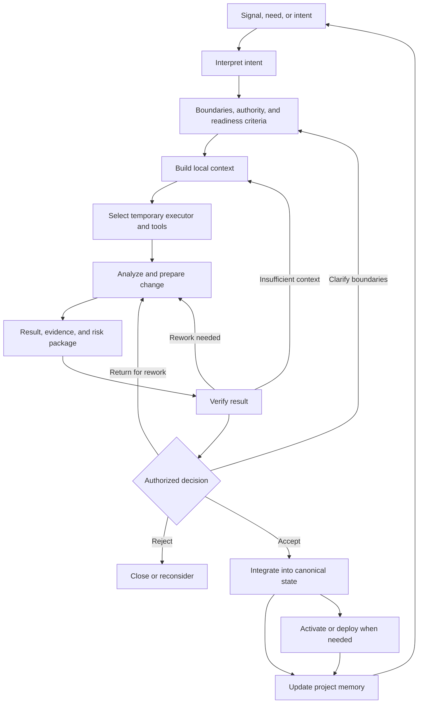
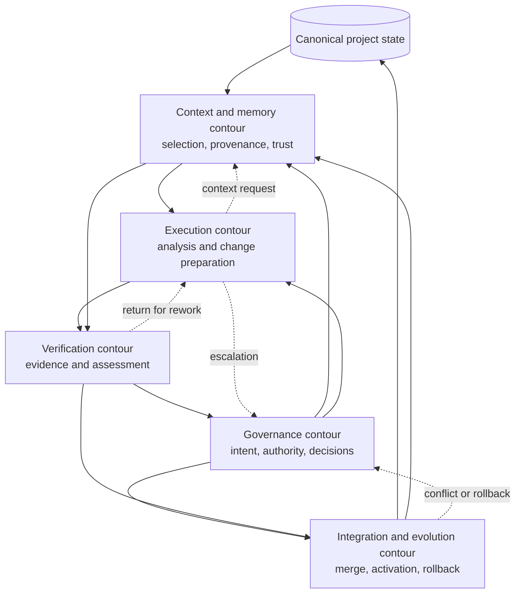
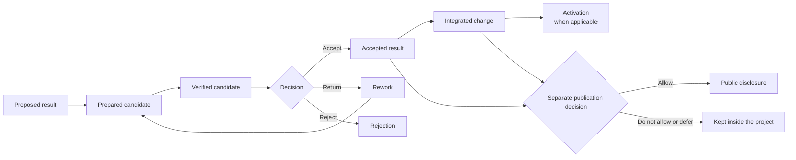

# 4. CHLOYA Operational Model

> **Version:** `0.3.1`  
> **Status:** under discussion

## 4.1. Purpose and level of description

CHLOYA’s core principles define the properties that human- and AI-assisted development must have, but do not by themselves show how these properties form one working system. The operational model fills that gap. It describes the general order in which a need, external signal, or human intent is transformed into a bounded, checked, and governably accepted change to project state.

The CHLOYA operational model is not the architecture of a particular software product. It does not require a particular agent platform, local command-line interface, MCP server, directory structure, or file format. These means can simplify use of the methodology, but are not its essence. One project may use Markdown, Git, and manual checks; another may use specialized agents, machine-readable policies, and automated orchestration. Both can conform to CHLOYA if they retain its core constraints, control points, and evidence requirements.

At this level, three related but distinct layers must be separated:

1. **Methodology** defines mandatory process properties: human governance, constrained authority, portable context, verifiable results, reversibility, and separation of readiness, activation, and publication.
2. **Normative specifications** define the meaning and minimum content of entities such as a task, context module, change package, evidence, decision, risk, and handoff.
3. **Reference implementations** provide particular formats, directories, commands, adapters, and software components.

This separation makes it possible to evolve tools without silently changing the methodology itself. Replacing YAML with JSON, one agent with another, or a local interface with a server system must not change the basic rules for governing work. At the same time, the methodology must not remain a declaration: its requirements must be expressible in observable states, artifacts, and checks.

The center of the operational model is not an individual agent, chat, or AI provider, but the project as a continuing system. The project retains its current state, accepted decisions, constraints, contracts, evidence, and accumulated knowledge regardless of the executor involved in the next task. An AI executor connects temporarily, receives necessary and permitted context, performs a bounded part of work, and returns a result to the shared contour. It can then be replaced by another model, person, or tool without loss of project memory or treating its internal memory as a source of truth.

This approach continues the logic of modularity: changeable decisions must be localized behind stable boundaries, and technical dependencies must be coordinated with actual flows of coordination [76]–[80]. Agentic development adds another boundary: between persistent project state and temporary executor state. Context available in one session does not automatically become project memory, and a free-form retelling by a previous agent does not replace a recorded decision with known provenance.

Human governance is not reduced to manual confirmation of every step. A person can decide directly or establish policies that allow automatic execution of low-risk, reversible operations. Research on human interaction with automation shows that automation levels should be chosen separately for information acquisition, analysis, decision selection, and action execution [99]. Thus one CHLOYA process can automatically collect diagnostic data, use AI for analysis, require a human decision, and then allow a deterministic system to execute the approved action.

Mixed-initiative systems follow a similar idea: a person and an automated system need not be fixed permanently as leader and passive tool; initiative may move according to goal, context, uncertainty, and expected consequences [100]. CHLOYA supplements this model with requirements for project memory, context provenance, authority, evidence, and governed state change.

Work can start from more than a direct human instruction. A signal may be a detected defect, failed test, monitoring alert, new vulnerability, dependency change, user request, changed external requirement, or another automated check. The signal alone does not authorize a project change. It must first be interpreted within the project’s goals, constraints, and authority; only then can it become a task, proposal, risk, or basis for further analysis.

The operational model is therefore not a sequence of commands for AI. It is a governed transition between project states that connects human intent, project memory, localized context, temporary executors, deterministic constraints, verifiable evidence, and controlled integration.

## 4.2. Core operational cycle

Work begins with a signal, need, or intent, not a fully prepared task. The same signal can require a code fix, documentation change, further research, risk acceptance, refusal to act, or observation. Interpretation is therefore the first stage, not execution.

A human or authorized governance contour determines what change is actually required, why it is needed, and what result is acceptable. This separates an observed problem from a presumed solution. A report that a system is slow, for example, must not automatically become an instruction to rewrite one module before the cause, impact scope, and acceptable trade-offs are confirmed.

After intent is established, work boundaries are set. They can include authorized project scope, prohibited actions, available data and tools, time and financial limits, confidentiality requirements, acceptable risk, mandatory checks, and escalation conditions. Boundaries protect both the project from excessive action and the executor from having to infer authority indirectly.

The task then receives local context. It must be sufficiently complete for correct work, but need not contain the entire project. A large context window does not guarantee that all supplied facts will be noticed or applied equally; excessive, contradictory, or obsolete material can degrade the result [48], [51], [53]. CHLOYA therefore selects context by purpose, freshness, provenance, and trust level.

The context can include the goal and acceptance criteria, current relevant project state, applicable contracts and policies, task-specific constraints, known risks, available evidence, and references to the canonical artifacts from which the information was derived. If the executor discovers that information is insufficient, it requests a specific extension and explains why rather than silently filling the gap with an assumption.

The project then selects a temporary executor and its tools. The selection concerns not only model capability, but also cost, availability, data policy, authorization profile, tool environment, and the ability to reproduce or inspect the outcome. The executor may analyze and prepare a change only within the granted scope.

Its output is not merely a patch. A result package contains the proposed or completed change, affected contracts, performed checks, evidence, assumptions, unresolved questions, residual risks, and conditions of use or rollback. The package enables another person or executor to understand what was done without reconstructing an entire session.

Verification compares the result with the goal, constraints, contracts, and evidence requirements. It can return the work for improvement, request more context, uncover a policy violation, or prepare it for a decision by an authorized contour. The decision may accept, reject, defer, or require changed boundaries.

An accepted result is integrated into canonical project state. For code, that can mean merging into the main branch or another established point of truth; for an architectural decision, recording the selected option and its consequences; for research, preserving results, conditions, and confidence. Integration does not always mean immediate activation: a change can be accepted but await deployment, migration, release, approval, or publication authority.

The cycle ends with project-memory update. It retains not every intermediate thought, but information that changes future understanding: a decision, new contract, discovered risk, constraint, confirmed fact, check method, or reason for rejecting an alternative. The next task starts from the updated state rather than an earlier version of knowledge.

Figure 4.1 — Core CHLOYA operational cycle.

The diagram shows a typical route, not a mandatory bureaucratic sequence. In a small reversible task, framing, context formation, and executor selection can take minutes within one short task description. In a critical change, the same functions can be divided among several people, systems, and independent checks. What must remain is the meaning of each stage, not an identical volume of documentation.

## 4.3. Interacting contours

A linear description is convenient for one task, but a project does not cease to exist between tasks. Access rules, project memory, test infrastructure, integration processes, and observation mechanisms continue to operate. CHLOYA therefore describes work as interaction among five functional contours:

### Governance contour

The governance contour maintains goals, authority, decision rules, and escalation paths. It decides whether a signal becomes work, what may be delegated, and which transitions require a human or designated owner.

### Context and project-memory contour

This contour selects, stores, updates, and marks the provenance and trust of project knowledge. It makes local work possible without turning every executor into a holder of the whole project.

### Execution contour

The execution contour performs analysis and prepares changes within assigned boundaries. It can use AI, deterministic automation, or people, but must return an inspectable result package rather than only an outcome claim.

### Verification contour

The verification contour evaluates evidence against the goal, contracts, risk, and acceptance criteria. It identifies missing proof, inconsistencies, and conditions that require rework, escalation, or refusal to proceed.

### Integration and evolution contour

This contour integrates accepted changes, controls activation or rollback where relevant, and updates the project’s canonical knowledge. Integration is an independent function: a locally correct change can still be incompatible with parallel work or other system parts [77]–[80].

Figure 4.2 — Interaction of CHLOYA operational-model contours.

The contours form a feedback system rather than a conveyor. Governance without verification can make decisions from unreliable claims; verification without context cannot know which properties matter; execution without boundaries can exceed its task; integration without memory update leaves later executors with an obsolete project picture.

## 4.4. Result states and decision points

A result may be proposed, prepared, verified, accepted, integrated, activated, rejected, or returned for improvement. These states are semantically different and should not collapse merely because the same person or tool performs several functions in a lightweight task.

An **activated change** has begun to affect the running system, users, data, or the external world. Documentation, research, or internal project decisions may have no separate activation; configuration, migration, release, and infrastructure often do.

Publication forms a separate axis. A result can be accepted and integrated internally while not authorized for public disclosure. Conversely, publication material can describe a concept without activating a software change. Publication permission is therefore not an automatic consequence of authorship, technical readiness, or integration.

Figure 4.3 — Result states and the separate publication-decision axis.

Decision points determine whether an initial signal becomes project work; whether a particular part of analysis, decision, or action may be delegated; whether evidence is sufficient; whether a result may be integrated or activated; and whether material may be disclosed. Delegation depends on context rather than only model capability [18], [20], [99].

## 4.5. Reverse transitions, stopping, and escalation

An operational model must describe not only forward progress but safe reverse and stop transitions. A result may return for rework when evidence is insufficient, a decision may be reconsidered when context changes, and integration may require rollback or restoration under a verified procedure.

Stopping is a normal result when authority is insufficient, context is contradictory, an external component is untrusted, a protected-data boundary is discovered, or consequences cannot be bounded. A pause preserves safe work and transfers the needed decision; it does not authorize a different executor to bypass the same constraint.

Escalation packages should state the original goal, work safely completed, condition discovered, action not performed, possible consequences, and the specific authority or decision required. They should not transfer an entire dialogue or copy secrets and other sensitive material without need.

Rollback is a separate action, not an automatic remedy. It must be planned, appropriate to the actual environment, and safe for data and evidence. A Git revert cannot undo external disclosure, payment, or other practical irreversibility.

## 4.6. Modes of application and scaling

The model supports different degrees of automation and formalization.

### Manual mode

A person performs interpretation, task framing, checks, and integration. AI may assist with analysis, drafting, or local implementation, but does not independently move results between material states.

### Semi-automatic mode

Automation collects information, runs checks, prepares context, or proposes changes. People retain decisions with material consequences, while deterministic controls enforce policy and record evidence.

### Orchestrated mode

Several executors may work in parallel under a governed orchestrator. The orchestrator prepares tasks, routes context, monitors dependencies, and prepares integration, but does not replace assigned responsibility or grant itself unlimited authority.

The degree of formalization is determined not only by team size. One developer working with critical personal data may need strict limits, while a large team can perform a reversible internal task with a lighter process. Selection considers possible harm, reversibility, data sensitivity, consequence scope, architectural coupling, task novelty, the number of parallel executors, cost of independent verification, and regulatory or contractual requirements.

NIST AI RMF treats risk management as a continuous activity; governing, mapping context, measuring, and managing risk are interacting lifecycle functions rather than a mandatory linear checklist [25], [39]. CHLOYA similarly does not prescribe the same process weight for every task: the depth of control is chosen in proportion to context, risk, and resources.

Automation level must not be one global switch. A project can automate information collection and verification heavily, use medium automation for analysis and change preparation, and keep legal, financial, or reputational decisions at low automation. The model of automation levels for information acquisition, analysis, decision, and action supports this differentiated allocation [99]. Mixed initiative also permits a system to detect a problem and propose work while preserving a human ability to redirect, reject, or constrain the action [100].

## 4.7. Invariants and links to later chapters

The operational model permits different tools, formats, and degrees of formalization, but the following properties remain independent of a particular implementation:

1. **The project is the persistent holder of state.** Canonical knowledge, decisions, and constraints do not exist only in model memory, one chat, or one participant’s local understanding.
2. **Intent is separate from a presumed solution.** Work starts by understanding what must change and why; an implementation approach can be reconsidered when it does not match the goal, constraints, or actual cause.
3. **Authority is explicit or derived from established policy.** Technical ability to read data, modify a file, call a tool, or publish a result is not permission to do so.
4. **Context is locally sufficient and has known provenance.** An executor receives task-relevant information with its status, freshness, and trust level; untrusted data do not become instructions merely because they entered context.
5. **The executor remains replaceable.** Changing model, platform, person, or session must not destroy the project or require recovery of material decisions from memory.
6. **Proposal, decision, and action are separate.** An executor can analyze and propose without being entitled to authorize or perform an action. Their semantic difference remains even when one person combines functions in a simple task.
7. **A result is transferred with sufficient evidence.** A completion claim does not replace checking; evidence is proportional to risk, and limitations and residual uncertainty are explicit.
8. **Readiness is not integration, activation, or publication.** A verified result may await decision; an accepted change may await activation; internal material requires separate public-disclosure authority.
9. **Return, stopping, and escalation are normal transitions.** With insufficient information, exceeded authority, or unacceptable risk, an executor narrows scope, requests a decision, or stops safely.
10. **An accepted change updates project memory.** Decisions and knowledge that affect later tasks are recorded after work; otherwise new executors receive an obsolete state picture.

These invariants provide a common frame for later chapters. The deterministic core and policies specify decisions that cannot be left to a probabilistic model. Chapters on roles and governance define responsibility and authority levels. Context, context-module, and project-memory chapters explain selection, provenance, and retention of knowledge. The task lifecycle details transitions inside individual work; contracts, concurrency, and Git explain coordination of changes; confidentiality, dependencies, security, and intellectual-property chapters define special constraints; and readiness, application, and pilot chapters turn the model into practical profiles.

The operational model does not replace CHLOYA’s detailed rules or prescribe one technical architecture. Its purpose is to show how individual principles form one coherent system:

> a signal or human intent is interpreted within project goals; work receives explicit boundaries and sufficient context; a temporary executor prepares a change and evidence; the result passes verification and an authorized decision; the accepted change enters canonical state, and acquired knowledge returns to the project.

Preserving this cycle and its invariants makes it possible to increase AI autonomy without giving it unlimited ownership of the project.
