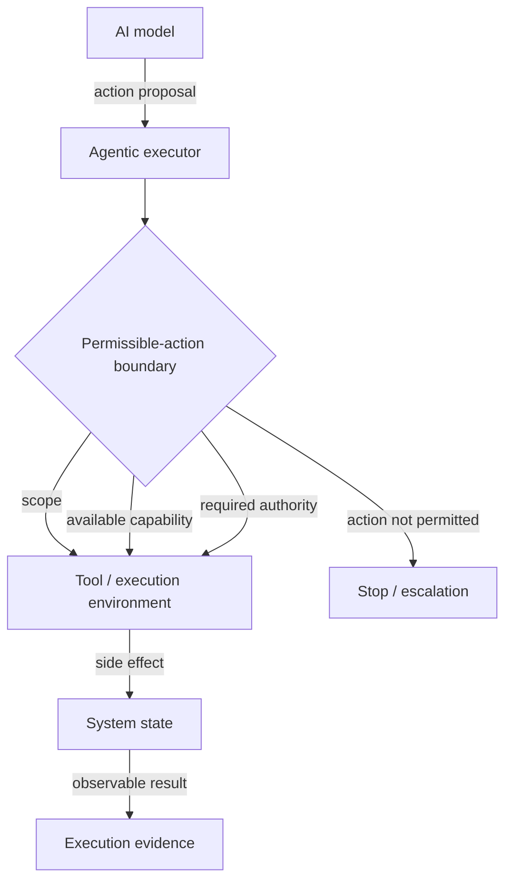
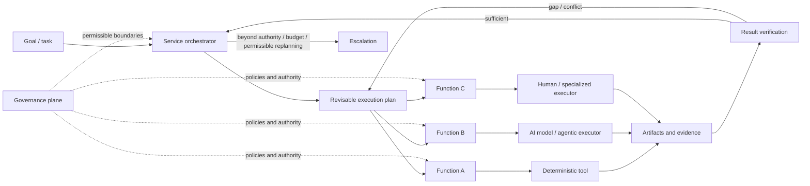
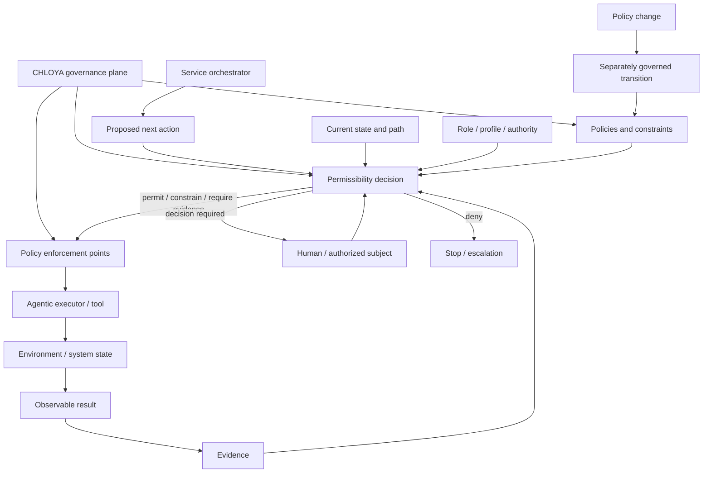
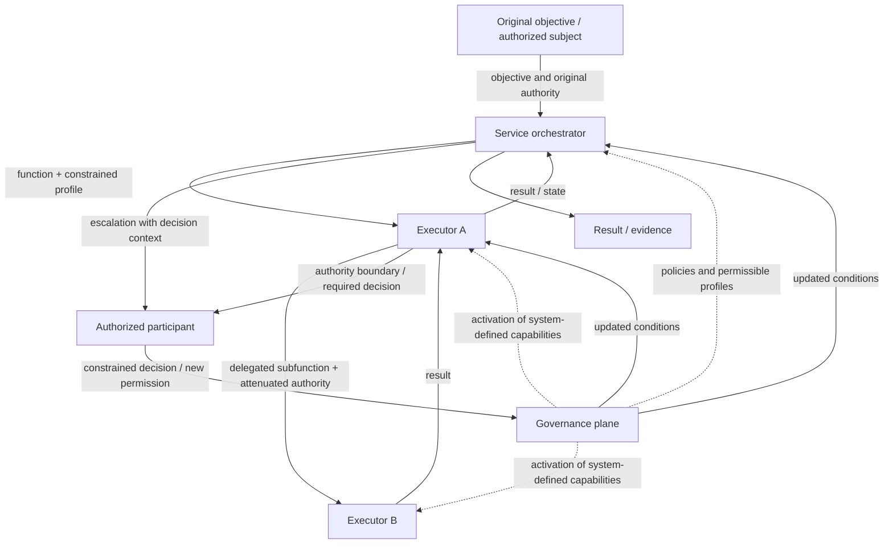
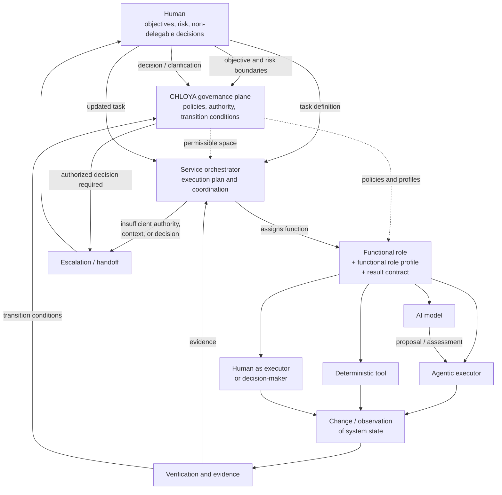

# Roles and Governance Boundaries

> **Version:** `0.3.1`  
> **Status:** under discussion

## Contents

- [7.1. Role Model and Separation of Authority](#71-role-model-and-separation-of-authority)
- [7.2. The Human](#72-the-human)
- [7.3. The AI Model](#73-the-ai-model)
- [7.4. The Agentic Executor](#74-the-agentic-executor)
- [7.5. Functional Roles and Functional Role Profiles](#75-functional-roles-and-functional-role-profiles)
- [7.6. The Service Orchestrator](#76-the-service-orchestrator)
- [7.7. The CHLOYA Governance Plane](#77-the-chloya-governance-plane)
- [7.8. Delegation, Handoff, and Escalation](#78-delegation-handoff-and-escalation)
- [7.9. Combining and Separating Roles](#79-combining-and-separating-roles)

## 7.1. Role Model and Separation of Authority

Agentic development requires distinguishing not only the participants in a process but also the governance functions they perform. In a traditional tool-based model, the boundary between a recommendation and an effect on the system is usually clear: software provides a capability, while a human decides whether to use it. An [agentic executor][g-agent-executor] can independently read a project, interpret a task, select tools, modify files, run commands, and delegate part of the work to other executors. Consequently, a single technical system may combine the functions of analysis, decision-making, action authorization, and direct execution.

CHLOYA treats such combination as a separate source of risk. The ability to obtain information or formulate a decision must not automatically confer the right to make that decision, while the technical ability to perform an action must not constitute authorization to perform it. This approach continues the classic principles of least privilege and [separation of privilege][g-separation-of-privilege] formulated by Saltzer and Schroeder: a subject should receive only the rights required for a specific operation, and a critical action should not depend on a single uncontrolled condition [202].

To describe governance, CHLOYA distinguishes a role, a [capability][g-capability], and [authority][g-authority]. A **role** defines the function a participant performs in a particular process. A **[capability][g-capability]** characterizes what a participant can technically do using the available model, tools, and environment. **[Authority][g-authority]** defines the boundary of decisions and actions the participant is permitted to make or perform in the given situation.

These characteristics must not be treated as interchangeable. An agent may technically have write access to the entire repository but be authorized to modify only one module. An orchestrator may be able to invoke a deployment facility without having the right to authorize a change to the production environment. Conversely, a human may have the authority to make an architectural decision or accept residual risk without personally performing the corresponding technical action.

This boundary is especially important in modern agentic systems because a model is usually embedded in an execution environment that provides memory, tools, external data sources, and the ability to change system state. Practical guidance on building agentic systems therefore also associates safety not with an agent's general “intelligence,” but with constraints on its available tools, scope, and rights [194]. For CHLOYA, this means that technical capabilities are only one mechanism for implementing authority and do not define it by themselves.

Write access to a directory, for example, does not answer whether changing a module's public interface is permissible. Access to a database management system does not imply authority to change its schema. The ability to create or connect a new tool does not grant an agent the right to expand its own scope. Operating-system permissions, application programming interface permissions, and execution-environment controls are therefore a necessary but insufficient layer of governance.

The path from human intent to a change in the project's current state also consists of several logically distinct functions. Intent is formed and the situation is investigated; a solution is proposed; a selected option is decided upon; the corresponding action is [authorized][g-action-authorization]; the change is performed; its result is verified; and only then may the result be accepted into the system's current state.

This separation does not mean that every step requires a separate human, agent, or software service. In a small reversible task, one participant may perform several functions. Their logical distinction must nevertheless remain intact. Otherwise, it becomes impossible to determine whether an option generated by a model is merely a proposal, an accepted decision, or actual authorization to change the system.

This distinction is particularly important in delegation. Research on intelligent delegation emphasizes that transferring work includes not only a task description but also the boundaries of role, authority, and responsibility [20]. CHLOYA develops this idea for chains of agentic execution: assigning a task to another participant must not automatically transfer the delegating party's full authority.

If an orchestrator asks an agent to investigate a possible database migration, that assignment does not authorize the migration itself. If an executor engages a subagent to analyze part of a task, the subagent must not automatically inherit every capability and authority of the original executor. Likewise, transferring a document, message, or other fragment of context provides information for processing but does not by itself change the boundaries of permissible action.

> **Authority must not automatically propagate with a task, context, or call chain.**

This requirement is especially important for probabilistic executors. Context may contain errors, outdated decisions, untrusted instructions, or results produced by other agents. If the presence of an instruction in context can itself expand the set of permitted actions, the boundary between data and governance effectively disappears. Authority must therefore be changed through a separate controlled mechanism rather than inferred from text by the model itself.

The same reasoning requires distinguishing the space of permissible reasoning from the space of permissible execution. An executor may discover an alternative outside the initially anticipated solution, investigate it, and explain its advantages. Such freedom is useful because fixing the implementation approach too early can reduce solution quality. The ability to consider an alternative, however, does not confer the right to implement it immediately.

If the discovered option requires changing an active contract, an architectural decision, the task scope, or the accepted level of risk, the executor must raise that change to the level holding the relevant authority. CHLOYA thereby preserves room for engineering exploration without turning freedom of reasoning into unlimited freedom of action.

The separation of functions must be proportional to risk. For a local, reversible, and readily verifiable change, proposal, authorization, execution, and verification may be combined in a relatively lightweight process. As irreversibility, uncertainty, data sensitivity, and potential consequences increase, there is more reason to separate formulation of a decision from its authorization and execution from independent verification. This risk-dependent approach is consistent with a graduated model of human control in which oversight intensity is determined by the characteristics of a specific action rather than applied uniformly to every operation [19].

CHLOYA does not seek to turn agentic development into a system of numerous formal roles and approvals. Authority is separated not to maximize the number of participants, but to prevent the implicit accumulation of decision-making and system-changing capabilities inside a single probabilistic component. A practical agentic architecture may physically combine several functions as long as it preserves verifiable boundaries between what a component can do, what it is permitted to do, and which actions require a decision by another subject [194].

Delegating execution also does not eliminate human and organizational responsibility. An AI model may propose a solution, an agent may implement it, an orchestrator may distribute the work, and a governance plane may apply established policies. The automation chain itself, however, does not create a new subject to which responsibility for project goals and the acceptability of assumed risk can be transferred unconditionally [18; 20].

Thus, CHLOYA's role model is organized not around a set of “virtual employees,” but around the separation of governance functions. Capability is not authority; a proposal is not a decision; a decision is not authorization to act; execution is not evidence of correctness; and a successfully completed operation does not yet mean that its result has been accepted into the project's current state.

> **In CHLOYA, the right to act is determined not by what an executor is technically able to do, but by what it is permitted to do within a specific role, scope, decision, and level of risk.**

The following sections specify this model for the human, the AI model, the agentic executor, functional profiles, the service orchestrator, and the governance plane, and then examine transfers of authority and permissible combinations of roles.

## 7.2. The Human

In CHLOYA, the human is not treated as a formal participant in a chain of approvals or as the mandatory manual executor of every consequential step. The human role is defined by the fact that a human subject establishes project goals and boundaries, accepts material residual risk, holds non-delegable authority, and intervenes in the automated process where a decision must not be made solely from a model's probabilistic inference. This approach is consistent with research on human oversight of agentic systems, which links effective control not to the mere presence of a person but to that person's actual ability to understand the situation, intervene in the process, and bear responsibility for the decision [18; 19].

The presence of a human in the loop is therefore not by itself sufficient evidence that a system is governable. A formal approval may be practically indistinguishable from an automated one when the person lacks the context, time, or competence required for a substantive assessment. Dhanorkar, Passi, and Vorvoreanu show that human oversight of agentic systems is constrained in practice not only by interface quality but also by the allocation of responsibility, the volume of information, and the operator's actual ability to control events [18]. In CHLOYA, an approval procedure is meaningful only when the person can understand the subject of the decision, its material consequences, and the residual risk.

[Meaningful human control][g-meaningful-human-control] does not require the human to repeat the agent's work. Its purpose is to enable an informed decision at the appropriate level of abstraction. For a local and reversible change, a brief explanation, the final diff, and the results of automated checks may be sufficient. A change to an architectural contract, production infrastructure, critical data, or access rights may require substantially deeper examination. This risk-dependent approach corresponds to the graduated control model proposed in GAIE, in which the intensity of human involvement depends on an action's consequences, reversibility, data sensitivity, and proximity to critical business processes [19].

The human has a special role because not every decision should be delegated to an automated process. [Non-delegable decisions][g-non-delegable-decision] include, above all, decisions that change project goals, accepted constraints, the acceptable level of risk, or the boundaries of the autonomy already granted. CHLOYA does not establish a universal immutable list of such decisions: the list depends on the environment, process maturity, and applicable policies. Research by Tomašev and colleagues shows that delegation in agentic systems should be understood not as the simple transfer of a task, but as a transfer of constrained authority that preserves clarity about responsibility, role boundaries, and conditions for returning control [20].

Some authority may nevertheless be formalized in advance. If an organization has defined permissible conditions, risk boundaries, and verifiable completion criteria, individual actions may be performed without manual approval of every instance. In this case, a human delegates a constrained right to act within a predefined scope but does not grant an executor the right to expand that scope independently. Exceeding the established conditions must trigger a new decision or escalation [19; 20].

The human remains the bearer of the broader goal context. An agent may optimize a locally formulated task correctly while degrading the system as a whole. Reducing latency may increase operating cost; simplifying an implementation may reduce observability; and a locally successful change may violate a previously accepted architectural decision. An important human function is therefore not only choosing among proposed options, but also reconsidering the task itself when the local objective proves inconsistent with the project's broader interests.

A human decision must not be treated as an unconditional source of truth either. It may be mistaken, conflict with active policies, or exceed a particular participant's organizational authority. CHLOYA therefore treats a human as one governance subject rather than as a universal mechanism for bypassing constraints. The authority of human participants, like that of automated executors, must be associated with a specific role, area of responsibility, and class of decision.

Human corrections are an important source of system development. Correcting an agent's result carries more information than the final patch alone: it may reveal a false assumption, implicit constraint, architectural norm, or risk that was absent from the original context. If that information remains confined to one session, later executors encounter the same uncertainty again. Significant and recurring corrections should therefore be materialized, where possible, in a durable form: a rule, test, architectural decision, policy, example, or another element of project memory. This turns human intervention from a one-time correction into a mechanism for accumulating organizational knowledge.

The human also performs an escalation function, but escalation must not be based only on the model's subjective confidence. A probabilistic executor can be confident and still be wrong. More reliable grounds are observable conditions: exceeding granted authority, a conflict among active rules, missing necessary data, irreversibility of an action, a failed check, disagreement among independent assessments, a change to an established contract, or exceeding acceptable risk or budget. The literature on agentic systems likewise treats escalation as a mechanism designed in advance rather than as an arbitrary request to a human after a problem has occurred [20].

An escalation must provide the human with more than the fact that a difficulty arose. It must include the context needed for a decision: what the executor attempted, why the action stopped, which checks have already been performed, which alternatives were considered, and precisely which decision is missing. Albada specifically emphasizes designing escalation mechanisms so that a human retains the ability to understand the situation and intervene in the agent's work rather than merely receive formal notifications [194].

Conversely, an excessive number of requests to a human can degrade governance quality. Frequent low-value approvals create notification fatigue and increase the likelihood of automatically accepting the system's recommendations. Albada connects this to the broader problem of automation trust: people gradually stop examining system decisions substantively when most requests are routine or low risk [194]. CHLOYA therefore seeks not the maximum number of human gates, but the points at which human participation materially affects decision quality and risk.

As agentic development scales, human-control throughput becomes a quantitative constraint. An orchestrator's ability to start many executors in parallel does not mean that a person can review their results substantively at the same rate. If the volume of generated changes exceeds the participants' capacity for meaningful verification, formally retaining manual approval begins to create a false sense of safety. This problem is consistent with observed practical constraints on human oversight of agentic systems [18].

The speed and form of automated work must therefore reflect the human's actual ability to verify it at the relevant level of risk. Increasing the number of agents must not mechanically increase the number of objects requiring equally deep manual examination. Some control may be shifted to automated evidence, independent checks, aggregated reports, and risk-dependent gates so that scarce human attention remains available for genuinely consequential decisions [18; 19].

CHLOYA does not assume that humans outperform AI in every local operation. Automated executors can analyze large volumes of code faster, apply formal rules more consistently, and perform some types of verification more efficiently. The human's special role does not arise from universal technical superiority, but from the fact that human and organizational subjects remain the bearers of goals, acceptable risk, responsibility, and context that cannot be reduced completely to instructions for a model [18; 20].

The form of human involvement must therefore be proportional to an action's consequences. For low-risk, reversible, and readily verifiable changes, participation may be limited to establishing boundaries and subsequent observation. As irreversibility, uncertainty, and the scale of potential consequences increase, the need for a prior decision, substantive review, or explicit authorization also grows [19].

In CHLOYA, “the human” must not be understood as one universal user. Different authority may belong to a developer, product owner, architect, security specialist, database administrator, or operations owner. Human involvement is determined not by title alone, but by the context, responsibility, and authority required for the particular class of decisions.

Thus, the human in CHLOYA is not a permanent manual intermediary between an agent and the system. The human's task is to preserve goals and acceptable boundaries, make decisions that must not be inferred automatically from an executor's capabilities, provide substantive correction, and participate where consequences exceed the established level of autonomy. The effectiveness of this participation is determined not by the number of manual approvals, but by the quality of information, the participant's authority, and the participant's actual ability to assess the consequences of a decision.

> **Human control in CHLOYA is defined not by the number of approvals, but by the human's ability to understand a decision substantively, assess its consequences, and possess the authority to accept the corresponding risk.**

## 7.3. The AI Model

In CHLOYA, an [AI model][g-ai-model] is a probabilistic computational component that uses the provided context to generate or evaluate a possible result: text, code, a plan, a classification, an explanation, or a structured proposal for a subsequent action. This is a fundamentally narrower concept than an agent. The ability to read files, access external data, use long-term memory, execute commands, or change system state arises only when the model is embedded in a broader execution environment.

This distinction is not merely terminological. Modern agentic systems usually combine a language model with memory, planning mechanisms, external data sources, tools, and governance logic. Chowa and colleagues describe agentic architectures precisely as compositions of such mechanisms that allow a language model to progress from generating a response to interacting sequentially with an environment [344]. The properties of an entire agentic system therefore cannot automatically be attributed to the model used within it.

The distinction is especially visible in tool use. A model may produce a structured request to invoke a function, application programming interface, terminal command, or another facility, but the actual change to external state is performed by the execution environment. That environment supplies descriptions of available tools, accepts the generated invocation, checks or transforms its parameters, performs the operation, and returns its result into subsequent context [339; 345]. Even a correctly formed tool invocation must therefore be treated first as **[model output][g-model-output] and an [action proposal][g-action-proposal]**, not as the completed action itself.

This difference becomes critical for operations with side effects. Doshi and colleagues show that extending a language model with tools creates new classes of systemic risk: individual calls may be permissible while their sequence or combination can leak data, damage state, or cause another undesirable effect [343]. Tool-use safety cannot therefore be reduced to a model's ability to recognize dangerous commands. It must also be enforced by external constraints on available capabilities, data flows, and permissible sequences of action [343].

CHLOYA consequently separates the probabilistic selection of an action from its authorization. A model may determine that changing a file, calling an application programming interface, or migrating a database appears to be the rational next step, but the right to perform that step is determined by the executor's authority, active policies, task scope, and level of risk. Model-level restrictions can reduce the probability of undesirable behavior, but they must not be the sole security boundary; research on safe tool use likewise demonstrates the need for externally verifiable constraints rather than reliance only on a large language model's internal safeguards [343].

The same distinction applies between model output and evidence of its correctness. A language model can produce a persuasive explanation, coherent prose, or a confident assessment and still be wrong. CHLOYA therefore does not treat a model's self-description, expressed confidence, or the plausibility of a result as sufficient evidence of readiness. A generated result is a candidate solution, while required properties must be established by observable evidence: tests, static analysis, contract verification, execution results, independent assessment, or other procedures appropriate to the task.

This approach does not imply that model reasoning lacks value. On the contrary, the ability to work with incomplete requirements, natural language, and a large space of alternatives is one of the primary advantages of modern models. CHLOYA nevertheless separates constructing an argument from confirming a verifiable property. A model may explain why it considers an implementation correct, but that explanation does not replace verification where technical verification is possible.

The relationship between a model and its supplied context also requires special attention. Providing a document, architectural decision, or large body of project memory does not guarantee that all available information will be considered equally and completely when a result is generated. Research on model behavior in long contexts shows substantial sensitivity to the position of relevant information and to context structure [48]. The statement “the information was provided to the model” must therefore not be treated as equivalent to “the information was used correctly.”

The opposite situation creates risk as well. Information reproduced from a model's parametric knowledge does not necessarily match the current project state. It may refer to another version of a technology, a general case, or a superseded architectural decision. Project memory and active decisions must therefore be maintained in externally governed sources, while the model is used to interpret and apply them rather than serving as a hidden canonical repository of project state.

Separating the model, context, and execution environment makes it possible to localize causes of failure more precisely. An unsuccessful agentic task may result from inadequate reasoning, incorrectly selected context, an outdated source, an erroneous tool choice, invalid invocation parameters, an external-system failure, or insufficient subsequent verification. Evaluating only the final result conflates these causes and makes the architecture harder to improve. Failure analysis should therefore identify the layer at which the deviation originated.

An AI model must not become a permanently fixed element of the methodology. Modern agentic architectures can use different models depending on the required function, cost, latency, available context, confidentiality requirements, and solution quality [344]. One model may generate code, another may classify or verify, and some tasks may be performed locally without transmitting sensitive context to an external provider.

Architectural replaceability, however, does not imply functional equivalence. Different models, and even different versions of the same model, may vary in their ability to process long context, follow constraints, select tools, perform programming tasks, and maintain structured formats. Replacing a model must therefore be treated as a change in the system's potential capabilities and accompanied by renewed verification of the properties affected by that model. Preserving a compatible interface alone does not demonstrate preservation of behavior.

This distinction separates a functional role from its particular implementation. “Developer,” “reviewer,” or “requirements analyst” in an agentic system must not be defined by the name of a particular model. A role is established by the function performed, available context, tools, and authority, while a model is one resource used to implement that function. This makes it possible to replace a model without rebuilding the entire governance model while still making the need for renewed verification after replacement explicit.

CHLOYA therefore does not seek to eliminate the probabilistic nature of an AI model. That nature is precisely what allows work with ambiguity, informal requirements, and tasks for which every permissible solution path cannot be enumerated in advance. The methodological task is different: preserve freedom to search and construct alternatives without automatically converting it into freedom to affect the system.

Thus, an AI model in CHLOYA is a mechanism for constructing and evaluating alternatives, not an independent source of authority, project truth, or evidence of correctness. Its output becomes an engineering action only through an external execution layer, while the permissibility and result of that action must be governed at the appropriate layers of the system.

> **In CHLOYA, the model proposes and evaluates alternatives; authority, actual execution, and evidence of the result belong to other layers of the system.**

## 7.4. The Agentic Executor

An [agentic executor][g-agent-executor] is the system layer at which the probabilistic output of an AI model gains the ability to affect an external environment. If the model produces a possible solution or an action proposal, the executor connects that output to tools, session state, working context, and available channels of effect. At this layer, a recommendation may become a file modification, command execution, database query, external application programming interface call, commit creation, or infrastructure change.

CHLOYA therefore treats the model and the agentic executor as fundamentally different entities. An executor may use one or more AI models, but its properties are determined by more than the quality of their reasoning. The tools provided, execution-environment rights, scope, available state, and mechanisms for constraining side effects all matter. Practical agentic architectures likewise separate model output from the [execution plane][g-execution-contour] through which tools are actually used [339; 345].

This separation creates an important trust boundary. While an erroneous output remains text or a structured proposal, its consequences are limited to the information layer. Once executed, the error may alter the system's current state. A model's ability to formulate an action must therefore not automatically imply the ability to realize the corresponding effect.

CHLOYA assumes that an executor acts only through explicitly provided channels of effect. The classic principle of least privilege requires giving a subject only the rights necessary for its function [202]. In an agentic environment, this principle must apply not only to accounts and system permissions, but also to tools, external services, and classes of permissible operations.

Approaches based on tracked capabilities extend this idea to agentic architectures. Odersky and colleagues propose explicitly associating an agent's potential effects with granted [capabilities][g-capability] for access to the file system, network, processes, and other resources rather than relying on the model itself to obey natural-language constraints [345]. For CHLOYA, action boundaries should therefore be enforced by the execution environment wherever possible rather than existing only in model context.

The presence of a tool is not equivalent to authorization to use every operation it offers. A single interface may combine actions with fundamentally different consequences. The ability to run `git diff` does not imply authority to run `git push`, and access to a database client does not make reading data equivalent to deleting an object. Empirical research on the Model Context Protocol ecosystem also shows that agentic tools may receive broad system and network capabilities, while insufficient privilege separation creates additional paths for affecting data and the environment [346].

CHLOYA therefore distinguishes tool availability from authorization of a specific action. Governance must check not only whether a tool is present, but whether the operation is permissible for the current role, task, scope, and level of risk. The more consequential the potential effect, the less justification there is for treating “the entire tool is available” as sufficient authorization.

Along with available operations, an executor receives a constrained [scope][g-scope]. The scope defines which objects and conditions the granted capabilities may be applied to. One agent may be limited to a portion of a repository, another to a test database or a particular set of application programming interfaces. The same technical capability may therefore be permitted in one context and prohibited in another.

Execution isolation is one mechanism for enforcing such boundaries, but it must not be treated as sufficient by itself. A container, virtual machine, or other sandbox can restrict available resources and system effects, but does not necessarily prevent undesirable use of capabilities that remain permitted. If an executor has legitimate access to sensitive information and a permitted channel for transmitting it, each action may individually satisfy the technical policy while their composition creates an undesirable outcome [345].

The same problem arises when several tools are used sequentially. Doshi and colleagues show that individually permitted calls may form a dangerous chain, so safety analysis must consider not only isolated operations but also their composition [343]. For CHLOYA, the space of permissible effects cannot always be defined by a simple list of permitted tools.

The external execution wrapper must consequently constrain not only individual channels of effect but also combinations of actions capable of taking the process beyond the established task or policy. This is especially important for systems in which an agent independently plans a multi-step sequence and chooses tools at every stage.

Execution must leave an observable result. An agent's assertion that an operation was performed is not sufficient evidence that it actually completed. A file change yields a diff; a test run yields an exit code and report; an application programming interface call yields an external-system response; and a database change yields observable state of the relevant objects. Wherever possible, the executor must return such evidence to the governance process so that subsequent verification rests on the actual effect rather than only on the model's interpretation of it.

The fact that an operation completed is still not proof that it was correct. A command can complete successfully while creating an incorrect state, a test suite can be incomplete, and an external system can accept semantically invalid data. The executor is therefore responsible primarily for performing an action in a controlled manner and recording its observable result; the final assessment of whether the evidence is sufficient belongs to the broader verification process.

Not every action is atomic. An agent may perform several operations and stop after some changes have already taken effect. This is particularly important for migrations, infrastructure changes, external application programming interfaces, and other processes in which simply stopping execution does not restore the initial state. The execution plane must therefore account for partial effects and, where justified, use transactions, idempotent operations, checkpoints, snapshots, or defined rollback procedures.

Taking no action may itself be a correct executor outcome. If execution requires authority that is absent, necessary context is insufficient, policies conflict, or no permissible continuation has been found, stopping is preferable to attempting to complete the task at any cost. The constraint must apply to the effect itself rather than only to one particular tool. A prohibition on deleting an object must not be bypassed by creating a script that achieves the same result another way.

For the same reason, the ability to create new tools, install dependencies, connect additional services, or spawn subagents must not automatically expand the executor's original authority. A new channel of effect may increase the system's technical capabilities, but the right to use it for additional effects must be determined separately. Self-modification of the execution environment is not self-authorization.

This is especially important for evolving agentic systems capable of extending their own means of solving a task. The more an executor can alter its own environment, the more important it becomes to preserve an external boundary that it cannot expand through its own reasoning alone. Otherwise, the policy of constraints becomes part of the same probabilistic process it is intended to constrain.

Thus, an agentic executor in CHLOYA is not merely an AI model with tools attached, but a distinct plane that converts model output into a controlled effect on the system. Its capabilities must be explicitly constrained, its scope defined, consequential operations authorized at the appropriate level, and actual effects observable and available for subsequent verification.

> **An agentic executor converts probabilistic output into a change of system state; freedom of reasoning must therefore be separated from an externally constrained space of permissible effects.**

### Execution Plane Diagram

**Figure 7.4.1 — Transition from an action proposal to a controlled effect.** The AI model formulates a proposal, but system state is affected only through the execution plane and its established boundaries. The observable result is returned as evidence for subsequent verification.

## 7.5. Functional Roles and Functional Role Profiles

Dividing work among several participants makes it possible to specialize task execution, reduce the amount of context used at one time, and avoid concentrating every capability within one execution plane. Modern multi-agent architectures widely use executor specialization and distribute functions among participants [244; 345]. Assigning an agent a role name, however, does not establish what it can actually do, which decisions it is authorized to make, or the criteria by which its result should be considered acceptable.

Labels such as “architect,” “developer,” “tester,” or “security expert” are convenient for humans describing a process, but they are insufficient as elements of a governance model. The same title can imply substantially different functions and authority in different organizations. The problem is amplified in an agentic system because a role name is created by a textual instruction and may attribute properties to an executor that are not technically enforced. The name `reviewer` does not make a review independent, and the name `architect` does not confer authority to change approved architectural decisions.

CHLOYA therefore describes participants primarily through **[functional roles][g-functional-role]**. Such a role is defined not by what the executor is called, but by the observable function it performs in a particular process. Instead of an abstract “testing agent,” the function may be to construct negative tests and verify a specified property; instead of an “architect,” to analyze the consequences of changing component boundaries and prepare decision alternatives; instead of a “security specialist,” to search for a defined class of violations within an established analysis scope and with expected evidence.

This description separates a role from the particular way it is implemented. A function may be performed by a human, an agentic executor, a specialized service, a deterministic analyzer, or a combination of mechanisms. An agentic implementation must not be used merely because the function belongs to an agentic process. If the required transformation can be expressed reliably through a parser, validator, compiler, static analyzer, or another deterministic tool, that mechanism will usually create less uncertainty and a simpler verification surface.

Practical uses of the Model Context Protocol illustrate the distinction between a function and its implementation mechanism. When working with large local document corpora, an agent need not receive the entire body of information directly in context: a specialized layer can index the data and supply only relevant fragments [347]. In another practical case involving migration of a large documentation corpus, agentic processing was combined with deterministic checks and subsequent evaluation of the material's final representation [348]. The material point is not the Model Context Protocol itself, but the ability to distribute the model's semantic work, data access, tool-based transformations, and result verification among different mechanisms.

A [functional role][g-functional-role] is implemented through a **[functional role profile][g-functional-role-profile]**. If the role answers why a participant is included in a process, the profile determines which context, tools, and scope are necessary to perform that function. A convenient human-readable title therefore ceases to be a source of authority: the executor's actual behavior is determined by the explicitly provided configuration.

The profile must be minimally sufficient. The classic principle of least privilege requires granting a subject only the rights necessary to perform its function [202]. In agentic development, this requirement extends beyond system permissions to available tools, information sources, and scope of effect. If a function consists of creating tests for a particular module, the ability to modify production code, publish artifacts, or access administrative secrets does not improve performance of that function but does increase the consequences of a potential error.

Capability-based approaches to securing agentic systems develop the same idea at the execution-architecture level: access to potential effects must be granted explicitly rather than depend only on a model's ability to follow a natural-language instruction [345]. A functional role profile in CHLOYA must therefore describe a concrete space of available effects rather than an abstract “strength of the agent.”

Available context is part of this space. Constraining actions while permitting unrestricted access to all project information leaves a substantial part of the risk surface unmanaged. A particular function may require one contract, several implementation files, and a defined set of active rules, while the complete project history, contents of other modules, or sensitive data provide no additional value.

Practice in organizing local access to documentation shows that a large corpus can be exposed to a model through governed retrieval of individual fragments while preserving information structure and provenance [347]. For CHLOYA, the general principle is what matters: a profile must define not only whether a source is accessible but also the permissible scope of context retrieval from that source.

Access to context and authority to act remain separate dimensions. Giving an executor a document describing an administrative operation does not confer the right to perform that operation. Conversely, technical ability to perform an action does not mean that the executor has all information necessary to select it correctly. A profile combines these characteristics for a particular function without conflating them.

The same functional role may be implemented by different profiles depending on the environment and risk. Verification of a database migration in a local environment may allow an executor to create a test instance, run the migration, and verify rollback. The same function in a staging environment may be limited to running an approved pipeline, while in production it may be limited to analyzing the plan and results without authority to change data directly. The purpose of the role remains constant while the space of permissible action differs.

This separation is also consistent with classic models of interaction between humans and automation, in which the degree of automation may differ across information acquisition, analysis, decision selection, and execution rather than being set as one general level of autonomy [169]. CHLOYA consequently does not infer that a high level of automation for one function requires the same level of autonomy at other stages of the process.

One executor may, in turn, perform several functional roles sequentially. Changing a textual instruction alone, however, must not alter its capabilities. If a new function requires an additional data source, tool, write scope, or greater authority, the corresponding profile must be granted separately. Otherwise, changing a role through a prompt becomes an implicit privilege-elevation mechanism.

A functional role must not be bound rigidly to a particular AI model either. Different models may serve different functions depending on task complexity, cost, latency, confidentiality requirements, and available infrastructure [244; 345]. One operation may need only a small local model, another a stronger external model, while a third may be performed without a large language model at all. The role remains part of the process architecture, whereas the model is a replaceable implementation resource.

The execution mechanism should be selected according to sufficiency. Not every function requires a maximally autonomous agent. If a task can be performed by a deterministic transformation, there is no need to add a probabilistic planning loop; if only semantic classification is required, the model need not be able to change the environment; if work requires sequential interaction with tools, using an agentic executor becomes justified. This approach reduces system complexity and limits the places in which model uncertainty can become a side effect.

A profile is defined not only by inputs and available actions, but also by the **expected result**. An instruction to “perform a review” is insufficient if the property to be confirmed and the evidence considered sufficient are unknown. A functional role must therefore have a [result contract][g-result-contract] connecting its purpose to acceptance criteria and required evidence.

The practical documentation-migration case demonstrates why this distinction matters. Valid source Markdown, an absence of transformation errors, and a successful build did not guarantee correctness of the final visual presentation: some defects became visible only after rendering the page [348]. The completion criterion must therefore correspond to the actual result property rather than merely to successful completion of an intermediate stage convenient for automation.

This problem is especially important for verification roles. Creating an additional agent and naming it `reviewer` does not automatically provide independent verification. If the creating and reviewing executors use the same assumptions, the same requirements source, and similar evaluation methods, their errors may be correlated. Separation of roles is useful only when the verification function actually adds a new way to detect a defect: an independent criterion, deterministic check, different evidence source, different environment, or different assessment approach.

The profile of a verification role must therefore describe not only permission to read the produced result, but also the object of verification itself. For documentation, syntactic correctness, successful building, and correct final rendering are different functions because they detect different classes of deviation [348]. Likewise, for program code, successful compilation, passing tests, contract compliance, and absence of a specified class of vulnerabilities must not implicitly substitute for one another.

A functional role profile may be composite: an executor may simultaneously need read access to part of a repository, permission to run a test environment, and access to an external tool. Permissibility of each component individually does not guarantee permissibility of their combination. Research on safe tool use shows that a sequence of permitted operations may produce an undesirable systemic effect [343]. Capability-based approaches lead to the same conclusion: what matters is the set of effects available to the executor, not merely the safety of each capability in isolation [345].

This is particularly visible in Model Context Protocol infrastructure. Empirical analysis of the ecosystem shows that servers may provide agents with broad system and network capabilities, so privilege governance must account for actual application programming interfaces and possible combinations of operations rather than only whether a particular server is connected [346]. A composite profile must therefore be evaluated as a single space of possible effects.

Transferring a functional role to another executor does not automatically transfer all authority of the original participant. Work on intelligent delegation emphasizes the need to define role, authority, and responsibility boundaries explicitly [20]. In CHLOYA terms, a specific function should be delegated together with the profile necessary for it, not an undefined subset of the delegating party's capabilities. The detailed rules for this transition are examined later in the section on delegation and escalation.

As a system develops, profiles become governance objects in their own right. Changing tools, available data sources, scope, the model used, or result criteria can change a role's actual behavior even when its name remains the same. Material profile versions must therefore be identifiable and reproducible. This makes it possible to determine the conditions under which a result was obtained, compare the behavior of different implementations, and understand whether renewed verification is required after a profile changes.

Versioning is especially important when experimental automation becomes an established process. If `review` means only reading a diff today but gains authority tomorrow to run additional tools and retrieve information from external sources, the formal role name has not changed while its capabilities and risk surface have. Reproducibility must apply to the profile actually used, not to its convenient label.

CHLOYA consequently does not define a mandatory catalog of agent “professions.” A project may create as many functions as its process requires and implement them through different means. The methodology defines how those functions are described: the function must be observable; context minimally sufficient; available capabilities and scope explicit; constraints externally enforced; and the result verifiable.

This approach also prepares the work of the service orchestrator. The orchestrator does not need to select a persona with the most suitable title. It can match the required function to the necessary profile and choose the minimally sufficient execution mechanism: a deterministic tool, an AI model, an agentic executor, or a combination of them.

> **In CHLOYA, a role is defined not by what an agent is called, but by the function it performs, the context and capabilities it receives, the scope within which it acts, and the verifiable result with which its work must conclude.**

## 7.6. The Service Orchestrator

The [service orchestrator][g-service-orchestrator] in CHLOYA is responsible for coordinating the execution of interdependent functions. Its task is not to act as a “main agent” or a universal source of decisions, but to organize the process: decompose work, identify dependencies, select appropriate profiles and execution methods, manage the sequence and parallelism of steps, collect results, and revise the plan when circumstances change.

This understanding of orchestration fundamentally separates it from authority governance. The orchestrator determines **how already permissible work should be organized**, but it must not independently decide which actions the system is allowed to perform. The boundaries of what is permissible are set by external policies and the governance plane. In CHLOYA terms, the orchestrator selects a route within the permitted space, but does not expand that space on its own authority.

Modern multi-agent systems use centralized, hierarchical, and decentralized coordination models [244; 245]. The service orchestrator should therefore be understood primarily as a logical function, not as a mandatory separate process or a single central service. In a small system, one component may perform this function, while in a large architecture it may be distributed among several local coordinators or hierarchical levels.

The unit of orchestration in CHLOYA is not an agent persona, but a functional task with a defined [functional role profile][g-functional-role-profile] and [result contract][g-result-contract]. Instead of issuing a command to “invoke the developer agent,” the orchestrator must determine which function is required, what context and capabilities are needed to perform it, which class of executor is sufficient, and what verifiable result must be obtained. Orchestration thereby continues the functional-role model introduced in the preceding section.

This approach makes it possible to choose not only among different agents, but also among different execution methods. Some functions can be performed reliably by a deterministic tool, some by a single invocation of an AI model, while sequential interaction with an environment may require an agentic executor. For decisions that must not be made autonomously, the executor of the corresponding function is a human. The orchestrator’s task is therefore not to maximize agent use, but to select the minimally sufficient mechanism for each element of the process.

Not every task requires an equally complex workflow. Research on dynamic planning of agentic workflows shows that additional verification stages and multi-agent interaction can improve quality, but they also increase latency and cost, while some requests can be handled effectively in a simpler way [350]. The orchestrator must therefore select not only the executor but, when necessary, also the **depth of the process itself**: a simple invocation, a tool step, a sequential agentic loop, or a more complex multistage scheme.

Orchestration begins by constructing an **[execution plan][g-execution-plan]**—a representation of the required functions, the dependencies among them, and the conditions for proceeding to subsequent steps. Such a plan must not, however, be treated as an immutable script. Agentic development takes place under incomplete information: verification may reveal a new defect, an assumed solution may prove incompatible with an existing contract, and some initial assumptions may require revision. Research on dynamic multi-agent coordination likewise demonstrates the need to adjust interaction among participants as new knowledge appears [247].

Practical orchestration architectures use a cycle in which the initial plan is transformed into a graph of dependent tasks, results are verified, and discovered gaps trigger targeted revision of subsequent steps [352]. For CHLOYA, the value lies not in the specific algorithm of such a system, but in the principle itself: replanning must be based on an observable result of prior execution, rather than occurring merely because a model decided to try another path.

The execution plan is therefore revisable. The orchestrator may change the sequence of work, add verification, reassign a function, or choose another execution method, provided that such changes remain within the authority granted to it. If revision requires changing the objective, expanding task scope, accepting additional risk, or granting new authority, it is no longer ordinary replanning but grounds for escalation.

Dependency management is more important than maximum parallelism. The ability to run many agents simultaneously does not mean that doing so will be more effective. Research on scaling agent systems shows that the benefit of additional executors depends on task structure and may disappear as coordination overhead grows [229].

More recent findings confirm a still more fundamental limitation: active communication among a large number of agents does not by itself imply effective distributed coordination. In SILO-BENCH, agents could exchange information actively, yet as task complexity and participant count increased, their ability to turn communication into correct joint computation deteriorated sharply [351]. For CHLOYA, this means that the number of messages, agents, or interactions cannot serve as a measure of coordination quality.

Independent functions can indeed be performed in parallel, but tightly coupled tasks require synchronization and the exchange of intermediate state. Excessive parallelism creates conflicts, duplicated work, stale context, and the need to integrate multiple incompatible results. The purpose of orchestration is therefore not to maximize the number of agents working at the same time, but to choose an execution structure in which the benefits of specialization and parallelism exceed their coordination cost.

This problem is a special case of the broader problem of allocating knowledge and decision rights. Research on organizational structures has long shown that centralization simplifies alignment but may impair the use of local knowledge, while decentralization reduces some information costs and simultaneously increases coordination costs [233–235]. Agentic systems reproduce the same problem in software form: a local executor may possess the most detailed context for its function, while the orchestrator retains the overall dependency structure.

The orchestrator should therefore not attempt to centralize the entire working context. When a function is transferred to the next executor, the context supplied should be sufficient specifically for that role. Passing the complete accumulated work history increases processing cost and can propagate erroneous assumptions made by previous participants. This is especially important for verification functions, where transferring all of the result author’s reasoning may reduce the independence of the subsequent assessment.

The orchestrator should primarily transfer the necessary source requirements, current constraints, relevant artifacts, result criteria, and collected evidence. Such handoff context preserves essential knowledge without making the entire history of the execution chain a mandatory part of every subsequent function.

In such a transfer, a human must not be used as a formal transport layer between the AI system and the next participant. Gruhn describes this anti-pattern as a **[meat proxy][g-meat-proxy]**: a human merely forwards an answer received from a model without adding understanding, verification, or a decision of their own [349]. In CHLOYA, human participation is meaningful where the person genuinely contributes necessary context, judgment, authority, or risk acceptance. If only the technical transfer of a structured result between components is required, that transfer should be automated rather than disguised as human control.

Collecting results must likewise not be reduced to free-form interpretation of agents’ textual responses. The orchestrator gathers artifacts, execution state, and evidence, but need not itself become the final judge of their correctness. If a result contract supports deterministic verification, process advancement must be based on that verification outcome, not on an executor’s statement that the task is “done.”

This is particularly important in multistage processes. If several agents produce results and then one managing agent subjectively decides that all responses look convincing, the multi-agent architecture effectively collapses back into a single probabilistic decision center. The orchestrator should aggregate state and evidence, while the criteria for permitting a transition are defined by result contracts and governance-plane rules.

Verification can nevertheless form part of the orchestration cycle itself. Schemes of the form `planning -> execution -> verification -> replanning` demonstrate the practical possibility of using verification results as signals for changing the subsequent work graph while also setting stopping conditions based on quality and resource constraints [352]. CHLOYA does not, however, require such verification to be performed by another AI model: where possible, stronger and independently observable evidence is preferable.

Conflicting results must not be resolved by simple agent voting either. If two executors provide opposing assessments, adding a third answer does not necessarily increase reliability, especially when all participants received the same erroneous task formulation. A more reliable approach is to identify the disputed property and assign a function capable of obtaining additional independent evidence: run a test, check a contract, consult a canonical source, or use a different assessment method.

The need for this behavior is intensified by the fact that orchestration errors can propagate to several executors at once. If the original task was decomposed incorrectly, each subordinate agent may correctly perform its own part while still contributing to an incorrect overall result. Research on error cascades in multi-agent systems shows that an initial deviation can intensify as it passes among participants [341]. Agreement among several results must therefore not automatically be interpreted as independent confirmation when they originate from the same initial formulation.

The orchestrator must also support clarification instead of guessing. If information required to construct a plan is missing, the correct action may be to request additional data rather than create the most likely assumption. Experiments with multi-agent systems demonstrate the value of explicitly requesting missing information instead of continuing work on an uncertain basis [340]. In CHLOYA, such a pause is part of normal process governance.

Retries, model changes, and executor reassignment must also be bounded. Automatic retry is useful for transient errors, but must not become an endless search for a variant that happens to pass verification. Practical orchestration models use explicit limits on iteration count, time, tool invocations, or total resource budget for this purpose [352].

The orchestrator therefore operates within established limits on time, cost, number of attempts, number of parallel executors, and other project-relevant resources. When further automatic continuation ceases to be rational, produces only marginal improvement, or exceeds an established limit, the process must terminate or move to escalation.

The cost of orchestration itself is also significant. Research on MCP-based and multi-agent processes shows that call routing, context transfer, and multistage tool use introduce additional latency and token consumption [246; 248]. Dynamic workflow selection can reduce this overhead by avoiding heavy multistage processing where it is unnecessary [350]. Increasing the number of stages and specialized agents must therefore have a functional justification.

This means that the service orchestrator need not be built entirely on an AI model. Queue, dependency, state, timeout, retry, and quantitative budget management can often be implemented more reliably by a deterministic process engine. A probabilistic component is needed where the system must interpret an informal task, perform semantic decomposition, choose a nonstandard strategy, or revise a plan in response to new information.

A mature orchestration implementation can therefore combine deterministic process-state management with probabilistic planning where it is genuinely necessary. This prevents all coordination from becoming free-form reasoning by a single model while preserving the system’s ability to handle ambiguous tasks.

Separation between the orchestrator and the governance plane remains an important constraint. The orchestrator may determine that correcting a defect requires analyzing a contract, changing an implementation, and performing several kinds of verification. But it is the governance plane that determines whether a particular executor may modify that component, whether a database migration requires a separate decision, which environments are available, and which criteria must be satisfied before transitioning to the current state.

This separation prevents a component responsible for achieving an objective from simultaneously gaining the ability to change the rules that constrain how the objective may be achieved. The orchestrator optimizes the execution route; the governance plane defines the boundaries within which such optimization is permissible.

> **The service orchestrator in CHLOYA organizes the execution of permissible work but does not define the boundaries of its own authority: it chooses a route within the permitted space rather than expanding that space.**

### Service Orchestration Diagram

**Figure 7.6.1 — Execution orchestration in CHLOYA.** The service orchestrator creates and revises the execution plan, allocates functions among minimally sufficient classes of executors, and aggregates the resulting artifacts and evidence. Result verification may trigger targeted replanning, but the boundaries of permissible change are set by the governance plane.

## 7.7. The CHLOYA Governance Plane

The [CHLOYA governance plane][g-chloya-control-contour] defines the boundaries of permissible system behavior and enforces those boundaries during execution. Its task is not to select the best way to achieve an objective, but to answer a different question: is the proposed system transition permissible in the current context, for this participant, and under these conditions?

This fundamentally distinguishes the governance plane from the [service orchestrator][g-service-orchestrator]. The orchestrator determines how task execution should be organized and selects the sequence of functions, executors, and coordination methods. The governance plane determines which proposed actions and transitions are permitted at all. The orchestrator may restructure a route when one path is impermissible, but it must not independently change constraints merely because they impede achievement of the objective.

> **A component that optimizes achievement of an objective must not simultaneously possess unlimited authority to change the constraints on how that objective may be achieved.**

Logical separation of governance from the execution being governed does not require a dedicated service or process. A particular implementation may include several distributed mechanisms: access policies, environment isolation, branch protection, CI checks, publication rules, approval gateways, tool restrictions, and other [policy enforcement points][g-policy-enforcement-point]. CHLOYA treats them as parts of a unified governance plane when they jointly define and enforce the space of permissible action.

This separation continues the classical ideas of the reference monitor, least privilege, and separation of privilege [110; 202]. Traditional access control is insufficient for agentic systems, however. Permission for an individual operation does not imply permissibility of the entire sequence. An executor may legitimately be allowed to read a resource and separately be allowed to transmit data to an external system, while the combination of those two capabilities creates a prohibited information flow.

The object of governance in CHLOYA is therefore not only an individual tool call, but also a **state transition** made in the context of the current execution path. Work on runtime governance shows that agent-system policies may depend on the preceding execution path because a sequence of actions that are individually permitted can create an impermissible aggregate effect [108]. Research on safe tool use leads to the same conclusion: safety cannot be guaranteed by checking isolated calls alone [343].

This approach makes it possible to decouple policy from a particular technical means of producing an effect. If deleting a resource is prohibited, that restriction must remain in force regardless of whether deletion is proposed through a specialized tool, a shell command, a generated script, or an API call. Where possible, the governance plane should constrain the intended effect rather than only a previously known interface through which it may be achieved.

A decision about whether an action is permissible may consequently consider more than the executor’s identity. Relevant factors include the functional role, the active [functional role profile][g-functional-role-profile], the task, [scope][g-scope], environment state, preceding path, nature of the intended effect, active policies, risk level, and evidence already obtained. The same technically available call may be permissible in one task and prohibited in another.

This makes governance a broader concept than RBAC or another mechanism for assigning static rights. Authorization systems and policy engines remain useful means of implementing individual parts of the plane [114–116], but CHLOYA treats [authority][g-authority] as the contextual right to perform a particular action or transition, rather than as a permanent property of an account or agent.

Where a rule can be formalized without substantial loss of meaning, it should be machine-enforced where possible. For example, a requirement for a successful test before proceeding to the next state, a prohibition on modifying a particular environment, or the need for separate approval before publication can be represented as executable policies. Governance-by-construction approaches demonstrate that such policies can be placed directly within an agent’s lifecycle: before planning, at the tool-use boundary, when human approval is required, and during generation of the final result [353].

At the same time, CHLOYA does not assume that all engineering policy can be exhaustively transformed into code. Requirements such as preserving architectural integrity, satisfying an informal product objective, or accepting [residual risk][g-residual-risk] may require substantive analysis. The governance plane therefore combines deterministically enforceable rules with points at which a decision must be obtained from a subject holding the appropriate authority.

Governance must not be confined to the moment a task begins. In a long-running agentic process, it is impossible to enumerate all resulting actions and states precisely in advance. Some policies must therefore be applied during execution—when granting additional capabilities, before a material effect, when task scope changes, after new data appears, and before activating a result [108; 354]. In this sense, the governance plane is not only a mechanism for prior authorization, but also a means of runtime governance.

This is especially important for long-running and adaptive processes. Initial permission to perform a task does not imply permission for any sequence of actions that the orchestrator or executor may later consider useful. If work creates a need to go beyond the initial scope, obtain new capabilities, or change the risk level, the corresponding expansion must undergo a separate check.

Governance intervention need not be binary. Depending on the risk and the nature of the transition, the plane may permit an action, permit it subject to additional constraints, require prior evidence, refer the request for a human decision, or block execution. Runtime-governance architectures likewise treat governance as a set of different intervention mechanisms rather than a simple `allow/deny` pair [355].

In CHLOYA, the degree of intervention should be proportionate to consequences. Requiring manual approval for every low-impact operation creates delays, overloads people, and turns human participation into a formality. Conversely, uncertainty about the permissibility of an irreversible or high-risk action must not automatically be interpreted as permission.

The safe-failure principle is therefore applied not mechanically to the entire process, but in proportion to risk. For a low-risk action, automatic permission, additional verification, or narrower scope may be appropriate. For an action with substantial and poorly reversible consequences, absence of a sufficient basis for permission must lead to a stop or escalation.

The governance plane must also prevent an executor under governance from expanding its own authority. Creating a new tool, launching a subprocess, connecting an additional service, spawning a subagent, or changing its own configuration may increase the system’s technical capabilities, but must not automatically increase the range of permitted effects.

Otherwise a restriction easily becomes merely formal. An agent prohibited from performing a particular operation may attempt to achieve the same result through a newly created script, an alternative tool, or a delegated executor. The capability to create new means of action does not constitute the right to use them for effects outside the original profile.

> **Authority does not propagate transitively through technical composition, delegation, or the creation of new means of execution.**

Capability-based approaches to agentic systems provide a technical basis for this separation [345]. Later runtime-governance architectures additionally treat attenuation, rather than amplification, of authority as it passes through delegation chains as a distinct security requirement [355]. The rules governing the transfer of authority are examined in detail in the next section, but the governance plane must enforce the impossibility of its implicit expansion.

The policies of the governance plane itself are a special governance object. If an executor can freely change a rule that restricts its actions, the external boundary effectively disappears. Active policies must therefore be treated as governed artifacts with their own scope, provenance, and version, while changing them is a separate transition requiring appropriate authority.

This does not mean that policies are immutable. On the contrary, as a project develops, they may be refined, relaxed, or strengthened. A constraint must, however, be changed through a governance process, not as an incidental step in performing the task for which the constraint proved inconvenient.

Several policies may apply to one action simultaneously and conflict with one another. The project may permit automatic dependency updates, a security policy may require review when the major version changes, and a particular task may prohibit any dependency changes. Such a conflict must not be resolved by the executor according to which option better helps complete the task.

Where rule priority is formalized, the governance plane can resolve the conflict deterministically. If no such ordering exists or the result remains ambiguous, the action must be stopped and escalated. An unresolved conflict among governance rules is not permission to act.

The governance plane is closely connected to CHLOYA’s evidence model. Permission for the next transition may depend not only on who requested it, but also on the presence of required evidence. Successful tests, static analysis, contract verification, migration in a test environment, or another verifiable condition may become a direct prerequisite for a subsequent action.

In this case, evidence ceases to be merely information for a human and becomes part of state governance:

`policy -> required evidence -> transition permission`.

This approach makes it possible to block some impermissible transitions deterministically and reduces the need to interpret agents’ claims about result readiness subjectively.

The governance plane must not, however, rely exclusively on self-reporting by the executor under governance. An agent’s statement that tests passed or a policy was followed is not equivalent to observable confirmation. Where possible, evidence should originate from an independent source—the output of a tool, a CI system, environment state, or another verifiable mechanism.

For the same reason, an audit must record more than the tool call that was made. For subsequent analysis, it is important to establish who proposed the action, under which profile and task it was performed, which policy version was applied, what decision was made, which evidence was used, and what effect was actually observed. Runtime-governance architectures propose treating such an audit as a structured evidentiary basis for reconstructing the decision process rather than only the sequence of messages [355].

The governance plane is not an infallible trusted oracle. A policy may be incomplete, outdated, contradictory, or incorrectly implemented. An overly strict rule may block permissible work, while an overly broad one may allow dangerous transitions. Recent controllability surveys emphasize that governing agentic systems requires a combination of design-time constraints, runtime control, automated oversight, and human judgment, none of which solves the problem completely on its own [354].

The governance plane must therefore itself be observable, verifiable, and changeable through a governed process. Its purpose is not to eliminate every possibility of error, but to reduce the space within which a probabilistic executor can change the system without control.

Physically, the governance plane may be distributed among several existing mechanisms. Branch protection can control integration of changes, CI can enforce required checks, a sandbox can constrain the available impact space, IAM can govern resource access, and a separate approval mechanism can govern high-risk actions. CHLOYA does not require replacing these mechanisms with a single universal policy server. What matters is the consistency of their functions and a clear logical boundary between the decision that an action is permissible and the execution being governed.

The governance plane thereby becomes a shell around a probabilistic process rather than another agent within it. It need not determine which solution is best, write code, or construct a detailed work plan. Its role is different: to connect authority, state, policy, risk, and evidence so that freedom to search for a solution does not become unlimited freedom to change the system.

> **The CHLOYA governance plane does not tell an executor how to achieve an objective; it determines which system transitions are permissible, which conditions must be satisfied, and where the right to act must stop.**

### Governance Plane Diagram

**Figure 7.7.1 — The CHLOYA governance plane.** The orchestrator and executor formulate proposals and perform permissible actions, while the governance plane makes decisions in view of policy, state, path, profile, and available evidence. The decision is enforced through one or more policy enforcement points. A change to policy itself is also treated as a governed transition.

## 7.8. Delegation, Handoff, and Escalation

An agentic system rarely performs a complex task through one continuous action by a single participant. Work is decomposed, individual functions are assigned to specialized executors, some decisions return to the orchestrator or a human, and emerging constraints may require escalation. Transferring work creates an additional governance boundary: it is necessary to determine not only **what is assigned to the next participant, but also what context, capabilities, and authority that participant receives with the assignment**.

In CHLOYA, task transfer, context transfer, provision of a technical capability, and delegation of authority are treated as distinct operations. Receiving a task description does not create a right to perform any technically possible action. Access to information does not imply a right to modify the corresponding object, and the capability to invoke a tool does not imply permission to use it for every available effect.

The foundational principle of delegation is therefore formulated as follows:

> **Delegating a task does not automatically delegate authority.**

[Delegation][g-delegation] in CHLOYA means transferring a specific function together with the amount of context and authority necessary to perform it. What is transferred should not be a copy of the delegating party’s capabilities, but the minimally sufficient [functional role profile][g-functional-role-profile] for the assigned function. This approach continues the principles of least privilege and separation of privilege [202] and is consistent with recent work treating delegation to agents as a distinct problem of identification, authorization, and preservation of authority provenance [237; 239].

This is especially important in multistage chains. If an executor receives the right to perform a particular action and then assigns part of its work to another participant, the original authority must not automatically be reproduced in full at every subsequent level. Recent approaches to verifiable delegation propose explicitly constraining derived authority by scope, magnitude of permissible effect, period of validity, and chain depth [356]. As a general rule, the derived portion of authority must preserve attenuation: a subsequent participant does not receive through delegation more authority than was available to transfer.

This rule should not, however, be understood as requiring literal inheritance of the immediate delegator’s tool set. In a real system, an orchestrator may lack direct access to a database while holding the right to assign a function to a specialized executor whose profile permits a constrained diagnostic operation. In that case, the executor’s database access derives not from the orchestrator’s authority, but from a separately defined system role and the policy governing its activation.

CHLOYA therefore distinguishes **authority provenance** from the act of transferring a function. A delegator may transfer only the portion of the right to act that it is entitled to dispose of. An additional specialized capability may be granted by the governance plane on the basis of role, task, and active policy, but it must not be misinterpreted as authority implicitly inherited from the delegator.

This distinction prevents two opposing errors. The first is uncontrolled propagation of authority down the chain. The second is the assumption that every specialized executor must have a literal subset of the technical capabilities of its immediate initiator. What matters for governance is not matching tool sets, but a verifiable basis for every active authority.

Delegation must therefore leave an observable **provenance chain**. For a material action, it must be possible to establish which original task caused it, who assigned the corresponding function, which functional role profile was activated, on what basis authority was granted, and which constraints remained in force at subsequent levels. The concept of authenticated delegation likewise connects agentic delegation with identification of the acting subject, authorization, and the ability to reconstruct the chain of actions [237].

Such a chain must not become merely a log of the form “A invoked B, B invoked C.” The semantic boundary of the assignment must be preserved: which function the next participant is to perform, within what scope, with what expected result, and under what constraints. Otherwise, a technically observable call chain does not reveal whether the actual action corresponded to the original assignment.

The context being transferred requires separate governance. The next executor need not receive the entire interaction history of previous participants. Performing a function usually requires only the current objective, relevant constraints, necessary artifacts, current work state, result criteria, and known unresolved questions. Passing the full history increases context volume, propagates outdated assumptions, and may reduce the independence of subsequent verification.

When the executor changes, CHLOYA therefore uses minimally sufficient **handoff context**. It must preserve facts and grounds material to further work, but need not reproduce the entire subjective reasoning path of the previous participant. This is especially important when transferring a result for independent verification: the verifier needs requirements, changes, and evidence, not a requirement to follow the solution author’s logic.

At the same time, **delegation** and **[handoff][g-handoff]** are not synonyms. An executor may assign a constrained function to a specialized participant while retaining control of the overall process. For example, an orchestrator may delegate an information search or a check and then use the resulting output in further coordination. In this case, the function was delegated, but control of the process remained with the original participant.

A **handoff** means something different: active conduct of a defined part of the process explicitly passes to the next participant. The previous executor completes or suspends its own conduct of that part of the work, while the next receives a defined state, context, and expected next decision or action. Such a transfer must be explicit because ambiguity about who owns the next step creates a risk of duplicated actions, omitted decisions, or simultaneous modification of one state by several participants.

A special kind of transfer is **[escalation][g-escalation]**. It occurs when further permissible execution is impossible within the current profile, available information, or authority. It may be caused by a need to change task scope, accept substantial or poorly reversible risk, resolve a policy conflict, obtain a non-delegable decision, eliminate material uncertainty, or determine the next action after repeated verification failure.

Escalation in CHLOYA is not treated as an error or a failure of automation.

> **Escalation is a normal mechanism for preserving authority boundaries when the next permissible step lies outside the current decision-making plane.**

This approach is consistent with the idea of adjustable autonomy, in which system autonomy and human participation may change according to task state [236]. It also accords with research on agentic abstention: the ability to stop execution when the basis for acting is insufficient is a distinct property of a reliable agentic system, not merely an absence of a result [199; 200].

Escalation must be directed. The instruction to “hand it to a human” is insufficient because different decisions belong to different domains of authority and competence. Changing a public contract may require a decision by the owner of an architectural or product decision; an operation on a production database may require authority from the party responsible for that environment; and acceptance of residual security risk belongs to a different subject altogether.

The recipient of escalation should therefore not be an arbitrary human, but a participant capable of providing precisely the missing decision, knowledge, or authority. Here, the human role is defined not by biological presence in the chain, but by the substance of the required decision and the right to make it. This continues the principle of [meaningful human control][g-meaningful-human-control], according to which a human must not merely be present but must understand the decision and possess the authority required to accept the associated risk [18; 183; 184].

Prepared decision context must accompany escalation. A message saying “it did not work; what should I do?” shifts the burden of reconstructing the entire process history to the next participant. A more mature handoff should explain which action was planned, where the constraint arose, why automatic continuation stopped, which checks have already been performed, which options remain, and what specific decision is required.

This requirement also limits the risk of merely formal human participation. The preceding section introduced the **[meat proxy][g-meat-proxy]** anti-pattern [349]: a human is physically positioned between AI systems or process stages but merely copies a request and returns the response, without adding substantive verification.

In the context of delegation, the problem becomes especially visible. The chain

`agent -> human -> another agent`

is no better governed than a direct automated call if the human does not understand or assess the information being transferred, change the decision boundaries, or make a substantive decision. Routing a message through a human interface does not transform an automated decision into one made under human control.

A human should consequently be included in a transfer where a genuinely human function is required: interpreting informal context, choosing among alternatives, accepting risk, changing the objective, or granting authority. If the only requirement is to transfer a structured result from one component to another, it is more rational to automate the transfer and not present it as human oversight.

Human approval does not necessarily mean transferring the entire execution to a human. An agentic process may pause only to obtain a specific decision—for example, permission for a particular action—and then continue automatically. In that case, the human temporarily receives the right to make a particular decision, but does not necessarily receive control over the whole task.

Return of control after such an escalation must be as explicit as its initiation. A decision by a human or another authorized participant must be transformed into a clear process state: what is permitted or prohibited, whether task scope and conditions have changed, which constraints remain in effect, and which participant is now responsible for the next step. Otherwise, formally obtained approval may be interpreted by the executor much more broadly than the decision-maker intended.

Permission for a specific action must also not automatically become a permanent expansion of the profile. If an authorized participant permits a particular migration, this does not create an indefinite right for an agent to perform any later migration. Authority may be restricted to a specific task, resource, action type, effect magnitude, or time interval. Modern technical proposals for verifiable agent-delegation chains likewise use limited validity and monotonic attenuation of authority [356].

The lifecycle of delegated authority must be connected to the lifecycle of the task and decision that produced it. If the task is canceled, the work scope changes, or the initial permission is revoked, active derived authority must not continue to exist independently of its original basis. For technical delegation mechanisms, this leads to limited validity periods and revocation mechanisms; recent proposals also consider propagating revocation to related derived delegations [356].

The depth of automatic delegation must likewise not be unlimited. Every additional transition creates a new context boundary, a new source of possible error, and additional audit complexity. Technical models of verifiable delegation therefore introduce limits on chain depth [356]. In CHLOYA, the specific limit is determined by architecture and task risk, but unbounded spawning of subsequent executors must not be the default behavior.

Limiting depth does not prohibit multilevel specialization. It means that every new level must have a functional basis. If an additional executor provides no new competence, isolation, independent verification, or other material effect, extending the chain merely raises coordination costs and obscures decision provenance.

One executor’s refusal must not become a search for a more permissive participant. If an action was stopped because authority was absent or an explicit policy applied, the orchestrator must not assign the same operation to a succession of other agents in the hope that one will agree to perform it. Otherwise, the work-distribution mechanism becomes a means of bypassing the governance plane.

A policy-based refusal must be distinguished from refusal caused by lack of functional capability. If a particular executor is unable to perform a permissible function, it may be reassigned to a suitable participant. If the operation itself is prohibited in the current state and scope, changing the executor does not change its permissibility. A refusal based on governance policy concerns the action, not the identity of the agent that refused.

Not every escalation must immediately reach a human. If missing information can be obtained safely through an additional check or clarification request, the orchestrator may first assign the corresponding function. Research shows that multi-agent systems benefit from explicitly requesting missing information instead of continuing on the basis of their own assumptions [340]. Escalation to a human becomes necessary when the automated plane has exhausted permissible ways to resolve the uncertainty or when authority is required that policy does not allow to be granted automatically.

Delegation must also not sever the provenance of the original intent. Transferring execution to a machine does not turn the action into an independent decision by the machine or eliminate its connection to the subject who initiated the objective. Experimental research shows that a machine-delegation interface can change a principal’s behavior: people chose unethical behavior more often under some forms of delegation, while the AI agents studied agreed to perform explicitly unethical instructions substantially more often than human agents did [357]. This result cannot be transferred directly to every engineering task, but it demonstrates that delegation is not a neutral technical operation and can change the incentives of both parties.

For CHLOYA, this implies a broader principle: automating execution must not create a break among original intent, granted authority, and observed effect. A delegation chain must make it possible to reconstruct the provenance of a material action even when several automated participants stood between the human who set the objective and the tool that changed the system.

The distinction between provenance and direct control remains. A task initiator need not manually approve every derived action, and an orchestrator need not possess every capability of specialized executors. What is required is different: every material authority must have a defined source, every transfer must have constrained scope, and every departure from it must have an explicit stop or escalation mechanism.

Delegation in CHLOYA thereby becomes not a mechanism for copying power among agents, but a governed method of distributing functions. Context is transferred in the amount required by the next role; delegated authority is attenuated and bounded; additional specialized capabilities are activated only on an independent basis; a change of active participant is recorded as a handoff; and inability to continue within current boundaries leads to directed escalation.

> **In CHLOYA, a function is delegated, not the delegating party’s entire authority: only the necessary context and authority accompany the function, while the provenance, boundaries, and validity of that transfer must remain observable.**

### Delegation, Handoff, and Escalation Diagram

**Figure 7.8.1 — Delegation, handoff, and escalation in CHLOYA.** Transferring a function does not copy the delegator’s full profile: derived authority is constrained by the task and policy, while specialized capabilities may be granted by the governance plane on an independent basis. Crossing current boundaries triggers directed escalation, after which control returns to the process with an explicitly defined decision and updated conditions.

## 7.9. Combining and Separating Roles

The identification of several logical roles in CHLOYA does not mean that each must be implemented by a separate human, agent, model, or software process. Such a literal mapping of the methodological model onto the physical architecture would quickly produce an excessive number of participants, higher coordination costs, and artificial complexity even for simple tasks. At the same time, combining all functions within one universal agent can eliminate precisely the authority and verification boundaries for which the roles were introduced.

CHLOYA therefore distinguishes **logical separation of functions** from **physical separation of executors**. One participant may perform several functional roles in sequence, while one functional role may conversely be implemented by several participants or mechanisms. What matters is not the number of processes or agents, but preservation of the properties that separation was intended to provide: constrained authority, independent verification, specialization, observable decisions, and risk control.

> **Logical separation of roles does not require their mandatory physical separation, but combination is permissible only while it does not destroy necessary authority boundaries, verification independence, and result verifiability.**

This continues the broader logic of allocating functions between people and automation. Function-allocation research shows that effective allocation cannot be reduced to assigning an immutable set of tasks to each type of participant: task characteristics, executor capabilities, and emerging interactions among functions must be considered [174]. In an agentic system, one more factor is added—authority. Compatibility between two functions is determined not only by whether one executor can perform both well, but also by whether combining them creates an undesirable concentration of the right to act and the right to assess one’s own action.

The question of combining roles therefore cannot be answered by their names. A formula such as “developer and tester may be combined, but developer and reviewer may not” is too coarse. In one task, a single executor may reasonably analyze code, make a local change, run tests, and check formatting. Creating separate agents for each of these operations would not automatically produce a more reliable system.

The problem arises when one subject gains the ability simultaneously to create a material effect, define the criterion for its permissibility, confirm its own compliance with that criterion, and authorize transition of the result into the current state. In that case, several logically distinct functions formally remain, but cease to form a real control loop.

This is especially important when distinguishing **self-verification** from **[independent verification][g-independent-verification]**. Self-verification is a normal and useful part of work. An executor that changed code or another artifact should be able to analyze its own result, run available tests, check for obvious errors, and correct discovered defects. Prohibiting such verification merely for formal role separation would increase the number of handoffs and process cost without an evident benefit.

Self-verification does not, however, become independent merely because the same agent receives a new role label or a different system prompt. If an executor first produced a solution and then, in the same context, receives the instruction “now act as an independent reviewer,” its original assumptions, chosen interpretation of the task, and many of the mechanisms that may have produced an error remain in place.

Self-verification can therefore reduce the number of defects, but does not replace independent evidence where independence is a requirement.

Verification and validation standards have long distinguished checking that a result conforms to specified requirements from confirming that it is suitable for its intended use [207; 208]. For CHLOYA, the more general conclusion matters: a verification function must be defined by its object, criterion, and required evidence, not by the title of the participant assigned the verifier role.

Recent research on agent teams confirms this problem. TeamBench treats Planner, Executor, and Verifier as distinct roles and compares separation defined only through instructions with separation supported by operating-environment constraints [358]. The study shows that the formal presence of several roles is insufficient in itself: without technical constraints, the verifier attempted to modify the executor’s result substantially more often, thereby exceeding the boundaries of the intended verification function. At the same time, the presence of a separate verifier did not guarantee the quality of the final decision: verifiers could approve results that failed deterministic evaluation [358].

For CHLOYA, two connected conclusions follow. First, boundaries between material roles cannot be considered to exist merely because they are described in instructions. If separation is needed to govern authority, it must be supported by an appropriate profile and external execution constraints. Second, a separate verifying participant has no value in itself: it is useful only when it can provide an additional means of detecting error or a necessary independent assessment.

This fundamentally distinguishes role separation from simply increasing the number of agents.

> **Role separation is a means of governing risk and independence, not a measure of agentic-architecture maturity.**

A multi-agent system should therefore not seek to maximize the number of specialized participants. Research on scaling agent systems shows that increasing the number of executors is not beneficial for every task structure and may be outweighed by coordination costs [229]. TeamBench also demonstrates that the advantage of a team is conditional: when a single executor already performs a task well, additional separation may not improve the result and may simultaneously increase communication losses [358].

CHLOYA consequently adopts the principle of **minimally sufficient separation**. Roles should be separated physically to the extent necessary to constrain authority, obtain materially independent evidence, use required specialization, or govern the level of risk. Separation that creates none of these effects becomes organizational overhead.

Independence cannot be measured by participant count. Several separate agents may remain tightly coupled through common causes of error. They may use the same model, receive identical context, proceed from the same erroneous requirement, and apply similar heuristics. As a result, three independently run agents may sometimes provide three identical answers not because the solution was confirmed three times, but because the same cause of error was reproduced three times.

Research on multi-agent verification shows that agreement among several models can create false confidence under correlated errors [342]. The interaction structure itself creates an additional problem. Research on multi-agent idea generation shows that dense communication among agents can accelerate premature convergence and reduce solution diversity; the authors describe this effect as structural coupling in the system [359]. Although the study concerns open-ended creative tasks, the architectural conclusion is broader: information exchange among participants can not only assist coordination, but also destroy the independence for which the participants were separated.

Physical separation of executors must therefore not be equated with verification independence. Independence is determined by whether the verification channel can detect an error without depending entirely on the mechanism that produced it.

Such a channel need not be another AI agent. For a software change, a compiler, static analyzer, contract test, or observation of system behavior may sometimes provide substantially stronger independent evidence. An agent may write code while a deterministic mechanism checks a specific property of the result. In another case, independence may genuinely require a second agent with different context or a separate human possessing the necessary domain expertise.

A verification architecture should consequently be designed from the **cause of a possible error**, not from a requirement that a second executor must be appointed. If an error could arise from misunderstanding the original requirement, a second agent that receives a description already interpreted by the first agent may reproduce the same error. If the problem is syntactic correctness, a compiler may provide the independent mechanism. If compliance with a formal contract is being checked, the corresponding test may provide stronger evidence. If the issue is acceptance of residual risk, a subject with the right to accept that risk is required.

Independence can therefore be provided by differences in requirement sources, context, criteria, verification methods, tools, or authority. It is unnecessary to maximize difference along every dimension at once; what is necessary is to eliminate the shared cause of error material to the particular result.

This logic more precisely defines the relationship between a result producer and a verifier. Where independent confirmation is required, the result producer and the source of final confirmation must be logically separated. This does not mean that a verifier must always be unable to correct defects it finds. In low-risk work, immediate correction may be the most rational way to complete the task.

For material changes, the situation is different. If the same participant discovers a deviation, modifies the object being verified, and immediately approves its own correction, the independence of the subsequent assessment is reduced. For critical transitions, a stronger scheme is therefore to return the finding to the producer or another authorized executor, create a new revision of the result, and then verify that revision again.

Such separation creates not a bureaucratic sequence of “one does, another looks,” but an observable boundary between making a claim and obtaining evidence that it is satisfied.

A distinction must also be drawn between **separation for competence** and **separation for authority control**. In the first case, functions are separated because different executors possess different knowledge or work more effectively with different task types. Such separation can be revised freely if one participant can perform both functions reliably.

In the second case, separation is part of the governance architecture. For example, an executor must not simultaneously gain the ability to make a high-risk change and to grant itself the right to activate that change. Such separation cannot be eliminated merely because one agent is technically capable of performing both operations.

The classical separation-of-privilege principle rests precisely on the proposition that execution of a critical operation must not depend on a single unconstrained subject [202]. CHLOYA extends this principle to the agentic process: combining functional roles is permissible, but it must not implicitly combine authorities that the governance plane intentionally separates.

The distinction among the producer, verifier, and subject authorizing the final transition is particularly important. The producer creates or changes the result. The verification function obtains evidence about its properties. The authorized subject decides whether to permit the transition when that transition requires separate acceptance of residual risk or another [non-delegable decision][g-non-delegable-decision].

These functions need not always be performed by three physical participants. For a low-risk change, the producer may perform a substantial portion of verification, while the final transition occurs automatically after deterministic conditions are satisfied. As risk or irreversibility of consequences increases, so does the value of separating functions.

The process may conditionally develop from:

`executor -> self-verification -> deterministic checks`

to:

`producer -> independent verification`

and then to:

`producer -> independent verification -> separately authorized permission`.

These are not fixed CHLOYA levels, but an example of how the degree of separation can grow with the consequences of error. The choice is determined not by the name of a development stage, but by the risk of the particular transition.

The greatest danger lies not in every combination of roles, but in the concentration of mutually controlling functions. If one subject can create an effect, independently define the sufficiency of evidence, authorize its activation, and change the constraining policy when necessary, the governance plane ceases to be an external boundary and becomes a form of self-regulation by the executor.

This is precisely why the earlier distinction between [capability][g-capability] and authority remains important even within a single physical component. One agent or service may perform several functions in sequence, but the transition between them must not automatically activate new authority. The prompt instruction “now act as an administrator” must not itself grant administrative capabilities.

Combining roles therefore does not eliminate [functional role profiles][g-functional-role-profile]. If different functions require different rights, one physical executor should receive the corresponding capabilities only for the duration and within the scope of the particular function. Where a profile change affects the permissible effect space, that transition remains observable and is governed by the governance plane.

The converse is also possible: one logical role may be performed by several mechanisms at once. A verification function, for example, may include static analysis, tests, specialized agentic analysis, and human assessment. These elements do not become separate functional roles merely because they differ physically; together they implement the required verification function and produce a body of evidence for the subsequent decision.

This understanding prevents the methodology from being tied to a particular number of agents or processes. CHLOYA defines the necessary functions and the boundaries among them, while the physical architecture is selected according to complexity, cost, risk, and available mechanisms.

Excessive separation creates risks of its own. Every additional participant requires context transfer, state alignment, and interpretation of intermediate results. If the planner lacks important implementation information, the implementer does not understand the original objective, the reviewer receives insufficient context, and the decision-maker sees only an automatically prepared summary, formal separation may reduce the quality of the entire system.

Isolation must therefore not destroy information necessary to perform a function. Separation should restrict superfluous or dangerously correlating context while preserving sufficient context about the result, requirements, constraints, and evidence. This continues the handoff-context model discussed in relation to orchestration and transfer of control.

Role design ultimately concerns finding a reasonable boundary between concentration of functions and the cost of separating them, not seeking the maximum number of independent participants. Insufficient separation allows one error or one subject to pass through several control stages without an external obstacle. Excessive separation creates information loss, delays, additional failure points, and an illusion of reliability based on participant count.

> **CHLOYA separates roles not to increase the number of participants, but to preserve necessary authority boundaries and verification independence. Roles may be combined where combination does not destroy these properties and must be separated where one subject would otherwise be able simultaneously to create an effect, define its permissibility, and finally approve its own result.**

### Interaction of CHLOYA Roles and Planes

**Figure 7.9.1 — Interaction of CHLOYA roles and governance planes.** The human sets objectives and risk boundaries and makes non-delegable decisions; the governance plane defines the permissible action space; the service orchestrator organizes execution; functional roles are implemented by appropriate classes of executors; and changes to state produce evidence used for verification and subsequent decisions. Logical functions may be physically combined when doing so does not destroy required authority boundaries and verification independence.

The diagram does not assume that a separate component must exist for every block shown. It records logical functions and the directions in which decisions, authority, and evidence are transferred. In a particular implementation, several functions may reside in one process or be performed by one human or agent; conversely, one function may be distributed among several technical mechanisms. The physical architecture derives from requirements for risk, independence, performance, and cost, not from the number of blocks in the methodological model.

Chapter 7 thus completes the transition from viewing agentic development as interaction between a human and an autonomous “virtual employee” to a stricter model of distributed functions and authority. The human, AI model, agentic executor, orchestrator, and governance plane are distinguished not by anthropomorphic labels, but by their place in the chain through which decisions are made and implemented. Functional roles define the required work, functional role profiles define available capabilities and scope, the governance plane defines permissible transitions, and delegation and escalation provide for governed movement of work among participants.

The principal consequence of this model is that the CHLOYA architecture requires neither the maximum number of agents nor maximum autonomy for each of them. Its purpose is to preserve explicit answers to several questions regardless of the particular implementation: who proposed the decision, who has the right to execute it, on what basis that right arose, what evidence confirms the result, and who is entitled to accept the remaining risk. Roles may be combined while these boundaries remain observable and architecturally enforced. When combination destroys the ability to answer these questions independently of the executor itself, the roles must be separated.

[g-action-authorization]: ../../research/GLOSSARY.en.md#action-authorization
[g-action-proposal]: ../../research/GLOSSARY.en.md#action-proposal
[g-agent-executor]: ../../research/GLOSSARY.en.md#agentic-executor
[g-ai-model]: ../../research/GLOSSARY.en.md#ai-model
[g-authority]: ../../research/GLOSSARY.en.md#authority
[g-capability]: ../../research/GLOSSARY.en.md#capability
[g-chloya-control-contour]: ../../research/GLOSSARY.en.md#chloya-governance-plane
[g-delegation]: ../../research/GLOSSARY.en.md#delegation
[g-escalation]: ../../research/GLOSSARY.en.md#escalation
[g-execution-contour]: ../../research/GLOSSARY.en.md#execution-plane
[g-execution-plan]: ../../research/GLOSSARY.en.md#execution-plan
[g-functional-role]: ../../research/GLOSSARY.en.md#functional-role
[g-functional-role-profile]: ../../research/GLOSSARY.en.md#functional-role-profile
[g-handoff]: ../../research/GLOSSARY.en.md#handoff
[g-independent-verification]: ../../research/GLOSSARY.en.md#independent-verification
[g-meaningful-human-control]: ../../research/GLOSSARY.en.md#meaningful-human-control
[g-meat-proxy]: ../../research/GLOSSARY.en.md#meat-proxy
[g-model-output]: ../../research/GLOSSARY.en.md#model-output
[g-non-delegable-decision]: ../../research/GLOSSARY.en.md#non-delegable-decision
[g-policy-enforcement-point]: ../../research/GLOSSARY.en.md#policy-enforcement-point
[g-residual-risk]: ../../research/GLOSSARY.en.md#residual-risk
[g-result-contract]: ../../research/GLOSSARY.en.md#result-contract
[g-scope]: ../../research/GLOSSARY.en.md#scope
[g-separation-of-privilege]: ../../research/GLOSSARY.en.md#separation-of-privilege
[g-service-orchestrator]: ../../research/GLOSSARY.en.md#service-orchestrator
