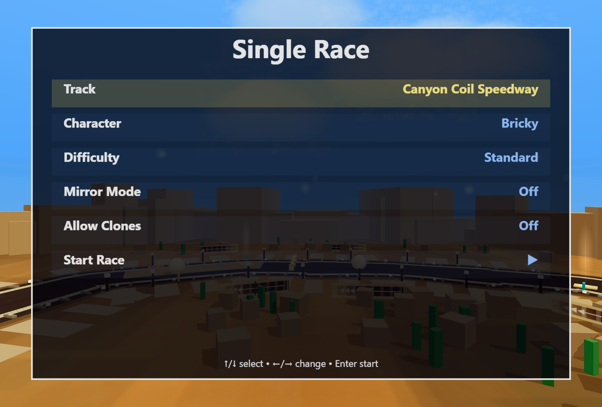
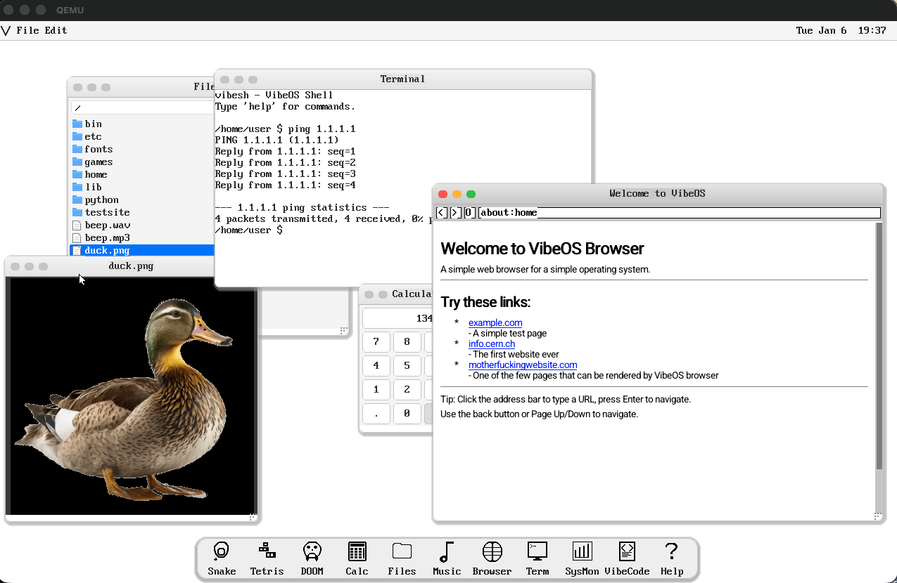
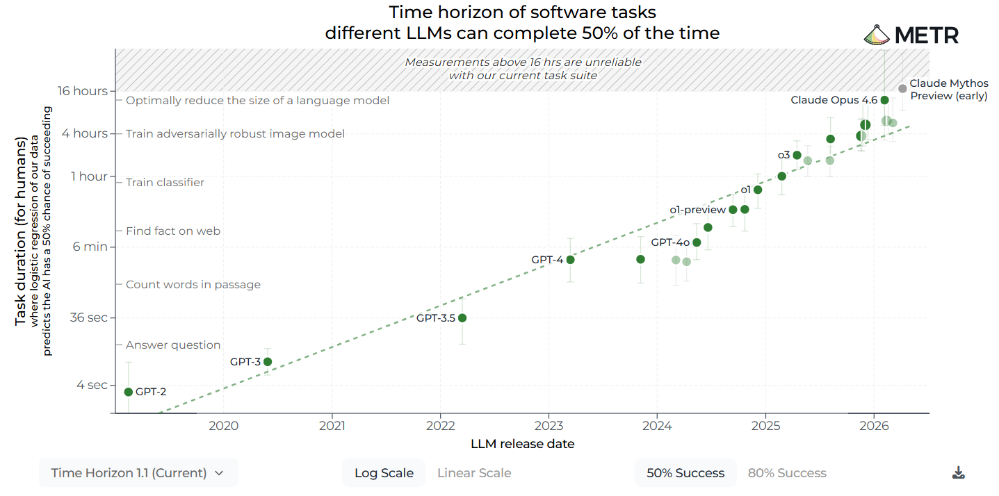
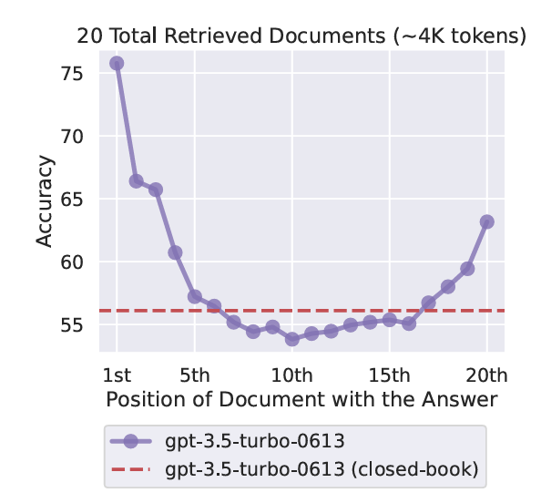
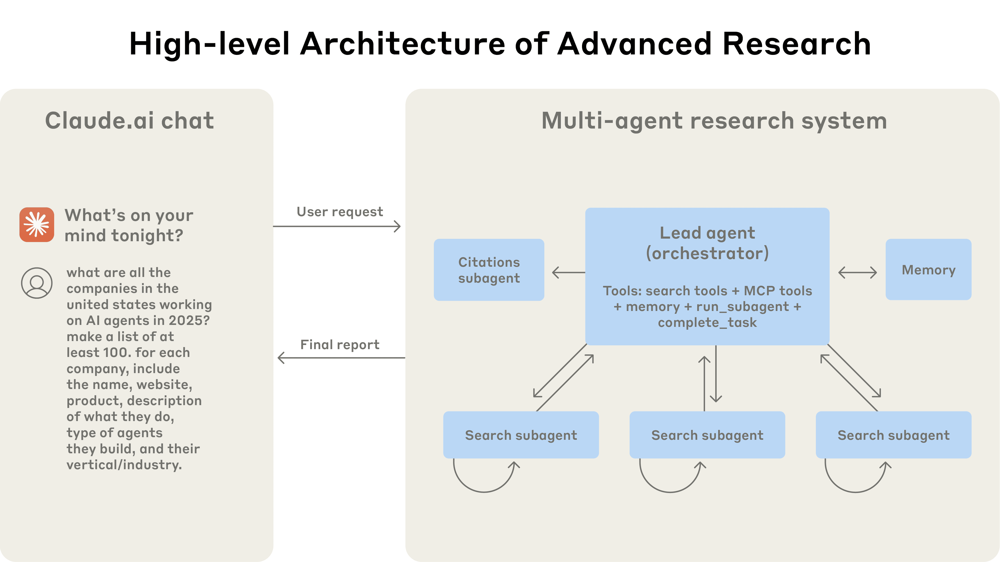
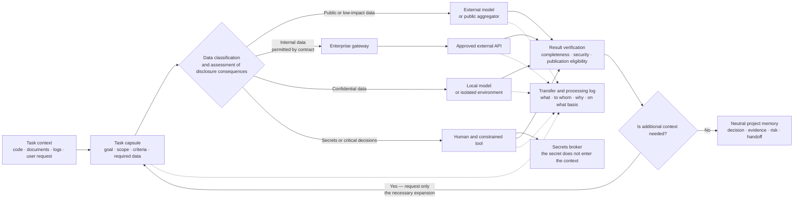
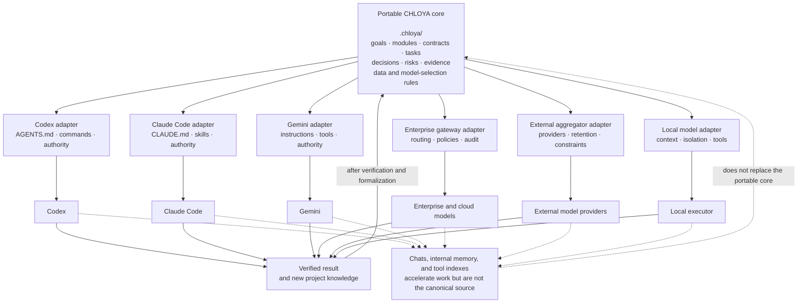

# Why a New Methodology Is Needed

> **Version:** `0.3.1`  
> **Status:** under discussion

## Contents of This Chapter

- [1.1. The Problem of Modern Agentic Development](#11-the-problem-of-modern-agentic-development)
- [1.2. Why Full Autonomy Is Not the Primary Goal](#12-why-full-autonomy-is-not-the-primary-goal)
  - [1.2.1. What Has Already Been Created Autonomously](#121-what-has-already-been-created-autonomously)
  - [1.2.2. Why Individual Demonstrations Do Not Prove General Reliability](#122-why-individual-demonstrations-do-not-prove-general-reliability)
  - [1.2.3. The Economic Cost of Autonomy Without a Goal or Stopping Criteria](#123-the-economic-cost-of-autonomy-without-a-goal-or-stopping-criteria)
  - [1.2.4. CHLOYA's Position](#124-chloyas-position)
- [1.3. Context and Compute Budgets as Architectural Resources](#13-context-and-compute-budgets-as-architectural-resources)
  - [1.3.1. The Context Window Is Not Project Memory](#131-the-context-window-is-not-project-memory)
  - [1.3.2. The Costs of Excessive and Insufficient Context](#132-the-costs-of-excessive-and-insufficient-context)
  - [1.3.3. Architecture as a Means of Localizing Attention](#133-architecture-as-a-means-of-localizing-attention)
  - [1.3.4. Semantic Transfer of System Changes](#134-semantic-transfer-of-system-changes)
  - [1.3.5. Context Proliferation in Multi-Agent Work](#135-context-proliferation-in-multi-agent-work)
  - [1.3.6. Context Layers and the Task Capsule](#136-context-layers-and-the-task-capsule)
  - [1.3.7. CHLOYA's Position](#137-chloyas-position)
- [1.4. Confidentiality, Ownership of Project Knowledge, and Vendor Independence](#14-confidentiality-ownership-of-project-knowledge-and-vendor-independence)
  - [1.4.1. Source Data Is Not the Only Confidential Material](#141-source-data-is-not-the-only-confidential-material)
  - [1.4.2. External AI Is Not a Single Class of Environment](#142-external-ai-is-not-a-single-class-of-environment)
  - [1.4.3. Multi-Model Platforms, Enterprise Gateways, and an Additional Trust Boundary](#143-multi-model-platforms-enterprise-gateways-and-an-additional-trust-boundary)
  - [1.4.4. A Provider's Policy Does Not Replace Authorization to Transfer Data](#144-a-providers-policy-does-not-replace-authorization-to-transfer-data)
  - [1.4.5. The Trust Boundary Runs Through the Entire Agentic Process](#145-the-trust-boundary-runs-through-the-entire-agentic-process)
  - [1.4.6. A Local Model Does Not Reduce Every Risk](#146-a-local-model-does-not-reduce-every-risk)
  - [1.4.7. Project Memory Must Belong to the Project](#147-project-memory-must-belong-to-the-project)
  - [1.4.8. A Portable Core and Provider Adapters](#148-a-portable-core-and-provider-adapters)
  - [1.4.9. Independence Does Not Mean Model Equivalence](#149-independence-does-not-mean-model-equivalence)
  - [1.4.10. Example: Analyzing a Duplicate Charge in a Payment Module](#1410-example-analyzing-a-duplicate-charge-in-a-payment-module)
  - [1.4.11. CHLOYA's Position](#1411-chloyas-position)

## 1.1. The Problem of Modern Agentic Development

Modern coding agents can read repositories, modify code, run commands and tests, create interfaces, write documentation, and prepare changes for publication. However, the speed of their actions significantly outpaces the maturity of the processes used to govern them.

A common scenario looks like this:

- a human briefly describes a broad idea;
- the agent receives broad access to the repository, terminal, databases, and cloud infrastructure;
- the agent independently selects the architecture and stack;
- in the process, the agent creates files, branches, dependencies, migrations, and services;
- a human evaluates an almost finished result without always understanding how the decisions were reached or what their consequences are.

This approach can quickly create a demo, but does not guarantee that the result:

- reflects the human's actual intent;
- is predictable in cost;
- can be understood and maintained by humans;
- safe for data and infrastructure;
- portable between Codex, Claude Code, Gemini CLI, local models and future tools;
- suitable for gradual development;
- does not contain hidden assumptions of the agent;
- has not produced an architecture that would be cheaper to rewrite than to maintain.

Agent-based tools are capable of affecting the file system, network and infrastructure, so security is determined not only by the quality of the model, but also by technically enforced sandboxing, network restrictions, confirmation policies and reversibility of actions. The Friendly Fire publication further shows that even the task of defensive analysis of third-party code can be turned into a channel for executing malicious instructions. [1](https://ainowinstitute.org/publications/friendly-fire-exploit-brief), [3](https://developers.openai.com/codex/agent-approvals-security), [4](https://docs.anthropic.com/en/docs/claude-code/security)

## 1.2. Why Full Autonomy Is Not the Primary Goal

A request such as “build me a large system or game,” followed by prolonged autonomous work by an agent, can no longer be treated as a purely hypothetical scenario. Modern coding agents can work for hours or days without constant human involvement, create multi-file applications, run and fix tests, generate visual assets, distribute work among multiple executors, and steadily advance a single project.

Therefore, the question is no longer **whether AI can independently create a substantial software artifact**, but under what conditions the result can be considered aligned with the intent, verifiable, maintainable, economically justified, and safe.

AI combines well-known solutions, quickly implements standard designs, and helps analyze options. However, without explicitly defined boundaries it can:

- prematurely choose the usual stack;
- literally implement an incomplete requirement;
- fail to notice the user’s informal purpose;
- create a solution similar to the required one, but not the right one;
- overcomplicate the architecture;
- add features that do not create user value;
- repeatedly redo an already acceptable result;
- fail to find an unconventional workaround that a human with domain expertise might suggest;
- continue consuming compute resources after the value of subsequent changes has fallen below their cost.

### 1.2.1. What Has Already Been Created Autonomously

A case in point was an OpenAI demonstration in which Codex created Voxel Velocity, a 3D racing game built with Three.js. The game included eight tracks, eight characters, seven computer-controlled opponents, items, several difficulty levels, a user interface, sound, and game physics. According to OpenAI, the agent acted as designer, developer, and tester, running the game and checking its behavior. More than seven million tokens were spent to create the final version [40](https://openai.com/index/introducing-the-codex-app/).

However, the formula “the game was created based on one request” without explanation can be misleading. The original request was a fairly detailed specification. It listed the game mode, number of tracks and characters, control rules, skid and acceleration characteristics, duration of effects, behavior of computer opponents and interface requirements. In addition, the agent received specialized skills in developing browser games and generating images [40](https://openai.com/index/introducing-the-codex-app/).

After the initial task was set, Codex automatically received additional general instructions to continue working: run the game, look for missing features, add functionality, fix bugs, and test the result again. OpenAI shows intermediate versions after approximately 60 thousand, 800 thousand, and 7 million tokens [40](https://openai.com/index/introducing-the-codex-app/).

This example demonstrates significant autonomy of execution, but at the same time confirms the role:

- detailed specifications;
- specialized tools and skills;
- runtime environment;
- visual and functional inspection capabilities;
- repeating control cycle;
- large computing budget.

It is closer not to the request “come up with and make a good game”, but to the long-term autonomous execution of a fairly detailed project.

Figure 1.1 — Voxel Velocity interface.

The [interactive final version of the game](https://cdn.openai.com/gpt-examples/7fc9a6cb-887c-4db6-98ff-df3fd1612c78/racing_v2.html) was available as of 2026-07-19.

A more complex Anthropic experiment involved creating a new C compiler. A team of 16 Claude Opus 4.6 instances worked on a shared codebase across almost two thousand sessions. At a cost of about $20,000, the agents created a roughly 100,000-line compiler in Rust capable of building a bootable Linux 6.9 kernel for the x86, ARM, and RISC-V architectures [41](https://www.anthropic.com/engineering/building-c-compiler).

The published repository also reports successful builds or passing tests for QEMU, FFmpeg, SQLite, PostgreSQL, Redis, QuickJS, Lua, musl, DOOM and a number of other projects [42](https://github.com/anthropics/claudes-c-compiler).

This case can sometimes be loosely paraphrased as “AI wrote or rewrote Linux.” The agents didn't actually create the Linux operating system itself: they implemented a new compiler that was powerful enough to build its kernel. This does not make the achievement any less significant, but an accurate description is important to assess the actual level of autonomy.

The experiment was not a matter of letting models work freely from the general instruction “write a compiler.” A human:

- defined a verifiable goal;
- prepared the container environment;
- created the control harness;
- organized a continuous cycle of issuing tasks;
- launched parallel work of agents;
- provided test sets that guided further development.

When one session ended, the control loop started the next one. Agents had to break the problem into small parts, keep track of what was done, select the next task and continue working. Individual agents could specialize in implementation, testing, documentation, or code quality [41](https://www.anthropic.com/engineering/building-c-compiler).

Thus, the impressive result was achieved not by the absence of control, but by the creation of a specialized process for managing autonomy.

However, the compiler has significant limitations. It relies on GCC for certain x86 boot steps, lacks fully native, stable assembler and linker implementations, and is not a complete replacement for a general-purpose production compiler [41](https://www.anthropic.com/engineering/building-c-compiler). Therefore, the fact that it can build the Linux kernel demonstrates a high level of technical capability but does not prove that the entire solution is production-ready.

**Materials from Anthropic's experiment with a team of agents:** [video on YouTube](https://www.youtube.com/watch?v=vNeIQS9GsZ8).

There are also more direct experiments in creating operating systems. The open source VibeOS project describes a hobbyist operating system for ARM64, developed in collaboration with Claude Code over 64 documented sessions. It runs in QEMU and on Raspberry Pi Zero 2W, contains its own kernel, file system, graphics environment, network stack and a number of user programs [43](https://github.com/kaansenol5/VibeOS).

At the same time, the author himself warns that not everything works and some of the features have not been tested. Building also requires an external cross-compiler, and some features depend on third-party code. Therefore, VibeOS is useful as evidence of AI's ability to significantly contribute to the creation of system software, but is not sufficient as evidence of the readiness to autonomously create reliable industrial-grade operating systems.

Figure 1.2 — VibeOS desktop.

### 1.2.2. Why Individual Demonstrations Do Not Prove General Reliability

A successful large experiment shows that a particular configuration of model, tools, specification, tests, and control loop was able to produce a particular result. It does not prove that the same agent will create an arbitrary system with a comparable probability for a different request.

Research into automated game development shows the difference between impressive individual results and consistent reproducibility.

The OpenGame system uses not only a language model, but also a specialized GameCoder-27B model, a library of project templates, a cumulative error-correction log, and a separate environment for checking whether the project builds, is visually usable, and conforms to the intended design. The authors note that conventional agents often lose consistency between files, link scenes incorrectly, and create projects that work formally but remain logically incoherent [44](https://arxiv.org/abs/2604.18394).

The GameCraft-Bench benchmark includes 140 tasks for the Godot game engine. Even the best agent tested achieved an overall score of 41.46%, and most systems did not reach 40%. Agents were relatively successful at reproducing individual game mechanics, but performed worse on content completeness, visual feedback, and the overall coherence of the finished game [45](https://arxiv.org/abs/2606.17861).

Therefore, one successful game demonstration does not mean that the same agent can reliably create an arbitrary game of comparable quality.

METR proposes measuring autonomy by the duration of a task that a human expert would complete in a given amount of time and that an agent can complete with a specified probability. It calculates separate thresholds for a 50% and an 80% probability of success [46](https://metr.org/time-horizons/).

The distinction is fundamental: being able to complete long tasks sometimes is not the same as completing them reliably enough for a routine engineering process.

At the same time, METR's evaluations consist mainly of self-contained, well-specified tasks with clear criteria and automated verification. METR explicitly warns that these results cannot be equated directly with the day-to-day work of an expert who has long-term knowledge of the product, its users, and the organization. METR currently considers measurements for tasks longer than 16 human-hours insufficiently reliable [46](https://metr.org/time-horizons/).

Figure 1.3 — Agent task-completion time horizons [46](https://metr.org/time-horizons/).

The examples above support several conclusions.

First, prolonged autonomous work is already applicable to large but bounded and readily verifiable tasks. It is particularly effective where a strong verification mechanism exists: a compiler either builds a program and passes its tests or it does not; a game either runs and implements the specified mechanics or it does not.

Second, the outcome depends on more than model quality. The level of detail in the specification, the project structure, available tools, organization of parallel work, tests, the ability to run the result, the budget, environmental constraints, and recovery rules all play substantial roles.

Third, automated verification does not always answer the most important question. Tests may prove that a compiler builds a kernel or that a character moves around a track, but they do not prove that users need the product, that its architecture is suitable for continued development, that its interface is usable, or that the implementation matches the owner's informal intent.

Fourth, the amount of code produced, the number of tokens consumed, and the duration of uninterrupted work must not be treated as measures of effectiveness in themselves.

### 1.2.3. The Economic Cost of Autonomy Without a Goal or Stopping Criteria

Public demonstrations of autonomous development show the technical capabilities of agents, but do not always prove that the chosen process is economically justified. An agent's ability to continue working for millions or billions of tokens does not in itself mean that each subsequent cycle creates commensurate value.

Codex used more than seven million tokens to create Voxel Velocity [40](https://openai.com/index/introducing-the-codex-app/). The exact cost of the experiment cannot be determined from the published information: OpenAI does not provide the ratio of input to output tokens, the amount of cached context, the specific pricing scheme, or separate costs for image generation and other tools.

However, the order of magnitude can be estimated conditionally. As of the date of preparation of this edition, the cost of one million input and output tokens for models of the GPT-5.6 family is respectively:

| Model | Input tokens | Output tokens |
|---|---:|---:|
| GPT-5.6 Luna | $1 | $6 |
| GPT-5.6 Terra | $2.5 | $15 |
| GPT-5.6 Sol | $5 | $30 |

Prices are shown per one million tokens [47](https://developers.openai.com/api/docs/pricing), as of 2026-07-19.

If we conventionally assume that out of seven million tokens, 80% are input and 20% are output, then the direct costs of tokens would be approximately:

| Model | Estimated cost of 7 million tokens |
|---|---:|
| GPT-5.6 Luna | $14 |
| GPT-5.6 Terra | $35 |
| GPT-5.6 Sol | $70 |

This is **not an estimate of the actual cost of Voxel Velocity**, but an illustration of the order of magnitude at current rates.

Without knowing the ratio of input and output, the value of the same seven million tokens could be in a wider range:

- $7 to $42 for GPT-5.6 Luna;
- $17.50 to $105 for GPT-5.6 Terra;
- $35 to $210 for GPT-5.6 Sol.

Additional charges may apply for image generation, calls to external tools, computing infrastructure, storage of results, and reruns.

Using the same 80/20 ratio, spending 100 million tokens would be approximately $200, $500, or $1,000 for the three models listed. One billion tokens would cost about 2, 5 or 10 thousand dollars respectively [47](https://developers.openai.com/api/docs/pricing).

A single unsuccessful request may look cheap. However, a long series of unlimited iterations can become a significant expense, especially if multiple agents are running simultaneously, an expensive model is used, multiple checks are performed, and paid tools are invoked. Even if the cost of an individual step is small, the absence of stopping criteria allows the total costs to grow without a confirmed increase in the usefulness of the result.

The Voxel Velocity example is particularly important because, after the initial task was set, Codex automatically received general instructions to continue improving the game [40](https://openai.com/index/introducing-the-codex-app/). This loop can improve quality, but without a defined completion criterion it has no natural stopping point. The number of possible improvements to a software product is practically unlimited. The agent can always propose another track, character, visual effect, mode, setting, optimization, or rework of an existing feature. Therefore, the instruction “keep improving” describes a direction of activity but does not define when the product is ready. The agent can continue finding new changes even when their value to the user has fallen below the cost of the next cycle.

In aimless or weakly constrained vibe coding, token consumption is determined not by the volume of useful output, but by how long the user or control system allows the agent to continue working.

Commands like “do it better,” “add more features,” or “keep going until the project is perfect” do not define:

- which user problem the product should solve;
- which features are actually necessary;
- which criteria will be used to accept the result;
- which properties cannot be changed;
- when further improvement ceases to be worthwhile;
- the maximum permissible budget.

As a result, the agent can:

- create features that will never be used;
- repeatedly change an already working solution;
- rewrite its own code without measurable improvement;
- increase the number of dependencies and the system's coupling;
- create an ever-growing body of output that requires human verification;
- delve into directions that are technically interesting but wrong for the product.

Visible progress may be expressed in the number of files, functions, lines of code, and iterations completed, rather than in progress toward a user or business goal.

The Anthropic experiment shows a much larger scale. Almost two thousand Claude Code sessions consumed about two billion input and 140 million output tokens in two weeks. Direct API costs were just under $20K [41](https://www.anthropic.com/engineering/building-c-compiler). On average, this is about $10 per agent session.

Dividing the cost by the amount of code generated yields a seemingly attractive estimate of about 20 cents per line for a compiler of roughly 100 thousand lines. But this metric is misleading. A line of code is not a unit of useful value: it must be tested, understood, maintained, and corrected if necessary. In addition, the author of the experiment points out the compiler's limitations and the fact that it is not yet a full replacement for a production tool [41](https://www.anthropic.com/engineering/building-c-compiler).

The high cost of autonomous operation does not in itself prove its ineffectiveness. Evaluation depends on what purpose the process serves and what knowledge or results it creates. A research experiment costing tens of thousands of dollars may be justified if it tests the limits of a technology, produces reproducible data, or provides a basis for subsequent developments. On the contrary, much cheaper generation may turn out to be economically meaningless if the product being created is not needed by anyone or does not have a specific purpose.

The compiler experiment cannot be considered a waste of resources. It had a research purpose, testable criteria, and made it possible to explore the limits of multi-agent development. However, it shows how resource-intensive prolonged autonomy can become. If a comparable amount of compute is spent on a product without demonstrated need, acceptance criteria, or architectural constraints, a substantial share of the value may be lost.

The full cost of autonomous development cannot be reduced only to the price of tokens:

> **Total cost = tokens + tools + infrastructure + human review + corrections and rewrites + maintenance + cost of pursuing the wrong direction.**

However, the components cannot be considered equivalent. The price of tokens is usually measured directly and is immediately visible. The cost of validation, technical debt, release delays, and going in the wrong product direction comes later and can be many times the initial cost of the model.

The last component is often the most expensive. A few tens of dollars spent on generating an unnecessary prototype may not be significant. But if the prototype becomes the basis of the architecture, and the misdirection is discovered after integration, documentation and release, the cost of fixing is no longer determined by tokens, but by lost time and accumulated technical debt.

Thus, the problem with goalless autonomy is not the sheer number of tokens used, but the lack of a demonstrable connection between spending and progress towards a human goal. The cost of a single model call may be small, but the process architecture should prevent automatic continuation when the completion criteria have been met, further value is uncertain, or the chosen direction requires human review.

A separate source of cost is repeatedly transferring the same project context to agents. It depends not only on the autonomy mode but also on the architecture of modules, contracts, and project memory, so it is discussed in section 1.3.

### 1.2.4. CHLOYA's Position

CHLOYA does not prohibit or devalue autonomous development. It views autonomy as a **customizable mode of execution** rather than as the end goal of the methodology.

An agent can work autonomously for a long time if:

- the scope of the task is clearly limited;
- the expected result and artifact are defined;
- there are verifiable acceptance criteria;
- the environment is isolated from irreversible consequences;
- a budget for tokens, time, tools and external calls has been set;
- the budget determines the acceptable cost of completing a task but does not replace context management: even a large agreed budget does not justify transferring irrelevant or repeatedly duplicated materials to the executor;
- the intermediate state is preserved and can be checked;
- errors can be rolled back;
- going beyond the initial scope requires a separate decision;
- conditions for early stopping are set;
- technical readiness does not lead to automatic deployment of the result.

Going over budget does not necessarily mean the agent made a mistake. It may indicate that the task is more difficult than expected, the criteria are not well defined, or the chosen model does not correspond to the task. However, continuing to work after going over budget should be a separate conscious decision, and not an automatic consequence of the command “keep going.”

A human does not have to control every line and every command. Human involvement should focus on:

- goal setting;
- defining boundaries and acceptable risk;
- approval of architecturally significant decisions;
- assessing whether the result creates real value;
- acceptance of residual risk;
- semantic verification of the result;
- the decision to continue, stop or change direction.

CHLOYA's economic goal is neither to minimize every individual model call nor to prohibit long-running autonomous processes. It is to ensure that compute costs are associated with verifiable progress toward a human goal.

An agent can be given a large budget if the expected value and the method for verifying the result justify it. An unlimited budget for an undefined purpose is not autonomy—it is a lack of control.

Thus, CHLOYA's target is neither the maximum number of hours an agent can operate without a human nor the minimum number of human actions. The goal is to give the agent **maximum useful autonomy within explicitly defined boundaries** without losing alignment with human intent, verifiability, reversibility, economic justification, or accountability.

## 1.3. Context and Compute Budgets as Architectural Resources

When developing with AI, the architecture defines more than just the connections between software components. It also determines how much information each agent must receive and reprocess in order to correctly complete its task.

If every executor must re-examine the entire repository, decision history, documentation, and the work of other agents before each change, the cost of development grows with the size of the project. The same information is repeatedly passed to models, occupying the context window, increasing latency, and expanding the scope of output that a human must then review.

Therefore, CHLOYA treats context not as a free addition to a task but as a limited architectural resource alongside the compute budget, execution time, and agent authority.

### 1.3.1. The Context Window Is Not Project Memory

A project may contain code, documentation, decision history, requirements, test results, change history, and accumulated domain knowledge. However, the presence of these materials in a repository or storage system does not mean that all of them must be in a particular agent's active context at the same time.

It is necessary to distinguish:

- **project memory** — all stored knowledge that may be needed in the future;
- **available context** — materials the agent can request when needed;
- **active context** — information directly transferred to the model to perform the current step;
- **locally significant context** — the minimum set of information without which the task cannot be correctly understood and completed.

Even if the model's context window can technically accommodate a significant portion of the repository, this does not guarantee that the model will find and enforce every important constraint equally reliably.

The *Lost in the Middle* study found that the quality of long context use may depend on the position of relevant information. In the experiments conducted by the authors, models were better at using information located closer to the beginning or end of the context, and worse at using information from its middle [48](https://arxiv.org/abs/2307.03172). The ability to accept a long input is therefore not the same as the ability to use all of its contents equally reliably.

Figure 1.4 — How the position of relevant information in a long context affects model response accuracy [48](https://arxiv.org/abs/2307.03172).

Anthropic defines context engineering as selecting and maintaining the optimal set of tokens available to the model while it performs a task. In this view, context is a finite resource: each additional fragment may help, have no effect on the result, or distract the model from more important information. For agentic systems, Anthropic specifically recommends combining information supplied in advance with additional data loaded as needed [49](https://www.anthropic.com/engineering/effective-context-engineering-for-ai-agents).

Figure 1.5 — Architecture of a multi-agent research system as an example of context engineering [49](https://www.anthropic.com/engineering/effective-context-engineering-for-ai-agents).

This follows the basic principle of CHLOYA:

> **Project memory must be sufficiently complete and recoverable, while the agent's active context must be current, trusted, and minimally sufficient for its task.**

“Minimally sufficient” does not mean “as short as possible.” Artificially reducing context is just as dangerous as expanding it without control.

### 1.3.2. The Costs of Excessive and Insufficient Context

Giving the agent too much information creates several types of costs.

**Financial cost.** Repeated instructions, documentation, source code, and tool results increase the number of input tokens. In a multi-agent process, the same material may be transferred to several executors and repeated across several iterations.

**Latency.** A large context must be collected, transmitted, and processed. This increases the time between setting the task and receiving the result.

**Dilution of significance.** Current requirements compete with outdated solutions, long logs, supporting files, and the results of previous actions.

**Cost of human verification.** The wider the area that the agent has studied or modified, the more connections and possible consequences a human must verify.

**Growth of trust surface.** Each added document or tool result may contain erroneous information, outdated instructions, sensitive data, or untrusted content.

However, the opposite extreme is also dangerous. If a local agent receives only the files of its module while important system constraints are withheld, it may:

- violate an external contract;
- incorrectly interpret the data format;
- create an incompatible change;
- duplicate an existing mechanism;
- fail to account for security requirements;
- disrupt the end-to-end business process;
- accept a related task as a completely local one.

Therefore, CHLOYA does not strive for minimal context as an end in itself. It strives for **minimally sufficient context with controlled expansion**.

The Repoformer study confirms that unconditionally retrieving additional repository context is not always useful. The authors found that a significant portion of the extracted material may have been useless or harmful to code completion. Selective context retrieval made it possible in the studied configuration to speed up processing by up to 70% without degrading the quality [51](https://arxiv.org/abs/2403.10059).

Thematic selection is not the only consideration; the freshness of the materials also matters. A 2026 diagnostic study of 17 examples of signature changes from five Python repositories found that providing stale fragments could steer models toward interfaces that were no longer current. The authors explicitly limit their conclusions to a small, controlled sample, so these results cannot be treated as a universal quantitative estimate. However, they confirm a qualitative risk: stale context can actively steer an agent toward an incorrect state of the project [53](https://arxiv.org/abs/2605.14478).

Therefore, the context capsule should describe not only the content, but also its state:

- source;
- version or point in time when it was current;
- level of trust;
- scope of applicability;
- relation to the current task;
- indicators that the information needs to be rechecked.

### 1.3.3. Architecture as a Means of Localizing Attention

In traditional development, modularity reduces system coupling and simplifies maintenance. In agentic development, it serves an additional purpose: reducing the amount of information that must be sent to the AI again for each change.

A well-defined module should have:

- a defined responsibility;
- explicit inputs and outputs;
- documented contracts;
- controlled dependencies;
- local readiness criteria;
- known system limitations;
- clear conditions under which a change ceases to be local.

If this information is formalized, the executor does not need to read the internal implementation of all neighboring components. It can work based on the contract and only request additional context when uncertainty is detected.

The architecture becomes not only the structure of program execution, but also **the structure of AI attention distribution**.

This does not mean that the local executor should be isolated from the system. It should know:

- what part of the system is being changed;
- what contracts it interacts with;
- what restrictions are mandatory;
- which neighboring components may be affected;
- when it must stop and request an expansion of context.

Thus, locality in CHLOYA is not a lack of knowledge about the system, but a controlled limitation of the depth of access to its internal details.

### 1.3.4. Semantic Transfer of System Changes

If a change to one module affects others, the simplest solution seems to be to communicate the full set of changes to all agents and ask them to determine the consequences themselves. However, this approach forces each executor to re-analyze someone else's code and creates the risk of different interpretations of one solution.

CHLOYA proposes separating the implementation of a change from its meaning for consumers.

Assume that the authorization module has changed the token format and added the required field `tenant_id`.

The agent responsible for the notification module generally does not need to receive:

- the full diff of the authorization module;
- internal implementation of cryptography;
- all token generation classes;
- history of discussion of the decision;
- a full set of internal authorization tests.

For its operation, it is more important to obtain a formalized meaning of the change:

- the `tenant_id` field appeared in the token;
- the field is required for new tokens;
- old format tokens are supported until a certain date or version;
- if the field is missing, the consumer must perform an explicitly specified action;
- a specific contract has been changed;
- compatibility is checked by the specified tests;
- activation of new behavior occurs under certain conditions.

This representation is called **semantic change transfer** in CHLOYA.

Its purpose is to give the executor not all of someone else's code, but a verifiable description of the change's consequences for the executor's area of responsibility.

Semantic transfer does not revoke access to the original implementation. If the agent discovers a contradiction, contract insufficiency, or unintended dependency, it must be able to request the source materials. But reading someone else's module completely becomes an exception, justified by a specific need, and not a mandatory beginning of every task.

### 1.3.5. Context Proliferation in Multi-Agent Work

The cost of context grows especially quickly when agents work in parallel.

Let's consider a hypothetical project in which a significant part of the repository, instructions and history takes up 400 thousand tokens. Five agents work on the change, each performing four significant iterations.

If you transfer the entire volume to each agent each time, the total processing will be:

> 400,000 × 5 × 4 = 8,000,000 input tokens.

If a local context capsule of 40,000 tokens is formed for each executor:

> 40,000 × 5 × 4 = 800,000 input tokens.

The difference is tenfold even before model responses, tool outputs, repeated checks, and additional coordination messages are taken into account.

This is a simplified example. Real systems use caching, search, indexing, and reuse of prefixes that have already been processed. But it shows the main effect: even a relatively inexpensive model becomes costly when the same volume of project information is repeatedly sent to several agents.

Anthropic's experience building a multi-agent research system shows that poorly defined subtasks led to duplicated work, missed areas, and an excessive number of executors. To reduce these losses, the coordinator needed scaling rules, clear subtask goals, a result format, and explicit boundaries for each agent's work [52](https://www.anthropic.com/engineering/multi-agent-research-system).

Therefore, parallelism in itself is not an advantage. It is useful when:

- tasks are truly independent or related in a controlled way;
- each agent is assigned a separate responsibility;
- the intersection of areas is clearly defined;
- results are returned in the agreed format;
- the cost of coordination is lower than the resulting gain;
- there is a condition for stopping further multiplication of tasks.

Caching can reduce the cost and latency of repeated prefixes. OpenAI uses matching at the beginning of a request to reuse the cache and recommends placing stable instructions and examples at the beginning, followed by mutable data [50](https://developers.openai.com/api/docs/guides/prompt-caching).

However, caching solves the reprocessing problem, not the relevance problem. Cheap irrelevant context remains irrelevant. In addition, changing the early part of the request can reduce the proportion of cache reuse.

### 1.3.6. Context Layers and the Task Capsule

In CHLOYA, it is useful to distinguish between three levels of project context.

| Level | Contents | Mode of use |
|---|---|---|
| Active context | Current task, local code, existing contracts, constraints, risks, and readiness criteria | Transferred directly to the executor |
| Context on request | Related modules, extended architectural documentation, related decisions, and additional tests | Loaded when a dependency or uncertainty is detected |
| Long-term project memory | Complete decision history, completed tasks, logs, evidence, old versions, and large reports | Stored outside the active window and used selectively |

The basic task context capsule should contain:

- goal;
- expected artifact;
- scope of permitted changes;
- locally significant code;
- applicable contracts;
- current architectural decisions;
- prohibited actions;
- acceptance criteria;
- budget for time and compute;
- level of trust in sources;
- signs that require expanding the context;
- format of the returned result.

The composition of the capsule depends on the risk. To change documentation locally, a few files and design rules may be sufficient. Changing authorization, data schema, payment logic, or update mechanism will require broader system context and additional checks.

The agent must not silently expand the task scope. If the information provided is insufficient, it must:

1. stop the affected part of the work;
2. describe the detected dependence or contradiction;
3. indicate what information is missing;
4. request a specific context extension;
5. evaluate the impact of expansion on the cost and boundaries of the task;
6. continue work after receiving permission or an updated contract.

This mechanism prevents both extremes: uncontrolled reading of the entire system and dangerous operation in an artificially narrow context.

### 1.3.7. CHLOYA's Position

CHLOYA holds that the architecture of agentic development should answer not only the question “what components exist and how do they interact?” but also:

> **To whom, when, and to what extent should knowledge about these interactions be transferred?**

Therefore, context is designed together with modules, contracts, and permissions.

The main goal is not to give the agent as little information as possible. The goal is for each executor to receive:

- sufficient information for a correct understanding of the task;
- a minimum of irrelevant material;
- only relevant and acceptable sources;
- clear boundaries of responsibility;
- the ability to request an expansion;
- a provable connection between the received context and the change being performed.

The context budget is not a hard limit that prohibits complex tasks but a mechanism for deliberate management. Exceeding it may be justified if a previously unknown dependency is discovered, the risk increases, or the initial decomposition proves incorrect. However, the expansion must be recorded and explained.

CHLOYA thus treats architecture as a way to localize not only code and responsibility but also AI attention, knowledge, and compute costs.

> **Project memory must be complete and recoverable. The work context must be local, up-to-date, trusted, minimally sufficient, and extensible as needed.**

## 1.4. Confidentiality, Ownership of Project Knowledge, and Vendor Independence

Code, architecture, production logs, customer data, proprietary algorithms, internal communications, and operational information may be confidential. Therefore, an agent's technical ability to access material must not automatically be treated as permission to transfer it to an external model.

At the same time, confidentiality in agentic development is not limited to protecting existing files and databases. New knowledge emerges as humans and AI work together: requirements are clarified, exceptions are discovered, solutions are tested and rejected, quality criteria are formed, and methods for correcting model errors accumulate. Over time, this information becomes a project asset in its own right and may prove more valuable than individual code fragments.

CHLOYA treats the protection of source data, the preservation of knowledge generated during development, and the ability to continue working with another executor without losing the accumulated state as related challenges.

Ownership of project knowledge here is not a legal opinion on intellectual property rights; it means practical control over project memory. The owner must be able to store it in their own environment, verify the origin and relevance of the information, restrict its transfer, and move it between models and tools.

### 1.4.1. Source Data Is Not the Only Confidential Material

In agentic development, it is useful to distinguish between the project's source materials and the derived knowledge that emerges during the work. Both classes have independent value, but they differ in origin and how they accumulate.

#### Project source materials

This includes information that already exists in production systems, repositories, documents, and infrastructure.

The source code reveals the internal structure of the product, the algorithms used, dependencies and possible weaknesses. Even if part of the project is published, experimental features, configuration, deployment methods, and communications with internal services may remain closed.

A database schema makes it possible to reconstruct the product's principal entities, the relationships between them, and the composition of the information collected. Even without the records themselves, it can reveal how business processes are organized, which user actions are tracked, and what information the organization considers important.

Database contents may include personal, financial, medical, contractual, and other regulated data. The ability to export a table from a production system does not in itself grant the right to transfer it to an external executor.

Documents, requirements, contracts, records, and internal correspondence often reveal more about an organization's actual activities than source code does. They may disclose prices, obligations, disputes, development plans, customers, and features that have not yet been announced.

Production logs and traces are necessary when investigating errors, but often include user IDs, operation parameters, request fragments, internal paths, service addresses, and parts of processed documents. The diagnostic value of such materials does not make it safe to transmit them in their entirety.

Infrastructure configuration and descriptions reveal service locations, component versions, network connections, and the protective mechanisms in use. Individually, these details may look innocuous, but together they make it possible to reconstruct the environment's architecture and potential points of influence.

Passwords, keys, and access tokens require special treatment. They must not be included in model context as plain text. When an agent needs to perform an authorized action, it is safer to expose a limited operation through a separate tool or secrets broker without revealing the secret itself.

The data of users, customers and partners also cannot be considered the property of a technical system just because it is stored in it. Their processing may be limited by law, contract, consent, territory or the original purpose of collection.

#### Derived project knowledge

The second class of information forms gradually—in tasks, discussions, reviews, corrections, and test results.

The code usually shows what was implemented, but does not explain why that particular option was chosen. The reasons for architectural and product decisions preserve the constraints, risks, and business considerations that influenced the choice.

Rejected alternatives are equally important. If information about them remains only in chat history, the next executor may again propose an approach that has already been tested and found unsuitable. The project pays for the research again and risks returning to an error that was already identified.

Corrections to model responses reflect domain-specific details and internal quality standards. Repeated human comments gradually form practical knowledge about the agent's weaknesses, common misconceptions, and necessary checks.

Successful sequences of actions, methods of decomposition and analysis patterns over time turn into internal development technology. If this technology exists only in the memory of an external service, the organization effectively loses control over its own way of working.

Quality criteria are not limited to automated tests either. The project owner may consider the implementation's comprehensibility, maintainability, alignment with the original intent, acceptable risk, operating cost, and impact on the user. These criteria must be stored as part of project memory.

Implicit business process exceptions are especially valuable. They are discovered when analyzing real cases and often distinguish a formally correct solution from a usable solution.

Finally, information about system weaknesses is sensitive: known defects, unstable components, unpatched vulnerabilities, and failure scenarios. Even when the source code is open, a compiled map of such issues may create a separate risk.

Satya Nadella described a related “reverse information paradox”: the user not only pays for the AI ​​service, but also transfers to the provider the context, corrections, workflows and knowledge that make the system useful for his business [17](https://x.com/satyanadella/article/2076323181154230284). This is an industry observation, not stand-alone scientific evidence, but it does point to a real problem: a significant portion of an organization's operating memory may gradually migrate to an environment it does not control.

This leads to the first principle:

> **Confidentiality in agentic development applies not only to transferred files but also to the knowledge that emerges through human interaction with AI.**

If reasons for decisions, quality criteria, and accumulated fixes exist only within the chats or memory of a particular agent, the project simultaneously loses portability and weakens control over its own way of working.

### 1.4.2. External AI Is Not a Single Class of Environment

When assessing the acceptability of data transfer, it is not enough to know the model or vendor name. One company may provide several products that differ in technical architecture, storage conditions, available customizations, and contractual warranties.

Consumer chat is suitable for general questions and experimentation, but its standard terms are not always designed for proprietary organizational content. The user may not have as much control over retention periods, internal logging, and administrative access as is required for a working project.

An enterprise account typically provides additional controls, auditing, and contractual protections. However, simply using a business plan does not make all company or customer data acceptable as context.

An API makes it possible to define the information being transferred more precisely and add custom preliminary filtering. At the same time, the assessment must cover not only the main request but also server-side state, monitoring logs, file storage, caching, and connected tools.

The cloud programming agent has a wider trust surface than a regular conversation. It can read the repository, execute commands, access the task system, use the browser, and interact with external services. Therefore, it should be assessed as a full participant in the infrastructure, and not just as a language model.

A managed enterprise platform can provide centralized policies, regional hosting, identity integration, and auditing. The actual guarantees still depend on the contract, settings and the set of functions used.

Deploying the model on the client's infrastructure reduces the transfer of data to an external provider, but shifts the responsibility for protecting the computing environment, logs, storage, update channels and network access to the project owner.

A completely local model with no external network is suitable for the most sensitive materials, although its quality, speed, and available tools may be inferior to cloud-based solutions.

Finally, any of the options above may use a browser, search, plugins, or MCP servers. Even if the primary model is in an approved environment, an external tool may retain data, transfer it to another party, or return substantially more information than required [5](https://modelcontextprotocol.io/specification/2025-11-25/server/tools), [27](https://modelcontextprotocol.io/docs/tutorials/security/security_best_practices).

Conditions may vary within the same product. These are affected by pricing, region, organization settings, endpoint type, included tools, and contractual provisions. Text request, file download, long-term session, and code execution do not necessarily follow the same rules. Individual functions are able to use their own infrastructure and retention periods.

Therefore, CHLOYA evaluates not an abstract model or a provider's reputation but a specific operational setup:

> **provider + product + plan + region + settings + contractual terms + tools.**

OpenAI states that API data is not used for model training by default. Under standard processing, user content may be retained in abuse-monitoring logs for up to 30 days; eligible organizations may use Modified Abuse Monitoring and Zero Data Retention modes [54](https://developers.openai.com/api/docs/guides/your-data).

Anthropic also separates the standard API retention terms from the Zero Data Retention agreement. This mode applies at the organization level, but individual capabilities may have their own limitations or may not support zero storage [55](https://docs.anthropic.com/en/docs/build-with-claude/zero-data-retention).

Google Cloud documentation shows that actual no storage depends on specific features and settings. Request logging, session recovery, and individual integrations can have their own rules [56](https://docs.cloud.google.com/gemini-enterprise-agent-platform/resources/zero-data-retention).

These examples are not a ranking of providers. Terms of service change, and special modes may depend on the contract and configuration. The important point is different:

> **The statement “data is not used for training” does not mean that it is not stored anywhere, is not logged, is not transmitted to auxiliary components, and is not automatically acceptable for sending.**

Before a product can be included in a valid circuit, CHLOYA requires that its operating conditions be verified in a specific configuration.

### 1.4.3. Multi-Model Platforms, Enterprise Gateways, and an Additional Trust Boundary

The development of generative AI has produced a distinct infrastructure layer between the user and a specific model. Through a single interface or API, such systems provide access to multiple providers, select a model based on cost and quality, reroute requests when failures occur, maintain shared history, and sometimes preserve memory across conversations.

The single term “aggregator” covers substantially different solutions. A consumer platform combines many models and user applications. A router API enables programmatic provider selection. A coding assistant gains access to code and the working environment. A cloud enterprise platform gives an organization a managed catalog of models. Finally, a company can deploy its own internal gateway over local and external systems.

They are united by the presence of an intermediate layer. However, its meaning depends not on the name or the country of origin, but on the architecture: who controls the route, which participants receive the content, where the history is stored, and what consequences revealing the context might have.

#### Benefits of external multi-model platforms

External aggregators solve a real practical problem. Instead of separate contracts, keys, libraries, and payment methods, the project receives a single connection point. Models can be compared by quality, cost, and response time, and a backup route can be used when the primary provider is unavailable. OpenRouter, for example, lets the project restrict the provider list, set the routing order, and route requests only to endpoints with a zero-data-retention policy [57](https://openrouter.ai/docs/guides/routing/provider-selection), [58](https://openrouter.ai/docs/guides/privacy/data-collection).

This arrangement is especially useful when the information being transferred is not substantially sensitive. A public assistant on a website can answer questions from public documentation, translate published materials, route non-confidential requests, or process synthetic data. If disclosure of a single request cannot cause material harm to a person, customer, or organization, low cost and automatic model switching may matter more than complete control over every technical handoff.

Therefore, CHLOYA does not propose to abandon aggregators. Mandatory direct connectivity to each vendor would increase cost and complexity, even in scenarios where additional security is not of practical benefit.

The problem arises when the single interface is treated as a transparent switch that does not participate in processing. To select a model and return a response, the mediator technically receives the passed context. Depending on the design of the service, it can store history, maintain logs, create user memory, perform analytics, and route parts of the same workflow to different providers.

The actual information path might look like this:

> project → aggregator → router → model provider → model and its tools → aggregator → project.

If third-party bots, applications, or plugins operate within the platform, their developers and the services they use are added to this chain. Shared memory creates another channel: information sent to one model may later enter another model's context.

Poe describes such a transfer directly: “We share the contents of your chats with AI model providers”—the contents of conversations are transferred to model providers. When memory is enabled, information extracted from conversations may be used in subsequent calls to other providers. Some third-party applications may receive conversations and use them to train their own models [60](https://poe.com/pages/privacy-center).

This doesn't mean the platform breaks its promises. On the contrary, an open description of the chain allows it to be assessed in advance. It shows that convenient switching between models expands the range of systems that potentially have context.

#### The code does not become secure after deleting personal data

Multi-model programming platforms require special attention. Not just one isolated question passes through them, but a significant part of the workflow: fragments of the repository, terminal commands, description of the defect, model response, developer comments, test results and the final fix.

Under BLACKBOX AI's terms, the user retains rights to their code and results but also grants the platform a license to materials shared through the service. The document expressly states the right to "use, store, copy, display, and distribute" such content, including user code, as well as to modify it and create derivative works [61](https://www.blackbox.ai/terms-of-service).

The mere existence of a broad license does not prove that any specific code was sold or misused. Such provisions may be necessary for the technical operation of the service. However, the project owner must understand that retaining copyright and granting the platform the right to use uploaded material are separate legal matters.

Removing a name, address, or account ID does not eliminate the value of the software. A formally anonymized fragment may reveal a proprietary algorithm, API structure, authorization rules, internal entities, an unpublished feature, or an unpatched vulnerability.

Therefore, anonymizing personal data and neutralizing project context are different tasks. Code may contain no information about an individual while remaining a trade secret, copyrighted material, or material whose transfer is restricted by contract.

#### A Setting Can Completely Change the Processing Mode

A short advertising description, a privacy page and the full text of the user agreement may describe different modes of the same service.

OpenRouter states that request content is not logged by default for normal routing and that users can restrict routing to providers that do not store data or use it for training [58](https://openrouter.ai/docs/guides/privacy/data-collection). However, if logging is enabled voluntarily, a separate license applies. Its terms explicitly include, among the permitted uses, the right to “license or sell your User Content in anonymized form” [59](https://openrouter.ai/terms).

This formulation applies to a specific mode, and not to all service requests. However, it clearly shows how much one setting can change the status of the transferred material.

Such an exchange may be deliberate and economically justified. The user receives free or less expensive access, while the platform receives material for improving its systems or for commercial use. If the transferred material consists of public questions, synthetic examples, or information with no independent value, this choice may be acceptable.

The risk arises when the same treatment is applied to a closed repository, internal documentation, or operational conversations from which a business process can be reconstructed.

Material rights are not always described with the word “training.” They may be expressed through broader concepts: service improvement, research, analytics, commercial use, creation of derivative materials, sublicensing, transfer to affiliates, or use of anonymized data. Each formulation may serve a legitimate technical purpose, but it must be assessed in relation to the specific context.

#### Terms Do Not Remain Unchanged

Reviewing an intermediary does not end when it is first connected. User agreements, retention policies, the set of providers, and the purpose of individual features may change after implementation.

OpenRouter expressly provides the ability to change the privacy policy “at any time, without prior notice”. For significant changes, registered users are promised advance notice, but continued use after the publication of the new version constitutes acceptance of [59](https://openrouter.ai/terms).

This is not a unique feature of a particular platform, but a common risk of a cloud service. Changes can be made to a separate model policy, new memory description, free program rules, or logging settings. As a result, the user notices a new function, but does not always immediately understand that the circle of data recipients or the granted license has changed.

Therefore, a decision about whether a route is acceptable should be tied not only to the service name but also to the review date, version of the terms, enabled settings, and list of downstream providers. A material change in any of these elements requires reassessment.

For a sensitive project, it is important to preserve the ability to disconnect the intermediary and move to another channel without losing tasks, decisions, or accumulated knowledge.

#### Terms of Service Do Not Prove Actual Behavior

Even carefully studied conditions do not allow technical proof that real processing fully complies with them. The user is usually not able to independently check internal logs, backups, analytical systems, administrator actions and the full list of infrastructure partners.

This does not mean that any intermediary should be considered unscrupulous. The methodology assumes a more cautious position: contractual promises reduce uncertainty and create obligations, but do not eliminate the technical possibility of erroneous or hidden storage and transfer.

The DeepSeek case is illustrative, although the service is not a model aggregator in the strict sense. In April 2025, the South Korean regulator reported that user request content, together with device, network, and application data, had been transferred to Beijing Volcano Engine Technology without proper consent. Following the investigation, transfer of request content was stopped, and the regulator required deletion of the previously transferred material and establishment of a legal basis for subsequent cross-border processing [68](https://www.reuters.com/technology/south-korea-agency-says-deepseek-transferred-user-info-prompts-without-consent-2025-04-24/).

For CHLOYA, this case is important not as an argument against a specific company or country. It shows a general architectural risk: the user sees one service, while the actual chain of recipients may be wider.

The more severe the consequences of disclosure, the less context should be transferred to the external intermediary, even if its terms are favorably drafted.

#### Interaction History May Be More Valuable Than a Single Request

Not only the source code, but also the sequence of work around it is of independent value.

A coding-agent session may include a problem statement, selected parts of the repository, an initial response, an encountered defect, a human correction, a test result, and a final decision. This is no longer a collection of random fragments but partially labeled material showing which solutions worked, which were rejected, and why.

In February 2026, Anthropic stated that DeepSeek, Moonshot, and MiniMax had generated more than 16 million interactions with Claude across approximately 24,000 accounts in an attempt to extract the model's capabilities to improve their own systems [69](https://www.anthropic.com/news/detecting-and-preventing-distillation-attacks). Anthropic described these campaigns as occurring at an “industrial scale.”

This is Anthropic's claim; CHLOYA does not treat it as an established judicial fact or a final legal assessment of the named companies' actions. Distillation itself is a widely used and legitimate training method when proprietary models, authorized data, and lawful access rights are used. The dispute concerns alleged circumvention and unauthorized bulk extraction of outputs.

CHLOYA does not take sides in such conflicts, does not protect the interests of an individual supplier, and does not encourage circumvention of technical or contractual restrictions. The presence of a violation, the scope of liability and permissible measures are within the competence of the courts, regulators and other authorized bodies.

A more general conclusion is important for the methodology:

> **The history of interaction with AI can have independent value and therefore needs to be protected not only from accidental leakage, but also from targeted mass collection.**

If the aggregator's memory gradually accumulates requirements, reasons for decisions, developer comments, test results and business process features, the intermediary receives much more than a set of individual requests.

At the same time, project dependency increases. The history may exist only in a proprietary platform format, may not be exported in full, and may become inaccessible when the subscription or service ends.

#### Enterprise Multi-Model Platforms Form a Different Layer

A public aggregator cannot automatically be placed on the same level as the platform an organization uses to centrally deliver AI to employees.

Large cloud environments already offer managed access to multiple models. Microsoft Foundry uses a router that selects a model for a request based on quality and cost [62](https://learn.microsoft.com/en-us/azure/foundry/openai/concepts/model-router). Amazon Bedrock provides access to models from multiple vendors; AWS states that the vendors themselves do not have access to Bedrock logs, customer requests, or responses [63](https://docs.aws.amazon.com/bedrock/latest/userguide/data-protection.html). Google Vertex AI allows individual partner models to be deployed within the customer's project and VPC [64](https://docs.cloud.google.com/vertex-ai/generative-ai/docs/partner-models/deploy-partner-models). Alibaba Cloud Model Studio integrates Qwen and third-party models, including DeepSeek, Kimi, and GLM, and provides access control across workspaces [65](https://www.alibabacloud.com/help/en/model-studio/what-is-model-studio).

These platforms are also intermediaries, but their architecture, contractual model, and degree of control differ from those of a consumer application. They cannot be declared safe solely on the basis of enterprise positioning; however, it is also incorrect to equate them with an arbitrary public proxy.

An organization can go further and deploy its own gateway. LiteLLM, for example, provides a single API for multiple models, centralized authorization, budget limits, logging, and fallback routing [66](https://docs.litellm.ai/). Open WebUI allows both local models and external APIs to be connected through a self-hosted interface; in a fully isolated deployment, external features are disabled and local models continue to run within the network [67](https://docs.openwebui.com/getting-started/quick-start/connect-a-provider/).

Such a gateway is capable of performing several fundamentally different roles.

By placing models, search, logs, and memory within a controlled environment, the organization gains a single workspace without sending context to a public aggregator. However, the internal platform concentrates a substantial share of corporate knowledge and itself becomes a mission-critical system.

If the same interface accesses external APIs, it reduces employees' ad hoc use of arbitrary chat services and enables centralized provider selection, secret filtering, cost accounting, and the disabling of unwanted routes. In this case, the request still leaves the organization's infrastructure and remains subject to the final model provider's terms.

A hybrid gateway is the most flexible option. Public text can be sent to an inexpensive external model; an internal but non-critical document can go to an enterprise API with contractual guarantees; proprietary code or a sensitive log can go to a local model. Secrets are not included in textual context, and required actions are performed through constrained tools.

Such an intermediary implements not only the choice of model, but also the policy of the project:

> task content and data class → acceptable executors → selection based on quality, cost, and availability → execution → saving the result in neutral project memory.

#### Corporate AI is not an employee's personal space

An internal gateway is created by the employer as a work information system. The organization has the technical ability to log requests and responses, track costs, verify compliance with policies, investigate leaks, and assess the quality of completed work.

The legal limits of such control depend on the country, employment relationship, employee notification, internal documents and the nature of the data processed. CHLOYA does not establish a universal legal control model. However, from a practical point of view, an employee should not consider conversations with corporate AI to be private in the same way as personal correspondence.

The working platform is intended for office tasks. Personal questions, private correspondence and information not related to work should not be transferred there in anticipation of confidentiality from the employer.

At the same time, the technical ability of a company to see everything does not mean that unlimited access is reasonable and safe. Logs may contain trade secrets, personal data, customer information, results of internal investigations, and sensitive information about employees themselves.

If any administrator is able to read all conversations without reason and audit, the internal system creates a new leakage channel. Access should be differentiated by role and business need. The security team, department head, infrastructure operator, and platform developer do not necessarily need to see the same amount of content. Reviewing sensitive history requires a recordable basis, and the retention period should be determined by purpose, not by the ability to retain everything indefinitely.

Thus, an enterprise gateway moves the trust boundary inside the organization, but does not eliminate it. The user no longer trusts the public aggregator, but the employer, administrators and internal processing rules.

> **An internal AI gateway is an organization's controlled work environment, but not an employee's personal space and not a system without internal risks.**

#### Admissibility is determined by the consequences of disclosure

CHLOYA does not impose a universal ban on intermediaries. The assessment depends on the value of the context and possible damage, and not on the word “aggregator” itself.

If an assistant works with a public knowledge base, receives no personal data, and contains no confidential instructions, an external router may be the most rational choice. Even if a single request is retained, it will not change the position of the company or user, while lower cost and resilience to failures will provide measurable benefits.

Non-public documents and operational diagnostics require a stricter regime. The selected providers, prohibitions on training, retention policies, controlled memory, and the ability to delete or export history all matter here.

A complete proprietary repository, unique commercial algorithms, secrets, non-anonymized user data, materials covered by a confidentiality agreement, security logs, and unpatched vulnerabilities should not be shared with a typical aggregator solely because it has a convenient interface and currently promises confidentiality.

This context may require an enterprise channel with contractual guarantees, local processing, an isolated internal gateway, or abandonment of the model at the appropriate stage.

The key question is not:

> “Can I trust this aggregator?”

More precise wording:

> **What happens to the individual, the customer, and the project if the transferred context is retained, reused, acquired by another provider, or made public?**

If the consequences are determined to be acceptable in advance, mediation may be economically and technically justified. If the potential harm is unacceptable, a favorable offer and privacy settings are not enough: the context must be reduced, neutralized, sent to another environment, or not transmitted at all.

#### CHLOYA does not seek to become its own aggregator

The limitations described are not intended to be an attempt to displace existing platforms or to justify the creation of a mandatory CHLOYA intermediary.

The methodology should not become the central service through which requests, code and memory of all projects pass. Such an architecture would only transfer the dependence on an external aggregator to the CHLOYA infrastructure and would contradict the principle of vendor independence.

CHLOYA's purpose is different: to keep goals, rules, contracts, decisions, and accumulated knowledge in a neutral form so that the most appropriate execution method can be chosen for each task.

In one case, this method will be a direct API; in another, an external aggregator with attractive pricing. An organization may use a managed cloud platform, an internal hybrid gateway, or a fully local model. Sometimes it is more reliable to perform a simple operation with a specialized algorithm rather than a language model, while leaving the most sensitive decision to a human.

CHLOYA does not designate a single correct provider or replace the user's choice with its own service. It creates conditions under which tools can be compared and replaced based on purpose, quality, cost, confidentiality, and risk tolerance without losing project state.

The final principle of the subsection:

> **The intermediary layer is not a protection or a threat in itself. An external aggregator can expand the chain of trust, and a properly designed corporate gateway can limit and control it. The choice is justified when the route matches the goal of the task, the value of the context, and the acceptable consequences of disclosure. CHLOYA does not take the place of an intermediary, but helps the project to consciously select and replace suitable tools.**

### 1.4.4. A Provider's Policy Does Not Replace Authorization to Transfer Data

Favorable service conditions are an important property of the environment, but do not provide universal permission to send there any materials available to the project.

Legal requirements continue to apply regardless of whether the data is used for training. Personal, medical, financial, and other regulated information requires a lawful basis, a specific purpose, and compliance with established restrictions.

An agreement with the customer may prohibit the transfer of materials to third parties or allow it only through agreed services and processing areas.

The trade secret regime also requires not a declaration, but real measures: restricting access, recording transfers and controlling recipients.

Territorial requirements may apply not only to primary processing, but also to backups, logs, and ancillary services.

An organization's internal policy may be stricter than the minimum requirements of law or contract. In addition, even permitted data should not be transferred in full if the task can be solved with a reduced or anonymized sample.

Before the external context can be formed, several questions need to be answered.

The first step is to determine which files, records, fields, and time ranges the agent actually needs. Full access to the source “just in case” usually increases risk but does not guarantee the quality of the analysis.

Next, it must be established who owns the data and who has the authority to authorize its processing. The repository owner does not necessarily have authority over information belonging to users, partners, or customers.

The purpose of the transfer must also be clear. Material that is acceptable for a single incident investigation may not necessarily be suitable for long-term indexing or internal assistant training.

The next question is whether it is possible to reduce the volume. Instead of a complete database, a small sample is often enough, and instead of a raw archive of logs, a locally constructed sequence of events is enough.

An approved environment is then selected. Some information can be sent to an external API, while other information requires local processing, an isolated tool, or human involvement.

The retention period of information outside the source system is assessed separately. Logs, caches, saved sessions, temporary files, and backups must all be considered.

The range of additional components that will gain access is also recorded: search services, browser, terminal, auxiliary agents, observability systems and external APIs.

For sensitive materials, a record is maintained of the composition of the transmitted context, the purpose, the recipient, and the basis for processing.

Some data cannot be sent to the model as a regular context, regardless of the convenience of such a solution.

Access secrets allow action on behalf of the project and should be replaced by a limited tool call. Personal data requires an independent basis for processing. Medical and banking information involves increased consequences of disclosure. Materials under a confidentiality agreement may be prohibited from being transferred even to a supplier with a developed security system. Information about unpatched vulnerabilities increases the risk of compromise, and full production logs almost always contain more information than is necessary to analyze a specific bug.

The CHLOYA principle is formulated as follows:

> **Vendor policy describes the properties of the environment, but the decision about whether transfer is acceptable remains the responsibility of the project owner and the applicable data policy.**

### 1.4.5. The Trust Boundary Runs Through the Entire Agentic Process

Confidential information can reach an external environment through more than just a user message.

The indexing system can automatically select a file that seems relevant to the task, but is not allowed to be transferred. Terminal output may include environment variables, startup options, and diagnostic messages. The exception trace often contains internal paths, custom values, and parts of requests. The database dump used to reproduce the error almost always includes more entries than required.

A screenshot may inadvertently reveal names, addresses, an internal dashboard, or a key. An external tool may return excessive results. A subagent may send the original sensitive fragment to the coordinator. An observability system may save requests, responses, and execution results. A cache, vector index, temporary file, and backup each form a separate store with its own retention period and access rules.

Therefore, the trust boundary covers the entire data path—from the source to storage of the result.

At input, the origin of the information and the project's authority to use it are established. The organization's own data, customer data, and user data may be subject to different rules.

When collecting context, only materials relevant to the task are selected. The ability to read a source does not mean that its entire contents must appear in the request.

Before accessing the model, secrets, unnecessary personal fields, redundant log lines, and information that does not affect the decision are removed.

It is then verified that the specific model, product, plan, and region are approved for the remaining data class.

Tools are given individual permissions. Permission to analyze information does not automatically mean the right to transmit it to a browser, terminal, database or MCP server.

The helper agent operates within its own limited capsule and does not inherit the entire coordinator context unless explicitly necessary.

For logs, caches, and saved states, the content, location, retention period, and access rules are defined.

Finally, system output is monitored. A model response may repeat a secret, personal value, or confidential fragment of a document, so the result is also verified before it is published, saved, or transferred to another executor.

For sensitive contexts, a combination of measures is used rather than one universal filter.

The classification predetermines the acceptable environments. Minimization reduces material to the volume needed for a task. Masking hides individual values, and pseudonymization replaces real identifiers with stable designations while maintaining the ability to correlate events.

Local preprocessing makes it possible to construct a timeline, extract statistics, or select relevant fragments without transferring the complete source. In this case, the source material remains within the trusted environment, and the prepared extract is sent to an external executor.

The secrets broker performs the permitted operation without revealing the key to the agent. Network restrictions block undeclared calls to external services. The transfer log records the content, purpose, and recipient of the transmitted information. When the standard policy is insufficient, a responsible human makes the exception decision.

Anonymization cannot be reduced to removing a name. A combination of time, transaction amount, geography, device, and a rare event can sometimes re-identify a person or organization. Whether the transformation is adequate depends on the composition of the data and the ability to correlate it with other sources.

The detailed data classes, valid environments, and exception procedures are defined in Chapter 18. The architectural rule is stated here:

> **Routing and context reduction should occur before the model is called, not after the leak is detected.**

Figure 1.6 — Routing project context across trusted environments.

### 1.4.6. A Local Model Does Not Reduce Every Risk

Local processing may be required for information that cannot be transferred to an external provider. However, placing the model inside the infrastructure does not automatically make the agent process secure.

Excessive file permissions allow you to read foreign directories. Environment variables can reveal secrets. Journaling—Keep sensitive context accessible to other users. The connected instrument is able to fulfill a network request and output data outside the local loop.

A separate risk is created by plugins and MCP servers with their own storage mechanisms. The context may remain in a temporary directory, cache, or backup. An untrusted document may contain instructions that the agent will mistakenly perceive as control instructions. Installing packages yourself opens the door to a compromised dependency.

Therefore, local loop also requires minimal file permissions, controlled networking, isolated execution, separate secrets management, logging rules, instrument validation, and temporary data sanitization.

> **Locality is a location property. Security is determined by the entire execution architecture.**

For some tasks, the safest executor is a human, with the complete material never transferred to a model. In other cases, a local tool prepares an anonymized or aggregated extract, which is then processed by external AI.

### 1.4.7. Project Memory Must Belong to the Project

The agent is a temporary executor and should not remain the sole bearer of the task state, reasons for decisions made, known risks and test results.

When essential information exists only in the chat history, it may disappear with the session or become unavailable when services are changed. The origin of the solution becomes difficult to verify, and the new executor has to read the old conversation or repeat research that has already been completed.

This creates a dependence not on the model as such, but on its internal memory and storage format. At the same time, confidential knowledge is accumulated outside the controlled environment. Over time, the actual project may change, while the saved session continues to rely on the outdated state.

Therefore, meaningful interaction results are converted into neutral artifacts.

A task preserves its purpose, scope, constraints, and acceptance criteria. An architectural decision records the selected option, its rationale, and the rejected alternatives. A contract defines verifiable terms of interaction. A risk record describes possible harm, controls, and residual uncertainty. Evidence links a readiness claim to a test or report. A change package describes the contents of a change, its consequences, and its activation procedure. A handoff allows work to continue without requiring access to earlier correspondence.

Canonical memory must remain human-readable, versionable, and suitable for comparing changes [22](https://arxiv.org/abs/2602.20478), [23](https://arxiv.org/html/2606.12329v1). Indexes, databases, embeddings, caches and server memory can speed up searches, but should not be the only way to restore the state of a project.

This also applies to CHLOYA's own infrastructure. If continuation of work is possible only if there is a certain closed server and its internal base, the dependence on the external provider is simply replaced by a dependence on the native tool [5](https://modelcontextprotocol.io/specification/2025-11-25/server/tools), [27](https://modelcontextprotocol.io/docs/tutorials/security/security_best_practices).

### 1.4.8. A Portable Core and Provider Adapters

It is impossible to completely eliminate the differences between agent environments. They use their own instruction files, skill formats, commands, APIs, permission schemes, and memory mechanisms.

CHLOYA does not prohibit such features: they can significantly improve performance. However, the dependence on them must remain local and not penetrate the canonical memory of the project.

For this purpose, two layers are distinguished.

#### Portable core

The project goal, module map, contracts, tasks, decisions, risks, evidence, change packages, data rules, model selection rules and history of approved transitions are stored in a neutral format.

The goal explains what problem the project solves. The module map sets the boundaries of responsibility. Contracts define the terms of interaction. Decisions store not only the outcome, but also the reasons for the choice. Risks show the possible consequences of an error. Evidence confirms readiness through reproducible testing. Data rules define acceptable processing environments.

Together, these materials form a canonical state sufficient for restoration and continuation of work.

#### Vendor adapter

The adapter converts the neutral state into the form of a specific tool.

In one environment this might be `AGENTS.md`, in another it might be `CLAUDE.md`, a skill set, a permission profile, an MCP resource, or a custom request template. Provider-specific instructions can be generated automatically, but their content must be derived from the portable core and must not become a separate, competing source of truth [26](https://developers.openai.com/codex/agent-configuration/agents-md).

Schematically:

> CHLOYA portable core 
> → Codex adapter 
> → adapter Claude Code 
> → Gemini adapter 
> → local model adapter.

When changing tools, the adapter is replaced. The goals, decisions, risks and current state of the project are preserved.

Figure 1.7 — CHLOYA's portable core and executor adapters.

### 1.4.9. Independence Does Not Mean Model Equivalence

A neutral format does not guarantee that different models will understand the same material in the same way.

One system is better at following long instructions, while another is more likely to lose certain restrictions. One agent notices ambiguity and asks for clarification, the other fills in the gaps with assumptions. The way you use tools, assess risk, choose the depth of analysis, and write code varies.

Therefore, supplier independence cannot be understood as instant and free interchangeability.

> **Vendor independence means the ability to restore the state of the project and continue work with another contractor at a measurable cost, rather than a guarantee of identical behavior between different models.**

Portability must be tested in practice. The new contractor must be able to explain the purpose of the project, determine the permitted area, correctly read contracts and name the current restrictions. When information is missing, it requests a specific extension rather than covertly filling in the gaps with guesses.

The result is saved in a compatible format, and new knowledge is returned to the neutral memory of the project. If an important constraint is regularly lost when changing agents, the presence of identical files does not in itself prove portability.

### 1.4.10. Example: Analyzing a Duplicate Charge in a Payment Module

Suppose you need to investigate a double write-off error. The project has the source code of the payment module, production logs, customer IDs, amounts and times of transactions, payment system tokens, description of business rules and history of previous incidents.

The simplest, but incorrect, way is to transfer the entire repository and raw log archive to an external agent.

The CHLOYA approach begins by determining what information is actually needed to reconstruct the sequence of events.

| Material | Decision and rationale |
|---|---|
| Disputed transaction code | Distributed only to environments permitted by project policy. Closed infrastructure parts are replaced, if necessary, by local extraction. |
| Keys and payment tokens | Removed from context. Allowed operations are performed through a secret broker or test values. |
| Full name, phone numbers and contract numbers | They are deleted or replaced with stable aliases, since the client’s identity does not affect the technical sequence of the write-off. |
| Transaction IDs | They are saved in pseudonymized form if it is impossible to compare events without them. |
| Complete production logs | Remains within the trusted environment as a redundant and sensitive source. |
| Time sequence of events | It is built locally and transmitted after filtering, since it is the order of calls that is necessary to find the cause. |
| Business restrictions | They are included in the task as mandatory conditions for correct behavior. |
| History of Past Cases | It is transmitted without unnecessary personal and contractual information to check the repeatability of the scenario. |
| Summary of the analysis | Stored in neutral memory along with evidence, rejected hypotheses, and residual risk. |

The local tool selects events related to the incident, removes secrets, replaces identifiers with aliases, and builds a compact time sequence.

The external contractor receives the disputed transaction code, anonymized extract, the applicable business rule, expected behavior and a list of analysis restrictions.

If this information is not enough, it indicates which specific field or event is needed and why. The original logs are not automatically expanded: the decision to expand the context is made by the responsible person or a trusted local loop.

Upon completion, the design memory stores the cause of the error, supporting data, rejected hypotheses, correction, regression test, residual risk, and context information transferred to the external contractor.

This way, the project benefits from AI without turning the availability of data into automatic permission to distribute it.

### 1.4.11. CHLOYA's Position

CHLOYA believes that data, accumulated knowledge and memory belong to the project, not to the temporary contractor.

The external model receives only the required and permitted context. Processing conditions are tested for a specific product and configuration. Secrets are replaced with restricted operations, and sensitive information is directed to an environment that is valid for its class.

Local models also operate with minimal permissions and controlled tools. Significant decisions, corrections and evidence are not left only in chats, but are transformed into neutral design artifacts.

Provider-specific capabilities are isolated in adapters and do not replace the portable core. Continuity is tested by switching executors in practice, and CHLOYA's own infrastructure must not become a new mandatory closed dependency.

The main question is not whether an organization trusts a particular company, model or aggregator in general. Need to install:

> **What specific data and knowledge will the contractor receive, for what purpose, on what terms, through what tools and how will the project continue to work after its replacement?**

The final principle of CHLOYA:

> **The project must retain control over what data and knowledge is transferred to AI, under what conditions it is processed, and whether another executor can continue the work without losing accumulated project knowledge.**
---
