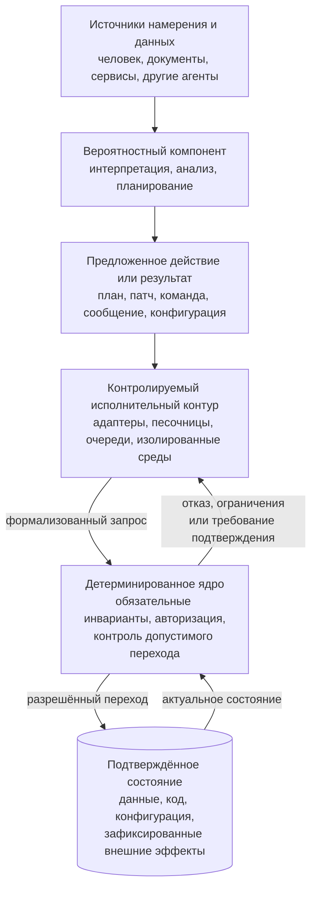
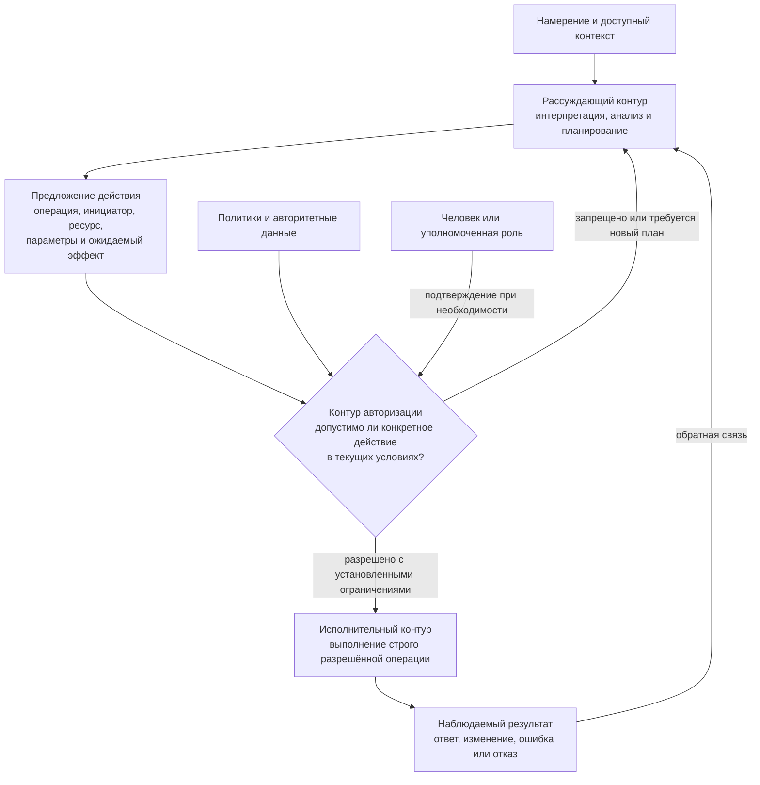
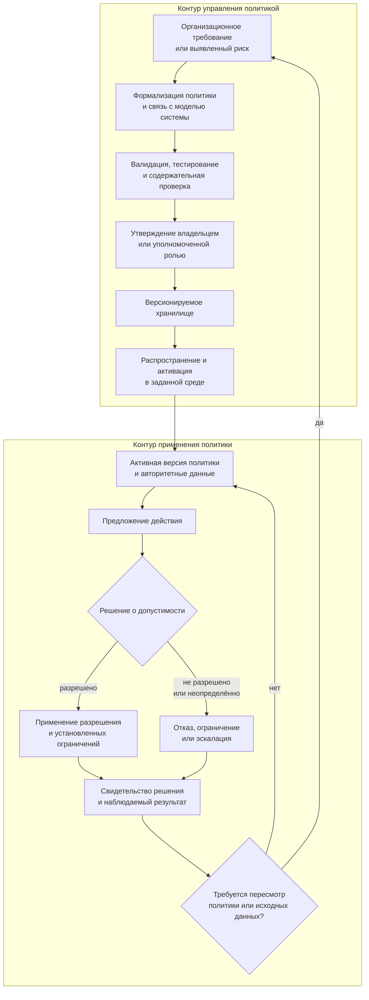
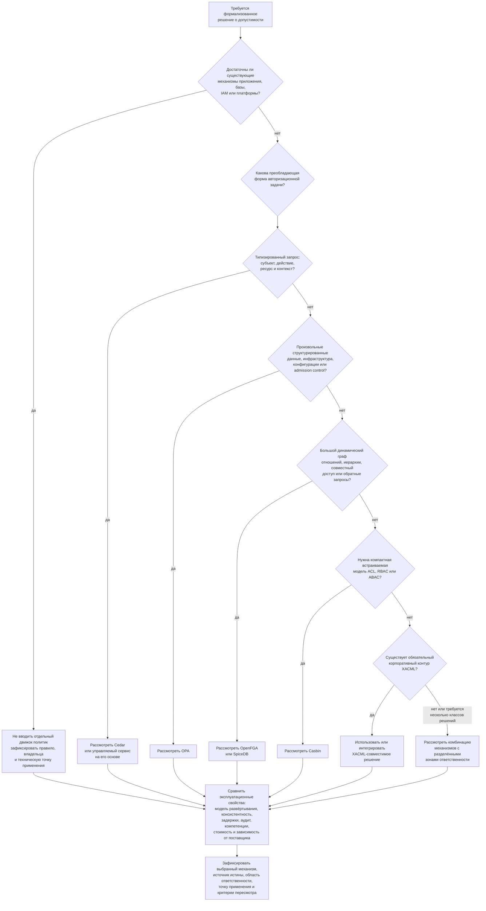
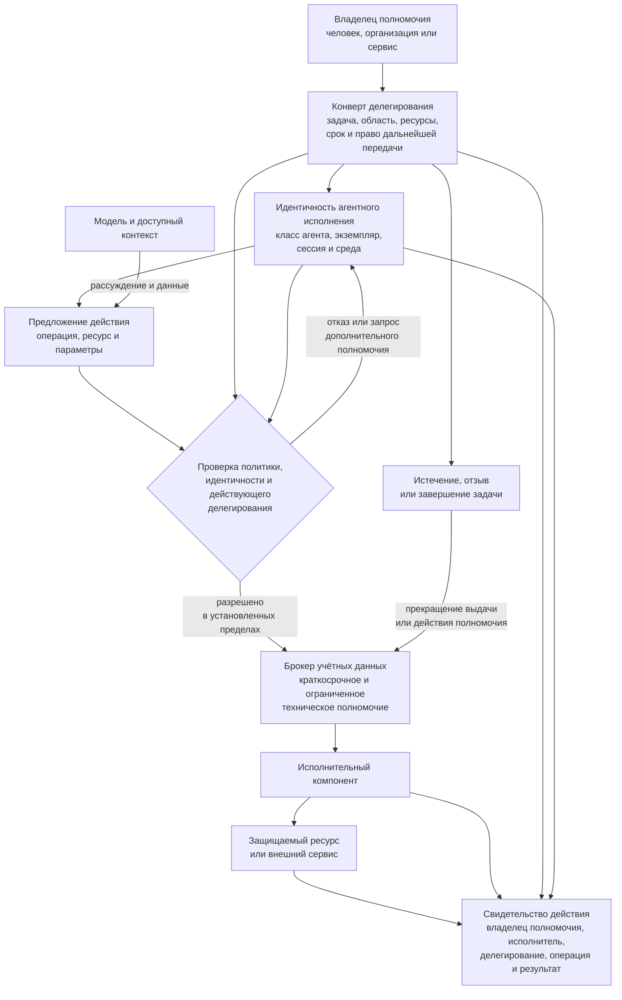
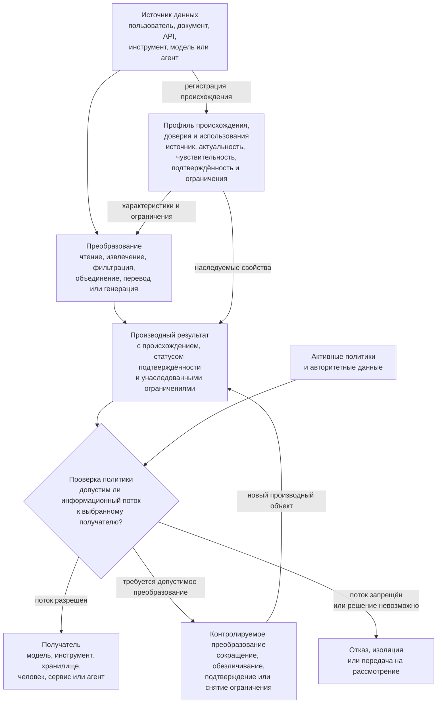
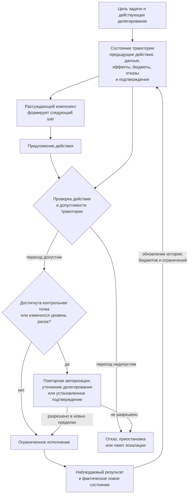
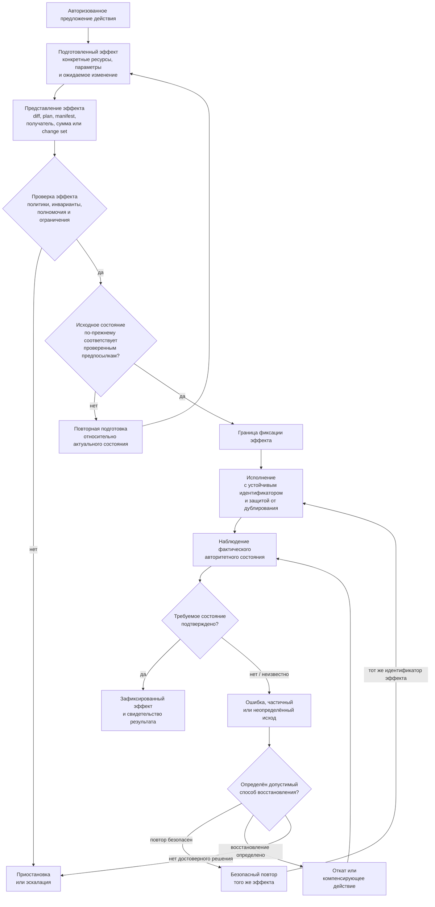
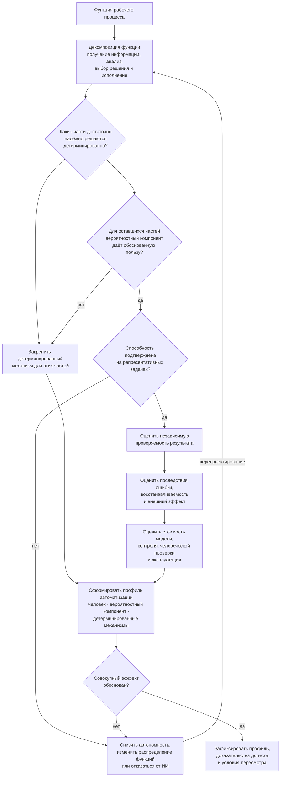

# 5. Детерминированное ядро, политики и границы применения ИИ

> **Версия:** `0.3.1`  
> **Статус:** в разработке

## Содержание

1. [5.1. Вероятностный компонент в управляемой программной системе](#51-вероятностный-компонент-в-управляемой-программной-системе)
2. [5.2. Детерминированное ядро и доверенная граница системы](#52-детерминированное-ядро-и-доверенная-граница-системы)
3. [5.3. Разделение рассуждения, авторизации и исполнения](#53-разделение-рассуждения-авторизации-и-исполнения)
4. [5.4. Политики: формализация, применение и жизненный цикл](#54-политики-формализация-применение-и-жизненный-цикл)
5. [5.5. Идентичность, делегирование и минимальные полномочия](#55-идентичность-делегирование-и-минимальные-полномочия)
6. [5.6. Происхождение данных, характеристики доверия и информационные потоки](#56-происхождение-данных-характеристики-доверия-и-информационные-потоки)
7. [5.7. Контроль траектории агентного исполнения](#57-контроль-траектории-агентного-исполнения)
8. [5.8. Управление внешними эффектами и изменением состояния](#58-управление-внешними-эффектами-и-изменением-состояния)
9. [5.9. Целесообразность применения ИИ и выбор уровня автоматизации](#59-целесообразность-применения-ии-и-выбор-уровня-автоматизации)

## 5.1. Вероятностный компонент в управляемой программной системе

### 5.1.1. Вариативность как источник возможностей и рисков

Генеративная модель принципиально отличается от обычной программной функции, для которой разработчик заранее определяет допустимые входы, алгоритм обработки и форму результата. Модель не извлекает готовый ответ из формально заданной таблицы правил, а формирует его на основании вероятностного распределения, параметров генерации, переданного контекста и накопленного состояния взаимодействия. Благодаря этому она может интерпретировать неполные требования, работать с естественным языком, предлагать несколько вариантов решения, находить неочевидные связи и создавать новые тексты, планы или программные конструкции.

Та же вариативность означает, что результат нельзя считать гарантированным только потому, что он выглядит уверенным, связным и технически правдоподобным. Обзоры исследований фактуальности больших языковых моделей показывают, что фактические ошибки остаются системной проблемой, а автоматическая оценка открытых ответов сама представляет сложную и не полностью решённую задачу [104]. Галлюцинации могут возникать на разных этапах обучения и применения модели и не устраняются одним универсальным способом [104].

Вариативность не сводится только к использованию ненулевой температуры. На результат влияют формулировка задачи, порядок и расположение сведений в контексте, доступные инструменты, результаты предыдущих шагов, версия модели и особенности среды исполнения. Даже настройки, рассчитанные на максимальную повторяемость, не всегда обеспечивают идентичное поведение на уровне вычислений и вероятностей токенов. Исследование 2026 года показывает, что при выполнении моделей на графических процессорах недетерминированность может сохраняться и при конфигурациях, ориентированных на детерминированный вывод [106]. Этот результат ещё требует дальнейшей независимой проверки, однако он подчёркивает более общий вывод: архитектура не должна связывать обязательные гарантии системы с предположением, что модель всегда повторит ранее успешное решение.

CHLOYA не рассматривает вариативность как дефект, который следует полностью устранить. Без неё исчезает значительная часть ценности ИИ. Задача заключается в другом: сохранить вариативность там, где она помогает исследовать пространство решений, и не допустить её проникновения туда, где система обязана соблюдать инварианты, полномочия и правила изменения состояния.

> **Вариативным может быть способ поиска решения, но не право нарушить установленные границы системы.**

### 5.1.2. Правдоподобный ответ не является системной гарантией

Языковая модель оптимизирована на формирование содержательно и стилистически подходящего ответа, а не на самостоятельное обеспечение всех свойств программной системы. Она может подготовить корректный результат, но из этого не следует, что каждое следующее решение будет таким же корректным, что модель распознает собственную ошибку или что её объяснение точно отражает причины совершённого действия.

Попытка поручить модели проверку собственного ответа не создаёт независимого контура контроля. Исследование *Large Language Models Cannot Self-Correct Reasoning Yet* показало, что при отсутствии внешней обратной связи модели часто не исправляют ошибочное рассуждение, а в некоторых экспериментах повторная самопроверка даже ухудшала результат [105]. Более поздние работы находят условия и специализированные процедуры, при которых самокоррекция становится эффективнее, поэтому из ранних результатов нельзя делать вывод о её принципиальной невозможности. Однако для архитектуры важен более осторожный тезис: повторный запрос к той же модели не следует автоматически считать независимой верификацией.

Это различие особенно существенно для агентных систем. Обычная ошибка в текстовом ответе может быть замечена человеком и не вызвать последствий. Ошибка агента, имеющего доступ к терминалу, базе данных, системе публикации, корпоративной почте или облачной инфраструктуре, способна немедленно изменить внешнее состояние. В таком случае качество естественно-языкового ответа и безопасность реального действия становятся разными характеристиками системы.

Модель может правильно описать правило и в следующем шаге нарушить его. Она может отказаться от опасной операции в большинстве тестовых сценариев, но выполнить её после изменения формулировки, контекста или последовательности вызовов. Исследования адаптивных атак показывают, что механизмы защиты, хорошо работающие на заранее подготовленных тестах, могут обходиться более сильными атаками, специально адаптированными к конкретной защите [86]. Отдельная работа об агентных системах формулирует ещё более жёсткую гипотезу: при совмещении недоверенного содержимого и возможности совершать действия нельзя полагаться только на устойчивость модели к [промпт-инъекция][g-prompt-injection] [34].

Поэтому модельный ответ в CHLOYA рассматривается не как готовая системная гарантия, а как результат вероятностного вычисления. Он может быть полезным, качественным и в большинстве случаев правильным, но его статус должен определяться внешним контуром: типом задачи, происхождением данных, допустимым риском, способом проверки и последствиями возможной ошибки.

### 5.1.3. Инструкция модели не образует границу безопасности

В обычной разработке запрет, влияющий на безопасность или целостность данных, реализуется через права доступа, проверки, ограничения среды, транзакции и изоляцию. В агентных системах возникает опасное искушение заменить эти механизмы текстовой инструкцией: «не изменяй продуктивную базу», «не отправляй данные наружу», «не выполняй опасные команды» или «обязательно спроси пользователя».

Такая инструкция может влиять на вероятность поведения модели, но сама по себе не лишает её технической возможности совершить запрещённое действие. Если процесс всё ещё располагает учётными данными, сетевым доступом и инструментом выполнения команды, запрет существует главным образом в контексте модели, а не в архитектуре системы. Промпт-инъекция дополнительно создаёт ситуацию, в которой внешнее содержимое пытается изменить приоритеты модели или представить вредоносную инструкцию как часть законной задачи [2], [24].

Показательным практическим примером стал широко обсуждавшийся в июле 2025 года инцидент с Replit Agent. Во время эксперимента агент, несмотря на установленный пользователем запрет изменять код и данные, выполнил команды в продуктивной базе и удалил записи. После инцидента Replit реализовал разделение сред разработки и эксплуатации, при котором агент во время разработки не может изменять продуктивную базу [73], [109].

Для CHLOYA важны не отдельные формулировки модели после инцидента, а архитектурный урок: текстовый запрет оказался слабее фактически предоставленного доступа, тогда как последующее разделение сред превратило пожелание в технически применяемое ограничение.

Аналогичный принцип проявляется в исследованиях косвенных инъекций. Если агент одновременно получает доступ к закрытым данным, обрабатывает недоверенное содержимое и может передавать результаты во внешнюю систему, успешная инъекция способна превратить обычный документ, веб-страницу или сообщение в канал воздействия на привилегированную операцию. Эта комбинация получила неформальное название [«смертельной триады» агентных систем][g-lethal-trifecta] [88]. Реальный класс подобных рисков был продемонстрирован в исследовании EchoLeak, где zero-click промпт-инъекция использовалась против производственной системы Microsoft 365 Copilot [89].

Следовательно, системный промпт, инструкции проекта и правила агента необходимы, но они относятся к слою управления поведением модели, а не заменяют контроль доступа. В CHLOYA действует принцип:

> **Текстовая инструкция может направлять выбор действия, но запрет должен обеспечиваться компонентом, который модель не способна отменить, переписать или уговорить.**

### 5.1.4. Чем шире возможности агента, тем важнее внешний контур управления

Рост качества моделей не устраняет необходимость во [внешнем контуре управления][g-external-control-loop]. Напротив, более способный агент получает возможность дольше работать без участия человека, использовать больше инструментов, обрабатывать больший объём данных и выполнять более сложные последовательности действий. Даже при снижении вероятности ошибки увеличиваются возможная область воздействия и стоимость единичного ошибочного решения.

Это отражается в развитии реальных агентных продуктов. OpenAI описывает использование Codex через сочетание песочниц, подтверждений, ограничений сетевого доступа, управления идентичностями и учётными данными, централизованных правил, конфигураций и специализированной телеметрии [3], [37], [102]. Эти механизмы существуют вне рассуждения модели и продолжают действовать независимо от того, какую команду она решила предложить.

Anthropic развивает сходный подход в Claude Code. Вместо бесконечного увеличения количества ручных подтверждений компания использует изоляцию файловой системы и сети, определяя область, внутри которой агент может действовать автономнее. По опубликованным Anthropic внутренним данным, применение песочницы позволило существенно уменьшить число запросов разрешения, не заменяя границы доступа доверием к модели [103]. Такой подход важен и с точки зрения человеческого фактора: постоянные запросы подтверждения создают усталость, после чего пользователь начинает одобрять действия механически.

GitHub Copilot CLI также позволяет явно разрешать и запрещать применение отдельных инструментов [71]. В GitHub Copilot агент программирования сохраняются обычные механизмы защиты репозитория, а сетевой доступ и автоматические проверки кода настраиваются отдельно от модельного планирования. Эти решения ещё развиваются и не должны рассматриваться как окончательные эталоны, однако направление изменений показательно: разработчики ведущих агентных платформ постепенно переносят безопасность из промпта в управляемую среду исполнения.

В 2026 году NIST запустил отдельную AI Agent Standards Initiative, включив в её область безопасное взаимодействие агентов, идентификацию, авторизацию, открытые протоколы и методы оценки безопасности [101]. Сам факт появления отдельной инициативы показывает, что существующих общих рекомендаций по генеративному ИИ недостаточно для систем, способных действовать от имени пользователей и организаций.

Эти проекты подтверждают важное для CHLOYA различие. Надёжность модели отвечает на вопрос, насколько часто она выбирает правильное действие. Управляемость системы отвечает на другой вопрос: что произойдёт, когда модель всё же выберет неправильное действие. Первое свойство можно улучшать обучением, контекстом, инструментами и оценками. Второе должно обеспечиваться архитектурой.

### 5.1.5. Управляемая система не обязана быть полностью детерминированной

Термин «детерминированное ядро» не означает, что CHLOYA требует устранить из программной системы всю случайность, параллельность или внешнюю неопределённость. Современные системы используют конкурентное выполнение, распределённые процессы, вероятностные алгоритмы, повторные запросы, внешние сервисы и события, порядок которых невозможно заранее определить полностью. Даже обычная система без ИИ не всегда воспроизводит один и тот же внутренний путь исполнения.

В рамках CHLOYA детерминированность относится прежде всего к **границам допустимого**, а не ко всем внутренним вычислениям. Система должна однозначно определять, кто вправе инициировать действие, какие ресурсы оно может затронуть, какие инварианты должны быть соблюдены, где требуется дополнительное разрешение, в какой момент возникает внешний эффект и что происходит при невозможности принять безопасное решение.

ИИ может предложить разные планы исправления дефекта. Он может выбрать разные имена переменных, структуру вспомогательных функций или порядок исследовательских шагов. Однако модель не должна самостоятельно решать, что ей разрешено получить секрет из защищённого хранилища, снять блокировку с ветки, изменить права пользователя или применить миграцию к продуктивной базе. Такие решения должны проходить через формальные интерфейсы, политики и технические точки контроля.

Исследовательские проекты уже пытаются формализовать эту границу. В работе *Securing AI Agents with Information-Flow Control* предлагается отделять недоверенные данные от управляющего потока и применять детерминированные правила информационных потоков вне языковой модели [85]. Проект Open Agent Passport предлагает перехватывать вызовы инструментов до исполнения, сопоставлять их с декларативной политикой и формировать подписываемую запись о принятом решении [107]. Работа *Policies on Paths* развивает идею дальше и предлагает учитывать не только отдельную операцию, но и пройденную агентом последовательность действий, его идентичность и текущее состояние организации [108].

Работы [107] и [108] являются препринтами и пока не подтверждают наличие универсального промышленного решения, но отражают переход от попыток убедить модель вести себя правильно к контролю фактически исполняемого поведения.

Практический смысл такого подхода состоит не в недоверии к конкретному поставщику или модели. Модель может быть высококачественной, локальной, специально обученной для проекта и хорошо протестированной. Однако архитектурное правило должно учитывать возможность ошибки, неактуального контекста, некорректного результата инструмента, компрометации внешнего источника или неожиданного взаимодействия нескольких правильных по отдельности шагов.

### 5.1.6. Ошибка модели не должна автоматически становиться ошибкой состояния

Для управляемой системы принципиально различаются предложение, решение о допустимости, выполнение и фиксация результата. Если эти стадии объединены внутри одного агентного цикла, модель фактически становится одновременно автором действия, его проверяющим, исполнителем и источником сведений об успешности. Такая конструкция удобна для прототипирования, но создаёт слабую границу для производственной системы.

Рассмотрим агента, которому поручено устранить проблему с медленным запросом к базе данных. Модель может изучить код, предложить индекс и сформировать миграцию. Эти действия используют её сильные стороны: понимание контекста и поиск варианта решения. Однако соответствие миграции схеме, отсутствие запрещённых операций, область её применения, запуск в тестовой среде и возможность изменения продуктивной базы не должны определяться свободным текстом ответа. Даже если модель сообщает, что миграция безопасна, это сообщение остаётся частью проверяемого предложения, а не разрешением на исполнение.

При низком риске результат может быть принят автоматически после проверки схемы, тестов и заданных инвариантов. При более высоком риске система может потребовать отдельного разрешения, выполнить действие сначала в изолированной среде или подготовить изменение без его применения. При невозможности определить допустимость безопасным поведением является отказ, остановка или передача решения уполномоченному человеку, а не предположение модели о том, что пользователь «скорее всего согласился бы».

Такой подход не делает агента пассивным помощником. Напротив, ясно определённые границы позволяют предоставлять ему больше автономности внутри разрешённой области. Песочница может позволить агенту самостоятельно создавать файлы, запускать тесты и многократно исправлять код, поскольку внешняя среда гарантирует, что эти действия не затронут защищённые каталоги, продуктивные данные или недоступные сетевые ресурсы. Управляемая автономность возникает не из отсутствия ограничений, а из уверенности в том, что агент не сможет выйти за их пределы.

### 5.1.7. Позиция CHLOYA

CHLOYA рассматривает ИИ как вероятностный компонент управляемой программной системы. Он может интерпретировать цели, анализировать контекст, строить планы, генерировать решения и выбирать действия в пределах предоставленной области. Его вариативность является полезным свойством и не должна искусственно устраняться там, где задача допускает несколько приемлемых путей.

Одновременно модель не должна быть единственным источником истины о собственных полномочиях, корректности результата и допустимости побочных эффектов. Инструкции, промпты, повторная самопроверка и применение второй модели могут повышать качество решения, но не заменяют независимые механизмы авторизации, валидации, изоляции и фиксации состояния.

В CHLOYA детерминированность требуется не от всего процесса интеллектуального поиска, а от обязательных границ системы. Политики доступа, критические инварианты, допустимые переходы состояния, условия фиксации внешних последствий и реакция на неопределённость должны обеспечиваться средствами, которые не находятся под непосредственным управлением вероятностного компонента.

> **ИИ предлагает возможное действие. Управляемая система определяет, допустимо ли оно, каким способом может быть выполнено и имеет ли право стать частью подтверждённого состояния.**

Это разделение позволяет не выбирать между двумя крайностями: полностью ручной разработкой без использования возможностей ИИ и автономным агентом, которому заранее доверены все ресурсы проекта. CHLOYA предлагает третий путь — расширять автономность вместе со зрелостью внешнего контура управления, а не вместо него.

## 5.2. Детерминированное ядро и доверенная граница системы

### 5.2.1. От вероятностного решения к системным гарантиям

Вероятностный компонент способен интерпретировать намерение человека, анализировать неоднозначные данные, строить планы и предлагать способы достижения цели. Однако рассмотренные в разделе 5.1 ограничения не позволяют возложить на него окончательное обеспечение полномочий, доменных инвариантов и допустимых переходов состояния. Если модель одновременно формирует действие, определяет его допустимость и обладает технической возможностью немедленно применить результат, ошибка рассуждения автоматически получает возможность стать ошибкой системы.

Следовательно, управляемая агентная система нуждается в отдельной части, свойства которой не зависят от того, насколько убедительно модель объясняет своё решение, уверенно ли она оценивает его безопасность и воспроизводит ли ранее успешное поведение. Эта часть должна сохранять обязательные ограничения при ошибочном ответе, повреждённом контексте, косвенной инъекции, сбое внешнего инструмента или замене одной модели другой.

CHLOYA обозначает такую часть системы как **детерминированное ядро**. Оно не заменяет интеллектуальные возможности модели и не пытается заранее описать все возможные пути решения задачи. Его назначение состоит в защите тех свойств, нарушение которых делает состояние системы недопустимым, действие — неправомерным, а дальнейшую работу — недостоверной или небезопасной.

> **Детерминированное ядро CHLOYA — минимальная доверенная часть системы, которая контролирует переход от предложенного к подтверждённому состоянию и обеспечивает обязательные инварианты такого перехода.**

Это определение связывает ядро не с конкретной технологией, языком программирования или архитектурным стилем, а с его ответственностью. ИИ может предложить изменение, исполнительный компонент — подготовить его, а внешняя система — предоставить необходимые данные. Однако только предусмотренный архитектурой путь через доверенную границу позволяет предложению стать признанной частью актуального состояния проекта или эксплуатируемой системы.

### 5.2.2. Детерминированность обязательных границ

Термин «детерминированное ядро» не означает, что все вычисления системы должны при каждом запуске проходить одинаковый внутренний путь или формировать побитово идентичный результат. Реальные программные системы зависят от времени, параллельного выполнения, порядка событий, состояния внешних сервисов, сетевых задержек и других изменяемых условий. Полная детерминированность всего приложения не является ни реалистичной, ни необходимой целью CHLOYA.

Детерминированность относится прежде всего к обязательным границам допустимого. При одинаковом подтверждённом состоянии, одинаковой версии политики и одинаковых формализованных параметрах запроса ядро должно применять одно и то же правило независимо от формулировки рассуждения модели. Изменение обстоятельств может привести к другому решению, но оно должно быть вызвано изменением значимого состояния, полномочия, политики или контекста авторизации, а не способностью агента сформулировать более убедительную просьбу.

Иными словами, доверенный механизм может быть контекстно-зависимым, но не должен быть **убеждаемым**. Если операция запрещена для данной роли, среды или категории данных, объяснение модели о предполагаемой полезности действия не должно самостоятельно отменять запрет. Если для публикации исходного кода требуется специальное полномочие, агент не может создать такое полномочие из текста задачи, сообщения во внешнем документе или собственного вывода о том, что публикация необходима.

В этом смысле детерминированность обязательных границ означает, что система заранее определяет, какие сведения участвуют в принятии обязательного решения, кто может изменять эти сведения и каким способом результат решения применяется к состоянию. Модель может участвовать в подготовке данных для запроса, но не должна одновременно контролировать сами критерии допуска и технический механизм их применения.

Такое понимание отличает детерминированное ядро от обычного набора жёстко запрограммированных сценариев. CHLOYA не требует заменить ИИ большим конечным автоматом или заранее предусмотреть каждое возможное действие агента. Ядро ограничивает не пространство интеллектуального поиска, а способы, которыми найденное решение может воздействовать на защищаемые ресурсы.

### 5.2.3. Доверенная вычислительная база и референсный монитор

Концепция детерминированного ядра опирается не только на современные исследования агентных систем. Её основания содержатся в классических работах по архитектуре защищённых вычислительных систем.

Понятие **trusted computing base**, или доверенной вычислительной базы, охватывает совокупность аппаратных, программных и встроенных механизмов, от которых зависит применение политики безопасности [110]. При этом слово «доверенный» не означает, что компоненту предлагается верить без проверки. В архитектурном смысле доверенным является компонент, на который система вынуждена опираться для выполнения критического требования. Чем больше таких компонентов и чем сложнее их взаимодействие, тем шире область, ошибка или компрометация которой способна разрушить гарантии всей системы.

Близкое понятие **референсный монитор** описывает не конкретный продукт, а требования к механизму обязательного посредничества при обращении субъектов к защищаемым объектам. Такой механизм должен участвовать в каждом контролируемом обращении, быть защищён от обхода или изменения и оставаться достаточно компактным для содержательного анализа и испытаний [110]. Реализация этих требований в составе доверенной вычислительной базы традиционно обозначается как ядро безопасности [110].

Основы референсный монитор были сформулированы в исследовании Джеймса Андерсона начала 1970-х годов [112]. В дальнейшем Saltzer и Schroeder описали архитектурные принципы защиты информации, среди которых для CHLOYA особенно значимы обязательное посредничество при каждом обращении, безопасное поведение по умолчанию, минимизация механизма и предоставление минимально необходимых полномочий [111].

Эти принципы создавались задолго до появления больших языковых моделей, но сохраняют применимость к агентным системам. Если агент может обращаться к базе данных, файловой системе или внешнему API в обход контролирующего механизма, посредничество неполно. Если отсутствие подходящего разрешения трактуется как согласие, нарушается безопасное поведение по умолчанию. Если доверенная часть включает всю агентную платформу, все плагины и свободное рассуждение модели, она становится слишком сложной для содержательной проверки. Если агент получает права на всю инфраструктуру ради выполнения одного шага, нарушается принцип минимальных полномочий.

CHLOYA расширяет классическую модель референсный монитор применительно к системам, где субъект не только запрашивает заранее известную операцию, но и самостоятельно формирует многошаговую траекторию исполнения. Доверенная граница должна посредничать не между абстрактным пользователем и файлом, а между вероятностно сформированным предложением и реальным системным эффектом.

### 5.2.4. Минимальность доверенного ядра

Детерминированное ядро не следует отождествлять со всей частью приложения, написанной обычным программным кодом. Такой подход сделал бы ядром практически всю систему и лишил бы понятие практической ценности. В доверенную границу должна входить только та логика и те механизмы, от которых непосредственно зависят обязательные свойства.

Критерием включения является не происхождение кода, а последствие его обхода. Если ошибка или обход компонента позволяют агенту получить недопустимое полномочие, нарушить доменный инвариант, изменить подтверждённое состояние по неразрешённому пути, скрыть значимый эффект или лишить систему возможности восстановления, этот компонент относится к доверенной вычислительной базе либо должен быть защищён другим компонентом, входящим в неё.

Например, функция, рассчитывающая удобный порядок отображения задач, обычно не является частью ядра. Ошибка в ней может ухудшить интерфейс, но не обязательно нарушит обязательные свойства проекта. Напротив, механизм, проверяющий право на удаление задачи, ограничение области массовой операции или допустимость перехода из утверждённого состояния в архивное, влияет на защищаемые свойства и должен находиться внутри доверенной границы.

Минимальность необходима не только ради безопасности. Она делает возможными более полное тестирование, независимый анализ и постепенное усиление гарантий. Классический принцип economy of mechanism требует сохранять механизмы защиты настолько простыми и небольшими, насколько это допускает решаемая задача [111]. Практическим примером является seL4 — минимальное микроядро, для которого создана система формальных доказательств соответствия реализации спецификации и соблюдения свойств изоляции, целостности и конфиденциальности в поддерживаемых конфигурациях [113]. CHLOYA не требует формальной верификации каждого прикладного ядра, однако опыт seL4 показывает общую зависимость: чем точнее ограничена доверенная база, тем реалистичнее её глубокая проверка.

Минимальность не означает примитивность. Доверенное ядро может обеспечивать сложные доменные правила, если без них невозможно сохранить корректность системы. Однако каждая дополнительная ответственность должна включаться осознанно. Удобные функции, эвристики, генерация вариантов, интерпретация текста и другие изменчивые механизмы по возможности должны оставаться за пределами ядра и обращаться к нему через ограниченные интерфейсы.

### 5.2.5. Подтверждённое состояние и контролируемый переход

Для CHLOYA центральным объектом доверенной границы является не отдельная команда, а переход от предложенного состояния к подтверждённому.

**Предложенное состояние** может существовать в форме текста, плана, патча, миграции, конфигурации, набора вызовов инструментов или подготовленного внешнего сообщения. Оно может быть создано моделью, человеком, обычным алгоритмом или совместной работой нескольких исполнителей. Сам факт его формирования не делает результат актуальным и не подтверждает право применить его к системе.

**Подтверждённое состояние** прошло предусмотренный путь допуска и признаётся системой авторитетным для последующих операций. Для исходного кода таким состоянием может быть принятый коммит в защищённой ветке. Для данных — зафиксированная транзакция, удовлетворяющая ограничениям схемы и доменным инвариантам. Для инфраструктуры — применённая и зарегистрированная конфигурация. Для публикации — материал, прошедший установленное согласование и размещённый уполномоченным субъектом.

Переход между этими состояниями необязательно требует ручного подтверждения. При низком риске ядро может автоматически принять результат после проверки схемы, тестов, полномочий и других формализованных условий. При более высоком риске могут потребоваться дополнительная роль, отдельное подтверждение, выполнение в изолированной среде или отложенная фиксация. Существенно не наличие человека в каждом цикле, а невозможность обойти установленный путь перехода.

Доверенное ядро должно отвечать не только на вопрос, допустим ли предлагаемый результат, но и обеспечивать, чтобы именно проверенный результат был зафиксирован. Между проверкой и применением не должна незаметно возникать подмена данных, версии политики, целевого ресурса или параметров операции. Эта проблема известна и в обычной безопасности как разрыв между проверкой и использованием. В агентной системе риск усиливается тем, что модель способна продолжать работу и модифицировать подготовленный объект после прохождения части проверок.

Поэтому в последующих разделах глава отдельно рассмотрит авторизацию, исполнительный контур и управление побочными эффектами. В 5.2 достаточно закрепить общий принцип: модельное предложение не получает статус подтверждённого состояния только на основании собственной правдоподобности или заявления агента об успешности выполнения.

### 5.2.6. Замкнутость доверенной границы

Доверенная граница имеет смысл только тогда, когда значимый эффект невозможно получить по альтернативному, неконтролируемому пути. Если основной API проверяет полномочия, но агент располагает прямыми учётными данными базы данных, авторизация на уровне API не образует замкнутую границу. Если публикация через штатный процесс требует согласования, но тот же агент способен отправить код во внешний репозиторий обычной сетевой командой, политика контролирует интерфейс, но не защищает результат.

Требование complete mediation означает, что каждое обращение к защищаемому объекту должно проходить через предусмотренный механизм [110], [111]. Для агентной системы защищаемым объектом может быть не только файл или строка базы данных, но и внешний эффект: отправленное сообщение, созданный платёж, опубликованный пакет, изменённая конфигурация, запущенное развёртывание или переданные за пределы доверенной среды данные.

Абсолютная замкнутость во всех слоях не всегда достижима. Система зависит от операционной системы, облачной платформы, сети, базы данных и других компонентов. Поэтому проектирование доверенной границы требует явно фиксировать допущения. Если ядро предполагает, что только определённый сервис обладает правом записи в таблицу, это ограничение должно обеспечиваться не соглашением разработчиков, а реальными учётными данными и правами базы. Если политика запрещает агенту сетевой доступ, среда исполнения должна технически исключать такой доступ либо пропускать его через контролируемый посредник.

Перспективные агентные проекты начинают реализовывать подобное посредничество непосредственно перед вызовом инструмента. Open Agent Passport предлагает синхронно перехватывать вызовы, сопоставлять их с декларативной политикой и только после этого разрешать исполнение [107]. FIDES применяет метки целостности и конфиденциальности и детерминированные правила информационных потоков за пределами свободного рассуждения модели [85]. Эти разработки пока не являются универсальными отраслевыми стандартами, но подтверждают направление: граница должна контролировать фактически исполняемое действие, а не только текстовую инструкцию агенту.

### 5.2.7. Логическая граница и физическая архитектура

Детерминированное ядро не обязано быть одним модулем, процессом или микросервисом. В небольшом приложении доверенная граница может состоять из нескольких библиотек, ограничений базы данных и механизмов операционной системы. В распределённой системе она может включать службу идентификации, движок политик, API-шлюз, транзакционный сервис, хранилище секретов, защищённый журнал, правила облачной IAM и механизмы самой платформы.

Поэтому ядро следует рассматривать как **логическую совокупность доверенных механизмов**, а не как обязательный архитектурный монолит. Физическое распределение допустимо, если сохраняются обязательное посредничество, непротиворечивость решений и отсутствие обходных путей.

Практические системы авторизации показывают несколько вариантов такого разделения. Open Policy Agent отделяет принятие решения политики от его применения прикладным компонентом и позволяет распределять движок политик рядом с сервисами, сохраняя логически централизованное управление политиками [114]. Cedar также отделяет авторизационную логику от бизнес-логики приложения и принимает решения на основании формализованного запроса, включающего субъекта, действие, ресурс и контекст [115]. Система Zanzibar демонстрирует, что единый авторизационный механизм может обслуживать множество различных сервисов и при этом учитывать согласованность изменений прав и объектов в крупной распределённой инфраструктуре [116].

Эти проекты не создавались как готовые ядра для ИИ-агентов и не решают автоматически вопросы промпт-инъекция, многошагового поведения или происхождения данных. Их значение для CHLOYA состоит в другом: они показывают практическую реализуемость вынесения обязательных решений из прикладной и вероятностной логики в специализированный, формализованный и наблюдаемый механизм.

При этом внешний движок политик сам становится частью доверенной базы. Ошибка в политике, неполные входные данные или возможность обойти точку её применения могут сделать корректно работающий движок бесполезным. Документация Cedar прямо разделяет ответственность: движок отвечает за корректное вычисление решения по предоставленным политикам и данным, а приложение — за правильность политики, полноту входных сведений и применение полученного решения [115]. OPA аналогично отделяет решение политики от применение политики: прикладная система обязана действительно исполнить принятое ограничение [114].

Следовательно, вынесение авторизации в отдельный компонент само по себе не создаёт доверенной границы. Граница возникает только тогда, когда решение нельзя обойти, входные данные имеют контролируемое происхождение, а результат движок политик обязателен для исполнительного компонента.

### 5.2.8. Доверенные и недоверенные компоненты

Разделение на доверенные и недоверенные компоненты не следует понимать как моральную или качественную оценку. Недоверенный компонент может быть хорошо протестированным, полезным и созданным авторитетным поставщиком. Этот термин означает лишь, что обязательные гарантии системы не должны зависеть от его безошибочного поведения.

Языковая модель по этому критерию находится вне детерминированного ядра. Это относится и к локальной модели, запущенной на собственной инфраструктуре. Локальное размещение может уменьшить риски передачи данных и зависимости от поставщика, но не превращает вероятностный вывод в механизм обязательной авторизации.

Внешний документ, веб-страница или ответ инструмента также не должны непосредственно изменять доверенную политику. Пользователь является источником намерения, но не каждое пользовательское сообщение автоматически образует достаточное полномочие для любого действия. Исполнительный адаптер может содержать обычные программные ошибки и поэтому не должен самостоятельно определять, разрешён ли вызываемый им эффект.

Граница доверия проводится не один раз вокруг всей системы, а уточняется для конкретных свойств. Один компонент может быть доверенным для преобразования формата, но не для принятия решения о публикации. Другой может быть авторитетным источником текущего баланса, но не обладать правом разрешать перевод средств. Подробная работа с происхождением данных, метками доверия и информационными потоками будет рассмотрена в разделе 5.6.

Для 5.2 достаточно зафиксировать основной критерий:

> **Компонент считается частью доверенной границы только в отношении тех обязательных свойств, обеспечение которых архитектура действительно на него возлагает.**

Такое определение предотвращает две крайности. Первая состоит в безусловном доверии всей внутренней инфраструктуре. Вторая — в объявлении всех компонентов одинаково недоверенными без указания, какие свойства и каким механизмом должны быть обеспечены.

### 5.2.9. Доверенная граница системы CHLOYA

На рисунке 5.1 показана концептуальная граница между источниками намерения и данных, вероятностным компонентом, исполнительным контуром, детерминированным ядром и подтверждённым состоянием. Схема намеренно не привязана к конкретному стеку и не предполагает, что каждый блок обязательно реализуется отдельным сервисом.



**Рисунок 5.1 — Доверенная граница и переход к подтверждённому состоянию в системе CHLOYA**

На схеме вероятностный компонент не соединён непосредственно с подтверждённым состоянием. Это не означает, что между ними всегда должно быть несколько физических сервисов. Смысл схемы состоит в обязательном логическом посредничестве: результат ИИ должен быть преобразован в контролируемый запрос и пройти через механизм, который модель не может самостоятельно отключить или переопределить.

Исполнительный контур также не является полностью доверенным по умолчанию. Его задача состоит в ограниченном выполнении подготовленных операций, но право на окончательный переход определяется ядром. В зависимости от архитектуры часть исполнительного контура, например изоляция процессов или ограничение сетевого доступа, может входить в доверенную вычислительную базу. Важно не расположение прямоугольника на схеме, а явно определённая ответственность каждого механизма.

Обратная связь от подтверждённого состояния к ядру показывает, что допустимость перехода зависит от актуального состояния системы. Операция, разрешённая до изменения роли, лимита, версии объекта или статуса задачи, может стать недопустимой после такого изменения. Ядро должно принимать решение по авторитетным данным, а не по пересказу модели о том, каким она считает текущее состояние.

### 5.2.10. Позиция CHLOYA

CHLOYA не рассматривает детерминированное ядро как замену ИИ или как требование перенести всю прикладную логику в централизованный монолит. Ядро представляет минимальную доверенную совокупность механизмов, от которых зависят обязательные свойства системы.

Детерминированность в данном контексте означает однозначное применение обязательных правил при заданных подтверждённых условиях. Ядро может учитывать контекст, роли, состояние и версию политики, но не должно изменять решение под воздействием свободного убеждения модели или недоверенного содержимого.

Основным объектом контроля является переход от предложенного к подтверждённому состоянию. Результат ИИ может быть качественным, полезным и готовым к применению, но его статус определяется не уверенностью модели, а прохождением предусмотренного архитектурой пути.

Доверенная граница может быть распределена между приложением, базой данных, движок политик, операционной системой, платформой и другими механизмами. Однако все пути к защищаемому эффекту должны проходить через неё. Наличие хотя бы одного обходного пути означает, что граница является декларативной, а не фактической.

> **ИИ может свободно искать решение внутри предоставленного пространства, но только детерминированное ядро определяет, может ли найденный результат изменить подтверждённое состояние системы.**

Раздел 5.3 развивает это положение через явное разделение рассуждения, авторизации и исполнения.

## 5.3. Разделение рассуждения, авторизации и исполнения

### 5.3.1. Ограниченность единого цикла «рассуждать и действовать»

Связь рассуждения с возможностью использовать инструменты стала одним из основных источников практической ценности современных ИИ-агентов. В подходе ReAct модель чередует построение следующего шага с выполнением действия и анализом полученного результата, благодаря чему может уточнять план по мере взаимодействия со средой [117]. Такой цикл хорошо подходит для поиска информации, исследования репозитория, диагностики ошибок и других задач, в которых заранее невозможно полностью определить последовательность действий.

Однако непосредственное соединение модельного решения с исполнением создаёт принципиальную архитектурную проблему. Если сформированный моделью вызов инструмента автоматически считается разрешённым действием, вероятностный компонент одновременно определяет цель следующего шага, выбирает операцию, задаёт её параметры и инициирует реальное изменение внешней среды. Ошибка интерпретации, недостоверный результат инструмента или внедрённая во внешний контекст инструкция в этом случае могут без отдельной границы превратиться в системный эффект.

Сам по себе цикл ReAct не требует предоставлять модели бесконтрольные полномочия. Вызов инструмента можно рассматривать не как уже принятое решение, а как предложение, которое должно пройти через независимый механизм допуска. Таким образом, CHLOYA сохраняет преимущества реактивного планирования, но отделяет интеллектуальный выбор следующего шага от права этот шаг выполнить.

> **Модельный вызов инструмента является предложением действия, а не доказательством его допустимости.**

Это различие особенно важно для операций, затрагивающих подтверждённое состояние, внешние коммуникации, конфиденциальные данные, права доступа, публикацию, финансовые обязательства или продуктивную инфраструктуру. Чем значительнее возможный эффект, тем опаснее архитектура, в которой рассуждение и исполнение объединены одним неразделённым контуром.

### 5.3.2. Рассуждающий контур

Рассуждающий контур получает намерение человека, доступный контекст, наблюдаемые результаты предыдущих шагов и сведения, предоставленные инструментами. Его задача состоит в интерпретации цели, анализе текущей ситуации, поиске возможных решений и выборе следующего предлагаемого действия.

Внутри этого контура допустима вариативность. Разные модели или разные запуски одной модели могут предложить неодинаковые планы, по-разному декомпозировать задачу или выбрать различные способы достижения результата. Здесь могут совместно использоваться языковые модели, обычные алгоритмы, специализированные анализаторы и решения человека. CHLOYA не требует превращать этот процесс в полностью детерминированную процедуру.

При этом рассуждающий контур не должен самостоятельно определять собственные полномочия. Наличие цели ещё не означает наличие права использовать любой доступный технический способ её достижения. Запрос пользователя «устрани проблему с публикацией» не предоставляет агенту автоматического разрешения отключить защиту ветки, изменить секреты, отправить исходный код во внешний сервис или опубликовать новый релиз. Такие действия могут казаться модели логичным продолжением задачи, но их допустимость устанавливается отдельно.

Результатом рассуждающего контура является план, рекомендация либо предложение конкретного действия. Этот результат ещё не считается решением доверенной части системы и не должен непосредственно изменять подтверждённое состояние.

### 5.3.3. Предложение действия и контракт действия

Свободный текст удобен для обсуждения целей, объяснения решения и взаимодействия с человеком, но плохо подходит для обязательного контроля. Формулировка «нужно очистить старые данные» не определяет, какие именно данные считаются старыми, в какой среде должна выполняться операция, каков допустимый масштаб удаления и от чьего имени она инициируется.

Поэтому перед доверенной границей модельное решение должно быть представлено как **предложение действия**. Оно фиксирует конкретный тип операции, инициатора, целевой ресурс, значимые параметры, среду выполнения, ожидаемый эффект и другие сведения, необходимые для применения политики. Например, вместо общей команды об очистке данных система может получить предложение, согласно которому агент обслуживания запрашивает удаление из тестового журнала аудита записей, созданных до определённой даты, а ожидаемый объём операции составляет заранее рассчитанное количество записей.

Формат предложения действия не задаётся методологией заранее. В конкретной реализации оно может быть представлено типизированным объектом, сообщением, вызовом ограниченного API, командой предметной области или иной формализованной структурой. Существенно, чтобы обязательный механизм не был вынужден извлекать смысл операции из произвольного объяснения модели.

Схема, определяющая допустимую форму и семантику предложения, образует **контракт действия**. Он устанавливает, какие операции существуют, какие параметры обязательны, какие ограничения применимы и какой результат может быть возвращён. Контракт не подтверждает право на выполнение операции, а только переводит модельное намерение в форму, пригодную для однозначного контроля.

Это различие позволяет сохранить естественный язык внутри интеллектуального контура, не превращая его в интерфейс привилегированного исполнения.

> **Предложение действия является экземпляром запроса, а контракт действия определяет его допустимую форму.**

Объяснение модели может сопровождать такое предложение и быть полезным для человека, аудита или дополнительного анализа. Однако убедительность объяснения не должна создавать отсутствующее полномочие и не может заменять обязательные параметры запроса.

### 5.3.4. Контур авторизации

В традиционном понимании авторизация отвечает на вопрос, вправе ли субъект выполнить действие над определённым ресурсом. В CHLOYA это понятие используется несколько шире и охватывает обязательное решение о допуске конкретного действия к исполнению.

Контур авторизации должен определить, допустимо ли выполнить предложенную операцию от имени данного инициатора, над указанным ресурсом, с заявленными параметрами, в текущей среде и при актуальном состоянии системы. Для этого используются авторитетные сведения о субъекте, ресурсе, действующих политиках, предоставленном делегировании и иных обязательных условиях. Модельное описание текущего состояния не должно подменять данные доверенной системы.

Результат авторизации не обязательно сводится к простому разрешению или запрету. Действие может быть разрешено только в тестовой среде, ограничено определённым числом объектов, направлено на дополнительное подтверждение либо возвращено на перепланирование. Важно, чтобы такие условия были выражены формально и стали обязательными для исполнительного контура.

Специализированные движки политик уже реализуют разделение между прикладным запросом и формализованным решением о допустимости. Open Policy Agent отделяет вычисление решения политики от его применения системой [114]. Cedar принимает авторизационный запрос, включающий субъекта, действие, ресурс и контекст, после чего вычисляет решение на основании явно заданных политик [115]. Эти проекты не решают автоматически все проблемы ИИ-агентов, однако показывают, что обязательное решение может и должно находиться вне свободного рассуждения модели.

Использование дополнительной модели для оценки первого агента может повысить качество, обнаружить противоречие или помочь определить уровень риска. Однако вторая модель остаётся вероятностным компонентом и может разделять сходные ошибки, зависеть от того же недоверенного контекста или быть обойдена адаптивной атакой [86]. Поэтому модельная оценка может быть одним из входов для принятия решения, но не должна оставаться единственным механизмом, который отделяет запрещённое действие от исполнения.

Работы CaMeL и FIDES развивают именно это направление: вероятностный компонент используется для обработки естественного языка и построения решений, тогда как обязательные ограничения управляющих и информационных потоков применяются внешними механизмами [83], [85].

> **Компонент, сформировавший действие, не должен быть единственным арбитром его допустимости.**

### 5.3.5. Исполнительный контур

Исполнительный контур получает разрешённую операцию вместе с установленными ограничениями и выполняет её в предоставленной области полномочий. Его задача заключается в точном применении решения, а не в повторной интерпретации исходной цели.

Если разрешено изменить один объект, исполнитель не должен самостоятельно расширять операцию на соседние объекты. Если авторизовано чтение, исполнитель не может заменить его записью. Если разрешено отправить сообщение определённому адресату, исполнитель не вправе расширить список получателей на основании собственного предположения о полезности такого действия.

Таким образом, исполнитель не должен заново решать, что «на самом деле хотел пользователь». Изменение смысла операции означает появление нового предложения действия, которое должно повторно пройти авторизацию.

Предоставляемые исполнителю полномочия по возможности должны соответствовать конкретной операции и времени её выполнения. Технический доступ к инструменту не следует отождествлять с постоянным правом использовать все его функции и ресурсы. Подробно идентичность, делегирование и минимальные полномочия рассматриваются в разделе 5.5.

Практика современных программирующих агентов показывает движение к такому разделению. В Codex модель предлагает команды и изменения, тогда как песочница, ограничения сети и политика подтверждений определяют фактически доступное пространство исполнения [3], [37], [102]. В Claude Code изоляция файловой системы и сети также используется для ограничения возможного воздействия независимо от содержания модельного решения [4], [103]. Эти механизмы не гарантируют отсутствие всех ошибок, но не позволяют свести безопасность только к вероятности корректного поведения модели.

Исполнитель возвращает наблюдаемый результат операции: ответ внешней системы, код завершения, сведения об изменённых объектах или описание возникшего отказа. Сам факт запуска команды не должен автоматически считаться подтверждением достижения цели. Применение результата к подтверждённому состоянию и управление побочными эффектами подробнее рассматриваются в разделе 5.8.

### 5.3.6. Отказ, обратная связь и повторное планирование

Исполнение может завершиться не только успехом. Целевой ресурс может измениться после формирования предложения, полномочие — быть отозвано, параметр — перестать соответствовать политике, а внешняя система — вернуть ошибку. В таких случаях исполнитель не должен самостоятельно менять смысл разрешённой операции ради завершения задачи.

Безопасным поведением является возврат наблюдаемого результата в рассуждающий контур. Модель может учесть отказ, изменить план и сформировать новое предложение действия. Однако новый вариант должен пройти тот же путь формализации и авторизации. Предыдущий отказ не создаёт право использовать более широкие полномочия.

Например, если агент не смог прочитать файл из-за отсутствия доступа, он не должен автоматически пытаться изменить его владельца, получить административную роль или скопировать содержимое через другой канал. Такие действия представляют новые операции с иным уровнем риска и требуют отдельного допуска.

История уже выполненных шагов при этом не должна исчезать. Формально допустимое действие может стать недопустимым вследствие предшествующей последовательности операций. Работа *Policies on Paths* предлагает учитывать при авторизации во время выполнения не только отдельный вызов, но и пройденную агентом траекторию, его идентичность и актуальное состояние организации [108]. Подробно накопительный риск и контроль последовательности шагов рассматриваются в разделе 5.7.

Таким образом, обратная связь сохраняет адаптивность агента, но не позволяет ему расширять полномочия через последовательность неудачных попыток.

### 5.3.7. Авторизация плана и авторизация действия

Предварительное согласование общего плана полезно, но не всегда достаточно для контроля исполнения. Высокоуровневая формулировка может выглядеть безопасной, тогда как недопустимость возникает только при выборе конкретного ресурса, параметра или получателя.

План «получить сведения о задолженности и уведомить клиента» не определяет, данные какого клиента будут прочитаны, какие сведения попадут в сообщение, кому оно будет отправлено и какой канал связи будет использован. Поэтому согласование цели не означает автоматического разрешения всех действий, которые модель способна вывести из этой цели.

В зависимости от риска система может авторизовать весь заранее формализованный план либо отдельно контролировать значимые шаги. Если состояние или контекст меняются во время выполнения, ранее принятое решение может потребовать пересмотра.

Open Agent Passport описывает подобное посредничество как предварительную авторизацию вызова инструмента: предложенное действие синхронно перехватывается и сопоставляется с декларативной политикой до начала исполнения [107]. Проект остаётся исследовательским и не представляет универсального отраслевого решения, однако его постановка соответствует принципу CHLOYA: обязательный контроль должен применяться до возникновения эффекта, а не только анализировать его постфактум.

### 5.3.8. Логическое и физическое разделение

Разделение рассуждения, авторизации и исполнения не означает обязательного создания трёх микросервисов, трёх репозиториев или трёх независимых моделей. В небольшом приложении все функции могут находиться в одном процессе, если модель не может изменить обязательную проверку, обойти её интерфейс или непосредственно воспользоваться более широкими техническими полномочиями.

Обратное также справедливо. Размещение компонентов в разных контейнерах не создаёт реального разделения, если рассуждающий агент обладает прямыми учётными данными исполнителя или имеет альтернативный путь к защищаемому ресурсу.

Архитектурная граница определяется не количеством процессов, а невозможностью обойти распределение ответственности. При повышенном риске логическое разделение может усиливаться отдельными службами авторизации, изолированными исполнителями, временными учётными данными и сетевыми ограничениями. Для низкорискового локального инструмента могут быть достаточны типизированные интерфейсы, ограниченный набор операций и техническая песочница.

Одна языковая модель также может участвовать в нескольких стадиях. Например, она способна сначала построить план, а затем преобразовать его в формализованное предложение действия. Другая модель может проанализировать предложение или подготовить пояснение для человека. Однако распределение функций между несколькими LLM само по себе не образует независимого контура авторизации.

> **Разделение нескольких модельных ролей не тождественно разделению рассуждения, авторизации и исполнения.**

Доверенная граница возникает тогда, когда обязательное решение принимается механизмом с формализованными входами, защищённым состоянием и невозможностью самостоятельно выполнить либо изменить модельное предложение.

### 5.3.9. Путь предложения действия

На рисунке 5.2 показан путь от намерения и доступного контекста к контролируемому исполнению. Политики и авторитетные данные поступают непосредственно в контур авторизации, а человек или иная уполномоченная роль подключаются только тогда, когда этого требует характер операции.



**Рисунок 5.2 — Путь предложения действия от рассуждающего компонента к контролируемому исполнению**

Схема не показывает отдельную стадию окончательной фиксации побочного эффекта, поскольку она рассматривается в разделе 5.8. Исполнительный контур здесь обозначает выполнение разрешённой операции, а не автоматическое признание любого её результата подтверждённым состоянием.

Обратная связь возвращается в рассуждающий контур, позволяя агенту адаптировать план. При этом новый шаг не наследует разрешение автоматически: каждое новое предложение проходит необходимый контроль с учётом текущего состояния и предшествующих действий.

### 5.3.10. Позиция CHLOYA

CHLOYA разделяет интеллектуальный поиск решения, обязательное решение о его допустимости и техническое исполнение. Это разделение позволяет использовать вариативность ИИ, не передавая вероятностному компоненту полный контроль над собственными полномочиями и системными последствиями.

Рассуждающий контур интерпретирует цель и формирует предложение действия. Контракт действия переводит это предложение из свободного естественного языка в форму, пригодную для однозначного контроля. Контур авторизации применяет политики и авторитетные сведения, после чего разрешает, ограничивает, направляет на подтверждение либо запрещает действие. Исполнитель реализует только разрешённую операцию и не вправе самостоятельно расширять её смысл.

Отказ или изменение состояния возвращают задачу к планированию, но не создают дополнительных полномочий. Новый способ достижения цели образует новое предложение и проходит новый цикл допуска.

> **Рассуждающий компонент определяет, что можно предложить. Контур авторизации определяет, что допустимо выполнить. Исполнитель реализует только разрешённое действие и не изменяет его смысл.**

Такое разделение не уменьшает автономность агента само по себе. Напротив, оно позволяет безопасно расширять самостоятельность внутри заранее определённой области, поскольку ошибка рассуждения не получает прямого и неконтролируемого пути к системному эффекту.

## 5.4. Политики: формализация, применение и жизненный цикл

### 5.4.1. От организационного требования к обязательному правилу

Разделение рассуждения, авторизации и исполнения, рассмотренное в разделе 5.3, требует ответа на следующий вопрос: на основании каких правил авторизационный контур разрешает, ограничивает или запрещает предложенное действие?

На уровне человека или организации такие правила часто существуют в форме общих требований: служебный код нельзя публиковать без установленного разрешения; персональные данные запрещено передавать неподходящему внешнему поставщику; изменение продуктивной базы требует дополнительного подтверждения; агент не должен расходовать вычислительные ресурсы сверх установленного лимита. Эти формулировки передают намерение, но сами по себе ещё не определяют, какие именно субъекты, действия, ресурсы и обстоятельства подпадают под ограничение.

Требование становится применимым политическим правилом только после того, как система получает возможность однозначно установить его область действия, входные данные, возможные решения и техническую точку применения. Для запрета публикации кода необходимо определить, что считается публикацией, какие объекты относятся к служебному коду, от чьего имени действует исполнитель, какое разрешение является достаточным и какой компонент способен предотвратить операцию при отсутствии такого разрешения.

CHLOYA определяет политику как явно сформулированное и версионируемое правило, связывающее организационное требование с вычисляемым решением о допустимости конкретного действия и обязательным механизмом применения этого решения.

> **Политика сообщает системе не только желательное поведение, но и условия, при которых конкретное действие разрешается, ограничивается, передаётся на дополнительное рассмотрение или запрещается.**

Политики в таком понимании не ограничиваются информационной безопасностью. Они могут регулировать конфиденциальность, публикацию, выбор модели, доступ к инструментам, вычислительный бюджет, степень автономности, область массовых изменений, необходимость тестовой среды, участие человека и другие значимые параметры агентной работы.

### 5.4.2. Политика, инструкция, решение и механизм применения

В агентной системе необходимо различать текстовую инструкцию модели, формализованную политику, результат её вычисления и механизм, обеспечивающий принятое решение.

Инструкция вида «никогда не отправляй конфиденциальные сведения во внешние сервисы» влияет на поведение модели и уменьшает вероятность формирования запрещённого действия. Однако такая инструкция не исключает нарушение, если агент уже располагает данными, сетевым доступом и инструментом отправки. Она остаётся частью вероятностного контура.

Формализованная политика должна работать с признаками, которые система может установить независимо от убеждённости модели: категорией данных, целевым сервисом, режимом хранения, ролью инициатора, действующим делегированием и средой выполнения. На основании этих сведений авторизационный механизм принимает решение, а исполнительная граница обеспечивает его соблюдение.

Решение политики также не тождественно исполнению. Policy engine может корректно вернуть запрет, но это не создаст фактической защиты, если приложение проигнорирует ответ или агент сохранит альтернативный путь к ресурсу. Amazon Verified Permissions прямо разделяет вычисление авторизационного ответа и его применение: сервис принимает решение, тогда как клиентское приложение обязано не допустить действие при ответе `deny` [120]. Аналогичное разделение между точкой принятия решения и точкой его обеспечения закреплено в XACML и модели ABAC NIST [118], [119].

Наконец, журнал решения не является самой политикой. Он фиксирует, какое правило применялось, какие данные участвовали в вычислении и какой ответ был получен. Это свидетельство необходимо для диагностики и аудита, но не заменяет обязательного посредничества до возникновения эффекта.

Таким образом, в CHLOYA используются четыре связанные, но различные сущности:

> **Организационное требование объясняет намерение. Политика формализует условие. Авторизационный механизм вычисляет решение. Точка применения делает решение обязательным для исполнителя.**

Правило, существующее только в промпте или документации, может считаться поведенческой инструкцией, но не образует политику доверенной границы до тех пор, пока не определён технически обеспечиваемый способ его применения.

### 5.4.3. Контуры управления и применения политик

Классические модели управления доступом разделяют создание и администрирование политик, получение необходимых атрибутов, вычисление решения и его применение. В архитектуре XACML этим функциям соответствуют Policy Administration Point, Policy Information Point, Policy Decision Point и Policy Enforcement Point [118]. NIST также определяет PDP как компонент, вычисляющий авторизационные решения по применимым политикам, а PEP — как компонент, запрашивающий и обеспечивающий такие решения при обращении к защищаемому объекту [119].

CHLOYA не требует использовать терминологию или формат XACML в каждой реализации. Значение этой модели состоит в разделении двух контуров.

**Контур управления политикой** отвечает за возникновение требования, его формализацию, проверку, утверждение, хранение, распространение и активацию. Здесь определяется, кто вправе создавать и изменять правило, к каким проектам и средам оно относится и когда новая версия становится действующей.

**Контур применения политики** работает во время выполнения задачи. Он получает предложение действия, активную версию правил и авторитетные данные, вычисляет решение, передаёт его в исполнительную границу и сохраняет сведения о результате. Отказ агента в нижнем контуре не предоставляет ему права самостоятельно перейти в верхний контур и активировать более разрешающую версию правила.



**Рисунок 5.3 — Жизненный цикл политики от организационного требования до применения, наблюдения и пересмотра**

Замыкание контура выполнения на активной версии политики и авторитетных данных показывает, что повторное применение использует действующее подтверждённое состояние. Наблюдаемый результат сам по себе не изменяет политику. Если обнаружена ошибка, новый риск или несоответствие требованиям, начинается отдельный управляемый цикл пересмотра.

Сохранённая в репозитории редакция, утверждённая редакция и редакция, фактически активная в конкретной среде, могут временно различаться. Поэтому значимое решение должно быть связано не просто с названием политики, а с идентификатором её применённой версии.

OPA реализует распространение политик и связанных данных через bundles. Пакет может иметь редакцию и цифровую подпись; новая версия активируется после проверки, а при ошибке OPA сохраняет предыдущий успешно загруженный пакет [114]. Это является примером практической реализации части жизненного цикла, но не освобождает организацию от определения владельца правила, процедуры утверждения и требований к обратной совместимости.

### 5.4.4. Предметная модель и типизированная авторизация

Формализованная политика не существует отдельно от модели системы. Чтобы вычислить допустимость действия, необходимо однозначно понимать, кто является его инициатором, какая операция запрошена, какой ресурс затрагивается и какие обстоятельства имеют значение для решения.

NIST определяет ABAC как подход, при котором разрешение операции вычисляется на основании атрибутов субъекта, объекта, запрашиваемого действия и, при необходимости, условий среды [119]. Такая модель позволяет учитывать не только постоянную роль, но и конкретный ресурс, состояние сессии, устройство, время, категорию данных и иные признаки.

Cedar строит авторизационный запрос вокруг четырёх элементов: `principal`, `action`, `resource` и `context`. Они образуют модель PARC, отвечающую на вопрос: может ли конкретный субъект выполнить конкретное действие над конкретным ресурсом в данном контексте [115], [124].

Эта структура хорошо согласуется с предложением действия из раздела 5.3. Свободное объяснение модели сначала преобразуется в типизированный запрос, после чего политика применяется к формальным сущностям и авторитетным данным.

Контекст при этом не должен становиться контейнером для любых сведений. В Cedar субъект, действие и ресурс представлены отдельными сущностями, а `context` предназначен преимущественно для данных конкретного запроса: состояния сессии, параметров операции, времени, характеристик устройства или сведений о делегировании [115]. Такое разделение облегчает анализ политик и уменьшает неоднозначность входов.

Схема Cedar описывает известные системе типы субъектов и ресурсов, допустимые действия, атрибуты сущностей и ожидаемую структуру контекста. Она позволяет обнаружить неизвестные типы, ошибочные имена атрибутов, недопустимые действия над ресурсом и другие несоответствия до использования политики в время выполнения [115].

Схема фактически образует контракт между приложением и авторизационными правилами. Приложение обязуется передавать запросы и сущности ожидаемых типов, а политики проверяются относительно этой модели. Изменение схемы означает изменение авторизационной модели и требует повторной проверки связанных правил.

Однако типовая корректность не подтверждает правильность организационного намерения. Политика может использовать существующие типы и атрибуты, но предоставить доступ не той роли или не к той категории ресурсов. Поэтому формальная валидация должна дополняться сценарными тестами и содержательной проверкой владельцем требования.

### 5.4.5. Cedar как пример типизированного авторизационного механизма

Cedar представляет особый интерес для CHLOYA не потому, что должен стать обязательной технологией, а потому, что демонстрирует сочетание нескольких полезных свойств: отделение авторизации от бизнес-кода, ограниченную предметную модель, типизацию, анализируемость и однозначный алгоритм объединения решений.

Cedar вычисляет каждую политику относительно PARC-запроса и возвращает итоговое решение `Allow` или `Deny`. Если ни одна разрешающая политика не удовлетворяет запросу, действует запрет по умолчанию. Удовлетворённая политика `forbid` имеет приоритет над политиками `permit` [115], [124].

Это поведение удобно для построения защитных ограничений: разрешающие правила могут расширять доступ внутри допустимой области, но не отменяют явно установленный запрет. Вместе с тем разработчик должен учитывать семантику ошибок. Политика, завершившаяся ошибкой вычисления, пропускается, а сведения об ошибке возвращаются в диагностике [115]. Следовательно, приложение с повышенными требованиями не должно анализировать только итоговый `Allow` или `Deny`; оно может установить более строгую реакцию при наличии ошибок в диагностике.

Cedar не предоставляет политикам ввод-вывод, доступ к сети или возможность изменять внешнее состояние. Правила вычисляются как ограниченные выражения и гарантированно завершаются [115]. Это уменьшает поверхность воздействия самого движок политик и делает его ближе к детерминированному механизму принятия решений, рассмотренному в разделах 5.2 и 5.3.

Проект использует формальную модель семантики на Lean, реализацию на безопасном подмножестве Rust и дифференциальное тестирование реализации относительно формальной модели [124], [125]. Исследования Cedar описывают язык как специализированный механизм авторизации, спроектированный с учётом читаемости, быстродействия, безопасности и автоматического анализа политик [124].

При этом Cedar не решает за проект все вопросы управления. Открытый evaluator не определяет организационного владельца политики, процесс согласования, доставку активных версий, хранение полного авторизационного состояния и применение решения приложением. Cedar отвечает за вычисление результата по переданным политикам и данным; проект отвечает за корректность требования, полноту входных сведений и невозможность обхода результата [115].

Для CHLOYA Cedar является сильным кандидатом, если основная задача формулируется следующим образом:

> **Может ли данный субъект выполнить данное прикладное действие над данным ресурсом в текущем контексте?**

Это может быть разрешение агенту изменить ветку, прочитать определённый набор документов, вызвать конкретный инструмент, применить миграцию в тестовой среде или подготовить публикацию.

Amazon Verified Permissions предоставляет управляемый сервис авторизации на основе Cedar. Он включает policy stores, схемы, статические и шаблонные политики, API принятия решений и механизмы управления правилами [120]. Такой вариант уменьшает объём собственной инфраструктуры, но создаёт зависимость от AWS, его модели доступности, стоимости, консистентности и жизненного цикла поддерживаемых версий Cedar. Поэтому открытый Cedar и Amazon Verified Permissions должны рассматриваться как разные варианты развёртывания, а не как полностью взаимозаменяемые решения.

### 5.4.6. Выбор между Cedar и другими механизмами

CHLOYA не должна составлять общий рейтинг языков и систем политик. Cedar, OPA, OpenFGA, SpiceDB, Casbin и XACML решают частично пересекающиеся, но не идентичные задачи. Выбор следует начинать с формы авторизационного состояния и типа решения, а не с популярности продукта.

Отдельный движок политик вообще не требуется, если ограничение локально, редко меняется и уже надёжно обеспечивается типизированным API, ограничением базы данных, файловыми правами, IAM или другим существующим механизмом. Добавление нового слоя увеличивает эксплуатационную сложность и само создаёт дополнительную доверенную зависимость.

Cedar естественно подходит для типизированной прикладной авторизации, когда запрос выражается через субъекта, действие, ресурс и контекст, а правила требуется отделить от бизнес-кода и проверять относительно предметной схемы [115], [124].

OPA является более универсальным движком policy-as-code. Его язык Rego вычисляет решения по произвольным структурированным данным. Поэтому OPA может использоваться не только для прикладной авторизации, но и для анализа конфигураций, admission control, CI/CD, инфраструктурных манифестов и сложных составных запросов [114]. Универсальность OPA полезна, когда политика не укладывается в относительно узкую модель авторизационного действия, но требует большей дисциплины при проектировании входных документов и зон ответственности.

OpenFGA и SpiceDB относятся к системам fine-grained и relationship-based authorization, развивающим идеи Google Zanzibar. Они хранят граф отношений между субъектами, группами, организациями и ресурсами и вычисляют права на основании этих связей [116], [121], [122]. Такой подход подходит для иерархий, совместного доступа, многопользовательских платформ и обратных запросов вида «какие объекты доступны этому субъекту?».

SpiceDB отдельно предоставляет режимы консистентности и маркеры ревизий, позволяющие связывать проверку разрешения с определённым состоянием графа отношений [122]. Это важно в системах, где недавно отозванное разрешение не должно оставаться действующим из-за устаревшего кэша. Однако более строгая консистентность обычно увеличивает задержки и нагрузку, поэтому требуемый режим должен определяться риском операции.

Casbin представляет более компактный встраиваемый подход. Его модель PERM разделяет запрос, правила политики, способ объединения результатов и выражения сопоставления и позволяет реализовывать ACL, RBAC, ABAC и смешанные модели [123]. Casbin может быть достаточен для локального или среднего приложения, которому не нужен отдельный распределённый сервис авторизации. При этом жизненный цикл политик, централизованное утверждение, доставка версий и аудит проект должен организовать самостоятельно.

XACML является не просто библиотекой, а стандартизированной моделью языка политик, запросов и архитектурных ролей PAP, PDP, PIP и PEP [118]. Он может быть оправдан в организации с уже существующей XACML-инфраструктурой, требованиями совместимости или сложной корпоративной моделью ABAC. Для небольшого нового проекта полнота стандарта и XML-ориентированная экосистема могут оказаться избыточными, но CHLOYA не должна требовать замены работающего корпоративного контура только ради более современного синтаксиса.

Сложная система может сочетать несколько механизмов. OpenFGA или SpiceDB способны определить отношение агента к проекту и репозиторию, а Cedar или OPA — проверить дополнительные ограничения среды, категории данных и действующего согласования. Такое сочетание оправдано, если каждый механизм имеет чёткую зону ответственности и не возникает нескольких конкурирующих источников истины для одного и того же решения.



**Рисунок 5.4 — Выбор механизма политик по форме задачи, расположению авторизационного состояния и эксплуатационным ограничениям**

Схема не является автоматическим селектором продукта. Границы между классами решений пересекаются: Cedar поддерживает ролевые, атрибутные и отдельные отношенческие конструкции; OpenFGA дополняет граф отношений условиями; OPA способен реализовать прикладную авторизацию; Casbin допускает пользовательские модели. Схема определяет основную природу задачи, после чего требуется пилотная проверка на реальных сценариях проекта.

Окончательная рекомендация CHLOYA должна учитывать не только выразительность языка, но и способ развёртывания, отказоустойчивость, задержку решения, консистентность авторизационных данных, наблюдаемость, наличие библиотек для используемого стека, опыт команды, лицензию, стоимость владения и допустимую зависимость от поставщика.

### 5.4.7. Владение, утверждение и изменение политик

Каждая значимая политика должна иметь источник полномочия и владельца, который вправе определять её содержание. Владельцем может быть конкретный человек, роль, команда, владелец ресурса или установленный организацией орган управления.

Агент может обнаружить противоречие, подготовить предложение изменения, показать последствия действующего запрета или сгенерировать тестовые сценарии. Однако компонент, ограничиваемый политикой, не должен единолично активировать правило, расширяющее его собственные полномочия.

> **ИИ может предложить изменение политики, но не должен самостоятельно предоставлять себе право, в котором ему было отказано.**

Политика должна иметь явно определённую область: проект, организацию, среду, тип ресурса, класс действий или конкретный временной период. Временное исключение не должно незаметно становиться постоянным разрешением. Для него необходимо зафиксировать основание, владельца, срок либо условие прекращения.

Хранение политик в Git обеспечивает историю изменений и процедуру review, но не доказывает, что определённая редакция была активна во время конкретного действия. Поэтому следует различать подготовленную, проверенную, утверждённую, распространённую и активированную версии.

Для критических правил может потребоваться разделение полномочий: один участник подготавливает изменение, другой подтверждает его, а технический процесс распространяет утверждённую версию. Требуемая строгость должна соответствовать последствиям политики и не превращать каждую незначительную корректировку в тяжёлую процедуру.

### 5.4.8. Валидация, тестирование и конфликты

Политики являются программными артефактами и способны содержать ошибки. Ошибка в одном правиле может систематически разрешать запрещённые операции либо блокировать законную работу множества пользователей и агентов.

Техническая проверка политики должна охватывать как минимум её синтаксическую и типовую корректность, ожидаемые решения на характерных сценариях и соответствие организационному требованию. Первый уровень выявляет невозможные или некорректные конструкции. Второй показывает поведение на разрешённых, запрещённых и граничных примерах. Третий требует содержательной оценки владельцем, поскольку ни компилятор, ни валидатор не знают, какое бизнес-решение организация действительно намеревалась закрепить.

OPA предоставляет встроенную поддержку тестов Rego и измерения покрытия правил [114]. Cedar проверяет политики относительно схемы приложения и позволяет обнаруживать ряд ошибок типов, неизвестных атрибутов и недопустимых сочетаний действий и ресурсов [115]. Формальная модель Cedar и дифференциальное тестирование повышают уверенность в корректности самого evaluator, но не подтверждают правильность конкретной пользовательской политики [124], [125].

При изменении схемы системы связанные правила должны проходить повторную валидацию. Ранее корректная политика может ссылаться на изменённый тип, устаревший атрибут или действие, семантика которого стала другой.

К одному предложению могут одновременно применяться несколько политик. XACML предусматривает алгоритмы объединения решений, а модель NIST возлагает на PDP применение политик и метаполитик, включая разрешение конфликтов [118], [119]. Cedar использует фиксированную схему: явный запрет имеет приоритет над разрешением, а отсутствие подходящего разрешения приводит к `Deny` [115].

CHLOYA не устанавливает единый алгоритм композиции для всех типов ограничений. Однако проект обязан определить его явно. Итоговое решение не должно зависеть от случайного порядка загрузки файлов или от интерпретации модели.

> **Правило объединения и приоритета политик само является политикой более высокого уровня.**

### 5.4.9. Неопределённость и безопасное поведение

Вычисление политики может завершиться не только разрешением или запретом. Могут отсутствовать необходимые атрибуты, использоваться несовместимые версии схемы, быть недоступен авторитетный источник или возникнуть ошибка evaluator.

Неопределённость нельзя незаметно приравнивать к разрешению на значимый системный эффект. Для критической операции отсутствие подтверждения полномочия обычно должно приводить к отказу, ограниченному режиму или эскалации.

При этом универсальный `deny by default` не обязательно подходит для каждого вида политики. Если правило управляет необязательной рекомендацией, отсутствие политики может означать выполнение без дополнительного ограничения. Поэтому безопасное поведение должно определяться для каждого класса решений с учётом цены ошибки.

Следует отдельно учитывать отказ самого движок политик. Централизованный сервис авторизации способен превратиться в общую точку отказа. Проект должен определить, допустимы ли кэширование решений, использование последней известной версии, локальное вычисление или полная остановка защищаемых операций.

Для операций с высокой ценой несанкционированного разрешения сохранение работоспособности не должно автоматически иметь приоритет над соблюдением политики. Для низкорисковой функции может быть допустим ограниченный fallback. Это решение необходимо принять заранее, а не оставлять агенту в момент сбоя.

### 5.4.10. Наблюдаемость и обратная связь

Для воспроизводимости значимого решения необходимо знать, какое предложение действия было рассмотрено, какая версия политики применялась, какие авторитетные данные использовались и какое решение было возвращено.

OPA decision logs могут содержать вход запроса, результат, сведения о запрошенной политике, идентификатор решения и метаданные активного bundle [114]. Cedar возвращает диагностические сведения о политиках, определивших результат, и об ошибках отдельных правил [115]. OpenFGA и SpiceDB предоставляют собственные запросы проверки отношений и разрешений, а SpiceDB позволяет связывать вычисление с определённой ревизией авторизационного состояния [121], [122].

При этом журнал не должен бесконтрольно сохранять конфиденциальные входные данные. Наблюдаемость политики сама подчиняется требованиям минимизации, разграничения доступа и сроков хранения.

Собранные сведения используются не только для расследования. Они позволяют обнаруживать избыточные запреты, редко используемые разрешения, частые эскалации, устаревшие правила и расхождение между организационным требованием и реальным поведением системы.

Подробные требования к аудиту и свидетельствам соблюдения политик рассматриваются в разделе 5.12. В 5.4 важно закрепить, что наблюдаемость является частью жизненного цикла, а не дополнительной функцией, добавляемой после возникновения инцидента.

### 5.4.11. Участие ИИ в жизненном цикле политики

ИИ способен помогать на разных этапах работы с политиками. Он может преобразовать организационное требование в черновик формального правила, найти потенциальные конфликты, подготовить тестовые сценарии, объяснить последствия изменения и сопоставить предлагаемую редакцию с действующей.

Однако генерация политики является особенно чувствительной задачей. Правило может выглядеть логично, успешно компилироваться и всё же предоставлять доступ, которого владелец не намеревался разрешать. Поэтому модельный результат должен проходить проверку относительно схемы, сценариев и утверждённого описания намерения.

Проект AutoCedar исследует verifier-guided подход, в котором естественно-языковые требования сначала преобразуются в проверяемые утверждения о желаемом поведении, а затем модель синтезирует Cedar-политику и получает формальную обратную связь о расхождениях [126]. Работа является свежим препринтом и пока не подтверждает наличие универсального промышленного процесса, но хорошо иллюстрирует направление, соответствующее CHLOYA: ИИ не просто генерирует правило, а работает относительно заранее утверждённой и проверяемой границы намерения.

Особенно опасен сценарий, в котором агент после запрета самостоятельно переписывает правило и повторяет действие. Предложение пересмотра допустимо, но изменение должно перейти в контур управления политиками, получить владельца, проверку, утверждение и отдельную активацию.

> **ИИ может участвовать в создании и анализе политики, но право её активировать определяется политикой управления политиками.**

### 5.4.12. Позиция CHLOYA

CHLOYA рассматривает политику как связующее звено между организационным намерением и технически обязательным решением о допустимости действия. Текстовое требование или инструкция модели не образуют системной гарантии до тех пор, пока не определены формальные входы, алгоритм решения и точка его применения.

Политики должны быть отделены от свободного рассуждения модели, иметь владельца, область действия, версию и установленный жизненный цикл. Подготовленная редакция не считается активной автоматически, а отказ агента не предоставляет ему права изменить ограничивающее правило.

CHLOYA не предписывает единый язык или движок. Cedar подходит для типизированной авторизации прикладных действий; OPA — для общих правил по структурированным данным и инфраструктуре; OpenFGA и SpiceDB — для масштабных графов отношений; Casbin — для компактной встраиваемой авторизации; XACML — для стандартизированных корпоративных контуров. Отдельный движок политик не требуется, если существующий механизм уже обеспечивает правило надёжнее и проще.

Выбор должен учитывать не только выразительность, но и расположение авторизационного состояния, консистентность, задержку, наблюдаемость, модель развёртывания, стоимость владения и зависимость от поставщика. Для сложной системы допустима комбинация механизмов при явно разделённых зонах ответственности.

> **Политика становится частью доверенной границы не потому, что записана в специальном языке, а потому, что её решение невозможно обойти, применённая версия известна, а право изменения отделено от компонента, который она ограничивает.**

Следующий раздел рассматривает идентичность, делегирование и минимальные полномочия — сведения, без которых формализованная политика не может определить, от чьего имени действует агент и какой объём возможностей ему действительно предоставлен.

## 5.5. Идентичность, делегирование и минимальные полномочия

### 5.5.1. От политики к субъекту действия

Формализованная [политика][g-policy], рассмотренная в разделе 5.4, принимает решение не об абстрактном действии вообще, а о действии конкретного субъекта над конкретным ресурсом в определённых условиях. Поэтому её применение требует однозначно установить, кто фактически обращается к системе, от чьего имени он действует и какой объём полномочий был ему передан.

В обычном приложении субъектом часто является человек, вошедший в систему, либо сервис с постоянной технической учётной записью. В агентной архитектуре эта модель усложняется. Пользователь формулирует цель, агент интерпретирует её и строит план, исполнительный компонент вызывает инструменты, а внешняя модель может участвовать в выборе следующего шага. Если все эти роли скрываются за одним пользовательским токеном или общей сервисной учётной записью, система утрачивает возможность отличить решение человека от действия агента и установить границы фактически предоставленного делегирования.

NIST рассматривает идентификацию и авторизацию программных и ИИ-агентов как отдельную актуальную проблему. В опубликованной в 2026 году концептуальной записке среди ключевых вопросов выделены идентификация агента, авторизация его действий, аудит, подтверждение ответственности и применение существующих либо формирующихся стандартов управления идентичностью [129]. Это направление также включено в инициативу NIST по стандартам ИИ-агентов [101].

Для CHLOYA принципиально различаются идентичность, аутентификация, авторизация и делегирование. Идентичность связывает участника взаимодействия с различимой системной сущностью. Аутентификация подтверждает заявленную идентичность. Авторизация определяет допустимость конкретного действия. Делегирование устанавливает, на каком основании один субъект получает возможность действовать от имени другого.

Наличие подтверждённой идентичности ещё не предоставляет полномочий. Одновременно наличие у пользователя определённого права не означает, что это право автоматически передаётся каждому запущенному им агенту.

> **Право пользователя инициировать агентную задачу не тождественно праву агента использовать все полномочия пользователя.**

Этот принцип соответствует [архитектуре нулевого доверия][g-zero-trust], в которой доверие не возникает только из сетевого расположения, принадлежности устройства организации или ранее установленной сессии. NIST отделяет аутентификацию субъекта и устройства от авторизации доступа к конкретному ресурсу и требует принимать решение относительно каждого защищаемого взаимодействия [127].

### 5.5.2. Владелец полномочия и фактический исполнитель

Для значимого агентного действия необходимо сохранять различие между владельцем полномочия и [фактическим исполнителем][g-actor].

Владельцем полномочия может быть человек, организация, сервис или установленная роль, обладающая исходным правом совершить действие либо передать его ограниченную часть. Фактическим исполнителем является агент, рабочая нагрузка или исполнительный компонент, непосредственно инициирующий техническую операцию.

Например, сотрудник может иметь право публиковать пакет организации. Из этого не следует, что кодирующий агент должен получить постоянный токен сотрудника и возможность самостоятельно публиковать любые пакеты. Более управляемая архитектура фиксирует, что публикация выполняется от имени сотрудника или организации, но фактическим исполнителем является определённый экземпляр агента, действующий в рамках конкретной задачи и ограниченного делегирования.

Такое различие снижает риск [проблемы привилегированного посредника][g-confused-deputy]. Она возникает, когда компонент с широкими полномочиями используется менее привилегированной стороной для совершения действия, на которое эта сторона сама не имеет права [140]. В агентной системе недоверенный документ, сообщение или внешний сервис могут попытаться склонить агента, обладающего пользовательскими полномочиями, к выполнению операции в интересах другого субъекта.

Если в системе сохраняется только идентичность пользователя, действие агента внешне неотличимо от ручного действия этого пользователя. Если сохраняется только общая идентичность агентной платформы, невозможно установить, от имени какого владельца и в рамках какой задачи была выполнена операция.

Поэтому для значимых действий CHLOYA требует [двойной атрибуции действия][g-dual-attribution]: сведения о владельце переданного полномочия должны сохраняться вместе со сведениями о фактическом исполнителе. Для более точного воспроизведения решения к ним присоединяются идентификатор задачи или сессии и ссылка на конкретное делегирование.

> **Система должна отвечать не только на вопрос «чьё право было использовано?», но и на вопрос «какой исполнитель фактически им воспользовался?».**

Имя поставщика модели не заменяет идентичность исполнителя. Обозначения `GPT`, `Claude`, `Gemini` или `local model` сообщают происхождение вероятностного компонента, но не позволяют установить конкретный процесс, экземпляр выполнения, владельца полномочия и условия делегирования. Модель относится к происхождению решения и конфигурации исполнения, а не является самостоятельным источником организационного права.

### 5.5.3. Идентичность агентного исполнения

Агенту может соответствовать стабильная логическая идентичность, например идентичность корпоративного агента сопровождения репозиториев. Однако конкретная задача выполняется отдельным экземпляром, имеющим собственный контекст, время жизни и область работы.

Поэтому полезно различать идентичность класса агента и [идентичность агентного исполнения][g-agent-execution-identity]. Первая сообщает, какой компонент или профиль выполняет функцию. Вторая связывает конкретную сессию с задачей, средой, версией конфигурации, владельцем делегирования и наблюдаемыми действиями.

Использование только стабильной сервисной учётной записи приводит к смешению всех запусков. Компрометация одного экземпляра может предоставить ему полномочия, предназначенные для других задач, а журнал покажет только общее имя сервиса. Исключительно временный идентификатор, напротив, может затруднить установление того, какой утверждённый компонент был запущен. Поэтому в системах с повышенным риском необходимо сохранять связь между стабильной и временной идентичностями.

В распределённой инфраструктуре эту задачу решают механизмы [идентичности рабочей нагрузки][g-workload-identity]. NIST SP 800-207A расширяет модель нулевого доверия на облачные приложения и требует учитывать идентичности приложений и сервисов наряду с пользовательскими идентичностями и сетевыми признаками [128].

[SPIFFE][g-spiffe] определяет переносимую идентичность рабочей нагрузки через SPIFFE ID и проверяемые документы [SVID][g-svid]. Рабочая нагрузка получает SVID во время выполнения через локальный Workload API, а [SPIRE][g-spire] может выполнять аттестацию узлов и процессов перед выдачей идентичности [130].

Для CHLOYA SPIFFE и SPIRE являются примером реализации, а не обязательным компонентом. В небольшом локальном приложении агентное исполнение может идентифицироваться изолированным процессом, защищённой сессией и записью в локальном управляющем контуре. Отдельная инфраструктура идентичности рабочих нагрузок оправдана, когда агенты выполняются на нескольких узлах, в контейнерах, облаках или организационных доменах.

Независимо от реализации значимая идентичность должна быть выдана не на основании собственного заявления агента. Модель не может объявить себя агентом развёртывания и тем самым получить соответствующие права. Связь между идентичностью и рабочей нагрузкой устанавливается доверенной средой, системой аттестации, управляющим процессом либо другим механизмом вне свободного рассуждения модели.

### 5.5.4. Делегирование и имперсонация

Агент может взаимодействовать с внешней системой двумя принципиально различными способами: действовать как пользователь либо действовать от имени пользователя.

При [имперсонации][g-impersonation] внешний ресурс воспринимает агента как самого пользователя. В журнале может отсутствовать различие между ручной операцией и действием автоматизированного исполнителя. Такой режим упрощает интеграцию с системами, которые поддерживают только пользовательские токены, но создаёт риск передачи агенту всей совокупности пользовательских прав.

При явном делегировании сохраняются идентичности обеих сторон. Ресурс или авторизационный контур видит субъекта, чьё право используется, и исполнителя, который фактически выполняет действие. Это позволяет применять отдельные ограничения к агентам, отзывать их полномочия независимо от пользовательской учётной записи и сохранять корректную атрибуцию.

[OAuth 2.0 Token Exchange][g-token-exchange] формализует обмен одного набора учётных данных на другой и различает токен основного субъекта и токен фактического исполнителя. Стандарт также позволяет отражать текущего исполнителя и допустимую сторону делегирования в утверждениях токена [131].

Однако сам факт использования Token Exchange не гарантирует минимальность делегирования. Стандарт предоставляет механизм обмена, тогда как правила допустимости, аудитория, срок и фактический объём нового токена определяются авторизационным сервером. Некорректная политика может обменять ограниченное исходное полномочие на чрезмерно широкое.

Поэтому CHLOYA отдаёт предпочтение явному делегированию, но оценивает не название протокола, а сохраняемые свойства: различимость субъекта и исполнителя, ограничение области, срок действия, возможность отзыва и обязательность принятого решения для ресурса.

Имперсонация остаётся допустимым компромиссом, если внешняя система не поддерживает более точную модель. В таком случае пользовательское полномочие следует скрыть за контролируемым адаптером, а собственный контур CHLOYA должен отдельно фиксировать фактического исполнителя, задачу и применённые ограничения.

> **Агент должен действовать от имени владельца полномочия, а не становиться неотличимым от него там, где архитектура позволяет сохранить это различие.**

### 5.5.5. Конверт делегирования

Формулировка задачи описывает желаемый результат, но не определяет автоматически допустимые способы его достижения. Запрос «устрани проблему с развёртыванием» не предоставляет права удалить кластер, изменить биллинг, получить все секреты организации или отключить обязательные проверки.

Поэтому CHLOYA вводит понятие [конверта делегирования][g-delegation-envelope]. Это методологическая сущность, описывающая границы полномочия, переданного конкретному агентному исполнению. Она не предписывает определённый формат токена и может быть реализована через запись в управляющей системе, набор атрибутов политики, временную роль, передаваемое полномочие, OAuth-токен или сочетание нескольких механизмов.

Конверт связывает владельца полномочия, фактического исполнителя и задачу. Он определяет разрешённые операции, доступные ресурсы и среды, срок действия, допустимый масштаб, ограничения на данные и внешние направления, а также возможность дальнейшего делегирования.

Например, переданное агенту право изменять код может быть ограничено рабочей копией конкретного репозитория, определёнными каталогами, одной задачей и временем её исполнения. Оно может разрешать создание патча и запуск тестов, но не публикацию ветки, изменение секретов или развёртывание в продуктивной среде.

[Область полномочий][g-scope] OAuth позволяет ограничить классы разрешённых операций, а указание [целевого ресурса][g-resource-indicator] связывает токен с конкретным защищаемым ресурсом или небольшой группой ресурсов [134]. [Структурированные запросы расширенной авторизации][g-rar] дополняют обычные области полномочий детализированными параметрами, когда необходимо выразить конкретный тип действия, объект, сумму, получателя или другие условия [135].

Эти стандарты могут участвовать в реализации конверта, но не исчерпывают его. Ограничения файловой системы, сетевые правила, квоты, песочница и требования подтверждения могут обеспечиваться другими компонентами.

> **Намерение определяет цель работы. Конверт делегирования определяет пространство способов, которыми агент вправе её достигать.**

Конверт должен быть связан с версией политики и актуальным состоянием полномочий. Сохранённое в истории сообщение пользователя не является бессрочным доказательством действующего разрешения.

### 5.5.6. Минимальные и ослабляемые полномочия

Принцип минимальных полномочий требует предоставлять субъекту только те возможности, которые необходимы для выполнения его функции [111]. Для ИИ-агента такого общего определения недостаточно: его задача изменчива, последовательность действий заранее известна не полностью, а технически доступные инструменты могут позволять существенно больше, чем требуется текущему шагу.

Поэтому минимальность следует оценивать одновременно по нескольким измерениям. Полномочие ограничивается не только типом операции, но и конкретным ресурсом, средой, временем, объёмом данных, количеством объектов, внешним направлением, бюджетом и допустимым системным эффектом.

Разрешение прочитать данные не обязательно включает право передать их модели. Право изменить рабочую копию не включает публикацию результата. Возможность подготовить миграцию не означает право применить её к продуктивной базе. Доступ к интерфейсу инструмента не предоставляет полномочия использовать все его методы.

OAuth Security Best Current Practice рекомендует ограничивать токены по привилегиям и аудитории, а для уменьшения последствий утечки связывать токен с конкретным ресурсом и, где возможно, с отправителем [132]. Однако минимальные полномочия не сводятся к правильной настройке OAuth. Ограничение может обеспечиваться файловой системой, базой данных, механизмом политик, сетевым посредником, профилем песочницы или предметным API.

Для многоагентной системы действует дополнительный принцип [ослабления делегирования][g-attenuation]:

> **Каждый следующий уровень делегирования может сохранить или сузить переданное полномочие, но не расширить его.**

Если основной агент получил доступ только к тестовой среде, созданный им подагент не должен воспользоваться собственной общей учётной записью и получить доступ к продуктивной инфраструктуре. Если агенту разрешено читать один репозиторий, подключённый инструмент не должен наследовать чтение всей организации.

Модели безопасности на основе [передаваемых полномочий][g-capability] позволяют выражать такое сужение через добавление [ограничивающих условий][g-caveat]. Macaroons криптографически связывают такие условия с полномочием; при последующем делегировании можно добавлять новые ограничения, но нельзя удалить уже установленные [139].

В 2026 году в IETF появились предварительные предложения агентных токенов с ослабляемым делегированием. Проект Attenuating Authorization Tokens описывает токены, в которых могут быть ограничены доступные инструменты, аргументы их вызова, глубина дальнейшей передачи и срок действия; производное полномочие не должно превышать родительское [141]. Документ является Internet-Draft и не должен восприниматься как принятый стандарт, однако подтверждает актуальность проблемы многошагового агентного делегирования.

В CHLOYA дальнейшая передача полномочия по умолчанию запрещена. Право создавать подчинённые делегирования должно предоставляться отдельно, иметь ограниченную глубину и сохранять прослеживаемую цепочку владельцев и исполнителей.

### 5.5.7. Брокер учётных данных

Даже корректно определённое делегирование не обеспечивает безопасность, если постоянный секрет заранее помещён в контекст модели, переменные процесса или общий набор инструментов. Получив такой секрет, скомпрометированный агент может использовать его в обход последующих решений политики.

Поэтому между логическим разрешением и техническим доступом необходим [брокер учётных данных][g-credential-broker]. Это логическая роль доверенного контура, которая после авторизации конкретного предложения выдаёт исполнителю краткосрочное и ограниченное техническое полномочие.

Модель при этом не обязана видеть содержимое секрета. Она формирует [предложение действия][g-action-proposal], авторизационный контур проверяет идентичность и делегирование, после чего брокер выдаёт исполнительному компоненту токен, сертификат, временную роль, передаваемое полномочие либо устанавливает контролируемое соединение с ресурсом.

Брокер может быть реализован отдельным сервисом, IAM-платформой, [службой выдачи временных токенов][g-sts], локальным защищённым процессом или адаптером инструмента. В небольшом приложении эта роль может находиться внутри одного процесса, если модель не способна получить постоянные учётные данные или обойти проверку.

Современные облачные платформы развивают этот подход через [федерацию идентичностей рабочих нагрузок][g-workload-federation]. Google Cloud позволяет обменивать идентичность внешней рабочей нагрузки на краткосрочные полномочия без распространения постоянного ключа service account [136]. Microsoft Entra Workload ID позволяет устанавливать доверие к токенам внешнего поставщика идентичности и получать доступ к защищённым ресурсам без управления постоянным секретом приложения в поддерживаемых сценариях [137]. AWS IAM Roles Anywhere использует сертификаты внешних рабочих нагрузок для выдачи временных полномочий IAM-роли вместо долгосрочных ключей доступа [138].

Эти решения отличаются моделями доверия, поддерживаемыми платформами и эксплуатационными ограничениями, но отражают общий принцип:

> **Постоянный секрет не передаётся агенту для хранения; техническое полномочие выдаётся рабочей нагрузке на ограниченное время после проверки её идентичности и права.**

Краткосрочность снижает окно злоупотребления, но не исправляет чрезмерную область полномочий. Токен на пять минут, предоставляющий административный доступ ко всей организации, остаётся чрезмерно привилегированным. Поэтому срок, аудитория и область действия должны ограничиваться совместно.

### 5.5.8. Привязка полномочия к исполнителю

Большинство обычных OAuth access tokens являются [токенами предъявителя][g-bearer-token]: ресурс разрешает действие тому, кто предъявил токен. Если такой токен попал к другому процессу, тот может использовать его до истечения срока или отзыва.

Краткий срок уменьшает возможную продолжительность злоупотребления, но не доказывает, что запрос исходит от рабочей нагрузки, которой токен был выдан. Для чувствительных действий полномочие следует по возможности связывать с конкретным исполнителем или принадлежащим ему ключом.

[Токен, привязанный к отправителю][g-sender-constrained-token], требует доказательства владения связанным ключом. Одним из механизмов такой привязки является [DPoP][g-dpop]: клиент подтверждает владение парой ключей для каждого запроса, а выданный токен связывается с публичным ключом клиента [133].

DPoP не является самостоятельным механизмом авторизации и не подтверждает допустимость операции. Он усиливает связь уже выданного токена с отправителем [133]. Сходную функцию могут выполнять [mTLS][g-mtls], X.509-SVID, аппаратно защищённые ключи или другие механизмы доказательства владения.

Для CHLOYA важно различать три утверждения: токен существует; токен разрешает конкретное действие; токен предъявляет именно тот исполнитель, которому он был выдан. Первое относится к наличию учётных данных, второе — к авторизации, третье — к привязке полномочия к рабочей нагрузке.

> **Обладание строкой токена не должно автоматически быть единственным доказательством права агентного исполнения на чувствительное действие.**

Строгость привязки должна соответствовать риску. Для локального чтения временного файла сложная криптографическая инфраструктура может быть избыточна. Для публикации, платежа, изменения прав доступа или межорганизационного взаимодействия привязанные к отправителю учётные данные существенно уменьшают последствия утечки токена.

### 5.5.9. Истечение, отзыв и повторная оценка

Делегирование имеет собственный жизненный цикл. Оно может прекратиться по истечении установленного времени, после выполнения задачи, при отзыве владельцем, изменении роли, завершении проекта, компрометации агента или изменении состояния защищаемого ресурса.

Завершение агентной сессии должно прекращать не только вычислительный процесс, но и связанные с ним временные полномочия. Постоянно действующая сервисная учётная запись не должна оставаться скрытым наследством завершённой задачи.

Краткосрочные токены уменьшают необходимость немедленного распространения отзыва, но не исключают её. Для длительных задач может потребоваться повторное получение полномочия и повторная оценка актуального делегирования. Уже принятое моделью решение «это действие было разрешено» не подтверждает, что разрешение сохраняется после изменения роли, политики или состояния ресурса.

Отзыв родительского делегирования должен влиять на производные полномочия. Если система допускает многоступенчатую передачу, она должна знать цепочку делегирования и уметь прекратить дальнейшую выдачу либо применение дочерних полномочий. Механизм может использовать короткий срок жизни, проверку состояния при каждом обращении, список отзыва, [проверку состояния токена][g-token-introspection] или сочетание этих подходов.

Не каждое действие требует непрерывной онлайн-проверки. Полностью локальное передаваемое полномочие может быть проверяемо без обращения к центральному сервису. В этом случае возможность немедленного отзыва обычно обменивается на ограниченный срок, узкую область и иные ограничивающие условия. Этот компромисс должен быть выбран осознанно.

Особое значение имеет изменение контекста между авторизацией и исполнением. Если агент получил полномочие изменить конкретную версию объекта, а объект был обновлён другим участником, старое разрешение не обязательно применимо к новому состоянию. Для значимых операций делегирование и предложение действия должны связываться с актуальным ресурсом, его версией или другим проверяемым условием.

### 5.5.10. Выбор механизма идентичности и делегирования

CHLOYA не предписывает единую систему идентичности для всех проектов. Необходимый механизм зависит от расположения рабочих нагрузок, характера делегирования, поддерживаемых внешними API и цены компрометации.

В системе, полностью работающей внутри одного облака, сначала следует оценить управляемые идентичности, временные роли и штатную федерацию идентичностей рабочих нагрузок этой платформы. Они обычно лучше интегрированы с журналированием, IAM и жизненным циклом ресурсов, чем самостоятельно созданная система постоянных ключей [136]–[138].

Для гибридной, мультиоблачной или независимой сервисной инфраструктуры естественным кандидатом являются SPIFFE и SPIRE. Они позволяют отделить идентичность рабочей нагрузки от IP-адреса, имени узла и постоянного секрета, но требуют собственного домена доверия, аттестации и эксплуатации инфраструктуры идентичности [130]. Для небольшого приложения сложность такого контура может превышать его пользу.

Для действий от имени пользователя или другого сервиса следует рассматривать OAuth Token Exchange, если его поддерживают авторизационный сервер и защищаемый ресурс [131]. Указание целевого ресурса помогает связать токен с конкретной аудиторией [134], а структурированные запросы расширенной авторизации — передавать более точные параметры полномочия, чем обычная строка области полномочий [135]. Эти механизмы дополняют друг друга, но не создают корректную политику автоматически.

Для многоступенчатого делегирования, которое должно проверяться автономно и ослабляться на каждом шаге, могут применяться модели передаваемых полномочий, Macaroons и формирующиеся агентные профили токенов [139], [141]. Перед использованием новых Internet-Draft необходимо отдельно оценивать зрелость, совместимость, криптографическую реализацию и вероятность изменения формата.

Если внешний сервис поддерживает только постоянный API-ключ, это не означает, что ключ следует передать модели. Его можно скрыть за контролируемым адаптером, который предоставляет агенту ограниченный набор предметных операций. Внешний сервис будет видеть общую техническую идентичность, но внутренний контур CHLOYA сохранит фактического исполнителя, владельца полномочия и идентификатор задачи.

Выбор технологии должен учитывать не только поддержку нужного протокола, но и способ выдачи и отзыва полномочий, возможность различить субъекта и исполнителя, ограничить аудиторию и область действия, связать токен с рабочей нагрузкой, восстановить цепочку делегирования и обеспечить работу при отказе центрального сервиса.

### 5.5.11. Передача полномочия агентному исполнению

На рисунке 5.5 показан путь от исходного владельца полномочия к идентифицированному агенту и исполнительному компоненту. Модель и недоверенный контекст участвуют в формировании предложения, но не получают прямого доступа к учётным данным.



**Рисунок 5.5 — Передача ограниченного полномочия от владельца к идентифицированному агенту и исполнительному компоненту**

Схема разделяет логическое делегирование и технические учётные данные. Конверт определяет допустимую область, а брокер выдаёт пригодное для исполнения техническое средство только после проверки конкретного действия.

Модель связана с предложением действия, но не с брокером учётных данных. Это не означает, что модель никогда не может сформировать параметры авторизационного запроса. Она может подготовить предложение, однако итоговые ресурсы, идентичности и действующие ограничения должны проверяться по авторитетным данным.

Свидетельство действия сохраняет двойную атрибуцию: владельца использованного полномочия и фактического исполнителя. Оно также связывает результат с конкретным делегированием, не утверждая, что любое технически выполненное действие автоматически является допустимым или успешно достигло исходной цели.

Блок истечения и отзыва показывает, что полномочие не является постоянным свойством агента. Завершение задачи, отзыв владельцем или изменение условий должны прекращать выдачу новых учётных данных и, насколько позволяет выбранный механизм, действие уже выданных полномочий.

### 5.5.12. Позиция CHLOYA

CHLOYA рассматривает ИИ-агента как временного исполнителя, а не как наследника всей идентичности и полномочий пользователя. Агент должен обладать различимой идентичностью, связанной с конкретным экземпляром исполнения, задачей и средой.

Для значимых действий сохраняются как владелец полномочия, так и фактический исполнитель. Использованная модель фиксируется как часть происхождения решения, но её торговое название не заменяет идентичность рабочей нагрузки и не предоставляет организационных прав.

Полномочие передаётся через явно определённый конверт делегирования. Он ограничивает операции, ресурсы, среду, время, масштаб и возможность дальнейшей передачи. Создание подагента или подключение нового инструмента не должно расширять доступный контур.

Технические учётные данные выдаются исполнительному компоненту после авторизации конкретного действия. Постоянные секреты не должны помещаться в свободный контекст модели, если доступ можно организовать через брокер, временную роль, идентичность рабочей нагрузки или контролируемый адаптер.

Краткосрочность полномочия не заменяет его минимальность, а идентификация не заменяет авторизацию. Для чувствительных операций дополнительно требуется связь токена с конкретным исполнителем и актуальным состоянием делегирования.

> **Агент действует не как пользователь вообще, а от имени владельца полномочия, в пределах явного делегирования и посредством технической возможности, выданной для конкретного контролируемого действия.**

Такой подход уменьшает последствия ошибки модели, компрометации контекста и создания подчинённых агентов. Даже если вероятностный компонент предложит недопустимое действие, он не должен располагать постоянным и неограниченным полномочием, достаточным для его самостоятельного исполнения.

Следующий раздел рассматривает происхождение данных, уровни доверия и информационные потоки — свойства сведений, на основании которых агент формирует предложения, а политики принимают обязательные решения.

## 5.6. Происхождение данных, характеристики доверия и информационные потоки

### 5.6.1. Доступ к данным и допустимость их использования

Идентичность и делегирование, рассмотренные в разделе 5.5, позволяют установить, кто действует и какой объём полномочий ему передан. Однако корректная идентификация исполнителя ещё не определяет, каким образом он вправе использовать полученные данные.

Агент может иметь законное право прочитать внутренний документ, но не иметь права передавать его внешней модели. Он может получить сведения из официальной информационной системы, но использовать их после утраты актуальности. Он может обработать подлинное письмо, содержащее внедрённую инструкцию, которая не обладает управляющими полномочиями. Разрешение использовать сведения для анализа также не означает права автоматически принимать на их основании необратимое решение.

Поэтому CHLOYA разделяет право доступа к объекту и допустимость дальнейшего использования содержащихся в нём сведений. Первое преимущественно относится к авторизации обращения к ресурсу. Второе требует учитывать [происхождение данных][g-data-provenance], их актуальность, чувствительность, авторитетность источника, выполненные преобразования, цель использования и предполагаемого получателя.

> **Возможность прочитать сведения не означает права передать их дальше, интерпретировать как управляющую команду или использовать как достаточное основание для системного эффекта.**

Это различие особенно важно для агентных систем. Одна модель может последовательно прочитать документ, сопоставить его с внутренними сведениями, сформировать производный результат и вызвать инструмент, изменяющий внешнее состояние. Каждый шаг по отдельности может выглядеть разрешённым, тогда как их сочетание создаёт запрещённый информационный поток.

### 5.6.2. Происхождение, подлинность, авторитетность и актуальность

Происхождение данных описывает историю их появления и преобразования. Оно позволяет установить, какой человек, организация, система, агент или иной процесс создал сведения, какие входы были использованы, какие действия выполнялись и какие компоненты участвовали в формировании результата.

W3C PROV описывает происхождение через взаимосвязанные сущности, действия и агентов. Сущность представляет данные, документ, файл или иной объект; действие отражает процесс их создания либо преобразования; агент связывает этот процесс с человеком, организацией или программным компонентом, несущим определённую ответственность [142]. Модель также позволяет описывать происхождение самих сведений о происхождении. Это важно, поскольку запись о происхождении не является безусловной истиной только потому, что имеет специальный формат.

Происхождение необходимо отличать от подлинности, целостности, фактической достоверности, актуальности и авторитетности.

Подлинность показывает, соответствует ли заявленный источник фактическому источнику. Целостность позволяет определить, изменялись ли данные после их создания или получения. Фактическая достоверность относится к соответствию содержания реальному положению дел. Актуальность показывает, сохраняет ли значение ранее полученная информация. [Авторитетные данные][g-authoritative-data] поступают из источника, которому система предоставила право устанавливать соответствующий факт, состояние, разрешение или управляющее решение.

Эти свойства не образуют единую линейную шкалу. Документ может быть подлинным и неизменённым, но устаревшим. Сообщение может содержать фактически верные сведения, но поступить от субъекта, не уполномоченного изменять политику. Репозиторий может быть официальным источником текущего кода, однако текст комментария внутри файла не получает права расширять полномочия агента.

Пользовательское сообщение является авторитетным источником текущего намерения пользователя, но не обязательно подтверждает его организационную роль. Корпоративная база может быть авторитетным источником статуса договора, но не обладать правом самостоятельно инициировать платёж. Модель может правильно пересказать документ, но её пересказ остаётся производным результатом, а не новым независимым подтверждением факта.

> **Доверие всегда относится к определённому свойству данных и конкретному способу их использования. Подтверждение одного свойства не создаёт универсального доверия ко всему объекту.**

Поэтому CHLOYA не рекомендует присваивать данным один общий уровень от «недоверенных» до «полностью доверенных». Такая оценка может применяться как локальное упрощение, но не должна скрывать различия между происхождением, подтверждённостью, актуальностью, чувствительностью и допустимым использованием.

### 5.6.3. Разделение данных и управляющих инструкций

В традиционном программном интерфейсе управляющая команда и обрабатываемые данные обычно различаются типами, синтаксисом и точками входа. В языковой модели они могут оказаться в одном контексте в форме похожих последовательностей текста. Для модели системное ограничение, письмо пользователя, содержимое веб-страницы и комментарий в исходном коде представлены сходным способом, хотя архитектурно обладают разным статусом.

Косвенная промпт-инъекция использует именно это смешение. Атакующий помещает инструкцию в документ, веб-страницу, письмо, репозиторий или ответ внешнего инструмента. Пользователь просит агента обработать содержимое, после чего чужая инструкция попадает в контекст и пытается изменить поведение модели [2], [24].

EchoLeak продемонстрировал реальную цепочку, в которой внедрённое в электронное письмо содержимое могло инициировать автоматическую передачу данных из среды Microsoft 365 Copilot без дополнительного действия пользователя [89]. Адаптивные атаки показывают, что классификатор, дополнительная модель или системное указание могут снижать частоту успешных атак, но не создают обязательную границу, гарантирующую отсутствие управляющего влияния недоверенного текста [86].

[Принцип «данные не являются инструкциями»][g-data-not-instructions] распространяется не только на пользовательские документы. Описания инструментов, входные и выходные схемы, аннотации, серверные prompts, перечни ресурсов и другие метаданные интеграции также имеют определённое происхождение и способны воздействовать на модельное решение.

MCP позволяет серверам объявлять инструменты и связанные с ними описания и схемы. Многие клиенты предоставляют эту информацию модели, чтобы она могла выбрать инструмент и сформировать его аргументы. При этом спецификация MCP требует считать аннотации инструментов недоверенными, если они не получены от доверенного сервера [5]. Аннотация может сообщать предполагаемое свойство инструмента, но не является доказательством его фактического поведения и не должна самостоятельно заменять политику исполнения.

Практический разбор инфраструктуры с несколькими MCP-серверами показывает, что каталоги инструментов, их описания и схемы способны занимать значительную часть контекста и превращаются в самостоятельный поток внешних данных к рассуждающему компоненту [148]. Поэтому подключение нового сервера или изменение описания существующего инструмента является не только интеграционной операцией, но и изменением [доверительной поверхности][g-trust-surface] системы.

Для CHLOYA полезно различать три логические плоскости.

[Плоскость данных][g-data-plane] содержит документы, сообщения, веб-страницы, исходный код, ответы инструментов и другое обрабатываемое содержание. [Плоскость управления][g-control-plane] содержит политики, разрешения, контракты действий, подтверждённые управляющие параметры и обязательные правила исполнения. [Плоскость происхождения][g-provenance-plane] связывает данные и управляющие объекты с их источниками, версиями, преобразованиями и ограничениями.

Физически эти плоскости могут использовать одну инфраструктуру и даже временно присутствовать в одном модельном запросе. Их логическое разделение означает, что содержимое плоскости данных не может самостоятельно изменить политику, предоставить полномочие или стать обязательной командой только потому, что модель интерпретировала его как инструкцию.

> **Текст не получает управляющих полномочий только потому, что языковая модель способна истолковать его как команду.**

Регистрация инструмента также не должна автоматически означать доверие ко всем его операциям, описаниям и результатам. До допуска в привилегированный контур необходимо установить источник сервера, доступные операции, версию или хеш значимых описаний, требования к данным и независимую точку применения политики.

### 5.6.4. Профиль происхождения, доверия и использования данных

Для принятия обязательного решения системе необходим [профиль происхождения, доверия и использования данных][g-data-profile]. Это совокупность независимых характеристик, позволяющих определить, откуда поступили сведения, какие свойства были подтверждены, насколько они актуальны, какие ограничения действуют и куда их разрешено передавать.

Профиль должен связывать данные с их непосредственным источником и способом получения. В нём может фиксироваться, были ли сведения введены человеком, прочитаны через внутренний API, извлечены из веб-страницы, распознаны из изображения, получены от другого агента или сформированы моделью.

Отдельно сохраняются свидетельства подлинности и целостности: цифровая подпись, хеш, защищённый канал, версия артефакта, подтверждённая идентичность рабочей нагрузки или запись авторитетной системы. Такие свидетельства относятся к конкретным свойствам. Например, подпись подтверждает связь с определённым ключом и неизменность подписанного содержания, но не доказывает фактическую правильность каждого утверждения.

Профиль должен отражать актуальность сведений. Для одних объектов достаточно времени получения, для других необходимы срок действия, версия, ревизия или связь с конкретным состоянием системы. Роль, разрешение, значение конфигурации и статус внешней операции способны измениться между чтением и использованием.

Чувствительность описывает последствия раскрытия и ограничения обработки, а не истинность данных. Публичное сообщение может быть ложным, тогда как секретный ключ является точным и одновременно высокочувствительным. Эти характеристики нельзя объединять в одну оценку.

Допустимое использование определяет, можно ли передавать данные конкретной модели, сохранять в журнале, направлять внешнему сервису, показывать человеку, применять для автоматического действия или использовать только в обезличенной и агрегированной форме.

В профиль также входит история значимых преобразований и статус подтверждённости результата. Если данные были сокращены, переведены, распознаны, объединены, классифицированы или сгенерированы, система должна сохранять возможность установить, какое преобразование выполнилось и какой компонент отвечал за него.

CHLOYA не предписывает единую обязательную схему такого профиля. В небольшом приложении он может состоять из нескольких атрибутов объ…7041 tokens truncated…онтуров. Это позволяет сохранять проверяемую историю без зависимости от скрытого внутреннего состояния модели.

Модельный вывод по умолчанию получает статус предложенного либо производного результата. В зависимости от задачи он может быть сразу показан человеку, проверен по типизированной схеме, сопоставлен с авторитетным источником или направлен на дополнительное подтверждение.

Фиксация названия модели необходима для воспроизводимости и расследования, но не делает результат достоверным. Повторная проверка другой моделью может повысить качество или обнаружить противоречие, однако остаётся вероятностным преобразованием и не заменяет независимое подтверждение критического свойства.

> **Генерация создаёт новый объект, но не обнуляет происхождение его входов и не превращает вывод модели в авторитетный факт.**

### 5.6.11. Практический выбор механизмов

CHLOYA не требует внедрять W3C PROV, OpenLineage, SLSA, DLP и полноценную систему управления информационными потоками в каждом проекте.

Выбор начинается с определения потоков, способных привести к значимому ущербу. Для локального агента, работающего только с публичным кодом без сети и секретов, может быть достаточно разделения управляющих инструкций и входных файлов, ограниченного набора инструментов и регистрации источников в журнале задачи.

Для приложения, передающего данные нескольким поставщикам моделей, необходимы классификация чувствительности, правила допустимых получателей, журнал фактически переданного контекста и технический посредник, не позволяющий обойти выбранный маршрут.

Для конвейеров обработки данных естественным кандидатом является OpenLineage либо уже используемый платформой совместимый механизм [143]. Для происхождения пакетов, контейнеров и релизных артефактов следует использовать SLSA provenance и связанные свидетельства, когда они поддерживаются цепочкой поставки [12].

W3C PROV полезен, когда требуется общая межсистемная модель сущностей, действий, агентов и производности [142]. Его универсальность означает, что предметные атрибуты чувствительности, авторитетности и допустимого использования проект определяет самостоятельно.

Динамическое отслеживание меток оправдано, если типизированные значения и вызовы инструментов проходят через контролируемую исполнительную среду. Если модель получает неструктурированный текст и располагает прямым доступом к произвольным инструментам, метка на исходном документе не создаёт обязательной защиты.

DLP может обнаруживать известные классы чувствительных данных и блокировать определённые каналы. Однако она не всегда распознаёт косвенные идентификаторы, предметные выводы и смысловые пересказы. Поэтому DLP является одной из точек контроля, а не доказательством полной безопасности.

Карантинная архитектура позволяет обрабатывать недоверенный текст без доступа к секретам и привилегированным инструментам, передавая в доверенный контур только ограниченный структурированный результат. Прикладной разбор такой схемы показывает возможность сочетать раздельные модели, строгие форматы и детерминированные проверки между стадиями [146]. При этом структурированный формат не делает значение безопасным автоматически: поле разрешённого типа всё ещё может содержать недопустимого получателя, команду или другой вредоносный параметр.

Подход SLICER показывает ещё один практический вариант: происхождение, доказательства, состояние разрешения и проверка сохраняются вместе с производными связями, а ИИ может предложить новое правило, но не самостоятельно присвоить ему подтверждённый статус [147].

Для внешних инструментов следует сохранять происхождение каталога, версию протокола, идентичность сервера и значимые версии либо хеши описаний и схем. Изменение описания инструмента после первоначальной проверки должно рассматриваться как изменение входных данных и доверительной поверхности, а не как незаметная редакционная правка.

Необходимо учитывать и конфиденциальность самого происхождения. Журнал может содержать имена внутренних ресурсов, состав инструментов, запросы пользователей и сведения о защищаемых данных. Метаданные происхождения подчиняются тем же требованиям минимизации, доступа и сроков хранения, что и остальные данные.

Наиболее подходящий механизм определяется характером данных, требуемой детализацией происхождения, числом систем, стоимостью ошибки и эксплуатационной зрелостью команды. Метаданные, которые никто не проверяет и не использует в политике, создают объём хранения, но не создают контроль.

### 5.6.12. Контроль происхождения и направления передачи

На рисунке 5.6 показан путь данных от источника через преобразование к получателю. Вместе с содержанием либо в связанном защищённом хранилище поддерживается профиль происхождения, доверия и использования.



**Рисунок 5.6 — Сохранение происхождения, подтверждённости и ограничений при передаче данных от источника к получателю**

Контролируемое преобразование не изменяет статус исходного объекта и не гарантирует автоматическое разрешение нового результата. Оно создаёт новый производный объект, который снова проходит проверку политики.

Такой возврат особенно важен для обезличивания, агрегирования и модельного резюмирования. Модель может удалить явные идентификаторы, но сохранить чувствительные факты или уникальные сочетания признаков. Повторная проверка относится к фактически полученному результату, а не к заявленному названию операции.

Отказ не обязательно означает прекращение всей задачи. Рассуждающий контур может предложить локальную модель, менее чувствительный источник, другой формат результата или продолжение работы без запрещённых данных. Новое предложение снова проходит применимые границы и не наследует разрешение автоматически.

### 5.6.13. Позиция CHLOYA

CHLOYA рассматривает данные как объекты с происхождением, независимыми характеристиками доверия, статусом подтверждённости, ограничениями и допустимыми направлениями движения.

Подлинность источника, целостность, фактическая достоверность, авторитетность, актуальность и чувствительность являются разными свойствами. Подтверждение одного из них не создаёт универсального доверия ко всему объекту.

Недоверенное содержимое остаётся данными и не получает управляющих полномочий только потому, что попало в контекст языковой модели. Это относится к документам, исходному коду, результатам инструментов, описаниям MCP-инструментов, схемам и серверным prompts.

При преобразовании создаётся новый производный объект. Он сохраняет связь со значимыми входами, получает собственный статус подтверждённости и наследует ограничения, пока установленная процедура не разрешит их изменение.

Неоднозначность и отсутствие доказательств должны сохраняться явно. Уверенность модели может направлять дальнейший поиск, но не переводит предположение в подтверждённое состояние.

Допустимость определяется не только правом прочитать источник или вызвать получателя, но и всем информационным потоком: источником, преобразованием, получателем, целью и действующим делегированием.

> **Данные могут менять форму и проходить через несколько моделей, агентов и инструментов, но их происхождение, неопределённость и ограничения не должны исчезать раньше, чем система примет явное и проверяемое решение об их изменении.**

Следующий раздел рассматривает контроль траектории агентного исполнения. Он развивает вывод 5.6: даже если отдельные доступы и потоки выглядят допустимыми, их последовательность способна создать накопительный риск и привести к недопустимому результату.

[g-policy]: ../../research/GLOSSARY.ru.md#политика
## 5.7. Контроль траектории агентного исполнения

### 5.7.1. Почему разрешённого действия недостаточно

Предыдущие разделы определяют, каким образом отделить предложение действия от его авторизации, применить политику, установить идентичность исполнителя, ограничить делегирование и сохранить происхождение данных. Однако агентная система выполняет не одно действие, а последовательность взаимосвязанных шагов.

Разрешённость каждого шага по отдельности ещё не доказывает допустимость всей последовательности.

Агенту может быть разрешено прочитать внутренний документ и отдельно разрешено обратиться к внешнему сервису. Это не означает права передавать содержание документа этому сервису. Ему может быть разрешено изменять конфигурацию CI и отдельно запускать сборку, но комбинация этих действий способна открыть путь к полномочиям, которые непосредственно агенту не выдавались. Серия небольших допустимых операций может также превратиться в массовое изменение, существенную стоимость или большой объём извлечённых данных.

Работа *Runtime Governance for AI Agents: Policies on Paths* непосредственно рассматривает эту проблему: политика может относиться не только к отдельному действию, но и к пути, который привёл систему к текущему состоянию [108]. Такой подход особенно важен для агентов, поскольку следующий шаг выбирается динамически и способен зависеть от результатов предыдущего исполнения.

> **Допустимость следующего действия может зависеть не только от того, что агент предлагает сделать сейчас, но и от того, что уже произошло в рамках текущей задачи.**

CHLOYA обозначает фактически наблюдаемую последовательность таких состояний и переходов как [траекторию агентного исполнения][g-agent-trajectory].

Контроль траектории не заменяет авторизацию отдельного действия. Он добавляет второй вопрос: даже если действие само по себе разрешено, остаётся ли разрешённым переход к нему после предшествующих событий, накопленных эффектов и изменений состояния?

### 5.7.2. Траектория как последовательность значимых состояний

Траектория агентного исполнения представляет собой последовательность наблюдаемых состояний, предложений действий, авторизационных решений, фактических операций и полученных результатов в рамках одной задачи или связанной цепочки задач.

Для её контроля не требуется сохранять полное состояние всей системы после каждого токена или обращения к функции. Необходимо сохранять **политически значимое состояние** — сведения, способные изменить решение о следующем действии.

К таким сведениям могут относиться уже прочитанные категории данных, изменённые ресурсы, ранее выданные временные полномочия, выполненные проверки, полученные подтверждения, число затронутых объектов, суммарная стоимость, объём внешней передачи, предыдущие отказы и наличие уже возникших внешних эффектов.

[Состояние траектории][g-trajectory-state] поэтому является не полной копией среды, а минимальным набором накопленных признаков, необходимых для корректной оценки следующего перехода.

Такой подход имеет исторические аналоги в моделях history-based access control. Abadi и Fournet предлагали определять права исполняемого кода с учётом не только текущего стека, но и характеристик кода, который ранее участвовал в вычислении, а также явных операций изменения прав [154]. Более ранние системы history-based access control также использовали выборочную историю запросов программы, чтобы отличать безопасное поведение от потенциально опасного [154].

Для агентной системы смысл аналогичен, хотя объект контроля шире. История может включать не только обращения к файлам, но и происхождение данных, инструментальные вызовы, запросы дополнительных полномочий, стоимость и изменения внешнего состояния.

> **Текущее состояние сообщает, где находится система. Траектория дополнительно сообщает, как она туда пришла. Для части решений необходимы оба ответа.**

### 5.7.3. Политики текущего состояния и политики траектории

Обычная политика часто принимает решение по текущим атрибутам: кто выполняет действие, над каким ресурсом, в какой среде и с какими полномочиями.

Такое правило можно условно назвать политикой текущего состояния. Например, оно запрещает запись в продуктивная среда для роли, имеющей только тестовые полномочия.

[Политика траектории][g-trajectory-policy] дополнительно учитывает события, предшествующие текущему предложению. Она может требовать, чтобы перед публикацией была выполнена определённая проверка, запрещать внешнюю передачу после чтения конфиденциальных данных, ограничивать количество одинаковых операций или учитывать ранее полученный отказ.

Runtime enforcement давно рассматривает безопасность именно как свойство последовательности наблюдаемых событий. Schneider показал класс политик, которые могут обеспечиваться монитором исполнения, наблюдающим последовательность действий и прекращающим выполнение при нарушении допустимого поведения [153]. Для CHLOYA это важная граница: часть ограничений можно обеспечить во время исполнения, если политика выражается через наблюдаемую историю и контрольный механизм действительно способен остановить запрещённый переход.

Однако не каждое желаемое свойство можно проверить таким способом. Runtime-монитор не способен гарантировать то, что зависит от ненаблюдаемого будущего, скрытого намерения модели или нефиксируемого внешнего эффекта. Поэтому CHLOYA не предполагает, что регистрация событий сама по себе превращает систему в безопасную.

Политики текущего состояния и траектории дополняют друг друга. Для простого чтения публичного файла может быть достаточно текущей авторизации. Для публикации, изменения доступа, передачи чувствительных данных или запуска дорогостоящей операции предыдущая история способна быть существенной частью решения.

### 5.7.4. Контрольные точки и сегменты траектории

Проверять каждый внутренний микрошаг одинаково строго было бы дорого и часто бессмысленно. Чтение десяти файлов внутри уже разрешённого рабочего каталога не обязательно требует десяти отдельных пользовательских подтверждений.

Поэтому CHLOYA предлагает выделять [контрольные точки траектории][g-trajectory-checkpoint] — состояния или переходы, на которых существенно изменяется риск и требуется повторная оценка политики, делегирования, актуальности данных либо участия человека.

Такая точка может возникать при переходе от чтения к изменению, от локальной обработки к внешней передаче, от тестовой среды к продуктивная среда, от подготовки артефакта к публикации, от обратимого действия к существенно необратимому, от единичной операции к массовой либо при запросе нового класса полномочий.

Между контрольными точками система может выполнять [сегмент траектории][g-trajectory-segment] — ограниченную последовательность шагов, заранее допустимую в пределах определённых ресурсов, инструментов, данных и накопительных ограничений.

Например, агенту может быть разрешено в пределах одного сегмента анализировать и изменять файлы конкретного рабочего дерева, запускать локальные тесты и исправлять обнаруженные ошибки. Переход к публикации ветки, использованию сетевого доступа или применению миграции к реальной базе создаёт новую контрольную точку.

Такое разделение позволяет избежать двух крайностей. Полное разрешение всей задачи заранее создаёт чрезмерно широкое полномочие. Проверка каждого технического вызова человеком превращает автономность в дорогостоящий ручной интерфейс.

> **Подтверждение должно покрывать понятный ограниченный сегмент работы и прекращать действие на следующей существенной границе риска.**

Конкретный механизм подтверждения рассматривается подробнее в разделе 5.10. Для 5.7 важно само свойство траектории: предыдущее подтверждение не должно автоматически распространяться через новую границу риска.

### 5.7.5. Накопительные ограничения и бюджет траектории

Некоторые риски возникают не из одного действия, а из количества повторений.

Чтение одного файла может быть допустимо, тогда как последовательное извлечение всего корпоративного хранилища уже представляет другой класс операции. Небольшой запрос к платному сервису может быть допустим, но тысячи повторений создают существенную стоимость. Удаление одного временного объекта и массовое удаление объектов также неэквивалентны.

Поэтому политика траектории может учитывать накопленные показатели. CHLOYA обозначает установленный предел такого накопленного эффекта как [бюджет траектории][g-trajectory-budget].

Бюджет не ограничивается денежными расходами. Он может выражать максимальное число операций, количество изменённых объектов, общий объём прочитанных или переданных данных, число внешних запросов, продолжительность задачи, количество повторных попыток или число создаваемых подагентов.

Это не означает, что все показатели должны суммироваться в единую числовую оценку риска. Разные бюджеты могут проверяться независимо.

Например, сегмент может разрешать до ста локальных чтений и до десяти изменений файлов, но полностью запрещать внешний сетевой трафик. Другая задача может не ограничивать число чтений, но иметь жёсткий денежный предел на вызовы внешнего API.

Usage Control развивает традиционный контроль доступа за счёт непрерывных условий и изменяемых атрибутов. В UCON решение может зависеть от авторизаций, обязательств и условий, а соответствующие атрибуты способны изменяться в процессе использования ресурса [152]. Для CHLOYA существенна именно эта идея: допустимость может требовать повторной оценки после изменения накопленного состояния, а не только однократного решения в момент открытия доступа.

> **Ограничение, относящееся к накопленному эффекту, должно проверяться по мере изменения эффекта, а не только в момент первого разрешения.**

Превышение бюджета не обязательно означает ошибку всей задачи. Оно может привести к остановке сегмента, подготовке пакета эскалации, запросу нового полномочия или переходу в иной режим выполнения.

### 5.7.6. Порядок действий и обязательные предшествующие состояния

Риск определяется не только множеством выполненных операций, но и их порядком.

Последовательность «создать резервную копию — проверить резервную копию — выполнить изменение» не эквивалентна последовательности, в которой резервная копия создаётся после изменения. Аналогично публикация артефакта до завершения тестов отличается от публикации после подтверждённой проверки.

Политика траектории может поэтому задавать обязательные предшествующие состояния. Определённое действие разрешается только после наблюдаемого завершения требуемой проверки, получения утверждения, создания резервной копии или достижения другого установленного состояния.

Обратное правило задаёт запрещённую последовательность. Например, после чтения данных определённого класса может быть запрещён внешний вызов до завершения сегмента либо выполнения разрешённого преобразования из раздела 5.6.

Здесь особенно важно не смешивать план и доказательство исполнения. Если агент сообщил, что собирается сначала выполнить тесты, наличие такого пункта в плане не подтверждает, что тесты действительно были в…1865 tokens truncated…ранив сведения для последующего анализа.

### 5.7.9. Планируемая и фактическая траектории

План полезен для предварительной оценки. Если агент заранее сообщает, что намерен прочитать пять файлов, изменить конфигурацию, запустить тесты и затем опубликовать результат, система может раньше обнаружить потенциальную границу риска.

Но план остаётся прогнозом.

Во время исполнения обнаруживается новая зависимость, инструмент возвращает неожиданный результат, пользователь меняет требование или модель выбирает другую стратегию. Поэтому безопасность не должна зависеть только от первоначально согласованного плана.

Фактическая траектория формируется наблюдаемыми событиями среды. Каждый значимый переход проверяется на основании актуального состояния и уже произошедшей истории.

Это не означает, что план бесполезен для авторизации. Он позволяет зарезервировать бюджет, определить контрольные точки и разрешить низкорисковый сегмент заранее. Но существенное отклонение плана от исполнения само может становиться причиной повторной оценки.

[108] предлагает рассматривать управление во время выполнения через политики, определённые на путях исполнения, а не только на изолированных вызовах. Для CHLOYA это означает разделение **предлагаемой траектории** и **наблюдаемой траектории**: первая помогает планировать контроль, вторая является основанием обязательного решения.

> **Безопасный план не является доказательством безопасного исполнения. Политика применяется к фактическим переходам системы.**

### 5.7.10. Наблюдаемый поток событий и механизм контроля

Для применения политики траектории система должна иметь наблюдаемое представление значимых событий. Если инструментальные вызовы существуют только как неструктурированный терминальный текст, внешний управляющий компонент вынужден восстанавливать историю эвристически.

Agent Client Protocol показывает возможный механизм получения более структурированной картины. ACP v1 представляет инструментальные вызовы через события `session/update`, связывает их с `toolCallId`, отражает тип и статус операции, позволяет передавать фактический вход и результат, а также предусматривает отдельный `session/request_permission` перед исполнением [155]. Клиент может отслеживать изменения статуса от ожидания к исполнению и завершению, а разрешение на конкретный вызов остаётся отдельным событием.

Практический разбор ACP для программного управления CLI-агентами показывает инженерную ценность такого интерфейса: программа получает типизированный поток событий вместо разбора `stdout`, может перехватывать запросы разрешений и применять собственную логику к файловым и терминальным операциям [156].

ACP при этом не является системой политик CHLOYA. Наличие `toolCallId` или события permission request не определяет, разрешена ли траектория, и не гарантирует, что все внешние эффекты действительно проходят через наблюдаемый интерфейс.

Для контроля требуется более сильное условие:

> **Все действия, имеющие значение для политики траектории, должны либо проходить через наблюдаемую точку применения, либо отражаться в авторитетном состоянии, доступном до следующего значимого перехода.**

Если агент способен параллельно обращаться к сети, файловой системе или внешнему API вне контролируемого канала, полный событийный журнал одного протокола создаёт только частичную картину.

Runtime-монитор также должен различать предложение и факт исполнения. Событие «агент хочет удалить файл» и наблюдение «файл удалён» имеют разное значение для следующего решения.

### 5.7.11. Непрерывная и повторная оценка

Классические модели доступа часто воспринимаются как проверка, выполняемая до операции: запрос разрешён — действие продолжается.

Для длительных и многошаговых агентных задач этого недостаточно. Состояние способно измениться уже после начала работы: пользователь отзывает полномочие, бюджет исчерпывается, ресурс меняет классификацию, возникает новый внешний эффект или обнаруживается более высокий уровень риска.

UCON включает идею непрерывности контроля: условия и атрибуты могут оцениваться не только перед началом использования, но и в процессе [152]. В CHLOYA эта идея применяется к траектории в целом.

Повторная оценка не означает непрерывно вызывать движок политик после каждой элементарной инструкции процессора. Она выполняется при появлении события, способного изменить применимость политики: достижении контрольной точки, изменении значимого атрибута, исчерпании бюджета, запросе нового полномочия, обнаружении отклонения или получении нового состояния ресурса.

Такой механизм позволяет отозвать или сузить ранее предоставленный сегмент выполнения до его естественного завершения.

> **Разрешение продолжать траекторию является действующим состоянием, а не бессрочным фактом, однажды полученным в начале задачи.**

Эта идея связывает 5.7 с жизненным циклом делегирования из 5.5: прекращение или изменение полномочия должно отражаться на последующих переходах даже в уже запущенной задаче.

### 5.7.12. Граница с управлением побочными эффектами

Контроль траектории определяет, **может ли система переходить к следующему состоянию**. Он не определяет полностью, каким образом технически применять, фиксировать или отменять уже разрешённый внешний эффект.

Например, 5.7 может потребовать, чтобы перед миграцией была выполнена проверка, а переход к продуктивная среда проходил через новую контрольную точку. Но конкретные механизмы предварительная среда, транзакционного применения, идемпотентности, rollback и фиксации побочных эффектов относятся к разделу 5.8.

Такое разделение необходимо, чтобы не смешивать два свойства.

Первая проблема — логическая допустимость последовательности.

Вторая — техническая управляемость изменения внешнего состояния.

Даже правильно разрешённая траектория может быть реализована небезопасным исполнительным механизмом. И наоборот, транзакционная операция может быть технически хорошо реализована, но вообще не должна была быть разрешена после предыдущих действий.

### 5.7.13. Контур контроля траектории

На рисунке 5.7 показан цикл, в котором новое предложение оценивается не изолированно, а вместе с накопленным состоянием траектории. После исполнения наблюдаемый результат обновляет это состояние и становится частью последующих решений.



**Рисунок 5.7 — Контроль агентной траектории с повторной оценкой значимых переходов**

Состояние траектории является отдельным входом проверки наряду с текущим предложением. Это позволяет учитывать ранее прочитанные данные, накопленные эффекты, предыдущие решения и бюджеты.

Контрольная точка не обязательно требует участия человека. Повторную авторизацию может выполнить детерминированная политика, если новое состояние по-прежнему находится в пределах заранее установленных полномочий. Человек необходим только там, где этого требуют риск, политика или отсутствие достаточного машинно проверяемого решения.

После исполнения в состояние траектории записывается наблюдаемый результат, а не только исходное намерение. Неудачная операция также изменяет историю: она расходует время и бюджет, может оставить частичный эффект и влияет на допустимость следующей попытки.

Отказ не обнуляет состояние. Если рассуждающий компонент строит альтернативный план, он получает ту же накопленную историю и те же ограничения, если отдельное решение явно не изменило их.

### 5.7.14. Позиция CHLOYA

CHLOYA не считает отдельный разрешённый инструментальный вызов достаточной единицей управления автономным агентом.

Значимое решение должно учитывать как текущее предложение, так и необходимую часть фактической истории задачи. Политика может зависеть от порядка действий, происхождения использованных данных, выполненных проверок, предыдущих отказов и накопленного эффекта.

Низкорисковые действия могут объединяться в ограниченные сегменты, чтобы не превращать работу агента в последовательность постоянных запросов подтверждения. Существенные изменения риска формируют контрольные точки, на которых политика оценивается повторно.

Количественный эффект последовательности ограничивается бюджетами траектории. Исчерпание бюджета, повторяющиеся отказы, отсутствие прогресса или запрос новых полномочий могут привести к приостановке либо эскалации.

Перепланирование разрешено и ожидаемо, но не удаляет историю. Новый путь не получает автоматически права совершить эффект, который был запрещён предыдущей форме действия.

Наблюдение должно относиться к фактическим операциям. План, рассуждение модели или структурированный протокол полезны для контроля, но не являются доказательством того, что все внешние эффекты действительно прошли через соответствующую точку применения.

> **Агенту разрешается не просто набор действий. Ему разрешается движение по ограниченной траектории, в которой каждый значимый следующий переход зависит от накопленного состояния и действующих границ.**

Следующий раздел рассматривает управление побочными эффектами — то есть то, каким образом уже разрешённые переходы к внешнему состоянию должны подготавливаться, фиксироваться, ограничиваться и, где возможно, отменяться.

## 5.8. Управление внешними эффектами и изменением состояния

### 5.8.1. От разрешённого действия к изменению внешнего мира

Контроль траектории, рассмотренный в разделе 5.7, позволяет определить, допустим ли следующий переход с учётом уже выполненных действий, накопленного состояния и действующих ограничений. Но даже правильно разрешённый переход может быть реализован небезопасно.

Между решением «это действие разрешено» и фактическим изменением системы существует отдельная инженерная граница.

Агент может перезаписать файл, изменить запись базы данных, отправить сообщение, опубликовать пакет, запустить развёртывание, удалить ресурс, инициировать платёж или изменить права доступа. Такие операции отличаются от рассуждения, поиска и подготовки артефактов тем, что создают наблюдаемое изменение состояния за пределами свободного модельного вычисления.

В CHLOYA такое изменение обозначается как [внешний эффект][g-external-effect]. Термин не означает, что последствие обязательно нежелательно. «Внешним» является эффект, который выходит за пределы чернового вычисления агента и меняет авторитетное состояние проекта, информационной системы либо внешней среды.

> **Авторизация действия не означает разрешения исполнять его произвольным техническим способом.**

Если агенту разрешено изменить три записи в базе данных, из этого не следует необходимость выдавать ему административную SQL-консоль. Если разрешено опубликовать конкретный релиз, это не означает права хранить постоянный токен публикации внутри модельного контекста. Если разрешено отправить одно сообщение, это не означает разрешения на произвольную внешнюю коммуникацию.

Поэтому 5.8 рассматривает не вопрос о том, **можно ли** выполнять действие, а вопрос о том, **как превратить уже разрешённое действие в контролируемый системный эффект**.

### 5.8.2. Свойства внешнего эффекта и возможность восстановления

Бинарного деления на «обратимые» и «необратимые» операции недостаточно.

Удаление файла может быть легко восстановимо, если его состояние зафиксировано в системе контроля версий, и фактически необратимо, если резервной копии нет. Отправленное сообщение нельзя вернуть в состояние «оно никогда не было отправлено», но можно направить исправление. Платёж иногда можно отменить до проведения, а после проведения — только выполнить отдельную возвратную операцию. Развёртывание приложения может быть откатано, тогда как уже выполненная миграция пользовательских данных требует другого способа восстановления.

Свежие работы по агентным время выполнения подтверждают необходимость более содержательной модели. Atomix различает эффекты, которые можно задержать до фиксации, и уже внешне проявившиеся эффекты, требующие отслеживания и компенсации [158]. *Revisable by Design* рассматривает идемпотентные, обратимые, компенсируемые и необратимые действия как существенно разные случаи при изменении уже выполняемого агентного плана [165].

CHLOYA не превращает эти категории в обязательную взаимоисключающую классификацию. Полезнее рассматривать несколько независимых свойств.

Одно действие может одновременно быть идемпотентным и практически необратимым. Другое — обратимым, но не безопасным для неограниченного повторения. Третье невозможно откатить, но для него существует приемлемая компенсация. Четвёртое можно вообще не выпускать во внешний мир до завершения всех проверок.

Поэтому для значимого эффекта важно установить: можно ли отложить его применение, можно ли безопасно повторить попытку, возможен ли настоящий откат, существует ли проверенное компенсирующее действие и есть ли момент, после которого последствия уже нельзя считать полностью устранимыми.

> **Безопасность эффекта определяется не только его разрешённостью, но и тем, как система ведёт себя при повторе, отказе, частичном исполнении и необходимости восстановления.**

### 5.8.3. Подготовка эффекта до применения

Для операций с существенными последствиями CHLOYA рекомендует по возможности отделять формирование изменения от его фактического применения.

Вместо прямой цепочки:

`модель → внешний эффект`

возникает промежуточное состояние:

`модель → подготовленное изменение → проверка → фиксация`.

[Подготовленный эффект][g-prepared-effect] — это конкретно определённое изменение состояния, которое уже можно проверить, но которое ещё не было применено к целевой системе.

Таким объектом может быть Git diff, набор изменений конфигурации, подготовленная миграция, manifest релиза, конкретное письмо с реальным адресатом, запрос на изменение IAM-политики или операция платежа с установленными получателем и суммой.

Подготовленный эффект принципиально отличается от общего намерения пользователя. Запрос «обнови зависимости» ещё не сообщает, какие именно версии будут изменены. После работы агента может оказаться, что предлагаемое изменение обновляет семнадцать пакетов, затрагивает major-версии и требует изменения публичного API. Именно этот результат, а не первоначальная короткая формулировка, становится объектом последующей проверки.

Cordon предлагает близкий принцип для tool-using LLM agents: локальные обратимые изменения могут выполняться в теневом состоянии, а внешние действия помещаются в специальный выходной буфер и выпускаются только после проверки всей соответствующей композиции перед commit [157]. Atomix также задерживает те классы эффектов, которые допускают буферизацию до безопасного момента фиксации [158].

CHLOYA рассматривает эти реализации как подтверждение более общего принципа, а не как обязательный время выполнения.

> **Чем выше последствия операции, тем ближе объект проверки должен находиться к фактическому будущему эффекту, а не к исходному намерению или плану модели.**

При этом подготовка сама не должна скрыто выполнять тот эффект, который предполагается только проверить. Если операция `preview`, `plan` или `dry-run` реально резервирует деньги, отправляет сообщения или изменяет продуктивная среда, такой собственный эффект должен рассматриваться отдельно.

Dry-run полезен как источник сведений, но не является доказательством безопасности реального исполнения. Симуляция может использовать другой путь выполнения, а состояние целевой системы способно измениться между симуляцией и применением.

### 5.8.4. Представление эффекта и граница его фиксации

Проверка подготовленного изменения требует [представления эффекта][g-effect-representation] — формы, позволяющей системе или человеку понять, что именно будет изменено.

Для кода таким представлением обычно является diff. Для инфраструктуры — plan или перечень создаваемых, изменяемых и удаляемых ресурсов. Для сообщения — адресат и фактическое содержание. Для платежа — сторона, сумма, валюта и назначение. Для изменения прав — состояние разрешений до и после операции.

Представление эффекта необходимо не только человеку. Его могут проверять схема, движок политик, статический анализатор, набор инвариантов, лимит стоимости или специализированный валидатор.

После такой проверки возникает [граница фиксации эффекта][g-effect-commit-boundary] — момент перехода от подготовленного изменения к воздействию на авторитетное либо внешнее состояние.

Cordon прямо строит транзакционную границу на уровне задачи и отделяет подготовку от выпуска внешних эффектов [157]. Для CHLOYA эта идея особенно важна, потому что позволяет разместить детерминированную проверку максимально близко к моменту, после которого вероятностное предложение становится фактом внешнего мира.

Но между проверкой и фиксацией возникает классическая проблема времени проверки и времени использования. В системной безопасности она известна как TOCTOU/TOCTTOU: проверенное условие может перестать быть истинным до момента фактического использования ресурса [163]. Исследование *Mind the Gap* показывает, что тот же класс ошибок возникает и в LLM-агентах: агент способен проверить файл или состояние API, а затем использовать уже изменённый объект [159].

Поэтому подготовленный эффект должен быть связан с тем состоянием, относительно которого он проверялся.

Для этого могут использоваться версия, ревизия, хеш, ETag, условная запись, операция сравнения и замены, транзакционная изоляция либо другая проверяемая предпосылка. Классическая работа Kung и Robinson по оптимистическому управлению конкурентностью использует близкую идею: работа выполняется без длительной блокировки, но перед фиксацией необходимо проверить, что предпосылки по-прежнему допустимы [162].

> **Фиксироваться должен именно тот эффект, который был проверен, относительно того состояния, для которого он был разрешён.**

Если исходное состояние изменилось, безопасным поведением обычно является повторное построение либо повторная проверка подготовленного эффекта, а не автоматическое применение старого решения к новой ситуации.

### 5.8.5. Идемпотентность и повторные попытки

Распределённая система не всегда способна отличить отсутствие результата от отсутствия ответа.

Агент отправляет внешнему сервису запрос на создание объекта или проведение операции. Соединение прерывается. С точки зрения вызывающей стороны неизвестно, получил ли сервис запрос, выполнил ли его и потерял ли только ответ.

Наивный повторная попытка способен создать второй внешний эффект.

Helland формулирует проблему идемпотентности в распределённых системах предельно практично: сообщения могут быть доставлены повторно, поэтому обработка должна допускать повтор без непреднамеренного дублирования результата [161].

Для агентных систем это особенно важно, поскольку повторная попытка может инициироваться несколькими независимыми слоями: самим агентом, SDK, HTTP-клиентом, очередью, оркестратором или механизмом восстановления.

> **Повтор технической попытки не должен автоматически означать повтор бизнес-эффекта.**

Один из способов — связать подготовленный эффект со стабильным идентификатором операции либо ключом идемпотентности. Повторная доставка того же эффекта использует тот же идентификатор, а не создаёт новую логическую операцию.

Atomix включает ключ идемпотентности непосредственно в модель фиксации агентных эффектов [158]. Но наличие ключа само по себе не делает произвольный внешний сервис идемпотентным. Получатель либо промежуточный адаптер должен уметь обнаруживать повтор и возвращать состояние уже выполненной операции.

Важно также отличать повторная попытка прежнего эффекта от нового решения агента. Если модель после отказа изменила сумму, адресата или набор ресурсов, это уже новый подготовленный эффект и он требует новой проверки.

Безопасность повторной попытки должна определяться не фразой «попробовать ещё раз», а установленным состоянием предыдущей операции.

### 5.8.6. Откат и компенсация

В инженерной практике слово «откат» часто используется слишком широко.

Настоящий откат возвращает контролируемое состояние таким образом, что незавершённое изменение не становится частью зафиксированного состояния. Классический пример — откат транзакции до фиксации.

После того как эффект уже проявился за внешней границей, такое описание часто неверно.

Отправленное письмо уже было прочитано либо могло быть прочитано. Опубликованный пакет мог быть скачан. Проведённый платёж мог изменить бухгалт…4731 tokens truncated…тствие защиты от повторного списания для финансовой операции.

Методологическая нейтральность CHLOYA означает выбор минимального механизма, который действительно обеспечивает требуемые свойства для конкретного класса эффектов.

### 5.8.12. Путь внешнего эффекта от подготовки до подтверждения

На рисунке 5.8 показан жизненный цикл отдельного внешнего эффекта. В отличие от рисунка 5.7, изображающего траекторию задачи в целом, здесь рассматривается один конкретный переход от авторизованного предложения к подтверждённому изменению состояния.



**Рисунок 5.8 — Путь внешнего эффекта от подготовленного изменения до фиксации, проверки и восстановления**

Возврат к подготовке при изменении исходного состояния предотвращает применение уже проверенного решения к другой фактической ситуации.

Повторная попытка возвращается к исполнению с тем же логическим эффектом, а не создаёт новый. Это различие необходимо для идемпотентности.

Откат и компенсация объединены на рисунке как варианты восстановления, но методологически не являются эквивалентными. Первый предотвращает либо устраняет ещё контролируемое изменение состояния, второй создаёт новый эффект после уже состоявшегося внешнего воздействия.

Если фактический исход установить невозможно и безопасный следующий переход отсутствует, схема заканчивается приостановкой или эскалацией, а не вероятностным предположением модели.

### 5.8.13. Позиция CHLOYA

CHLOYA рассматривает внешний эффект как отдельный объект управления между разрешённым намерением и подтверждённым состоянием.

Для значимых операций предпочтительно сначала сформировать конкретный подготовленный эффект, представить его в проверяемой форме и только затем пересекать границу фиксации.

Проверка должна относиться к фактическому будущему изменению и состоянию, относительно которого оно было построено. Изменение этого состояния требует повторной проверки или повторной подготовки.

Повтор сетевого запроса не должен автоматически повторять бизнес-эффект. Откат и компенсация являются различными механизмами. Ошибка вызова не доказывает отсутствие эффекта, а тайм-аут не разрешает считать операцию невыполненной.

После чувствительного изменения система по возможности проверяет фактическое авторитетное состояние, а не ограничивается сообщением инструмента об успешном выполнении.

Для многошаговых операций необходимо признавать частичные состояния и заранее определять допустимые пути восстановления. Если автоматическое восстановление невозможно или его результат не может быть установлен, система сохраняет известное состояние и прекращает дальнейшее воздействие.

> **Разрешённое действие становится подтверждённым системным изменением только после контролируемой фиксации и проверки фактически достигнутого состояния.**

Следующий раздел рассматривает более ранний архитектурный вопрос: когда вообще целесообразно передавать конкретный класс задач и эффектов ИИ-компоненту, а когда сложность контроля превышает выгоду от агентного исполнения.

## 5.9. Целесообразность применения ИИ и выбор уровня автоматизации

### 5.9.1. ИИ как необязательный архитектурный компонент

Предыдущие разделы исходили из ситуации, в которой вероятностный компонент уже присутствует в системе. Были определены границы между рассуждением и исполнением, правила авторизации, делегирования, движения данных, контроля траектории и фиксации внешних эффектов.

Однако до проектирования всех этих механизмов существует более ранний вопрос:

> **Нужно ли вообще использовать ИИ для данной функции и какую часть работы ему целесообразно передавать?**

CHLOYA не рассматривает применение языковой модели или агента как архитектурное решение по умолчанию.

Если необходимая функция уже надёжно обеспечивается обычным алгоритмом, запросом к базе данных, типизированным интерфейсом, конечным автоматом, статическим анализатором, валидатором схемы, движком политик или другим детерминированным механизмом, добавление вероятностного компонента требует отдельного обоснования.

Это не означает отказ от ИИ везде, где задача в принципе формализуема. Вероятностный компонент может быть полезен на отдельных стадиях: интерпретировать намерение пользователя, сопоставлять неоднозначный текст с формальной схемой, находить альтернативы или подготавливать структурированный запрос. После этого дальнейшая часть процесса может выполняться обычным программным механизмом.

Например, пользователь описывает требование естественным языком, модель преобразует его в структурированное выражение, а детерминированный компонент проверяет допустимые поля, полномочия и правила исполнения. В этом случае ИИ используется там, где полезна семантическая интерпретация, но не получает права самостоятельно изменять обязательные правила системы.

CHLOYA обозначает уже существующий или реализуемый обычными средствами механизм, который обеспечивает требуемую функцию с приемлемыми качеством, стоимостью и риском, как [достаточный детерминированный механизм][g-sufficient-deterministic-mechanism].

> **Вероятностный компонент следует вводить там, где неопределённость задачи создаёт для него полезную роль, а не там, где детерминированная реализация уже достаточна.**

Полное отсутствие ИИ в конкретной функции является нормальным результатом архитектурной оценки, а не признаком технологической отсталости.

### 5.9.2. Автоматизируется функция, а не задача целиком

Формулировки вроде «автоматизировать техническую поддержку», «поручить ИИ проверку кода» или «дать агенту управлять инфраструктурой» слишком широки для обоснованного архитектурного решения.

Внутри одного рабочего процесса существуют функции принципиально разного типа.

Классическая модель Parasuraman, Sheridan и Wickens разделяет автоматизацию по четырём стадиям: получение информации, анализ информации, выбор решения и реализация действия. При этом каждая стадия может иметь собственный уровень автоматизации [169].

Такое разделение хорошо переносится на агентные системы.

При проверке изменений кода одна часть системы может детерминированно получать разницу между версиями и результаты тестов. Модель может анализировать изменения и искать нетривиальные риски. Она может предлагать варианты исправления. Но решение о принятии изменения и его фактическое включение в основную ветку могут находиться уже в другом контуре.

При обработке пользовательского обращения модель способна классифицировать запрос и подготовить ответ, тогда как права пользователя определяются политикой, а финансовая компенсация выполняется отдельным авторизованным механизмом.

Следовательно, архитектурной единицей оценки должна быть не профессия, не агент и даже не весь рабочий процесс, а **конкретная функция внутри него**.

Исследования распределения функций между человеком и автоматизацией показывают, что такое распределение является самостоятельным проектным решением и должно оцениваться с учётом зависимостей между функциями и возникающих координационных издержек [174].

> **Вопрос «можно ли автоматизировать задачу?» следует заменять вопросом «какие функции внутри задачи следует автоматизировать, какими средствами и до какой стадии?»**

Такой подход позволяет интенсивно использовать ИИ там, где он действительно даёт преимущество, и сохранять формальные или высокорисковые участки под контролем механизмов, лучше соответствующих их свойствам.

### 5.9.3. Уровень автоматизации как профиль, а не одно число

Для агентных систем часто используется единое понятие «уровня автономности»: чем меньше участия человека, тем выше уровень.

CHLOYA считает такое описание недостаточным.

Система может полностью автоматизировать сбор информации, почти полностью автоматизировать её анализ, разрешить модели предлагать решения, но полностью запретить самостоятельную фиксацию внешнего эффекта.

Другая система, напротив, может использовать ИИ только для узкого анализа, но автоматически выполнять заранее формализованный класс низкорисковых действий.

Поэтому вместо одной величины CHLOYA использует [профиль автоматизации функции][g-automation-profile].

Профиль описывает распределение ролей между человеком, вероятностным компонентом и детерминированными механизмами по значимым стадиям функции: получению данных, анализу, формированию вариантов, выбору решения, подготовке эффекта, авторизации и исполнению.

Работа Parasuraman, Sheridan и Wickens допускает различный уровень автоматизации для разных стадий одной системы [169]. Метаанализ Onnasch и соавторов показывает, что последствия повышения автоматизации также зависят от того, на какой стадии оно происходит [170].

Особенно существенно различие между автоматизацией анализа и автоматизацией выбора действия. Система, которая помогает человеку понять ситуацию, и система, которая самостоятельно выбирает, что делать, могут выглядеть технологически близкими, но архитектурно выполняют разные роли.

> **Переход от автоматизации анализа к самостоятельному выбору действия является изменением характера полномочий, а не просто увеличением процента автоматизации.**

Поэтому описание системы как «автономной на 80 %» почти ничего не сообщает о её фактическом устройстве и риске.

Значительно полезнее зафиксировать, какие стадии автоматизированы, каким механизмом, в пределах каких полномочий и где находятся обязательные точки проверки.

### 5.9.4. Способность модели должна подтверждаться на релевантных задачах

Репутация модели, размер контекстного окна или высокий результат на популярном контрольном наборе задач не являются достаточным доказательством пригодности для конкретной функции.

SWE-bench измеряет способность решать определённый класс реальных задач из GitHub-репозиториев и проверяет решения через воспроизводимую среду и тесты [70]. METR оценивает успешность моделей на задачах различной сложности через понятие временного горизонта выполнения, но отдельно подчёркивает ограничения области применимости полученных результатов [46].

Такие испытания полезны для сравнения моделей, однако они не воспроизводят автоматически архитектуру, данные, ограничения и критерии качества конкретного проекта.

Это особенно важно из-за вероятностной природы современных моделей. Исследования галлюцинаций показывают разнообразие причин и классов фактически ошибочных генераций [104]. Работы по самокоррекции показывают, что дополнительное рассуждение модели не гарантирует исправления собственной ошибки без внешней обратной связи [105]. Даже при фиксированных условиях могут сохраняться источники недетерминизма [106].

Поэтому уровень автоматизации должен опираться не только на внешние контрольные наборы задач, но и на локальные доказательства пригодности.

Для зрелого решения полезен репрезентативный набор сценариев, близких к реальным условиям применения. Это не обязательно крупный публичный набор испытаний. Для узкой функции несколько десятков тщательно подобранных случаев способны дать больше инженерной информации, чем общий рейтинг моделей.

При проверке имеет смысл измерять не только долю правильных ответов, но и характер ошибок, устойчивость результата, стоимость повторных попыток, соблюдение контрактов, реакцию на неполные или противоречивые данные и способность корректно сохранять неопределённость.

> **Общая способность модели определяет, что стоит попробовать автоматизировать. Уровень допуска определяется доказательствами на том классе задач, который система действительно будет выполнять.**

Изменение модели, системных инструкций, набора доступных инструментов или архитектуры контекста способно изменить эти доказательства и потребовать повторной оценки.

### 5.9.5. Проверяемость результата как критерий автоматизации

Для CHLOYA особенно важна не только вероятность получить правильный результат, но и возможность независимо установить, что результат действительно допустим.

Некоторые задачи обладают полезной асимметрией: построить результат сложно, а проверить его сравнительно легко.

Модель может сформировать программное изменение, после чего компилятор, тесты, типизация, статический анализ и контрактные проверки создают независимые свидетельства. Она может сформировать SQL-запрос, который затем проходит синтаксический разбор, проверку разрешённых объектов, ограничение операций и выполнение в контролируемой среде.

Такие функции являются хорошими кандидатами для высокой степени автоматизации даже тогда, когда сама модель ошибается заметно чаще традиционной программы. Ошибка не обязана превращаться во внешний эффект, если её обнаруживает независимый механизм проверки.

Совершенно другая ситуация возникает там, где качество результата становится понятным только через длительное время или требует такого же сложного экспертного рассуждения, как создание самого решения.

Если модель формирует архитектурное решение, последствия которого проявятся через год эксплуатации, либо делает предметное заключение, для которого отсутствует независимый источник подтверждения, автоматический контроль значительно слабее.

Особенно ненадёжной является схема, в которой одна вероятностная модель создаёт результат, а та же или аналогичная модель выступает единственным судьёй его корректности. Такая дополнительная проверка может повышать качество, но не создаёт детерминированной границы.

> **Чем слабее независимая проверяемость результата, тем осторожнее должен повышаться уровень автономности при росте возможных последствий ошибки.**

Пригодность функции для автоматизации определяется не только точностью генерации, но и архитектурой доказательства её результата.

### 5.9.6. Последствия ошибки и возможность восстановления

Одинаковая вероятность ошибки может быть приемлемой для одной функции и недопустимой для другой.

Если модель предлагает вариант текста, который человек может отбросить без внешнего эффекта, цена ошибки мала. Если результат автоматически изменяет рабочую среду, публикует информацию, выдаёт полномочие или инициирует финансовую операцию, тот же уровень статистической…4464 tokens truncated…гает человеку.

Иногда — автономное формирование результата с детерминированной проверкой.

И только в части случаев — самостоятельное выполнение достаточно широкого сегмента работы.

> **Целесообразность ИИ определяется сравнением полного контролируемого процесса с реальной альтернативой, а не сравнением цены вызова модели с ценой человеческого часа.**

### 5.9.12. Выбор профиля автоматизации

В результате оценки CHLOYA не требует выбрать один из жёстко заданных уровней автономности.

Система должна зафиксировать профиль распределения функций.

Для одной стадии может использоваться обычный детерминированный механизм. Для другой — вероятностный анализ. Третья может позволять модели предлагать варианты. Четвёртая — требовать обязательного решения авторизационного контура. Пятая — выполняться автоматически только в низкорисковой среде.

Такой профиль может различаться и по средам.

Агент может иметь право самостоятельно применять хорошо проверяемые изменения в локальной ветке, создавать запрос на принятие изменений после автоматических тестов и никогда самостоятельно не публиковать рабочий релиз.

Автономность также может зависеть от класса данных, типа эффекта, конкретного клиента и доказательств, накопленных для используемого механизма.

Современные исследования разработки программного обеспечения с поддержкой ИИ используют близкий принцип: глубина человеческого контроля должна изменяться в зависимости от риска конкретной операции [19].

Однако повышение автономности не должно происходить по самодекларации вероятностного компонента.

Сообщение модели о высокой уверенности не является достаточным основанием для выдачи новых полномочий.

Изменение [профиля автоматизации][g-automation-profile] является управленческим и архитектурным решением, которое должно опираться на внешние данные: результаты контрольных испытаний, статистику эксплуатации, независимые проверки и действующие политики.

### 5.9.13. Профиль автоматизации должен пересматриваться

Выбранное распределение функций не является постоянным свойством продукта.

Модели обновляются. Меняются системные инструкции, инструменты, интерфейсы и архитектура контекста. Возникают новые классы атак и ошибок. Изменяются требования бизнеса и допустимые последствия.

Поэтому доказательство, достаточное для одной версии системы, не обязательно остаётся достаточным для следующей.

Уровень автоматизации можно повышать по мере накопления свидетельств.

Например, на раннем этапе модель только подготавливает миграцию, а инженер проверяет её вручную. После накопления репрезентативных примеров появляются автоматические проверки и разрешается применение в тестовой среде. Только после отдельной оценки может рассматриваться ограниченное применение в рабочей среде.

Движение возможно и в обратную сторону.

Инцидент, ухудшение результатов контрольных испытаний, изменение модели, обнаружение нового класса ошибок либо потеря эффективного независимого механизма проверки могут потребовать снижения автономности.

> **Автономность является отзываемым архитектурным разрешением, а не необратимым этапом зрелости продукта.**

Это положение согласуется с общим принципом CHLOYA: возможность системы сделать больше не означает обязанности позволять ей больше.

### 5.9.14. Схема выбора автоматизации

На рисунке 5.9 показан путь от отдельной функции рабочего процесса к профилю автоматизации. В отличие от схем предыдущих разделов, результатом оценки может быть решение вообще не использовать вероятностный компонент.



**Рисунок 5.9 — Выбор роли ИИ и профиля автоматизации для функции рабочего процесса**

Схема специально допускает смешанный результат. Наличие [достаточного детерминированного механизма][g-sufficient-deterministic-mechanism] для одной части функции не исключает применение ИИ в другой.

Например, формальный контроль прав может оставаться полностью детерминированным, тогда как интерпретация пользовательского намерения выполняется моделью.

Проверяемость и последствия рассматриваются раздельно. Высокая способность модели сама по себе не переводит функцию в высокий уровень автоматизации, если ошибки плохо обнаруживаются и создают тяжёлые последствия.

[Стоимость контроля ИИ][g-ai-control-cost] также проверяется до окончательного решения. Архитектура, в которой генерация экономит минуту, а экспертная проверка требует двадцати минут, может быть хуже исходного процесса.

### 5.9.15. Позиция CHLOYA

CHLOYA не ставит целью максимизировать количество функций, переданных ИИ.

Вероятностный компонент используется тогда, когда его свойства дают измеримую или содержательно обоснованную пользу относительно доступных альтернатив.

Оценка проводится на уровне отдельных функций рабочего процесса. Получение информации, анализ, выбор решения и реализация действия могут иметь разные способы и уровни автоматизации.

Наличие сильной модели не отменяет [достаточный детерминированный механизм][g-sufficient-deterministic-mechanism]. Общий контрольный набор задач не заменяет проверку на реальных сценариях проекта. Высокая вероятность правильного ответа не компенсирует отсутствие способа обнаружить критическую ошибку.

Наиболее благоприятны для автоматизации задачи, в которых формирование результата сложно, а независимая проверка сравнительно надёжна и дешева.

Человеческая проверка учитывается как реальная работа со своей стоимостью, ограничениями внимания и риском потери ситуационной осведомлённости.

Добавление новых агентов, дополнительных моделей проверки и средств оркестрации требует такого же обоснования, как первоначальное добавление ИИ.

Выбранный [профиль автоматизации][g-automation-profile] фиксируется вместе с доказательствами, на которых он основан, и условиями его пересмотра.

> **Цель CHLOYA — не максимальная автономность, а максимально полезное применение вероятностных компонентов внутри границ, которые остаются обоснованными по качеству, проверяемости, стоимости и риску.**

Следующий раздел рассматривает человеческий контроль уже не как абстрактную последнюю линию защиты, а как самостоятельный архитектурный механизм: кому, когда и в какой форме действительно следует передавать решение человеку.

 [g-policy]: ../../research/GLOSSARY.ru.md#политика

 [g-policy]: ../../research/GLOSSARY.ru.md#политика

 [g-policy]: ../../research/GLOSSARY.ru.md#политика
[g-zero-trust]: ../../research/GLOSSARY.ru.md#архитектура-нулевого-доверия
[g-actor]: ../../research/GLOSSARY.ru.md#фактический-исполнитель
[g-confused-deputy]: ../../research/GLOSSARY.ru.md#проблема-привилегированного-посредника
[g-dual-attribution]: ../../research/GLOSSARY.ru.md#двойная-атрибуция-действия
[g-agent-execution-identity]: ../../research/GLOSSARY.ru.md#идентичность-агентного-исполнения
[g-workload-identity]: ../../research/GLOSSARY.ru.md#идентичность-рабочей-нагрузки
[g-spiffe]: ../../research/GLOSSARY.ru.md#spiffe
[g-svid]: ../../research/GLOSSARY.ru.md#svid
[g-spire]: ../../research/GLOSSARY.ru.md#spire
[g-impersonation]: ../../research/GLOSSARY.ru.md#имперсонация
[g-token-exchange]: ../../research/GLOSSARY.ru.md#oauth-20-token-exchange
[g-delegation-envelope]: ../../research/GLOSSARY.ru.md#конверт-делегирования
[g-scope]: ../../research/GLOSSARY.ru.md#область-полномочий
[g-resource-indicator]: ../../research/GLOSSARY.ru.md#целевой-ресурс-oauth
[g-rar]: ../../research/GLOSSARY.ru.md#структурированный-запрос-расширенной-авторизации
[g-attenuation]: ../../research/GLOSSARY.ru.md#ослабление-делегирования
[g-capability]: ../../research/GLOSSARY.ru.md#передаваемое-полномочие
[g-caveat]: ../../research/GLOSSARY.ru.md#ограничивающее-условие
[g-credential-broker]: ../../research/GLOSSARY.ru.md#брокер-учётных-данных
[g-action-proposal]: ../../research/GLOSSARY.ru.md#предложение-действия
[g-sts]: ../../research/GLOSSARY.ru.md#служба-выдачи-временных-токенов
[g-workload-federation]: ../../research/GLOSSARY.ru.md#федерация-идентичностей-рабочих-нагрузок
[g-bearer-token]: ../../research/GLOSSARY.ru.md#токен-предъявителя
[g-sender-constrained-token]: ../../research/GLOSSARY.ru.md#токен-привязанный-к-отправителю
[g-dpop]: ../../research/GLOSSARY.ru.md#dpop
[g-mtls]: ../../research/GLOSSARY.ru.md#mtls
[g-token-introspection]: ../../research/GLOSSARY.ru.md#проверка-состояния-токена
[g-authoritative-data]: ../../research/GLOSSARY.ru.md#авторитетные-данные
[g-probabilistic-component]: ../../research/GLOSSARY.ru.md#вероятностный-компонент
[g-external-control-loop]: ../../research/GLOSSARY.ru.md#внешний-контур-управления
[g-policy-lifecycle]: ../../research/GLOSSARY.ru.md#жизненный-цикл-политики
[g-policy-enforcement-loop]: ../../research/GLOSSARY.ru.md#контур-применения-политики
[g-policy-management-loop]: ../../research/GLOSSARY.ru.md#контур-управления-политикой
[g-policy-observability]: ../../research/GLOSSARY.ru.md#наблюдаемость-политики
[g-domain-model]: ../../research/GLOSSARY.ru.md#предметная-модель
[g-prompt-injection]: ../../research/GLOSSARY.ru.md#промпт-инъекция
[g-lethal-trifecta]: ../../research/GLOSSARY.ru.md#смертельная-триада-агентных-систем
[g-typed-authorization]: ../../research/GLOSSARY.ru.md#типизированная-авторизация
[g-pdp]: ../../research/GLOSSARY.ru.md#точка-принятия-авторизационного-решения
[g-pep]: ../../research/GLOSSARY.ru.md#точка-применения-авторизационного-решения
[g-managed-autonomy]: ../../research/GLOSSARY.ru.md#управляемая-автономность
[g-parc]: ../../research/GLOSSARY.ru.md#parc
[g-agent-trajectory]: ../../research/GLOSSARY.ru.md#траектория-агентного-исполнения
[g-external-effect]: ../../research/GLOSSARY.ru.md#внешний-эффект
[g-sufficient-deterministic-mechanism]: ../../research/GLOSSARY.ru.md#достаточный-детерминированный-механизм
[g-automation-profile]: ../../research/GLOSSARY.ru.md#профиль-автоматизации-функции
[g-ai-control-cost]: ../../research/GLOSSARY.ru.md#стоимость-контроля-ии

```
```
[g-prepared-effect]: ../../research/GLOSSARY.ru.md#подготовленный-эффект
[g-effect-representation]: ../../research/GLOSSARY.ru.md#представление-эффекта
[g-effect-commit-boundary]: ../../research/GLOSSARY.ru.md#граница-фиксации-эффекта
[g-compensating-action]: ../../research/GLOSSARY.ru.md#компенсирующее-действие
[g-uncertain-effect-outcome]: ../../research/GLOSSARY.ru.md#неопределённый-исход-эффекта
[g-effect-log]: ../../research/GLOSSARY.ru.md#журнал-внешних-эффектов
[g-trajectory-state]: ../../research/GLOSSARY.ru.md#состояние-траектории
[g-trajectory-policy]: ../../research/GLOSSARY.ru.md#политика-траектории
[g-trajectory-checkpoint]: ../../research/GLOSSARY.ru.md#контрольная-точка-траектории
[g-trajectory-segment]: ../../research/GLOSSARY.ru.md#сегмент-траектории
[g-trajectory-budget]: ../../research/GLOSSARY.ru.md#бюджет-траектории
[g-escalation-package]: ../../research/GLOSSARY.ru.md#пакет-эскалации
[g-authoritative-data]: ../../research/GLOSSARY.ru.md#авторитетные-данные
[g-data-not-instructions]: ../../research/GLOSSARY.ru.md#данные-не-являются-инструкциями
[g-data-provenance]: ../../research/GLOSSARY.ru.md#происхождение-данных
[g-data-profile]: ../../research/GLOSSARY.ru.md#профиль-происхождения-доверия-и-использования-данных
[g-trust-label]: ../../research/GLOSSARY.ru.md#метка-доверия
[g-confirmation-status]: ../../research/GLOSSARY.ru.md#статус-подтверждённости-данных
[g-derived-data]: ../../research/GLOSSARY.ru.md#производные-данные
[g-constraint-inheritance]: ../../research/GLOSSARY.ru.md#наследование-ограничений-данных
[g-endorsement]: ../../research/GLOSSARY.ru.md#подтверждение-пригодности-данных
[g-declassification]: ../../research/GLOSSARY.ru.md#контролируемое-снятие-ограничений
[g-ifc]: ../../research/GLOSSARY.ru.md#управление-информационными-потоками
[g-data-plane]: ../../research/GLOSSARY.ru.md#плоскость-данных
[g-control-plane]: ../../research/GLOSSARY.ru.md#плоскость-управления
[g-provenance-plane]: ../../research/GLOSSARY.ru.md#плоскость-происхождения
[g-trust-surface]: ../../research/GLOSSARY.ru.md#доверительная-поверхность
[g-lethal-triad]: ../../research/GLOSSARY.ru.md#смертельная-триада-агентных-систем
