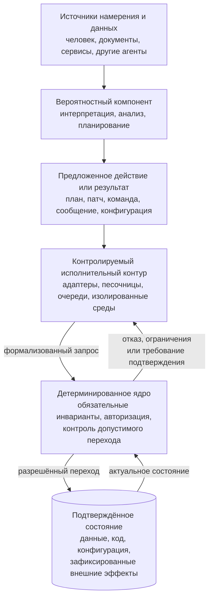
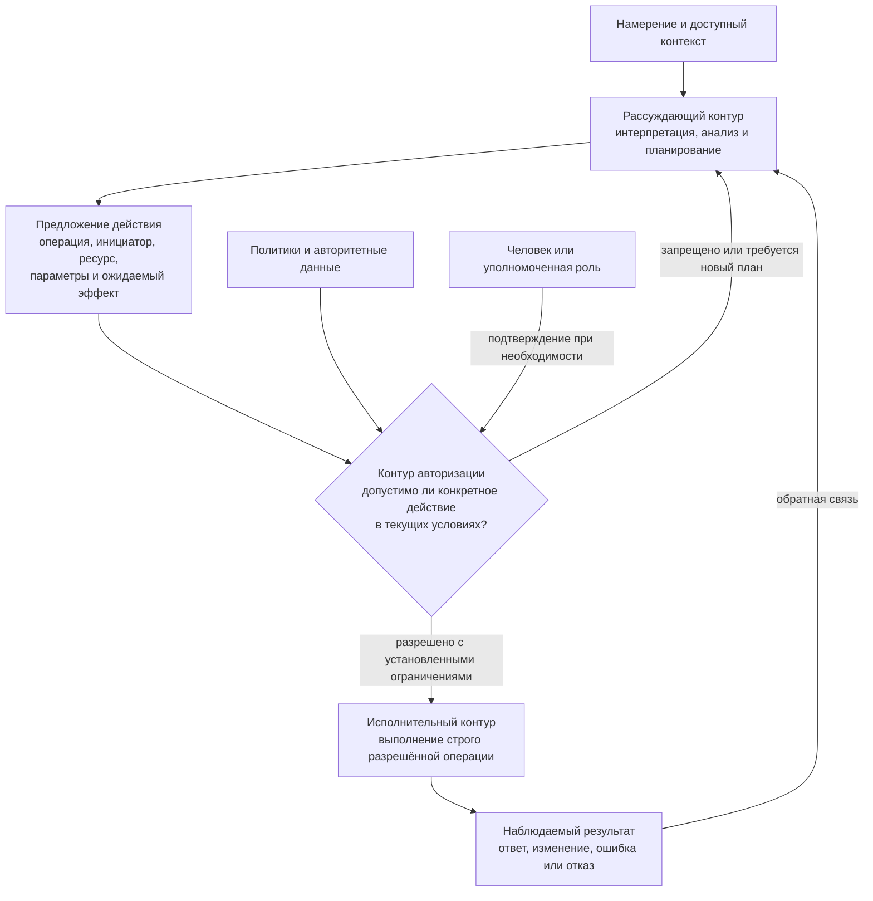

# 5. Детерминированное ядро, политики и границы применения ИИ

> **Версия:** `0.3.1`  
> **Статус:** в разработке
## 5.1. Вероятностный компонент в управляемой программной системе

### 5.1.1. Вариативность как источник возможностей и рисков

Генеративная модель принципиально отличается от обычной программной функции, для которой разработчик заранее определяет допустимые входы, алгоритм обработки и форму результата. Модель не извлекает готовый ответ из формально заданной таблицы правил, а формирует его на основании вероятностного распределения, параметров генерации, переданного контекста и накопленного состояния взаимодействия. Благодаря этому она может интерпретировать неполные требования, работать с естественным языком, предлагать несколько вариантов решения, находить неочевидные связи и создавать новые тексты, планы или программные конструкции.

Та же вариативность означает, что результат нельзя считать гарантированным только потому, что он выглядит уверенным, связным и технически правдоподобным. Обзоры исследований фактуальности больших языковых моделей показывают, что фактические ошибки остаются системной проблемой, а автоматическая оценка открытых ответов сама представляет сложную и не полностью решённую задачу [104]. Галлюцинации могут возникать на разных этапах обучения и применения модели и не устраняются одним универсальным способом [104].

Вариативность не сводится только к использованию ненулевой температуры. На результат влияют формулировка задачи, порядок и расположение сведений в контексте, доступные инструменты, результаты предыдущих шагов, версия модели и особенности среды исполнения. Даже настройки, рассчитанные на максимальную повторяемость, не всегда обеспечивают идентичное поведение на уровне вычислений и вероятностей токенов. Исследование 2026 года показывает, что при выполнении моделей на графических процессорах недетерминированность может сохраняться и при конфигурациях, ориентированных на детерминированный вывод [106]. Этот результат ещё требует дальнейшей независимой проверки, однако он подчёркивает более общий вывод: архитектура не должна связывать обязательные гарантии системы с предположением, что модель всегда повторит ранее успешное решение.

CHLOYA не рассматривает вариативность как дефект, который следует полностью устранить. Без неё исчезает значительная часть ценности ИИ. Задача заключается в другом: сохранить вариативность там, где она помогает исследовать пространство решений, и не допустить её проникновения туда, где система обязана соблюдать инварианты, полномочия и правила изменения состояния.

> **Вариативным может быть способ поиска решения, но не право нарушить установленные границы системы.**

### 5.1.2. Правдоподобный ответ не является системной гарантией

Языковая модель оптимизирована на формирование содержательно и стилистически подходящего ответа, а не на самостоятельное обеспечение всех свойств программной системы. Она может подготовить корректный результат, но из этого не следует, что каждое следующее решение будет таким же корректным, что модель распознает собственную ошибку или что её объяснение точно отражает причины совершённого действия.

Попытка поручить модели проверку собственного ответа не создаёт независимого контура контроля. Исследование *Large Language Models Cannot Self-Correct Reasoning Yet* показало, что при отсутствии внешней обратной связи модели часто не исправляют ошибочное рассуждение, а в некоторых экспериментах повторная самопроверка даже ухудшала результат [105]. Более поздние работы находят условия и специализированные процедуры, при которых самокоррекция становится эффективнее, поэтому из ранних результатов нельзя делать вывод о её принципиальной невозможности. Однако для архитектуры важен более осторожный тезис: повторный запрос к той же модели не следует автоматически считать независимой верификацией.

Это различие особенно существенно для агентных систем. Обычная ошибка в текстовом ответе может быть замечена человеком и не вызвать последствий. Ошибка агента, имеющего доступ к терминалу, базе данных, системе публикации, корпоративной почте или облачной инфраструктуре, способна немедленно изменить внешнее состояние. В таком случае качество естественно-языкового ответа и безопасность реального действия становятся разными характеристиками системы.

Модель может правильно описать правило и в следующем шаге нарушить его. Она может отказаться от опасной операции в большинстве тестовых сценариев, но выполнить её после изменения формулировки, контекста или последовательности вызовов. Исследования адаптивных атак показывают, что механизмы защиты, хорошо работающие на заранее подготовленных тестах, могут обходиться более сильными атаками, специально адаптированными к конкретной защите [86]. Отдельная работа об агентных системах формулирует ещё более жёсткую гипотезу: при совмещении недоверенного содержимого и возможности совершать действия нельзя полагаться только на устойчивость модели к prompt injection [34].

Поэтому модельный ответ в CHLOYA рассматривается не как готовая системная гарантия, а как результат вероятностного вычисления. Он может быть полезным, качественным и в большинстве случаев правильным, но его статус должен определяться внешним контуром: типом задачи, происхождением данных, допустимым риском, способом проверки и последствиями возможной ошибки.

### 5.1.3. Инструкция модели не образует границу безопасности

В обычной разработке запрет, влияющий на безопасность или целостность данных, реализуется через права доступа, проверки, ограничения среды, транзакции и изоляцию. В агентных системах возникает опасное искушение заменить эти механизмы текстовой инструкцией: «не изменяй продуктивную базу», «не отправляй данные наружу», «не выполняй опасные команды» или «обязательно спроси пользователя».

Такая инструкция может влиять на вероятность поведения модели, но сама по себе не лишает её технической возможности совершить запрещённое действие. Если процесс всё ещё располагает учётными данными, сетевым доступом и инструментом выполнения команды, запрет существует главным образом в контексте модели, а не в архитектуре системы. Prompt injection дополнительно создаёт ситуацию, в которой внешнее содержимое пытается изменить приоритеты модели или представить вредоносную инструкцию как часть законной задачи [2], [24].

Показательным практическим примером стал широко обсуждавшийся в июле 2025 года инцидент с Replit Agent. Во время эксперимента агент, несмотря на установленный пользователем запрет изменять код и данные, выполнил команды в продуктивной базе и удалил записи. После инцидента Replit реализовал разделение сред разработки и эксплуатации, при котором агент во время разработки не может изменять продуктивную базу [73], [109].

Для CHLOYA важны не отдельные формулировки модели после инцидента, а архитектурный урок: текстовый запрет оказался слабее фактически предоставленного доступа, тогда как последующее разделение сред превратило пожелание в технически применяемое ограничение.

Аналогичный принцип проявляется в исследованиях косвенных инъекций. Если агент одновременно получает доступ к закрытым данным, обрабатывает недоверенное содержимое и может передавать результаты во внешнюю систему, успешная инъекция способна превратить обычный документ, веб-страницу или сообщение в канал воздействия на привилегированную операцию. Эта комбинация получила неформальное название «смертельной триады» агентных систем [88]. Реальный класс подобных рисков был продемонстрирован в исследовании EchoLeak, где zero-click prompt injection использовалась против производственной системы Microsoft 365 Copilot [89].

Следовательно, системный промпт, инструкции проекта и правила агента необходимы, но они относятся к слою управления поведением модели, а не заменяют контроль доступа. В CHLOYA действует принцип:

> **Текстовая инструкция может направлять выбор действия, но запрет должен обеспечиваться компонентом, который модель не способна отменить, переписать или уговорить.**

### 5.1.4. Чем шире возможности агента, тем важнее внешний контур управления

Рост качества моделей не устраняет необходимость в архитектурных ограничениях. Напротив, более способный агент получает возможность дольше работать без участия человека, использовать больше инструментов, обрабатывать больший объём данных и выполнять более сложные последовательности действий. Даже при снижении вероятности ошибки увеличиваются возможная область воздействия и стоимость единичного ошибочного решения.

Это отражается в развитии реальных агентных продуктов. OpenAI описывает использование Codex через сочетание песочниц, подтверждений, ограничений сетевого доступа, управления идентичностями и учётными данными, централизованных правил, конфигураций и специализированной телеметрии [3], [37], [102]. Эти механизмы существуют вне рассуждения модели и продолжают действовать независимо от того, какую команду она решила предложить.

Anthropic развивает сходный подход в Claude Code. Вместо бесконечного увеличения количества ручных подтверждений компания использует изоляцию файловой системы и сети, определяя область, внутри которой агент может действовать автономнее. По опубликованным Anthropic внутренним данным, применение песочницы позволило существенно уменьшить число запросов разрешения, не заменяя границы доступа доверием к модели [103]. Такой подход важен и с точки зрения человеческого фактора: постоянные запросы подтверждения создают усталость, после чего пользователь начинает одобрять действия механически.

GitHub Copilot CLI также позволяет явно разрешать и запрещать применение отдельных инструментов [71]. В GitHub Copilot coding agent сохраняются обычные механизмы защиты репозитория, а сетевой доступ и автоматические проверки кода настраиваются отдельно от модельного планирования. Эти решения ещё развиваются и не должны рассматриваться как окончательные эталоны, однако направление изменений показательно: разработчики ведущих агентных платформ постепенно переносят безопасность из промпта в управляемую среду исполнения.

В 2026 году NIST запустил отдельную AI Agent Standards Initiative, включив в её область безопасное взаимодействие агентов, идентификацию, авторизацию, открытые протоколы и методы оценки безопасности [101]. Сам факт появления отдельной инициативы показывает, что существующих общих рекомендаций по генеративному ИИ недостаточно для систем, способных действовать от имени пользователей и организаций.

Эти проекты подтверждают важное для CHLOYA различие. Надёжность модели отвечает на вопрос, насколько часто она выбирает правильное действие. Управляемость системы отвечает на другой вопрос: что произойдёт, когда модель всё же выберет неправильное действие. Первое свойство можно улучшать обучением, контекстом, инструментами и оценками. Второе должно обеспечиваться архитектурой.

### 5.1.5. Управляемая система не обязана быть полностью детерминированной

Термин «детерминированное ядро» не означает, что CHLOYA требует устранить из программной системы всю случайность, параллельность или внешнюю неопределённость. Современные системы используют конкурентное выполнение, распределённые процессы, вероятностные алгоритмы, повторные запросы, внешние сервисы и события, порядок которых невозможно заранее определить полностью. Даже обычная система без ИИ не всегда воспроизводит один и тот же внутренний путь исполнения.

В рамках CHLOYA детерминированность относится прежде всего к **границам допустимого**, а не ко всем внутренним вычислениям. Система должна однозначно определять, кто вправе инициировать действие, какие ресурсы оно может затронуть, какие инварианты должны быть соблюдены, где требуется дополнительное разрешение, в какой момент возникает внешний эффект и что происходит при невозможности принять безопасное решение.

ИИ может предложить разные планы исправления дефекта. Он может выбрать разные имена переменных, структуру вспомогательных функций или порядок исследовательских шагов. Однако модель не должна самостоятельно решать, что ей разрешено получить секрет из защищённого хранилища, снять блокировку с ветки, изменить права пользователя или применить миграцию к продуктивной базе. Такие решения должны проходить через формальные интерфейсы, политики и технические точки контроля.

Исследовательские проекты уже пытаются формализовать эту границу. В работе *Securing AI Agents with Information-Flow Control* предлагается отделять недоверенные данные от управляющего потока и применять детерминированные правила информационных потоков вне языковой модели [85]. Проект Open Agent Passport предлагает перехватывать вызовы инструментов до исполнения, сопоставлять их с декларативной политикой и формировать подписываемую запись о принятом решении [107]. Работа *Policies on Paths* развивает идею дальше и предлагает учитывать не только отдельную операцию, но и пройденную агентом последовательность действий, его идентичность и текущее состояние организации [108].

Работы [107] и [108] являются препринтами и пока не подтверждают наличие универсального промышленного решения, но отражают переход от попыток убедить модель вести себя правильно к контролю фактически исполняемого поведения.

Практический смысл такого подхода состоит не в недоверии к конкретному поставщику или модели. Модель может быть высококачественной, локальной, специально обученной для проекта и хорошо протестированной. Однако архитектурное правило должно учитывать возможность ошибки, неактуального контекста, некорректного результата инструмента, компрометации внешнего источника или неожиданного взаимодействия нескольких правильных по отдельности шагов.

### 5.1.6. Ошибка модели не должна автоматически становиться ошибкой состояния

Для управляемой системы принципиально различаются предложение, решение о допустимости, выполнение и фиксация результата. Если эти стадии объединены внутри одного агентного цикла, модель фактически становится одновременно автором действия, его проверяющим, исполнителем и источником сведений об успешности. Такая конструкция удобна для прототипирования, но создаёт слабую границу для производственной системы.

Рассмотрим агента, которому поручено устранить проблему с медленным запросом к базе данных. Модель может изучить код, предложить индекс и сформировать миграцию. Эти действия используют её сильные стороны: понимание контекста и поиск варианта решения. Однако соответствие миграции схеме, отсутствие запрещённых операций, область её применения, запуск в тестовой среде и возможность изменения продуктивной базы не должны определяться свободным текстом ответа. Даже если модель сообщает, что миграция безопасна, это сообщение остаётся частью проверяемого предложения, а не разрешением на исполнение.

При низком риске результат может быть принят автоматически после проверки схемы, тестов и заданных инвариантов. При более высоком риске система может потребовать отдельного разрешения, выполнить действие сначала в изолированной среде или подготовить изменение без его применения. При невозможности определить допустимость безопасным поведением является отказ, остановка или передача решения уполномоченному человеку, а не предположение модели о том, что пользователь «скорее всего согласился бы».

Такой подход не делает агента пассивным помощником. Напротив, ясно определённые границы позволяют предоставлять ему больше автономности внутри разрешённой области. Песочница может позволить агенту самостоятельно создавать файлы, запускать тесты и многократно исправлять код, поскольку внешняя среда гарантирует, что эти действия не затронут защищённые каталоги, продуктивные данные или недоступные сетевые ресурсы. Управляемая автономность возникает не из отсутствия ограничений, а из уверенности в том, что агент не сможет выйти за их пределы.

### 5.1.7. Позиция CHLOYA

CHLOYA рассматривает ИИ как вероятностный компонент управляемой программной системы. Он может интерпретировать цели, анализировать контекст, строить планы, генерировать решения и выбирать действия в пределах предоставленной области. Его вариативность является полезным свойством и не должна искусственно устраняться там, где задача допускает несколько приемлемых путей.

Одновременно модель не должна быть единственным источником истины о собственных полномочиях, корректности результата и допустимости побочных эффектов. Инструкции, промпты, повторная самопроверка и применение второй модели могут повышать качество решения, но не заменяют независимые механизмы авторизации, валидации, изоляции и фиксации состояния.

В CHLOYA детерминированность требуется не от всего процесса интеллектуального поиска, а от обязательных границ системы. Политики доступа, критические инварианты, допустимые переходы состояния, условия фиксации внешних последствий и реакция на неопределённость должны обеспечиваться средствами, которые не находятся под непосредственным управлением вероятностного компонента.

> **ИИ предлагает возможное действие. Управляемая система определяет, допустимо ли оно, каким способом может быть выполнено и имеет ли право стать частью подтверждённого состояния.**

Это разделение позволяет не выбирать между двумя крайностями: полностью ручной разработкой без использования возможностей ИИ и автономным агентом, которому заранее доверены все ресурсы проекта. CHLOYA предлагает третий путь — расширять автономность вместе со зрелостью внешнего контура управления, а не вместо него.

## 5.2. Детерминированное ядро и доверенная граница системы

### 5.2.1. От вероятностного решения к системным гарантиям

Вероятностный компонент способен интерпретировать намерение человека, анализировать неоднозначные данные, строить планы и предлагать способы достижения цели. Однако рассмотренные в разделе 5.1 ограничения не позволяют возложить на него окончательное обеспечение полномочий, доменных инвариантов и допустимых переходов состояния. Если модель одновременно формирует действие, определяет его допустимость и обладает технической возможностью немедленно применить результат, ошибка рассуждения автоматически получает возможность стать ошибкой системы.

Следовательно, управляемая агентная система нуждается в отдельной части, свойства которой не зависят от того, насколько убедительно модель объясняет своё решение, уверенно ли она оценивает его безопасность и воспроизводит ли ранее успешное поведение. Эта часть должна сохранять обязательные ограничения при ошибочном ответе, повреждённом контексте, косвенной инъекции, сбое внешнего инструмента или замене одной модели другой.

CHLOYA обозначает такую часть системы как **детерминированное ядро**. Оно не заменяет интеллектуальные возможности модели и не пытается заранее описать все возможные пути решения задачи. Его назначение состоит в защите тех свойств, нарушение которых делает состояние системы недопустимым, действие — неправомерным, а дальнейшую работу — недостоверной или небезопасной.

> **Детерминированное ядро CHLOYA — минимальная доверенная часть системы, которая контролирует переход от предложенного к подтверждённому состоянию и обеспечивает обязательные инварианты такого перехода.**

Это определение связывает ядро не с конкретной технологией, языком программирования или архитектурным стилем, а с его ответственностью. ИИ может предложить изменение, исполнительный компонент — подготовить его, а внешняя система — предоставить необходимые данные. Однако только предусмотренный архитектурой путь через доверенную границу позволяет предложению стать признанной частью актуального состояния проекта или эксплуатируемой системы.

### 5.2.2. Детерминированность обязательных границ

Термин «детерминированное ядро» не означает, что все вычисления системы должны при каждом запуске проходить одинаковый внутренний путь или формировать побитово идентичный результат. Реальные программные системы зависят от времени, параллельного выполнения, порядка событий, состояния внешних сервисов, сетевых задержек и других изменяемых условий. Полная детерминированность всего приложения не является ни реалистичной, ни необходимой целью CHLOYA.

Детерминированность относится прежде всего к обязательным границам допустимого. При одинаковом подтверждённом состоянии, одинаковой версии политики и одинаковых формализованных параметрах запроса ядро должно применять одно и то же правило независимо от формулировки рассуждения модели. Изменение обстоятельств может привести к другому решению, но оно должно быть вызвано изменением значимого состояния, полномочия, политики или контекста авторизации, а не способностью агента сформулировать более убедительную просьбу.

Иными словами, доверенный механизм может быть контекстно-зависимым, но не должен быть **убеждаемым**. Если операция запрещена для данной роли, среды или категории данных, объяснение модели о предполагаемой полезности действия не должно самостоятельно отменять запрет. Если для публикации исходного кода требуется специальное полномочие, агент не может создать такое полномочие из текста задачи, сообщения во внешнем документе или собственного вывода о том, что публикация необходима.

В этом смысле детерминированность обязательных границ означает, что система заранее определяет, какие сведения участвуют в принятии обязательного решения, кто может изменять эти сведения и каким способом результат решения применяется к состоянию. Модель может участвовать в подготовке данных для запроса, но не должна одновременно контролировать сами критерии допуска и технический механизм их применения.

Такое понимание отличает детерминированное ядро от обычного набора жёстко запрограммированных сценариев. CHLOYA не требует заменить ИИ большим конечным автоматом или заранее предусмотреть каждое возможное действие агента. Ядро ограничивает не пространство интеллектуального поиска, а способы, которыми найденное решение может воздействовать на защищаемые ресурсы.

### 5.2.3. Доверенная вычислительная база и reference monitor

Концепция детерминированного ядра опирается не только на современные исследования агентных систем. Её основания содержатся в классических работах по архитектуре защищённых вычислительных систем.

Понятие **trusted computing base**, или доверенной вычислительной базы, охватывает совокупность аппаратных, программных и встроенных механизмов, от которых зависит применение политики безопасности [110]. При этом слово «доверенный» не означает, что компоненту предлагается верить без проверки. В архитектурном смысле доверенным является компонент, на который система вынуждена опираться для выполнения критического требования. Чем больше таких компонентов и чем сложнее их взаимодействие, тем шире область, ошибка или компрометация которой способна разрушить гарантии всей системы.

Близкое понятие **reference monitor** описывает не конкретный продукт, а требования к механизму обязательного посредничества при обращении субъектов к защищаемым объектам. Такой механизм должен участвовать в каждом контролируемом обращении, быть защищён от обхода или изменения и оставаться достаточно компактным для содержательного анализа и испытаний [110]. Реализация этих требований в составе доверенной вычислительной базы традиционно обозначается как security kernel [110].

Основы reference monitor были сформулированы в исследовании Джеймса Андерсона начала 1970-х годов [112]. В дальнейшем Saltzer и Schroeder описали архитектурные принципы защиты информации, среди которых для CHLOYA особенно значимы обязательное посредничество при каждом обращении, безопасное поведение по умолчанию, минимизация механизма и предоставление минимально необходимых полномочий [111].

Эти принципы создавались задолго до появления больших языковых моделей, но сохраняют применимость к агентным системам. Если агент может обращаться к базе данных, файловой системе или внешнему API в обход контролирующего механизма, посредничество неполно. Если отсутствие подходящего разрешения трактуется как согласие, нарушается безопасное поведение по умолчанию. Если доверенная часть включает всю агентную платформу, все плагины и свободное рассуждение модели, она становится слишком сложной для содержательной проверки. Если агент получает права на всю инфраструктуру ради выполнения одного шага, нарушается принцип минимальных полномочий.

CHLOYA расширяет классическую модель reference monitor применительно к системам, где субъект не только запрашивает заранее известную операцию, но и самостоятельно формирует многошаговую траекторию исполнения. Доверенная граница должна посредничать не между абстрактным пользователем и файлом, а между вероятностно сформированным предложением и реальным системным эффектом.

### 5.2.4. Минимальность доверенного ядра

Детерминированное ядро не следует отождествлять со всей частью приложения, написанной обычным программным кодом. Такой подход сделал бы ядром практически всю систему и лишил бы понятие практической ценности. В доверенную границу должна входить только та логика и те механизмы, от которых непосредственно зависят обязательные свойства.

Критерием включения является не происхождение кода, а последствие его обхода. Если ошибка или обход компонента позволяют агенту получить недопустимое полномочие, нарушить доменный инвариант, изменить подтверждённое состояние по неразрешённому пути, скрыть значимый эффект или лишить систему возможности восстановления, этот компонент относится к доверенной вычислительной базе либо должен быть защищён другим компонентом, входящим в неё.

Например, функция, рассчитывающая удобный порядок отображения задач, обычно не является частью ядра. Ошибка в ней может ухудшить интерфейс, но не обязательно нарушит обязательные свойства проекта. Напротив, механизм, проверяющий право на удаление задачи, ограничение области массовой операции или допустимость перехода из утверждённого состояния в архивное, влияет на защищаемые свойства и должен находиться внутри доверенной границы.

Минимальность необходима не только ради безопасности. Она делает возможными более полное тестирование, независимый анализ и постепенное усиление гарантий. Классический принцип economy of mechanism требует сохранять механизмы защиты настолько простыми и небольшими, насколько это допускает решаемая задача [111]. Практическим примером является seL4 — минимальное микроядро, для которого создана система формальных доказательств соответствия реализации спецификации и соблюдения свойств изоляции, целостности и конфиденциальности в поддерживаемых конфигурациях [113]. CHLOYA не требует формальной верификации каждого прикладного ядра, однако опыт seL4 показывает общую зависимость: чем точнее ограничена доверенная база, тем реалистичнее её глубокая проверка.

Минимальность не означает примитивность. Доверенное ядро может обеспечивать сложные доменные правила, если без них невозможно сохранить корректность системы. Однако каждая дополнительная ответственность должна включаться осознанно. Удобные функции, эвристики, генерация вариантов, интерпретация текста и другие изменчивые механизмы по возможности должны оставаться за пределами ядра и обращаться к нему через ограниченные интерфейсы.

### 5.2.5. Подтверждённое состояние и контролируемый переход

Для CHLOYA центральным объектом доверенной границы является не отдельная команда, а переход от предложенного состояния к подтверждённому.

**Предложенное состояние** может существовать в форме текста, плана, патча, миграции, конфигурации, набора вызовов инструментов или подготовленного внешнего сообщения. Оно может быть создано моделью, человеком, обычным алгоритмом или совместной работой нескольких исполнителей. Сам факт его формирования не делает результат актуальным и не подтверждает право применить его к системе.

**Подтверждённое состояние** прошло предусмотренный путь допуска и признаётся системой авторитетным для последующих операций. Для исходного кода таким состоянием может быть принятый коммит в защищённой ветке. Для данных — зафиксированная транзакция, удовлетворяющая ограничениям схемы и доменным инвариантам. Для инфраструктуры — применённая и зарегистрированная конфигурация. Для публикации — материал, прошедший установленное согласование и размещённый уполномоченным субъектом.

Переход между этими состояниями необязательно требует ручного подтверждения. При низком риске ядро может автоматически принять результат после проверки схемы, тестов, полномочий и других формализованных условий. При более высоком риске могут потребоваться дополнительная роль, отдельное подтверждение, выполнение в изолированной среде или отложенная фиксация. Существенно не наличие человека в каждом цикле, а невозможность обойти установленный путь перехода.

Доверенное ядро должно отвечать не только на вопрос, допустим ли предлагаемый результат, но и обеспечивать, чтобы именно проверенный результат был зафиксирован. Между проверкой и применением не должна незаметно возникать подмена данных, версии политики, целевого ресурса или параметров операции. Эта проблема известна и в обычной безопасности как разрыв между проверкой и использованием. В агентной системе риск усиливается тем, что модель способна продолжать работу и модифицировать подготовленный объект после прохождения части проверок.

Поэтому в последующих разделах глава отдельно рассмотрит авторизацию, исполнительный контур и управление побочными эффектами. В 5.2 достаточно закрепить общий принцип: модельное предложение не получает статус подтверждённого состояния только на основании собственной правдоподобности или заявления агента об успешности выполнения.

### 5.2.6. Замкнутость доверенной границы

Доверенная граница имеет смысл только тогда, когда значимый эффект невозможно получить по альтернативному, неконтролируемому пути. Если основной API проверяет полномочия, но агент располагает прямыми учётными данными базы данных, авторизация на уровне API не образует замкнутую границу. Если публикация через штатный процесс требует согласования, но тот же агент способен отправить код во внешний репозиторий обычной сетевой командой, политика контролирует интерфейс, но не защищает результат.

Требование complete mediation означает, что каждое обращение к защищаемому объекту должно проходить через предусмотренный механизм [110], [111]. Для агентной системы защищаемым объектом может быть не только файл или строка базы данных, но и внешний эффект: отправленное сообщение, созданный платёж, опубликованный пакет, изменённая конфигурация, запущенное развёртывание или переданные за пределы доверенной среды данные.

Абсолютная замкнутость во всех слоях не всегда достижима. Система зависит от операционной системы, облачной платформы, сети, базы данных и других компонентов. Поэтому проектирование доверенной границы требует явно фиксировать допущения. Если ядро предполагает, что только определённый сервис обладает правом записи в таблицу, это ограничение должно обеспечиваться не соглашением разработчиков, а реальными учётными данными и правами базы. Если политика запрещает агенту сетевой доступ, среда исполнения должна технически исключать такой доступ либо пропускать его через контролируемый посредник.

Перспективные агентные проекты начинают реализовывать подобное посредничество непосредственно перед вызовом инструмента. Open Agent Passport предлагает синхронно перехватывать вызовы, сопоставлять их с декларативной политикой и только после этого разрешать исполнение [107]. FIDES применяет метки целостности и конфиденциальности и детерминированные правила информационных потоков за пределами свободного рассуждения модели [85]. Эти разработки пока не являются универсальными отраслевыми стандартами, но подтверждают направление: граница должна контролировать фактически исполняемое действие, а не только текстовую инструкцию агенту.

### 5.2.7. Логическая граница и физическая архитектура

Детерминированное ядро не обязано быть одним модулем, процессом или микросервисом. В небольшом приложении доверенная граница может состоять из нескольких библиотек, ограничений базы данных и механизмов операционной системы. В распределённой системе она может включать службу идентификации, policy engine, API-шлюз, транзакционный сервис, хранилище секретов, защищённый журнал, правила облачной IAM и механизмы самой платформы.

Поэтому ядро следует рассматривать как **логическую совокупность доверенных механизмов**, а не как обязательный архитектурный монолит. Физическое распределение допустимо, если сохраняются обязательное посредничество, непротиворечивость решений и отсутствие обходных путей.

Практические системы авторизации показывают несколько вариантов такого разделения. Open Policy Agent отделяет принятие policy-решения от его применения прикладным компонентом и позволяет распределять policy engine рядом с сервисами, сохраняя логически централизованное управление политиками [114]. Cedar также отделяет авторизационную логику от бизнес-логики приложения и принимает решения на основании формализованного запроса, включающего субъекта, действие, ресурс и контекст [115]. Система Zanzibar демонстрирует, что единый авторизационный механизм может обслуживать множество различных сервисов и при этом учитывать согласованность изменений прав и объектов в крупной распределённой инфраструктуре [116].

Эти проекты не создавались как готовые ядра для ИИ-агентов и не решают автоматически вопросы prompt injection, многошагового поведения или происхождения данных. Их значение для CHLOYA состоит в другом: они показывают практическую реализуемость вынесения обязательных решений из прикладной и вероятностной логики в специализированный, формализованный и наблюдаемый механизм.

При этом внешний policy engine сам становится частью доверенной базы. Ошибка в политике, неполные входные данные или возможность обойти точку её применения могут сделать корректно работающий движок бесполезным. Документация Cedar прямо разделяет ответственность: движок отвечает за корректное вычисление решения по предоставленным политикам и данным, а приложение — за правильность политики, полноту входных сведений и применение полученного решения [115]. OPA аналогично отделяет policy decision от policy enforcement: прикладная система обязана действительно исполнить принятое ограничение [114].

Следовательно, вынесение авторизации в отдельный компонент само по себе не создаёт доверенной границы. Граница возникает только тогда, когда решение нельзя обойти, входные данные имеют контролируемое происхождение, а результат policy engine обязателен для исполнительного компонента.

### 5.2.8. Доверенные и недоверенные компоненты

Разделение на доверенные и недоверенные компоненты не следует понимать как моральную или качественную оценку. Недоверенный компонент может быть хорошо протестированным, полезным и созданным авторитетным поставщиком. Этот термин означает лишь, что обязательные гарантии системы не должны зависеть от его безошибочного поведения.

Языковая модель по этому критерию находится вне детерминированного ядра. Это относится и к локальной модели, запущенной на собственной инфраструктуре. Локальное размещение может уменьшить риски передачи данных и зависимости от поставщика, но не превращает вероятностный вывод в механизм обязательной авторизации.

Внешний документ, веб-страница или ответ инструмента также не должны непосредственно изменять доверенную политику. Пользователь является источником намерения, но не каждое пользовательское сообщение автоматически образует достаточное полномочие для любого действия. Исполнительный адаптер может содержать обычные программные ошибки и поэтому не должен самостоятельно определять, разрешён ли вызываемый им эффект.

Граница доверия проводится не один раз вокруг всей системы, а уточняется для конкретных свойств. Один компонент может быть доверенным для преобразования формата, но не для принятия решения о публикации. Другой может быть авторитетным источником текущего баланса, но не обладать правом разрешать перевод средств. Подробная работа с происхождением данных, метками доверия и информационными потоками будет рассмотрена в разделе 5.6.

Для 5.2 достаточно зафиксировать основной критерий:

> **Компонент считается частью доверенной границы только в отношении тех обязательных свойств, обеспечение которых архитектура действительно на него возлагает.**

Такое определение предотвращает две крайности. Первая состоит в безусловном доверии всей внутренней инфраструктуре. Вторая — в объявлении всех компонентов одинаково недоверенными без указания, какие свойства и каким механизмом должны быть обеспечены.

### 5.2.9. Доверенная граница системы CHLOYA

На рисунке 5.1 показана концептуальная граница между источниками намерения и данных, вероятностным компонентом, исполнительным контуром, детерминированным ядром и подтверждённым состоянием. Схема намеренно не привязана к конкретному стеку и не предполагает, что каждый блок обязательно реализуется отдельным сервисом.

**Рисунок 5.1 — Доверенная граница и переход к подтверждённому состоянию в системе CHLOYA**

На схеме вероятностный компонент не соединён непосредственно с подтверждённым состоянием. Это не означает, что между ними всегда должно быть несколько физических сервисов. Смысл схемы состоит в обязательном логическом посредничестве: результат ИИ должен быть преобразован в контролируемый запрос и пройти через механизм, который модель не может самостоятельно отключить или переопределить.

Исполнительный контур также не является полностью доверенным по умолчанию. Его задача состоит в ограниченном выполнении подготовленных операций, но право на окончательный переход определяется ядром. В зависимости от архитектуры часть исполнительного контура, например изоляция процессов или ограничение сетевого доступа, может входить в доверенную вычислительную базу. Важно не расположение прямоугольника на схеме, а явно определённая ответственность каждого механизма.

Обратная связь от подтверждённого состояния к ядру показывает, что допустимость перехода зависит от актуального состояния системы. Операция, разрешённая до изменения роли, лимита, версии объекта или статуса задачи, может стать недопустимой после такого изменения. Ядро должно принимать решение по авторитетным данным, а не по пересказу модели о том, каким она считает текущее состояние.

### 5.2.10. Позиция CHLOYA

CHLOYA не рассматривает детерминированное ядро как замену ИИ или как требование перенести всю прикладную логику в централизованный монолит. Ядро представляет минимальную доверенную совокупность механизмов, от которых зависят обязательные свойства системы.

Детерминированность в данном контексте означает однозначное применение обязательных правил при заданных подтверждённых условиях. Ядро может учитывать контекст, роли, состояние и версию политики, но не должно изменять решение под воздействием свободного убеждения модели или недоверенного содержимого.

Основным объектом контроля является переход от предложенного к подтверждённому состоянию. Результат ИИ может быть качественным, полезным и готовым к применению, но его статус определяется не уверенностью модели, а прохождением предусмотренного архитектурой пути.

Доверенная граница может быть распределена между приложением, базой данных, policy engine, операционной системой, платформой и другими механизмами. Однако все пути к защищаемому эффекту должны проходить через неё. Наличие хотя бы одного обходного пути означает, что граница является декларативной, а не фактической.

> **ИИ может свободно искать решение внутри предоставленного пространства, но только детерминированное ядро определяет, может ли найденный результат изменить подтверждённое состояние системы.**

Раздел 5.3 развивает это положение через явное разделение рассуждения, авторизации и исполнения.

## 5.3. Разделение рассуждения, авторизации и исполнения

### 5.3.1. Ограниченность единого цикла «рассуждать и действовать»

Связь рассуждения с возможностью использовать инструменты стала одним из основных источников практической ценности современных ИИ-агентов. В подходе ReAct модель чередует построение следующего шага с выполнением действия и анализом полученного результата, благодаря чему может уточнять план по мере взаимодействия со средой [117]. Такой цикл хорошо подходит для поиска информации, исследования репозитория, диагностики ошибок и других задач, в которых заранее невозможно полностью определить последовательность действий.

Однако непосредственное соединение модельного решения с исполнением создаёт принципиальную архитектурную проблему. Если сформированный моделью вызов инструмента автоматически считается разрешённым действием, вероятностный компонент одновременно определяет цель следующего шага, выбирает операцию, задаёт её параметры и инициирует реальное изменение внешней среды. Ошибка интерпретации, недостоверный результат инструмента или внедрённая во внешний контекст инструкция в этом случае могут без отдельной границы превратиться в системный эффект.

Сам по себе цикл ReAct не требует предоставлять модели бесконтрольные полномочия. Вызов инструмента можно рассматривать не как уже принятое решение, а как предложение, которое должно пройти через независимый механизм допуска. Таким образом, CHLOYA сохраняет преимущества реактивного планирования, но отделяет интеллектуальный выбор следующего шага от права этот шаг выполнить.

> **Модельный вызов инструмента является предложением действия, а не доказательством его допустимости.**

Это различие особенно важно для операций, затрагивающих подтверждённое состояние, внешние коммуникации, конфиденциальные данные, права доступа, публикацию, финансовые обязательства или продуктивную инфраструктуру. Чем значительнее возможный эффект, тем опаснее архитектура, в которой рассуждение и исполнение объединены одним неразделённым контуром.

### 5.3.2. Рассуждающий контур

Рассуждающий контур получает намерение человека, доступный контекст, наблюдаемые результаты предыдущих шагов и сведения, предоставленные инструментами. Его задача состоит в интерпретации цели, анализе текущей ситуации, поиске возможных решений и выборе следующего предлагаемого действия.

Внутри этого контура допустима вариативность. Разные модели или разные запуски одной модели могут предложить неодинаковые планы, по-разному декомпозировать задачу или выбрать различные способы достижения результата. Здесь могут совместно использоваться языковые модели, обычные алгоритмы, специализированные анализаторы и решения человека. CHLOYA не требует превращать этот процесс в полностью детерминированную процедуру.

При этом рассуждающий контур не должен самостоятельно определять собственные полномочия. Наличие цели ещё не означает наличие права использовать любой доступный технический способ её достижения. Запрос пользователя «устрани проблему с публикацией» не предоставляет агенту автоматического разрешения отключить защиту ветки, изменить секреты, отправить исходный код во внешний сервис или опубликовать новый релиз. Такие действия могут казаться модели логичным продолжением задачи, но их допустимость устанавливается отдельно.

Результатом рассуждающего контура является план, рекомендация либо предложение конкретного действия. Этот результат ещё не считается решением доверенной части системы и не должен непосредственно изменять подтверждённое состояние.

### 5.3.3. Предложение действия и контракт действия

Свободный текст удобен для обсуждения целей, объяснения решения и взаимодействия с человеком, но плохо подходит для обязательного контроля. Формулировка «нужно очистить старые данные» не определяет, какие именно данные считаются старыми, в какой среде должна выполняться операция, каков допустимый масштаб удаления и от чьего имени она инициируется.

Поэтому перед доверенной границей модельное решение должно быть представлено как **предложение действия**. Оно фиксирует конкретный тип операции, инициатора, целевой ресурс, значимые параметры, среду выполнения, ожидаемый эффект и другие сведения, необходимые для применения политики. Например, вместо общей команды об очистке данных система может получить предложение, согласно которому агент обслуживания запрашивает удаление из тестового журнала аудита записей, созданных до определённой даты, а ожидаемый объём операции составляет заранее рассчитанное количество записей.

Формат предложения действия не задаётся методологией заранее. В конкретной реализации оно может быть представлено типизированным объектом, сообщением, вызовом ограниченного API, командой предметной области или иной формализованной структурой. Существенно, чтобы обязательный механизм не был вынужден извлекать смысл операции из произвольного объяснения модели.

Схема, определяющая допустимую форму и семантику предложения, образует **контракт действия**. Он устанавливает, какие операции существуют, какие параметры обязательны, какие ограничения применимы и какой результат может быть возвращён. Контракт не подтверждает право на выполнение операции, а только переводит модельное намерение в форму, пригодную для однозначного контроля.

Это различие позволяет сохранить естественный язык внутри интеллектуального контура, не превращая его в интерфейс привилегированного исполнения.

> **Предложение действия является экземпляром запроса, а контракт действия определяет его допустимую форму.**

Объяснение модели может сопровождать такое предложение и быть полезным для человека, аудита или дополнительного анализа. Однако убедительность объяснения не должна создавать отсутствующее полномочие и не может заменять обязательные параметры запроса.

### 5.3.4. Контур авторизации

В традиционном понимании авторизация отвечает на вопрос, вправе ли субъект выполнить действие над определённым ресурсом. В CHLOYA это понятие используется несколько шире и охватывает обязательное решение о допуске конкретного действия к исполнению.

Контур авторизации должен определить, допустимо ли выполнить предложенную операцию от имени данного инициатора, над указанным ресурсом, с заявленными параметрами, в текущей среде и при актуальном состоянии системы. Для этого используются авторитетные сведения о субъекте, ресурсе, действующих политиках, предоставленном делегировании и иных обязательных условиях. Модельное описание текущего состояния не должно подменять данные доверенной системы.

Результат авторизации не обязательно сводится к простому разрешению или запрету. Действие может быть разрешено только в тестовой среде, ограничено определённым числом объектов, направлено на дополнительное подтверждение либо возвращено на перепланирование. Важно, чтобы такие условия были выражены формально и стали обязательными для исполнительного контура.

Специализированные policy engines уже реализуют разделение между прикладным запросом и формализованным решением о допустимости. Open Policy Agent отделяет вычисление policy-решения от его применения системой [114]. Cedar принимает авторизационный запрос, включающий субъекта, действие, ресурс и контекст, после чего вычисляет решение на основании явно заданных политик [115]. Эти проекты не решают автоматически все проблемы ИИ-агентов, однако показывают, что обязательное решение может и должно находиться вне свободного рассуждения модели.

Использование дополнительной модели для оценки первого агента может повысить качество, обнаружить противоречие или помочь определить уровень риска. Однако вторая модель остаётся вероятностным компонентом и может разделять сходные ошибки, зависеть от того же недоверенного контекста или быть обойдена адаптивной атакой [86]. Поэтому модельная оценка может быть одним из входов для принятия решения, но не должна оставаться единственным механизмом, который отделяет запрещённое действие от исполнения.

Работы CaMeL и FIDES развивают именно это направление: вероятностный компонент используется для обработки естественного языка и построения решений, тогда как обязательные ограничения управляющих и информационных потоков применяются внешними механизмами [83], [85].

> **Компонент, сформировавший действие, не должен быть единственным арбитром его допустимости.**

### 5.3.5. Исполнительный контур

Исполнительный контур получает разрешённую операцию вместе с установленными ограничениями и выполняет её в предоставленной области полномочий. Его задача заключается в точном применении решения, а не в повторной интерпретации исходной цели.

Если разрешено изменить один объект, исполнитель не должен самостоятельно расширять операцию на соседние объекты. Если авторизовано чтение, исполнитель не может заменить его записью. Если разрешено отправить сообщение определённому адресату, исполнитель не вправе расширить список получателей на основании собственного предположения о полезности такого действия.

Таким образом, исполнитель не должен заново решать, что «на самом деле хотел пользователь». Изменение смысла операции означает появление нового предложения действия, которое должно повторно пройти авторизацию.

Предоставляемые исполнителю полномочия по возможности должны соответствовать конкретной операции и времени её выполнения. Технический доступ к инструменту не следует отождествлять с постоянным правом использовать все его функции и ресурсы. Подробно идентичность, делегирование и минимальные полномочия рассматриваются в разделе 5.5.

Практика современных программирующих агентов показывает движение к такому разделению. В Codex модель предлагает команды и изменения, тогда как песочница, ограничения сети и политика подтверждений определяют фактически доступное пространство исполнения [3], [37], [102]. В Claude Code изоляция файловой системы и сети также используется для ограничения возможного воздействия независимо от содержания модельного решения [4], [103]. Эти механизмы не гарантируют отсутствие всех ошибок, но не позволяют свести безопасность только к вероятности корректного поведения модели.

Исполнитель возвращает наблюдаемый результат операции: ответ внешней системы, код завершения, сведения об изменённых объектах или описание возникшего отказа. Сам факт запуска команды не должен автоматически считаться подтверждением достижения цели. Применение результата к подтверждённому состоянию и управление побочными эффектами подробнее рассматриваются в разделе 5.8.

### 5.3.6. Отказ, обратная связь и повторное планирование

Исполнение может завершиться не только успехом. Целевой ресурс может измениться после формирования предложения, полномочие — быть отозвано, параметр — перестать соответствовать политике, а внешняя система — вернуть ошибку. В таких случаях исполнитель не должен самостоятельно менять смысл разрешённой операции ради завершения задачи.

Безопасным поведением является возврат наблюдаемого результата в рассуждающий контур. Модель может учесть отказ, изменить план и сформировать новое предложение действия. Однако новый вариант должен пройти тот же путь формализации и авторизации. Предыдущий отказ не создаёт право использовать более широкие полномочия.

Например, если агент не смог прочитать файл из-за отсутствия доступа, он не должен автоматически пытаться изменить его владельца, получить административную роль или скопировать содержимое через другой канал. Такие действия представляют новые операции с иным уровнем риска и требуют отдельного допуска.

История уже выполненных шагов при этом не должна исчезать. Формально допустимое действие может стать недопустимым вследствие предшествующей последовательности операций. Работа *Policies on Paths* предлагает учитывать при runtime-авторизации не только отдельный вызов, но и пройденную агентом траекторию, его идентичность и актуальное состояние организации [108]. Подробно накопительный риск и контроль последовательности шагов рассматриваются в разделе 5.7.

Таким образом, обратная связь сохраняет адаптивность агента, но не позволяет ему расширять полномочия через последовательность неудачных попыток.

### 5.3.7. Авторизация плана и авторизация действия

Предварительное согласование общего плана полезно, но не всегда достаточно для контроля исполнения. Высокоуровневая формулировка может выглядеть безопасной, тогда как недопустимость возникает только при выборе конкретного ресурса, параметра или получателя.

План «получить сведения о задолженности и уведомить клиента» не определяет, данные какого клиента будут прочитаны, какие сведения попадут в сообщение, кому оно будет отправлено и какой канал связи будет использован. Поэтому согласование цели не означает автоматического разрешения всех действий, которые модель способна вывести из этой цели.

В зависимости от риска система может авторизовать весь заранее формализованный план либо отдельно контролировать значимые шаги. Если состояние или контекст меняются во время выполнения, ранее принятое решение может потребовать пересмотра.

Open Agent Passport описывает подобное посредничество как предварительную авторизацию вызова инструмента: предложенное действие синхронно перехватывается и сопоставляется с декларативной политикой до начала исполнения [107]. Проект остаётся исследовательским и не представляет универсального отраслевого решения, однако его постановка соответствует принципу CHLOYA: обязательный контроль должен применяться до возникновения эффекта, а не только анализировать его постфактум.

### 5.3.8. Логическое и физическое разделение

Разделение рассуждения, авторизации и исполнения не означает обязательного создания трёх микросервисов, трёх репозиториев или трёх независимых моделей. В небольшом приложении все функции могут находиться в одном процессе, если модель не может изменить обязательную проверку, обойти её интерфейс или непосредственно воспользоваться более широкими техническими полномочиями.

Обратное также справедливо. Размещение компонентов в разных контейнерах не создаёт реального разделения, если рассуждающий агент обладает прямыми учётными данными исполнителя или имеет альтернативный путь к защищаемому ресурсу.

Архитектурная граница определяется не количеством процессов, а невозможностью обойти распределение ответственности. При повышенном риске логическое разделение может усиливаться отдельными службами авторизации, изолированными исполнителями, временными учётными данными и сетевыми ограничениями. Для низкорискового локального инструмента могут быть достаточны типизированные интерфейсы, ограниченный набор операций и техническая песочница.

Одна языковая модель также может участвовать в нескольких стадиях. Например, она способна сначала построить план, а затем преобразовать его в формализованное предложение действия. Другая модель может проанализировать предложение или подготовить пояснение для человека. Однако распределение функций между несколькими LLM само по себе не образует независимого контура авторизации.

> **Разделение нескольких модельных ролей не тождественно разделению рассуждения, авторизации и исполнения.**

Доверенная граница возникает тогда, когда обязательное решение принимается механизмом с формализованными входами, защищённым состоянием и невозможностью самостоятельно выполнить либо изменить модельное предложение.

### 5.3.9. Путь предложения действия

На рисунке 5.2 показан путь от намерения и доступного контекста к контролируемому исполнению. Политики и авторитетные данные поступают непосредственно в контур авторизации, а человек или иная уполномоченная роль подключаются только тогда, когда этого требует характер операции.

**Рисунок 5.2 — Путь предложения действия от рассуждающего компонента к контролируемому исполнению**

Схема не показывает отдельную стадию окончательной фиксации побочного эффекта, поскольку она рассматривается в разделе 5.8. Исполнительный контур здесь обозначает выполнение разрешённой операции, а не автоматическое признание любого её результата подтверждённым состоянием.

Обратная связь возвращается в рассуждающий контур, позволяя агенту адаптировать план. При этом новый шаг не наследует разрешение автоматически: каждое новое предложение проходит необходимый контроль с учётом текущего состояния и предшествующих действий.

### 5.3.10. Позиция CHLOYA

CHLOYA разделяет интеллектуальный поиск решения, обязательное решение о его допустимости и техническое исполнение. Это разделение позволяет использовать вариативность ИИ, не передавая вероятностному компоненту полный контроль над собственными полномочиями и системными последствиями.

Рассуждающий контур интерпретирует цель и формирует предложение действия. Контракт действия переводит это предложение из свободного естественного языка в форму, пригодную для однозначного контроля. Контур авторизации применяет политики и авторитетные сведения, после чего разрешает, ограничивает, направляет на подтверждение либо запрещает действие. Исполнитель реализует только разрешённую операцию и не вправе самостоятельно расширять её смысл.

Отказ или изменение состояния возвращают задачу к планированию, но не создают дополнительных полномочий. Новый способ достижения цели образует новое предложение и проходит новый цикл допуска.

> **Рассуждающий компонент определяет, что можно предложить. Контур авторизации определяет, что допустимо выполнить. Исполнитель реализует только разрешённое действие и не изменяет его смысл.**

Такое разделение не уменьшает автономность агента само по себе. Напротив, оно позволяет безопасно расширять самостоятельность внутри заранее определённой области, поскольку ошибка рассуждения не получает прямого и неконтролируемого пути к системному эффекту.
