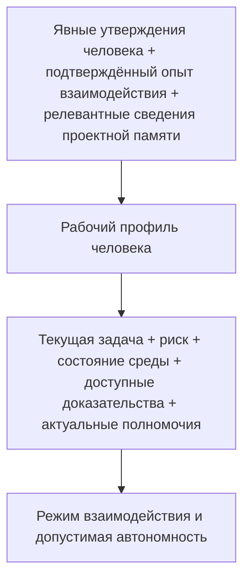

# Профиль человека и адаптивная автономность

> **Версия:** `0.3.1`  
> **Статус:** в разработке

## Содержание

- [10.1. Рабочий профиль человека в управляемом взаимодействии с ИИ](#101-рабочий-профиль-человека-в-управляемом-взаимодействии-с-ии)
- [10.2. Состав рабочего профиля человека](#102-состав-рабочего-профиля-человека)
- [10.3. Экспертность, способность выполнить задачу и способность проверить результат](#103-экспертность-способность-выполнить-задачу-и-способность-проверить-результат)
- [10.4. Происхождение, достоверность, актуальность и жизненный цикл рабочего профиля](#104-происхождение-достоверность-актуальность-и-жизненный-цикл-рабочего-профиля)
- [10.5. Автономность как многомерный профиль](#105-автономность-как-многомерный-профиль)

## 10.1. Рабочий профиль человека в управляемом взаимодействии с ИИ

В предыдущих главах CHLOYA человек рассматривался прежде всего как участник управляющего контура: он задаёт цели, устанавливает допустимые границы, принимает существенные решения, оценивает результат и при необходимости вмешивается в работу ИИ. Для архитектурного описания этого достаточно лишь до определённого уровня. В реальном процессе понятие «человек» слишком обобщённо, чтобы на его основании определять форму взаимодействия и допустимую самостоятельность ИИ.

Формальное присутствие человека в контуре не означает, что он способен содержательно выполнить возложенную на него функцию. Один специалист может хорошо понимать предметную область, но не знать устройство конкретной программной системы. Другой способен проверить реализацию, но не уполномочен принимать связанный с ней бизнес-риск. Владелец продукта может иметь право определить требуемое поведение системы, но не обладать знаниями для независимой оценки криптографической реализации. Разработчик, уверенно работающий с прикладным кодом, не обязательно способен проверить решение в области сетевой безопасности, бухгалтерского учёта или права.

Поэтому роль, полномочие и фактическая способность участвовать в решении должны рассматриваться раздельно. Глава 7 уже отделяет роль участника от его технических возможностей и предоставленных полномочий. В настоящей главе к этому добавляется ещё одно измерение — характеристики конкретного человека, существенные для определённого класса совместной работы с ИИ.

Для их представления CHLOYA использует понятие **[рабочего профиля человека][g-human-work-profile]**.

**[Рабочий профиль человека][g-human-work-profile]** — это ограниченное, проверяемое и изменяемое представление характеристик человека, имеющих значение для конкретного класса совместной работы с ИИ: понимания задачи, оценки альтернатив, проверки результата, принятия решения и организации взаимодействия.

Такой профиль не является описанием личности человека в целом. CHLOYA не требует построения психологического портрета, оценки интеллекта, характера, темперамента или иных свойств, не имеющих непосредственного отношения к выполняемой работе. Он также не должен превращаться в универсальный рейтинг пользователя, социальную оценку либо долговременное досье, из которого система автоматически выводит допустимые действия.

Объектом профиля являются только свойства, для которых существует практическая связь с конкретным взаимодействием.

Например, существенным может быть знание человеком архитектуры проекта, опыт эксплуатации определённой СУБД, способность проверить изменение программного интерфейса, знакомство с предметной областью, понимание последствий миграции данных либо ранее явно сформулированные критерии выбора между допустимыми решениями. Эти сведения имеют различную область применимости. Способность человека содержательно проверить изменение PostgreSQL ничего не говорит о его способности оценить криптографический протокол. Знакомство с одним проектом не переносится автоматически на другой.

Поэтому CHLOYA не рассматривает такие характеристики, как «эксперт», «начинающий», «технический пользователь» или «доверенный пользователь», в качестве достаточного описания человека. Подобные обозначения могут быть удобны в разговорной речи, но слишком грубы для управления автономностью. Для инженерного процесса важнее ответить на более конкретный вопрос: **какую функцию этот человек способен содержательно выполнять относительно данного решения и при каких условиях?**

Это различие особенно важно для человеческого контроля. Исследования человеческого надзора показывают, что само включение человека в цепочку принятия решения не обеспечивает содержательного контроля. Для него необходимы как минимум доступ к существенной информации, способность понять объект решения, возможность вмешаться и реальные полномочия повлиять на дальнейшее действие системы [18], [19], [225], [226]. Если человек лишь формально нажимает кнопку подтверждения, не имея достаточного основания для самостоятельной оценки, наличие человеческого участника создаёт скорее видимость контроля, чем дополнительную гарантию.

[Рабочий профиль][g-human-work-profile] необходим не для того, чтобы определить ценность человека или степень доверия к нему, а для того, чтобы не назначать ему функции, которые он не способен содержательно выполнять, и не строить автономность ИИ на неверном предположении о человеческом контроле.

При этом способность человека выполнять работу, способность понимать её устройство, способность проверять результат и полномочие принять окончательное решение не являются одним и тем же свойством. Человек может не уметь вручную создать весь результат, который способен создать ИИ, но сохранять достаточное понимание системы для оценки её назначения, границ, инвариантов, зависимостей, способов отказа и условий безопасного восстановления. И наоборот, способность самостоятельно выполнить техническую операцию ещё не означает права единолично принять связанные с ней организационные или рискованные решения.

Более подробное различение этих способностей рассматривается далее, однако уже на уровне определения профиля важно отказаться от предположения, что компетентность является одной универсальной величиной.

[Рабочий профиль][g-human-work-profile] включает не только сведения о знаниях и способностях человека. В совместной работе существенными могут быть и **критерии принятия решений**, которые человек явно использует при выборе между несколькими допустимыми вариантами.

Например, при выборе технологии значимыми могут оказаться переносимость, простота сопровождения, доступность специалистов и способность владельца проекта самостоятельно понимать создаваемый код. При выборе имени открытого стандарта существенными могут стать произносимость, возможность однозначно восстановить написание на слух, международная воспринимаемость, отсутствие значимых конфликтов и характер возникающих культурных ассоциаций.

Такие критерии нельзя считать неизменными или универсальными предпочтениями человека. Они существуют внутри определённого класса решений и могут пересматриваться по мере появления новой информации.

Это хорошо видно на итеративном поиске имени формата. Отдельная ассоциация первоначально могла рассматриваться как потенциальный недостаток, но после обсуждения была переосмыслена человеком как допустимое или даже полезное свойство будущего бренда. В такой ситуации агент не должен продолжать использовать собственную первоначальную интерпретацию как установленный факт. Явное уточнение человека изменяет основание дальнейшего поиска.

Отсюда следует принцип CHLOYA:

> **Машинный вывод о предпочтении, критерии или способности человека является предположением, пока не получил достаточного подтверждения, и должен уступать явно выраженной человеческой коррекции, если она не противоречит обязательным правилам проекта.**

Это положение необходимо для адаптивного взаимодействия. ИИ неизбежно будет выявлять повторяющиеся закономерности в решениях человека: какие объяснения ему обычно необходимы, какие варианты он отвергает, какие свойства считает существенными, в каких областях самостоятельно проверяет результат, а где запрашивает дополнительное подтверждение. Такие наблюдения могут уменьшать количество повторяющихся согласований и повышать качество совместной работы.

Однако способность делать выводы из истории взаимодействия создаёт и противоположный риск. Единичное решение может быть ошибочно превращено в постоянное предпочтение. Локальный критерий — перенесён на совершенно другую область. Ранее справедливое наблюдение — продолжать использоваться после изменения опыта, проекта или целей человека. Поэтому профиль должен оставаться не накоплением неизменяемых характеристик, а системой утверждений с известным происхождением, областью применимости и возможностью пересмотра. Эти свойства подробно рассматриваются в § 10.4.

История предыдущих решений также не должна механически ограничивать дальнейшую работу.

Если вариант уже был исследован и отвергнут по известной причине, агенту не следует снова предлагать его как новый только потому, что очередной локальный поиск снова обнаружил привлекательные свойства этого варианта. Такое поведение заставляет человека повторно выполнять уже выполненную мыслительную работу и показывает потерю преемственности взаимодействия.

Но противоположная крайность столь же нежелательна. Ранее отклонённый вариант не должен становиться запрещённым навсегда. Если изменились требования, исчез прежний недостаток или появилось новое существенное основание, агент может вернуть вариант в рассмотрение, явно указав, почему прежнее решение стало предметом пересмотра.

Таким образом, [рабочий профиль][g-human-work-profile] и история взаимодействия должны обеспечивать **преемственность без окостенения**: предыдущие решения сохраняют значение, пока сохраняются основания этих решений.

Этот принцип распространяется не только на отдельные предложения, но и на стратегию совместного поиска.

Адаптация к человеку не должна сводиться к изменению длины ответа, количества технических подробностей или формы объяснения. По мере накопления совместного контекста может изменяться сам характер работы: ширина пространства рассматриваемых вариантов, глубина исследования отдельных направлений, необходимость возвращения к уже отвергнутым альтернативам, количество промежуточных вопросов и момент завершения поиска.

В начале исследовательской задачи широкий поиск может быть полезен. После выявления устойчивых критериев пространство вариантов целесообразно сокращать. После принятия решения задача может перейти из режима поиска в режим проверки, фиксации и реализации. Продолжение свободной генерации альтернатив после такого перехода способно ухудшать работу, даже если каждая отдельная альтернатива сама по себе выглядит разумной.

Поэтому состояние человеческого решения становится частью совместного процесса. Агент должен различать по меньшей мере ситуации, когда решение ещё исследуется, когда критерии уже стабилизировались, когда требуется сравнение оставшихся вариантов и когда решение принято настолько, что дальнейший поиск имеет смысл только при появлении нового существенного основания.

Такое приспособление взаимодействия не даёт ИИ дополнительных полномочий.

[Рабочий профиль человека][g-human-work-profile] не является источником прав ни для самого человека, ни для агента. Высокая компетентность пользователя не разрешает агенту обходить установленную политику, получать доступ к продуктивной среде, отменять обязательную независимую проверку или самостоятельно расширять область переданной задачи. Аналогично история успешной совместной работы не должна превращаться в универсальное основание для увеличения полномочий.

Полномочия, технические возможности, риск действия и [рабочий профиль][g-human-work-profile] относятся к разным слоям управления. Профиль может изменить способ взаимодействия внутри установленной границы, но не должен незаметно изменять саму границу.

Это позволяет провести принципиальное различие между **адаптацией взаимодействия** и **ослаблением гарантий**.

Эксперту может требоваться меньше вводных объяснений и больше непосредственных технических свидетельств. Человеку, плохо знакомому с конкретной областью, может понадобиться дополнительное объяснение последствий или участие другого специалиста. Но обязательная проверка не должна исчезать только потому, что профиль характеризует пользователя как опытного. Если политика требует независимого подтверждения критического свойства, [рабочий профиль][g-human-work-profile] определяет форму участия человека, а не отменяет само требование.

Тем самым профиль человека является одним из входов для адаптивной автономности, но не единственным и не главным источником разрешения. Допустимая самостоятельность должна учитывать одновременно свойства задачи, риск, неопределённость, обратимость действия, возможность независимой проверки, состояние среды, доступные доказательства и характеристики участников, способных принять или проверить конкретное решение.

Исследования [регулируемой автономности][g-adjustable-autonomy] давно показывают, что степень самостоятельности системы целесообразно изменять в зависимости от ситуации, а не задавать единственным постоянным уровнем [20], [236]. Для CHLOYA эта логика дополняется человеческой стороной: одинаковая техническая задача может требовать разной формы взаимодействия с различными людьми, но требования к безопасности и подтверждаемым свойствам результата при этом не должны произвольно меняться.

[Рабочий профиль][g-human-work-profile] также связан с проблемой общего понимания между человеком и ИИ. Совместная работа требует не только доступа к одинаковым фактам, но и достаточного совпадения в понимании цели, критериев, ограничений и значения существенных фактов для текущего решения. Исследования человеко-агентного взаимодействия рассматривают формирование такого общего основания как отдельный механизм сотрудничества [445], а современные исследования поведения программных агентов показывают, что разработчики ожидают от них не только технического выполнения задачи, но и соблюдения процессов, требований качества и норм совместной работы [444].

Поэтому адаптация должна уменьшать ненужную коммуникацию, но не устранять необходимое согласование смысла. Чем лучше агент понимает [рабочий профиль человека][g-human-work-profile] и историю принятых решений, тем меньше необходимости повторно обсуждать уже установленные критерии. Но если обнаружено существенное расхождение в понимании цели, ограничения или последствия действия, прошлое успешное взаимодействие не является основанием для молчаливого предположения.

CHLOYA тем самым рассматривает человека не как постоянный параметр системы и не как универсальный источник истины. Его знания изменяются, опыт накапливается и может устаревать, критерии пересматриваются, знакомство с проектом углубляется или утрачивается, а область содержательной проверки зависит от конкретной задачи.

Поэтому [рабочий профиль][g-human-work-profile] является **локальным, изменяемым и предметно ограниченным представлением**, используемым только там, где характеристики человека действительно влияют на организацию совместной работы.

Основной принцип главы можно сформулировать следующим образом:

> **CHLOYA адаптирует взаимодействие не к предполагаемой личности человека, а к подтверждаемым условиям совместной работы: его релевантным знаниям, способности понимать и проверять конкретный класс решений, явно выраженным критериям выбора, установленным полномочиям и истории корректировок совместного процесса.**

Такой подход позволяет избежать двух противоположных крайностей. С одной стороны, человек не рассматривается как одинаковый универсальный контролёр для любой задачи. С другой — ИИ не получает право самостоятельно создавать непрозрачную модель личности и на её основании менять границы допустимых действий.

[Рабочий профиль][g-human-work-profile] служит не для оценки человека, а для более точного устройства совместной работы. В следующих разделах рассматриваются его состав, связь между экспертностью и [контрольной компетентность][g-control-competence]ю, происхождение и актуальность сведений профиля, а затем — то, как профиль человека вместе со свойствами задачи, риском и доступными доказательствами участвует в формировании адаптивной автономности.

[К содержанию](#содержание)

## 10.2. Состав рабочего профиля человека

В предыдущем разделе [рабочий профиль человека][g-human-work-profile] был определён как ограниченное и изменяемое представление тех характеристик человека, которые имеют значение для совместной работы с ИИ. Из этого определения не следует, что методология должна заранее собирать максимально подробные сведения о пользователе. Напротив, ценность профиля определяется не полнотой описания человека, а тем, насколько содержащиеся в нём сведения помогают организовать конкретную работу, не создавая лишних предположений и не расширяя область профилирования без необходимости.

Поэтому [рабочий профиль][g-human-work-profile] строится по принципу **минимально достаточного представления**. В него включаются только те характеристики, которые способны изменить постановку задачи, способ представления вариантов, возможность содержательной проверки, необходимость дополнительного согласования либо допустимый режим взаимодействия. Сведения, не имеющие такой связи, не должны собираться только потому, что технически их можно получить.

Это отличает [рабочий профиль][g-human-work-profile] от универсального пользовательского досье.

Для CHLOYA существенно не то, кем человек является вообще, а то, **какие функции он способен содержательно выполнять относительно конкретного класса решений**. Один и тот же человек может обладать высокой компетентностью в эксплуатации базы данных, ограниченным опытом разработки её внутренних расширений и практически не иметь оснований для независимой оценки криптографической схемы. Сведение всех этих различий к одной категории «эксперт» уничтожает именно ту информацию, ради которой профиль вводится.

Поэтому профиль должен быть многомерным и предметно ограниченным.

Одним из его оснований является **предметная компетентность** — понимание самой области, в которой возникает решение. Она может относиться к устройству бизнеса, правилам предметной модели, эксплуатации инфраструктуры, информационной безопасности, пользовательскому опыту, правовым ограничениям или другой области, существенной для конкретной задачи.

Предметная компетентность не тождественна техническому владению инструментом. Человек может глубоко понимать эксплуатацию PostgreSQL, особенности резервного копирования и восстановления, но не разрабатывать компоненты ядра СУБД. Аналогично специалист может хорошо владеть языком программирования и при этом не понимать предметных последствий изменения финансового алгоритма.

Поэтому отдельно рассматривается **техническая компетентность** — способность работать с определёнными технологиями, инструментами, архитектурными механизмами и способами реализации.

Даже такое разделение ещё недостаточно. Знание технологии не означает знания конкретного проекта.

Опытный специалист способен впервые увидеть систему, в которой действуют неизвестные ему архитектурные компромиссы, исторические ограничения и локальные правила. В то же время человек с менее широкой профессиональной подготовкой может много лет сопровождать конкретный проект и знать причины решений, которые внешнему эксперту покажутся случайными или ошибочными.

Поэтому самостоятельным компонентом [рабочего профиля][g-human-work-profile] является **знакомство с проектом**.

Знакомство с проектом характеризует не объём сведений, хранящихся о системе, а способность человека использовать их в работе: понимать архитектурные связи, узнавать уже рассмотренные варианты, учитывать известные ограничения, сопоставлять новое изменение с предыдущими решениями и замечать ситуации, в которых формально корректное предложение противоречит накопленному устройству проекта.

При этом сами проектные знания не должны копироваться в [рабочий профиль][g-human-work-profile]. Архитектура, история решений, причины отказа от альтернатив и действующие ограничения относятся к проектной памяти и управлению контекстом. Профиль фиксирует только релевантную характеристику человека — например, достаточную знакомость с определённой областью проекта для участия в конкретном решении.

Такое разделение предотвращает появление второго параллельного хранилища проектного знания внутри пользовательского профиля.

Особое место занимает уже введённая в CHLOYA **[контрольная компетентность][g-control-competence]** — совокупность актуальных знаний, технического понимания и практического опыта, достаточных для независимой оценки решения или результата ИИ в определённом классе задач.

[Контрольная компетентность][g-control-competence] не выводится автоматически из способности человека выполнить похожую работу. Между созданием результата и его проверкой существует сложная зависимость. В одних задачах проверка существенно проще создания: человек может не воспроизвести весь результат вручную, но достаточно хорошо понимать его свойства, ограничения и критерии корректности. В других областях содержательная проверка требует почти той же глубины знания, что и самостоятельная реализация.

Поэтому [рабочий профиль][g-human-work-profile] должен позволять фиксировать [контрольную компетентность][g-control-competence] отдельно от исполнительной способности.

Именно она особенно важна там, где человек включается в процесс как проверяющий или принимающий результат. Исследования [содержательного человеческого контроля][g-meaningful-human-control] показывают, что формального присутствия человека недостаточно: он должен иметь знания, доступ к существенной информации, возможность понять объект решения и способность реально повлиять на дальнейшее действие системы [225], [226].

[Рабочий профиль][g-human-work-profile] не должен подменять такую оценку должностью, стажем или самоописанием человека.

Например, запись «старший разработчик» практически ничего не говорит о способности независимо проверить изменение конкретной схемы аутентификации. Аналогично большой стаж эксплуатации одной версии технологии не гарантирует актуальной компетентности относительно существенно изменившегося инструмента. Подробно проблема различия экспертности, способности выполнить работу, понять её и проверить результат рассматривается в следующем разделе.

Кроме способностей человека, для совместной работы важны **критерии принятия решений**.

Во многих инженерных задачах существует несколько технически допустимых вариантов, и выбор между ними не может быть полностью выведен из формальной корректности. Существенными становятся стоимость сопровождения, обратимость, сложность реализации, переносимость, доступность специалистов, скорость разработки, прозрачность устройства, возможность независимой проверки и другие свойства.

Состав и значимость таких критериев зависят от класса решения.

Например, при выборе технологии для небольшого проекта способность владельца самостоятельно понимать и проверять код может оказаться существеннее предельной производительности. Для инфраструктурного компонента на первый план могут выйти предсказуемость поведения, зрелость инструмента и возможность восстановления. Для имени открытого международного стандарта значимыми могут стать произносимость, восстановимость написания на слух, естественность расшифровки, культурные ассоциации и отсутствие конфликтов в релевантной области.

Следовательно, полезное представление критерия должно сохранять область его применения.

Формулировка «человек предпочитает Python» слишком широка и почти неизбежно приведёт к неправильному переносу прошлого выбора на новую задачу. Гораздо содержательнее утверждение, что в определённом классе небольших поддерживаемых лично проектов возможность владельца читать и проверять реализацию считается существенным критерием выбора технологии.

Это различие позволяет использовать накопленную историю решений, не превращая её в набор вечных предпочтений.

[Рабочий профиль][g-human-work-profile] также может содержать **параметры взаимодействия**, если они действительно влияют на эффективность совместной работы.

Одному человеку удобнее сначала видеть общую конструкцию решения, а затем раскрывать технические детали. Другому требуется сравнение нескольких альтернатив перед существенным архитектурным выбором. В одном процессе полезны частые промежуточные контрольные точки, в другом они создают ненужные прерывания. Некоторые сведения лучше сразу представлять в форме доказательств и конкретных изменений, другие — предварять объяснением последствий.

Однако здесь особенно важно не смешивать индивидуальную адаптацию и общие требования корректной работы.

Например, повторное предложение ранее отклонённого варианта без новых оснований является не просто нарушением пользовательского предпочтения. Это более общий дефект преемственности совместного процесса. Аналогично необходимость явно обозначить существенную неопределённость не должна исчезать только потому, что конкретный человек обычно предпочитает краткие ответы.

Поэтому в [рабочий профиль][g-human-work-profile] включаются только индивидуально значимые параметры взаимодействия, тогда как общие требования к качеству, безопасности, происхождению сведений и сохранению решений остаются правилами методологии и проекта.

Отдельно от [рабочего профиля][g-human-work-profile] должны существовать **полномочия** человека.

Компетентность и полномочие отвечают на разные вопросы.

[Рабочий профиль][g-human-work-profile] позволяет установить, способен ли человек содержательно понять, проверить или оценить определённый объект. [Профиль полномочий][g-permission-profile] и управляющие правила определяют, вправе ли этот человек принимать соответствующее решение.

Эти свойства могут совпадать, но одно не следует из другого.

Специалист может обладать достаточной технической компетентностью для оценки изменения, но не иметь права разрешить его применение в рабочей среде. Владелец продукта может быть уполномочен принять определённый бизнес-риск, но не обладать [контрольной компетентность][g-control-competence]ю для самостоятельной проверки технических предпосылок этого решения.

Поэтому CHLOYA не должна хранить права доступа или полномочия как неотъемлемое свойство [рабочего профиля человека][g-human-work-profile].

Связь возможна только через актуальное состояние управляющего контура:

**[рабочий профиль][g-human-work-profile] отвечает на вопрос о способности участия; [профиль полномочий][g-permission-profile] — о праве принять или выполнить решение.**

Это разграничение особенно важно для долговременной работы. Компетентность может сохраняться после изменения должности, тогда как полномочия уже отозваны. И наоборот, назначение человека на новую роль способно предоставить ему организационное право принять решение, не создавая автоматически компетентности для самостоятельной проверки всех технических аспектов.

Наряду с относительно устойчивыми характеристиками существует **текущее состояние участия**, которое не следует автоматически превращать в постоянную характеристику профиля.

Человек может обладать достаточной компетентностью, но не иметь в конкретный момент времени возможности провести содержательную проверку. Причиной может быть недостаток времени, высокая текущая нагрузка, длительный перерыв в работе с определённой технологией, отсутствие доступа к необходимым данным либо собственное указание человека на то, что в текущем состоянии он не готов принимать определённый класс решений.

Такое состояние имеет прямое значение для совместной работы, но его область действия ограничена конкретной ситуацией.

Например, высказывание «я давно не работал с этой версией Kubernetes и не готов сейчас независимо подтвердить архитектурное решение» не должно превращаться в долговременное утверждение «человек не знает Kubernetes». Оно должно временно повлиять на текущий контур проверки и при необходимости привести к привлечению другого специалиста, дополнительным доказательствам или снижению автономности.

Это различие связывает [рабочий профиль][g-human-work-profile] с будущим рассмотрением человеческого внимания и пропускной способности проверки: наличие компетенции ещё не означает наличия достаточного ресурса для её применения в конкретный момент.

[Рабочий профиль][g-human-work-profile] также не является журналом взаимодействий.

История диалогов, обсуждавшиеся варианты, принятые решения, причины отклонения альтернатив и зафиксированные ограничения относятся к проектной памяти, истории задачи или другому соответствующему источнику. Переносить всё это содержимое в профиль человека означало бы создавать дублирующее хранилище с быстро растущим объёмом и неясным статусом.

Профиль должен содержать только **релевантные обобщения**, полученные из таких источников.

Например, решение об использовании имени IMXO относится к состоянию проекта. История ранее исследованных и отвергнутых имён относится к истории решения. А подтверждённое наблюдение о том, что для этого класса нейминговых задач существенны произносимость и восстановимость написания, может стать элементом [рабочего профиля][g-human-work-profile], если эта информация действительно нужна для последующего поиска.

При этом происхождение такого обобщения должно оставаться прослеживаемым. Профиль не должен превращать наблюдение агента в безымянный факт о человеке.

Полезно поэтому различать три уровня:

**исходное событие или утверждение -> обобщение, относящееся к человеку -> применение этого обобщения в новой задаче.**

Каждый переход способен внести ошибку.

Человек мог изменить мнение. Агент мог неверно понять причину решения. Новый случай может оказаться похожим лишь внешне. Поэтому подробные правила происхождения, подтверждения, актуальности и пересмотра элементов [рабочего профиля][g-human-work-profile] рассматриваются отдельно в § 10.4.

Для состава профиля достаточно зафиксировать, что элемент без известной области применимости и основания происхождения не должен использоваться как надёжная характеристика человека.

Отсюда следует ещё одно ограничение: профиль не следует заранее детализировать до максимально возможного уровня.

Формально можно создать огромную матрицу знаний человека по версиям технологий, отдельным механизмам, операциям и типам решений. Такое представление быстро станет неподдерживаемым, а его кажущаяся точность будет выше реальной достоверности.

Противоположная крайность — единая запись вида «PostgreSQL: эксперт» — также недостаточна.

Поэтому детализация [рабочего профиля][g-human-work-profile] должна быть **соразмерна решению**, для которого профиль используется.

Если задача касается резервного копирования PostgreSQL, может оказаться достаточно установить наличие актуальной [контрольной компетентности][g-control-competence] в соответствующей эксплуатационной области. Если возникает вопрос об устройстве внутреннего расширения на C, требуется уже другая характеристика. Нет необходимости заранее раскладывать всю профессиональную область на сотни потенциальных подобластей, пока это не влияет на реальное решение.

CHLOYA тем самым использует принцип **ленивой детализации профиля**: уточнение выполняется тогда, когда существующего уровня представления становится недостаточно для организации конкретной работы.

Такой подход одновременно уменьшает объём поддерживаемых данных и ограничивает ненужное профилирование.

Логическую связь рабочего профиля с остальной архитектурой CHLOYA можно представить следующим образом:

Эта схема не означает, что [рабочий профиль][g-human-work-profile] автоматически вычисляется из всей истории пользователя. Она показывает разделение ответственности между слоями.

Проектная память отвечает за сохранение состояния проекта и истории решений. Управление контекстом — за отбор и происхождение используемых сведений. Управляющий контур — за полномочия и границы действий. [Рабочий профиль][g-human-work-profile] представляет только те характеристики конкретного человека, которые нужны для совместной работы в данном классе задач.

Таким образом, в составе [рабочего профиля][g-human-work-profile] могут присутствовать сведения о предметной и технической компетентности, знакомстве с конкретным проектом, [контрольной компетентности][g-control-competence], релевантных критериях решений и индивидуально значимых параметрах взаимодействия. Однако ни один из этих компонентов не является обязательным сам по себе. Необходимость конкретного элемента определяется тем, влияет ли его отсутствие на качество совместной работы или выбор допустимого режима автономности.

Отсюда следуют два основных ограничения.

Во-первых, **свойство профиля не должно распространяться за пределы области, для которой существуют основания его применять**. Компетентность в одной технологии, критерий одного класса решений или предпочтительный способ взаимодействия не переносятся автоматически на другую область.

Во-вторых, **профиль не должен быть подробнее, чем требуется для текущего класса совместной работы**. Чем больше сведений система пытается вывести о человеке без практической необходимости, тем выше риск ложных обобщений, устаревания и превращения рабочего механизма в непрозрачное профилирование.

Поэтому [рабочий профиль][g-human-work-profile] в CHLOYA строится не вокруг вопроса «что система знает об этом человеке?», а вокруг более узкого вопроса:

> **Какие подтверждённые сведения о человеке необходимы, чтобы правильно организовать именно эту совместную работу и не поручить ему или ИИ функцию на основании ложного предположения?**

Такое представление создаёт основу для последующего определения адаптивной автономности, но само по себе её ещё не задаёт. Прежде необходимо подробнее разобрать наиболее сложный компонент профиля — человеческую компетентность и различие между способностью выполнить работу, понять её, проверить результат и принять соответствующее решение.

[К содержанию](#содержание)

## 10.3. Экспертность, способность выполнить задачу и способность проверить результат

[Рабочий профиль человека][g-human-work-profile] не может строиться вокруг одного общего признака экспертности. Формулировки вроде «опытный разработчик», «эксперт по PostgreSQL» или «нетехнический пользователь» слишком грубы для определения того, какую функцию человек способен содержательно выполнять в совместной работе с ИИ.

Экспертность всегда имеет область применимости. Специалист может глубоко понимать эксплуатацию PostgreSQL, восстановление после отказов и устройство репликации, но не заниматься разработкой внутренних расширений СУБД. Опытный прикладной разработчик может уверенно проверять программную логику и одновременно не обладать достаточной подготовкой для независимой оценки криптографического протокола. Знание языка программирования также не означает понимания предметной области, в которой используется написанный на нём код.

Поэтому CHLOYA не рассматривает экспертность как универсальное свойство человека и тем более как числовой уровень, автоматически распространяющийся на новые задачи. Она может служить одним из оснований для предположения о способностях человека, но сами способности необходимо рассматривать относительно конкретного класса работы.

Для этого важно различать по меньшей мере четыре разных свойства:

**способность выполнить задачу** — возможность самостоятельно получить требуемый результат;

**[операционное понимание][g-operational-understanding]** — достаточное понимание назначения, границ, существенных зависимостей, инвариантов, основных режимов отказа, способов проверки и восстановления системы;

**[контрольную компетентность][g-control-competence]** — способность независимо оценить решение или результат и обнаружить существенное несоответствие;

**полномочие принять решение** — право утвердить результат, принять связанный с ним риск либо разрешить переход к следующему состоянию.

Эти свойства могут быть связаны между собой, но ни одно из них не должно автоматически выводиться из другого.

Человек, способный самостоятельно выполнить работу, обычно располагает значительной частью знаний, необходимых для её проверки, однако даже это не гарантирует достаточной [контрольной компетентности][g-control-competence] во всех аспектах результата. Исполнитель может хорошо владеть реализацией, но не понимать отдельные последствия для безопасности, эксплуатации или предметной области.

Обратная зависимость ещё менее однозначна. Человек способен содержательно проверить некоторые результаты, хотя не смог бы быстро воспроизвести их самостоятельно. Он может понимать требуемое поведение, знать критические инварианты, распознавать нарушение архитектурной границы и иметь достаточные средства проверки, не создавая при этом весь артефакт вручную.

Именно поэтому требование «человек должен уметь сам сделать всё, что делает ИИ» было бы чрезмерным. Оно фактически уничтожило бы значительную часть пользы автоматизации.

Но противоположное допущение — «ИИ создаст, а человек всегда сможет проверить» — столь же ошибочно.

Для ряда задач содержательная проверка требует почти той же глубины профессионального знания, что и самостоятельное выполнение. Человек, не понимающий криптографических свойств протокола, не становится компетентным проверяющим только потому, что способен прочитать сгенерированное ИИ объяснение. Аналогично понимание синтаксиса программы ещё не означает способности обнаружить ошибочную финансовую, медицинскую или юридическую логику.

Поэтому человеческая проверка должна рассматриваться как самостоятельная способность, а не как автоматически доступная функция любого участника процесса.

Исследования [содержательного человеческого контроля][g-meaningful-human-control] подтверждают важность такого различения. Cavalcante Siebert et al. связывают содержательный контроль не просто с присутствием человека, а с условиями, при которых человек действительно способен воздействовать на систему и нести соответствующую функцию [184]. Sterz et al. показывают, что эффективный надзор зависит от реального доступа к необходимой информации, возможности понять происходящее и способности повлиять на результат [225]. Аналогичную проблему рассматривают van de Sande et al., подчёркивая, что формальная схема «человек в контуре» сама по себе не гарантирует содержательности человеческого надзора [226].

Для CHLOYA отсюда следует принцип:

> **Человеку должна назначаться не абстрактная роль проверяющего, а такая функция контроля, для которой существуют достаточные основания считать его способным выполнить именно эту проверку.**

Это положение не требует превращать каждую совместную работу в экзамен человеческой квалификации. Оно требует более узкой осторожности: система не должна считать человеческое подтверждение полноценным доказательством только потому, что подтверждение было получено.

Особое значение здесь имеет **[операционное понимание][g-operational-understanding]**.

По мере развития ИИ человек может перестать непосредственно выполнять значительную часть низкоуровневой работы. Это не обязательно означает потерю содержательного владения системой. Возможна ситуация, в которой человек уже не пишет большую часть конкретного кода вручную, но сохраняет достаточную модель системы для осмысленного управления её изменениями.

Такое понимание включает не знание каждой строки реализации, а способность ответить на вопросы более высокого уровня: зачем существует компонент, где проходят его границы, какие свойства не должны нарушаться, от чего он зависит, каким образом может отказать, как проверить изменение и как вернуть систему в безопасное состояние.

В этом смысле [операционное понимание][g-operational-understanding] является промежуточным уровнем между полным воспроизведением работы и поверхностным знакомством с результатом.

Оно позволяет человеку сохранять содержательную роль даже тогда, когда непосредственное исполнение частично передано ИИ.

Однако [операционное понимание][g-operational-understanding] не является универсальной заменой глубокой профессиональной компетентности. Для одних классов решений понимания внешних свойств, инвариантов и проверочных механизмов достаточно. Для других оценка существенного риска требует знания внутреннего устройства. Поэтому требуемая глубина человеческого понимания определяется не абстрактным желанием «держать человека в курсе», а тем, какое решение ему предстоит принять и какие свойства результата он должен подтвердить.

Из этого следует ещё одно важное различие:

> **способность понимать результат не равна способности проверить его корректность.**

Человек может хорошо понимать объяснение архитектуры, видеть общую логику предложенного решения и при этом не иметь оснований для независимого заключения о его безопасности или корректности.

Генеративный ИИ делает такую подмену особенно опасной, поскольку способен одновременно создать решение и убедительно объяснить, почему оно является правильным.

Схема

**ИИ создаёт решение -> ИИ объясняет решение -> человек принимает объяснение того же ИИ как подтверждение корректности**

не создаёт независимой проверки.

Исследования взаимодействия человека с ИИ также не позволяют считать объяснение универсальным средством против некритического следования рекомендации. Chen et al. показали, что влияние объяснений зависит от их формы и способности человека сопоставить полученное объяснение со своими знаниями [258]. Cecil et al. в серии экспериментов обнаружили, что наличие объяснений не устранило негативное влияние ошибочных рекомендаций ИИ на человеческие решения [261].

Для CHLOYA поэтому действует более узкий вывод:

> **Объяснение может улучшать понимание результата, но само по себе не создаёт [контрольную компетентность][g-control-competence] и не является независимым доказательством правильности объясняемого решения.**

Человек должен иметь возможность не только понять аргументацию, но и оспорить её, проверить через независимый источник, применить собственные знания либо воспользоваться другим механизмом проверки.

При этом автоматизированные доказательства способны существенно изменить характер человеческой работы.

Если ИИ передаёт человеку большой объём созданного кода без дополнительных свидетельств, значительная часть нагрузки приходится на ручное восстановление логики и поиск возможных ошибок. Если вместе с результатом доступны воспроизводимые тесты, статический анализ, проверка контрактов, сравнение с исходным состоянием и другие независимые свидетельства, объект человеческой проверки изменяется.

Человеку уже не обязательно вручную перепроверять каждое низкоуровневое свойство, если оно действительно подтверждается соответствующим механизмом. Его задача может сместиться к вопросам более высокого уровня: правильно ли сформулировано проверяемое свойство, соответствует ли оно исходному намерению, достаточна ли область действия доказательства и какие существенные риски остаются непроверенными.

Таким образом:

> **Автоматизированное доказательство не устраняет человеческую компетентность, а может переносить её с повторного выполнения низкоуровневой проверки на оценку постановки, достаточности и области действия доказательств.**

Это положение связывает [рабочий профиль человека][g-human-work-profile] с уже введённой в CHLOYA архитектурой доказательств и проверяемой готовности. Чем больше свойств результата может быть подтверждено воспроизводимыми механизмами, тем меньше необходимости делать человеческий обзор единственным основанием корректности. Но автоматизация проверки не создаёт права считать доказанными свойства, которые конкретный механизм фактически не проверяет.

Исследования также показывают, что предметная подготовка человека влияет на характер его взаимодействия с ИИ. В эксперименте Dikmen и Burns дополнительное предметное знание влияло на способность участников различать ситуации, в которых рекомендации системы заслуживали различной степени доверия [257]. Peng et al. обнаружили взаимодействие между подготовленностью пользователя и возможностями ИИ, причём влияние опыта человека на совместный результат оказалось сложнее простого правила «чем опытнее пользователь, тем лучше» [260].

Это ещё раз показывает, почему [рабочий профиль][g-human-work-profile] не должен сводиться к одной шкале экспертности.

Дополнительную проблему создаёт самооценка.

Человек может считать себя компетентным в некоторой области и переоценивать собственную способность к независимой проверке. Возможна и обратная ситуация — специалист недооценивает свои знания и передаёт ИИ решение, которое мог бы содержательно контролировать сам. Grawitch, Winton и Mudigonda показывают, что субъективно воспринимаемая собственная компетентность способна влиять на использование рекомендаций ИИ даже тогда, когда она не совпадает с фактическим знанием [262].

Поэтому утверждение человека о собственной экспертности является полезным входным сведением, но не универсальным доказательством [контрольной компетентности][g-control-competence].

Аналогично должность, образование, сертификат, стаж и количество выполненных проектов могут быть основаниями для оценки профиля, однако ни один такой признак сам по себе не подтверждает способность проверить конкретное решение.

Исследование Perry et al. дополнительно показывает опасность уверенности в результате при использовании ИИ: в рассмотренных ими заданиях участники с ИИ-помощником не только создавали менее безопасный код, но и чаще оценивали свой результат как безопасный [74]. Этот результат относится к ограниченному набору задач и не должен интерпретироваться как универсальный эффект ИИ-помощников, однако он хорошо иллюстрирует общий риск: субъективная уверенность человека не равна доказанной корректности результата.

Следовательно, CHLOYA должна различать **ощущение понимания** и **достаточное основание для контроля**.

Различие этих свойств влияет даже на инженерный выбор технологий.

При проектировании системы техническое решение обычно сравнивается по производительности, зрелости, доступности библиотек, переносимости, стоимости сопровождения и другим характеристикам. В агентной разработке к ним может добавляться ещё один критерий: способность владельца проекта сохранять [операционное понимание][g-operational-understanding] и [контрольную компетентность][g-control-competence] относительно создаваемой системы.

Такой фактор проявился, например, при проектировании CommentRake. Выбор Python рассматривался не только как выбор языка реализации, но и как способ сохранить возможность владельца проекта самостоятельно читать создаваемый ИИ код, понимать предлагаемые изменения и при необходимости вмешиваться в реализацию. Это не означает правила «всегда использовать только уже знакомые технологии». Если другая технология необходима по требованиям производительности, безопасности или архитектуры, человеческое знакомство не должно перевешивать более существенные ограничения.

Пример показывает другое:

> **способность человека содержательно владеть создаваемой системой может быть самостоятельным инженерным критерием, если несколько технических альтернатив в остальном допустимы.**

Тем самым [рабочий профиль][g-human-work-profile] способен влиять не только на форму диалога с ИИ, но и на устройство самой работы.

При этом [контрольная компетентность][g-control-competence] нельзя смешивать с полномочием принятия решения.

Технический специалист может достаточно хорошо оценить реализацию, но не иметь права единолично принять бизнес-риск. Руководитель или владелец продукта может иметь право принять риск, но не быть способен самостоятельно подтвердить технические предпосылки решения.

В таком случае содержательный процесс может разделять несколько объектов человеческого решения.

Специалист подтверждает техническое свойство. Другой участник принимает связанный с ним организационный или бизнес-компромисс. Автоматические механизмы подтверждают свойства, для которых доступна воспроизводимая проверка. Итоговое решение собирается из различных оснований, а не заменяется одной формальной кнопкой подтверждения.

Такое разделение соответствует уже введённому в CHLOYA различию между ролью, способностью и полномочием.

Особенно опасной была бы обратная подмена: считать, что наличие полномочия автоматически делает человека компетентным проверяющим.

Организационное право разрешить действие не создаёт технического знания.

Поэтому можно сформулировать ещё один принцип:

> **Полномочие определяет, кто вправе принять решение; [контрольная компетентность][g-control-competence] — кто способен содержательно проверить соответствующее свойство. Эти функции могут принадлежать одному человеку, но методология не должна предполагать такое совпадение по умолчанию.**

Экспертность при этом остаётся полезным, но производным понятием.

Многократно подтверждённый опыт в определённом классе задач может давать сильное основание ожидать соответствующей исполнительной и контрольной способности. Но единичный удачный результат, несколько успешных взаимодействий с ИИ или отсутствие обнаруженных ошибок ещё не создают достаточного основания для универсального заключения об экспертности.

Кроме того, компетентность изменяется во времени.

Технологии развиваются, проект меняется, человек может долго не работать с определённой областью, а часть навыков — деградировать вследствие автоматизации. Поэтому даже хорошо подтверждённая в прошлом способность не должна превращаться в бессрочное свойство [рабочего профиля][g-human-work-profile].

Происхождение, область действия, актуальность и изменение таких сведений рассматриваются в следующем разделе.

На уровне настоящего раздела достаточно зафиксировать основной принцип:

> **CHLOYA не требует, чтобы человек вручную воспроизводил всю работу ИИ. Она требует, чтобы функция, оставленная человеку в совместном контуре, соответствовала его реальной способности выполнить именно эту функцию содержательно.**

Если человек принимает предметное решение, он должен понимать его смысл и последствия.

Если от него ожидается техническая проверка, необходима соответствующая [контрольная компетентность][g-control-competence].

Если он принимает остаточный риск, требуются достаточное понимание этого риска и соответствующее полномочие.

Если какое-либо из этих условий отсутствует, формальное человеческое участие не закрывает возникший пробел.

Поэтому человек не обязан превосходить ИИ в способности создать результат, чтобы сохранять управляющую роль. Но он должен оставаться достаточно компетентным именно в тех свойствах результата, за которые от него ожидается содержательная оценка или решение.

Такое различение позволяет CHLOYA не противопоставлять человеческую и машинную компетентность, а проектировать их совместное использование. ИИ может выполнять всё большую долю непосредственной работы, воспроизводимые механизмы — подтверждать всё больше проверяемых свойств, а человек — сохранять контроль там, где необходимы предметное понимание, оценка достаточности доказательств, выбор компромисса или принятие последствий.

Следующий вопрос заключается уже не в том, какие виды человеческой способности существуют, а в том, **откуда система получает сведения об этих способностях, насколько им можно доверять и как долго они остаются актуальными**.

[К содержанию](#содержание)

## 10.4. Происхождение, достоверность, актуальность и жизненный цикл рабочего профиля

[Рабочий профиль человека][g-human-work-profile] полезен только в том случае, если содержащиеся в нём характеристики можно обоснованно использовать в текущей работе. Недостаточно однажды зафиксировать, что человек знаком с определённой технологией, способен проверять некоторый класс решений или считает конкретный критерий существенным. Для каждого такого утверждения важно понимать, **откуда оно получено, к какой области относится, насколько подтверждено и остаётся ли актуальным в момент использования**.

Поэтому элемент [рабочего профиля][g-human-work-profile] в CHLOYA следует рассматривать не как постоянное свойство человека, а как ограниченное утверждение, имеющее основание и область применимости.

Запись вида

`PostgreSQL: expert`

не позволяет установить, что именно подтверждено, когда это было установлено и для какой работы такое утверждение допустимо использовать. Намного содержательнее представление, смысл которого можно сформулировать так:

> имеются основания считать, что человек способен содержательно проверять определённый класс эксплуатационных изменений PostgreSQL при заданных условиях.

Такое утверждение не претендует на описание человека вообще. Оно связывает конкретную способность с конкретной областью и оставляет возможность последующего уточнения или пересмотра.

Этот подход продолжает логику управления контекстом, введённую в главе 8. Там достоверность сведений не выводится только из наличия текста: учитываются происхождение, область применимости, актуальность и предполагаемое использование. [Рабочий профиль][g-human-work-profile] требует аналогичной дисциплины, поскольку неверное утверждение о человеке способно привести не только к неудобной форме ответа, но и к ошибочному устройству человеческого контроля.

Например, если система ошибочно считает человека способным независимо проверить некоторый класс изменений, она может построить процесс, в котором формально присутствует человеческое подтверждение, но фактически отсутствует содержательная проверка. Исследования человеческого надзора показывают, что само присутствие человека не обеспечивает эффективного контроля: необходимы соответствующая способность понимать решение, доступ к существенной информации и реальная возможность повлиять на дальнейшее действие системы [184], [225], [226].

Отсюда следует, что [рабочий профиль][g-human-work-profile] должен сохранять не только результат вывода, но и **основание, на котором этот вывод используется**.

Источники таких оснований могут различаться по своей природе.

Наиболее прямым источником является явное утверждение самого человека. Пользователь может сообщить, что хорошо знаком с определённой областью, ранее работал с конкретной технологией, не считает себя способным проверить некоторый класс решений или, напротив, готов принять соответствующую функцию контроля.

Такая информация имеет высокую ценность, поскольку непосредственно выражает позицию человека, однако она не превращается автоматически в доказанную [контрольную компетентность][g-control-competence].

Человек способен как недооценивать, так и переоценивать собственные знания. Исследование Grawitch, Winton и Mudigonda показывает, что субъективно воспринимаемая компетентность может влиять на использование рекомендаций ИИ даже при расхождении с фактическим знанием [262]. Поэтому самооценка должна рассматриваться как самостоятельное свидетельство, а не как безусловное подтверждение способности.

Другим источником являются организационно установленные сведения: роль человека в проекте, закреплённая область ответственности, участие в сопровождении компонента или право принимать определённый класс решений.

Такие сведения особенно полезны для определения того, **за какую область человек отвечает**, но не должны подменять оценку того, **что он способен содержательно проверить**.

Назначение человека владельцем системы подтверждает организационное отношение к системе, но не создаёт автоматически технических знаний. Аналогично диплом, сертификат, должность или стаж способны служить свидетельствами профессиональной подготовки, но не дают универсальной гарантии актуальной [контрольной компетентности][g-control-competence] относительно любой задачи соответствующего класса.

Более сильное основание может формироваться из подтверждённого практического опыта.

Если человек многократно выполнял или проверял сопоставимые задачи, его решения проходили независимую проверку, а результаты сохраняли требуемые свойства, такая история даёт основания предполагать соответствующую способность значительно сильнее, чем единичное заявление или должностное обозначение.

Однако и здесь нельзя использовать простую накопительную логику.

Количество успешных эпизодов само по себе ещё не определяет область компетентности. Десять сходных задач низкой сложности не обязательно подтверждают способность решить один принципиально иной случай. Успешная работа с одной версией технологии не гарантирует знания существенно изменившейся версии. Отсутствие обнаруженных ошибок также не тождественно доказанному отсутствию ошибок.

Поэтому история взаимодействия является **источником свидетельств**, но не автоматическим механизмом присвоения человеку уровня доверия.

Особенно осторожно должны использоваться выводы, сформированные самим ИИ из наблюдаемого поведения человека.

Агент способен заметить повторяющиеся критерии выбора, предпочтительную форму взаимодействия, области уверенного вмешательства или типичные причины отклонения предложений. Без таких обобщений адаптивная совместная работа быстро превратилась бы в постоянное повторение уже известных сведений.

Но машинный вывод остаётся интерпретацией.

Например, при поиске имени формата некоторое свойство варианта может первоначально интерпретироваться агентом как недостаток, тогда как человек после обсуждения рассматривает его как допустимую или положительную характеристику. В таком случае система должна обновить своё представление, а не продолжать использовать собственную прежнюю интерпретацию как более «объективную».

Поэтому явная человеческая коррекция имеет приоритет над машинным предположением о самом человеке, если такая коррекция не затрагивает независимо установленные правила безопасности, полномочия или иные обязательные ограничения.

Это не означает, что любое самоописание человека должно заменять независимые факты. Если человек утверждает, что способен проверить некоторый технический результат, система может принять это утверждение как часть профиля, но не обязана считать его достаточным доказательством [контрольной компетентности][g-control-competence] для критической задачи. Коррекция относится прежде всего к тому, **что сам человек считает своим знанием, предпочтением или критерием**, тогда как инженерные требования к проверке продолжают определяться риском и необходимыми основаниями.

Таким образом, источники сведений профиля не образуют одну универсальную шкалу достоверности.

Значение имеет сочетание нескольких факторов: непосредственность источника, количество и качество подтверждающих случаев, соответствие текущему классу задачи, независимость свидетельств и их актуальность.

Из этого следует более общий принцип:

> **Конкретное и актуальное свидетельство о способности в сопоставимой области имеет большее значение для текущего решения, чем общий ярлык, старая репутация или машинное обобщение поведения человека.**

Одной из важнейших характеристик [рабочего профиля][g-human-work-profile] является его **актуальность**.

Компетентность человека не является неизменным активом, который после появления может только накапливаться.

Технологии меняются. Проекты эволюционируют. Практические навыки могут ослабевать без применения. Человек способен сменить область работы или долго не сталкиваться с определённым классом задач. Даже хорошо знакомая система может быть настолько существенно переработана, что прежняя проектная компетентность перестанет соответствовать её текущему состоянию.

Это особенно важно при длительном использовании ИИ.

Автоматизация способна уменьшать объём непосредственной практики, на которой первоначально формировалась человеческая компетентность. В книге Albada среди рисков человеческого контроля агентных систем рассматривается деградация навыков по мере передачи рутинной деятельности агентам [194]. Этот механизм уже сформулирован в CHLOYA как **[парадокс компетентности проверки][g-verification-competence-paradox]**: чем большая доля практической работы передаётся ИИ, тем меньше естественных возможностей остаётся у человека для приобретения и поддержания навыков, необходимых для проверки этой работы.

Так возникает потенциальная обратная связь.

Высокая человеческая компетентность позволяет безопаснее передать ИИ часть непосредственного исполнения. Рост делегирования уменьшает объём ручной практики. Длительное снижение практики способно ослабить часть компетенции, которая первоначально служила одним из оснований человеческого контроля. Если автономность продолжает расти без пересмотра этого основания, система постепенно может прийти к ситуации, в которой человек формально остаётся контролирующим участником, но уже не обладает прежней способностью вмешаться при нетипичном отказе.

CHLOYA не делает из этого вывод о необходимости искусственно сохранять весь ручной труд.

Обучение, контролируемая практика, разборы инцидентов, тренировочные сценарии, независимые проверки и периодическое непосредственное выполнение отдельных задач могут поддерживать компетентность другими способами. Однако сам факт возможной деградации означает, что профиль не должен предполагать бессрочное сохранение ранее подтверждённой способности.

Поэтому [рабочий профиль][g-human-work-profile] должен быть способен не только накапливать подтверждения, но и **ослаблять уверенность в ранее сделанных выводах**.

Это не обязательно означает автоматическое понижение человека до состояния «некомпетентен».

Более корректно различать сам исторический факт и возможность использовать его как основание текущего решения.

Например, утверждение

> человек несколько лет сопровождал PostgreSQL определённой версии

может оставаться исторически истинным бессрочно.

Но вывод

> следовательно, сегодня он способен независимо проверить изменение существенно более новой версии

со временем может перестать иметь достаточное основание.

Таким образом:

> **Историческое свидетельство может оставаться истинным, одновременно теряя достаточность для текущего вывода.**

Это различие позволяет избежать двух крайностей.

Система не должна стирать прошлый опыт только потому, что он старый. Но она также не должна бесконечно применять старое свидетельство к новым решениям, как если бы время и изменение области не имели значения.

Поэтому жизненный цикл относится прежде всего не к факту прошлого события, а к **применимости производного утверждения [рабочего профиля][g-human-work-profile]**.

Подобное ограничение необходимо и по отношению к области компетентности.

Успехи в одной области не должны автоматически расширяться на соседнюю. Многократно подтверждённая способность проверять прикладной Python-код ещё не доказывает способность независимо оценивать реализацию системного компонента на C. Опыт эксплуатации СУБД не является доказательством компетенции по разработке её внутреннего механизма хранения. Знакомство с одним проектом не означает знания другого проекта на том же технологическом стеке.

Поэтому существенный элемент профиля должен иметь понятную область применимости.

Такая область не обязана представлять собой подробную формальную классификацию всех возможных навыков. Как и в предыдущем разделе, здесь действует принцип ленивой детализации: границы уточняются до той степени, до которой это действительно влияет на решение.

Если существующего описания достаточно для низкорисковой задачи, нет необходимости строить подробное дерево профессиональных компетенций. Если возникает новая критичная работа, прежнее обобщение может потребовать уточнения.

Сведения [рабочего профиля][g-human-work-profile] способны также вступать в видимое противоречие.

Например, ранее человек мог явно исключить некоторую технологию из рассмотрения, а позднее разрешить её использование.

Само по себе это ещё не означает ошибку профиля.

Высказывания могли относиться к разным проектам, классам задач или условиям. Фраза «не использовать Rust для небольшого настольного приложения, которое я хочу самостоятельно сопровождать» не противоречит решению использовать Rust в системном компоненте, если его требования делают такой выбор оправданным.

Поэтому при обнаружении расхождения необходимо сначала проверить область применимости утверждений, а не выбирать одно из них как «истинное».

Если же человек действительно изменил решение, новое актуальное утверждение не должно уничтожать историю старого.

Причины предыдущего выбора могут оставаться полезными для понимания эволюции решения. Меняется его статус: прежнее утверждение перестаёт использоваться как действующее основание, но сохраняется как исторический факт.

Это особенно важно для проектной преемственности. Без истории система может позднее снова предложить старый вариант, не понимая, почему он ранее был отвергнут. Но без механизма актуализации она способна попасть в противоположную ловушку и продолжать считать старое решение обязательным после исчезновения его оснований.

Следовательно:

> **Прошлое состояние профиля должно сохранять объяснительную ценность, но не получать бессрочную нормативную силу.**

Человек должен иметь возможность исправлять [рабочий профиль][g-human-work-profile].

Если система использует некоторый вывод для изменения формы взаимодействия, выбора контрольной точки или определения допустимого режима автономности, человек должен иметь возможность сообщить, что вывод неверен, устарел, относится только к другой задаче или был неправомерно обобщён.

Такая коррекция не обязательно требует уничтожения исторической записи.

Если человек раньше действительно избегал некоторой технологии, этот факт может остаться частью истории решения. Но он перестаёт использоваться как актуальное универсальное предпочтение.

Тем самым жизненный цикл [рабочего профиля][g-human-work-profile] не сводится к операциям «создать» и «удалить». Возможны уточнение области, усиление подтверждения, снижение уверенности, временная приостановка применения, замена более актуальным утверждением и прекращение использования без уничтожения истории.

Особенно короткий жизненный цикл должны иметь сведения о **текущем состоянии участия**.

Фраза «сейчас у меня нет времени на глубокую проверку» важна для конкретной задачи, но не должна становиться постоянным свойством человека. Аналогично временная неуверенность в технологии, усталость от большого потока проверок или отсутствие доступа к необходимой среде могут ограничивать текущую способность участвовать в решении, не изменяя долгосрочную характеристику компетентности.

Поэтому временное состояние должно иметь естественное условие истечения: окончание задачи, сеанса, рабочего периода либо другого явно ограниченного контекста.

Если срок применимости неизвестен, безопаснее повторно уточнить состояние при следующем существенном решении, чем использовать старое временное ограничение как постоянную характеристику.

[Рабочий профиль][g-human-work-profile] также требует принципа минимизации.

Поскольку речь идёт о сведениях о человеке, техническая возможность получить дополнительные данные сама по себе не является основанием для их хранения.

Для решения вопроса о способности проверить миграцию базы данных системе не нужны бытовые привычки человека, его психологическая характеристика или другие сведения, не связанные с рассматриваемой функцией. Даже внутри профессиональной области не следует собирать характеристики, которые не способны изменить организацию совместной работы.

Такой принцип выполняет одновременно две функции.

Во-первых, уменьшает риск ошибочных выводов из нерелевантных признаков. Во-вторых, препятствует превращению [рабочего профиля][g-human-work-profile] в скрытое долговременное профилирование пользователя.

[Рабочий профиль][g-human-work-profile] CHLOYA должен отвечать на вопрос:

> **какие сведения необходимы для организации этой совместной работы?**

а не:

> **что ещё можно узнать об этом человеке?**

Особенно нежелательным является построение единого накопительного рейтинга доверия.

Исследования доверия к автоматизации давно показывают, что задача состоит не в достижении максимального доверия, а в формировании такой опоры на систему, которая соответствует её фактическим возможностям и ограничениям [178]. Аналогичный принцип применим и в обратном направлении: системе не нужен универсальный показатель того, насколько «надёжен» человек вообще.

История успешных решений может подтверждать отдельные способности в определённых областях. Она не должна превращаться в показатель вида

`human_trust = 0.93`.

Высокая подтверждённая компетентность в одной области не компенсирует отсутствие знания в другой. Несколько успешных решений не отменяют необходимость учитывать сложность новой задачи. Репутация человека не заменяет проверяемость конкретного результата.

Поэтому [рабочий профиль][g-human-work-profile] содержит **ограниченные утверждения о способности и условиях совместной работы**, а не оценку ценности или надёжности человека как субъекта.

Жизненный цикл такого утверждения можно представить как последовательность:

**появление основания -> формирование утверждения -> определение области применимости -> использование -> получение нового свидетельства или коррекции -> подтверждение, уточнение, ослабление, истечение либо прекращение применения.**

Принципиально важно, что движение возможно не только в сторону накопления уверенности.

Для [рабочего профиля][g-human-work-profile] нормальны переходы:

`неизвестно -> подтверждено`;

`предполагается -> подтверждено`;

`предполагается -> опровергнуто`;

`подтверждено -> область сужена`;

`подтверждено -> требует повторного подтверждения`;

`актуально -> устарело`;

`временно активно -> истекло`.

Такой жизненный цикл существенно отличается от модели накопительного рейтинга.

Он признаёт, что знание о человеке является таким же ограниченным и изменяемым инженерным основанием, как и другие сведения, участвующие в принятии решений.

Отсюда следует один из центральных принципов настоящего раздела:

> **[Рабочий профиль][g-human-work-profile] должен уметь терять уверенность и сужать область применимости так же естественно, как он умеет накапливать новые сведения.**

Это положение особенно важно для последующей адаптивной автономности.

Если определённый режим самостоятельности ИИ был обоснован в том числе наличием компетентного человеческого контроля, изменение соответствующей части [рабочего профиля][g-human-work-profile] должно становиться основанием для повторной оценки этого режима.

Но [рабочий профиль][g-human-work-profile] сам не принимает такое решение.

Настоящий раздел отвечает только на вопрос, можно ли по-прежнему использовать определённое утверждение о человеке как актуальное основание. То, каким образом изменение этого основания приводит к расширению, сохранению, ограничению или отзыву автономности, рассматривается далее в § 10.7.

Таким образом, [рабочий профиль][g-human-work-profile] не является статической карточкой пользователя.

Он представляет собой совокупность прослеживаемых, предметно ограниченных и пересматриваемых утверждений, достаточных для организации совместной работы с ИИ. История взаимодействия поставляет свидетельства, но не создаёт бессрочных характеристик. Самооценка человека является значимым источником, но не универсальным доказательством. Прошлый опыт сохраняет ценность, но его применимость должна соотноситься с текущей задачей, состоянием технологии и временем.

Главный принцип можно сформулировать следующим образом:

> **CHLOYA хранит не утверждения о том, «каков человек вообще», а основания для конкретных выводов о том, какую функцию он способен содержательно выполнять в определённых условиях совместной работы.**

Именно такая модель позволяет использовать человеческий опыт для адаптации взаимодействия, не превращая прошлые решения в догму, машинные предположения — в скрытые факты, а историю успехов — в бессрочный рейтинг доверия.

[К содержанию](#содержание)

## 10.5. Автономность как многомерный профиль

В предыдущих разделах [рабочий профиль человека][g-human-work-profile] рассматривался как один из источников сведений о том, какую функцию человек способен содержательно выполнять в совместной работе с ИИ. Однако наличие такого профиля ещё не отвечает на следующий вопрос: что именно означает предоставить ИИ большую или меньшую автономность?

Наиболее простая модель представляет автономность как одну шкалу: система либо действует как инструмент под непосредственным управлением человека, либо получает всё больше самостоятельности вплоть до почти полного исполнения задачи без вмешательства. Такая модель удобна для общего описания, но недостаточна для инженерного управления агентной системой.

Одна и та же работа состоит из разных функций, для каждой из которых могут действовать разные границы самостоятельности.

Агент способен самостоятельно собрать информацию о состоянии системы, проанализировать зависимости, предложить несколько вариантов изменения, создать миграцию базы данных, выполнить её на тестовом стенде и проверить технический результат. Из этого не следует, что тому же агенту разрешено самостоятельно выбрать окончательный вариант архитектуры или применить миграцию в рабочей среде.

И наоборот, человек может полностью определять цель и требуемую политику, тогда как техническое исполнение однозначно заданного и хорошо проверяемого решения почти целиком передаётся ИИ.

Поэтому вопрос

> **«Насколько автономен этот агент?»**

в большинстве практических случаев сформулирован слишком широко.

Для CHLOYA более содержателен другой вопрос:

> **«В каких функциях, относительно каких переходов работы, в какой среде и при каких условиях агент может действовать самостоятельно?»**

Классическая модель Parasuraman, Sheridan и Wickens разделяет автоматизируемую человеческую деятельность на получение информации, её анализ, выбор решения и реализацию действия [99]. Для CHLOYA такое разделение является полезной отправной точкой, но агентная инженерная работа требует более подробного рассмотрения.

В ней могут отдельно передаваться ИИ сбор и подготовка контекста, интерпретация текущего состояния, проектирование альтернатив, выбор варианта, создание артефакта, техническая проверка, оценка достаточности доказательств, применение изменения, наблюдение за последствиями и восстановление после неудачного действия.

Этот перечень не является обязательным универсальным конвейером. Разные задачи имеют разную структуру. Существен сам принцип: **самостоятельность в одной функции не должна автоматически распространяться на остальные**.

Агент может обладать высокой автономностью при исследовании и практически не иметь её при принятии необратимого решения. Он может самостоятельно реализовывать выбранное решение, но не выбирать его. Может иметь право проводить проверки, но не объявлять их достаточными для выпуска результата. Может иметь право применить заранее одобренное изменение и одновременно быть обязанным остановиться при возникновении неизвестного состояния.

Именно поэтому CHLOYA рассматривает автономность как **многомерный профиль**, а не как одно число.

Современные модели агентных систем также пытаются выделять уровни автономности. Feng, McDonald и Zhang предлагают пять уровней, различающихся ролью человека — от оператора до наблюдателя [446]. Такая модель полезна для описания общего характера взаимодействия, однако для CHLOYA одна последовательная шкала остаётся недостаточной. В реальном рабочем процессе человек может одновременно быть наблюдателем относительно низкоуровневого выполнения, утверждающим лицом для введения эффекта в рабочую среду и непосредственным участником при выборе архитектурного компромисса.

Поэтому одному взаимодействию необязательно соответствует один уровень автономности.

Например, для изменения схемы базы данных агент может самостоятельно изучить структуру данных и зависимости, подготовить миграцию и обратную миграцию, выполнить их в изолированной среде, собрать результаты тестов и сформировать пакет доказательств. При этом выбор существенного изменения модели данных может оставаться за человеком, а запуск миграции в рабочей среде — требовать отдельного разрешения.

В таком случае автономность одновременно высока в исследовании, создании и части проверки, ограничена при выборе решения и ещё сильнее ограничена при введении эффекта в рабочую среду.

Сведение такой конструкции к «уровню 3» или «70 % автономности» скрывает наиболее важную информацию.

Особенно существенным является различие между **созданием результата** и **введением его эффекта в среду**.

Агент может быть полностью уполномочен подготовить письмо, SQL-миграцию, конфигурацию, новую версию программы или публикацию. Однако создание соответствующего артефакта ещё не означает права отправить письмо, выполнить миграцию, изменить конфигурацию рабочей системы, выпустить релиз или опубликовать материал.

Для агентных систем эта граница имеет фундаментальное значение.

Пока результат существует как подготовленный артефакт, его обычно можно исследовать, сравнить, отклонить или изменить без внешнего эффекта. После активации он способен изменить состояние другой системы, пользователя, организации или внешней среды.

Поэтому в CHLOYA действует принцип:

> **Создание артефакта не тождественно разрешению на введение его эффекта в среду.**

Эта граница особенно хорошо видна в программной инженерии. Возможность агента изменить локальные файлы не означает право самостоятельно объединить изменения с основной ветвью. Возможность подготовить миграцию не означает право выполнить её в рабочей базе. Возможность создать релиз не означает право сделать его доступным пользователям.

Такая модель продолжает установленное ранее разделение возможности и полномочия.

Техническая возможность отвечает на вопрос, способна ли система выполнить действие. Разрешённая автономность отвечает на другой вопрос: при каких условиях система вправе самостоятельно инициировать, выбрать или завершить соответствующее действие.

Современная работа Zheng et al. специально формализует это различие между автономной способностью системы и разрешённым уровнем автономности, показывая, что высокая техническая способность не требует предоставления столь же высокой операционной самостоятельности [447].

Для CHLOYA это означает:

> **способность агента является предпосылкой действия, но не основанием полномочия на самостоятельное действие.**

Агент может технически иметь доступ к операции удаления таблицы, отправке сообщения, изменению инфраструктуры или публикации релиза. Из самого наличия такого средства не следует, что он вправе самостоятельно решить, когда им воспользоваться.

Поэтому [профиль автономности][g-autonomy-profile] нельзя строить как отражение списка технических возможностей агента.

Он описывает **разрешённое использование возможностей в определённых условиях**.

Подобное различие уже присутствует в [регулируемой автономности][g-adjustable-autonomy] многоагентных систем. Scerri, Pynadath и Tambe рассматривают возможность динамического изменения степени самостоятельности и передачи контроля в зависимости от текущей ситуации [236]. В CHLOYA эта идея развивается в направлении предметно ограниченного профиля, в котором отдельно управляются различные функции и переходы работы.

При этом многомерность не означает необходимость задавать каждому измерению числовой уровень.

Конструкция вида

`анализ = 0,9`

`планирование = 0,7`

`исполнение = 0,4`

создаёт видимость точности, но почти ничего не говорит о реальном режиме работы. Непонятно, что означает значение 0,7, какие действия оно разрешает и при каких обстоятельствах должно измениться.

Поэтому [профиль автономности][g-autonomy-profile] удобнее представлять не как набор процентов, а как совокупность ограниченных правил.

По смыслу такой профиль может устанавливать, что агент вправе самостоятельно исследовать определённую область, создавать обратимые артефакты, запускать воспроизводимые проверки в изолированной среде и устранять локальные ошибки. Архитектурное решение при этом может требовать человеческого выбора, а изменение рабочей среды — дополнительного подтверждения и наличия определённого набора доказательств.

Существенным становится не числовой уровень самостоятельности, а **условие перехода между состояниями работы**.

Рабочий процесс можно рассматривать как последовательность переходов: исходное состояние исследуется, формируется решение, создаётся результат, выполняется проверка, результат принимается и затем при необходимости вводится его внешний эффект.

На каждом таком переходе может действовать собственное правило автономности.

Кто имеет право инициировать переход? Требуется ли предварительное подтверждение? Какие доказательства должны существовать? Допускается ли самостоятельное выполнение? Можно ли отменить эффект? Что происходит при неизвестном состоянии?

Такое представление позволяет связать автономность непосредственно с контролируемым изменением состояния, а не с абстрактным свойством агента.

Отсюда следует рабочее определение:

> **[Профиль автономности][g-autonomy-profile] — предметно и контекстно ограниченное описание того, какие функции и переходы совместной работы ИИ может выполнять самостоятельно, какие требуют выполнения дополнительных условий или внешнего подтверждения, а какие должны быть переданы человеку либо другому управляющему механизму.**

[Профиль автономности][g-autonomy-profile] относится к конкретной работе и условиям её выполнения. Он не является постоянной характеристикой модели, агента или пользователя.

Один и тот же агент может иметь существенно разные профили автономности в разных средах.

Например, одну и ту же миграцию базы данных можно разрешить автоматически выполнять в локальной лаборатории, запускать в тестовой среде с последующим уведомлением и запрещать применять в рабочей среде без предварительного подтверждения.

Если миграция необратима или затрагивает критичные данные, может потребоваться дополнительная независимая проверка даже при наличии человеческого подтверждения.

Таким образом, различается не способность агента выполнить миграцию, а допустимость самостоятельного перехода в зависимости от среды и последствий действия.

Это показывает, почему автономность должна связываться с контекстом.

Одинаковое техническое действие может иметь совершенно разный риск в зависимости от того, выполняется ли оно над временной копией, тестовыми данными или единственным экземпляром рабочей системы.

Поэтому автономность не может быть раз и навсегда назначена даже конкретному классу операций.

Особое место в [профиле автономности][g-autonomy-profile] занимает проверка.

Автономность проверки часто ошибочно рассматривается только как способность агента самостоятельно запускать тесты или другие средства контроля. Но выполнение проверки и признание результата достаточно проверенным — разные функции.

Агент может самостоятельно создать тесты, выполнить их, провести статический анализ и собрать другие свидетельства. Из этого ещё не следует, что он должен самостоятельно решить:

> «этого набора проверок достаточно, чтобы считать изменение готовым».

Такое заключение относится уже к определению достаточности доказательств.

В низкорисковой и хорошо формализованной задаче оно также может быть автоматизировано. В более значимой работе соответствующий переход способен оставаться за человеком, независимым агентом или другим механизмом контроля.

Поэтому в [профиле автономности][g-autonomy-profile] полезно различать как минимум **выполнение проверки** и **принятие решения о достаточности проверки**.

Это особенно важно, когда один и тот же агент создаёт результат, проверяет его и затем самостоятельно разрешает его применение.

Такая конструкция не является автоматически неправильной. Для ограниченных, легко обратимых и хорошо проверяемых действий она может быть рациональной. Однако концентрация нескольких функций в одном исполнительном контуре должна быть результатом явного решения о допустимой автономности, а не случайным следствием того, что используемый агент технически способен выполнить все этапы.

Аналогично автономность не следует понимать как прямую противоположность человеческому контролю.

Простая модель предполагает:

**больше автономности ИИ -> меньше человеческого контроля**.

В реальной инженерной системе такое отношение не всегда выполняется.

Компетентный человек может сформулировать точные ограничения, определить критерии приёмки, выбрать воспроизводимые механизмы проверки и предоставить агенту значительную свободу низкоуровневого исполнения. В результате агент получает больше полезной самостоятельности, а человеческий контроль одновременно становится содержательнее, поскольку сосредотачивается на действительно значимых переходах.

Следовательно, качественный контроль не обязательно требует увеличения числа человеческих вмешательств.

Иногда наоборот: большое количество мелких подтверждений скрывает критические решения среди рутинных запросов и превращает человека в формальный шлюз.

[Рабочий профиль человека][g-human-work-profile] нужен здесь не для того, чтобы механически уменьшать автономность ИИ рядом с менее опытным пользователем или увеличивать её рядом с экспертом.

Он помогает определить, **какой именно человеческий контроль реально существует в конкретной точке процесса**.

Если переход требует содержательной технической проверки, наличие человека с правом нажать кнопку подтверждения недостаточно. Требуется участник с соответствующей [контрольной компетентность][g-control-competence]ю либо другой независимый механизм проверки.

Поэтому передача решения человеку уменьшает фактическую самостоятельность ИИ только в том случае, если человеческое участие действительно выполняет предусмотренную управляющую функцию.

Из этого также не следует правило «чем компетентнее человек, тем меньше автономность агента».

В ряде случаев высокая человеческая компетентность позволяет безопаснее делегировать ИИ больше низкоуровневой работы, поскольку человек лучше способен задать границы, оценить доказательства и распознать момент, когда ситуация вышла за пределы ожидаемого режима.

[Рабочий профиль человека][g-human-work-profile] тем самым влияет не столько на общее количество автономности, сколько на **размещение контрольных переходов и форму контроля**.

Многомерность профиля делает возможной и другая важная конструкция: высокая автономность исполнения при низкой автономности целеполагания.

Человек может определить требуемый результат и обязательные ограничения, после чего агент самостоятельно декомпозирует работу, создаёт реализацию, выполняет локальные проверки и исправляет обнаруженные ошибки. При этом изменение исходной цели остаётся за пределами его разрешённой автономности.

В другой задаче агент может самостоятельно выбирать порядок обработки большого количества низкорисковых элементов, но каждое внешнее действие проходить через отдельный механизм разрешения.

Следовательно:

> **высокая автономность в одном измерении ничего не говорит об автономности в другом.**

Это принципиально отличает профиль от единой лестницы самостоятельности.

[Профиль автономности][g-autonomy-profile] также должен содержать возможность **не выполнять переход**.

Нередко автономность описывается только через два режима: агент либо действует самостоятельно, либо спрашивает человека. Для инженерного процесса этого недостаточно.

Если отсутствуют необходимые доказательства, обнаружено неизвестное состояние, нарушено обязательное предварительное условие или действие принадлежит запрещённому классу, корректным результатом является остановка соответствующего перехода.

В зависимости от ситуации агент может передать решение человеку, запросить дополнительную информацию, перейти к более безопасному варианту либо прекратить работу в этой ветви.

Таким образом, отказ от самостоятельного действия является не отказом системы от автономности вообще, а **нормальным элементом её [профиля автономности][g-autonomy-profile]**.

Агент должен быть способен действовать самостоятельно там, где для этого существуют основания, и столь же самостоятельно распознавать границу, за которой оснований недостаточно.

Это соответствует принципу [регулируемой автономности][g-adjustable-autonomy]: полезна не максимальная самостоятельность, а способность сохранять самостоятельность внутри обоснованной области и передавать управление при выходе за её пределы.

На уровне настоящего раздела [профиль автономности][g-autonomy-profile] ещё не определяет, **почему** одно действие разрешается самостоятельно, а другое требует дополнительного контроля.

Он только устанавливает объект управления: автономность распределяется между функциями, переходами, средами и условиями, а не присваивается агенту как единое постоянное свойство.

Таким образом, вместо вопроса

> **«Какой уровень автономности имеет агент?»**

CHLOYA использует более точную конструкцию:

> **«Какие функции и переходы этой конкретной работы агент может самостоятельно инициировать, выбирать и завершать, в какой среде, при каких предварительных условиях и до какой границы?»**

Такое представление позволяет одновременно сохранять высокую полезную автономность в хорошо ограниченных частях процесса и жёсткий контроль над переходами, последствия которых требуют дополнительных оснований.

Следующий раздел рассматривает уже сам механизм такого различения: как на допустимую автономность влияют риск, обратимость, неопределённость, проверяемость, состояние среды, [рабочий профиль человека][g-human-work-profile] и накопленные доказательства.

[К содержанию](#содержание)

[g-adjustable-autonomy]: ../../research/GLOSSARY.ru.md#регулируемая-автономность
[g-autonomy-profile]: ../../research/GLOSSARY.ru.md#профиль-автономности
[g-control-competence]: ../../research/GLOSSARY.ru.md#контрольная-компетентность
[g-human-work-profile]: ../../research/GLOSSARY.ru.md#рабочий-профиль-человека
[g-meaningful-human-control]: ../../research/GLOSSARY.ru.md#содержательный-человеческий-контроль
[g-operational-understanding]: ../../research/GLOSSARY.ru.md#операционное-понимание
[g-permission-profile]: ../../research/GLOSSARY.ru.md#профиль-полномочий
[g-verification-competence-paradox]: ../../research/GLOSSARY.ru.md#парадокс-компетентности-проверки
