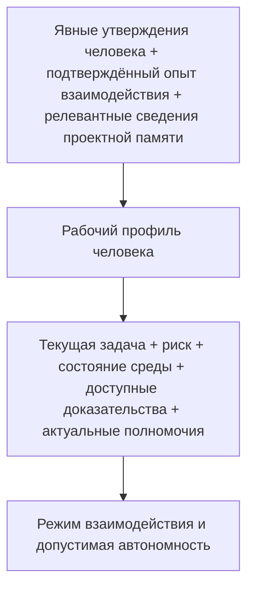

# Профиль человека и адаптивная автономность

> **Версия:** `0.3.1`  
> **Статус:** на обсуждении

## Содержание

- [10.1. Рабочий профиль человека в управляемом взаимодействии с ИИ](#101-рабочий-профиль-человека-в-управляемом-взаимодействии-с-ии)
- [10.2. Состав рабочего профиля человека](#102-состав-рабочего-профиля-человека)
- [10.3. Экспертность, способность выполнить задачу и способность проверить результат](#103-экспертность-способность-выполнить-задачу-и-способность-проверить-результат)
- [10.4. Происхождение, достоверность, актуальность и жизненный цикл рабочего профиля](#104-происхождение-достоверность-актуальность-и-жизненный-цикл-рабочего-профиля)
- [10.5. Автономность как многомерный профиль](#105-автономность-как-многомерный-профиль)
- [10.6. От чего зависит допустимая автономность](#106-от-чего-зависит-допустимая-автономность)
- [10.7. Прогрессивное делегирование, отзыв и истечение автономности](#107-прогрессивное-делегирование-отзыв-и-истечение-автономности)
- [10.8. Человеческое внимание и пропускная способность проверки](#108-человеческое-внимание-и-пропускная-способность-проверки)
- [10.9. Общее рабочее понимание человека и агента](#109-общее-рабочее-понимание-человека-и-агента)
- [10.10. Адаптация взаимодействия под человека](#1010-адаптация-взаимодействия-под-человека)
- [10.11. Профиль автономности задачи и основные антипаттерны](#1011-профиль-автономности-задачи-и-основные-антипаттерны)

## 10.1. Рабочий профиль человека в управляемом взаимодействии с ИИ

В предыдущих главах CHLOYA человек рассматривался прежде всего как участник управляющего контура: он задаёт цели, устанавливает допустимые границы, принимает существенные решения, оценивает результат и при необходимости вмешивается в работу ИИ. Для архитектурного описания этого достаточно лишь до определённого уровня. В реальном процессе понятие «человек» слишком обобщённо, чтобы на его основании определять форму взаимодействия и допустимую самостоятельность ИИ.

Формальное присутствие человека в контуре не означает, что он способен содержательно выполнить возложенную на него функцию. Один специалист может хорошо понимать предметную область, но не знать устройство конкретной программной системы. Другой способен проверить реализацию, но не уполномочен принимать связанный с ней бизнес-риск. Владелец продукта может иметь право определить требуемое поведение системы, но не обладать знаниями для независимой оценки криптографической реализации. Разработчик, уверенно работающий с прикладным кодом, не обязательно способен проверить решение в области сетевой безопасности, бухгалтерского учёта или права.

Поэтому роль, полномочие и фактическая способность участвовать в решении должны рассматриваться раздельно. Глава 7 уже отделяет роль участника от его технических возможностей и предоставленных полномочий. В настоящей главе к этому добавляется ещё одно измерение — характеристики конкретного человека, существенные для определённого класса совместной работы с ИИ.

Для их представления CHLOYA использует понятие **[рабочего профиля человека][g-human-work-profile]**.

**[Рабочий профиль человека][g-human-work-profile]** — это ограниченное, проверяемое и изменяемое представление характеристик человека, имеющих значение для конкретного класса совместной работы с ИИ: понимания задачи, оценки альтернатив, проверки результата, принятия решения и организации взаимодействия.

Такой профиль не является описанием личности человека в целом. CHLOYA не требует построения психологического портрета, оценки интеллекта, характера, темперамента или иных свойств, не имеющих непосредственного отношения к выполняемой работе. Он также не должен превращаться в универсальный рейтинг пользователя, социальную оценку либо долговременное досье, из которого система автоматически выводит допустимые действия.

Объектом профиля являются только свойства, для которых существует практическая связь с конкретным взаимодействием.

Например, существенным может быть знание человеком архитектуры проекта, опыт эксплуатации определённой СУБД, способность проверить изменение программного интерфейса, знакомство с предметной областью, понимание последствий миграции данных либо ранее явно сформулированные критерии выбора между допустимыми решениями. Эти сведения имеют различную область применимости. Способность человека содержательно проверить изменение PostgreSQL ничего не говорит о его способности оценить криптографический протокол. Знакомство с одним проектом не переносится автоматически на другой.

Поэтому CHLOYA не рассматривает такие характеристики, как «эксперт», «начинающий», «технический пользователь» или «доверенный пользователь», в качестве достаточного описания человека. Подобные обозначения могут быть удобны в разговорной речи, но слишком грубы для управления автономностью. Для инженерного процесса важнее ответить на более конкретный вопрос: **какую функцию этот человек способен содержательно выполнять относительно данного решения и при каких условиях?**

Это различие особенно важно для человеческого контроля. Исследования человеческого надзора показывают, что само включение человека в цепочку принятия решения не обеспечивает содержательного контроля. Для него необходимы как минимум доступ к существенной информации, способность понять объект решения, возможность вмешаться и реальные полномочия повлиять на дальнейшее действие системы [18], [19], [225], [226]. Если человек лишь формально нажимает кнопку подтверждения, не имея достаточного основания для самостоятельной оценки, наличие человеческого участника создаёт скорее видимость контроля, чем дополнительную гарантию.

[Рабочий профиль][g-human-work-profile] необходим не для того, чтобы определить ценность человека или степень доверия к нему, а для того, чтобы не назначать ему функции, которые он не способен содержательно выполнять, и не строить автономность ИИ на неверном предположении о человеческом контроле.

При этом способность человека выполнять работу, способность понимать её устройство, способность проверять результат и полномочие принять окончательное решение не являются одним и тем же свойством. Человек может не уметь вручную создать весь результат, который способен создать ИИ, но сохранять достаточное понимание системы для оценки её назначения, границ, инвариантов, зависимостей, способов отказа и условий безопасного восстановления. И наоборот, способность самостоятельно выполнить техническую операцию ещё не означает права единолично принять связанные с ней организационные или рискованные решения.

Более подробное различение этих способностей рассматривается далее, однако уже на уровне определения профиля важно отказаться от предположения, что компетентность является одной универсальной величиной.

[Рабочий профиль][g-human-work-profile] включает не только сведения о знаниях и способностях человека. В совместной работе существенными могут быть и **критерии принятия решений**, которые человек явно использует при выборе между несколькими допустимыми вариантами.

Например, при выборе технологии значимыми могут оказаться переносимость, простота сопровождения, доступность специалистов и способность владельца проекта самостоятельно понимать создаваемый код. При выборе имени открытого стандарта существенными могут стать произносимость, возможность однозначно восстановить написание на слух, международная воспринимаемость, отсутствие значимых конфликтов и характер возникающих культурных ассоциаций.

Такие критерии нельзя считать неизменными или универсальными предпочтениями человека. Они существуют внутри определённого класса решений и могут пересматриваться по мере появления новой информации.

Это хорошо видно на итеративном поиске имени формата. Отдельная ассоциация первоначально могла рассматриваться как потенциальный недостаток, но после обсуждения была переосмыслена человеком как допустимое или даже полезное свойство будущего бренда. В такой ситуации агент не должен продолжать использовать собственную первоначальную интерпретацию как установленный факт. Явное уточнение человека изменяет основание дальнейшего поиска.

Отсюда следует принцип CHLOYA:

> **Машинный вывод о предпочтении, критерии или способности человека является предположением, пока не получил достаточного подтверждения, и должен уступать явно выраженной человеческой коррекции, если она не противоречит обязательным правилам проекта.**

Это положение необходимо для адаптивного взаимодействия. ИИ неизбежно будет выявлять повторяющиеся закономерности в решениях человека: какие объяснения ему обычно необходимы, какие варианты он отвергает, какие свойства считает существенными, в каких областях самостоятельно проверяет результат, а где запрашивает дополнительное подтверждение. Такие наблюдения могут уменьшать количество повторяющихся согласований и повышать качество совместной работы.

Однако способность делать выводы из истории взаимодействия создаёт и противоположный риск. Единичное решение может быть ошибочно превращено в постоянное предпочтение. Локальный критерий — перенесён на совершенно другую область. Ранее справедливое наблюдение — продолжать использоваться после изменения опыта, проекта или целей человека. Поэтому профиль должен оставаться не накоплением неизменяемых характеристик, а системой утверждений с известным происхождением, областью применимости и возможностью пересмотра. Эти свойства подробно рассматриваются в § 10.4.

История предыдущих решений также не должна механически ограничивать дальнейшую работу.

Если вариант уже был исследован и отвергнут по известной причине, агенту не следует снова предлагать его как новый только потому, что очередной локальный поиск снова обнаружил привлекательные свойства этого варианта. Такое поведение заставляет человека повторно выполнять уже выполненную мыслительную работу и показывает потерю преемственности взаимодействия.

Но противоположная крайность столь же нежелательна. Ранее отклонённый вариант не должен становиться запрещённым навсегда. Если изменились требования, исчез прежний недостаток или появилось новое существенное основание, агент может вернуть вариант в рассмотрение, явно указав, почему прежнее решение стало предметом пересмотра.

Таким образом, [рабочий профиль][g-human-work-profile] и история взаимодействия должны обеспечивать **преемственность без окостенения**: предыдущие решения сохраняют значение, пока сохраняются основания этих решений.

Этот принцип распространяется не только на отдельные предложения, но и на стратегию совместного поиска.

Адаптация к человеку не должна сводиться к изменению длины ответа, количества технических подробностей или формы объяснения. По мере накопления совместного контекста может изменяться сам характер работы: ширина пространства рассматриваемых вариантов, глубина исследования отдельных направлений, необходимость возвращения к уже отвергнутым альтернативам, количество промежуточных вопросов и момент завершения поиска.

В начале исследовательской задачи широкий поиск может быть полезен. После выявления устойчивых критериев пространство вариантов целесообразно сокращать. После принятия решения задача может перейти из режима поиска в режим проверки, фиксации и реализации. Продолжение свободной генерации альтернатив после такого перехода способно ухудшать работу, даже если каждая отдельная альтернатива сама по себе выглядит разумной.

Поэтому состояние человеческого решения становится частью совместного процесса. Агент должен различать по меньшей мере ситуации, когда решение ещё исследуется, когда критерии уже стабилизировались, когда требуется сравнение оставшихся вариантов и когда решение принято настолько, что дальнейший поиск имеет смысл только при появлении нового существенного основания.

Такое приспособление взаимодействия не даёт ИИ дополнительных полномочий.

[Рабочий профиль человека][g-human-work-profile] не является источником прав ни для самого человека, ни для агента. Высокая компетентность пользователя не разрешает агенту обходить установленную политику, получать доступ к продуктивной среде, отменять обязательную независимую проверку или самостоятельно расширять область переданной задачи. Аналогично история успешной совместной работы не должна превращаться в универсальное основание для увеличения полномочий.

Полномочия, технические возможности, риск действия и [рабочий профиль][g-human-work-profile] относятся к разным слоям управления. Профиль может изменить способ взаимодействия внутри установленной границы, но не должен незаметно изменять саму границу.

Это позволяет провести принципиальное различие между **адаптацией взаимодействия** и **ослаблением гарантий**.

Эксперту может требоваться меньше вводных объяснений и больше непосредственных технических свидетельств. Человеку, плохо знакомому с конкретной областью, может понадобиться дополнительное объяснение последствий или участие другого специалиста. Но обязательная проверка не должна исчезать только потому, что профиль характеризует пользователя как опытного. Если политика требует независимого подтверждения критического свойства, [рабочий профиль][g-human-work-profile] определяет форму участия человека, а не отменяет само требование.

Тем самым профиль человека является одним из входов для адаптивной автономности, но не единственным и не главным источником разрешения. Допустимая самостоятельность должна учитывать одновременно свойства задачи, риск, неопределённость, обратимость действия, возможность независимой проверки, состояние среды, доступные доказательства и характеристики участников, способных принять или проверить конкретное решение.

Исследования [регулируемой автономности][g-adjustable-autonomy] давно показывают, что степень самостоятельности системы целесообразно изменять в зависимости от ситуации, а не задавать единственным постоянным уровнем [20], [236]. Для CHLOYA эта логика дополняется человеческой стороной: одинаковая техническая задача может требовать разной формы взаимодействия с различными людьми, но требования к безопасности и подтверждаемым свойствам результата при этом не должны произвольно меняться.

[Рабочий профиль][g-human-work-profile] также связан с проблемой общего понимания между человеком и ИИ. Совместная работа требует не только доступа к одинаковым фактам, но и достаточного совпадения в понимании цели, критериев, ограничений и значения существенных фактов для текущего решения. Исследования человеко-агентного взаимодействия рассматривают формирование такого общего основания как отдельный механизм сотрудничества [445], а современные исследования поведения программных агентов показывают, что разработчики ожидают от них не только технического выполнения задачи, но и соблюдения процессов, требований качества и норм совместной работы [444].

Поэтому адаптация должна уменьшать ненужную коммуникацию, но не устранять необходимое согласование смысла. Чем лучше агент понимает [рабочий профиль человека][g-human-work-profile] и историю принятых решений, тем меньше необходимости повторно обсуждать уже установленные критерии. Но если обнаружено существенное расхождение в понимании цели, ограничения или последствия действия, прошлое успешное взаимодействие не является основанием для молчаливого предположения.

CHLOYA тем самым рассматривает человека не как постоянный параметр системы и не как универсальный источник истины. Его знания изменяются, опыт накапливается и может устаревать, критерии пересматриваются, знакомство с проектом углубляется или утрачивается, а область содержательной проверки зависит от конкретной задачи.

Поэтому [рабочий профиль][g-human-work-profile] является **локальным, изменяемым и предметно ограниченным представлением**, используемым только там, где характеристики человека действительно влияют на организацию совместной работы.

Основной принцип главы можно сформулировать следующим образом:

> **CHLOYA адаптирует взаимодействие не к предполагаемой личности человека, а к подтверждаемым условиям совместной работы: его релевантным знаниям, способности понимать и проверять конкретный класс решений, явно выраженным критериям выбора, установленным полномочиям и истории корректировок совместного процесса.**

Такой подход позволяет избежать двух противоположных крайностей. С одной стороны, человек не рассматривается как одинаковый универсальный контролёр для любой задачи. С другой — ИИ не получает право самостоятельно создавать непрозрачную модель личности и на её основании менять границы допустимых действий.

[Рабочий профиль][g-human-work-profile] служит не для оценки человека, а для более точного устройства совместной работы. В следующих разделах рассматриваются его состав, связь между экспертностью и [контрольной компетентностью][g-control-competence], происхождение и актуальность сведений профиля, а затем — то, как профиль человека вместе со свойствами задачи, риском и доступными доказательствами участвует в формировании адаптивной автономности.

[К содержанию](#содержание)

## 10.2. Состав рабочего профиля человека

В предыдущем разделе [рабочий профиль человека][g-human-work-profile] был определён как ограниченное и изменяемое представление тех характеристик человека, которые имеют значение для совместной работы с ИИ. Из этого определения не следует, что методология должна заранее собирать максимально подробные сведения о пользователе. Напротив, ценность профиля определяется не полнотой описания человека, а тем, насколько содержащиеся в нём сведения помогают организовать конкретную работу, не создавая лишних предположений и не расширяя область профилирования без необходимости.

Поэтому [рабочий профиль][g-human-work-profile] строится по принципу **минимально достаточного представления**. В него включаются только те характеристики, которые способны изменить постановку задачи, способ представления вариантов, возможность содержательной проверки, необходимость дополнительного согласования либо допустимый режим взаимодействия. Сведения, не имеющие такой связи, не должны собираться только потому, что технически их можно получить.

Это отличает [рабочий профиль][g-human-work-profile] от универсального пользовательского досье.

Для CHLOYA существенно не то, кем человек является вообще, а то, **какие функции он способен содержательно выполнять относительно конкретного класса решений**. Один и тот же человек может обладать высокой компетентностью в эксплуатации базы данных, ограниченным опытом разработки её внутренних расширений и практически не иметь оснований для независимой оценки криптографической схемы. Сведение всех этих различий к одной категории «эксперт» уничтожает именно ту информацию, ради которой профиль вводится.

Поэтому профиль должен быть многомерным и предметно ограниченным.

Одним из его оснований является **предметная компетентность** — понимание самой области, в которой возникает решение. Она может относиться к устройству бизнеса, правилам предметной модели, эксплуатации инфраструктуры, информационной безопасности, пользовательскому опыту, правовым ограничениям или другой области, существенной для конкретной задачи.

Предметная компетентность не тождественна техническому владению инструментом. Человек может глубоко понимать эксплуатацию PostgreSQL, особенности резервного копирования и восстановления, но не разрабатывать компоненты ядра СУБД. Аналогично специалист может хорошо владеть языком программирования и при этом не понимать предметных последствий изменения финансового алгоритма.

Поэтому отдельно рассматривается **техническая компетентность** — способность работать с определёнными технологиями, инструментами, архитектурными механизмами и способами реализации.

Даже такое разделение ещё недостаточно. Знание технологии не означает знания конкретного проекта.

Опытный специалист способен впервые увидеть систему, в которой действуют неизвестные ему архитектурные компромиссы, исторические ограничения и локальные правила. В то же время человек с менее широкой профессиональной подготовкой может много лет сопровождать конкретный проект и знать причины решений, которые внешнему эксперту покажутся случайными или ошибочными.

Поэтому самостоятельным компонентом [рабочего профиля][g-human-work-profile] является **знакомство с проектом**.

Знакомство с проектом характеризует не объём сведений, хранящихся о системе, а способность человека использовать их в работе: понимать архитектурные связи, узнавать уже рассмотренные варианты, учитывать известные ограничения, сопоставлять новое изменение с предыдущими решениями и замечать ситуации, в которых формально корректное предложение противоречит накопленному устройству проекта.

При этом сами проектные знания не должны копироваться в [рабочий профиль][g-human-work-profile]. Архитектура, история решений, причины отказа от альтернатив и действующие ограничения относятся к проектной памяти и управлению контекстом. Профиль фиксирует только релевантную характеристику человека — например, достаточную знакомость с определённой областью проекта для участия в конкретном решении.

Такое разделение предотвращает появление второго параллельного хранилища проектного знания внутри пользовательского профиля.

Особое место занимает уже введённая в CHLOYA **[контрольная компетентность][g-control-competence]** — совокупность актуальных знаний, технического понимания и практического опыта, достаточных для независимой оценки решения или результата ИИ в определённом классе задач.

[Контрольная компетентность][g-control-competence] не выводится автоматически из способности человека выполнить похожую работу. Между созданием результата и его проверкой существует сложная зависимость. В одних задачах проверка существенно проще создания: человек может не воспроизвести весь результат вручную, но достаточно хорошо понимать его свойства, ограничения и критерии корректности. В других областях содержательная проверка требует почти той же глубины знания, что и самостоятельная реализация.

Поэтому [рабочий профиль][g-human-work-profile] должен позволять фиксировать [контрольную компетентность][g-control-competence] отдельно от исполнительной способности.

Именно она особенно важна там, где человек включается в процесс как проверяющий или принимающий результат. Исследования [содержательного человеческого контроля][g-meaningful-human-control] показывают, что формального присутствия человека недостаточно: он должен иметь знания, доступ к существенной информации, возможность понять объект решения и способность реально повлиять на дальнейшее действие системы [225], [226].

[Рабочий профиль][g-human-work-profile] не должен подменять такую оценку должностью, стажем или самоописанием человека.

Например, запись «старший разработчик» практически ничего не говорит о способности независимо проверить изменение конкретной схемы аутентификации. Аналогично большой стаж эксплуатации одной версии технологии не гарантирует актуальной компетентности относительно существенно изменившегося инструмента. Подробно проблема различия экспертности, способности выполнить работу, понять её и проверить результат рассматривается в следующем разделе.

Кроме способностей человека, для совместной работы важны **критерии принятия решений**.

Во многих инженерных задачах существует несколько технически допустимых вариантов, и выбор между ними не может быть полностью выведен из формальной корректности. Существенными становятся стоимость сопровождения, обратимость, сложность реализации, переносимость, доступность специалистов, скорость разработки, прозрачность устройства, возможность независимой проверки и другие свойства.

Состав и значимость таких критериев зависят от класса решения.

Например, при выборе технологии для небольшого проекта способность владельца самостоятельно понимать и проверять код может оказаться существеннее предельной производительности. Для инфраструктурного компонента на первый план могут выйти предсказуемость поведения, зрелость инструмента и возможность восстановления. Для имени открытого международного стандарта значимыми могут стать произносимость, восстановимость написания на слух, естественность расшифровки, культурные ассоциации и отсутствие конфликтов в релевантной области.

Следовательно, полезное представление критерия должно сохранять область его применения.

Формулировка «человек предпочитает Python» слишком широка и почти неизбежно приведёт к неправильному переносу прошлого выбора на новую задачу. Гораздо содержательнее утверждение, что в определённом классе небольших поддерживаемых лично проектов возможность владельца читать и проверять реализацию считается существенным критерием выбора технологии.

Это различие позволяет использовать накопленную историю решений, не превращая её в набор вечных предпочтений.

[Рабочий профиль][g-human-work-profile] также может содержать **параметры взаимодействия**, если они действительно влияют на эффективность совместной работы.

Одному человеку удобнее сначала видеть общую конструкцию решения, а затем раскрывать технические детали. Другому требуется сравнение нескольких альтернатив перед существенным архитектурным выбором. В одном процессе полезны частые промежуточные контрольные точки, в другом они создают ненужные прерывания. Некоторые сведения лучше сразу представлять в форме доказательств и конкретных изменений, другие — предварять объяснением последствий.

Однако здесь особенно важно не смешивать индивидуальную адаптацию и общие требования корректной работы.

Например, повторное предложение ранее отклонённого варианта без новых оснований является не просто нарушением пользовательского предпочтения. Это более общий дефект преемственности совместного процесса. Аналогично необходимость явно обозначить существенную неопределённость не должна исчезать только потому, что конкретный человек обычно предпочитает краткие ответы.

Поэтому в [рабочий профиль][g-human-work-profile] включаются только индивидуально значимые параметры взаимодействия, тогда как общие требования к качеству, безопасности, происхождению сведений и сохранению решений остаются правилами методологии и проекта.

Отдельно от [рабочего профиля][g-human-work-profile] должны существовать **полномочия** человека.

Компетентность и полномочие отвечают на разные вопросы.

[Рабочий профиль][g-human-work-profile] позволяет установить, способен ли человек содержательно понять, проверить или оценить определённый объект. [Профиль полномочий][g-permission-profile] и управляющие правила определяют, вправе ли этот человек принимать соответствующее решение.

Эти свойства могут совпадать, но одно не следует из другого.

Специалист может обладать достаточной технической компетентностью для оценки изменения, но не иметь права разрешить его применение в рабочей среде. Владелец продукта может быть уполномочен принять определённый бизнес-риск, но не обладать [контрольной компетентностью][g-control-competence] для самостоятельной проверки технических предпосылок этого решения.

Поэтому CHLOYA не должна хранить права доступа или полномочия как неотъемлемое свойство [рабочего профиля человека][g-human-work-profile].

Связь возможна только через актуальное состояние управляющего контура:

**[рабочий профиль][g-human-work-profile] отвечает на вопрос о способности участия; [профиль полномочий][g-permission-profile] — о праве принять или выполнить решение.**

Это разграничение особенно важно для долговременной работы. Компетентность может сохраняться после изменения должности, тогда как полномочия уже отозваны. И наоборот, назначение человека на новую роль способно предоставить ему организационное право принять решение, не создавая автоматически компетентности для самостоятельной проверки всех технических аспектов.

Наряду с относительно устойчивыми характеристиками существует **текущее состояние участия**, которое не следует автоматически превращать в постоянную характеристику профиля.

Человек может обладать достаточной компетентностью, но не иметь в конкретный момент времени возможности провести содержательную проверку. Причиной может быть недостаток времени, высокая текущая нагрузка, длительный перерыв в работе с определённой технологией, отсутствие доступа к необходимым данным либо собственное указание человека на то, что в текущем состоянии он не готов принимать определённый класс решений.

Такое состояние имеет прямое значение для совместной работы, но его область действия ограничена конкретной ситуацией.

Например, высказывание «я давно не работал с этой версией Kubernetes и не готов сейчас независимо подтвердить архитектурное решение» не должно превращаться в долговременное утверждение «человек не знает Kubernetes». Оно должно временно повлиять на текущий контур проверки и при необходимости привести к привлечению другого специалиста, дополнительным доказательствам или снижению автономности.

Это различие связывает [рабочий профиль][g-human-work-profile] с будущим рассмотрением человеческого внимания и пропускной способности проверки: наличие компетенции ещё не означает наличия достаточного ресурса для её применения в конкретный момент.

[Рабочий профиль][g-human-work-profile] также не является журналом взаимодействий.

История диалогов, обсуждавшиеся варианты, принятые решения, причины отклонения альтернатив и зафиксированные ограничения относятся к проектной памяти, истории задачи или другому соответствующему источнику. Переносить всё это содержимое в профиль человека означало бы создавать дублирующее хранилище с быстро растущим объёмом и неясным статусом.

Профиль должен содержать только **релевантные обобщения**, полученные из таких источников.

Например, решение об использовании имени IMXO относится к состоянию проекта. История ранее исследованных и отвергнутых имён относится к истории решения. А подтверждённое наблюдение о том, что для этого класса нейминговых задач существенны произносимость и восстановимость написания, может стать элементом [рабочего профиля][g-human-work-profile], если эта информация действительно нужна для последующего поиска.

При этом происхождение такого обобщения должно оставаться прослеживаемым. Профиль не должен превращать наблюдение агента в безымянный факт о человеке.

Полезно поэтому различать три уровня:

**исходное событие или утверждение -> обобщение, относящееся к человеку -> применение этого обобщения в новой задаче.**

Каждый переход способен внести ошибку.

Человек мог изменить мнение. Агент мог неверно понять причину решения. Новый случай может оказаться похожим лишь внешне. Поэтому подробные правила происхождения, подтверждения, актуальности и пересмотра элементов [рабочего профиля][g-human-work-profile] рассматриваются отдельно в § 10.4.

Для состава профиля достаточно зафиксировать, что элемент без известной области применимости и основания происхождения не должен использоваться как надёжная характеристика человека.

Отсюда следует ещё одно ограничение: профиль не следует заранее детализировать до максимально возможного уровня.

Формально можно создать огромную матрицу знаний человека по версиям технологий, отдельным механизмам, операциям и типам решений. Такое представление быстро станет неподдерживаемым, а его кажущаяся точность будет выше реальной достоверности.

Противоположная крайность — единая запись вида «PostgreSQL: эксперт» — также недостаточна.

Поэтому детализация [рабочего профиля][g-human-work-profile] должна быть **соразмерна решению**, для которого профиль используется.

Если задача касается резервного копирования PostgreSQL, может оказаться достаточно установить наличие актуальной [контрольной компетентности][g-control-competence] в соответствующей эксплуатационной области. Если возникает вопрос об устройстве внутреннего расширения на C, требуется уже другая характеристика. Нет необходимости заранее раскладывать всю профессиональную область на сотни потенциальных подобластей, пока это не влияет на реальное решение.

CHLOYA тем самым использует принцип **ленивой детализации профиля**: уточнение выполняется тогда, когда существующего уровня представления становится недостаточно для организации конкретной работы.

Такой подход одновременно уменьшает объём поддерживаемых данных и ограничивает ненужное профилирование.

Логическую связь рабочего профиля с остальной архитектурой CHLOYA можно представить следующим образом:

Эта схема не означает, что [рабочий профиль][g-human-work-profile] автоматически вычисляется из всей истории пользователя. Она показывает разделение ответственности между слоями.

Проектная память отвечает за сохранение состояния проекта и истории решений. Управление контекстом — за отбор и происхождение используемых сведений. Управляющий контур — за полномочия и границы действий. [Рабочий профиль][g-human-work-profile] представляет только те характеристики конкретного человека, которые нужны для совместной работы в данном классе задач.

Таким образом, в составе [рабочего профиля][g-human-work-profile] могут присутствовать сведения о предметной и технической компетентности, знакомстве с конкретным проектом, [контрольной компетентности][g-control-competence], релевантных критериях решений и индивидуально значимых параметрах взаимодействия. Однако ни один из этих компонентов не является обязательным сам по себе. Необходимость конкретного элемента определяется тем, влияет ли его отсутствие на качество совместной работы или выбор допустимого режима автономности.

Отсюда следуют два основных ограничения.

Во-первых, **свойство профиля не должно распространяться за пределы области, для которой существуют основания его применять**. Компетентность в одной технологии, критерий одного класса решений или предпочтительный способ взаимодействия не переносятся автоматически на другую область.

Во-вторых, **профиль не должен быть подробнее, чем требуется для текущего класса совместной работы**. Чем больше сведений система пытается вывести о человеке без практической необходимости, тем выше риск ложных обобщений, устаревания и превращения рабочего механизма в непрозрачное профилирование.

Поэтому [рабочий профиль][g-human-work-profile] в CHLOYA строится не вокруг вопроса «что система знает об этом человеке?», а вокруг более узкого вопроса:

> **Какие подтверждённые сведения о человеке необходимы, чтобы правильно организовать именно эту совместную работу и не поручить ему или ИИ функцию на основании ложного предположения?**

Такое представление создаёт основу для последующего определения адаптивной автономности, но само по себе её ещё не задаёт. Прежде необходимо подробнее разобрать наиболее сложный компонент профиля — человеческую компетентность и различие между способностью выполнить работу, понять её, проверить результат и принять соответствующее решение.

[К содержанию](#содержание)

## 10.3. Экспертность, способность выполнить задачу и способность проверить результат

[Рабочий профиль человека][g-human-work-profile] не может строиться вокруг одного общего признака экспертности. Формулировки вроде «опытный разработчик», «эксперт по PostgreSQL» или «нетехнический пользователь» слишком грубы для определения того, какую функцию человек способен содержательно выполнять в совместной работе с ИИ.

Экспертность всегда имеет область применимости. Специалист может глубоко понимать эксплуатацию PostgreSQL, восстановление после отказов и устройство репликации, но не заниматься разработкой внутренних расширений СУБД. Опытный прикладной разработчик может уверенно проверять программную логику и одновременно не обладать достаточной подготовкой для независимой оценки криптографического протокола. Знание языка программирования также не означает понимания предметной области, в которой используется написанный на нём код.

Поэтому CHLOYA не рассматривает экспертность как универсальное свойство человека и тем более как числовой уровень, автоматически распространяющийся на новые задачи. Она может служить одним из оснований для предположения о способностях человека, но сами способности необходимо рассматривать относительно конкретного класса работы.

Для этого важно различать по меньшей мере четыре разных свойства:

**способность выполнить задачу** — возможность самостоятельно получить требуемый результат;

**[операционное понимание][g-operational-understanding]** — достаточное понимание назначения, границ, существенных зависимостей, инвариантов, основных режимов отказа, способов проверки и восстановления системы;

**[контрольную компетентность][g-control-competence]** — способность независимо оценить решение или результат и обнаружить существенное несоответствие;

**полномочие принять решение** — право утвердить результат, принять связанный с ним риск либо разрешить переход к следующему состоянию.

Эти свойства могут быть связаны между собой, но ни одно из них не должно автоматически выводиться из другого.

Человек, способный самостоятельно выполнить работу, обычно располагает значительной частью знаний, необходимых для её проверки, однако даже это не гарантирует достаточной [контрольной компетентности][g-control-competence] во всех аспектах результата. Исполнитель может хорошо владеть реализацией, но не понимать отдельные последствия для безопасности, эксплуатации или предметной области.

Обратная зависимость ещё менее однозначна. Человек способен содержательно проверить некоторые результаты, хотя не смог бы быстро воспроизвести их самостоятельно. Он может понимать требуемое поведение, знать критические инварианты, распознавать нарушение архитектурной границы и иметь достаточные средства проверки, не создавая при этом весь артефакт вручную.

Именно поэтому требование «человек должен уметь сам сделать всё, что делает ИИ» было бы чрезмерным. Оно фактически уничтожило бы значительную часть пользы автоматизации.

Но противоположное допущение — «ИИ создаст, а человек всегда сможет проверить» — столь же ошибочно.

Для ряда задач содержательная проверка требует почти той же глубины профессионального знания, что и самостоятельное выполнение. Человек, не понимающий криптографических свойств протокола, не становится компетентным проверяющим только потому, что способен прочитать сгенерированное ИИ объяснение. Аналогично понимание синтаксиса программы ещё не означает способности обнаружить ошибочную финансовую, медицинскую или юридическую логику.

Поэтому человеческая проверка должна рассматриваться как самостоятельная способность, а не как автоматически доступная функция любого участника процесса.

Исследования [содержательного человеческого контроля][g-meaningful-human-control] подтверждают важность такого различения. Cavalcante Siebert et al. связывают содержательный контроль не просто с присутствием человека, а с условиями, при которых человек действительно способен воздействовать на систему и нести соответствующую функцию [184]. Sterz et al. показывают, что эффективный надзор зависит от реального доступа к необходимой информации, возможности понять происходящее и способности повлиять на результат [225]. Аналогичную проблему рассматривают van de Sande et al., подчёркивая, что формальная схема «человек в контуре» сама по себе не гарантирует содержательности человеческого надзора [226].

Для CHLOYA отсюда следует принцип:

> **Человеку должна назначаться не абстрактная роль проверяющего, а такая функция контроля, для которой существуют достаточные основания считать его способным выполнить именно эту проверку.**

Это положение не требует превращать каждую совместную работу в экзамен человеческой квалификации. Оно требует более узкой осторожности: система не должна считать человеческое подтверждение полноценным доказательством только потому, что подтверждение было получено.

Особое значение здесь имеет **[операционное понимание][g-operational-understanding]**.

По мере развития ИИ человек может перестать непосредственно выполнять значительную часть низкоуровневой работы. Это не обязательно означает потерю содержательного владения системой. Возможна ситуация, в которой человек уже не пишет большую часть конкретного кода вручную, но сохраняет достаточную модель системы для осмысленного управления её изменениями.

Такое понимание включает не знание каждой строки реализации, а способность ответить на вопросы более высокого уровня: зачем существует компонент, где проходят его границы, какие свойства не должны нарушаться, от чего он зависит, каким образом может отказать, как проверить изменение и как вернуть систему в безопасное состояние.

В этом смысле [операционное понимание][g-operational-understanding] является промежуточным уровнем между полным воспроизведением работы и поверхностным знакомством с результатом.

Оно позволяет человеку сохранять содержательную роль даже тогда, когда непосредственное исполнение частично передано ИИ.

Однако [операционное понимание][g-operational-understanding] не является универсальной заменой глубокой профессиональной компетентности. Для одних классов решений понимания внешних свойств, инвариантов и проверочных механизмов достаточно. Для других оценка существенного риска требует знания внутреннего устройства. Поэтому требуемая глубина человеческого понимания определяется не абстрактным желанием «держать человека в курсе», а тем, какое решение ему предстоит принять и какие свойства результата он должен подтвердить.

Из этого следует ещё одно важное различие:

> **способность понимать результат не равна способности проверить его корректность.**

Человек может хорошо понимать объяснение архитектуры, видеть общую логику предложенного решения и при этом не иметь оснований для независимого заключения о его безопасности или корректности.

Генеративный ИИ делает такую подмену особенно опасной, поскольку способен одновременно создать решение и убедительно объяснить, почему оно является правильным.

Схема

**ИИ создаёт решение -> ИИ объясняет решение -> человек принимает объяснение того же ИИ как подтверждение корректности**

не создаёт независимой проверки.

Исследования взаимодействия человека с ИИ также не позволяют считать объяснение универсальным средством против некритического следования рекомендации. Chen et al. показали, что влияние объяснений зависит от их формы и способности человека сопоставить полученное объяснение со своими знаниями [258]. Cecil et al. в серии экспериментов обнаружили, что наличие объяснений не устранило негативное влияние ошибочных рекомендаций ИИ на человеческие решения [261].

Для CHLOYA поэтому действует более узкий вывод:

> **Объяснение может улучшать понимание результата, но само по себе не создаёт [контрольную компетентность][g-control-competence] и не является независимым доказательством правильности объясняемого решения.**

Человек должен иметь возможность не только понять аргументацию, но и оспорить её, проверить через независимый источник, применить собственные знания либо воспользоваться другим механизмом проверки.

При этом автоматизированные доказательства способны существенно изменить характер человеческой работы.

Если ИИ передаёт человеку большой объём созданного кода без дополнительных свидетельств, значительная часть нагрузки приходится на ручное восстановление логики и поиск возможных ошибок. Если вместе с результатом доступны воспроизводимые тесты, статический анализ, проверка контрактов, сравнение с исходным состоянием и другие независимые свидетельства, объект человеческой проверки изменяется.

Человеку уже не обязательно вручную перепроверять каждое низкоуровневое свойство, если оно действительно подтверждается соответствующим механизмом. Его задача может сместиться к вопросам более высокого уровня: правильно ли сформулировано проверяемое свойство, соответствует ли оно исходному намерению, достаточна ли область действия доказательства и какие существенные риски остаются непроверенными.

Таким образом:

> **Автоматизированное доказательство не устраняет человеческую компетентность, а может переносить её с повторного выполнения низкоуровневой проверки на оценку постановки, достаточности и области действия доказательств.**

Это положение связывает [рабочий профиль человека][g-human-work-profile] с уже введённой в CHLOYA архитектурой доказательств и проверяемой готовности. Чем больше свойств результата может быть подтверждено воспроизводимыми механизмами, тем меньше необходимости делать человеческий обзор единственным основанием корректности. Но автоматизация проверки не создаёт права считать доказанными свойства, которые конкретный механизм фактически не проверяет.

Исследования также показывают, что предметная подготовка человека влияет на характер его взаимодействия с ИИ. В эксперименте Dikmen и Burns дополнительное предметное знание влияло на способность участников различать ситуации, в которых рекомендации системы заслуживали различной степени доверия [257]. Peng et al. обнаружили взаимодействие между подготовленностью пользователя и возможностями ИИ, причём влияние опыта человека на совместный результат оказалось сложнее простого правила «чем опытнее пользователь, тем лучше» [260].

Это ещё раз показывает, почему [рабочий профиль][g-human-work-profile] не должен сводиться к одной шкале экспертности.

Дополнительную проблему создаёт самооценка.

Человек может считать себя компетентным в некоторой области и переоценивать собственную способность к независимой проверке. Возможна и обратная ситуация — специалист недооценивает свои знания и передаёт ИИ решение, которое мог бы содержательно контролировать сам. Grawitch, Winton и Mudigonda показывают, что субъективно воспринимаемая собственная компетентность способна влиять на использование рекомендаций ИИ даже тогда, когда она не совпадает с фактическим знанием [262].

Поэтому утверждение человека о собственной экспертности является полезным входным сведением, но не универсальным доказательством [контрольной компетентности][g-control-competence].

Аналогично должность, образование, сертификат, стаж и количество выполненных проектов могут быть основаниями для оценки профиля, однако ни один такой признак сам по себе не подтверждает способность проверить конкретное решение.

Исследование Perry et al. дополнительно показывает опасность уверенности в результате при использовании ИИ: в рассмотренных ими заданиях участники с ИИ-помощником не только создавали менее безопасный код, но и чаще оценивали свой результат как безопасный [74]. Этот результат относится к ограниченному набору задач и не должен интерпретироваться как универсальный эффект ИИ-помощников, однако он хорошо иллюстрирует общий риск: субъективная уверенность человека не равна доказанной корректности результата.

Следовательно, CHLOYA должна различать **ощущение понимания** и **достаточное основание для контроля**.

Различие этих свойств влияет даже на инженерный выбор технологий.

При проектировании системы техническое решение обычно сравнивается по производительности, зрелости, доступности библиотек, переносимости, стоимости сопровождения и другим характеристикам. В агентной разработке к ним может добавляться ещё один критерий: способность владельца проекта сохранять [операционное понимание][g-operational-understanding] и [контрольную компетентность][g-control-competence] относительно создаваемой системы.

Такой фактор проявился, например, при проектировании CommentRake. Выбор Python рассматривался не только как выбор языка реализации, но и как способ сохранить возможность владельца проекта самостоятельно читать создаваемый ИИ код, понимать предлагаемые изменения и при необходимости вмешиваться в реализацию. Это не означает правила «всегда использовать только уже знакомые технологии». Если другая технология необходима по требованиям производительности, безопасности или архитектуры, человеческое знакомство не должно перевешивать более существенные ограничения.

Пример показывает другое:

> **способность человека содержательно владеть создаваемой системой может быть самостоятельным инженерным критерием, если несколько технических альтернатив в остальном допустимы.**

Тем самым [рабочий профиль][g-human-work-profile] способен влиять не только на форму диалога с ИИ, но и на устройство самой работы.

При этом [контрольная компетентность][g-control-competence] нельзя смешивать с полномочием принятия решения.

Технический специалист может достаточно хорошо оценить реализацию, но не иметь права единолично принять бизнес-риск. Руководитель или владелец продукта может иметь право принять риск, но не быть способен самостоятельно подтвердить технические предпосылки решения.

В таком случае содержательный процесс может разделять несколько объектов человеческого решения.

Специалист подтверждает техническое свойство. Другой участник принимает связанный с ним организационный или бизнес-компромисс. Автоматические механизмы подтверждают свойства, для которых доступна воспроизводимая проверка. Итоговое решение собирается из различных оснований, а не заменяется одной формальной кнопкой подтверждения.

Такое разделение соответствует уже введённому в CHLOYA различию между ролью, способностью и полномочием.

Особенно опасной была бы обратная подмена: считать, что наличие полномочия автоматически делает человека компетентным проверяющим.

Организационное право разрешить действие не создаёт технического знания.

Поэтому можно сформулировать ещё один принцип:

> **Полномочие определяет, кто вправе принять решение; [контрольная компетентность][g-control-competence] — кто способен содержательно проверить соответствующее свойство. Эти функции могут принадлежать одному человеку, но методология не должна предполагать такое совпадение по умолчанию.**

Экспертность при этом остаётся полезным, но производным понятием.

Многократно подтверждённый опыт в определённом классе задач может давать сильное основание ожидать соответствующей исполнительной и контрольной способности. Но единичный удачный результат, несколько успешных взаимодействий с ИИ или отсутствие обнаруженных ошибок ещё не создают достаточного основания для универсального заключения об экспертности.

Кроме того, компетентность изменяется во времени.

Технологии развиваются, проект меняется, человек может долго не работать с определённой областью, а часть навыков — деградировать вследствие автоматизации. Поэтому даже хорошо подтверждённая в прошлом способность не должна превращаться в бессрочное свойство [рабочего профиля][g-human-work-profile].

Происхождение, область действия, актуальность и изменение таких сведений рассматриваются в следующем разделе.

На уровне настоящего раздела достаточно зафиксировать основной принцип:

> **CHLOYA не требует, чтобы человек вручную воспроизводил всю работу ИИ. Она требует, чтобы функция, оставленная человеку в совместном контуре, соответствовала его реальной способности выполнить именно эту функцию содержательно.**

Если человек принимает предметное решение, он должен понимать его смысл и последствия.

Если от него ожидается техническая проверка, необходима соответствующая [контрольная компетентность][g-control-competence].

Если он принимает остаточный риск, требуются достаточное понимание этого риска и соответствующее полномочие.

Если какое-либо из этих условий отсутствует, формальное человеческое участие не закрывает возникший пробел.

Поэтому человек не обязан превосходить ИИ в способности создать результат, чтобы сохранять управляющую роль. Но он должен оставаться достаточно компетентным именно в тех свойствах результата, за которые от него ожидается содержательная оценка или решение.

Такое различение позволяет CHLOYA не противопоставлять человеческую и машинную компетентность, а проектировать их совместное использование. ИИ может выполнять всё большую долю непосредственной работы, воспроизводимые механизмы — подтверждать всё больше проверяемых свойств, а человек — сохранять контроль там, где необходимы предметное понимание, оценка достаточности доказательств, выбор компромисса или принятие последствий.

Следующий вопрос заключается уже не в том, какие виды человеческой способности существуют, а в том, **откуда система получает сведения об этих способностях, насколько им можно доверять и как долго они остаются актуальными**.

[К содержанию](#содержание)

## 10.4. Происхождение, достоверность, актуальность и жизненный цикл рабочего профиля

[Рабочий профиль человека][g-human-work-profile] полезен только в том случае, если содержащиеся в нём характеристики можно обоснованно использовать в текущей работе. Недостаточно однажды зафиксировать, что человек знаком с определённой технологией, способен проверять некоторый класс решений или считает конкретный критерий существенным. Для каждого такого утверждения важно понимать, **откуда оно получено, к какой области относится, насколько подтверждено и остаётся ли актуальным в момент использования**.

Поэтому элемент [рабочего профиля][g-human-work-profile] в CHLOYA следует рассматривать не как постоянное свойство человека, а как ограниченное утверждение, имеющее основание и область применимости.

Запись вида

`PostgreSQL: expert`

не позволяет установить, что именно подтверждено, когда это было установлено и для какой работы такое утверждение допустимо использовать. Намного содержательнее представление, смысл которого можно сформулировать так:

> имеются основания считать, что человек способен содержательно проверять определённый класс эксплуатационных изменений PostgreSQL при заданных условиях.

Такое утверждение не претендует на описание человека вообще. Оно связывает конкретную способность с конкретной областью и оставляет возможность последующего уточнения или пересмотра.

Этот подход продолжает логику управления контекстом, введённую в главе 8. Там достоверность сведений не выводится только из наличия текста: учитываются происхождение, область применимости, актуальность и предполагаемое использование. [Рабочий профиль][g-human-work-profile] требует аналогичной дисциплины, поскольку неверное утверждение о человеке способно привести не только к неудобной форме ответа, но и к ошибочному устройству человеческого контроля.

Например, если система ошибочно считает человека способным независимо проверить некоторый класс изменений, она может построить процесс, в котором формально присутствует человеческое подтверждение, но фактически отсутствует содержательная проверка. Исследования человеческого надзора показывают, что само присутствие человека не обеспечивает эффективного контроля: необходимы соответствующая способность понимать решение, доступ к существенной информации и реальная возможность повлиять на дальнейшее действие системы [184], [225], [226].

Отсюда следует, что [рабочий профиль][g-human-work-profile] должен сохранять не только результат вывода, но и **основание, на котором этот вывод используется**.

Источники таких оснований могут различаться по своей природе.

Наиболее прямым источником является явное утверждение самого человека. Пользователь может сообщить, что хорошо знаком с определённой областью, ранее работал с конкретной технологией, не считает себя способным проверить некоторый класс решений или, напротив, готов принять соответствующую функцию контроля.

Такая информация имеет высокую ценность, поскольку непосредственно выражает позицию человека, однако она не превращается автоматически в доказанную [контрольную компетентность][g-control-competence].

Человек способен как недооценивать, так и переоценивать собственные знания. Исследование Grawitch, Winton и Mudigonda показывает, что субъективно воспринимаемая компетентность может влиять на использование рекомендаций ИИ даже при расхождении с фактическим знанием [262]. Поэтому самооценка должна рассматриваться как самостоятельное свидетельство, а не как безусловное подтверждение способности.

Другим источником являются организационно установленные сведения: роль человека в проекте, закреплённая область ответственности, участие в сопровождении компонента или право принимать определённый класс решений.

Такие сведения особенно полезны для определения того, **за какую область человек отвечает**, но не должны подменять оценку того, **что он способен содержательно проверить**.

Назначение человека владельцем системы подтверждает организационное отношение к системе, но не создаёт автоматически технических знаний. Аналогично диплом, сертификат, должность или стаж способны служить свидетельствами профессиональной подготовки, но не дают универсальной гарантии актуальной [контрольной компетентности][g-control-competence] относительно любой задачи соответствующего класса.

Более сильное основание может формироваться из подтверждённого практического опыта.

Если человек многократно выполнял или проверял сопоставимые задачи, его решения проходили независимую проверку, а результаты сохраняли требуемые свойства, такая история даёт основания предполагать соответствующую способность значительно сильнее, чем единичное заявление или должностное обозначение.

Однако и здесь нельзя использовать простую накопительную логику.

Количество успешных эпизодов само по себе ещё не определяет область компетентности. Десять сходных задач низкой сложности не обязательно подтверждают способность решить один принципиально иной случай. Успешная работа с одной версией технологии не гарантирует знания существенно изменившейся версии. Отсутствие обнаруженных ошибок также не тождественно доказанному отсутствию ошибок.

Поэтому история взаимодействия является **источником свидетельств**, но не автоматическим механизмом присвоения человеку уровня доверия.

Особенно осторожно должны использоваться выводы, сформированные самим ИИ из наблюдаемого поведения человека.

Агент способен заметить повторяющиеся критерии выбора, предпочтительную форму взаимодействия, области уверенного вмешательства или типичные причины отклонения предложений. Без таких обобщений адаптивная совместная работа быстро превратилась бы в постоянное повторение уже известных сведений.

Но машинный вывод остаётся интерпретацией.

Например, при поиске имени формата некоторое свойство варианта может первоначально интерпретироваться агентом как недостаток, тогда как человек после обсуждения рассматривает его как допустимую или положительную характеристику. В таком случае система должна обновить своё представление, а не продолжать использовать собственную прежнюю интерпретацию как более «объективную».

Поэтому явная человеческая коррекция имеет приоритет над машинным предположением о самом человеке, если такая коррекция не затрагивает независимо установленные правила безопасности, полномочия или иные обязательные ограничения.

Это не означает, что любое самоописание человека должно заменять независимые факты. Если человек утверждает, что способен проверить некоторый технический результат, система может принять это утверждение как часть профиля, но не обязана считать его достаточным доказательством [контрольной компетентности][g-control-competence] для критической задачи. Коррекция относится прежде всего к тому, **что сам человек считает своим знанием, предпочтением или критерием**, тогда как инженерные требования к проверке продолжают определяться риском и необходимыми основаниями.

Таким образом, источники сведений профиля не образуют одну универсальную шкалу достоверности.

Значение имеет сочетание нескольких факторов: непосредственность источника, количество и качество подтверждающих случаев, соответствие текущему классу задачи, независимость свидетельств и их актуальность.

Из этого следует более общий принцип:

> **Конкретное и актуальное свидетельство о способности в сопоставимой области имеет большее значение для текущего решения, чем общий ярлык, старая репутация или машинное обобщение поведения человека.**

Одной из важнейших характеристик [рабочего профиля][g-human-work-profile] является его **актуальность**.

Компетентность человека не является неизменным активом, который после появления может только накапливаться.

Технологии меняются. Проекты эволюционируют. Практические навыки могут ослабевать без применения. Человек способен сменить область работы или долго не сталкиваться с определённым классом задач. Даже хорошо знакомая система может быть настолько существенно переработана, что прежняя проектная компетентность перестанет соответствовать её текущему состоянию.

Это особенно важно при длительном использовании ИИ.

Автоматизация способна уменьшать объём непосредственной практики, на которой первоначально формировалась человеческая компетентность. В книге Albada среди рисков человеческого контроля агентных систем рассматривается деградация навыков по мере передачи рутинной деятельности агентам [194]. Этот механизм уже сформулирован в CHLOYA как **[парадокс компетентности проверки][g-verification-competence-paradox]**: чем большая доля практической работы передаётся ИИ, тем меньше естественных возможностей остаётся у человека для приобретения и поддержания навыков, необходимых для проверки этой работы.

Так возникает потенциальная обратная связь.

Высокая человеческая компетентность позволяет безопаснее передать ИИ часть непосредственного исполнения. Рост делегирования уменьшает объём ручной практики. Длительное снижение практики способно ослабить часть компетенции, которая первоначально служила одним из оснований человеческого контроля. Если автономность продолжает расти без пересмотра этого основания, система постепенно может прийти к ситуации, в которой человек формально остаётся контролирующим участником, но уже не обладает прежней способностью вмешаться при нетипичном отказе.

CHLOYA не делает из этого вывод о необходимости искусственно сохранять весь ручной труд.

Обучение, контролируемая практика, разборы инцидентов, тренировочные сценарии, независимые проверки и периодическое непосредственное выполнение отдельных задач могут поддерживать компетентность другими способами. Однако сам факт возможной деградации означает, что профиль не должен предполагать бессрочное сохранение ранее подтверждённой способности.

Поэтому [рабочий профиль][g-human-work-profile] должен быть способен не только накапливать подтверждения, но и **ослаблять уверенность в ранее сделанных выводах**.

Это не обязательно означает автоматическое понижение человека до состояния «некомпетентен».

Более корректно различать сам исторический факт и возможность использовать его как основание текущего решения.

Например, утверждение

> человек несколько лет сопровождал PostgreSQL определённой версии

может оставаться исторически истинным бессрочно.

Но вывод

> следовательно, сегодня он способен независимо проверить изменение существенно более новой версии

со временем может перестать иметь достаточное основание.

Таким образом:

> **Историческое свидетельство может оставаться истинным, одновременно теряя достаточность для текущего вывода.**

Это различие позволяет избежать двух крайностей.

Система не должна стирать прошлый опыт только потому, что он старый. Но она также не должна бесконечно применять старое свидетельство к новым решениям, как если бы время и изменение области не имели значения.

Поэтому жизненный цикл относится прежде всего не к факту прошлого события, а к **применимости производного утверждения [рабочего профиля][g-human-work-profile]**.

Подобное ограничение необходимо и по отношению к области компетентности.

Успехи в одной области не должны автоматически расширяться на соседнюю. Многократно подтверждённая способность проверять прикладной Python-код ещё не доказывает способность независимо оценивать реализацию системного компонента на C. Опыт эксплуатации СУБД не является доказательством компетенции по разработке её внутреннего механизма хранения. Знакомство с одним проектом не означает знания другого проекта на том же технологическом стеке.

Поэтому существенный элемент профиля должен иметь понятную область применимости.

Такая область не обязана представлять собой подробную формальную классификацию всех возможных навыков. Как и в предыдущем разделе, здесь действует принцип ленивой детализации: границы уточняются до той степени, до которой это действительно влияет на решение.

Если существующего описания достаточно для низкорисковой задачи, нет необходимости строить подробное дерево профессиональных компетенций. Если возникает новая критичная работа, прежнее обобщение может потребовать уточнения.

Сведения [рабочего профиля][g-human-work-profile] способны также вступать в видимое противоречие.

Например, ранее человек мог явно исключить некоторую технологию из рассмотрения, а позднее разрешить её использование.

Само по себе это ещё не означает ошибку профиля.

Высказывания могли относиться к разным проектам, классам задач или условиям. Фраза «не использовать Rust для небольшого настольного приложения, которое я хочу самостоятельно сопровождать» не противоречит решению использовать Rust в системном компоненте, если его требования делают такой выбор оправданным.

Поэтому при обнаружении расхождения необходимо сначала проверить область применимости утверждений, а не выбирать одно из них как «истинное».

Если же человек действительно изменил решение, новое актуальное утверждение не должно уничтожать историю старого.

Причины предыдущего выбора могут оставаться полезными для понимания эволюции решения. Меняется его статус: прежнее утверждение перестаёт использоваться как действующее основание, но сохраняется как исторический факт.

Это особенно важно для проектной преемственности. Без истории система может позднее снова предложить старый вариант, не понимая, почему он ранее был отвергнут. Но без механизма актуализации она способна попасть в противоположную ловушку и продолжать считать старое решение обязательным после исчезновения его оснований.

Следовательно:

> **Прошлое состояние профиля должно сохранять объяснительную ценность, но не получать бессрочную нормативную силу.**

Человек должен иметь возможность исправлять [рабочий профиль][g-human-work-profile].

Если система использует некоторый вывод для изменения формы взаимодействия, выбора контрольной точки или определения допустимого режима автономности, человек должен иметь возможность сообщить, что вывод неверен, устарел, относится только к другой задаче или был неправомерно обобщён.

Такая коррекция не обязательно требует уничтожения исторической записи.

Если человек раньше действительно избегал некоторой технологии, этот факт может остаться частью истории решения. Но он перестаёт использоваться как актуальное универсальное предпочтение.

Тем самым жизненный цикл [рабочего профиля][g-human-work-profile] не сводится к операциям «создать» и «удалить». Возможны уточнение области, усиление подтверждения, снижение уверенности, временная приостановка применения, замена более актуальным утверждением и прекращение использования без уничтожения истории.

Особенно короткий жизненный цикл должны иметь сведения о **текущем состоянии участия**.

Фраза «сейчас у меня нет времени на глубокую проверку» важна для конкретной задачи, но не должна становиться постоянным свойством человека. Аналогично временная неуверенность в технологии, усталость от большого потока проверок или отсутствие доступа к необходимой среде могут ограничивать текущую способность участвовать в решении, не изменяя долгосрочную характеристику компетентности.

Поэтому временное состояние должно иметь естественное условие истечения: окончание задачи, сеанса, рабочего периода либо другого явно ограниченного контекста.

Если срок применимости неизвестен, безопаснее повторно уточнить состояние при следующем существенном решении, чем использовать старое временное ограничение как постоянную характеристику.

[Рабочий профиль][g-human-work-profile] также требует принципа минимизации.

Поскольку речь идёт о сведениях о человеке, техническая возможность получить дополнительные данные сама по себе не является основанием для их хранения.

Для решения вопроса о способности проверить миграцию базы данных системе не нужны бытовые привычки человека, его психологическая характеристика или другие сведения, не связанные с рассматриваемой функцией. Даже внутри профессиональной области не следует собирать характеристики, которые не способны изменить организацию совместной работы.

Такой принцип выполняет одновременно две функции.

Во-первых, уменьшает риск ошибочных выводов из нерелевантных признаков. Во-вторых, препятствует превращению [рабочего профиля][g-human-work-profile] в скрытое долговременное профилирование пользователя.

[Рабочий профиль][g-human-work-profile] CHLOYA должен отвечать на вопрос:

> **какие сведения необходимы для организации этой совместной работы?**

а не:

> **что ещё можно узнать об этом человеке?**

Особенно нежелательным является построение единого накопительного рейтинга доверия.

Исследования доверия к автоматизации давно показывают, что задача состоит не в достижении максимального доверия, а в формировании такой опоры на систему, которая соответствует её фактическим возможностям и ограничениям [178]. Аналогичный принцип применим и в обратном направлении: системе не нужен универсальный показатель того, насколько «надёжен» человек вообще.

История успешных решений может подтверждать отдельные способности в определённых областях. Она не должна превращаться в показатель вида

`human_trust = 0.93`.

Высокая подтверждённая компетентность в одной области не компенсирует отсутствие знания в другой. Несколько успешных решений не отменяют необходимость учитывать сложность новой задачи. Репутация человека не заменяет проверяемость конкретного результата.

Поэтому [рабочий профиль][g-human-work-profile] содержит **ограниченные утверждения о способности и условиях совместной работы**, а не оценку ценности или надёжности человека как субъекта.

Жизненный цикл такого утверждения можно представить как последовательность:

**появление основания -> формирование утверждения -> определение области применимости -> использование -> получение нового свидетельства или коррекции -> подтверждение, уточнение, ослабление, истечение либо прекращение применения.**

Принципиально важно, что движение возможно не только в сторону накопления уверенности.

Для [рабочего профиля][g-human-work-profile] нормальны переходы:

`неизвестно -> подтверждено`;

`предполагается -> подтверждено`;

`предполагается -> опровергнуто`;

`подтверждено -> область сужена`;

`подтверждено -> требует повторного подтверждения`;

`актуально -> устарело`;

`временно активно -> истекло`.

Такой жизненный цикл существенно отличается от модели накопительного рейтинга.

Он признаёт, что знание о человеке является таким же ограниченным и изменяемым инженерным основанием, как и другие сведения, участвующие в принятии решений.

Отсюда следует один из центральных принципов настоящего раздела:

> **[Рабочий профиль][g-human-work-profile] должен уметь терять уверенность и сужать область применимости так же естественно, как он умеет накапливать новые сведения.**

Это положение особенно важно для последующей адаптивной автономности.

Если определённый режим самостоятельности ИИ был обоснован в том числе наличием компетентного человеческого контроля, изменение соответствующей части [рабочего профиля][g-human-work-profile] должно становиться основанием для повторной оценки этого режима.

Но [рабочий профиль][g-human-work-profile] сам не принимает такое решение.

Настоящий раздел отвечает только на вопрос, можно ли по-прежнему использовать определённое утверждение о человеке как актуальное основание. То, каким образом изменение этого основания приводит к расширению, сохранению, ограничению или отзыву автономности, рассматривается далее в § 10.7.

Таким образом, [рабочий профиль][g-human-work-profile] не является статической карточкой пользователя.

Он представляет собой совокупность прослеживаемых, предметно ограниченных и пересматриваемых утверждений, достаточных для организации совместной работы с ИИ. История взаимодействия поставляет свидетельства, но не создаёт бессрочных характеристик. Самооценка человека является значимым источником, но не универсальным доказательством. Прошлый опыт сохраняет ценность, но его применимость должна соотноситься с текущей задачей, состоянием технологии и временем.

Главный принцип можно сформулировать следующим образом:

> **CHLOYA хранит не утверждения о том, «каков человек вообще», а основания для конкретных выводов о том, какую функцию он способен содержательно выполнять в определённых условиях совместной работы.**

Именно такая модель позволяет использовать человеческий опыт для адаптации взаимодействия, не превращая прошлые решения в догму, машинные предположения — в скрытые факты, а историю успехов — в бессрочный рейтинг доверия.

[К содержанию](#содержание)

## 10.5. Автономность как многомерный профиль

В предыдущих разделах [рабочий профиль человека][g-human-work-profile] рассматривался как один из источников сведений о том, какую функцию человек способен содержательно выполнять в совместной работе с ИИ. Однако наличие такого профиля ещё не отвечает на следующий вопрос: что именно означает предоставить ИИ большую или меньшую автономность?

Наиболее простая модель представляет автономность как одну шкалу: система либо действует как инструмент под непосредственным управлением человека, либо получает всё больше самостоятельности вплоть до почти полного исполнения задачи без вмешательства. Такая модель удобна для общего описания, но недостаточна для инженерного управления агентной системой.

Одна и та же работа состоит из разных функций, для каждой из которых могут действовать разные границы самостоятельности.

Агент способен самостоятельно собрать информацию о состоянии системы, проанализировать зависимости, предложить несколько вариантов изменения, создать миграцию базы данных, выполнить её на тестовом стенде и проверить технический результат. Из этого не следует, что тому же агенту разрешено самостоятельно выбрать окончательный вариант архитектуры или применить миграцию в рабочей среде.

И наоборот, человек может полностью определять цель и требуемую политику, тогда как техническое исполнение однозначно заданного и хорошо проверяемого решения почти целиком передаётся ИИ.

Поэтому вопрос

> **«Насколько автономен этот агент?»**

в большинстве практических случаев сформулирован слишком широко.

Для CHLOYA более содержателен другой вопрос:

> **«В каких функциях, относительно каких переходов работы, в какой среде и при каких условиях агент может действовать самостоятельно?»**

Классическая модель Parasuraman, Sheridan и Wickens разделяет автоматизируемую человеческую деятельность на получение информации, её анализ, выбор решения и реализацию действия [99]. Для CHLOYA такое разделение является полезной отправной точкой, но агентная инженерная работа требует более подробного рассмотрения.

В ней могут отдельно передаваться ИИ сбор и подготовка контекста, интерпретация текущего состояния, проектирование альтернатив, выбор варианта, создание артефакта, техническая проверка, оценка достаточности доказательств, применение изменения, наблюдение за последствиями и восстановление после неудачного действия.

Этот перечень не является обязательным универсальным конвейером. Разные задачи имеют разную структуру. Существен сам принцип: **самостоятельность в одной функции не должна автоматически распространяться на остальные**.

Агент может обладать высокой автономностью при исследовании и практически не иметь её при принятии необратимого решения. Он может самостоятельно реализовывать выбранное решение, но не выбирать его. Может иметь право проводить проверки, но не объявлять их достаточными для выпуска результата. Может иметь право применить заранее одобренное изменение и одновременно быть обязанным остановиться при возникновении неизвестного состояния.

Именно поэтому CHLOYA рассматривает автономность как **многомерный профиль**, а не как одно число.

Современные модели агентных систем также пытаются выделять уровни автономности. Feng, McDonald и Zhang предлагают пять уровней, различающихся ролью человека — от оператора до наблюдателя [446]. Такая модель полезна для описания общего характера взаимодействия, однако для CHLOYA одна последовательная шкала остаётся недостаточной. В реальном рабочем процессе человек может одновременно быть наблюдателем относительно низкоуровневого выполнения, утверждающим лицом для введения эффекта в рабочую среду и непосредственным участником при выборе архитектурного компромисса.

Поэтому одному взаимодействию необязательно соответствует один уровень автономности.

Например, для изменения схемы базы данных агент может самостоятельно изучить структуру данных и зависимости, подготовить миграцию и обратную миграцию, выполнить их в изолированной среде, собрать результаты тестов и сформировать пакет доказательств. При этом выбор существенного изменения модели данных может оставаться за человеком, а запуск миграции в рабочей среде — требовать отдельного разрешения.

В таком случае автономность одновременно высока в исследовании, создании и части проверки, ограничена при выборе решения и ещё сильнее ограничена при введении эффекта в рабочую среду.

Сведение такой конструкции к «уровню 3» или «70 % автономности» скрывает наиболее важную информацию.

Особенно существенным является различие между **созданием результата** и **введением его эффекта в среду**.

Агент может быть полностью уполномочен подготовить письмо, SQL-миграцию, конфигурацию, новую версию программы или публикацию. Однако создание соответствующего артефакта ещё не означает права отправить письмо, выполнить миграцию, изменить конфигурацию рабочей системы, выпустить релиз или опубликовать материал.

Для агентных систем эта граница имеет фундаментальное значение.

Пока результат существует как подготовленный артефакт, его обычно можно исследовать, сравнить, отклонить или изменить без внешнего эффекта. После активации он способен изменить состояние другой системы, пользователя, организации или внешней среды.

Поэтому в CHLOYA действует принцип:

> **Создание артефакта не тождественно разрешению на введение его эффекта в среду.**

Эта граница особенно хорошо видна в программной инженерии. Возможность агента изменить локальные файлы не означает право самостоятельно объединить изменения с основной ветвью. Возможность подготовить миграцию не означает право выполнить её в рабочей базе. Возможность создать релиз не означает право сделать его доступным пользователям.

Такая модель продолжает установленное ранее разделение возможности и полномочия.

Техническая возможность отвечает на вопрос, способна ли система выполнить действие. Разрешённая автономность отвечает на другой вопрос: при каких условиях система вправе самостоятельно инициировать, выбрать или завершить соответствующее действие.

Современная работа Zheng et al. специально формализует это различие между автономной способностью системы и разрешённым уровнем автономности, показывая, что высокая техническая способность не требует предоставления столь же высокой операционной самостоятельности [447].

Для CHLOYA это означает:

> **способность агента является предпосылкой действия, но не основанием полномочия на самостоятельное действие.**

Агент может технически иметь доступ к операции удаления таблицы, отправке сообщения, изменению инфраструктуры или публикации релиза. Из самого наличия такого средства не следует, что он вправе самостоятельно решить, когда им воспользоваться.

Поэтому [профиль автономности][g-autonomy-profile] нельзя строить как отражение списка технических возможностей агента.

Он описывает **разрешённое использование возможностей в определённых условиях**.

Подобное различие уже присутствует в [регулируемой автономности][g-adjustable-autonomy] многоагентных систем. Scerri, Pynadath и Tambe рассматривают возможность динамического изменения степени самостоятельности и передачи контроля в зависимости от текущей ситуации [236]. В CHLOYA эта идея развивается в направлении предметно ограниченного профиля, в котором отдельно управляются различные функции и переходы работы.

При этом многомерность не означает необходимость задавать каждому измерению числовой уровень.

Конструкция вида

`анализ = 0,9`

`планирование = 0,7`

`исполнение = 0,4`

создаёт видимость точности, но почти ничего не говорит о реальном режиме работы. Непонятно, что означает значение 0,7, какие действия оно разрешает и при каких обстоятельствах должно измениться.

Поэтому [профиль автономности][g-autonomy-profile] удобнее представлять не как набор процентов, а как совокупность ограниченных правил.

По смыслу такой профиль может устанавливать, что агент вправе самостоятельно исследовать определённую область, создавать обратимые артефакты, запускать воспроизводимые проверки в изолированной среде и устранять локальные ошибки. Архитектурное решение при этом может требовать человеческого выбора, а изменение рабочей среды — дополнительного подтверждения и наличия определённого набора доказательств.

Существенным становится не числовой уровень самостоятельности, а **условие перехода между состояниями работы**.

Рабочий процесс можно рассматривать как последовательность переходов: исходное состояние исследуется, формируется решение, создаётся результат, выполняется проверка, результат принимается и затем при необходимости вводится его внешний эффект.

На каждом таком переходе может действовать собственное правило автономности.

Кто имеет право инициировать переход? Требуется ли предварительное подтверждение? Какие доказательства должны существовать? Допускается ли самостоятельное выполнение? Можно ли отменить эффект? Что происходит при неизвестном состоянии?

Такое представление позволяет связать автономность непосредственно с контролируемым изменением состояния, а не с абстрактным свойством агента.

Отсюда следует рабочее определение:

> **[Профиль автономности][g-autonomy-profile] — предметно и контекстно ограниченное описание того, какие функции и переходы совместной работы ИИ может выполнять самостоятельно, какие требуют выполнения дополнительных условий или внешнего подтверждения, а какие должны быть переданы человеку либо другому управляющему механизму.**

[Профиль автономности][g-autonomy-profile] относится к конкретной работе и условиям её выполнения. Он не является постоянной характеристикой модели, агента или пользователя.

Один и тот же агент может иметь существенно разные профили автономности в разных средах.

Например, одну и ту же миграцию базы данных можно разрешить автоматически выполнять в локальной лаборатории, запускать в тестовой среде с последующим уведомлением и запрещать применять в рабочей среде без предварительного подтверждения.

Если миграция необратима или затрагивает критичные данные, может потребоваться дополнительная независимая проверка даже при наличии человеческого подтверждения.

Таким образом, различается не способность агента выполнить миграцию, а допустимость самостоятельного перехода в зависимости от среды и последствий действия.

Это показывает, почему автономность должна связываться с контекстом.

Одинаковое техническое действие может иметь совершенно разный риск в зависимости от того, выполняется ли оно над временной копией, тестовыми данными или единственным экземпляром рабочей системы.

Поэтому автономность не может быть раз и навсегда назначена даже конкретному классу операций.

Особое место в [профиле автономности][g-autonomy-profile] занимает проверка.

Автономность проверки часто ошибочно рассматривается только как способность агента самостоятельно запускать тесты или другие средства контроля. Но выполнение проверки и признание результата достаточно проверенным — разные функции.

Агент может самостоятельно создать тесты, выполнить их, провести статический анализ и собрать другие свидетельства. Из этого ещё не следует, что он должен самостоятельно решить:

> «этого набора проверок достаточно, чтобы считать изменение готовым».

Такое заключение относится уже к определению достаточности доказательств.

В низкорисковой и хорошо формализованной задаче оно также может быть автоматизировано. В более значимой работе соответствующий переход способен оставаться за человеком, независимым агентом или другим механизмом контроля.

Поэтому в [профиле автономности][g-autonomy-profile] полезно различать как минимум **выполнение проверки** и **принятие решения о достаточности проверки**.

Это особенно важно, когда один и тот же агент создаёт результат, проверяет его и затем самостоятельно разрешает его применение.

Такая конструкция не является автоматически неправильной. Для ограниченных, легко обратимых и хорошо проверяемых действий она может быть рациональной. Однако концентрация нескольких функций в одном исполнительном контуре должна быть результатом явного решения о допустимой автономности, а не случайным следствием того, что используемый агент технически способен выполнить все этапы.

Аналогично автономность не следует понимать как прямую противоположность человеческому контролю.

Простая модель предполагает:

**больше автономности ИИ -> меньше человеческого контроля**.

В реальной инженерной системе такое отношение не всегда выполняется.

Компетентный человек может сформулировать точные ограничения, определить критерии приёмки, выбрать воспроизводимые механизмы проверки и предоставить агенту значительную свободу низкоуровневого исполнения. В результате агент получает больше полезной самостоятельности, а человеческий контроль одновременно становится содержательнее, поскольку сосредотачивается на действительно значимых переходах.

Следовательно, качественный контроль не обязательно требует увеличения числа человеческих вмешательств.

Иногда наоборот: большое количество мелких подтверждений скрывает критические решения среди рутинных запросов и превращает человека в формальный шлюз.

[Рабочий профиль человека][g-human-work-profile] нужен здесь не для того, чтобы механически уменьшать автономность ИИ рядом с менее опытным пользователем или увеличивать её рядом с экспертом.

Он помогает определить, **какой именно человеческий контроль реально существует в конкретной точке процесса**.

Если переход требует содержательной технической проверки, наличие человека с правом нажать кнопку подтверждения недостаточно. Требуется участник с соответствующей [контрольной компетентностью][g-control-competence] либо другой независимый механизм проверки.

Поэтому передача решения человеку уменьшает фактическую самостоятельность ИИ только в том случае, если человеческое участие действительно выполняет предусмотренную управляющую функцию.

Из этого также не следует правило «чем компетентнее человек, тем меньше автономность агента».

В ряде случаев высокая человеческая компетентность позволяет безопаснее делегировать ИИ больше низкоуровневой работы, поскольку человек лучше способен задать границы, оценить доказательства и распознать момент, когда ситуация вышла за пределы ожидаемого режима.

[Рабочий профиль человека][g-human-work-profile] тем самым влияет не столько на общее количество автономности, сколько на **размещение контрольных переходов и форму контроля**.

Многомерность профиля делает возможной и другая важная конструкция: высокая автономность исполнения при низкой автономности целеполагания.

Человек может определить требуемый результат и обязательные ограничения, после чего агент самостоятельно декомпозирует работу, создаёт реализацию, выполняет локальные проверки и исправляет обнаруженные ошибки. При этом изменение исходной цели остаётся за пределами его разрешённой автономности.

В другой задаче агент может самостоятельно выбирать порядок обработки большого количества низкорисковых элементов, но каждое внешнее действие проходить через отдельный механизм разрешения.

Следовательно:

> **высокая автономность в одном измерении ничего не говорит об автономности в другом.**

Это принципиально отличает профиль от единой лестницы самостоятельности.

[Профиль автономности][g-autonomy-profile] также должен содержать возможность **не выполнять переход**.

Нередко автономность описывается только через два режима: агент либо действует самостоятельно, либо спрашивает человека. Для инженерного процесса этого недостаточно.

Если отсутствуют необходимые доказательства, обнаружено неизвестное состояние, нарушено обязательное предварительное условие или действие принадлежит запрещённому классу, корректным результатом является остановка соответствующего перехода.

В зависимости от ситуации агент может передать решение человеку, запросить дополнительную информацию, перейти к более безопасному варианту либо прекратить работу в этой ветви.

Таким образом, отказ от самостоятельного действия является не отказом системы от автономности вообще, а **нормальным элементом её [профиля автономности][g-autonomy-profile]**.

Агент должен быть способен действовать самостоятельно там, где для этого существуют основания, и столь же самостоятельно распознавать границу, за которой оснований недостаточно.

Это соответствует принципу [регулируемой автономности][g-adjustable-autonomy]: полезна не максимальная самостоятельность, а способность сохранять самостоятельность внутри обоснованной области и передавать управление при выходе за её пределы.

На уровне настоящего раздела [профиль автономности][g-autonomy-profile] ещё не определяет, **почему** одно действие разрешается самостоятельно, а другое требует дополнительного контроля.

Он только устанавливает объект управления: автономность распределяется между функциями, переходами, средами и условиями, а не присваивается агенту как единое постоянное свойство.

Таким образом, вместо вопроса

> **«Какой уровень автономности имеет агент?»**

CHLOYA использует более точную конструкцию:

> **«Какие функции и переходы этой конкретной работы агент может самостоятельно инициировать, выбирать и завершать, в какой среде, при каких предварительных условиях и до какой границы?»**

Такое представление позволяет одновременно сохранять высокую полезную автономность в хорошо ограниченных частях процесса и жёсткий контроль над переходами, последствия которых требуют дополнительных оснований.

Следующий раздел рассматривает уже сам механизм такого различения: как на допустимую автономность влияют риск, обратимость, неопределённость, проверяемость, состояние среды, [рабочий профиль человека][g-human-work-profile] и накопленные доказательства.

[К содержанию](#содержание)

## 10.6. От чего зависит допустимая автономность

[Профиль автономности][g-autonomy-profile] определяет, какие функции и переходы совместной работы ИИ может выполнять самостоятельно. Однако сам по себе он не объясняет, почему одно действие допускает широкую самостоятельность, а другое требует человеческого решения, независимой проверки или полного запрета.

Допустимая автономность в CHLOYA не является характеристикой качества агента и не выводится из общего уровня доверия к человеку или системе. Она определяется условиями конкретной работы.

Один и тот же агент способен выполнять одну и ту же техническую операцию при существенно разных границах самостоятельности. Изменение конфигурации может свободно выполняться в локальной лаборатории, автоматически применяться в тестовой среде после проверки и требовать отдельного разрешения в рабочей системе. Различие возникает не в способности агента выполнить действие, а в последствиях ошибки, свойствах среды, возможности обнаружить и исправить проблему и качестве доступного контроля.

Поэтому допустимую автономность следует рассматривать как локальное инженерное решение.

В общем виде на неё одновременно влияют [рабочий профиль человека][g-human-work-profile], свойства задачи, возможные последствия ошибки, неопределённость, [обратимость][g-reversibility] действия, проверяемость результата, состояние среды, доступные доказательства и действующие технические или организационные ограничения.

Эта зависимость может быть условно представлена как:

**рабочий профиль человека + свойства задачи + риск + неопределённость + обратимость + проверяемость + состояние среды + доступные доказательства -> профиль автономности конкретной работы.**

Такое представление не является математической формулой. CHLOYA не предполагает вычисления универсального числового показателя автономности через сумму весов. Перечисленные факторы имеют различную природу, а часть ограничений вообще не должна компенсироваться другими преимуществами.

Например, хорошая проверяемость не отменяет установленного запрета на действие. Высокая компетентность человека не создаёт отсутствующих полномочий. Большое количество успешных предыдущих запусков не позволяет игнорировать обязательную независимую проверку, если она предусмотрена политикой проекта.

Поэтому адаптивная автономность действует внутри установленных границ, а не вместо них.

Первым существенным фактором является риск последствия.

Для выбора автономности недостаточно классифицировать задачу как просто «низкорисковую» или «высокорисковую». Риск определяется сочетанием характеристик: масштабом возможного ущерба, количеством затрагиваемых объектов и пользователей, чувствительностью данных, длительностью эффекта, стоимостью восстановления и возможностью обнаружить ошибку до того, как она распространится.

Небольшая вероятность ошибки не обязательно означает низкий риск, если последствия крайне велики. И наоборот, сравнительно частая ошибка может быть допустима в изолированном эксперименте, если последствия полностью локализованы, автоматически обнаруживаются и легко устраняются.

Поэтому автономность должна соотноситься не только с вероятностью ошибки, но и с ценой ошибочного действия в конкретной среде.

Одним из наиболее практичных факторов является [обратимость][g-reversibility].

Действие, результат которого можно надёжно отменить, обычно допускает более широкую самостоятельность, чем действие с необратимыми последствиями. Создание временного файла, изменение изолированной ветви или запуск контейнера в лаборатории не требуют того же уровня контроля, что удаление производственных данных, необратимая миграция или публикация информации во внешнюю систему.

Однако формального наличия команды отката недостаточно.

Резервная копия может оказаться неполной. Откат базы данных может потребовать длительного простоя. Отправленное сообщение технически невозможно «забрать обратно» у уже прочитавшего его получателя. Публичный релиз способен распространиться по зеркалам и кэшам до обнаружения ошибки.

Поэтому для определения автономности важна не декларативная [обратимость][g-reversibility], а доказанная возможность восстановить приемлемое состояние в допустимые сроки и с приемлемой стоимостью.

[Обратимость][g-reversibility] тесно связана с наблюдаемостью последствий.

Даже легко отменяемое действие становится опаснее, если ошибка долго остаётся незаметной. Если же система немедленно показывает существенное отклонение и способна остановить дальнейшее распространение эффекта, самостоятельность агента может быть выше.

В главе 5 уже рассматривались наблюдаемость и безопасная деградация как свойства управляемого процесса. В контексте автономности они приобретают дополнительное значение: возможность быстро обнаружить ошибку и ограничить её последствия влияет на то, насколько далеко агенту можно позволить продвинуться без дополнительного решения.

Другим центральным фактором является проверяемость.

Чем надёжнее существенные свойства результата можно проверить до возникновения дорогого внешнего эффекта, тем больше пространства появляется для автономного исполнения.

Агент может самостоятельно создавать и модифицировать программный код, если результат до выпуска проходит через воспроизводимые тесты, статический анализ, проверку контрактов и изолированное выполнение. Совсем другой режим требуется для решения, корректность которого невозможно убедительно оценить до его воздействия на реальную среду.

При этом необходимо различать **проверяемость** и **фактически полученные доказательства**.

Проверяемость является свойством задачи и результата: существуют ли вообще доступные способы независимо установить нужное свойство.

Доказательства являются конкретным результатом уже выполненной проверки.

Хорошо проверяемая система не становится проверенной только потому, что для неё существуют тесты. И большое количество выполненных проверок не является достаточным основанием, если они не подтверждают свойство, существенное для конкретного риска.

Например, сотни тестов корректности сериализации ничего не доказывают о правильности политики доступа.

Доказательство поэтому расширяет допустимую автономность только относительно того свойства и перехода, которые оно действительно подтверждает.

Допустимая автономность зависит и от независимости проверки.

Если один агент сформировал решение, создал собственные тесты, интерпретировал их результат и затем сам заключил, что проверка достаточна, все эти действия могут разделять общий режим отказа.

Для низкорискового и хорошо обратимого действия подобная концентрация функций может быть допустимой. При увеличении возможных последствий возрастает ценность независимого контрольного контура: другого механизма проверки, формального инструмента, независимого агента, специалиста или иной точки контроля, не полностью зависящей от первоначального способа рассуждения.

Независимость не определяется количеством проверок. Несколько проверок, основанных на одной ошибочной предпосылке, не обязательно сильнее одной действительно независимой проверки.

Следующим фактором является неопределённость.

Агентная система неизбежно работает при неполном знании. Неизвестность сама по себе не означает необходимости остановить любую деятельность. Существенно другое: что произойдёт, если агент самостоятельно разрешит неизвестность неверным предположением.

Если неопределённость касается малозначимой детали оформления, выбор может быть сделан автоматически.

Если же различная интерпретация меняет архитектуру, публичный интерфейс, политику безопасности, состав данных, необратимое действие или распределение ответственности, самостоятельное предположение способно привести к результату, формально хорошо реализованному, но неверному по существу.

Для таких случаев CHLOYA использует понятие **[существенной неопределённости][g-substantial-uncertainty]**.

Существенной является неопределённость, ошибочное разрешение которой способно изменить значимое решение, нарушить обязательное ограничение, увеличить риск либо привести к труднообратимому эффекту.

Рост такой неопределённости должен уменьшать автономность не системы вообще, а той части процесса, которую неопределённость действительно затрагивает.

Если агенту непонятно, требуется ли заменить существующий механизм или добавить второй параллельный механизм, ему не следует самостоятельно выбирать архитектурное намерение. Однако отсутствие такого решения не обязательно мешает изучить существующую систему, найти зависимости, подготовить несколько вариантов, оценить последствия каждого и сформулировать точный вопрос человеку.

Такой подход позволяет избежать двух крайностей: скрытого угадывания намерения пользователя и полной остановки работы при любой неясности. Однозначные и независимые части задачи могут продолжаться, тогда как переход, зависящий от [существенной неопределённости][g-substantial-uncertainty], откладывается до появления достаточного основания.

Это особенно важно для архитектурных и других труднообратимых решений.

Если несколько вариантов являются разумными, а выбор между ними зависит от критериев, которые нельзя вывести из технической корректности, агент должен представить существенные альтернативы, критерии и последствия. После человеческого выбора большая часть последующей реализации снова может выполняться автономно.

Неопределённость тем самым влияет не только на объём самостоятельности, но и на форму взаимодействия.

К допустимой автономности относится и новизна ситуации.

Многократный успешный опыт выполнения определённого класса задач способен создавать сильные основания для более самостоятельной работы. Но это основание действует только в пределах сопоставимости.

Если меняется среда, появляется новая зависимость, другой тип данных, существенно более высокий масштаб или неизвестный режим отказа, предыдущая история не должна автоматически переноситься на новый случай.

История успехов отвечает на вопрос о поведении системы в уже наблюдавшемся классе условий. Она не доказывает надёжность за пределами этого класса.

Этот принцип продолжает логику жизненного цикла [рабочего профиля][g-human-work-profile] из § 10.4. Там прошлое свидетельство о человеке могло оставаться истинным, но терять достаточность для нового вывода. Аналогично здесь успешная история работы агента сохраняет информационную ценность, но не превращается в универсальное право самостоятельно выполнять любые внешне похожие задачи.

Современные рекомендации по управлению рисками агентных систем приходят к сходной логике. В companion report к Singapore Consensus 2026 человеческие контрольные точки предлагается соотносить с риском, [обратимостью][g-reversibility], чувствительностью и сложностью действий, а расширение автономности связывать с продемонстрированной надёжностью, а не выдавать его по умолчанию [448].

Для CHLOYA важно дополнить этот принцип требованием локальной применимости доказательств: подтверждённая надёжность относится к определённому классу действий и условий, а не к агенту вообще.

Отдельным фактором является состояние среды.

Среда определяет реальную цену действия.

Одна команда может быть почти безрисковой во временной лаборатории и критичной в единственной рабочей системе. Поэтому автономность должна учитывать не только тип операции, но и объект, над которым она выполняется.

Важны ценность текущего состояния, наличие пользователей, чувствительность данных, доступность резервных копий, возможность изоляции, стоимость простоя, существующие обязательные процедуры и другие свойства среды.

Так, изменение конфигурации PostgreSQL может выполняться полностью самостоятельно на локальном стенде, автоматически после проверок — в тестовом кластере и только после внешнего решения — на продуктивном узле.

Если изменение затрагивает восстановление, сохранность данных или отказоустойчивость, даже наличие разрешения на применение может не устранять требования независимой проверки.

Среда тем самым является частью основания автономности, а не внешним свойством уже выбранного действия.

В эту систему входит и [рабочий профиль человека][g-human-work-profile].

Однако его влияние нельзя сводить к правилу «чем компетентнее человек, тем больше автономность ИИ» или противоположному правилу «чем слабее человек, тем меньше автономность».

Высокая [контрольная компетентность][g-control-competence] человека иногда позволяет безопаснее передать агенту больше низкоуровневой работы: человек способен определить правильные границы, оценить доказательства и распознать ситуацию, в которой требуется вмешательство.

Но отсутствие такого человека не означает автоматически, что решение следует передать менее компетентному человеку и формально получить подтверждение.

Если участник не способен содержательно проверить требуемое свойство, его присутствие не создаёт контроля.

В таком случае необходимо изменить сам контур: уменьшить область автономности, привлечь другого специалиста, усилить автоматическую проверку, использовать независимый инструмент либо разделить разные части решения между участниками с соответствующей компетентностью.

Например, владелец продукта может принять бизнес-риск после того, как специалист по безопасности или независимый проверочный механизм подтвердил технические предпосылки. Просить владельца продукта самостоятельно подтвердить криптографическую реализацию только ради наличия человеческой кнопки означало бы заменить контроль его имитацией.

[Рабочий профиль][g-human-work-profile] способен показать и обратную ситуацию: человек обладает нужной компетентностью в целом, но в текущем случае не знаком с конкретной частью проекта, использует устаревшее знание или прямо сообщает, что не готов провести содержательную проверку.

Поэтому само присутствие человека в контуре не уменьшает риск автоматически. Значение имеет качество конкретной человеческой функции.

Все перечисленные факторы не образуют простой суммарной оценки.

Часть из них создаёт основания для расширения самостоятельности. Хорошая проверяемость, высокая восстановимость, ограниченный масштаб последствий, низкая [существенная неопределённость][g-substantial-uncertainty], стабильная среда и подтверждённая история сопоставимых действий позволяют передавать ИИ больше непосредственного исполнения.

Другие факторы ограничивают эту область: высокая цена ошибки, труднообратимость, слабая наблюдаемость, отсутствие независимой проверки, новая среда или [существенная неопределённость][g-substantial-uncertainty].

Наконец, существуют **жёсткие границы**, которые не участвуют в таком взаимном уравновешивании.

Технический запрет, отсутствие необходимого полномочия, обязательная независимая проверка, установленная граница доступа или иное нормативное ограничение не должны исчезать только потому, что остальные условия благоприятны.

Нельзя компенсировать отсутствие разрешения большим количеством тестов. Нельзя компенсировать обязательную процедуру высокой экспертностью пользователя. Нельзя компенсировать запрет на раскрытие данных успешной историей работы агента.

Это позволяет различить два слоя.

Первый задаёт неперекрываемые границы допустимого.

Второй определяет, какую часть работы внутри этих границ можно в текущих условиях выполнять самостоятельно.

Именно во втором слое действует адаптивная автономность.

Такое представление близко к принципу наименьших привилегий, но относится не только к техническим правам доступа. CHLOYA стремится не к максимальной самостоятельности агента и не к минимальной самостоятельности как самоцели, а к достаточной автономности для эффективного выполнения работы при сохранении требуемых гарантий.

Слишком широкая автономность увеличивает область возможного ущерба.

Но слишком узкая автономность также создаёт системную проблему: человек начинает подтверждать большое количество низкорисковых, хорошо проверяемых и повторяемых действий. Такие подтверждения расходуют внимание и со временем способны превратиться в ритуал, снижая вероятность содержательного контроля именно там, где он действительно требуется.

Поэтому хороший [профиль автономности][g-autonomy-profile] должен размещать человеческие контрольные точки там, где человеческая функция реально добавляет проверку, решение или ответственность. Ограниченность человеческого внимания и пропускной способности такой проверки рассматривается отдельно в § 10.8.

В результате допустимую автономность CHLOYA определяет через несколько взаимосвязанных вопросов: насколько велик возможный ущерб; можно ли обнаружить и исправить ошибку; насколько хорошо проверяем результат до внешнего эффекта; существуют ли независимые доказательства; насколько велика [существенная неопределённость][g-substantial-uncertainty]; сопоставима ли ситуация с уже подтверждёнными случаями; в какой среде выполняется действие; существует ли содержательный человеческий или иной контроль; и не запрещён ли переход жёсткой политикой.

Из этих факторов не вычисляется общий показатель доверия. Они используются для определения конкретной области разрешённой самостоятельности.

Поэтому центральный принцип раздела можно сформулировать следующим образом:

> **Допустимая автономность — это локальное инженерное решение о том, какие функции и переходы конкретной работы можно передать ИИ при текущих свойствах задачи, среды, риска, проверяемости, доступных доказательств и участников контроля, не выходя за установленные границы полномочий и политики.**

Риск, неопределённость или недостаток проверяемости при этом не должны уменьшать абстрактное «доверие к агенту». Они должны ограничивать именно те функции и переходы, для которых прежняя самостоятельность больше не имеет достаточного основания.

И наоборот, накопление релевантных доказательств, улучшение проверяемости, наблюдаемости и восстановимости может расширять соответствующую область автономности, не ослабляя обязательные гарантии.

Тем самым настоящий раздел определяет условия допустимости текущего [профиля автономности][g-autonomy-profile]. Следующий раздел рассматривает его изменение во времени: каким образом накопленный опыт может обосновывать [прогрессивное делегирование][g-progressive-delegation], почему расширенная автономность должна оставаться отзывной и каким образом она теряет силу при изменении своих оснований.

[К содержанию](#содержание)

## 10.7. Прогрессивное делегирование, отзыв и истечение автономности

[Профиль автономности][g-autonomy-profile] не должен оставаться неизменным на протяжении всей работы системы. В § 10.6 были определены условия, при которых конкретная самостоятельность ИИ является допустимой в текущий момент. Однако по мере эксплуатации появляются новые свидетельства: повторяются успешные действия, обнаруживаются новые режимы отказа, изменяются среда, модель, инструменты, человеческий контроль и сами требования проекта. Следовательно, должны изменяться и границы делегирования.

Наиболее простой подход состоял бы в накоплении доверия: агент несколько раз успешно выполняет задачу, после чего получает больше свободы. Для CHLOYA такая модель недостаточна.

Успешный опыт не подтверждает надёжность агента вообще. Он даёт свидетельства только относительно определённого класса действий, выполненных при определённых условиях.

Если агент многократно и безошибочно обновлял зависимость внутри одной основной версии, выполнял предусмотренные проверки и сохранял возможность безопасного отката, это может стать основанием для снятия отдельного предварительного согласования при последующих сопоставимых обновлениях. Но такая история не даёт основания автоматически разрешить агенту переход на новую основную версию, изменение схемы базы данных или самостоятельную публикацию релиза.

Поэтому в CHLOYA используется **[прогрессивное делегирование][g-progressive-delegation]** — постепенное изменение разрешённой самостоятельности на основании накопленных свидетельств, относящихся к конкретному классу работы и условиям её выполнения.

Ключевым является не количество успешных случаев само по себе, а их применимость к следующему действию.

Один удачный результат является свидетельством, но редко достаточным основанием для существенного расширения автономности. Несколько повторяющихся успешных случаев создают более сильное основание, однако и они могут подтверждать только узкий режим работы. Сто успешных выполнений практически одинаковой операции не обязательно показывают, что агент способен самостоятельно справиться с принципиально новым исключением или неизвестным состоянием.

Поэтому [прогрессивное делегирование][g-progressive-delegation] не должно сводиться к механическому правилу вида:

`число успешных выполнений ≥ N -> повысить автономность`.

Такое правило фактически превращает историю работы в скрытую числовую шкалу доверия и теряет существенную информацию о том, **что именно было подтверждено**.

Вместо этого новое свидетельство должно сопоставляться с тем элементом [профиля автономности][g-autonomy-profile], к которому оно относится.

Если история подтверждает способность агента самостоятельно выполнять проверки в тестовой среде, это может позволить убрать предварительное человеческое подтверждение именно для такого перехода. Из этого не следует разрешение самостоятельно вводить результат в рабочую среду. Если накопленные данные подтверждают безопасность автоматического отката определённого класса изменений, расширяется соответствующая часть профиля, а не вся автономность агента.

Тем самым:

> **Успешная история расширяет автономность не агента вообще, а конкретный класс переходов в сопоставимых условиях.**

Такой подход делает изменение автономности локальным.

[Прогрессивное делегирование][g-progressive-delegation] также не означает простого удаления человека из процесса.

При расширении самостоятельности может изменяться сама структура контроля.

На раннем этапе агент способен подготовить изменение, после чего человек проверяет его до применения. Когда накоплены достаточные свидетельства и появились устойчивые автоматические проверки, такое же изменение может самостоятельно применяться в тестовой среде, а человеку передаваться уже результат и собранные доказательства.

Предварительное подтверждение может смениться последующим аудитом. Ручная проверка каждого действия — автоматической проверкой инвариантов. Постоянное присутствие человека — вмешательством только при обнаружении отклонения.

Следовательно, [прогрессивное делегирование][g-progressive-delegation] не обязательно означает уменьшение контроля. Оно может означать **перенос контроля на другой уровень или другую точку процесса**.

Это особенно важно для повторяемой инженерной работы. Если низкорисковое действие хорошо формализовано, проверяемо и многократно подтверждено, постоянное человеческое согласование способно перестать добавлять содержательную ценность. Сохранение такого согласования только ради присутствия человека расходует его внимание и создаёт формальный контроль вместо содержательного.

Однако [прогрессивное делегирование][g-progressive-delegation] не имеет обязательной конечной точки в виде полной автономности.

Для некоторых классов работы устойчивым и рациональным состоянием может оставаться профиль, в котором агент полностью самостоятельно исследует задачу, создаёт реализацию, выполняет проверки и подготавливает изменение, но введение эффекта в рабочую среду всегда требует внешнего решения.

Такое состояние не является промежуточным или незавершённым.

CHLOYA не рассматривает максимальную автономность как естественную цель развития агентной системы. Прогрессивность означает возможность изменять границы при появлении достаточных оснований, а не обязанность постоянно расширять их.

Поэтому расширенная автономность является **условным разрешением**, а не приобретённым статусом агента.

Она существует только пока сохраняются основания, на которых была предоставлена.

Из этого непосредственно следует требование отзывности.

Если изменяется существенное условие работы, соответствующая часть [профиля автономности][g-autonomy-profile] должна быть пересмотрена. Причиной может стать инцидент, появление нового класса ошибок, изменение среды, модели, набора инструментов, системных инструкций, политики, механизма проверки или [рабочего профиля человека][g-human-work-profile], участвующего в контроле.

Отзыв автономности при этом не является наказанием агента и не означает общего признания его ненадёжным.

Если обнаруженная проблема относится только к определённому классу действий, ограничивать следует именно этот класс.

Например, ошибка при самостоятельном применении определённого типа миграции может стать основанием вернуть человеческое подтверждение для таких миграций, не запрещая агенту самостоятельно анализировать схему, создавать SQL, выполнять проверки и готовить обратный переход.

Это продолжает принцип локальности, введённый в предыдущих разделах.

При утрате основания CHLOYA не требует переходить из режима высокой автономности непосредственно к полному ручному управлению. Система должна по возможности возвращаться к **ближайшему режиму, для которого основания ещё сохраняются**.

Если агент больше не может самостоятельно применять изменение, он может продолжать его создавать и проверять. Если потеряно основание для самостоятельного выбора варианта, агент может продолжать исследование и подготовку альтернатив. Если возникла неопределённость только относительно одного перехода, остальные однозначные части работы не обязательно блокируются.

Такой переход является применением уже введённого принципа безопасной деградации к автономности.

Важна и обратная сторона: ограничение может быть введено до возникновения ошибки.

Человек или управляющий механизм может обнаружить, что ситуация стала необычной, вырос риск, появились новые требования или прежняя область применимости доказательств больше не соответствует текущей задаче. Для снижения автономности не требуется сначала дождаться инцидента.

Это принципиально для управляемой системы:

> **отсутствие уже произошедшей ошибки не является условием сохранения ранее предоставленной автономности.**

Если основания стали недостаточными, профиль может быть сужен проактивно.

При этом человек не обязательно имеет симметричное право произвольно расширить автономность.

Пользователь может попросить агента больше не согласовывать с ним определённые низкорисковые действия, если такая передача находится внутри его полномочий и установленных политик. Но фраза «делай дальше сам» не должна отменять обязательную независимую проверку, технический запрет, границу доступа или другое неперекрываемое ограничение.

Как и ранее, адаптивность действует только внутри разрешённого пространства.

Помимо явного отзыва, [профиль автономности][g-autonomy-profile] требует механизма **истечения**.

Некоторые разрешения перестают иметь достаточное основание даже в отсутствие инцидента и явного решения об отзыве.

Например, расширенная автономность была предоставлена для определённого класса изменений после длительной серии успешных применений. Через несколько месяцев существенно изменилась система, обновились зависимости, была заменена модель, переработан механизм проверки и изменён набор инструментов агента. Исторические успешные действия по-прежнему являются реальными фактами, однако они уже не обязательно подтверждают безопасность текущего режима.

Здесь действует тот же принцип, который в § 10.4 применялся к [рабочему профилю человека][g-human-work-profile]:

> историческое свидетельство может оставаться истинным, но перестать быть достаточным основанием для текущего решения.

Следовательно, ранее оправданная автономность также не должна считаться бессрочной.

Истечение не обязательно связано только с календарным временем. Оно может происходить вследствие изменения условий, к которым относились исходные доказательства.

Особенно существенными являются изменения самого исполнителя.

С точки зрения пользователя программный продукт может по-прежнему использовать «того же агента», хотя внутри него была заменена модель, изменены системные инструкции, подключены новые инструменты, расширены права, изменён оркестратор или переработан механизм памяти.

Такие изменения способны существенно влиять на поведение.

Если [профиль автономности][g-autonomy-profile] был обоснован историей предыдущей конфигурации, перенос накопленных свидетельств на новую конфигурацию требует отдельного основания.

Это не означает обязательного полного сброса автономности при любом обновлении. Новая версия может пройти регрессионные проверки, испытания на сопоставимых задачах или другие процедуры повторного подтверждения. Важно другое: перенос должен быть обоснован, а не происходить автоматически только потому, что система сохраняет прежнее имя.

Аналогичный принцип действует относительно среды.

История успешной работы с одной версией технологии, архитектурой проекта или тестовой инфраструктурой не обязательно переносится на существенно изменённую среду. При изменении условий необходимо установить, какие ранее накопленные свидетельства остаются применимыми, а какие требуют повторного подтверждения.

Поэтому [профиль автономности][g-autonomy-profile] фактически связан не только с классом действия, но и с **классом условий**, в которых была подтверждена его допустимость.

Инцидент является особенно сильным новым свидетельством, но его последствия также должны оцениваться предметно.

Единичная ошибка не требует автоматического полного сброса всей автономности. Необходимо определить, какое предположение или какой механизм контроля она опровергла.

Если ошибка возникла из-за редкого режима конкретной операции, может быть достаточно ограничить соответствующий класс действий. Если же выясняется, что проверочный механизм, на котором строилось множество разрешений, систематически не обнаруживал критический тип ошибок, пересмотру подлежит более широкая часть профиля.

Таким образом, значение инцидента определяется не самим фактом ошибки, а тем, **какие основания автономности после него перестали считаться достаточными**.

[Прогрессивное делегирование][g-progressive-delegation] должно учитывать и человеческую сторону управляющего контура.

Расширение автономности агента нередко становится возможным потому, что человек способен определить границы, проверить существенные результаты и вмешаться при нетипичном состоянии. Но по мере роста автономности человек может всё реже выполнять непосредственную работу и проверку.

Возникает уже рассмотренный [парадокс компетентности проверки][g-verification-competence-paradox]: делегирование, первоначально основанное на сильной человеческой компетентности, со временем способно уменьшить практику, поддерживающую эту компетентность.

Поэтому устойчивость автономного режима нельзя оценивать только по продолжению успешной работы агента.

Необходимо сохранять способность системы **обнаружить потерю оснований для автономности**.

Если агент долго выполняет задачи без ошибок, но одновременно исчезает независимая проверка, ухудшается наблюдаемость, теряется компетентный участник или перестаёт работать механизм эскалации, система становится менее управляемой даже при неизменной статистике успешных действий.

Чем шире предоставленная самостоятельность, тем существеннее становятся средства наблюдения за её границами: проверка существенных свойств, обнаружение выхода из подтверждённого класса условий, эскалация, возможность локального отзыва и сохранение информации о том, на каких основаниях конкретное разрешение было предоставлено.

Это особенно важно в многоагентных и долговременных системах. Современные механизмы делегирования уже рассматривают ограничение полномочий по области, сроку и глубине, а также возможность их отзыва как свойства самого делегирования [357]. Для CHLOYA аналогичный принцип применяется шире технической авторизации: ограниченной и пересматриваемой является сама разрешённая самостоятельность в рабочем процессе.

В существующем глоссарии CHLOYA [прогрессивное делегирование][g-progressive-delegation] уже определяется как управляемое и отзывное расширение класса самостоятельных действий на основании внешних свидетельств. Настоящий раздел уточняет это определение: существенны не только расширение и возможность понижения уровня, но и локальность свидетельств, сопоставимость условий, отсутствие обязательного движения к максимальной автономности и естественное истечение разрешения при потере оснований.

Таким образом, автономность не должна накапливаться как репутация или постоянное доверие к агенту.

Она представляет собой набор условных разрешений, связанных с определёнными функциями, переходами и условиями работы.

Центральный принцип раздела можно сформулировать следующим образом:

> **Автономность в CHLOYA не накапливается как доверие и не выдаётся навсегда: она расширяется только в пределах подтверждённого класса работы, сохраняется пока действуют её основания и локально сужается, истекает или отзывается при их изменении.**

Такое устройство позволяет системе учиться на успешной эксплуатации, не превращая прошлые успехи в бессрочное право действовать самостоятельно. Оно также создаёт основу для более масштабной проблемы: даже правильно размещённые человеческие контрольные точки имеют физический предел. Человек способен содержательно проверить лишь ограниченный поток решений и результатов. Этот предел рассматривается в следующем разделе.

[К содержанию](#содержание)

## 10.8. Человеческое внимание и пропускная способность проверки

Даже правильно спроектированный [профиль автономности][g-autonomy-profile] не гарантирует [содержательного человеческого контроля][g-meaningful-human-control]. Можно корректно определить контрольные точки, передать человеку только те решения, которые формально требуют его участия, и всё равно получить систему, в которой проверка постепенно превращается в формальность. Причина состоит в том, что человеческая способность воспринимать, понимать и проверять результаты имеет конечную пропускную способность.

В § 10.3 рассматривался вопрос о том, способен ли конкретный человек содержательно проверить конкретный класс результатов. Однако наличие такой способности ещё не означает, что человек способен проверить весь поток результатов с требуемой глубиной и в требуемое время.

Это различие становится особенно существенным при использовании ИИ-агентов.

Стоимость создания очередного варианта решения, фрагмента кода, конфигурации, документа, набора тестов или аналитического результата может становиться значительно ниже стоимости его содержательного понимания и проверки человеком. Один агент способен генерировать результаты быстрее, чем человек успевает их принимать. Несколько параллельно работающих агентов способны увеличить этот разрыв ещё сильнее.

В результате ограничивающим ресурсом системы становится уже не способность произвести новый результат, а способность довести его до проверенного и принятого состояния.

Отсюда следует важное различие между **скоростью генерации** и **пропускной способностью всей рабочей системы**.

Если агент за определённый период способен подготовить двадцать изменений, а проверочный контур способен содержательно оценить только четыре, наличие остальных шестнадцати ещё не означает соответствующего роста производительности. До проверки они образуют очередь незавершённой работы, которая требует хранения контекста, последующей синхронизации с изменяющимся проектом и дополнительного человеческого внимания.

Поэтому:

> **Непроверенный результат — это не завершённая производительность, а накопленная незавершённая работа.**

При длительном накоплении такой очереди возникает дополнительная проблема. Каждый результат стареет относительно состояния проекта. Изменяются зависимости, появляются другие решения, некоторые предпосылки перестают быть актуальными. Человеку при поздней проверке приходится сначала восстанавливать контекст, в котором результат создавался, и только затем оценивать сам результат.

Тем самым избыточная генерация способна не просто создать очередь проверки, но и увеличить стоимость каждой последующей проверки.

Для описания этого ограничения в CHLOYA используется понятие **[пропускной способности проверки][g-verification-capacity]**.

[Пропускная способность проверки][g-verification-capacity] определяется не простым количеством результатов, которое человек способен просмотреть за единицу времени. Результаты различаются по сложности, новизне, риску и требуемой глубине анализа. Одна архитектурная развилка способна потребовать больше внимания, чем десятки хорошо формализованных и автоматически проверенных локальных изменений.

Значение имеют также качество представления результата, объём необходимого исходного контекста, наличие воспроизводимых доказательств и степень знакомства человека с рассматриваемой областью.

Поэтому одинаковое число контрольных точек может создавать совершенно разную нагрузку.

Пять коротких запросов, каждый из которых требует восстановления сложной архитектурной истории, могут быть тяжелее пятидесяти однотипных проверок, для которых существенные свойства автоматически подтверждены и компактно представлены человеку.

Существующее понятие **[достаточного ресурса внимания][g-sufficient-attention-resource]** описывает локальное состояние: имеет ли человек в конкретный момент достаточно времени и когнитивной возможности, чтобы содержательно рассмотреть переданное ему решение. [Пропускная способность проверки][g-verification-capacity] относится уже к системе в целом: какой поток решений человеческий или смешанный контрольный контур способен обслуживать без неприемлемого ухудшения качества.

Эти понятия связаны, но не совпадают.

Человек может обладать [достаточным ресурсом внимания][g-sufficient-attention-resource] для одной проверки и одновременно находиться внутри процесса, который производит больше проверок, чем он способен обработать в совокупности.

Именно поэтому формальное наличие человека в каждой контрольной точке ещё не обеспечивает [содержательного человеческого контроля][g-meaningful-human-control].

Исследования автоматизации давно показывают, что внимание человека изменяется при длительной работе с автоматизированной системой, а избыточная зависимость от автоматизации способна влиять на качество контроля [179]. В современных исследованиях человеческого надзора также подчёркивается, что контроль требует не просто предусмотренного места для человеческого решения, но времени, информации и реальной возможности оценить результат [226].

Для агентных систем проблема становится ещё заметнее из-за скорости формирования запросов на согласование.

Turan рассматривает человеческий надзор как конечный ресурс, расходуемый каждой эскалацией [449]. В предложенной модели агентных действий увеличение числа запросов человеку не приводит к монотонному повышению безопасности: при учёте утомления проверяющего чрезмерная эскалация способна снизить фактическое качество контроля. Автор отдельно оговаривает, что соответствующие результаты получены в моделировании, а не в эксперименте с реальным утомлением людей, поэтому работа не должна интерпретироваться как универсально установленный количественный порог. Для CHLOYA существенен сам системный вывод: человеческий проверяющий не является бесконечно доступным и неизменно надёжным ресурсом.

При малом числе действительно значимых решений человек способен внимательно рассмотреть каждое из них. При постоянном потоке однотипных согласований меняется само поведение проверки. Возникает давление скорости, повторяемость снижает настороженность, а очередной запрос всё легче воспринимается как ещё один стандартный случай.

В предельной ситуации контрольная точка сохраняется технически, но перестаёт выполнять управляющую функцию.

Человек по-прежнему нажимает кнопку подтверждения, однако вероятность того, что он заново проверяет предпосылки, доказательства и последствия каждого действия, существенно уменьшается.

Поэтому:

> **Контрольная точка, поток которой превышает пропускную способность содержательной проверки, рискует превратиться из механизма контроля в ритуал подтверждения.**

Это не означает, что любой человеческий узкий участок процесса является ошибкой.

Для некоторых решений намеренно низкая пропускная способность является защитным свойством системы. Необратимое изменение рабочей среды, принятие значимого остаточного риска или изменение критической политики может обоснованно требовать медленного и внимательного рассмотрения.

В таких случаях ограничение скорости является частью системы безопасности.

Проблема возникает тогда, когда дефицит человеческого внимания расходуется на действия, которые не требуют человеческой функции либо могли быть надёжно обработаны другим способом.

Если человек вынужден вручную подтверждать большое количество низкорисковых, обратимых и полностью проверяемых операций, это не обязательно усиливает управление. Напротив, рутинные подтверждения конкурируют за тот же ресурс внимания с редкими решениями, для которых человеческое суждение действительно необходимо.

Следовательно, человеческое внимание необходимо рассматривать как **ограниченный управляющий ресурс**, который должен распределяться в соответствии со значимостью решений.

Это непосредственно связывает настоящий раздел с [риск-адаптивной автономностью][g-risk-adaptive-autonomy].

Низкорисковые, хорошо проверяемые, повторяемые и обратимые действия следует по возможности обслуживать без обязательного индивидуального человеческого решения. По мере роста риска, [существенной неопределённости][g-substantial-uncertainty], новизны или недостаточности доказательств ценность человеческого участия возрастает.

Тем самым адаптивная автономность выполняет не только функцию ограничения ИИ. Она также защищает человеческий контроль от перегрузки.

Если все действия независимо от их свойств направляются человеку, система фактически отказывается различать ценность человеческого внимания.

Но и противоположное решение — максимально исключить человека ради увеличения пропускной способности — столь же ошибочно. Цель состоит не в минимизации числа человеческих решений, а в том, чтобы сохранить их там, где человеческое участие действительно изменяет качество управления.

Значительную часть нагрузки создаёт не сама оценка результата, а необходимость восстановить контекст его появления.

Когда агент передаёт человеку только готовое изменение без объяснения его основания, проверяющему приходится заново выяснять, какую проблему решали, какие ограничения существовали, какие варианты рассматривались, почему был выбран именно этот вариант и какие свойства уже проверены.

В таком процессе часть ограниченного ресурса внимания расходуется не на принятие решения, а на реконструкцию истории работы агента.

Поэтому результат, передаваемый на человеческую проверку, должен быть подготовлен к проверке.

Для этого человек должен получить минимально достаточное представление о том, что изменено, почему это сделано, какие существенные свойства затронуты, какие проверки выполнены, какие доказательства получены, что осталось неопределённым и какое именно решение требуется от него.

Это не означает необходимость превращать каждое изменение в большой отчёт.

Напротив, избыточное описание также расходует внимание. Задача состоит в том, чтобы уменьшить стоимость восстановления существенного контекста, не скрывая оснований решения.

Здесь проявляется связь с принципом [прогрессивного раскрытия][g-progressive-disclosure].

Первый уровень представления должен позволять человеку быстро понять смысл изменения, его риск и требуемое от него решение. Если этого недостаточно, должна сохраняться возможность перейти к более подробным доказательствам, самому изменению, исходным данным и истории значимых решений.

Таким образом, оптимизация человеческого внимания не должна сводиться к простому сокращению объёма показываемой информации.

Особенно опасна схема, в которой агент создаёт сложный результат, самостоятельно выбирает, какие сведения о нём считаются существенными, и передаёт человеку только краткое резюме, не позволяющее проверить полноту такого отбора.

Если ошибка агента состоит именно в неверном понимании существенности некоторого фактора, то та же ошибка способна привести к его исключению из сводки.

Поэтому компактное представление должно оставаться прослеживаемым до оснований.

> **Экономия человеческого внимания достигается не скрытием сложности, а правильным расположением существенной информации и сохранением доступа к её основаниям.**

[Рабочий профиль человека][g-human-work-profile] позволяет дополнительно адаптировать такое представление.

Специалисту, хорошо знакомому с конкретной системой, для восстановления контекста может потребоваться значительно меньше пояснений, чем человеку, впервые участвующему в данном классе решений. Участнику, принимающему бизнес-риск, требуется другое представление, чем специалисту, проверяющему техническую корректность.

Однако адаптация формы не должна подменять качество доказательств.

Опытному человеку можно компактнее представить уже существующие доказательства, но его опыт сам по себе не является основанием отказаться от обязательной проверки.

Аналогично менее техническому участнику не следует предъявлять формально сложный материал только ради демонстрации полноты, если его реальная функция заключается в другом решении.

Правильная организация проверки должна соответствовать объекту человеческого решения.

Предел человеческого внимания влияет и на размер передаваемых изменений.

Крупное изменение часто трудно проверить, потому что одновременно затрагивает слишком много предпосылок и зависимостей. Поэтому уменьшение области одного изменения нередко повышает проверяемость.

Однако дробление имеет собственный предел.

Если одно значимое преобразование разбить на большое количество формально независимых микрошагов, каждый из них может выглядеть безопасным, тогда как совокупный эффект постепенно изменяет архитектуру, безопасность или внешний контракт.

В таком процессе человек хорошо видит локальные различия, но теряет целостное представление о направлении изменений.

Следовательно, оптимальный объект проверки должен одновременно обеспечивать **локальную обозримость и видимость накопленного эффекта**.

Это ещё одна причина, по которой пропускную способность нельзя оценивать только числом проверенных операций.

Для больших однородных потоков после накопления достаточных доказательств возможна замена проверки каждого результата другими механизмами контроля.

Автоматическая проверка может выполняться для каждого элемента, тогда как человек оценивает только отклонения, случайную или риск-ориентированную выборку либо периодически проверяет весь механизм. [Прогрессивное делегирование][g-progressive-delegation] из § 10.7 как раз позволяет переводить повторяемую работу от предварительного ручного подтверждения к наблюдению, аудиту и вмешательству при выходе за подтверждённую область.

Но выборочный контроль имеет смысл только при достаточной однородности класса работы и наличии механизмов, способных обнаруживать значимые отклонения.

Если неизвестно, какие случаи отличаются от обычных, выборочная проверка способна лишь уменьшить видимость проблем.

Поэтому снижение доли ручных проверок должно сопровождаться не исчезновением контроля, а изменением его структуры.

Особую проблему создаёт параллельная агентная работа.

Если один агент уже производит результаты быстрее, чем их способен проверить человек, подключение дополнительных агентов без изменения контрольного контура лишь увеличивает очередь.

Кроме того, каждый параллельный поток создаёт собственный рабочий контекст. Человеку приходится переключаться между задачами, восстанавливать различные предпосылки и отслеживать их взаимные зависимости.

В такой ситуации скорость генерации растёт, а фактическая пропускная способность завершённой работы может почти не измениться или даже снизиться.

Это означает, что число параллельных агентов также должно соотноситься с возможностью downstream-контроля.

Система не должна бесконечно производить новые кандидаты только потому, что генерация технически доступна и сравнительно дешева.

Если проверочный контур насыщен, допустимыми реакциями являются ограничение новых задач, уменьшение параллелизма, повышение автоматической проверяемости, улучшение подготовки результатов к проверке, объединение однотипных решений либо подключение дополнительного компетентного контрольного ресурса.

Главное состоит в наличии обратной связи от проверки к генерации.

> **Поток создания работы должен учитывать способность последующих стадий эту работу проверить и принять.**

Без такой обратной связи дешёвая генерация превращается в механизм ускоренного накопления незавершённой работы.

Этот принцип имеет и экономическое значение.

Затраченные на создание непроверенных вариантов вычислительные ресурсы не создают ценность автоматически. Если результат не дошёл до состояния, в котором его можно обоснованно принять и использовать, стоимость его генерации остаётся инвестициями в незавершённую работу.

Поэтому после насыщения проверочного контура дальнейшее увеличение количества генерации способно повышать расходы быстрее, чем полезную производительность.

Для коммерческой и инженерной оценки это означает, что метрика вида «сколько результатов создал ИИ» сама по себе недостаточна.

Значимее количество результатов, прошедших полный необходимый цикл от создания до проверки, принятия и полезного применения.

Такое понимание меняет и представление о человеческом узком месте.

Человека не следует автоматически устранять из процесса только потому, что он оказался самой медленной его частью. Сначала необходимо определить, какую функцию он выполняет.

Если именно человеческое решение удерживает существенный риск в допустимых границах, ограниченная скорость может быть оправданной ценой контроля.

Если же человек только механически подтверждает то, что уже надёжно определяется автоматическими правилами и доказательствами, такая контрольная точка должна быть пересмотрена.

Тем самым задача CHLOYA состоит не в устранении человеческого узкого места как такового, а в устранении **бессодержательной нагрузки на ограниченный человеческий ресурс**.

Рабочая производительность всей человеко-агентной системы должна поэтому оцениваться не по скорости самого быстрого участника, а по способности всего контура устойчиво доводить работу до проверенного состояния.

Рост скорости генерации полезен только до тех пор, пока последующие стадии способны преобразовать дополнительный поток в принятые результаты без деградации качества контроля.

Центральный принцип настоящего раздела можно сформулировать следующим образом:

> **Скорость агентной системы должна оцениваться по пропускной способности всего контура до проверенного и принятого состояния; человеческие контрольные точки сохраняют смысл только пока их поток совместим с возможностью содержательной проверки.**

Такой подход связывает человеческое внимание с [профилем автономности][g-autonomy-profile]. Если поток результатов превышает [пропускную способность проверки][g-verification-capacity], возможным ответом становится не только увеличение числа проверяющих, но и изменение самой структуры автономности: автоматизация низкорисковых переходов, усиление доказательств, перенос контроля на отклонения и концентрация человеческого внимания на тех решениях, где оно действительно необходимо.

Следующий раздел рассматривает ещё одно условие такой совместной работы. Даже при достаточном времени и правильно выбранных контрольных точках человек и агент могут опираться на разные представления о цели, состоянии проекта и смысле уже принятых решений. Поэтому для устойчивого взаимодействия требуется [общее рабочее понимание][g-common-working-understanding].

[К содержанию](#содержание)

## 10.9. Общее рабочее понимание человека и агента

Даже при правильно выбранном [профиле автономности][g-autonomy-profile], достаточной [контрольной компетентности][g-control-competence] человека и приемлемой [пропускной способности проверки][g-verification-capacity] совместная работа может оставаться ненадёжной. Причина состоит в том, что человек и агент способны формально работать над одной задачей, одновременно опираясь на разные представления о её цели, текущем состоянии, принятых решениях и существенных ограничениях.

В такой ситуации проблема возникает не обязательно из-за недостатка информации. Оба участника могут располагать большим объёмом сведений, но считать актуальными разные их части, по-разному интерпретировать статус прежних решений или не знать, какие предположения использует другая сторона.

Поэтому устойчивое взаимодействие требует не максимального объёма общего контекста, а **достаточного [общего рабочего понимания][g-common-working-understanding]**.

Под [общим рабочим пониманием][g-common-working-understanding] в CHLOYA не предполагается полное совпадение внутренних представлений человека и ИИ. Такое требование было бы одновременно непроверяемым и избыточным. Человек и модель могут по-разному представлять структуру проблемы, обладать различным объёмом знаний и использовать разные способы рассуждения.

Для инженерной работы существенен другой критерий: располагают ли участники достаточно согласованным представлением о тех предпосылках, которые влияют на текущий следующий шаг.

Исследования общего основания взаимодействия между человеком и агентом показывают, что успешное сотрудничество зависит не просто от обмена отдельными сообщениями, а от формирования и поддержания взаимно доступного рабочего основания, на котором интерпретируются последующие действия [445]. Для CHLOYA эта идея приобретает прикладной характер: общее понимание должно быть достаточным не для абстрактного ощущения согласованности, а для выполнения конкретного перехода без скрытого расхождения существенных предпосылок.

Поэтому:

> **[Общее рабочее понимание][g-common-working-understanding] не требует одинакового знания всего проекта; оно требует согласованности относительно того, что существенно для текущего решения.**

Такое ограничение принципиально.

Агент может знать подробности библиотеки или протокола, которые человек никогда не изучал. Человек, наоборот, может помнить организационные причины старого архитектурного решения, отсутствующие в непосредственном рабочем контексте агента. Эта асимметрия сама по себе не является проблемой.

Проблема возникает тогда, когда различающаяся информация начинает влиять на решение, но остаётся скрытой для другой стороны.

Например, человек считает, что определённый вариант уже исследовался и был отвергнут, тогда как агент воспринимает его как новый допустимый кандидат. Формально оба участника решают одну задачу, но используют разные состояния истории проекта.

Подобная ситуация возникала при выборе имени формата IMXO.

Вариант SXIM уже рассматривался и был отклонён, в том числе из-за проблем произношения, восстановления написания и искусственного использования буквы X. Позднее тот же вариант снова появился в числе предлагаемых кандидатов как технически чистый.

Проблемой здесь была не способность агента предложить название и не недостаточная компетентность человека. Нарушилась преемственность рабочего состояния.

Для человека действовало состояние:

**вариант уже исследован -> причины отказа известны -> возвращение требует нового основания.**

Для агента фактически использовалось другое:

**вариант выглядит подходящим -> его можно вновь предложить.**

Такой разрыв является примером потери [общего рабочего понимания][g-common-working-understanding].

Однако противоположная крайность также нежелательна.

Если однажды принятое решение превращается в бессрочную догму, система перестаёт учитывать изменение требований и новых оснований.

В том же проекте первоначально сходство IMXO с IMHO могло интерпретироваться как недостаток. Позднее человек предложил другую интерпретацию: для открытого стандарта ассоциация с «мнением» может поддерживать идею обсуждения, открытости и возможности участников предлагать собственные оценки.

Старая интерпретация не стала исторически ложной. Она перестала быть актуальным основанием выбора.

Это показывает, что [общее рабочее понимание][g-common-working-understanding] должно одновременно обеспечивать **преемственность решений и возможность их обоснованного пересмотра**.

Для этого недостаточно хранить только конечный текст решения. Важен его статус.

Утверждение в рабочем контексте может быть предположением, рассматриваемым вариантом, принятым решением, временным ограничением, открытым вопросом либо прежним решением, заменённым новым.

Если такой статус не различим, сама информация может интерпретироваться неверно.

Например, запись

> «использовать собственный контейнер»

имеет принципиально разный смысл в зависимости от того, является ли она:

предварительной гипотезой;

вариантом для исследования;

принятым архитектурным решением;

или историческим решением, которое позднее было пересмотрено.

Следовательно, для [общего рабочего понимания][g-common-working-understanding] важны не только факты, но и **роль каждого существенного утверждения в текущем состоянии работы**.

Особое значение имеют открытые вопросы.

В инженерной и исследовательской работе состояние «ещё не решено» является нормальным и содержательным. Оно не означает дефект контекста, который агент обязан немедленно заполнить наиболее вероятным вариантом.

Если, например, способ хранения шрифтов в новом формате ещё не выбран, корректное общее состояние проекта может состоять именно в том, что несколько вариантов исследуются и решение намеренно отложено до получения дополнительных данных.

Поэтому:

> **Нерешённый вопрос должен быть представлен явно так же, как принятое решение.**

Без этого агент способен незаметно превратить временное предположение в факт, а последующие рассуждения начнут опираться на решение, которое человек никогда не принимал.

Именно поэтому в [общем рабочем понимании][g-common-working-understanding] необходимо различать решения и предположения.

Фраза агента:

> «я исхожу из того, что в первой версии шифрование не поддерживается»

может отражать уже принятое ограничение проекта, а может быть лишь выводом из неполного контекста.

В первом случае дальнейшая работа может использовать это утверждение как основание. Во втором существенное решение должно оставаться предположением до проверки.

Скрытое предположение в таком процессе опаснее явного незнания.

Явное незнание можно уточнить, исследовать или передать человеку. Скрытое предположение способно пройти через несколько последующих шагов и превратиться в архитектурные ограничения, код и документацию, хотя его исходное основание никогда не было подтверждено.

Понятие [существенной неопределённости][g-substantial-uncertainty] из § 10.6 поэтому непосредственно связано с [общим рабочим пониманием][g-common-working-understanding]. Если различие предпосылок способно изменить значимое решение, рассогласование должно быть обнаружено до соответствующего перехода.

Это не означает необходимости постоянно спрашивать человека, правильно ли агент понимает каждую деталь.

Глава 8 уже установила механизмы происхождения, актуальности и применимости контекста. Если в [проектной памяти][g-project-memory] существует старое решение и более новое явно зафиксированное решение, которое его заменяет, агент может использовать актуальное состояние без дополнительного вопроса.

Человеческое вмешательство требуется прежде всего тогда, когда существенное расхождение нельзя однозначно разрешить из имеющихся оснований.

Таким образом, поддержание общего понимания также должно учитывать ограниченность человеческого внимания, рассмотренную в § 10.8.

Постоянные запросы вида «правильно ли я понял?» сами способны превратиться в новый поток формальных подтверждений. Поэтому синхронизация должна концентрироваться на существенных предпосылках, особенно перед дорогими, труднообратимыми или архитектурно значимыми переходами.

Для такого перехода агент может кратко представить текущее состояние:

что считается зафиксированным;

что остаётся открытым;

какие ограничения действуют;

какое предположение используется;

какой следующий результат предполагается получить.

Если понимание совпадает, работа продолжается без дополнительной реконструкции истории. Если нет, человек исправляет именно тот элемент состояния, где возникло расхождение.

Это значительно дешевле, чем обнаружить ошибку понимания после большой серии уже выполненных изменений.

Однако существенная человеческая коррекция не должна заканчиваться только текущей репликой.

Если человек сообщает:

> «SXIM уже исследовали и отвергли по таким-то причинам»,

ответ агента «понял» сам по себе не восстанавливает преемственность.

Если данное решение имеет значение для дальнейшей работы, должно измениться рабочее состояние проекта: вариант должен быть отражён как ранее рассмотренный, причины отказа — сохранены, а повторное рассмотрение — связано с появлением нового основания.

Отсюда следует важный принцип:

> **Существенная коррекция должна изменять состояние совместной работы, а не только текущий диалог.**

Это не означает, что каждую реплику необходимо сохранять в долговременную память.

Как и для контекста вообще, действует принцип минимальной достаточности. Сохраняться должны те сведения, потеря которых способна привести к повторению уже пройденной работы, неверной интерпретации текущего решения или нарушению существенного ограничения.

Таким образом, [общее рабочее понимание][g-common-working-understanding] не является ещё одним полным хранилищем проектной информации.

Здесь необходимо чётко различить его с [проектной памятью][g-project-memory].

[Проектная память][g-project-memory] может содержать длительную историю решений, исследований, изменений, отказов, архитектурных записей и доказательств.

[Общее рабочее понимание][g-common-working-understanding] является **актуальной рабочей проекцией** этой памяти вместе с текущим контекстом и релевантными характеристиками участников.

Для текущей работы над физической моделью контейнера IMXO не требуется каждый раз переносить в контекст всю историю поиска имени формата. Достаточно знать, что имя IMXO и нормативная расшифровка уже зафиксированы, вопрос нейминга закрыт и повторное исследование альтернатив не относится к текущей задаче без появления нового основания.

Поэтому разные механизмы CHLOYA выполняют разные функции.

Глава 8 определяет, как хранить, различать и оценивать контекст.

Глава 9 рассматривает код и другие внешние артефакты как общий язык и рабочую поверхность человека и ИИ.

Настоящий раздел отвечает на другой вопрос:

> **какая часть доступного знания должна быть согласованно представлена участникам именно сейчас, чтобы они могли выполнить следующий существенный шаг?**

Внешние артефакты играют здесь особенно важную роль.

Исследования ментальных моделей программистов показывают, что понимание программ и задач является распределённым, изменяемым и зависимым от доступного представления системы [370]. Для совместной работы человека и агента это означает, что устойчивость не должна зависеть только от временного содержания диалога.

Принятые решения, существенные ограничения, открытые вопросы и проверяемые свойства по возможности должны получать внешнее представление в тех артефактах, которые естественны для проекта: спецификации, коде, тестах, архитектурных решениях, задачах, реестрах решений или других доступных человеку и машине формах.

Это создаёт общую рабочую опору.

Человек и агент могут иметь разные внутренние представления, но способны обращаться к одному текущему состоянию артефакта, одному принятому решению и одному набору проверяемых ограничений.

Такая внешняя опора особенно важна при длительной работе, смене агента, восстановлении контекста после перерыва и взаимодействии нескольких исполнителей.

Она уменьшает зависимость проекта от памяти отдельной сессии и помогает отличать реальное состояние системы от предположений о нём.

При этом профиль человека и [проектная память][g-project-memory] не должны смешиваться.

Например, наблюдение о том, что конкретному человеку при выборе международных названий важна восстановимость написания по произношению, при достаточном подтверждении может относиться к его [рабочему профилю][g-human-work-profile].

Но утверждение:

> «вариант SXIM в проекте IMXO уже рассматривался и был отвергнут по определённым причинам»

относится к истории конкретного проекта.

[Общее рабочее понимание][g-common-working-understanding] использует оба источника, когда они релевантны текущей работе, но не превращает один в другой.

Такая архитектура позволяет избежать скрытого профилирования человека историей проекта и одновременно не заставляет [проектную память][g-project-memory] хранить общие характеристики пользователя как свойства конкретной системы.

[Общее рабочее понимание][g-common-working-understanding] также не означает согласия между человеком и агентом.

Оба участника могут одинаково понимать доступные варианты, их ограничения и последствия, но по-разному оценивать предпочтительность решения.

Агент может считать один вариант технически более чистым, тогда как человек выберет другой из-за стоимости сопровождения, стратегических целей или критериев, которые находятся вне локальной технической оптимизации.

Это нормальное состояние совместной работы.

Цель общего понимания не в устранении разногласий, а в том, чтобы сделать их **предметными**.

Если участники исходят из одного актуального состояния и одинаково понимают существенные ограничения, становится возможно установить, где именно находится разногласие: в оценке риска, прогнозе последствий, приоритете критериев или выборе компромисса.

Гораздо опаснее ситуация, когда внешнее согласие достигается только потому, что стороны фактически обсуждают разные состояния задачи.

По этой же причине общее понимание не должно строиться на безусловном принятии последней реплики человека как истины о проекте.

Если человек говорит:

> «мы ведь уже решили использовать JUMBF»,

а прослеживаемая проектная история показывает, что JUMBF был выбран только для исследования, а решение о контейнере оставалось открытым, агент не должен молча переписывать состояние ради внешнего согласия.

Он должен указать на расхождение между текущим утверждением и зафиксированным статусом решения.

Человек после этого может подтвердить новое решение, исправить собственную формулировку либо указать на отсутствующий фрагмент истории.

Таким образом, [общее рабочее понимание][g-common-working-understanding] строится через согласование с прослеживаемым состоянием, а не через механическое подчинение любой стороне.

Это делает его частью управляемого взаимодействия.

Агент должен быть способен не только использовать рабочее состояние, но и замечать признаки его рассогласования: противоречие новой инструкции прежнему решению, повторное предложение уже отвергнутого варианта, отличие фактического артефакта от зафиксированного состояния или отсутствие решения, на которое ссылается текущая работа.

Не каждое такое расхождение требует немедленной остановки. Часть конфликтов может быть разрешена автоматически через происхождение, актуальность и область применимости сведений. Но существенное неразрешимое расхождение должно становиться явным до того, как оно превратится в необратимое действие.

В результате [общее рабочее понимание][g-common-working-understanding] можно рассматривать как связующий слой между контекстом, [проектной памятью][g-project-memory], [рабочим профилем человека][g-human-work-profile] и текущим процессом исполнения.

Оно не дублирует эти источники, а выбирает и согласует минимально достаточную их часть для текущего класса решений.

Центральный принцип раздела можно сформулировать следующим образом:

> **[Общее рабочее понимание][g-common-working-understanding] в CHLOYA — это не совпадение внутренних представлений человека и ИИ, а достаточная согласованность существенных для текущей работы целей, состояния, решений, ограничений, предположений и открытых вопросов, закреплённая в прослеживаемом рабочем контексте.**

Такое понимание позволяет агенту продолжать автономную работу без постоянного повторения всей истории, а человеку — вмешиваться без полного восстановления контекста с нуля. Одновременно оно сохраняет возможность обнаруживать и исправлять расхождения до того, как они превратятся в ошибочные решения.

Следующий раздел рассматривает, каким образом форма такого взаимодействия может адаптироваться под конкретного человека — его компетентность, критерии решений, потребность в детализации и способ участия — не изменяя обязательных гарантий и не превращая адаптацию в скрытое психологическое профилирование.

[К содержанию](#содержание)

## 10.10. Адаптация взаимодействия под человека

[Рабочий профиль человека][g-human-work-profile], [общее рабочее понимание][g-common-working-understanding] и история совместной работы создают возможность не начинать каждое взаимодействие с нуля. Агент может учитывать уже подтверждённые знания человека, его критерии принятия решений, привычный способ проверки результатов и ранее установленные правила совместной работы. Однако такая адаптация полезна только до тех пор, пока она уменьшает избыточные когнитивные затраты, не подменяя собой требования безопасности, проверяемости и содержательного выбора.

Поэтому под [адаптацией взаимодействия][g-interaction-adaptation] в CHLOYA понимается не изменение требований под предполагаемую личность пользователя, а изменение **способа организации совместной работы** в пределах уже допустимого пространства.

Наиболее поверхностная форма такой адаптации — изменение объёма объяснений. Специалисту, регулярно работающему с PostgreSQL, обычно не требуется при каждом упоминании WAL заново объяснять базовое назначение журнала предзаписи. Человеку, впервые сталкивающемуся с конкретным механизмом, напротив, может потребоваться дополнительный контекст.

Но адаптация не ограничивается длиной ответа.

Она способна влиять на то, насколько широко агент исследует пространство вариантов, когда задаёт уточняющие вопросы, какие альтернативы выводит на первый план, какие промежуточные действия показывает человеку, насколько активно проявляет инициативу, как представляет доказательства и в какой момент прекращает дальнейший поиск.

Именно поэтому [адаптация взаимодействия][g-interaction-adaptation] должна рассматриваться как часть инженерного процесса, а не как косметическая персонализация интерфейса.

Рекомендации по взаимодействию человека и ИИ уже предполагают, что система должна поддерживать исправление своих предположений, учитывать контекст использования и давать человеку понятные способы управлять дальнейшим взаимодействием [98]. Классические работы по смешанной инициативе также показывают, что распределение инициативы между системой и человеком зависит от контекста и стоимости ошибочного вмешательства [100]. В CHLOYA эти идеи связываются с [рабочим профилем человека][g-human-work-profile], областью применимости его характеристик и многомерным [профилем автономности][g-autonomy-profile].

Адаптация прежде всего должна уменьшать повторение уже известного.

Если для определённого класса задач устойчиво установлено, что человек предпочитает сначала видеть графический интерфейс, нет необходимости при каждом локальном решении заново задавать тот же вопрос. Если известен требуемый уровень технической детализации, агент может сразу выбирать подходящее представление. Если ранее были явно определены критерии выбора, они могут использоваться при дальнейшем поиске.

Однако история взаимодействия должна сокращать **повторные вопросы**, а не устранять **новые содержательные развилки**.

Предпочтение графического интерфейса в одном классе приложений не означает, что любой следующий проект обязан строиться вокруг графического интерфейса. Выбор Python в проекте, где способность владельца самостоятельно читать и проверять код была важным инженерным фактором, не делает Python универсальным предпочтением для всех последующих систем.

Поэтому любое адаптивное правило сохраняет область применимости.

Это непосредственно продолжает логику жизненного цикла [рабочего профиля][g-human-work-profile] из § 10.4: подтверждённая характеристика может использоваться только там, где существуют основания считать текущую ситуацию сопоставимой.

Особенно важно различать **предпочтение, критерий выбора и обязательное ограничение**.

Предпочтение помогает упорядочивать допустимые варианты. Например, человеку могут быть удобнее короткие международные названия или более компактное представление результатов.

Критерий уже участвует в оценке решений. Требование, чтобы название можно было сравнительно легко восстановить по произношению, способно влиять на сам поиск вариантов.

Обязательное ограничение определяет границу допустимого пространства. Если название не должно конфликтовать с уже существующим заметным форматом или если действие запрещено установленной политикой, такое условие нельзя трактовать просто как индивидуальное предпочтение.

Смешение этих уровней создаёт две симметричные ошибки.

Слабое предпочтение может превратиться в жёсткое правило и искусственно сузить пространство решений. Либо наоборот, обязательное ограничение может начать восприниматься как пользовательский вкус, который система вправе проигнорировать ради более привлекательного варианта.

Поэтому адаптация должна учитывать не только содержание характеристики, но и её статус.

Хорошим примером является поиск имени формата IMXO.

В ходе работы постепенно проявились критерии, значимые для конкретной задачи: международная произносимость, восстановимость написания, отсутствие очевидного конфликта с существующим форматом, приемлемое звучание на русском и английском и возможность содержательно объяснить выбранное имя.

После накопления таких сведений дальнейший поиск уже не должен выглядеть как генерация случайного набора четырёхбуквенных сочетаний. Подтверждённые критерии могут заранее уменьшать пространство слабых вариантов и изменять порядок исследования.

Это и есть адаптация поисковой стратегии.

Однако история с ассоциацией IMXO и IMHO показывает предел такой адаптации.

Первоначально сходство могло интерпретироваться агентом преимущественно как риск. Человек предложил другую трактовку: для открытого стандарта ассоциация с выражением мнения может поддерживать идею обсуждения, проверки и участия сообщества.

Следовательно, даже многократно использованный критерий не должен превращаться в неоспоримую модель предпочтений человека. Явная актуальная коррекция должна изменять последующую работу.

[Рабочий профиль][g-human-work-profile] помогает системе не повторять уже пройденные рассуждения, но не получает права определять за человека, что именно ему должно нравиться.

Это различие особенно важно для поисковых и творческих задач.

Чем лучше система знает прошлые выборы человека, тем проще ей генерировать всё более похожие результаты. Для повторяемой инженерной работы такая устойчивость часто полезна. Для поиска новой архитектуры, визуальной концепции или имени она способна создать фиксацию на уже знакомом пространстве решений.

Поэтому адаптация не должна означать постоянное движение в сторону всё более узкой персонализации.

В зависимости от цели человек может, наоборот, потребовать расширить поиск и временно не использовать часть привычных предпочтений:

> «для этой задачи предложи варианты с нуля»;

> «не ориентируйся сейчас на мой обычный стек»;

> «специально поищи решения вне привычного направления».

Такое указание должно менять режим поиска, если не затрагивает обязательные ограничения.

Это позволяет использовать [рабочий профиль][g-human-work-profile] как инструмент снижения избыточных затрат, а не как фильтр, ограничивающий исследование тем, что уже нравилось человеку раньше.

Адаптация также не должна скрывать существенные альтернативы.

Если система знает, что пользователь обычно предпочитает определённую технологию, допустимо учитывать знакомость с ней как один из критериев. Знакомая технология может уменьшать стоимость сопровождения, упрощать проверку и поддерживать [операционное понимание][g-operational-understanding].

Но если другая технология имеет существенное преимущество по безопасности, совместимости, производительности или другому критичному свойству, она не должна исчезать из рассмотрения только потому, что с меньшей вероятностью будет выбрана человеком.

Иначе персонализация начинает создавать информационный пузырь.

Поэтому [рабочий профиль][g-human-work-profile] может влиять на **порядок и форму представления альтернатив**, но не должен устранять существенную альтернативу, если её исключение способно изменить качество решения.

Такой подход особенно важен в инженерной работе, где знакомость с технологией действительно является легитимным фактором, но редко является единственным.

Например, использование Python в CommentRake позволяло владельцу проекта сохранять способность читать и проверять значительную часть создаваемого агентом кода. Это могло служить преимуществом при сравнении нескольких технически приемлемых вариантов.

Но из этого не следует методологическое правило «выбирать только знакомые человеку технологии». При достаточно сильных требованиях другой стек может оказаться более обоснованным, а потерю части непосредственной знакомости придётся компенсировать документацией, проверочными механизмами, обучением либо другой организацией контроля.

Таким образом, адаптация должна помогать учитывать человеческую способность сопровождать решение, не превращая существующую компетентность в технический запрет на развитие.

Аналогичная логика действует для уровня объяснения.

Подтверждённо известные человеку базовые сведения нет необходимости повторять в каждой задаче. Это уменьшает объём контекста и экономит внимание.

Однако знакомство с общей технологией не означает знания всех её новых версий, редких режимов или особенностей конкретного проекта.

Поэтому адаптация должна уменьшать повторение известного, но сохранять видимость **новой существенной информации**.

Особенно важно различать сокращение объяснения и сокращение доказательств.

Опытному человеку можно компактно представить результаты проверки. Например, вместо подробного объяснения каждого шага достаточно указать, какие свойства проверялись, каким механизмом и где доступны полные результаты.

Но человеческая экспертность не является основанием выполнять слабее сами проверки.

> **Адаптируется представление доказательств, а не требуемая сила доказательств.**

Если риск одинаков, обязательные свойства результата должны подтверждаться с одинаковой достаточностью независимо от того, кому затем представляется проверочный пакет.

Различаться может способ доступа к этим доказательствам.

Одному человеку требуется подробное пояснение. Другому достаточно краткого результата с возможностью раскрыть детали. Участнику, принимающему бизнес-решение, может потребоваться представление последствий и остаточного риска, тогда как техническому специалисту — конкретные результаты тестов и изменения состояния.

Такое различие повышает [пропускную способность проверки][g-verification-capacity], рассмотренную в § 10.8, не ослабляя саму проверку.

Адаптации подлежит и частота уточняющих вопросов.

Если агент постоянно спрашивает то, что уже устойчиво установлено и относится к текущей области работы, он перекладывает стоимость собственной неспособности использовать историю на человека.

Однако противоположная крайность также опасна.

Система не должна молча переносить прежнее решение на существенно новую ситуацию только для того, чтобы выглядеть более автономной.

Поэтому история взаимодействия должна устранять повторные уточнения, но не скрывать новые развилки.

Граница проходит там, где ошибочный перенос старого условия способен существенно изменить результат.

Это снова связывает адаптацию с [существенной неопределённостью][g-substantial-uncertainty]: если новая ситуация выходит за подтверждённую область прежнего предпочтения, лучше сделать расхождение явным, чем скрыто экстраполировать профиль человека.

Отдельного внимания требует **ширина поиска**.

На раннем этапе исследовательской работы широкий поиск часто полезен. Необходимо собрать разнообразные варианты, проверить альтернативные подходы и избежать преждевременной фиксации.

По мере уточнения критериев пространство поиска естественно сужается.

После принятия решения дальнейшая генерация альтернатив может уже не создавать ценности.

Таким образом, хороший агент должен уметь адаптировать не только содержание предложений, но и сам режим поиска: когда расширять пространство, когда исследовать несколько конкурирующих направлений и когда прекратить генерацию новых вариантов.

Последнее особенно важно.

ИИ-система легко продолжает создавать дополнительные варианты только потому, что это технически возможно. Но после явного человеческого решения такая инициативность способна разрушать достигнутую устойчивость и снова открывать уже закрытую развилку.

История работы над визуальным образом Kumixo хорошо показывает этот случай. После получения удачных референсов было явно принято решение прекратить поиск новых визуальных концепций и развивать уже выбранное направление.

После такой фиксации очередная серия принципиально новых образов не была бы проявлением полезной инициативы. Она означала бы игнорирование актуального состояния решения.

Поэтому:

> **Принятое решение должно сужать пространство последующего поиска до тех пор, пока не появится новое основание для его повторного расширения.**

Это не запрещает пересматривать решения. Оно требует основания для возврата к уже закрытой развилке.

Таким основанием может стать изменение требований, новая информация, обнаруженный недостаток либо явный запрос человека.

Такая логика позволяет одновременно избежать забывания истории и окостенения прошлых решений.

Адаптироваться должна и степень инициативы агента.

В исследовательской задаче полезно самостоятельно замечать связанные проблемы, расширять пространство вариантов и предлагать новые направления.

В аварийном исправлении рабочей системы та же инициативность может быть вредной: человеку требуется локальное восстановление работоспособности, а не незапрошенное архитектурное преобразование.

Следовательно, инициативность не должна восприниматься как постоянная характеристика отношений между человеком и агентом.

Она определяется текущей целью, риском и допустимым пространством изменений.

Один и тот же человек может в одном режиме ожидать активного соавторства, а в другом — строго ограниченного исполнения.

Поэтому [рабочий профиль][g-human-work-profile] задаёт исходную информацию для адаптации, но текущая задача способна переопределять режим взаимодействия.

Это приводит к полезной трёхслойной модели.

Первый слой образуют **неизменяемые для адаптации границы**: действующие политики, полномочия, требования безопасности, обязательные проверки, ограничения доступа и другие условия, которые не должны ослабляться из-за предпочтений человека.

Второй слой образуют **подтверждённые рабочие характеристики взаимодействия**: подходящая глубина объяснения, релевантные критерии выбора, привычная организация проверки, допустимая ширина поиска и другие характеристики [рабочего профиля][g-human-work-profile].

Третий слой представляет **текущее состояние и явную инструкцию**: например, просьбу дать краткий ответ, провести максимально широкий поиск, не переходить к реализации, временно не учитывать обычное технологическое предпочтение или, наоборот, работать строго в уже выбранном направлении.

Эти слои имеют разный статус.

Текущая явная инструкция должна иметь приоритет над прежним машинным предположением или рабочим предпочтением, если она не противоречит обязательным ограничениям.

При этом ни текущая инструкция, ни накопленная история не должны отменять требования первого слоя.

Если человек говорит:

> «не спрашивай меня больше и применяй всё сам»,

система может учитывать это пожелание только в той области, где самостоятельное применение уже допустимо.

Обязательная независимая проверка, отсутствие полномочий или технический запрет не исчезают из-за желания уменьшить количество подтверждений.

Тем самым адаптация изменяет использование **разрешённого пространства**, но не его внешние границы.

Это различие защищает систему от превращения адаптации в накопительное доверие к конкретному пользователю.

Нельзя рассуждать:

> «этот пользователь опытный, поэтому ему можно не показывать риск»;

или:

> «он обычно принимает такие изменения, поэтому согласование теперь необязательно».

Опыт может позволить представить информацию компактнее и лучше выбрать момент для человеческого участия. Но отмена контрольной точки требует самостоятельного основания в [профиле автономности][g-autonomy-profile], а не просто знакомства системы с пользователем.

Особенно важно сохранять видимость риска.

Предпочтение коротких ответов не является основанием спрятать критическое предупреждение в деталях. Можно сократить описание, вынести техническое обоснование в раскрываемый слой и убрать повторяющуюся информацию, но существенный риск должен оставаться заметным.

Поэтому адаптация формы не должна ухудшать способность человека распознать значимое состояние.

Аналогичный принцип действует для неопределённости.

Система, стремящаяся быть удобной для опытного пользователя, не должна скрывать отсутствие оснований только потому, что предполагает, какой вариант тот обычно выбирает.

Полезная адаптация уменьшает шум. Она не маскирует неизвестность.

Также адаптация не должна использовать [рабочий профиль][g-human-work-profile] для незаметного управления выбором человека.

Знание прошлых предпочтений позволяет лучше организовать информацию, но не даёт оснований скрыто формулировать её так, чтобы повысить вероятность определённого решения.

Задача адаптации — сделать существенные данные и критерии более доступными для конкретной функции человека, а не заменить его критерии своими.

Иначе [рабочий профиль][g-human-work-profile] превращается из средства снижения когнитивных затрат в механизм воздействия на пользователя.

Поэтому адаптация должна оставаться проверяемой.

Не требуется объяснять каждое изменение формы словами «я сделал это из-за вашего профиля». Такая постоянная метакоммуникация сама стала бы дополнительной нагрузкой.

Но если адаптация существенно повлияла на пространство поиска или ход работы, её основание должно быть восстанавливаемым.

На вопрос:

> «почему этот вариант не рассматривался?»

система должна иметь возможность дать содержательный ответ: он противоречил ранее установленному ограничению; соответствующее направление было закрыто после принятого решения; применялся такой-то критерий; либо система сделала предположение, которое теперь следует исправить.

Если причина не прослеживается, адаптация превращается в непрозрачный фильтр.

Особое значение поэтому имеет право человека явно корректировать режим взаимодействия.

[Рабочий профиль][g-human-work-profile] должен помогать человеку не повторять собственные настройки при каждой задаче, но не должен становиться владельцем этих настроек.

Человек может уточнить:

> «в этом вопросе распиши подробно»;

> «здесь предложи больше вариантов»;

> «не учитывай в этот раз мою обычную технологическую предпочтительность»;

> «этот выбор был специфичен только для прошлого проекта».

Такие коррекции должны изменять последующую работу в соответствующей области.

Вместе с § 10.4 это означает, что адаптивная система не только использует профиль, но и постоянно сохраняет возможность его исправления и локального переопределения.

В результате [адаптация взаимодействия][g-interaction-adaptation] оказывается связующим механизмом между несколькими элементами главы.

[Рабочий профиль человека][g-human-work-profile] предоставляет подтверждённые сведения, которые могут уменьшить повторение.

[Общее рабочее понимание][g-common-working-understanding] определяет, какое состояние задачи сейчас считается актуальным.

[Пропускная способность проверки][g-verification-capacity] задаёт необходимость экономно расходовать человеческое внимание.

[Профиль автономности][g-autonomy-profile] определяет, какие действия вообще могут быть переданы агенту.

[Адаптация взаимодействия][g-interaction-adaptation] изменяет форму совместной работы внутри этих границ.

Она не должна подменять ни один из перечисленных механизмов.

Центральный принцип раздела можно сформулировать следующим образом:

> **CHLOYA адаптирует не требования безопасности и не содержание фактов под человека, а способ совместной работы: объём и форму объяснений, структуру поиска, представление доказательств, частоту уточнений и распределение инициативы — в пределах действующих политик и с возможностью явной человеческой коррекции.**

Хорошая адаптация уменьшает повторение, стоимость восстановления контекста и избыточную нагрузку на человека. Но она не должна скрывать новые риски, существенные альтернативы, неопределённость или изменение условий только потому, что предыдущая история позволяет предположить наиболее вероятный выбор пользователя.

Таким образом, [рабочий профиль][g-human-work-profile] становится инструментом управления взаимодействием, а не моделью личности. Его задача — сделать совместную работу более последовательной и экономной по человеческому вниманию, сохраняя способность человека изменить направление, оспорить предположение и потребовать выход за пределы привычного пространства решений.

Последний раздел главы собирает эти механизмы в единый [профиль автономности][g-autonomy-profile] конкретной задачи и рассматривает основные антипаттерны, возникающие при их неправильном сочетании.

[К содержанию](#содержание)

## 10.11. Профиль автономности задачи и основные антипаттерны

Предыдущие разделы главы последовательно рассматривали характеристики человека, качество его участия в проверке, происхождение и актуальность [рабочего профиля][g-human-work-profile], многомерность автономности, основания её допустимости, [прогрессивное делегирование][g-progressive-delegation], ограниченность человеческого внимания, [общее рабочее понимание][g-common-working-understanding] и [адаптацию взаимодействия][g-interaction-adaptation]. Однако для практического применения эти элементы должны быть сведены в единое решение относительно конкретной работы.

Такой рабочей конструкцией является **[профиль автономности задачи][g-task-autonomy-profile]**.

Он не представляет собой новый независимый механизм, существующий параллельно уже введённому [профилю автономности][g-autonomy-profile]. Напротив, это конкретизация общего профиля применительно к определённой задаче, текущей среде, доступным исполнителям, действующим полномочиям, доказательствам и состоянию совместной работы.

Если общий [профиль автономности][g-autonomy-profile] отвечает на вопрос о том, какие типы функций и переходов в принципе могут выполняться самостоятельно при различных условиях, то [профиль автономности задачи][g-task-autonomy-profile] фиксирует, **что именно допустимо в данном случае сейчас**.

Его можно представить как результат взаимодействия нескольких групп оснований:

**рабочий профиль человека + свойства задачи + профиль полномочий + риск + состояние среды + проверяемость + существенная неопределённость + доступные доказательства + история сопоставимой работы + общее рабочее понимание -> профиль автономности задачи.**

Как и в § 10.6, эта запись не является вычислительной формулой. Она показывает структуру зависимости, а не предлагает сводить автономность к единому показателю.

Практическая ценность [профиля автономности задачи][g-task-autonomy-profile] заключается именно в отказе от ответа вида:

> «автономность высокая»;

> «уровень 4»;

> «агенту можно доверять на 80 %».

Такие обозначения могут использоваться как упрощённое внешнее представление, но не содержат достаточно информации для реального управления действиями.

Одна и та же задача может сочетать практически полную самостоятельность ИИ на этапе исследования, ограниченную самостоятельность при создании артефакта, обязательную независимую проверку перед применением и полный запрет на определённый внешний эффект.

Следовательно, практически значимый профиль должен описывать не автономность агента вообще, а разрешённые и запрещённые **переходы конкретного рабочего процесса**.

Например, при изменении конфигурации PostgreSQL агент может самостоятельно исследовать текущее состояние, анализировать документацию, подготовить конфигурацию, создать проверки и применить изменение на изолированном лабораторном стенде. В тестовой среде применение может быть разрешено только после заданного набора автоматических проверок. Для рабочей среды тот же агент способен подготовить изменение и доказательства его корректности, но введение эффекта требует отдельного внешнего решения. При отсутствии подтверждённого состояния резервного копирования либо при [существенной неопределённости][g-substantial-uncertainty] относительно репликации определённый переход может быть полностью заблокирован до устранения неизвестности.

Такой профиль значительно содержательнее утверждения «агент обладает средней автономностью».

Он показывает, где проходит граница самостоятельности, какие условия позволяют перейти дальше и что должно произойти при отсутствии этих условий.

Это связывает [профиль автономности задачи][g-task-autonomy-profile] с общей для CHLOYA моделью управляемых переходов состояния.

Система находится в определённом состоянии, формируется предложение следующего перехода, проверяются его условия, полномочия и доказательства, после чего переход либо выполняется, либо передаётся другому участнику, либо откладывается, либо запрещается.

Поэтому для [профиля автономности][g-autonomy-profile] принципиально различаются действия, которые на поверхностном уровне могут казаться частью одной операции.

Создание SQL-запроса и выполнение этого запроса в рабочей базе данных не являются одним и тем же элементом автономности.

Создание релиза и его публикация во внешний канал также являются разными переходами.

Подготовка письма и отправка письма от имени человека имеют различную область последствий.

Анализ конфигурации и фиксация изменения в рабочей среде должны рассматриваться отдельно.

Именно переход состояния определяет реальный внешний эффект.

Поэтому разрешение на создание артефакта не должно автоматически распространяться на его применение.

[Профиль автономности задачи][g-task-autonomy-profile] всегда имеет область действия.

Нельзя содержательно зафиксировать:

> «агент самостоятельно обновляет зависимости».

Необходимо понимать, о каком проекте идёт речь, какие зависимости относятся к допустимому классу, в какой среде выполняется изменение, какие проверки обязательны, какие версии и ограничения поддерживаются и при каких событиях прежнее разрешение требует пересмотра.

Иначе локальный опыт незаметно превращается в глобальное доверие.

То же относится к исполнителю.

Для управления автономностью недостаточно имени продукта или агента.

Поведение зависит от модели, системных инструкций, доступных инструментов, разрешений, памяти, механизмов оркестрации и других элементов исполнительной конфигурации.

Если существенная часть этой конфигурации изменилась, история прежней эксплуатации может сохранять информационную ценность, но её применимость к новому исполнителю должна быть подтверждена отдельно.

Это не требует полного сброса профиля при каждом обновлении. Требуется лишь, чтобы перенос прежних оснований был осознанным и проверяемым.

Такой подход предотвращает ситуацию, в которой система формально сохраняет прежнее имя и прежние разрешения, хотя фактически её поведение и возможности уже существенно изменились.

Особенно важно, чтобы профиль сохранял не только само разрешение, но и его **основание**.

Запись вида:

`автоматическое применение разрешено`

сама по себе недостаточна.

Через некоторое время может оказаться невозможно установить, почему такое решение было принято и какие изменения делают его недействительным.

Гораздо содержательнее основание вида:

> действие ограничено тестовой средой, является обратимым, существенные свойства автоматически проверяются, история сопоставимых применений подтверждена, а при нарушении заданного инварианта предусмотрен автоматический останов и откат.

В таком представлении изменение основания становится видимым.

Если операция перестала быть обратимой, изменился механизм проверки, исчезла возможность безопасного восстановления либо среда стала иной, система получает объективную причину пересмотреть соответствующую часть автономности.

Поэтому [профиль автономности задачи][g-task-autonomy-profile] следует понимать не как таблицу разрешений, а как описание **разрешений вместе с условиями их обоснованности**.

Это особенно важно для задач, в которых автономность ограничена не всей работой целиком, а отдельной неопределённостью.

Предположим, агенту известны требования к преобразованию данных, текущая структура кода и способ тестирования, но остаётся открытым вопрос о допустимости изменения внешнего формата.

Такая неопределённость не требует запрещать всю работу.

Агент может исследовать существующий контракт, подготовить варианты, создать преобразователь, написать тесты и оценить последствия. Но переход, окончательно фиксирующий новый внешний формат, остаётся закрытым до появления достаточного основания.

[Профиль автономности задачи][g-task-autonomy-profile] в этом случае содержит не общий низкий уровень автономности, а локальную границу, расположенную именно там, где заканчиваются подтверждённые основания.

Это практическое применение принципа из § 10.6: неопределённость ограничивает затронутый переход, а не автоматически всю доступную работу.

Если профиль предусматривает участие человека, недостаточно записать:

> «требуется подтверждение пользователя».

Такая формулировка ничего не говорит о содержании человеческой функции.

Человек может проверять техническую корректность, выбирать между несколькими допустимыми компромиссами, принимать остаточный риск, подтверждать бизнес-намерение, разрешать внешний эффект либо удостоверяться, что результат соответствует цели.

Эти функции требуют различной компетентности и могут принадлежать разным людям.

Поэтому:

> **человеческая контрольная точка должна определять функцию человека, а не только факт его присутствия.**

Это один из ключевых практических выводов настоящей главы.

Если человек должен проверить техническое свойство, необходимо установить, способен ли он это сделать и получил ли необходимые доказательства.

Если его функция заключается в выборе бизнес-компромисса, не следует подменять её требованием самостоятельно повторить техническую проверку.

Если человек лишь предоставляет полномочие на внешний эффект, техническая корректность должна подтверждаться другим подходящим механизмом.

Такая декомпозиция защищает систему от фиктивного человеческого контроля.

Она также позволяет соотнести [профиль автономности задачи][g-task-autonomy-profile] с [пропускной способностью проверки][g-verification-capacity] из § 10.8.

Профиль может быть логически корректным для одной задачи и одновременно становиться практически несостоятельным при массовом применении.

Один значимый запрос на человеческое решение может быть разумной контрольной точкой. Сотни однотипных запросов в день могут превратить ту же точку в ритуальное подтверждение.

Следовательно, оценивать необходимо не только локальный профиль одной задачи, но и его вклад в нагрузку общего контрольного контура.

> **Локально безопасный профиль может стать системно небезопасным, если его массовое применение превышает пропускную способность содержательной проверки.**

Это означает, что проектирование [профиля автономности][g-autonomy-profile] не заканчивается определением того, где формально нужен человек.

Необходимо также оценить, способен ли человеческий контур выполнять такую функцию с требуемой глубиной в реальном потоке работы.

Если нет, следует не просто увеличивать число подтверждений, а менять структуру контроля: автоматизировать повторяемые проверки, улучшать доказательства, агрегировать однородные случаи, выделять аномалии либо переносить человека на более содержательный уровень решения.

[Рабочий профиль человека][g-human-work-profile] используется при формировании [профиля автономности задачи][g-task-autonomy-profile], но не становится источником полномочий.

Он позволяет понять, какую функцию человек способен содержательно выполнить, какие критерии для него значимы и как лучше организовать взаимодействие.

Но из утверждения:

> «пользователь хорошо знает PostgreSQL»

не следует:

> «ему разрешено отменить обязательную политику безопасности».

Из устойчивого предпочтения определённой технологии не возникает право игнорировать более сильную альтернативу.

Из истории успешной совместной работы не следует возможность выполнять запрещённый внешний эффект.

Поэтому [рабочий профиль][g-human-work-profile] влияет на **организацию контроля и взаимодействия**, тогда как границы полномочий и политики определяются самостоятельными механизмами.

Именно такое разведение защищает адаптацию от превращения в персонализированное ослабление гарантий.

### Минимальная процедура формирования профиля

Для сложной или рискованной задачи [профиль автономности][g-autonomy-profile] можно сформировать через короткий последовательный проход:

1. Определить существенные состояния задачи и переходы между ними.
2. Выделить переходы, ограниченные политиками, полномочиями или техническими границами.
3. Установить, какие свойства результата должны быть подтверждены перед каждым значимым внешним эффектом.
4. Выявить [существенную неопределённость][g-substantial-uncertainty] и определить, какие переходы от неё зависят.
5. Оценить [обратимость][g-reversibility], наблюдаемость и возможные последствия соответствующих действий.
6. Определить доступные доказательства и область применимости накопленной истории.
7. Установить, какую содержательную функцию способен выполнить человек или другой контрольный механизм.
8. Для каждого существенного перехода определить допустимый режим: самостоятельное выполнение, выполнение после заданных условий, внешнее решение, эскалация либо запрет.
9. Зафиксировать события, при которых соответствующая часть профиля должна быть пересмотрена, сужена или признана истёкшей.

Эта процедура не требует создания отдельного формального документа для каждого мелкого действия.

Как и в других частях CHLOYA, действует принцип достаточной формализации.

Для низкорисковой повторяемой операции большая часть профиля может быть заранее определена устойчивой политикой и не требовать явного описания при каждом запуске.

Для сложной миграции данных, публикации, изменения безопасности или другой высокорисковой работы профиль, напротив, полезно зафиксировать явно, поскольку цена неверного перехода существенно выше стоимости такой подготовки.

Следовательно, [профиль автономности задачи][g-task-autonomy-profile] не должен становиться новой бюрократической сущностью.

Его детализация должна соответствовать сложности, риску и неоднозначности конкретной работы.

Именно практическое использование профиля позволяет выявить несколько типичных антипаттернов.

Первый из них — **сведение автономности к одному уровню**.

Числовая шкала или словесный уровень способны дать общее представление о системе, но скрывают реальные границы самостоятельности.

Высокая автономность анализа ничего не говорит о допустимости внешней публикации. Самостоятельное создание результата ничего не говорит о праве применить его. Автоматическая проверка не означает права самостоятельно решить, что доказательств достаточно для принятия высокого остаточного риска.

Поэтому единая шкала может использоваться как вспомогательное представление, но не должна заменять многомерный профиль переходов.

Второй антипаттерн — **глобализация локального свидетельства**.

Он возникает, когда успешный опыт в одной области превращается в общее утверждение о надёжности агента, компетентности человека или безопасности проекта.

Фразы:

> «эта модель обычно справляется»;

> «этот пользователь эксперт»;

> «агент уже сто раз делал подобное»;

> «проект в целом низкорисковый»

не дают достаточного основания для произвольного расширения автономности.

Свидетельство применимо только к тому классу задач и условий, которые оно действительно подтверждает.

Успешные локальные рефакторинги не являются основанием для самостоятельных миграций базы данных. Опыт человека в одной версии технологии не автоматически подтверждает его способность проверить неизвестный механизм новой версии. Низкий риск большинства операций не превращает необратимую публикацию в низкорисковое действие.

Третий антипаттерн — **фиктивный человеческий контроль**.

Он присутствует тогда, когда человек формально включён в процесс, но не способен содержательно выполнить предусмотренную ему функцию.

Причиной может быть недостаточная компетентность, отсутствие контекста, слишком большой поток запросов, неясный объект решения либо отсутствие доступа к реальным доказательствам.

Практическим диагностическим вопросом здесь становится:

> **Что именно должен решить или проверить человек, почему он способен это сделать и какие основания система предоставляет ему для такого решения?**

Если на эти вопросы невозможно дать содержательный ответ, наличие кнопки подтверждения само по себе не является доказательством человеческого контроля.

Четвёртый антипаттерн — **бессрочная делегация**.

Разрешение, однажды обоснованное успешной историей, продолжает действовать после существенного изменения модели, инструментов, среды, механизма проверки или самого класса задач.

В такой системе прошлое основание превращается в постоянную привилегию.

Это противоречит § 10.7: расширенная автономность должна оставаться условной, отзывной и способной истекать при изменении оснований.

Пятый антипаттерн возникает при чрезмерной персонализации рабочего процесса.

Чем дольше система взаимодействует с человеком, тем больше у неё появляется сведений о его прошлых решениях и предпочтениях. Если эти сведения используются без контроля области применимости, адаптация начинает замыкать человека внутри его собственной истории.

Система перестаёт показывать непривычные технологии, автоматически выбирает знакомые решения и воспринимает прошлые предпочтения как постоянные правила.

В результате [рабочий профиль][g-human-work-profile] вместо уменьшения повторений начинает ограничивать пространство решений.

Правильная адаптация должна помогать использовать устойчивые критерии, но сохранять существенные альтернативы и возможность явного выхода за пределы привычного подхода.

Шестой антипаттерн — **скрытое разрешение [существенной неопределённости][g-substantial-uncertainty]**.

Агент обнаруживает недостающую предпосылку, но вместо фиксации неопределённости выбирает наиболее вероятный вариант и продолжает работу так, как будто решение уже принято.

Такой переход особенно опасен тем, что исходное предположение быстро перестаёт быть видимым. Оно материализуется в архитектуре, коде, документации и последующих решениях.

Противоположная крайность также нежелательна: эскалация человеку любой мелкой неясности превращает автономность в постоянное ожидание подтверждений.

[Профиль автономности][g-autonomy-profile] должен различать эти случаи.

Несущественная неизвестность может разрешаться локально. [Существенная неопределённость][g-substantial-uncertainty] блокирует только тот переход, для которого неверное предположение способно изменить значимый результат.

Седьмой антипаттерн — **псевдонезависимая проверка**.

Агент создаёт решение, сам формирует тесты, самостоятельно интерпретирует их результат и на основании этого же процесса утверждает, что решение безопасно.

Для многих низкорисковых и хорошо обратимых задач такая схема вполне допустима.

Проблема возникает тогда, когда высокая автономность в критичном переходе полностью обосновывается доказательствами, которые разделяют тот же возможный режим ошибки, что и проверяемое решение.

При росте риска необходимо отдельно оценивать независимость подтверждения.

Дополнительный агент, человек или инструмент полезны не сами по себе, а только если действительно уменьшают вероятность общего режима отказа.

Последний фундаментальный антипаттерн — **выведение автономности из технической способности**.

Современный агент может уметь запускать команды, редактировать файлы, работать с сетью, отправлять сообщения, взаимодействовать с облачной инфраструктурой и выполнять другие внешние действия.

Но способность выполнить действие не отвечает на вопрос, разрешено ли выполнять его самостоятельно в данной задаче.

Это различие уже закреплено в главах 7 и 10:

**способность ≠ полномочие ≠ автономность.**

Техническая возможность описывает, что исполнитель в состоянии сделать.

Полномочие определяет допустимую область действия.

[Профиль автономности задачи][g-task-autonomy-profile] устанавливает, что именно из разрешённого может выполняться без дополнительного внешнего решения в текущих условиях.

Смешение этих уровней является одной из основных причин чрезмерной агентности [238] и поэтому должно предотвращаться архитектурно, а не только инструкцией модели.

Рассмотренные антипаттерны имеют общий источник: попытку заменить локальное обоснование автономности некоторым глобальным ярлыком.

Таким ярлыком может быть уровень агента, доверие к модели, статус эксперта у человека, количество прошлых успехов, факт наличия человеческого подтверждения или просто техническая возможность выполнить действие.

CHLOYA последовательно отказывается от такой логики.

Автономность определяется отношением между участниками и текущими условиями работы.

[Рабочий профиль человека][g-human-work-profile] показывает, какую функцию человек способен содержательно выполнять и какие характеристики взаимодействия для него релевантны.

[Профиль полномочий][g-permission-profile] определяет, какие решения и действия вообще находятся внутри разрешённой области.

Свойства задачи и среды определяют возможные последствия ошибки.

Проверяемость и доказательства показывают, какие свойства результата можно обоснованно считать подтверждёнными.

[Общее рабочее понимание][g-common-working-understanding] обеспечивает согласованность существенных предпосылок.

История сопоставимой работы создаёт основания для [прогрессивного делегирования][g-progressive-delegation], но не превращается в бессрочное доверие.

[Пропускная способность проверки][g-verification-capacity] ограничивает количество человеческих контрольных точек, которые могут оставаться содержательными.

[Адаптация взаимодействия][g-interaction-adaptation] уменьшает избыточные когнитивные затраты, не изменяя обязательных гарантий.

[Профиль автономности задачи][g-task-autonomy-profile] связывает эти элементы в решение о конкретных переходах.

Поэтому центральный принцип заключительного раздела можно сформулировать следующим образом:

> **[Профиль автономности задачи][g-task-autonomy-profile] в CHLOYA — это локальное, проверяемое и пересматриваемое описание того, какие переходы конкретной работы ИИ может выполнять самостоятельно, при каких условиях, на каких основаниях и где требуется внешний контроль; он выводится из текущего контура работы, а не из общего доверия к агенту или человеку.**

Этот вывод одновременно завершает всю главу.

Исходный вопрос о том, каким образом учитывать конкретного человека при работе с ИИ, не приводит к созданию психологического профиля пользователя и не требует превращать человека в постоянный источник разрешений.

Напротив, человек рассматривается как один из элементов управляемого контура: со своей предметной и [контрольной компетентностью][g-control-competence], полномочиями, ограниченным вниманием, критериями решения и способностью поддерживать [общее рабочее понимание][g-common-working-understanding].

Агент также не обладает автономностью сам по себе.

Одна и та же техническая система может действовать почти самостоятельно в одном процессе и быть жёстко ограничена в другом.

Различие создаётся не названием модели и не абстрактным уровнем доверия, а отношением между задачей, исполнителем, человеком, средой, доказательствами и действующими ограничениями.

Поэтому итоговый принцип главы можно выразить наиболее кратко:

> **Автономность — не свойство участника, а свойство управляемого взаимодействия.**

Именно такое понимание позволяет CHLOYA одновременно использовать растущие способности ИИ, сохранять [содержательный человеческий контроль][g-meaningful-human-control] там, где он действительно необходим, и изменять границы самостоятельности по мере накопления или утраты оснований — без превращения прошлых успехов в безусловное доверие.

[К содержанию](#содержание)

[g-adjustable-autonomy]: ../../research/GLOSSARY.ru.md#регулируемая-автономность
[g-autonomy-profile]: ../../research/GLOSSARY.ru.md#профиль-автономности
[g-common-working-understanding]: ../../research/GLOSSARY.ru.md#общее-рабочее-понимание
[g-control-competence]: ../../research/GLOSSARY.ru.md#контрольная-компетентность
[g-human-work-profile]: ../../research/GLOSSARY.ru.md#рабочий-профиль-человека
[g-interaction-adaptation]: ../../research/GLOSSARY.ru.md#адаптация-взаимодействия
[g-meaningful-human-control]: ../../research/GLOSSARY.ru.md#содержательный-человеческий-контроль
[g-operational-understanding]: ../../research/GLOSSARY.ru.md#операционное-понимание
[g-permission-profile]: ../../research/GLOSSARY.ru.md#профиль-полномочий
[g-progressive-delegation]: ../../research/GLOSSARY.ru.md#прогрессивное-делегирование
[g-progressive-disclosure]: ../../research/GLOSSARY.ru.md#прогрессивное-раскрытие
[g-project-memory]: ../../research/GLOSSARY.ru.md#проектная-память
[g-reversibility]: ../../research/GLOSSARY.ru.md#обратимость
[g-risk-adaptive-autonomy]: ../../research/GLOSSARY.ru.md#риск-адаптивная-автономность
[g-substantial-uncertainty]: ../../research/GLOSSARY.ru.md#существенная-неопределённость
[g-sufficient-attention-resource]: ../../research/GLOSSARY.ru.md#достаточный-ресурс-внимания
[g-task-autonomy-profile]: ../../research/GLOSSARY.ru.md#профиль-автономности-задачи
[g-verification-capacity]: ../../research/GLOSSARY.ru.md#пропускная-способность-проверки
[g-verification-competence-paradox]: ../../research/GLOSSARY.ru.md#парадокс-компетентности-проверки
