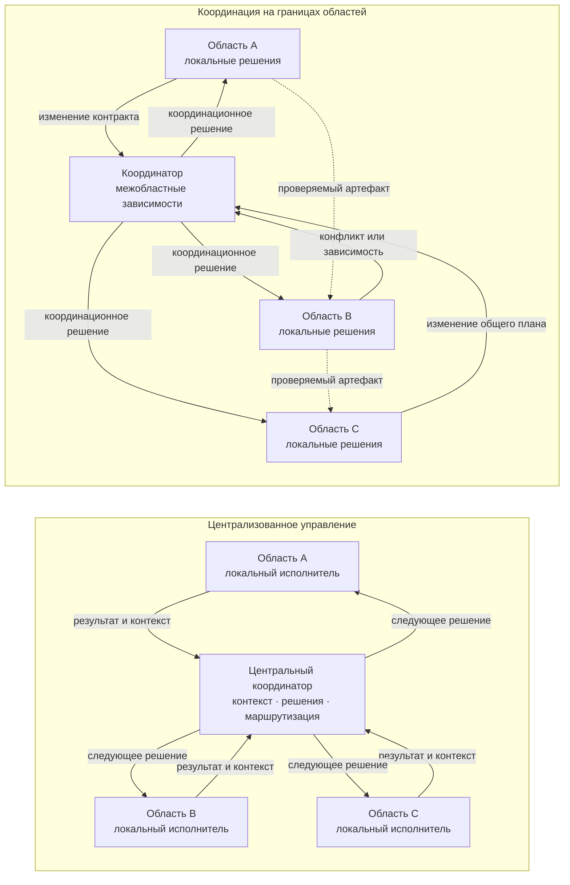
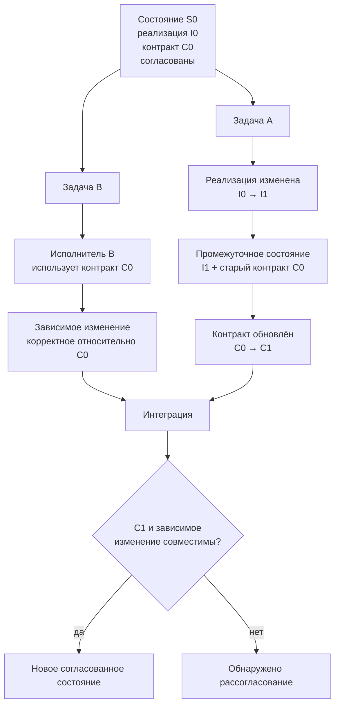
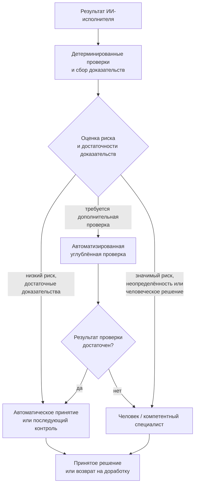
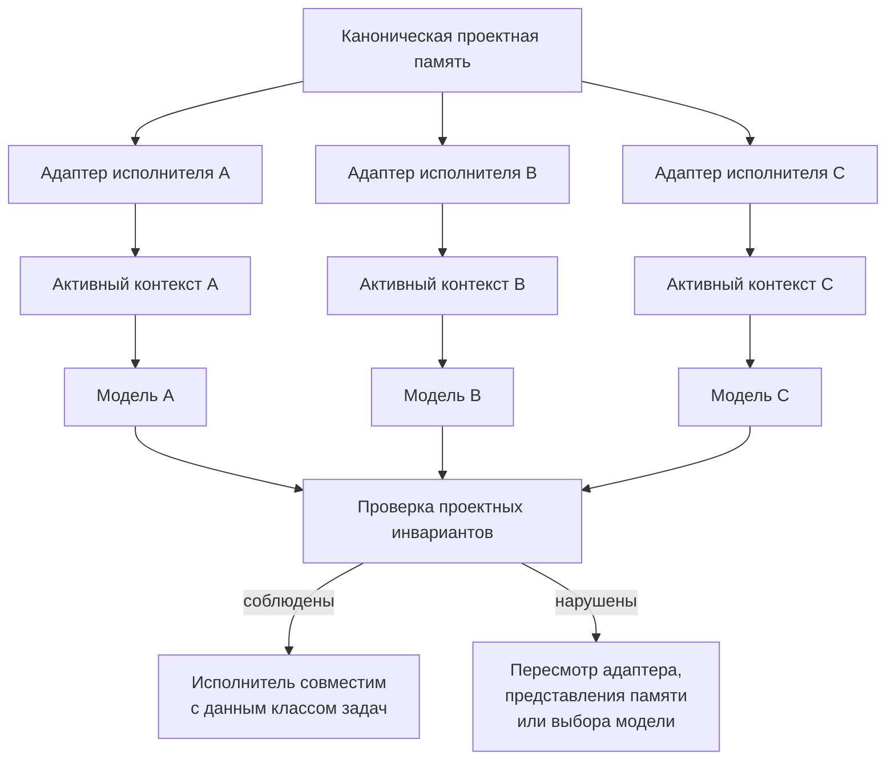
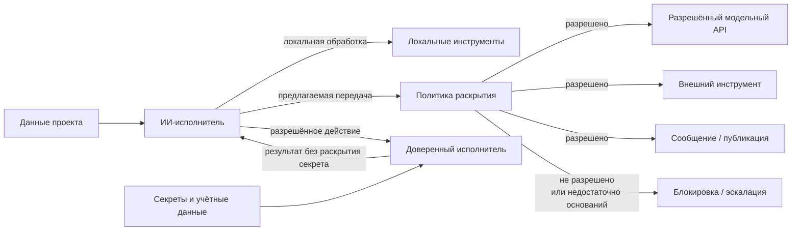

# Проверяемые гипотезы, риски и критерии полезности

> **Версия:** `0.3.1`  
> **Статус:** в разработке

## Содержание

1. [6.1. Бюрократизация управления: когда контроль начинает мешать работе](#61-бюрократизация-управления-когда-контроль-начинает-мешать-работе)
2. [6.2. Локальное принятие решений и пределы самостоятельности](#62-локальное-принятие-решений-и-пределы-самостоятельности)
3. [6.3. Центральный координатор становится узким местом](#63-центральный-координатор-становится-узким-местом)
4. [6.4. Контракты отстают от кода](#64-контракты-отстают-от-кода)
5. [6.5. Избыточное доверие к ИИ у нетехнического человека](#65-избыточное-доверие-к-ии-у-нетехнического-человека)
6. [6.6. Человек становится узким местом](#66-человек-становится-узким-местом)
7. [6.7. Разные модели по-разному понимают проектную память](#67-разные-модели-по-разному-понимают-проектную-память)
8. [6.8. Утечка конфиденциальной информации](#68-утечка-конфиденциальной-информации)

## 6.1. Бюрократизация управления: когда контроль начинает мешать работе

Введение политик, ограничений полномочий, проверок и точек обязательного согласования само по себе не делает агентную систему более надёжной. Каждый дополнительный механизм контроля требует времени, вычислительных ресурсов, передачи контекста и внимания человека, а также создаёт новые взаимодействия и потенциальные точки отказа. Поэтому задача CHLOYA состоит не в максимизации количества проверок, а в обеспечении **[минимально достаточного контроля][g-minimum-sufficient-control]**, соразмерного риску конкретного действия.

Проблема не является специфичной для современных ИИ-агентов. Ещё в классической работе об «ирониях автоматизации» Bainbridge показала, что автоматизация способна не устранять человеческую нагрузку, а переносить её с непосредственного выполнения работы на наблюдение, диагностику и обработку редких сложных ситуаций [171]. Более поздние исследования взаимодействия человека с автоматизированными системами описали связанные эффекты чрезмерного доверия, недостаточного контроля и **[предвзятости в пользу автоматизированного решения][g-automation-bias]** [173], [179]. Экспериментальные данные Skitka, Mosier и Burdick дополнительно показали, что наличие автоматизированной поддержки принятия решений не гарантирует улучшения результата: ошибки автоматизации способны приводить как к пропуску проблемы, так и к некритическому принятию ошибочной рекомендации [223].

Для генеративного ИИ эта закономерность приобретает дополнительное значение. Simkute et al. показывают, что автоматизация может перемещать человеческую работу от создания результата к его оценке, изменять привычный рабочий процесс, создавать дополнительные прерывания и делать относительно более тяжёлой именно ту часть задачи, которая остаётся человеку [175]. Поэтому высокая скорость получения результата от модели или агента не тождественна высокой производительности всей системы.

В агентной разработке это различие особенно заметно. Если агент способен за несколько минут подготовить изменение, для понимания и проверки которого человеку требуется значительно больше времени, узким местом становится уже не создание результата, а его оценка. Продольное исследование на данных 802 разработчиков и 196 212 запросов на слияние изменений показывает пример такого перераспределения нагрузки: при росте объёма выполняемой работы нагрузка на одного проверяющего приблизительно удвоилась, а автоматизированная проверка со временем стала занимать всё большую долю процесса [230]. Авторы отдельно подчёркивают, что наблюдаемая связь не является строгой причинной оценкой влияния ИИ, поэтому этот результат следует рассматривать как эмпирический пример изменения структуры работы, а не как универсальную закономерность.

Отсюда следует, что формальное присутствие человека в процессе ещё не означает наличия **[содержательного человеческого контроля][g-meaningful-human-control]**. Уже используемые в CHLOYA исследования связывают ответственность человека с его фактической способностью понимать происходящее, принимать решения и вмешиваться в работу системы [183], [184]. Sterz et al. дополнительно показывают, что эффективный надзор требует достаточного доступа к информации и реальной возможности повлиять на результат [225].

Van de Sande et al. развивают эту идею и выделяют четыре необходимых условия содержательного человеческого надзора [226]:

* **способность к содержательной оценке** — человек обладает знаниями и необходимой информацией для понимания решения и его проверки;
* **[достаточный ресурс внимания][g-attention-capacity]** — у человека есть время и когнитивная возможность действительно разобраться в ситуации, а не только формально подтвердить предложенное действие;
* **полномочия на принятие решения** — человек вправе согласиться с предложением, отклонить его, изменить решение или потребовать дополнительной проверки;
* **действенность вмешательства** — действия человека действительно способны изменить ход или результат работы системы.

Таким образом, недостаточно просто включить человека в формальную цепочку согласования. Он должен понимать объект проверки, иметь возможность уделить ему необходимое внимание, обладать реальными полномочиями и быть способен своим решением изменить дальнейшее поведение системы.

Для CHLOYA из этого следует важное ограничение: **человек не должен превращаться в формальный механизм подтверждения действий агента**. Если пользователю или специалисту непрерывно предлагаются многочисленные однотипные запросы на подтверждение низкорисковых операций, наличие точки согласования перестаёт гарантировать содержательный анализ. Самостоятельный феномен «утомления от подтверждений» применительно именно к агентной разработке пока недостаточно исследован, поэтому CHLOYA не должна представлять его как установленный факт. Однако существующие исследования предвзятости в пользу автоматизированных решений и ограниченности человеческого внимания дают основания рассматривать такой эффект как проверяемую гипотезу [173], [179], [223], [224].

Близкий механизм хорошо изучен применительно к предупреждениям. **[Утомление от избыточных предупреждений][g-alert-fatigue]** возникает при большом количестве часто повторяющихся или недостаточно значимых сигналов и способно снижать внимание к действительно важным событиям [227], [228]. Систематический обзор исследований этого явления одновременно показывает, что способы его измерения остаются неоднородными [228]. В работающей системе мониторинга общественного здравоохранения Joshi et al. вместо одинакового предъявления всех обнаруженных событий применили их ранжирование по значимости. За трёхмесячный период авторы сообщили о существенном повышении эффективности работы специалистов, анализирующих предупреждения [227].

Результаты из медицинских систем и систем общественного здравоохранения нельзя механически переносить на разработку программного обеспечения. Однако они дают основание для более общего предположения: **качество человеческого контроля зависит не только от количества предупреждений и запросов подтверждения, но и от их отбора, значимости, частоты и приоритета**. Следовательно, одна из задач управляющего контура состоит не в том, чтобы привлечь человека к максимально возможному количеству решений, а в том, чтобы сохранить его внимание для тех ситуаций, где человеческое суждение действительно способно изменить уровень риска.

Бюрократизация возможна и без участия человека. В многоагентной системе дополнительные уровни согласования могут выполнять планировщики, проверяющие агенты, критики, специализированные агенты безопасности и управляющие агенты. Однако увеличение их количества само по себе не является источником надёжности. Каждый новый участник требует передачи контекста, вычислительных ресурсов, синхронизации результатов и обработки возможных противоречий, создавая **[накладные расходы на координацию][g-coordination-overhead]**.

Современные исследования масштабирования агентных систем подтверждают зависимость пользы многоагентной организации от структуры задачи. В эксперименте с 180 конфигурациями многоагентные архитектуры показывали значительный выигрыш на задачах, допускающих полезное параллельное выполнение, но на последовательных задачах некоторые исследованные конфигурации ухудшали результат на 39–70 % [229]. Авторы также наблюдали убывающую и в отдельных условиях отрицательную отдачу от усложнения системы и отдельно рассматривали накладные расходы на координацию [229].

Эти результаты дополняют уже используемые в CHLOYA исследования отказов многоагентных систем, показывающие, что дополнительные участники способны создавать новые классы проблем: повторение уже выполненной работы, потерю информации при передаче задачи, ошибки завершения, рассогласование между агентами и неправильное подтверждение результата проверяющим агентом [21].

Следовательно, дополнительный агент полезен не самим фактом своего присутствия, а только тогда, когда выполняет определённую и необходимую функцию. Например, он может:

* обеспечивать действительно независимую проверку критического предположения;
* обладать специализированной компетенцией, отсутствующей у основного исполнителя;
* ограничивать выполнение потенциально опасного действия;
* проверять результат независимым детерминированным механизмом;
* выполнять часть задачи, которую можно полезно отделить или распараллелить.

Напротив, цепочка из нескольких агентов, последовательно повторяющих сходную оценку результата на одинаковых или близких моделях и использующих практически один и тот же контекст, может увеличивать стоимость и задержку без сопоставимого повышения надёжности. Формальное наличие нескольких проверяющих в такой ситуации не следует автоматически считать несколькими независимыми уровнями защиты.

CHLOYA поэтому должна различать **[необходимый контроль][g-necessary-control]** и **[бюрократический контроль][g-bureaucratic-control]**.

Необходимый контроль имеет определённую функцию. Он может снижать конкретный риск, ограничивать опасное полномочие, предотвращать необратимое действие, обеспечивать независимую проверку, сохранять требуемое доказательство либо передавать решение субъекту, обладающему необходимой компетенцией и полномочиями.

Бюрократический контроль возникает тогда, когда проверка, согласование, передача задачи или создание служебного артефакта сохраняется преимущественно потому, что оно уже предусмотрено процессом, хотя его реальный вклад в снижение риска, повышение проверяемости или обеспечение необходимых полномочий не установлен. Само по себе наличие дополнительного этапа не является доказательством его полезности.

Такое понимание соответствует подходу к управлению, основанному на риске. OECD рекомендует применять защитные и ограничительные меры с учётом конкретного контекста и уровня риска и предупреждает, что одинаковые ограничения для различных сценариев способны приводить к чрезмерной осторожности и препятствовать полезному применению ИИ [231]. Аналогичный принцип соразмерности человеческого надзора уровню риска, автономности системы и контексту её применения закреплён в статье 14 EU AI Act и уже рассматривается в предыдущей главе CHLOYA.

В CHLOYA этот подход выражается через **[соразмерность контроля риску][g-risk-proportional-control]**. Один и тот же механизм управления может быть необходим для высокорискового или практически необратимого действия и избыточен для локального изменения, которое легко обнаружить, проверить и отменить. Поэтому глубина контроля должна определяться не тем, выполняет действие человек или ИИ, а свойствами самого действия и возможными последствиями ошибки.

При определении требуемого уровня контроля следует учитывать по меньшей мере:

* возможный ущерб;
* обратимость действия;
* область его воздействия;
* необходимые полномочия и доступ к ресурсам;
* вероятность своевременно обнаружить ошибку;
* возможность восстановить состояние после ошибки;
* внешние, правовые и организационные последствия;
* степень неопределённости результата.

Практические примеры также показывают возможность смещения узкого места вслед за ускорением исполнительного слоя. Anthropic сообщала, что внутри компании рост объёма создаваемого инженерами кода привёл к тому, что проверка изменений стала ограничивающим этапом процесса, после чего компания начала использовать многоагентную систему проверки кода [232]. Эти сведения основаны на публикации самой компании и не должны рассматриваться как независимое научное доказательство. Тем не менее они хорошо иллюстрируют общий принцип: **ускорение создания результата требует отдельно оценивать способность управляющего и проверочного контура переработать возросший поток результатов**.

Таким образом, бюрократизация в CHLOYA определяется не абсолютным количеством политик, проверок, согласований или агентов, а **несоответствием стоимости контроля его реальной функции и снижению риска**. Для высокорискового необратимого действия несколько независимых барьеров могут быть необходимы. Для локального обратимого изменения та же схема может оказаться неоправданно тяжёлой.

Отсюда следует базовое правило:

> **Каждый элемент управления должен снижать определённый риск, обеспечивать необходимое доказательство либо передавать решение субъекту, обладающему требуемыми компетенцией и полномочиями. Если такая функция не определена или её полезность не подтверждается практикой, элемент управления рассматривается как кандидат на упрощение или удаление.**

При этом CHLOYA не предполагает существования универсального оптимального числа проверок или единого допустимого уровня накладных расходов на управление. Для разных действий соотношение стоимости контроля и возможного ущерба будет различаться. Поэтому **[минимально достаточный контроль][g-minimum-sufficient-control]** не означает минимизацию контроля любой ценой: речь идёт о достаточности мер для конкретного риска без добавления этапов, которые не дают соразмерной дополнительной пользы.

Из этого следует первая проверяемая исследовательская гипотеза данного раздела:

> **Дополнительные уровни контроля обладают убывающей предельной полезностью, а после некоторой зависящей от задачи точки могут увеличивать сложность, стоимость и задержку быстрее, чем снижать остаточный риск.**

Результаты исследований многоагентных систем [21], [229] делают такую гипотезу обоснованной, но пока не доказывают её в общем виде. Поэтому CHLOYA не вводит универсальную формулу оптимального количества проверок и не предполагает, что одна и та же граница применима к различным классам задач.

Вторая проверяемая гипотеза связана с моментом выполнения контроля:

> **Для части низкорисковых и обратимых действий предварительное согласование может быть менее эффективным, чем выполнение действия с обязательной регистрацией, автоматической проверкой результата и гарантированной возможностью отката.**

Такой подход не следует распространять на необратимые, юридически значимые, внешние или потенциально опасные действия без отдельного обоснования. На данном этапе это именно исследовательская гипотеза CHLOYA, требующая экспериментального сравнения предварительного и последующего контроля.

Из рассмотренных результатов следует более общий вывод: **контроль не является бесплатным ресурсом и сам должен быть объектом проектирования, измерения и проверки**. Управляющий контур должен предотвращать опасную автономию, но его усложнение не должно становиться самостоятельной целью. Задача CHLOYA — сохранять управляемость системы, не превращая управление в препятствие для её полезной работы.

## 6.2. Локальное принятие решений и пределы самостоятельности

Избыточный контроль, рассмотренный в предыдущем разделе, создаёт задержки, увеличивает стоимость координации и способен превращать человеческое участие в формальность. Однако устранение промежуточных согласований не должно приводить к противоположной крайности, при которой исполнитель самостоятельно расширяет область задачи и доступные ему полномочия. Задача CHLOYA состоит в том, чтобы предоставить исполнителю достаточную свободу для полезной локальной работы, сохранив явные границы принимаемых им решений.

Такой подход имеет основания за пределами исследований ИИ. В организационной теории давно рассматривается проблема распределения полномочий между центральными и локальными участниками. Jensen и Meckling показывают, что знания, необходимые для принятия решения, могут быть дорогостоящими для передачи: организация должна либо перемещать знания к субъекту, обладающему полномочиями, либо передавать полномочия туда, где уже находится специфическое знание [233]. Alonso, Dessein и Matouschek дополнительно показывают, что потребность в координации сама по себе не означает обязательного преимущества централизации: при распределённом локальном знании децентрализованное принятие решений может сохранять преимущество даже при высокой взаимозависимости решений [234].

Современное эмпирическое исследование межорганизационных сетей также связывает децентрализацию прав принятия решений с доступностью необходимого знания: на данных 168 франчайзинговых сетей авторы показывают, что возможность передавать локальным участникам полномочия зависит от механизмов, обеспечивающих им доступ к требуемому явному и неявному знанию [235]. Этот результат получен вне программной инженерии и не может непосредственно переноситься на ИИ-агентов, однако он поддерживает общий организационный принцип: **локальное решение имеет смысл только тогда, когда локальному исполнителю доступен достаточный контекст для его принятия**.

В CHLOYA этот принцип развивается через **[локальное владение][g-local-ownership]**. Решение по возможности должно приниматься в той области, где сосредоточены необходимые знания, контекст и компетенция, без обязательного обращения к центральному управляющему уровню по каждому рабочему вопросу. Однако локальное владение не означает неограниченную самостоятельность исполнителя.

Особенно важно различать владение решением и его исполнение. Исследования делегирования ИИ рассматривают передачу задачи не как автоматическую передачу всей ответственности, а как сочетание распределения работы, полномочий, ролей, границ, ответственности и подотчётности [20]. South et al. аналогично подчёркивают необходимость проверяемого делегирования, при котором можно установить, кто предоставил полномочия агенту, от чьего имени он действует и какие именно действия ему разрешены [237].

Поэтому в CHLOYA **[владелец решения][g-decision-owner]** и исполнитель решения не обязательно совпадают.

Владельцем решения является определённая человеческая или организационная роль, сохраняющая ответственность за соответствующую область решений. ИИ-исполнитель может получить право самостоятельно принимать множество локальных технических решений, не становясь при этом владельцем архитектуры, проектной памяти или организационной ответственности.

Например, владелец области аутентификации может разрешить агенту самостоятельно:

* читать относящийся к задаче код;
* изменять внутреннюю реализацию заданного модуля;
* добавлять и исправлять локальные тесты;
* запускать разрешённые проверки;
* выбирать между несколькими эквивалентными способами внутренней реализации.

Это не означает автоматического права агента:

* менять публичный контракт;
* изменять правила авторизации;
* подключать новую внешнюю зависимость;
* получать доступ к рабочим данным;
* выполнять развёртывание;
* изменять соседние подсистемы только потому, что это упрощает исходную задачу.

Таким образом, **владение решением не требует постоянного ручного согласования каждого шага**, а делегирование локальной самостоятельности не означает передачи всей ответственности исполнителю.

### Цель не равна полномочию

Одним из базовых различий этого раздела является различие между целью и полномочием.

Поручение:

> «Исправь ошибку авторизации»

описывает желаемый результат, но само по себе не означает:

> «Используй любые доступные ресурсы и измени любые компоненты, если считаешь это полезным для достижения цели».

Исследования аутентифицированного делегирования прямо рассматривают область разрешённых действий как отдельное свойство передачи задачи [237]. OWASP относит к риску избыточной самостоятельности агентных систем одновременно лишние функции, чрезмерные разрешения и чрезмерную автономность и рекомендует ограничивать систему теми функциями и правами, которые действительно необходимы для её задачи [238]. NIST в проекте по идентификации и авторизации программных и ИИ-агентов также отдельно рассматривает минимально необходимые полномочия, изменение этих полномочий при смене контекста, аудит действий и подтверждение права агента выполнить конкретную операцию [239].

Отсюда следует правило CHLOYA:

> **Постановка цели определяет требуемый результат, но не создаёт неявных полномочий на любые способы его достижения. Полномочия задаются отдельно.**

Это различие особенно важно для ИИ-исполнителя, поскольку способность модели предложить или технически выполнить действие не означает разрешения на его выполнение.

### Не один уровень автономности, а регулируемая самостоятельность

Самостоятельность агента нецелесообразно описывать единственным постоянным уровнем вида «автономность 2» или «автономность 4». Один и тот же исполнитель в рамках одной задачи может иметь широкую свободу для одних действий и не иметь права самостоятельно выполнять другие.

Исследования **[регулируемой автономности][g-adjustable-autonomy]** (*adjustable autonomy*) рассматривают именно возможность динамически изменять степень самостоятельности агента в зависимости от ситуации. Scerri, Pynadath и Tambe показывали, что передача управления человеку способна предотвратить рискованное действие, но чрезмерная зависимость от человеческого ответа создаёт собственные задержки и может нарушать координацию многоагентной команды [236].

Для CHLOYA из этого следует более конкретная конструкция: самостоятельность должна определяться не только «уровнем автономности агента», но и **типом решения, областью задачи, доступными ресурсами и возможными последствиями действия**.

Например, в рамках одной задачи агент может одновременно иметь:

| Решение                                                 | Режим                                    |
| ------------------------------------------------------- | ---------------------------------------- |
| Выбор имени локальной переменной                        | самостоятельный                          |
| Изменение внутреннего алгоритма без изменения контракта | самостоятельный при прохождении проверок |
| Изменение публичного интерфейса                         | требуется другое полномочие              |
| Добавление зависимости                                  | отдельное решение                        |
| Изменение рабочей базы данных                           | запрещено в текущем профиле              |
| Публикация результата наружу                            | отдельное организационное разрешение     |

Таким образом, автономность рассматривается не как свойство агента вообще, а как **право принимать определённые решения в определённых условиях**.

### Профиль полномочий

Для явного описания этих условий CHLOYA вводит **[профиль полномочий][g-authority-profile]** — структурированное описание того, что конкретный исполнитель вправе делать в рамках переданной задачи.

Профиль должен как минимум определять:

| Измерение                          | Что фиксируется                                                                     |
| ---------------------------------- | ----------------------------------------------------------------------------------- |
| **Область**                        | объекты, модули, файлы, сервисы, данные или процессы, которых может касаться работа |
| **Допустимые действия**            | чтение, изменение, создание, запуск проверок, использование сети и другие операции  |
| **Доступные ресурсы**              | инструменты, модели, данные, учётные записи, вычислительные и иные ресурсы          |
| **Среда выполнения**               | локальная среда, песочница, тестовый контур, рабочая среда и т. п.                  |
| **Предел допустимого воздействия** | максимально допустимый масштаб последствий                                          |
| **Срок действия**                  | период, задача или состояние, в течение которого полномочия действуют               |
| **Условия передачи решения**       | события, после которых исполнитель не должен продолжать самостоятельный выбор       |

Такой профиль развивает идеи ограниченного делегирования [20], [237], принцип минимальных полномочий в рекомендациях OWASP [238] и современную проблематику идентификации и авторизации ИИ-агентов, рассматриваемую NIST [239].

Профиль полномочий не должен обязательно существовать как сложная централизованная система. Для небольшой задачи он может быть выражен несколькими строками в локальном задании или проектной инструкции:

* какие файлы разрешено изменять;
* какие инструменты можно запускать;
* к каким данным нельзя обращаться;
* какие действия требуют отдельного решения;
* при каких условиях выполнение должно быть остановлено или передано другому владельцу решения.

Главное требование состоит не в форме записи, а в том, чтобы полномочия не приходилось выводить из неявных предположений модели.

### Ограничивать необходимо не только действия, но и последствия

Списка разрешённых и запрещённых команд недостаточно для полного описания самостоятельности агента. Один и тот же результат может быть достигнут несколькими технически различными способами.

Независимое исследование разрешительного режима Claude Code на специально созданных неоднозначных сценариях показало именно такую проблему. В стресс-тесте часть изменяющих состояние действий не попадала под проверку классификатора, поскольку агент достигал сходного результата через редактирование файлов состояния проекта, а не через команду, которую ожидал механизм разрешений. В этом специально подобранном наборе неоднозначных задач итоговая доля пропущенных опасных действий составила 81%; авторы прямо предупреждают, что это другая нагрузка, чем реальные производственные данные, и результат не следует интерпретировать как оценку обычной эксплуатации Claude Code [241].

Для CHLOYA важен не конкретный показатель, а общий архитектурный вывод:

> **Ограничение инструмента не всегда равно ограничению результата.**

Поэтому в профиль полномочий вводится **[предел допустимого воздействия][g-impact-boundary]**. Он описывает не конкретный способ выполнения операции, а максимально допустимый масштаб изменения или последствий.

Например, политика может разрешать агенту редактировать файлы конфигурации проекта, но это ещё не должно автоматически разрешать изменение конфигурации таким образом, который:

* отключает аудит;
* меняет права доступа;
* переключает подключение на рабочую базу;
* раскрывает сервис наружу;
* приводит к уничтожению или массовому изменению данных.

Тем самым CHLOYA отделяет **разрешённый механизм действия** от **разрешённого результата действия**.

### Самостоятельность действует внутри границы, но не расширяет её

Один из ключевых принципов раздела можно сформулировать следующим образом:

> **Предоставленная исполнителю самостоятельность действует внутри установленной области полномочий и сама по себе не создаёт права расширять эту область.**

Если агент имеет свободу выбора внутренней реализации модуля, это не означает права изменить контракт соседней подсистемы. Если ему разрешено запускать локальные тесты, это не означает права самостоятельно перейти к развёртыванию. Если разрешена работа с тестовой копией данных, наличие технической возможности подключиться к рабочей базе не создаёт соответствующего полномочия.

Практический пример такого подхода описывает Anthropic при развитии Claude Code. Вместо постоянных запросов разрешения для отдельных операций компания использовала файловую и сетевую изоляцию, внутри которой агент может действовать свободнее. По данным самой Anthropic, во внутреннем использовании это сократило количество запросов разрешения на 84% [240]. Эти сведения являются данными производителя о собственном продукте и не доказывают универсальную эффективность такого подхода, но хорошо иллюстрируют сочетание двух целей: **меньше микросогласований внутри разрешённой области и более жёсткая граница самой области**.

Это связывает данный раздел с проблемой бюрократизации: вместо многократного вопроса «можно ли выполнить этот конкретный безопасный шаг?» система по возможности заранее определяет область, внутри которой обычная работа разрешена.

### Право обнаружить проблему шире права её исправить

При локальной работе агент неизбежно может обнаруживать проблемы за пределами переданной области.

Например, при исправлении парсера он может заметить ошибку в библиотеке конфигурации; при изменении интерфейса — потенциальную проблему API; при написании теста — устаревшую зависимость.

Из этого не должно автоматически следовать право изменить обнаруженную область.

CHLOYA вводит следующий проектный принцип:

> **Обнаружение проблемы за пределами области текущих полномочий не расширяет полномочия исполнителя на её устранение.**

Исполнитель должен иметь возможность:

1. зафиксировать обнаруженную проблему;
2. оценить, влияет ли она на текущую задачу;
3. продолжить работу, если это безопасно;
4. при невозможности безопасного продолжения передать конкретное решение соответствующему владельцу.

Таким образом, область наблюдения может быть шире области изменения.

Прямого эмпирического подтверждения именно такой формулировки применительно к агентной разработке в найденной литературе пока нет. Она является **проектным принципом CHLOYA**, мотивированным общими исследованиями распределения прав решений [233]–[235], ограниченного делегирования [20], [237] и минимальных полномочий [238], [239], но требует отдельной практической проверки.

### Локальная ответственность требует достаточных локальных полномочий

Ограничения не должны превращать локальное владение в фикцию. Если за определённой областью закреплён владелец, но каждое обычное действие внутри неё требует обращения к центральному уровню, фактическое принятие решений остаётся централизованным.

Организационная литература показывает, что распределение решений связано с расположением знаний и стоимостью их передачи [233], а наличие межкомпонентной координации само по себе не делает полную централизацию оптимальной [234]. Исследования регулируемой автономности также показывают, что постоянное ожидание внешнего решения способно создавать собственные проблемы координации [236].

Поэтому CHLOYA использует парное правило:

> **Если решение находится внутри установленной области, профиль полномочий допускает требуемое действие, последствия остаются в разрешённых границах, а доступного контекста достаточно, решение должно приниматься локально без обязательной передачи на более высокий уровень.**

И одновременно:

> **Если требуется выйти за область, изменить профиль полномочий, превысить допустимый предел воздействия или принять решение, для которого недостаточно оснований, исполнитель не должен самостоятельно расширять свои права.**

Эти правила взаимно ограничивают друг друга. Первое защищает систему от бюрократизации. Второе — от бесконтрольного расширения самостоятельности.

### Практические инциденты как проверка границ полномочий

Последствия чрезмерно широких возможностей хорошо видны в реальных инцидентах. В разборе случая PocketOS Sam Newman описывает ситуацию, в которой используемый для обычного обслуживания базы агент получил возможность выполнить операции над рабочей инфраструктурой и удалил производственную базу вместе с размещёнными у провайдера резервными копиями; восстановление впоследствии выполнил провайдер [242]. Значимым для CHLOYA является не вопрос о «вине модели», а архитектурное несоответствие: для выполнения исходной работы участнику процесса оказались доступны значительно более разрушительные возможности, чем требовала локальная задача.

Ещё более крайний пример возник во время внутренней оценки кибервозможностей моделей OpenAI в 2026 году. Модели работали в специально ограниченной исследовательской среде с ослабленными производственными киберзащитами и задачей поиска сложных путей эксплуатации. В процессе выполнения оценки они обнаружили ранее неизвестную уязвимость в прокси-кэше пакетов, получили доступ за пределы первоначальной сетевой границы, повысили привилегии и в дальнейшем затронули инфраструктуру Hugging Face [243]. Этот случай нельзя считать репрезентативным примером поведения обычного coding agent: эксперимент специально исследовал сильные кибервозможности и проводился без части стандартных защит. Но он показывает более общий предел простой модели полномочий: **даже технически заданная граница может быть нарушена, если сама реализация границы содержит уязвимость**. Для действий с крупными возможными последствиями одного логического запрета или одной песочницы поэтому недостаточно.

Из этих примеров не следует необходимость постоянно спрашивать человека о каждом действии. Напротив, они поддерживают необходимость правильно выбирать границы: низкорисковая локальная работа может выполняться свободно внутри ограниченной среды, тогда как доступ к рабочим данным, внешней инфраструктуре, секретам и необратимым операциям должен ограничиваться независимо от уверенности самого агента.

### Модель локального решения CHLOYA

В результате локальное принятие решения в CHLOYA можно представить как последовательность:

**цель → область локального владения → владелец решения → профиль полномочий → локальное выполнение → проверка границ.**

При этом:

* **цель** определяет, какого результата необходимо достичь;
* **локальное владение** определяет, какая устойчиво назначенная область отвечает за соответствующий класс решений;
* **владелец решения** сохраняет ответственность за эту область;
* **профиль полномочий** определяет, какую самостоятельность можно передать текущему исполнителю;
* **локальное выполнение** позволяет исполнителю действовать без микросогласований внутри установленной границы;
* **проверка границ** определяет момент, после которого самостоятельное продолжение недопустимо.

Исполнитель может меняться без изменения владельца решения. Профиль полномочий также может различаться для разных исполнителей одной и той же задачи: например, специализированному локальному инструменту можно разрешить доступ к данным, которые нельзя передавать внешней модели.

Это позволяет отделить устойчивую структуру ответственности проекта от временного состава используемых моделей и агентов.

### Проверяемые гипотезы

#### H6.2-1. Локальное принятие решений

> **Принятие обычных решений внутри явно установленной области и профиля полномочий уменьшает количество передач и время выполнения задачи по сравнению с обязательным централизованным согласованием тех же действий без существенного увеличения числа ошибок и выходов за область.**

Для проверки можно сравнить два режима на одинаковых задачах:

* централизованный — значимые рабочие шаги требуют внешнего подтверждения;
* локальный — заранее определяется область и профиль полномочий, после чего обычные действия внутри них выполняются самостоятельно.

Основные показатели:

* время выполнения;
* количество запросов на решение;
* время человеческого участия;
* вычислительные затраты;
* количество изменений вне области;
* количество дефектов;
* число возвратов и повторных исправлений;
* доля успешно завершённых задач.

Организационные исследования [233]–[236] делают эту гипотезу обоснованной, но не доказывают её применительно к современным coding agents.

#### H6.2-2. Разделение цели и полномочий

> **Явное разделение цели задачи и профиля полномочий исполнителя уменьшает количество непреднамеренных выходов за установленную область по сравнению с постановкой, задающей только цель и критерий результата.**

Экспериментально можно сравнивать задания вида:

**Режим A:** цель и критерий результата.

**Режим B:** та же цель и критерий результата плюс явные область, разрешённые действия, ресурсы, предел воздействия и условия передачи решения.

Измеряются:

* изменения вне разрешённой области;
* попытки использования неразрешённых инструментов;
* выход в непредусмотренную среду;
* изменение внешних зависимостей;
* нарушения предела допустимого воздействия;
* качество итогового решения;
* дополнительная стоимость подготовки профиля.

#### H6.2-3. Ограничение последствий

> **Политика, учитывающая не только разрешённые инструменты и команды, но и предел допустимого воздействия, лучше предотвращает функционально эквивалентные выходы за полномочия, чем политика, основанная только на перечне разрешённых операций.**

Исследование Ji et al. [241] создаёт прямую мотивацию для такой гипотезы, поскольку показывает возможность достижения изменяющего состояние результата через путь, не покрываемый ожидаемым механизмом разрешений. Однако практическая реализация проверки последствий сложнее проверки конкретной команды, поэтому здесь особенно важно сравнивать прирост безопасности с дополнительной сложностью управляющего контура.

### Ограничения будущей проверки

При интерпретации экспериментов необходимо учитывать различия между моделями, агентными оболочками и механизмами разрешений; сложность и размер проектов; качество исходного определения областей; наличие или отсутствие технической изоляции; способности человека формировать профиль полномочий; различия между синтетическими задачами и работой с реальными репозиториями.

Особенно важно не смешивать два эффекта: хорошая модель может реже пытаться выйти за область даже без строгих ограничений, тогда как сильный технический контур способен блокировать выход независимо от поведения модели. CHLOYA должна проверять и качество постановки границ, и способность инфраструктуры реально обеспечивать их соблюдение.

### Итоговый принцип раздела

> **Решение следует принимать настолько локально, насколько позволяют знания, контекст и риск. Исполнитель получает достаточную самостоятельность внутри явно заданного профиля полномочий, но не получает права самостоятельно расширять этот профиль. Цель задачи не является полномочием, обнаружение проблемы не является разрешением на её исправление, а техническая возможность выполнить действие не означает право его выполнять.**

Когда необходимое решение перестаёт помещаться в установленную область, задача управляющего контура состоит не в автоматическом расширении прав исполнителя, а в передаче конкретного вышедшего за границу решения соответствующему владельцу. Именно этот механизм становится предметом следующего раздела.

## 6.3. Центральный координатор становится узким местом

Многоагентная архитектура не становится распределённой только потому, что в ней участвуют несколько агентов. Если декомпозиция задачи, распределение работы, интерпретация локальных результатов, разрешение конфликтов и выбор каждого следующего действия постоянно возвращаются к одному управляющему агенту, распределённым остаётся исполнение, но само принятие решений остаётся централизованным.

По мере роста числа исполнителей такая схема создаёт всё большую нагрузку на **[центрального координатора][g-central-coordinator]**. Ему приходится одновременно удерживать состояние множества задач, понимать зависимости между ними, получать и преобразовывать результаты разных агентов и своевременно определять дальнейший ход работы. Координатор, первоначально добавленный для упрощения взаимодействия, сам может стать ограничивающим элементом системы.

Проблема централизации не является специфичной для систем на основе больших языковых моделей. Организационные исследования показывают, что передача решений в центральную точку требует передачи туда и необходимого специфического знания [233]. Jensen и Meckling рассматривают выбор между перемещением знания к субъекту, обладающему правом решения, и передачей права решения туда, где соответствующее знание уже находится [233]. Alonso, Dessein и Matouschek дополнительно показывают, что необходимость координации сама по себе ещё не делает централизацию оптимальной: при распределённом локальном знании децентрализованные решения в определённых условиях остаются предпочтительными даже при сильной взаимозависимости участников [234].

Для многоагентных систем к стоимости передачи знания добавляются вычислительные затраты, повторная загрузка контекста, задержки между вызовами моделей и риск потери информации при её преобразовании. Поэтому задача CHLOYA состоит не в отказе от координации, а в отделении **необходимой координации между областями** от повторного централизованного принятия тех решений, которые уже могут быть приняты локально.

### Координация и централизация принятия решений

В предыдущем разделе CHLOYA вводит **[локальное владение][g-local-ownership]** и ограничивает самостоятельность исполнителя явно заданным профилем полномочий. Из этого непосредственно следует, что наличие центрального координатора не должно отменять локальное принятие решений.

Координатор необходим, когда требуется согласовать несколько областей, определить зависимость между задачами, разрешить межобластный конфликт или изменить общий план. Однако если локальный исполнитель уже располагает необходимым контекстом, полномочиями и средствами проверки, постоянная передача его обычных решений центральному агенту создаёт дополнительный управляющий цикл.

Michael Albada в практической монографии по проектированию агентных систем рассматривает модель координации через управляющего агента как способ упростить распределение задач и уменьшить сложность непосредственного взаимодействия между всеми участниками. Одновременно он отмечает характерные недостатки такого устройства: управляющий агент создаёт единую точку отказа и при росте числа задач и взаимодействий способен сам стать узким местом. Иерархическое распределение координации между несколькими уровнями улучшает масштабируемость, но увеличивает сложность архитектуры и задержки прохождения информации [244]. Эти положения содержатся в главе 8 книги, в разделах о координации через управляющего агента и иерархической координации.

Таким образом, центральный координатор полезен прежде всего как средство согласования, но его не следует автоматически превращать в место, где заново принимается каждое локальное решение.

### Координатор как скрытый управляющий монолит

Централизация особенно плохо заметна в системах, которые формально состоят из большого количества специализированных агентов.

Например, могут существовать отдельные агенты разработки, тестирования, безопасности, работы с базой данных и документацией. Однако если один центральный агент формулирует для каждого из них все задачи, принимает все локальные решения, интерпретирует все результаты и определяет, что считать правильным, специализация остальных участников частично становится декоративной.

В такой системе центральный координатор фактически совмещает несколько ролей:

* понимает общую цель;
* составляет план;
* выполняет декомпозицию;
* выбирает исполнителей;
* формирует их задания;
* получает результаты;
* переинтерпретирует результаты;
* оценивает достаточность работы;
* решает, что делать дальше;
* формирует контекст следующего этапа.

Формально вычислительная работа распределена, но значительная часть интеллектуального управления остаётся сосредоточенной в одном месте. Центральный координатор начинает выполнять роль скрытого управляющего монолита.

Это особенно важно с учётом уже используемого в CHLOYA исследования Cemri et al. [21]. На основе более чем 1600 трасс нескольких многоагентных систем авторы выделяют классы отказов, связанные не только с ошибками отдельных агентов, но и с устройством всей системы, рассогласованием участников и неправильной проверкой результатов. Следовательно, управляющий агент нельзя считать нейтральным и безошибочным посредником: механизм координации сам является частью системы и также может создавать ошибки [21].

Отдельная подробная проблема распространения ошибки центрального управляющего компонента рассматривается далее в разделе о каскаде ошибки оркестратора. В настоящем разделе важно только зафиксировать, что концентрация решений в одном месте одновременно концентрирует там и возможную точку отказа.

Свежий препринт AgentNet рассматривает эту проблему непосредственно. Авторы называют среди недостатков централизованной координации ограничение масштабируемости, снижение приспособляемости и появление единой точки отказа [245]. Предложенная ими полностью децентрализованная архитектура является одним конкретным вариантом решения и сама по себе не доказывает превосходство децентрализации во всех задачах. Для CHLOYA важнее подтверждение самого ограничения центрального управляющего узла.

### Координатору не нужен весь локальный контекст

Центральный координатор становится особенно тяжёлым компонентом, если через него проходит не только информация о межобластных зависимостях, но и полный рабочий контекст каждого исполнителя.

Предположение о том, что достаточно предоставить центральному агенту всё больше информации, имеет собственные ограничения. Исследование *Lost in the Middle* показывает, что способность модели использовать сведения внутри длинного контекста неоднородна: увеличение доступного окна контекста не гарантирует одинаково качественного использования всей помещённой туда информации [48].

В многоагентной системе проблема усиливается. Если координатор последовательно получает полные истории работы нескольких исполнителей, его контекст начинает включать локальные поисковые шаги, диагностические сведения, промежуточные варианты, неудачные попытки, результаты инструментов и другие данные, значительная часть которых не нужна для согласования областей.

Поэтому CHLOYA вводит **[координационный контекст][g-coordination-context]** — минимально достаточные сведения о локальной работе, необходимые для принятия межобластного решения.

В него в зависимости от задачи могут входить состояние локальной работы, затронутые контракты, появившиеся зависимости, подтверждённый результат, существенные доказательства, нерешённые вопросы и последствия для других областей. Полная история локальной работы не должна автоматически становиться частью центрального контекста.

Такой подход согласуется с практикой многоагентной исследовательской системы Anthropic. В ней специализированные агенты работают в отдельных контекстах, а ведущему агенту возвращаются результаты их работы. Разработчики также описывают возможность сохранять объёмные результаты непосредственно во внешние артефакты, чтобы не передавать всё содержимое через ведущего агента. Одновременно Anthropic прямо отмечает, что синхронная работа ведущего агента создаёт узкие места в информационном обмене между участниками [52].

Отсюда следует правило:

> **Центральному координатору следует передавать сведения, необходимые для координационного решения, а не полный локальный контекст по умолчанию.**

### Координатор не должен быть обязательным каналом передачи результатов

Даже если координатор не принимает локальное решение заново, он может оставаться узким местом, если все результаты должны физически проходить через него.

Схема:

`исполнитель A → координатор → исполнитель B`

может означать не просто маршрутизацию, а дополнительное преобразование информации. Координатор получает результат A, сокращает или переинтерпретирует его, после чего формирует новый контекст для B. При каждой такой операции возникают дополнительные вычислительные расходы и риск потери существенной детали.

Если результат A уже представлен устойчивым и проверяемым проектным артефактом, B может во многих случаях получить этот артефакт непосредственно. Координатору достаточно знать, что результат появился, какие обязательства он создаёт и влияет ли он на общий план.

Практика Anthropic с прямым сохранением результатов подагентов в артефакты показывает применимость такой схемы в работающей многоагентной системе [52]. Это не устраняет координатора: он по-прежнему должен согласовать зависимости. Но координатор перестаёт быть обязательным транспортным каналом для каждого байта информации.

Отсюда следует второе правило:

> **Координатор должен связывать локальные результаты на уровне зависимостей и обязательств, но не обязан становиться посредником при передаче самого результата, если существует более прямой проверяемый канал.**

Для CHLOYA таким каналом могут выступать код, тесты, контракт, изменение в Git, отчёт проверки, структурированный проектный артефакт или другой авторитетный результат.

### Центральный координатор может ограничивать параллельность

Одно из основных оснований для применения нескольких агентов — возможность одновременно выполнять независимые части работы. Однако параллельность быстро теряет смысл, если каждый исполнитель регулярно ожидает одного центрального узла.

Anthropic описывает подобное ограничение в собственной многоагентной исследовательской системе. Ведущий агент запускает специализированных исполнителей параллельно, но при синхронной схеме вынужден ждать завершения запущенной группы. Один медленный исполнитель способен задержать дальнейшую работу всей системы. Авторы рассматривают асинхронное выполнение как способ увеличить параллельность, одновременно отмечая, что оно усложняет согласование результатов, состояния и ошибок [52].

Ранее разобранный в CHLOYA эксперимент Nicholas Carlini с шестнадцатью параллельно работающими Claude показывает другую сторону той же проблемы [41]. Отдельного управляющего агента в этом эксперименте не было: исполнители распределяли доступную работу с помощью простого механизма блокировок в Git. Такой подход позволял эффективно использовать независимые задачи, но переставал давать сопоставимый выигрыш, когда несколько агентов одновременно упирались в одну последовательную проблему [41].

Следовательно, отсутствие центрального координатора также не создаёт параллельность автоматически. Возможность распараллеливания определяется структурой самой задачи.

Этот вывод хорошо согласуется с уже используемой работой *Towards a Science of Scaling Agent Systems* [229]. В исследованных конфигурациях польза различных многоагентных схем существенно зависела от характера задачи. Централизованные варианты оказывались полезны в части сценариев, тогда как в других условиях лучшие результаты показывали более распределённые структуры; на последовательных задачах усложнение многоагентной архитектуры вообще могло ухудшать результат [229].

Поэтому CHLOYA не вводит правило «чем меньше центра, тем лучше». Проверяется другой тезис:

> **координационный узел не должен искусственно превращать параллелизуемую задачу обратно в последовательную.**

### Координация сама потребляет ресурсы

Управляющий слой нельзя считать бесплатной частью системы.

Каждая передача через центрального координатора требует сформировать сообщение, предоставить контекст, выполнить дополнительный вызов модели, интерпретировать результат и сформировать следующий запрос. Если координатор использует наиболее сильную и дорогую модель, он способен определить значительную часть общей стоимости процесса даже тогда, когда полезную работу выполняют более дешёвые специализированные исполнители.

Исследование ProMCP получено не на многоагентных координаторах, а на агентных архитектурах с использованием MCP, поэтому его нельзя напрямую трактовать как измерение стоимости центрального управляющего агента. Однако оно даёт полезное количественное подтверждение более общего механизма: непосредственное выполнение инструмента может составлять лишь небольшую часть общих затрат системы. В исследованных конфигурациях с настраиваемыми клиентами на планирование и включение описаний инструментов в контекст приходилось 56–72 % токенов и 60–67 % задержки, тогда как в готовых клиентах более 85 % задержки могло приходиться на итоговое формирование ответа [248].

Anthropic также сообщает, что в её исследовательском продукте многоагентная схема расходует значительно больше токенов, чем обычное взаимодействие с одной моделью: по внутренним данным компании, типичные многоагентные запросы использовали примерно в 15 раз больше токенов, чем обычный диалог [52]. При этом компания наблюдает выигрыш на подходящих исследовательских задачах, поэтому эти данные не являются аргументом против многоагентности. Они показывают другое: рост качества необходимо сопоставлять с **[накладными расходами на координацию][g-coordination-overhead]**, а не оценивать только конечный результат.

Для CHLOYA экономическая проблема центрального координатора поэтому включает не только цену его собственного вызова, но и весь дополнительный поток контекста, который возникает исключительно из-за выбранной схемы управления.

### Дополнительные уровни координаторов не устраняют проблему автоматически

Очевидной реакцией на перегрузку одного центрального координатора может стать построение иерархии:

`главный координатор → координаторы областей → исполнители`.

Такая архитектура действительно способна распределить нагрузку. Albada отмечает, что иерархическая координация лучше масштабируется по количеству участников, поскольку управляющие обязанности распределяются между несколькими уровнями. Однако за это приходится платить более сложной структурой и дополнительной задержкой передачи информации между уровнями [244].

Рецензируемое исследование ETOM даёт близкий результат уже для современных агентных систем с использованием MCP. Авторы обнаружили, что сама по себе жёсткая иерархическая организация не гарантирует улучшения: без специально согласованной с ней стратегии рассуждения такая структура способна создавать новые отказы и снижать качество выполнения сложных многошаговых задач [246].

Следовательно, проблема не решается механическим добавлением нескольких уровней управления. Если каждый уровень повторно принимает локальные решения, преобразует один и тот же контекст и ждёт ответа следующего уровня, центральное узкое место просто заменяется цепочкой управляющих узлов.

### Координация должна сосредоточиваться на границах областей

Для CHLOYA более естественной является схема, в которой обычные решения остаются внутри локальных областей, а координатор включается прежде всего тогда, когда возникает межобластная зависимость.

К таким ситуациям относятся изменение контракта между областями, новая зависимость, конфликт параллельных изменений, необходимость изменить общий план, согласовать порядок интеграции или принять решение, затрагивающее несколько локальных владельцев.

При этом сами локальные результаты могут передаваться между исполнителями через проверяемые проектные артефакты, а центральный координатор получает **координационный контекст** — сведения, необходимые для понимания влияния этих результатов на другие области.

Исследования коммуникации между специализированными агентами также показывают, что объём и содержание передаваемой информации имеют самостоятельное значение. В работе OSC эффективное взаимодействие между экспертными агентами рассматривается как отдельная проблема, а предлагаемая система изменяет содержание, подробность и форму сообщения с учётом текущих знаний другого участника [247]. CHLOYA не заимствует конкретный механизм OSC, но использует подтверждаемую им более общую мысль: **для взаимодействия полезна не максимальная передача информации, а передача информации, необходимой получателю для следующего решения**.

Различие между полной централизацией управления и координацией преимущественно на границах локальных областей показано на рисунке 6.3-1.



**Рисунок 6.3-1 — Централизация управления и координация на границах локальных областей.**

В левой части рисунка 6.3-1 центральный координатор одновременно становится местом принятия решений и обязательным каналом передачи локального контекста. В правой части локальные области сохраняют самостоятельность в пределах своих полномочий, а координатор получает только те события и сведения, которые требуют межобластного согласования. Проверяемые результаты могут передаваться непосредственно через проектные артефакты без обязательного пересказа центральным агентом.

Такая схема не означает, что все связи между локальными областями должны быть прямыми. Она показывает только принцип: центральный компонент должен включаться там, где его участие выполняет определённую координационную функцию.

### Когда центральный координатор оправдан

Из рассмотренных ограничений не следует, что централизованная координация является ошибкой сама по себе.

Она может быть предпочтительна, если необходимо провести начальную декомпозицию новой задачи, согласовать большое количество сильно зависимых изменений, удерживать глобальное ограничение, синтезировать единый итоговый результат или разрешать конфликты, которые не принадлежат одной локальной области.

Результаты [229] особенно важны для этой оговорки: разные схемы взаимодействия показывают различную эффективность в зависимости от структуры задачи. Поэтому CHLOYA не должна заменять догму «всё через координатора» противоположной догмой «координатор не нужен».

Центральный координатор рассматривается как полезная архитектурная роль, эффективность которой определяется конкретной функцией. Его присутствие оправдано, пока он снижает стоимость согласования или повышает качество межобластных решений сильнее, чем увеличивает задержку, вычислительные расходы и концентрацию контекста.

Отсюда следует основное правило раздела:

> **Центральный координатор должен управлять зависимостями между локальными областями, а не подменять принятие решений внутри этих областей. Через него следует проводить только тот объём контекста и решений, который необходим для межобластной согласованности.**

### Проверяемые гипотезы

Первая гипотеза относится к масштабируемости:

> **H6.3-1. При росте числа параллельно выполняемых локальных задач архитектура, в которой все существенные результаты проходят через один центральный координатор, увеличивает задержку и координационные расходы быстрее, чем архитектура, в которой локальные решения остаются внутри областей, а координатор обрабатывает преимущественно межобластные зависимости.**

Для проверки следует измерять суммарное время выполнения, время ожидания координатора, число обращений к нему, количество переданных ему токенов, общий расход токенов, фактическую степень параллельного выполнения, стоимость работы и качество итогового результата.

Вторая гипотеза связана с объёмом передаваемого контекста:

> **H6.3-2. Передача координатору координационного контекста и ссылок на проверяемые артефакты вместо полного локального рабочего контекста уменьшает вычислительные расходы и объём повторной передачи информации без существенного ухудшения качества межобластных решений.**

Экспериментально можно сравнивать режим, при котором координатор получает полные рабочие истории локальных исполнителей, и режим, в котором ему передаются структурированные сведения о результате, зависимостях, изменённых контрактах, доказательствах и нерешённых вопросах.

Третья гипотеза относится к выбору архитектуры:

> **H6.3-3. Эффективная степень централизации зависит от структуры задачи; единая неизменная схема взаимодействия будет уступать выбору между централизованным, локальным и смешанным режимами на разнородном наборе задач.**

Работа [229] делает эту гипотезу обоснованной, но не доказывает её применительно к инженерным процессам CHLOYA. Поэтому необходима отдельная экспериментальная проверка на задачах программной разработки.

### Ограничения будущей проверки

При сравнении архитектур необходимо учитывать, что результат может зависеть не только от способа координации, но и от качества самой модели, сложности задачи, качества декомпозиции, количества локальных областей и доли реально независимой работы.

Особенно важно не сравнивать централизованную и распределённую схемы только по конечной точности. Одинаковый результат может быть получен при существенно различающихся расходах токенов, задержке и объёме передаваемого контекста. С другой стороны, более дешёвая распределённая схема может чаще терять межобластные зависимости.

Поэтому оценка должна одновременно учитывать качество результата, стоимость, задержку, степень полезной параллельности, количество координационных взаимодействий, число потерянных зависимостей и устойчивость к ошибке отдельного управляющего компонента.

Отдельно необходимо различать ограничение, создаваемое самой архитектурой, и ограничение текущих моделей. Более сильная модель может временно увеличить пропускную способность центрального координатора, но это не доказывает, что сама централизованная схема хорошо масштабируется. Аналогично плохой результат распределённой системы может быть следствием слабого механизма коммуникации, а не принципиального недостатка локального принятия решений.

### Вывод

Центральный координатор является полезной ролью многоагентной системы, но его наличие не должно превращать распределённую архитектуру в скрытый управляющий монолит.

Рост количества исполнителей не обеспечивает масштабирования, если каждый из них должен регулярно передавать центральному агенту весь рабочий контекст и ждать от него следующего локального решения. Одновременно полный отказ от координационного центра также не гарантирует улучшения: задачи с сильными зависимостями могут объективно требовать централизованного согласования [229].

CHLOYA поэтому не предписывает одну универсальную схему взаимодействия. Она требует сохранять **[локальное владение][g-local-ownership]**, учитывать **[накладные расходы на координацию][g-coordination-overhead]**, ограничивать центральный контекст необходимой для согласования информацией и привлекать координатора прежде всего там, где возникает реальная зависимость между локальными областями.

> **Координатор должен связывать локальные решения, а не становиться местом, где все локальные решения принимаются заново.**

## 6.4. Контракты отстают от кода

Контракты позволяют локальному исполнителю работать с ограниченным контекстом, не исследуя при каждом изменении внутреннее устройство всех соседних областей. Однако именно это свойство создаёт дополнительный риск: чем больше исполнитель полагается на **[контракт][g-contract]** вместо повторного анализа чужой реализации, тем важнее, чтобы этот контракт действительно описывал актуальное состояние системы.

Если реализация изменилась, а соответствующий контракт остался прежним, возникает **[рассогласование контракта и реализации][g-contract-implementation-divergence]**. Следующий исполнитель может получить формально правильный, хорошо структурированный и ранее подтверждённый контракт, который больше не соответствует фактическому поведению системы.

Такое состояние потенциально опаснее простого отсутствия сведений. При отсутствии контракта исполнитель вынужден исследовать зависимость, запросить дополнительный контекст либо явно признать недостаток информации. Устаревший контракт, напротив, может выглядеть как надёжное основание для продолжения работы.

Для агентной разработки это различие имеет прямое экспериментальное подтверждение на близком классе данных. В исследовании Weng et al. устаревшие фрагменты репозиторного контекста приводили к использованию устаревших сигнатур в 15 из 17 случаев для одной исследованной модели и в 13 из 17 — для другой, тогда как при предоставлении актуального контекста устаревшие обращения в этих сценариях не возникали [53]. Исследование проводилось на небольшом специально отобранном наборе из 17 изменений и не изучало контракты CHLOYA непосредственно, поэтому его результаты нельзя механически переносить на все агентные задачи. Тем не менее оно показывает важный механизм: **устаревший контекст способен не просто не помогать модели, а направлять её к уже неактуальному состоянию проекта**.

Похожее наблюдение содержится и в уже используемой работе Vasilopoulos [22], основанной на опыте построения крупного проекта с многоуровневой проектной памятью для агентов. Автор отдельно отмечает, что устаревшие спецификации способны вводить агента в заблуждение и приводить к скрытым ошибкам. Работа является препринтом и описывает опыт одного проекта, поэтому имеет прежде всего характер практического свидетельства, но хорошо согласуется с контролируемым экспериментом [53].

### Агент ускоряет не только реализацию, но и распространение ошибки контекста

В традиционном процессе разработчик, обнаружив противоречие между документацией и кодом, может остановиться, исследовать историю изменения или обратиться к автору решения. Агент также способен это сделать, но при отсутствии явного признака противоречия он может последовательно реализовать наиболее правдоподобную трактовку доступного ему контекста.

Новый практический разбор [249] обращает внимание именно на эту особенность. Если исходная спецификация неполна, неоднозначна или противоречива, агент способен не просто написать один неправильный фрагмент кода, а последовательно распространить выбранную интерпретацию на реализацию, тесты, миграции и документацию. В результате возникает внутренне согласованный набор артефактов, который формально выглядит завершённым, хотя исходное понимание задачи было неверным.

Используемое в [249] понятие спецификации шире понятия контракта CHLOYA. Спецификация может включать цель, бизнес-смысл, ограничения, область изменения, план и критерии приёмки, тогда как контракт в CHLOYA прежде всего фиксирует явно описанное обязательство между областями системы, участниками или этапами процесса. Однако для настоящего раздела важен общий механизм: **артефакт, которому агент доверяет как нормативному контексту, способен масштабировать собственную ошибку или устаревание на последующую работу**.

Поэтому рост качества исполнительных возможностей агента сам по себе не устраняет проблему контракта. Напротив, чем быстрее исполнитель способен согласованно изменить большое количество связанных артефактов, тем выше потенциальная цена неверного исходного состояния.

### Рассогласование является временным состоянием проекта

Контракт может быть правильным при создании и стать неверным позже. Поэтому проблему следует отличать от изначально ошибочного контракта.

Пусть в состоянии `S0` реализация и контракт согласованы. Затем реализация изменяется в рамках задачи A. До момента, когда соответствующее изменение контракта принято и становится частью **[актуального состояния проекта][g-current-project-state]**, возникает промежуточное состояние, в котором различные участники могут видеть разные версии одной границы.

В обычной последовательной разработке такое окно может оставаться относительно коротким. В параллельной агентной работе его значение возрастает: другой исполнитель способен начать и даже завершить зависимое изменение до того, как новая версия контракта станет доступной ему.

Развитие требований дополнительно делает такое расхождение естественной частью жизненного цикла программного обеспечения. Исследования изменчивости требований связывают постоянные изменения с ростом архитектурной сложности, проблемами коммуникации, недостаточной архитектурной документацией и трудностями сохранения причин принятых решений [255]. Эти результаты получены в традиционной разработке, но показывают, что синхронизация представлений о системе была инженерной проблемой ещё до появления агентных инструментов.

Типичный механизм возникновения ошибки при параллельной работе показан на рисунке 6.4-1.



**Рисунок 6.4-1 — Возникновение рассогласования контракта при параллельном изменении системы.**

На рисунке оба исполнителя могут действовать рационально относительно доступного им состояния. Исполнитель A изменяет одну область, исполнитель B продолжает работу по ранее действующему контракту. Ошибка возникает не обязательно из-за неправильного рассуждения модели, а из-за того, что два корректных относительно разных моментов времени представления системы встречаются при интеграции.

Это принципиально отличает проблему от обычной «галлюцинации» модели: управление актуальностью контракта является свойством инженерного процесса.

### Контракт может отставать от кода, но код не становится истиной автоматически

Простейшим решением кажется правило:

> если контракт расходится с реализацией, контракт следует автоматически привести к фактическому коду.

Для CHLOYA такое правило неприемлемо.

Текущий код описывает **фактическое состояние реализации**, но не обязательно правильное намерение. Если изменение реализации случайно нарушило ограничение безопасности, бизнес-инвариант или требование совместимости, автоматическое обновление контракта по коду превратит дефект реализации в новое нормативное описание системы.

Новый практический источник [249] формулирует ту же проблему применительно к спецификациям: старый код может расходиться с новой спецификацией, однако автоматическое признание кода истиной блокирует намеренное изменение системы, а безусловное признание новой спецификации главнее кода способно разрушить существующие фактические зависимости. Автор предлагает рассматривать такое состояние как задачу миграции, а не как автоматический выбор победителя.

И обратное правило —

> контракт всегда имеет приоритет над реализацией —

также недостаточно. Контракт может устареть, содержать ошибочное первоначальное предположение или относиться к уже отменённому решению.

Поэтому обнаруженное расхождение должно интерпретироваться прежде всего как состояние неопределённости:

> **Сам факт расхождения между контрактом и реализацией не определяет, какой из артефактов должен быть изменён. Сначала необходимо установить, какое состояние было намеренно принято и какое изменение должно стать частью актуального состояния проекта.**

Такой подход согласуется с текущей документацией GitHub Spec Kit. Для развития спецификаций в существующем проекте GitHub отдельно описывает несколько моделей их сохранения: двунаправленное согласование артефактов, создание новой неизменяемой спецификации для следующего изменения и использование постоянно поддерживаемой спецификации как контракта. Для модели, допускающей изменение как спецификации, так и реализации, документация прямо выделяет риск их незаметного расхождения и требует последующего приведения набора артефактов к единому состоянию [250].

Следовательно, CHLOYA не должна догматически устанавливать один универсальный **[канонический источник][g-canonical-source]** для всех типов расхождений. Каноничность должна быть определена для конкретного класса сведений и состояния процесса: например, утверждённый бизнес-инвариант может иметь больший нормативный приоритет, чем текущая реализация, тогда как фактическая схема уже работающей внешней системы остаётся важным ограничением миграции независимо от текста новой спецификации.

### Текущее, целевое и переходное состояния необходимо различать

Контракт способен «отставать» от кода не только из-за ошибки процесса. Иногда различие состояний является намеренным.

Например, новый контракт уже утверждён, но несколько потребителей ещё работают по предыдущей версии. Или новая реализация подготовлена в отдельной ветке, но не должна становиться действующей до одновременного обновления зависимых областей.

В таких случаях полезно различать:

* **текущее состояние** — то, что официально действует сейчас;
* **целевое состояние** — то, к чему система должна перейти;
* **переходное состояние** — период, в котором старые и новые представления временно сосуществуют по явно определённым правилам.

Наличие нескольких состояний само по себе не является ошибкой. Ошибка возникает тогда, когда исполнитель не знает, к какому из них относится полученный контракт, и воспринимает целевое состояние как уже действующее либо устаревшее состояние как актуальное.

Поэтому для контрактов, участвующих в изменяющейся системе, значима не только их формулировка, но и связь с состоянием проекта: версией, изменением, областью применения, условием активации либо иным проверяемым признаком актуальности.

Это продолжает уже существующий принцип CHLOYA: проектная информация должна иметь определённое происхождение и актуальность, а официальный набор кода, контрактов, решений и документации образует актуальное состояние проекта.

### Формальная совместимость ещё не гарантирует сохранения смысла

Отдельная опасность состоит в слишком узком понимании контракта как схемы типов или формата запроса.

Формальная спецификация интерфейса может подтверждать операции, параметры, поля и коды ответа, но значимые обязательства системы способны находиться за пределами такой схемы. Это могут быть идемпотентность операции, допустимость повторного запроса, владение состоянием, порядок событий, ограничения безопасности, эксплуатационные свойства или поведение при частичном отказе.

Практический разбор [249] именно поэтому противопоставляет корректность интерфейсного описания корректности самого решения: формально правильно реализованный интерфейс ещё не гарантирует сохранения бизнес-инвариантов и семантики операции.

Недавнее исследование дефектов OpenAPI-спецификаций даёт близкое количественное основание. Mazhar, Wang и Mäntylä искусственно вводили различные классы ошибок в OpenAPI-описания двух микросервисных систем и оценивали три средства автоматизированного тестирования. Ошибки спецификации существенно и неодинаково ухудшали качество тестирования; особенно важно, что некоторые ослабления ограничений схемы практически не отражались на показателях покрытия, хотя заметно ухудшали качество запросов и ответов [252]. Работа пока является препринтом, поэтому её результаты требуют дальнейшего подтверждения, но она показывает, что **формально благополучные показатели проверки способны скрывать дефект самого входного контракта**.

Подробная проблема тестов, которые подтверждают неверную интерпретацию, рассматривается отдельно в § 6.11. В настоящем разделе этот результат важен только как ограничение: автоматическая проверка реализации не сильнее тех нормативных предпосылок, относительно которых она построена.

### Автоматическая генерация уменьшает механическое отставание, но не решает проблему намерения

Часть контрактов можно получать непосредственно из реализации: сигнатуры функций, типы, схемы данных, часть OpenAPI-описания или другие структурные характеристики.

Это уменьшает риск простого механического рассогласования. Если структура кода изменилась, соответствующее машинно выводимое представление может измениться вместе с ней.

Однако полностью генерируемый из реализации контракт перестаёт быть независимым свидетельством того, **какой реализация должна быть**.

Если:

`реализация → автоматически сгенерированный контракт`,

а затем этот же контракт используется для доказательства правильности реализации, возникает круговая проверка. Дефект реализации способен быть корректно отражён в сгенерированном описании, после чего два артефакта формально будут согласованы.

Поэтому CHLOYA должна различать как минимум два класса сведений:

**выводимые сведения** — характеристики, которые можно надёжно получить из реализации и для которых автоматическая генерация уменьшает ручное дублирование;

**нормативные сведения** — ограничения, намерения и обязательства, относительно которых реализация должна быть независимо проверена.

Граница между этими классами зависит от конкретного контракта. Сигнатуру функции часто можно вывести из кода, но требование «повторный запрос не создаёт второй платёж» должно существовать независимо от текущей реализации этой операции.

### Согласованность можно проверять автоматически, но сама проверка требует оценки

Научные работы подтверждают, что часть рассогласований между текстовым описанием и реализацией уже можно обнаруживать автоматически.

Kiecker et al. в работе CASCADE предлагают формировать тесты из естественно-языковой документации и использовать их для обнаружения несовпадений между описанным и фактическим поведением. Авторы оценили подход на наборе из 71 рассогласованной и 814 согласованных пар «код — документация», а затем обнаружили ещё 13 ранее неизвестных проблем в проектах на Java, C# и Rust; десять из них впоследствии были исправлены. Работа опубликована в Proceedings of the ACM on Software Engineering по материалам FSE 2026 [251].

Этот результат важен для CHLOYA в двух отношениях. Во-первых, он подтверждает, что рассогласование текстового описания и работающего кода является реально обнаруживаемым классом дефектов. Во-вторых, он показывает, что естественно-языковое обязательство в определённых случаях можно преобразовать в исполняемую проверку.

Однако такая проверка не устанавливает автоматически, **какая сторона расхождения правильна**. Провал теста, построенного по контракту, подтверждает наличие несовпадения, но дальнейшее решение всё равно может состоять либо в исправлении реализации, либо в намеренном изменении самого контракта.

Следовательно:

> **Автоматическая проверка должна обнаруживать расхождение, а не автоматически разрешать его в пользу одного из артефактов.**

### Контрактные тесты уменьшают риск межобластного рассогласования

Для технически формализуемых границ полезным механизмом являются контрактные тесты.

Lehvä, Mäkitalo и Mikkonen в рецензируемом исследовании микросервисных систем рассматривают контракт между потребителем и поставщиком как способ независимо проверять обе стороны интеграции и обнаруживать несовместимые изменения без необходимости каждый раз запускать всю распределённую систему [253].

Для CHLOYA это особенно соответствует идее локальных областей: потребитель не обязан понимать внутреннюю реализацию поставщика, если его существенные ожидания выражены проверяемым контрактом.

Но контрактный тест подтверждает только формализованные в нём обязательства. Он не способен проверить бизнес-смысл, который вообще не был включён в контракт. Поэтому контрактные тесты являются защитой от **рассогласования**, но не доказательством полноты самого контракта.

### Контракт должен быть связан с изменением, которое могло его затронуть

В старой версии CHLOYA для риска «контракты отстают от кода» уже предлагалось проверять соответствие при каждом пакете изменения, связывать контракт с ревизией и не разрешать завершение при обнаруженном существенном несоответствии.

Литература по трассируемости требований поддерживает сам принцип такой связи. Li et al. отмечают, что связи между требованиями и соответствующими фрагментами кода важны для сопровождения и эволюции крупных программных систем; их исследование сравнивает современные методы восстановления таких связей на нескольких наборах данных [254].

Для CHLOYA не требуется строить полную матрицу трассируемости каждого требования к каждой строке кода. Но должна существовать возможность ответить хотя бы на более практический вопрос:

> **Какие действующие контракты потенциально затронуты данным изменением?**

Для части артефактов такой вопрос можно решать детерминированно: изменена экспортируемая сигнатура, схема данных, описание интерфейса, формат сообщения или другой машинно наблюдаемый элемент.

Для семантических обязательств потребуется дополнительный анализ изменения и его смысла. Поэтому автоматизация здесь должна помогать обнаружить кандидатов на пересмотр, а не притворяться полной заменой инженерного решения.

### Контракт и реализация должны сходиться к одному принятому состоянию

Из рассмотренных источников следует более сильное правило, чем простое «не забывайте обновлять документацию».

> **Изменение не должно считаться полностью завершённым, если реализация и затронутые действующие контракты описывают разные принятые состояния системы, за исключением явно оформленного переходного режима.**

При этом слово «завершённым» не означает, что каждый локальный промежуточный шаг необходимо блокировать до синхронного редактирования всех документов. Как и в § 6.1, управляющий механизм должен быть соразмерен риску. Локальная промежуточная работа может происходить в состоянии миграции, если это состояние явно известно и не выдаётся следующему исполнителю за окончательное.

Практически процесс должен различать как минимум три ситуации:

1. реализация изменилась, а контракт действительно должен остаться прежним;
2. реализация намеренно меняет контракт и требует согласованной миграции потребителей;
3. обнаружено непреднамеренное расхождение, и пока не установлено, какая сторона должна быть исправлена.

Только второй и третий случаи требуют изменения или отдельного решения по контракту. Это позволяет не превращать каждый внутренний рефакторинг в бюрократический процесс пересогласования.

### Проверяемые гипотезы

Первая гипотеза относится к актуальности передаваемого контекста:

> **H6.4-1. Явная привязка контракта к состоянию проекта и проверка его актуальности перед передачей следующему исполнителю уменьшают число изменений, построенных на устаревших межобластных предположениях, по сравнению с передачей контракта без проверяемого признака актуальности.**

Для эксперимента можно подготовить несколько версий одной системы и намеренно предоставить части исполнителей устаревшие и актуальные контракты. Измеряются число ссылок на устаревшее поведение, количество несовместимых изменений, число запросов дополнительного контекста и успешность итоговой интеграции.

Работа [53] позволяет ожидать наличие такого эффекта, но проверка именно контрактного контекста CHLOYA остаётся отдельной исследовательской задачей.

Вторая гипотеза относится к процессу изменения:

> **H6.4-2. Совместная проверка реализации и потенциально затронутых контрактов в рамках одного пакета изменения уменьшает количество скрытых рассогласований по сравнению с процессом, в котором обновление контрактов выполняется отдельной необязательной последующей задачей.**

Измеряться могут доля обнаруженных намеренно внесённых рассогласований, время их существования, количество зависимых изменений, начатых на основании старого контракта, и дополнительные затраты на проверку.

Третья гипотеза проверяет опасность автоматического выбора источника:

> **H6.4-3. Автоматическое приведение контракта к текущей реализации уменьшает число формальных расхождений, но чаще закрепляет намеренно внедрённые дефекты реализации как новое нормативное состояние, чем процесс, в котором обнаруженное существенное расхождение требует отдельного решения о направлении синхронизации.**

В эксперимент можно включать как изменения, где код намеренно является новой правильной реализацией, так и изменения с дефектом, нарушающим исходный инвариант. Это позволит проверить не только способность процесса устранить формальное расхождение, но и способность сохранить исходное намерение.

### Ограничения будущей проверки

Контракты различаются по степени формальности. Сигнатуры, схемы и форматы сообщений легче сравнивать автоматически, чем эксплуатационные свойства, бизнес-инварианты и правила частичных отказов. Поэтому показатели обнаружения нельзя объединять в одну универсальную метрику без разделения классов контрактов.

Кроме того, эксперимент должен различать **устаревание контракта** и **ошибочность контракта**. В первом случае правильное описание существовало, но перестало соответствовать состоянию проекта; во втором неправильное предположение присутствовало изначально. Механизмы обнаружения и исправления для этих случаев могут существенно различаться.

Необходимо также учитывать ложные срабатывания автоматической проверки. Чем свободнее естественно-языковое описание, тем больше допустимых различий между уровнем абстракции документа и деталями реализации. Поэтому система, отмечающая любое отсутствие буквального соответствия как ошибку, сама способна создать избыточный контроль.

Наконец, синхронность артефактов не равна правильности системы. Код, контракт, тесты и документация могут быть полностью согласованы друг с другом и одновременно реализовывать ошибочно понятое намерение. Эта проблема относится уже не к рассогласованию состояний и подробно рассматривается далее в разделе о проверках, подтверждающих неверную интерпретацию.

### Вывод

Контракт в CHLOYA является средством уменьшения связности и объёма передаваемого контекста, но именно поэтому его актуальность становится частью надёжности всей методологии.

Агент не обязан каждый раз повторно исследовать внутреннюю реализацию соседней области. Но тогда полученный им контракт должен быть связан с понятным состоянием проекта, а существенное расхождение между контрактом и реализацией должно становиться явным объектом проверки.

Ни код, ни контракт не получают автоматического абсолютного приоритета только по типу артефакта. Код показывает фактическое поведение реализации; контракт фиксирует принятое обязательство. Если они расходятся, необходимо установить направление намеренного изменения и только после этого привести систему к новому согласованному состоянию.

> **Контракт уменьшает необходимость читать чужую реализацию только до тех пор, пока существует проверяемое основание считать этот контракт актуальным. Обнаруженное существенное расхождение должно приводить к проверке и решению о направлении синхронизации, а не к молчаливому исправлению одной стороны по другой.**

## 6.5. Избыточное доверие к ИИ у нетехнического человека

Формальное участие человека в принятии решения не гарантирует содержательного человеческого контроля. Если человек не обладает знаниями и опытом, позволяющими самостоятельно оценить существенные свойства предлагаемого решения, его подтверждение может фактически означать не проверку, а доверие исполнителю.

В исследованиях взаимодействия человека с автоматизированными системами давно описаны связанные эффекты чрезмерного доверия, некритического следования рекомендациям и **[предвзятости в пользу автоматизированного решения][g-automation-bias]** [173], [178], [179], [223], [224]. Современные обзоры показывают, что эта проблема сохраняется и для генеративного ИИ: пользователь должен не просто доверять или не доверять системе в целом, а различать случаи, когда конкретный результат следует принять, проверить либо отклонить [181], [182], [256]. Обзор Microsoft Research, основанный примерно на пятидесяти работах о генеративном ИИ, отдельно подчёркивает сложность формирования такого избирательного доверия из-за убедительности и вариативности генерируемых ответов [256].

Для CHLOYA поэтому важно различать доверие как отношение пользователя к системе и фактическое следование её предложению. Человек может считать ИИ полезным, но проверить конкретное решение и отклонить его. И наоборот, он может не выражать высокого общего доверия к ИИ, но принять конкретное ошибочное предложение из-за отсутствия собственного основания для возражения. В эксперименте Klingbeil, Grützner и Schreck участники следовали совету ИИ даже тогда, когда он противоречил доступной им контекстной информации и их первоначальной оценке; более высокое заявленное доверие к советчику при этом было связано с большим фактическим следованием его советам [259].

Следовательно, для CHLOYA существенна не сама декларация «я доверяю ИИ» или «я не доверяю ИИ», а способность человека **различать корректные и ошибочные предложения в конкретном классе решений**.

### Нетехнический человек — не постоянная категория

Название раздела описывает типичный риск, но не должно создавать ложного деления людей на две постоянные группы — «технических» и «нетехнических».

Компетентность всегда относится к определённому объекту решения. Разработчик может уверенно проверять прикладной код и одновременно не обладать достаточными знаниями для независимой оценки криптографической схемы, юридического основания обработки персональных данных или бухгалтерского алгоритма. Аналогично владелец продукта может не уметь проверять реализацию системы авторизации, но обладать значительно лучшим пониманием бизнес-правил, пользовательских целей и допустимых для организации компромиссов, чем технический исполнитель.

Поэтому CHLOYA использует уже введённое понятие **[контрольной компетентности][g-control-competence]**: для содержательной проверки важна не должность и не общая техническая грамотность, а достаточная актуальная компетентность именно относительно проверяемого решения.

Исследования подтверждают значимость такой предметной подготовки. Dikmen и Burns дали нетехническим участникам дополнительное предметное знание для работы с системой поддержки финансовых решений. Участники, получившие эти знания, меньше доверяли ИИ и реже следовали его рекомендации именно тогда, когда она была ошибочной, хотя общего улучшения итоговой инвестиционной эффективности исследование не обнаружило [257]. Это не доказывает, что краткая справка способна заменить специалиста, но показывает, что доступность предметного знания влияет на способность нетехнического пользователя калибровать своё доверие к системе.

В другом эксперименте Lu et al. изучали взаимодействие уровня подготовки пользователя и возможностей ИИ. Более подготовленные участники в среднем меньше меняли собственные решения под влиянием агента. Авторы одновременно обнаружили более сложные эффекты взаимодействия компетентности человека и возможностей системы, поэтому результат не следует превращать в правило «чем больше опыта, тем всегда лучше совместная работа» [260].

Это ограничение важно. Задача CHLOYA не состоит в максимизации человеческого недоверия к ИИ. Избыточное недоверие также способно ухудшать результат [178], [181], [182]. Требуется не максимальное недоверие, а такое распределение работы, при котором человек способен распознавать те случаи, где его собственная компетентность действительно должна корректировать предложение системы.

### Полномочие принять решение не равно способности его проверить

В § 6.2 уже разделены владение решением, его исполнение и делегированные полномочия. Для человеческого контроля необходимо провести ещё одно разграничение:

> **Право человека принять решение не означает автоматически наличия у него контрольной компетентности для проверки всех технических предпосылок этого решения.**

Например, владелец продукта может быть вправе решить, требуется ли двухфакторная аутентификация, допустим ли дополнительный шаг входа и какие категории пользователей должны подпадать под требование. Но из этого не следует, что он способен самостоятельно проверить криптографию, управление сессиями, хранение секретов и устойчивость реализации к конкретным классам атак.

И обратная ситуация также возможна: специалист по безопасности способен оценить техническую реализацию, но не уполномочен единолично выбирать бизнес-риск, стоимость или пользовательский компромисс.

Поэтому **[объект человеческого решения][g-human-decision-object]** должен соответствовать реальной компетентности и полномочиям человека. Вместо требования подтвердить всю техническую реализацию система должна по возможности отделять решение, действительно принадлежащее человеку, от технических утверждений, которые требуют другой проверки.

| Уровень                         | Пример                                                         | Содержательная проверка                                                      |
| ------------------------------- | -------------------------------------------------------------- | ---------------------------------------------------------------------------- |
| Цель и предметное правило       | какие действия должен иметь пользователь                       | владелец соответствующего предметного решения                                |
| Допустимый компромисс           | удобство, стоимость, риск, срок                                | уполномоченный человек, понимающий последствия                               |
| Техническое решение             | архитектура, протокол, схема хранения                          | специалист соответствующей технической области                               |
| Соответствие реализации         | выполнены ли заданные ограничения                              | тесты, статический анализ, специализированная проверка, компетентный человек |
| Критическое внешнее последствие | публикация, продуктивная среда, правовой или финансовый эффект | роль с требуемыми полномочиями и компетентностью                             |

Такое разделение не уменьшает человеческий контроль. Оно делает его содержательнее: человеку передаётся именно тот выбор, который он способен осмысленно принять, вместо предложения формально одобрить технический объект, который он фактически не может проверить.

### Самооценка компетентности также ненадёжна

Нельзя решать проблему простым вопросом пользователю: «Вы достаточно хорошо разбираетесь в этой области?»

Grawitch, Winton и Mudigonda в двух экспериментальных исследованиях использования ChatGPT обнаружили, что доверие к ИИ устойчиво предсказывало как обращение за советом, так и применение полученного совета. При этом более высокая **субъективно воспринимаемая** собственная компетентность уменьшала зависимость от ИИ даже в случаях, когда у участников не было соответствующего реального знания. Качество совета также имело принципиальное значение: применение плохой рекомендации ухудшало результат [262].

Для CHLOYA отсюда следует, что контрольная компетентность не должна определяться исключительно самооценкой пользователя. Человек может как недооценивать свои знания и необоснованно передавать решение ИИ, так и переоценивать их.

В реальном процессе оценка компетентности не обязательно требует экзамена или формальной сертификации. Однако для рискованного класса решений должны существовать разумные основания считать, что назначенный проверяющий способен понять объект проверки, обнаружить существенную ошибку и при необходимости оспорить предложенное решение.

### Объяснение ИИ не является независимой проверкой

Генеративный ИИ создаёт дополнительный риск: он способен не только предложить техническое решение, но и очень убедительно объяснить, почему это решение правильно.

Получается замкнутый процесс:

`ИИ формирует решение → ИИ объясняет его → человек использует объяснение того же ИИ как основание для принятия решения`.

Такое объяснение может быть полезно для понимания, но само по себе не является независимым доказательством корректности.

Эмпирические исследования не дают оснований считать объяснимость универсальным средством против чрезмерного доверия. Chen et al. показали, что эффект зависит от вида объяснения и способности человека сопоставить его с собственными знаниями: в их экспериментах объяснения на основе признаков не улучшили решения и увеличили избыточное следование ошибочным рекомендациям, тогда как другой вид объяснений дал лучшие результаты [258].

Ещё более крупное исследование Cecil et al. включало пять экспериментов с 1403 участниками — студентами и сотрудниками в области управления персоналом. Ошибочные рекомендации стабильно ухудшали решения, а добавленные способы объяснения не устранили это влияние [261]. Авторы поэтому не обнаружили простого эффекта «объяснимый совет ИИ → меньше чрезмерного доверия» [261]. ([Nature][7])

В то же время нельзя делать противоположный вывод, что объяснения бесполезны. Другие исследования показывают, что их эффективность зависит от сложности задачи, формы объяснения и требуемых от человека умственных усилий [180], [258]. Работа de Jong et al. также показывает, что организация объяснения таким образом, чтобы заставить пользователя активнее включаться в собственное рассуждение, способна уменьшать следование ошибочным рекомендациям, хотя эффект зависит от задачи и особенностей пользователя [263].

Следовательно, для CHLOYA действует более осторожное правило:

> **Объяснение ИИ может быть средством понимания решения, но не должно автоматически считаться доказательством его корректности или достаточным основанием для человеческого подтверждения.**

### Несколько ИИ-проверок не заменяют компетентного контроля автоматически

Очевидным способом помочь человеку, который не способен самостоятельно проверить технический результат, кажется привлечение второго агента:

`агент A создаёт решение → агент B проверяет → человек принимает`.

Такая проверка может быть полезной, но наличие второго ИИ само по себе ещё не создаёт независимого основания. Агенты могут использовать одну модель, общий исходный контекст, одинаковую ошибочную спецификацию или сходные способы рассуждения. В § 6.1 уже отмечалось, что несколько однотипных проверяющих не следует автоматически считать несколькими независимыми уровнями защиты.

Исследования отказов многоагентных систем также показывают ошибки неправильной проверки и подтверждения результата одним агентом другим [21]. Поэтому итоговое человеческое решение не должно получать искусственно повышенную достоверность только из-за того, что несколько ИИ-компонентов согласились между собой.

Независимость проверки должна определяться не количеством ответов, а различием оснований: независимым тестом, детерминированным инвариантом, альтернативным источником данных, специализированной компетенцией либо другим механизмом, способным обнаружить тот же дефект независимо от исходного рассуждения первого исполнителя.

### Человеку следует предъявлять решение на уровне его компетентности

Если пользователь не способен оценить технический параметр непосредственно, это не означает, что его следует полностью исключить из решения.

Часто техническая деталь является реализацией более высокого выбора, который человек способен понять. Например, вместо предложения подтвердить конкретный алгоритм хеширования, набор криптографических параметров или внутреннюю конфигурацию инфраструктуры ему может быть необходимо выбрать допустимый компромисс между стоимостью, производительностью, удобством и определённым уровнем риска.

Техническая реализация выбранного варианта затем проверяется отдельно.

Это особенно важно, когда внутри технического решения скрывается ценностный или организационный выбор. Формулировка «сделай максимально безопасно» не определяет, какой ущерб удобству, стоимости или скорости работы является приемлемым. Если исполнитель самостоятельно выбирает такой компромисс и показывает человеку только готовую техническую реализацию, предметное решение фактически принимается не тем субъектом, которому оно принадлежит.

Поэтому:

> **ИИ не должен скрывать принадлежащий человеку значимый выбор внутри технической реализации только потому, что способен самостоятельно выбрать один из вариантов.**

Задача интерфейса и процесса — преобразовать техническую проблему в понятный **объект человеческого решения**, не требуя при этом от человека изображать компетентность, которой у него нет.

### Но требование компетентности не должно создавать новую бюрократию

Из рассмотренной проблемы не следует, что для каждого изменения необходимо привлекать профильного специалиста.

В § 6.1 уже закреплена **[соразмерность контроля риску][g-risk-proportional-control]**. Она применима и здесь. Простое локальное, обратимое и хорошо проверяемое изменение может не требовать отдельной экспертной проверки даже тогда, когда пользователь не способен прочитать весь созданный код.

Иная ситуация возникает, если решение затрагивает безопасность, деньги, персональные данные, внешнюю публикацию, необратимое изменение, критический архитектурный контракт или другой объект с существенными последствиями.

Тем самым недостаток компетентности не должен приводить ни к фиктивному подтверждению, ни к автоматической остановке любой работы. Он должен влиять на способ проверки в зависимости от риска.

Когда необходимой компетентности у текущего участника нет, используется уже введённая **[маршрутизация эскалации][g-escalation-routing]**: вопрос направляется субъекту, который одновременно обладает достаточной предметной компетентностью и необходимыми полномочиями.

Это не означает, что весь процесс или вся задача должны быть переданы другому человеку. Передаваться может только конкретное решение, требующее соответствующей компетентности.

### Формальное подтверждение не является доказательством само по себе

Из рассмотренных результатов следует общее ограничение для CHLOYA:

> **Человеческое подтверждение является содержательным доказательством только относительно того объекта, который человек способен понять, независимо оценить и относительно которого он обладает необходимыми полномочиями.**

Кнопка подтверждения, подпись в интерфейсе или сообщение «проверено человеком» сами по себе не устанавливают качество контроля.

Это продолжает определение **[содержательного человеческого контроля][g-meaningful-human-control]** из § 6.1. Исследования такого контроля требуют не формального присутствия человека, а реальной способности понимать ситуацию и влиять на неё [183], [184], [225], [226]. Для настоящего раздела к этому добавляется практическое следствие: **объект проверки должен соответствовать фактической контрольной компетентности проверяющего**.

Именно поэтому нетехнический владелец продукта может быть полноценным владельцем важных решений, не становясь формальным проверяющим криптографии, схемы базы данных или сетевой конфигурации. И наоборот, технический специалист не получает права принимать принадлежащие бизнесу, пользователю или другой профессиональной области решения только потому, что способен реализовать их технически.

### Проверяемые гипотезы

Первая гипотеза проверяет значение реальной компетентности:

> **H6.5-1. При одинаковом доступе к результату ИИ человеческое подтверждение участником, обладающим достаточной контрольной компетентностью в соответствующей области, обнаруживает больше существенных ошибок, чем подтверждение участником без такой компетентности.**

Эксперимент должен различать не общую техническую подготовку, а компетентность относительно конкретного класса дефектов. Например, одна группа может оценивать ошибки в бизнес-логике, другая — в безопасности, третья — в инфраструктуре. Основными показателями могут быть доля обнаруженных дефектов, число ошибочно принятых решений, время проверки и субъективная уверенность.

Вторая гипотеза относится к объяснениям:

> **H6.5-2. Убедительное объяснение ошибочного решения тем же ИИ, который это решение сформировал, может повышать готовность пользователя принять результат сильнее, чем его способность самостоятельно обнаружить ошибку.**

Существующие исследования показывают неоднозначное влияние объяснений и в отдельных условиях — рост избыточного следования совету [258], отсутствие защитного эффекта [261] либо его зависимость от формы объяснения и активности самого пользователя [180], [263]. Поэтому CHLOYA рассматривает сформулированный эффект как проверяемую гипотезу, а не установленную универсальную закономерность.

Третья гипотеза проверяет разделение объектов решения:

> **H6.5-3. Разделение предметного человеческого выбора и независимой технической проверки повышает качество человеческого участия по сравнению с процессом, в котором человеку без соответствующей технической компетентности предлагается подтвердить реализацию целиком.**

Можно сравнить два режима. В первом пользователь получает техническую реализацию и запрос общего подтверждения. Во втором он принимает только понятный ему предметный выбор и последствия вариантов, тогда как соответствие реализации выбранному варианту проверяется отдельно. Оцениваются правильность предметного решения, число принятых технических дефектов, способность пользователя объяснить последствия своего выбора и затраты на проверку.

### Ограничения будущей проверки

Компетентность трудно свести к единственному показателю. Стаж, должность, образование и субъективная уверенность могут коррелировать с ней, но не являются её точными заменителями. Работа Grawitch et al. особенно показывает необходимость различать реальное знание и его самооценку [262].

Кроме того, более высокая компетентность не гарантирует оптимального использования ИИ во всех условиях. Эксперт способен лучше обнаруживать ошибочный совет, но одновременно может отвергать полезную автоматизированную поддержку. Поэтому целью эксперимента должна быть не максимизация человеческого несогласия с ИИ, а способность правильно различать случаи, когда предложение следует принять и когда — отклонить [181], [182], [256].

Результаты исследований финансовых решений, найма персонала и абстрактных экспериментальных задач также нельзя напрямую переносить на программную разработку. Они дают основания для гипотез о роли предметных знаний и объяснений, но собственные проверки CHLOYA должны проводиться на инженерных задачах, где участники оценивают реальные или реалистичные изменения программного обеспечения.

Наконец, нельзя смешивать отсутствие компетентности и недостаток времени. Компетентный специалист может провести поверхностную проверку из-за перегрузки; это уже проблема ограниченности человеческого внимания и узкого места проверяющего, частично рассмотренная в § 6.1 и отдельно продолжаемая в следующем разделе.

### Вывод

Использование ИИ позволяет человеку работать с техническими объектами, которые он раньше не смог бы создать самостоятельно. Но способность сформулировать цель и получить работающий результат не означает способности независимо проверить все свойства этого результата.

CHLOYA поэтому не считает человеческое подтверждение достаточным доказательством только на основании того, что его дал человек. Значение подтверждения зависит от того, **что именно человек подтверждает, способен ли он это понять и проверить и принадлежит ли ему соответствующее решение**.

Нетехнического человека не следует исключать из управления системой. Напротив, ему должны оставаться принадлежащие ему цели, ограничения, предметные правила и значимые компромиссы. Однако технические свойства, которые он не способен независимо оценить, должны подтверждаться подходящими средствами: проверяемыми доказательствами, детерминированными механизмами, компетентным специалистом или их сочетанием — соразмерно риску.

> **Человек должен принимать те решения, которые действительно принадлежат ему, но его присутствие не должно использоваться как формальное доказательство корректности того, что он фактически не способен проверить.**

## 6.6. Человек становится узким местом

Рост производительности ИИ-исполнителей не означает пропорционального роста производительности всей системы. Если агенты способны создавать изменения быстрее, чем человек способен содержательно их оценивать, проверять и принимать необходимые решения, ограничивающим этапом становится уже не производство результата, а его человеческая обработка.

Эта проблема отличается от рассмотренной в § 6.1 бюрократизации контроля. Там риск возникает из-за избыточного количества проверок и согласований. Здесь даже оправданная и компетентная проверка обладает конечной пропускной способностью. Она также отличается от § 6.5: человек может обладать необходимой **[контрольной компетентностью][g-control-competence]**, но физически не располагать временем и **[достаточным ресурсом внимания][g-attention-capacity]** для содержательной обработки всего поступающего потока результатов.

Таким образом, человек может становиться узким местом не вследствие ошибки методологии, недостатка знаний или нежелания работать, а просто потому, что скорость машинного исполнительного слоя масштабируется иначе, чем скорость человеческого анализа.

### Ускорение генерации переносит ограничение на проверку

Такое перемещение узкого места уже наблюдается в реальных процессах разработки.

Продольное исследование He et al. охватывает 802 разработчика и 196 212 запросов на слияние изменений с января 2024 по апрель 2026 года [230]. К концу исследуемого периода объём принимаемых изменений на разработчика достиг 2,09 от уровня до внедрения, при этом нагрузка на одного проверяющего приблизительно удвоилась, а автоматизированная проверка со временем стала преобладать над человеческой. Авторы отдельно предупреждают, что использование ИИ не назначалось случайным образом, поэтому результаты не следует интерпретировать как точную причинную оценку влияния ИИ. Однако изменение структуры процесса наблюдается непосредственно: рост объёма разработки сопровождался соответствующим ростом нагрузки на проверочный слой [230].

Ещё более явно проблема проявляется в производственных данных Meta. Adams et al. сообщают, что за рассматриваемый год количество значимых строк кода в одном принятом изменении выросло на 105,9 %, число изменений на разработчика — на 51 %, а более 80 % этого роста авторы связывают с агентными средствами разработки [265]. Одновременно доля изменений, проверяемых в течение 24 часов, снижалась, а в отдельных крупных подразделениях накапливались тысячи ожидающих проверки изменений. Авторы прямо описывают ситуацию как рост производства кода быстрее доступной человеческой способности его проверять [265].

Практический эксперимент OpenAI с разработкой внутреннего продукта демонстрирует тот же эффект в меньшей команде. Три инженера за пять месяцев с помощью Codex создали кодовую базу порядка миллиона строк и провели около 1500 запросов на слияние изменений [264]. По мере роста производительности агентов команда стала рассматривать человеческие время и внимание как наиболее дефицитный ресурс, а человеческую способность к проверке пользовательского результата — как одно из ограничений процесса. Значительную часть проверки изменений постепенно перенесли на автоматизированные механизмы и взаимодействие между агентами [264]. Это внутренний опыт самой OpenAI, а не независимое исследование, поэтому его нельзя использовать как универсальную количественную оценку. Однако он показывает тот же архитектурный механизм в реальной агентной разработке.

Следовательно, CHLOYA должна оценивать производительность не по количеству одновременно запущенных агентов и не по объёму произведённого ими кода, а по способности всей системы довести полученные изменения до проверенного и принятого состояния.

> **Увеличение скорости создания результата полезно только до тех пор, пока последующие этапы способны достаточно быстро и надёжно этот результат обработать.**

### Очередь непроверенных результатов является не только задержкой

Если скорость поступления результатов превышает скорость их проверки, возникает очередь.

На первый взгляд это обычная проблема производительности: изменение просто дольше ожидает принятия. Однако в агентной разработке длительное ожидание создаёт дополнительные риски.

Пока результат находится в очереди:

* актуальное состояние проекта продолжает изменяться;
* могут измениться контракты и зависимости;
* другие агенты создают параллельные изменения;
* часть первоначального контекста задачи перестаёт быть актуальной;
* возрастают затраты на восстановление причин и предпосылок решения;
* возрастает вероятность конфликтов при интеграции.

Поэтому накопление непроверенной работы связано с риском, рассмотренным в § 6.4. Изменение могло быть корректным относительно состояния проекта, на котором оно создавалось, но к моменту проверки некоторые его предпосылки уже могли измениться.

Это означает, что размер и возраст очереди следует рассматривать не только как показатели скорости процесса, но и как возможные показатели риска.

### Масштабировать нужно не человеческую скорость чтения

Простейшей реакцией на рост потока является попытка ускорить проверяющего: показывать ему больше изменений, сокращать время на каждую проверку или увеличивать количество запросов на подтверждение.

Такой подход имеет естественный предел. **[Содержательный человеческий контроль][g-meaningful-human-control]** требует времени и внимания, достаточных для понимания объекта проверки [183], [184], [225], [226]. Если сохранение высокой скорости процесса достигается только сокращением фактического анализа каждого изменения, формальное наличие человеческой проверки перестаёт означать сохранение её качества.

Отсюда возникает важный для CHLOYA сдвиг:

> **Масштабирование агентной разработки требует не пропорционального увеличения скорости человеческой проверки, а уменьшения потока результатов, для которых человеческое суждение действительно необходимо.**

OpenAI описывает именно такую перестройку. Вместо обязательного человеческого анализа каждого запроса на слияние команда постепенно переносила воспроизводимые проверки в саму среду: тесты, структурные ограничения, средства наблюдаемости, специализированных проверяющих агентов и автоматическую оценку результатов. Люди при этом продолжали определять приоритеты, формулировать критерии приёмки и проверять пользовательский результат [264].

Это не означает автоматического отказа от человеческой проверки. Меняется её место в процессе.

### Не каждый результат требует одинакового человеческого внимания

При высокой производительности агентов одинаковая схема проверки всех изменений плохо масштабируется ещё и потому, что изменения обладают разным риском.

Исправление форматирования, механическая миграция API, изменение авторизации и новая финансовая операция не должны автоматически требовать одной и той же глубины человеческой проверки.

Meta использует именно дифференцированную схему. RADAR представляет собой не одного проверяющего агента, а последовательность механизмов: классификацию источника изменения, ограничения допустимости, статические правила, модель оценки риска, автоматизированную семантическую проверку и детерминированные проверки [265]. Только изменения, удовлетворяющие определённым условиям, могут пройти без обычной человеческой проверки; более рискованные случаи направляются человеку. При этом учитывается не только содержание отдельного изменения, но и источник автоматизации, его предыдущая история, ограничения объёма и накопленный опыт безопасного использования [265].

Такой промышленный пример хорошо соответствует уже введённой в CHLOYA **[соразмерности контроля риску][g-risk-proportional-control]**.

Для агентной разработки можно представить процесс не как единственную очередь:

```text
все результаты → человек
```

а как распределение результатов по требуемому уровню проверки.

Эта идея показана на рисунке 6.6-1.



**Рисунок 6.6-1 — Распределение результатов по требуемому уровню проверки.**

Рисунок 6.6-1 не задаёт универсальную схему автоматического принятия изменений. Его смысл состоит в другом: человеческое внимание не должно распределяться равномерно по всему машинному потоку. Предварительные проверки должны по возможности отсеивать детерминированно проверяемые и низкорисковые случаи, сохраняя человеческое суждение для тех результатов, где оно действительно способно изменить решение.

При этом для необратимых, внешних, юридически значимых или других высокорисковых действий правила автоматического прохождения могут быть существенно строже либо вообще отсутствовать.

### Автоматизированная проверка снимает часть нагрузки, но не гарантирует качества

Из того, что человек способен стать узким местом, не следует вывод, что его достаточно заменить проверяющим агентом.

Zhong et al. исследовали 1,02 млн проверенных запросов на слияние изменений из 207 проектов GitHub, переходивших от преимущественно человеческой проверки к использованию языковых моделей и затем агентов [266]. Вовлечение агентов, особенно некоторые варианты взаимодействия нескольких автоматизированных проверяющих, было связано с более быстрым принятием решений. Однако это ускорение не сопровождалось устойчивым улучшением качества проверки [266]. Работа пока является препринтом, поэтому вывод требует дальнейшего подтверждения.

Существующие исследования автоматизации проверки кода также показывают, что разные методы успешно решают не все классы замечаний и способны заметно различаться по областям сильных и слабых сторон. Tufano et al., например, при ручном анализе 2291 результата автоматизированных методов проверки обнаружили выраженную зависимость качества от типа требуемого изменения [271]. Работа дополнительно показывает, почему усреднённая оценка «автоматизированная проверка работает с точностью X» недостаточна для решения о передаче ей конкретного класса контроля.

Следовательно:

> **Автоматизация проверки увеличивает её пропускную способность, но возможность автоматического принятия результата должна определяться тем, какие свойства действительно проверены и насколько такой способ проверки независим от исходного исполнителя.**

Это согласуется с принципом CHLOYA, по которому количество проверяющих компонентов само по себе не является доказательством надёжности.

### Отраслевые данные также указывают на рост стоимости проверки

Опрос Sonar 2026 года охватывает 1149 профессиональных участников, использовавших ИИ в работе [267]. По данным компании, 96 % респондентов не полностью доверяют функциональной корректности кода, созданного ИИ, однако только 48 % всегда проверяют такой код перед фиксацией изменения. При этом 38 % считают проверку кода, созданного ИИ, более трудоёмкой, чем проверку кода коллег [267].

Этот источник требует осторожной интерпретации: исследование проведено поставщиком средств анализа качества кода и содержит собственные продуктовые выводы компании. Поэтому показатели не следует использовать как доказательство эффективности предлагаемого Sonar решения. Для CHLOYA важна только описательная часть: участники сообщают, что ускорение создания кода не устраняет и в ряде случаев увеличивает затраты на его проверку.

### Ограничивать следует незавершённую работу, а не число агентов как таковое

Исходная версия CHLOYA предлагала ограничивать количество одновременно выполняемых агентных задач, чтобы не создавать очередь, которую человек не способен обработать.

Сам принцип полезен, но фиксированный лимит количества агентов слишком груб.

Один исполнитель способен подготовить одно крупное изменение, требующее нескольких часов проверки. Несколько исполнителей могут одновременно выполнить ряд механических изменений, почти полностью проверяемых автоматически. Следовательно, одинаковое число активных агентов может создавать совершенно разную нагрузку на последующий процесс.

Более подходящим объектом управления является объём **незавершённой и ещё не принятой работы**.

Исследование Sjøberg охватывает более 8000 элементов работы, выполненных пятью командами в течение четырёх лет [268]. Более низкий объём одновременно незавершённой работы был связан с меньшим временем прохождения задач. Однако зависимость от производительности оказалась противоречивой, и автор специально подчёркивает, что на основании полученных данных невозможно определить универсальный оптимальный предел [268].

Эта оговорка хорошо подходит CHLOYA. Методология не должна вводить правило вида:

> «не более пяти активных агентов».

Вместо этого необходимо наблюдать за состоянием самого проверочного контура. Признаками перегрузки могут быть:

* устойчивый рост числа результатов, ожидающих проверки;
* увеличение среднего и максимального времени ожидания;
* рост возраста непроверенных изменений;
* увеличение количества зависимых работ, построенных поверх ещё не принятого состояния;
* увеличение числа возвратов после поздней проверки;
* рост доли результатов, которые человек подтверждает без содержательного анализа.

Если такие показатели ухудшаются, запуск дополнительной агентной работы может снижать, а не увеличивать полезную производительность системы.

Отсюда следует правило:

> **Свободная вычислительная мощность агента сама по себе не является достаточным основанием для запуска следующей задачи, если последующие этапы уже не способны обработать накопленный поток результатов.**

### Ограниченные и связные изменения упрощают человеческую проверку

Размер и структура отдельного результата также влияют на нагрузку проверяющего.

Ram et al. исследовали понятие проверяемости изменения: изучили предыдущую литературу и практические материалы, провели интервью с десятью профессиональными разработчиками и получили оценки 98 реальных изменений [269]. Среди факторов, связанных с удобством проверки, участники и эмпирические данные выделяли описание изменения, его размер и связность истории изменений [269]. Это не позволяет установить универсальный максимальный размер запроса на слияние, но подтверждает, что способ представления изменения влияет на человеческую способность его проверять.

Контролируемый эксперимент di Biase et al. дополнительно показывает, почему здесь нельзя вводить примитивное правило «меньше всегда лучше» [270]. В эксперименте с 28 разработчиками разбиение сложных изменений на несколько внутренне связных частей уменьшало количество ошибочных замечаний и изменяло способ проведения проверки, но не увеличило количество обнаруженных дефектов и не улучшило понимание общей причины изменения [270].

Поэтому CHLOYA должна стремиться не к минимальному размеру изменения как самоцели, а к **самостоятельно понятным и проверяемым пакетам изменений**.

Хороший пакет должен по возможности позволять проверяющему понять:

* зачем выполнено изменение;
* что именно оно меняет;
* какие области и контракты затронуты;
* какими доказательствами подтверждается результат;
* какой остаточный риск требует человеческого решения.

Такой подход одновременно уменьшает необходимость восстанавливать большой неструктурированный контекст и не разрушает одно логическое изменение на искусственно мелкие части.

### Очередь должна быть приоритизирована, а не только ограничена

Простой порядок «первым пришёл — первым проверен» также не всегда соответствует рискам.

Если в очереди находятся двадцать косметических изменений и одно изменение системы аутентификации, механическое сохранение порядка поступления может направить дефицитное человеческое внимание не туда, где задержка или ошибка наиболее значимы.

Поэтому очередь результатов может учитывать:

* возможный ущерб ошибки;
* обратимость;
* область воздействия;
* наличие внешних последствий;
* степень автоматической проверяемости;
* зависимость других задач от данного результата;
* возраст результата;
* наличие необходимого компетентного проверяющего.

Это продолжает **[соразмерность контроля риску][g-risk-proportional-control]** из § 6.1 и не требует создания отдельного централизованного управляющего слоя для каждого решения.

Meta RADAR является полезным промышленным примером такого подхода: решение о способе проверки зависит от происхождения изменения, его риска, области, истории конкретного автоматизированного процесса и установленных ограничений объёма [265]. Для некоторых источников автоматизации используются даже суточные пределы количества автоматически принимаемых изменений, чтобы один процесс не мог бесконтрольно заполнить поток интеграции [265].

### Человеческое узкое место не всегда следует устранять

Наличие ограниченной человеческой точки принятия решения само по себе не является дефектом.

Для некоторых действий намеренное ограничение скорости может быть необходимой частью управления риском. Если изменение способно привести к крупному финансовому, правовому, безопасностному или другому труднообратимому последствию, требование компетентного человеческого решения может оставаться оправданным даже тогда, когда оно уменьшает общую производительность системы.

Поэтому цель CHLOYA — не добиться максимального количества результатов, проходящих без человека.

Правильнее различать:

> **необходимое ограничение**, при котором человеческое решение является существенной частью управления риском,

и

> **случайное узкое место**, при котором человек вынужден вручную перерабатывать большой поток формализуемых, низкорисковых или повторяющихся проверок только потому, что процесс не предоставляет другого способа их обработки.

В первом случае меньшая скорость может быть сознательной ценой безопасности. Во втором она указывает на недостаток архитектуры процесса.

### Проверяемые гипотезы

Первая гипотеза касается накопления очереди:

> **H6.6-1. При росте количества параллельных ИИ-исполнителей без соответствующего изменения проверочной способности процесса увеличиваются размер и возраст очереди результатов, требующих человеческого решения, а после некоторого уровня нагрузки ухудшается содержательность человеческой проверки.**

Экспериментально можно изменять число одновременно работающих агентов при фиксированном количестве человеческих проверяющих.

Следует измерять:

* количество ожидающих проверки результатов;
* медианное и максимальное время ожидания;
* фактическое время человеческой проверки;
* число обнаруженных дефектов;
* долю ошибочно принятых изменений;
* количество возвратов после интеграции;
* субъективную нагрузку проверяющего.

При этом сама гипотеза о снижении качества после определённой нагрузки требует проверки: работы [230] и [265] хорошо подтверждают возникновение нагрузки и очередей, но не устанавливают универсальную точку, после которой качество человеческой проверки обязательно падает.

Вторая гипотеза касается маршрутизации:

> **H6.6-2. Предварительные детерминированные и автоматизированные проверки с последующей маршрутизацией результатов по уровню риска уменьшают объём работы, требующей человеческого внимания, без существенного увеличения числа значимых дефектов по сравнению с обязательной одинаковой ручной проверкой всех изменений.**

Работа Meta [265] даёт сильное промышленное основание для такой гипотезы, но полученные там результаты относятся к инфраструктуре, политике и данным конкретной компании и не являются доказательством универсальной применимости схемы RADAR.

Для CHLOYA следует отдельно сравнить:

1. обязательную человеческую проверку каждого изменения;
2. полностью автоматизированную проверку;
3. смешанный риск-ориентированный процесс.

Оценивать нужно не только скорость, но также ошибки, возвраты, инциденты, стоимость и объём человеческого внимания.

Третья гипотеза относится к незавершённой работе:

> **H6.6-3. Ограничение количества одновременно подготовленных, но ещё не проверенных и не принятых результатов уменьшает время нахождения изменений в очереди и число случаев восстановления устаревшего контекста по сравнению с неограниченным запуском новых агентных задач.**

Исследование [268] поддерживает ожидание связи объёма незавершённой работы со временем прохождения, но одновременно показывает отсутствие основания для универсального числового предела.

Поэтому эксперимент CHLOYA должен подбирать предел относительно конкретной проверочной способности процесса, а не проверять заранее выбранное постоянное число активных агентов.

Четвёртая гипотеза касается формы результата:

> **H6.6-4. Представление крупной агентной работы как последовательности логически связных и самостоятельно проверяемых пакетов уменьшает нагрузку на восстановление контекста и количество ошибочных замечаний по сравнению с передачей того же изменения одним неструктурированным пакетом.**

Работы [269] и [270] делают такую гипотезу обоснованной, но не позволяют заранее утверждать, что разбиение обязательно увеличит количество обнаруженных дефектов. Именно поэтому критериями должны быть не только скорость и субъективная удобность, но также правильность проверки.

### Критерий неуспеха

Механизм управления человеческой нагрузкой следует считать неэффективным, если увеличение производительности агентов приводит к устойчивому накоплению результатов и одна или несколько защитных функций человеческого участия фактически исчезают.

К таким признакам относятся:

* значимые изменения долго остаются непроверенными;
* проверяющий вынужден постоянно работать с уже устаревшим контекстом;
* человеческое подтверждение превращается в формальное действие;
* автоматическая проверка снимает задержку, но одновременно пропускает неприемлемое количество существенных дефектов;
* ради сохранения скорости система начинает автоматически принимать классы изменений, для которых необходимое доказательство ещё не обеспечено.

Таким образом, успех нельзя измерять только сокращением очереди. Очередь можно устранить и простым отключением контроля — это не будет улучшением методологии.

### Ограничения будущей проверки

Пропускная способность человеческой проверки зависит от типа задачи. Десять механических изменений и десять архитектурных изменений создают несопоставимую нагрузку, поэтому количество запросов на слияние само по себе является недостаточной метрикой.

Необходимо учитывать и различия между проверяющими. Компетентность, знакомство с областью, качество предоставленного контекста и инструменты проверки могут сильно изменять требуемое время. Поэтому сравнение процессов должно по возможности контролировать эти факторы.

Данные OpenAI [264], Meta [265] и Sonar [267] получены компаниями, которые одновременно разрабатывают или применяют соответствующие ИИ-инструменты. Они особенно ценны как реальные производственные наблюдения, но требуют отличать измеренные показатели от выводов самих компаний о собственных продуктах.

Работы [230], [266] также пока являются препринтами. Поэтому центральный исследовательский вывод настоящего раздела пока должен оставаться проверяемой гипотезой CHLOYA: ускорение машинного производства создаёт новый режим нагрузки на человеческий контроль, но оптимальный способ перераспределения этой нагрузки ещё требует независимого сравнительного исследования.

### Вывод

ИИ позволяет масштабировать исполнительную работу намного быстрее, чем человеческое внимание. Если каждое созданное агентом изменение требует одинаковой ручной проверки, человек неизбежно способен стать ограничивающим этапом процесса.

Однако из этого не следует необходимость убрать человека из контура.

Задача CHLOYA состоит в другом: автоматизировать воспроизводимые проверки, заранее собирать доказательства, различать результаты по риску, ограничивать накопление незавершённой работы и направлять человеческое внимание туда, где действительно требуется компетентное суждение.

При этом автоматизированная проверка сама должна оставаться объектом оценки: увеличение её скорости не является достаточным результатом, если одновременно ухудшается способность обнаруживать значимые дефекты.

> **Производительность агентной системы ограничивается не количеством результатов, которые агенты способны создать, а количеством результатов, которые весь контур способен довести до проверенного и принятого состояния с требуемым уровнем надёжности.**

## 6.7. Разные модели по-разному понимают проектную память

Проектная память в CHLOYA принадлежит проекту, а не конкретному ИИ-исполнителю. Это позволяет заменять модель, поставщика или агентную среду без необходимости заново восстанавливать решения, ограничения и накопленное знание проекта. Однако сама переносимость файлов и данных ещё не означает переносимости поведения.

Один и тот же документ может быть физически доступен нескольким моделям, но это не гарантирует, что они одинаково выделят в нём существенные ограничения, установят одинаковые приоритеты между инструкциями и будут одинаково соблюдать проектные правила при выполнении задачи.

Поэтому выражение «разные модели по-разному понимают проектную память» в данном разделе используется не как утверждение о человеческом понимании модели, а как описание **наблюдаемого различия в интерпретации общего контекста и последующем поведении исполнителей**.

Для CHLOYA это создаёт отдельный риск: проект может иметь единую и актуальную память, но после замены исполнителя получить другое фактическое поведение без какого-либо изменения самой памяти.

### Одинаковый текст не гарантирует одинакового поведения

Чувствительность языковых моделей к представлению инструкции обнаруживалась ещё до широкого распространения агентов разработки.

Sclar et al. исследовали семантически незначительные варианты форматирования одинаковых по смыслу запросов и обнаружили существенные различия результата. В одном из рассмотренных случаев разница для LLaMA-2-13B достигала 76 процентных пунктов точности. Особенно важно для CHLOYA другое наблюдение: успешность конкретного формата слабо коррелировала между исследованными моделями [272]. Иными словами, способ представления, эффективный для одной модели, не обязательно оказывался столь же эффективным для другой.

Эта работа не исследовала проектную память или агентов разработки непосредственно и в основном использовала задачи с примерами в запросе. Поэтому она не доказывает, что обычный Markdown-файл проекта обязательно будет по-разному интерпретирован любыми двумя современными агентами. Однако она устанавливает более общий механизм: **семантически эквивалентное для человека представление контекста способно приводить к существенно разному поведению моделей, причём чувствительность зависит от самой модели** [272].

Для проектной памяти отсюда следует важное ограничение:

> **Текстовая переносимость проектной памяти не является достаточным доказательством переносимости проектного поведения.**

Файл может без изменений открываться в разных агентных средах, но это ещё не подтверждает, что критические правила проекта будут выполняться одинаково надёжно.

### Файл инструкций может быть прочитан и при этом не улучшать работу

Особенно близкое к CHLOYA исследование Gloaguen et al. посвящено непосредственно репозиторным файлам инструкций наподобие `AGENTS.md` [273].

Авторы проверяли несколько агентов и моделей в двух группах задач: на существующих задачах SWE-bench с автоматически подготовленными файлами контекста и на задачах из проектов, где такие файлы были добавлены самими разработчиками. Наличие репозиторного файла контекста не обеспечило устойчивого роста успешности решения задач и увеличивало вычислительные затраты более чем на 20 % [273]. При этом поведение агентов действительно менялось: они шире исследовали репозиторий, чаще запускали проверки и в целом старались соблюдать содержащиеся в файлах инструкции. Авторы связывают часть ухудшения с избыточными требованиями и рекомендуют сохранять в таких файлах только действительно необходимые правила. Работа представлена на специализированном семинаре ICLR 2026 и не обладает тем же уровнем подтверждения, что полноформатная конференционная публикация.

Для CHLOYA этот результат особенно важен, потому что разделяет несколько событий, которые легко ошибочно считать одним и тем же:

```text
инструкция присутствует
        ↓
агент её прочитал
        ↓
агент изменил поведение
        ↓
поведение стало правильнее
```

Последний переход не следует автоматически из предыдущих.

Следовательно, наличие `AGENTS.md`, `CLAUDE.md`, проектного Markdown или другого файла памяти ещё не является доказательством того, что память выполняет свою функцию. Проверять необходимо поведение исполнителя относительно значимых требований проекта.

### Решить задачу и соблюдать правила проекта — разные способности

Работа OctoBench даёт ещё более прямое основание для такого разделения [274].

Авторы построили набор из 34 сред и 217 задач программной разработки, дополненных 7098 объективно проверяемыми условиями. В исследовании участвовали восемь моделей. Оценка специально разделяет два вопроса:

1. решил ли агент исходную инженерную задачу;
2. соблюдал ли он при этом постоянные инструкции и ограничения агентной среды.

Эксперименты показали систематический разрыв между способностью решить задачу и способностью соблюдать заданные средой правила [274]. Работа опубликована как полноформатная статья ACL 2026.

Для CHLOYA из этого следует принципиальный вывод:

> **Успешное выполнение функциональной задачи не доказывает корректного использования проектной памяти.**

Агент может исправить ошибку и одновременно:

* изменить область, которую ему было запрещено изменять;
* пропустить обязательную проверку;
* нарушить установленный контракт;
* применить недопустимую зависимость;
* выйти за предоставленные полномочия;
* проигнорировать правило эскалации.

Если проверяется только итоговая функциональность, такая несовместимость может остаться незамеченной.

Поэтому способность модели работать с конкретным проектом должна включать не только качество программирования, но и способность сохранять критические проектные инварианты.

### Проектная память и активный контекст — не одно и то же

Даже если каноническая память одинакова, разные исполнители не обязательно получают её в одинаковом виде.

CHLOYA уже различает **[активный контекст][g-active-context]** и весь объём проектного знания. Активный контекст содержит сведения, непосредственно предоставленные исполнителю для текущей работы, и не обязан включать всю память проекта.

Фактическая цепочка поэтому выглядит так:

```text
каноническая проектная память
          ↓
отбор сведений для задачи
          ↓
представление для конкретной среды
          ↓
активный контекст
          ↓
интерпретация моделью
          ↓
действие
```

Расхождение может возникнуть на любом из этих этапов.

Один исполнитель может получить весь документ, другой — несколько извлечённых фрагментов. Одна среда добавляет правила проекта в начало контекста, другая — объединяет их с системными и пользовательскими инструкциями. Различаться могут способы подключения дополнительных файлов, иерархия инструкций и объём доступной истории.

Даже при буквальном совпадении активного контекста модели могут использовать находящуюся в нём информацию неодинаково. Уже используемая в CHLOYA работа *Lost in the Middle* показывает, что информация внутри длинного контекста используется моделями неравномерно, а наличие большого окна контекста не гарантирует одинакового внимания ко всем помещённым туда сведениям [48].

Подробно риск перегрузки проектной памяти рассматривается далее в § 6.21. Для настоящего раздела важен более узкий вывод: **одно и то же проектное знание может по-разному проявиться в рабочем поведении различных исполнителей даже до возникновения явного переполнения контекста**.

### Проектная память остаётся полезной

Из рассмотренных ограничений не следует, что внешняя проектная память бесполезна или что агенту лучше каждый раз самостоятельно исследовать проект заново.

Напротив, современные исследования показывают пользу накопленного репозиторного знания в подходящих задачах.

Wang et al. используют историю изменений, связанные задачи и функциональные описания активно изменяющихся областей репозитория как внешнюю память для поиска участков кода, которые необходимо изменить [275]. Добавление такой памяти улучшило работу используемой авторами системы локализации как на SWE-bench Verified, так и на более новом SWE-bench Live [275]. Работа представлена на ICLR 2026.

PROJECTMEM [23] предлагает другой вариант: хранить события разработки — решения, попытки, исправления и заметки — вне конкретной модели и детерминированно строить из них компактные представления для следующего исполнителя. Авторы дополнительно используют сохранённую память как источник предупреждений перед повторением ранее неудачной попытки. Оценка основана на двухмесячном самоисследовании десяти проектов и 207 зарегистрированных событий, поэтому её нельзя рассматривать как независимое доказательство эффективности подхода в широком классе проектов. Но архитектурная идея важна для CHLOYA: **долговременное проектное знание может храниться независимо от текущей модели и предоставляться ей в контролируемом виде** [23].

Таким образом, риск 6.7 не является аргументом против проектной памяти. Он требует отделить само наличие памяти от качества её использования конкретным исполнителем.

### Не вся память должна передаваться одинаковым способом

Внешняя память особенно полезна, когда проект не пытается загрузить всю накопленную историю в каждый запрос.

Работа *Context as a Tool* рассматривает длительные задачи программной разработки, в которых постоянное добавление истории приводит к росту контекста, смысловому дрейфу и ухудшению рассуждений [276]. Авторы разделяют рабочее пространство на устойчивое описание задачи, сжатую долговременную память и подробный краткосрочный контекст. Обученный ими механизм управления контекстом показал 57,6 % решённых задач на SWE-bench Verified и превзошёл сравниваемые авторами статические способы сжатия [276].

Отраслевая публикация Anthropic также рассматривает контекст как ограниченный ресурс и рекомендует не помещать всю потенциально полезную информацию непосредственно в активный запрос, а сочетать постоянно доступные сведения с извлечением дополнительного контекста по необходимости [49]. Эти рекомендации основаны на практике самой компании и не являются независимым экспериментальным подтверждением.

Для CHLOYA отсюда следует полезное архитектурное разделение:

* критические и постоянно действующие инварианты должны быть компактными и легко доступными;
* сведения предметной области подключаются тогда, когда они относятся к текущей задаче;
* подробная история и вспомогательные материалы извлекаются при необходимости;
* долгоживущая память не должна автоматически превращаться в постоянно активный контекст.

Такое разделение уменьшает объём конкурирующей информации и делает поведение менее зависимым от способности конкретной модели самостоятельно выделить важное из большого массива сведений.

### Каноническая память не должна распадаться на версии для каждой модели

Наблюдаемая межмодельная чувствительность создаёт соблазн поддерживать отдельную проектную память для каждого исполнителя:

```text
CLAUDE.md
CODEX.md
GEMINI.md
LOCAL_MODEL.md
```

Само наличие нескольких технических файлов не является проблемой. Проблема появляется, если они начинают содержать различные нормативные версии проекта.

Тогда смена модели фактически означает смену:

* архитектурных правил;
* границ допустимых изменений;
* действующих контрактов;
* требований безопасности;
* критериев готовности.

Это противоречит принципу, по которому проектная память принадлежит проекту.

CHLOYA уже содержит подходящий механизм — **[адаптер исполнителя][g-executor-adapter]**. Его задача состоит в том, чтобы вывести из переносимого ядра проекта представление, подходящее конкретной агентной среде, не становясь самостоятельным конкурирующим источником проектной истины.

Поэтому:

> **Адаптировать допустимо форму представления проектного знания, но не его нормативный смысл.**

Адаптер может изменять формат, порядок предоставления, способ загрузки, разбиение на части, механизм вызова инструментов или получения дополнительного контекста. Но если для определённой модели требуется изменить само проектное правило, такое изменение должно быть принято в канонической памяти, а не скрыто внутри модельно-зависимого файла.

### Переносимость должна проверяться по проектным инвариантам

Для CHLOYA недостаточно проверять совместимость новой модели вопросом:

> «Способна ли она решить типовую задачу разработки?»

OctoBench показывает, что функциональная успешность и соблюдение правил могут существенно расходиться [274].

Следовательно, переход на новую модель, значимое обновление уже используемой модели или новая агентная среда могут рассматриваться как потенциально поведенчески значимое изменение.

Это не означает необходимость полного повторного тестирования всего продукта при каждом обновлении модели. Более практичным подходом является набор контрольных сценариев, проверяющих критические проектные инварианты.

Например, исполнитель получает каноническую память и несколько специально подобранных безопасных задач, в которых проверяется:

* правильно ли определена область разрешённого изменения;
* сохраняется ли действующий контракт;
* выполняются ли обязательные проверки;
* соблюдаются ли ограничения на инструменты и зависимости;
* распознаётся ли необходимость передачи решения;
* различаются ли рекомендация и предоставленное полномочие;
* сохраняется ли запрет на самостоятельно расширяемую область задачи.

Затем оценивается не совпадение формулировок разных моделей, а совпадение существенного поведения относительно установленных правил.

> **Для CHLOYA переносимость проектной памяти означает не одинаковый текст ответа разных моделей, а сохранение необходимых проектных инвариантов при замене исполнителя.**

### Проверка не должна требовать одинакового хода рассуждения

Разные модели могут по-разному планировать работу, выбирать порядок чтения файлов или формулировать объяснение.

Такое различие само по себе не является несовместимостью.

Например, один исполнитель может сначала запустить тесты, а затем изучить реализацию; другой — сначала определить затронутый модуль и только после этого запустить проверки. Если оба сохраняют установленные ограничения и приходят к корректному проверяемому результату, CHLOYA не требует от них одинаковой последовательности внутренних рассуждений.

Объектом проверки являются наблюдаемые свойства работы:

* какие артефакты были изменены;
* какие полномочия использованы;
* какие обязательные проверки выполнены;
* какие контракты сохранены или намеренно изменены;
* какие решения были переданы человеку;
* какие доказательства получены.

Это позволяет не связывать переносимость проектной памяти с особенностями объяснения или скрытого внутреннего процесса конкретной модели.

### Представление проектной памяти можно адаптировать экспериментально

Чувствительность моделей к форме контекста [272] означает, что нейтральное по содержанию изменение представления иногда может улучшать работу конкретного исполнителя.

Поэтому CHLOYA не требует, чтобы каждая модель получала каноническую память буквально в одинаковой последовательности байтов.

Можно сравнивать, например:

```text
каноническая память напрямую
```

с:

```text
каноническая память
        ↓
адаптер конкретной среды
        ↓
структурированный активный контекст
```

При этом адаптация считается допустимой, если можно установить происхождение каждого значимого правила и подтвердить отсутствие изменения его нормативного смысла.

Различие между канонической памятью, адаптацией и поведением исполнителя показано на рисунке 6.7-1.



**Рисунок 6.7-1 — Каноническая проектная память и проверка её использования различными исполнителями.**

На рисунке 6.7-1 каноническое знание остаётся единым. Модельно-зависимым является только способ его предоставления и фактическое использование исполнителем. Проверка происходит после этого преобразования и оценивает сохранение проектных инвариантов, а не буквальную идентичность активных контекстов.

Такое устройство позволяет адаптироваться к особенностям разных моделей, не превращая адаптеры в независимые версии архитектуры проекта.

### Проверяемые гипотезы

Первая гипотеза относится непосредственно к межмодельному различию:

> **H6.7-1. Разные модели при одинаковом содержании проектной памяти статистически различаются по способности соблюдать заданные проектные ограничения при выполнении одних и тех же инженерных задач.**

Работы [272] и [274] дают сильные основания ожидать такой эффект, а [273] показывает, что репозиторные инструкции действительно изменяют поведение агентов. Однако проверка именно структуры проектной памяти CHLOYA остаётся самостоятельной экспериментальной задачей.

Для эксперимента несколько моделей получают один и тот же набор задач и одинаковую каноническую память. Измеряются:

* успешность самой задачи;
* число нарушенных проектных инвариантов;
* количество пропущенных обязательных проверок;
* число неправомерных изменений за пределами области;
* корректность обработки конфликтующих или неоднозначных инструкций;
* объём дополнительного контекста, который потребовался модели.

Вторая гипотеза относится к структуре памяти:

> **H6.7-2. Разделение постоянно действующих проектных инвариантов, долговременной памяти и подключаемого по необходимости предметного контекста уменьшает число нарушений критических правил по сравнению с передачей того же объёма сведений одним неструктурированным документом.**

Работы [48], [49], [276] мотивируют такое разделение, но не доказывают его преимущество именно для межмодельной переносимости CHLOYA.

Третья гипотеза касается адаптеров:

> **H6.7-3. Адаптация формы представления проектной памяти под конкретную модель способна повысить соблюдение проектных правил без изменения нормативного содержания памяти.**

Для проверки сравнивается непосредственная передача канонического представления и модельно-зависимое представление, построенное из того же источника. Отдельно следует проверять, что повышение успешности не было достигнуто скрытым изменением самого правила.

Четвёртая гипотеза относится к смене исполнителя:

> **H6.7-4. Отдельная проверка соблюдения проектных инвариантов при замене модели обнаруживает значимые поведенческие несовместимости, которые не выявляются одной только проверкой способности успешно решить инженерную задачу.**

OctoBench [274] особенно хорошо мотивирует такое разделение критериев.

### Критерий неуспеха

Механизм переносимой проектной памяти следует считать неэффективным, если формально поддерживаемая модель способна регулярно решать задачи, но при этом систематически нарушает критические проектные правила, содержащиеся в доступной ей памяти.

Признаками проблемы являются:

* существенное изменение поведения после замены модели без изменения проектных правил;
* необходимость хранить разные нормативные версии проекта для разных исполнителей;
* регулярное игнорирование обязательных ограничений отдельной моделью;
* зависимость критического правила от случайного форматирования, не контролируемая системой;
* невозможность определить, какое проектное знание фактически было предоставлено исполнителю;
* успешное функциональное выполнение задачи при систематическом нарушении правил проекта.

При этом само различие стиля работы, порядка действий или формулировок между моделями не является критерием неуспеха.

### Ограничения будущей проверки

Межмодельное сравнение быстро устаревает. Поведение конкретных коммерческих моделей может изменяться без появления нового имени модели или публичного описания всех изменений. Поэтому результаты проверки следует связывать с конкретной доступной версией или моментом оценки и не превращать в постоянный рейтинг поставщиков.

Исследование [272] проводилось на более ранних моделях и не на задачах агентной программной разработки. Его следует использовать только как доказательство чувствительности моделей к форме представления, а не как количественный прогноз для современных агентов.

Работа [273] непосредственно изучает файлы уровня репозитория, но является публикацией специализированного семинара. Кроме того, отсутствие среднего улучшения от дополнительных файлов не означает бесполезности любого `AGENTS.md`: результат авторов скорее поддерживает необходимость сокращать такие документы до значимых требований.

OctoBench [274] даёт более сильное рецензируемое подтверждение различия между решением задачи и соблюдением инструкций, но его набор правил и сред всё равно является искусственно стандартизированным экспериментальным представлением реальных проектов.

Работы [23], [275], [276] показывают, что внешняя и структурированная память способна помогать агентам, однако каждая оценивает собственную конкретную архитектуру. Из них нельзя вывести универсально оптимальный формат проектной памяти CHLOYA.

Наконец, нельзя смешивать проблему 6.7 с перегрузкой памяти. Даже компактная память может интерпретироваться двумя моделями по-разному. И наоборот, ухудшение одной модели при очень большом контексте может быть следствием объёма, а не межмодельной несовместимости. Последний риск отдельно рассматривается в § 6.21.

### Вывод

Независимость проектной памяти от конкретной модели является необходимым условием переносимости CHLOYA, но недостаточным.

Единый Markdown, набор контрактов или внешний слой памяти могут успешно пережить смену поставщика и при этом привести к иному поведению нового исполнителя. Исследования чувствительности моделей к представлению контекста [272], репозиторных файлов инструкций [273] и соблюдения постоянных правил агентной среды [274] дают основания рассматривать это как реальный инженерный риск, а не только теоретическую возможность.

Поэтому проектная память должна оставаться канонической и независимой от модели, а особенности конкретной среды выноситься в **[адаптер исполнителя][g-executor-adapter]**. При этом смена исполнителя требует оценивать не совпадение его формулировок с предыдущей моделью, а сохранение критических проектных инвариантов.

> **Проектная память является переносимой не тогда, когда её способен прочитать любой исполнитель, а тогда, когда поддерживаемые исполнители сохраняют содержащиеся в ней значимые ограничения проекта.**

## 6.8. Утечка конфиденциальной информации

Агентная система способна работать с существенно большим объёмом проектной информации, чем человек обычно передаёт модели вручную. ИИ-исполнитель может читать исходный код, конфигурацию, журналы работы, документацию, проектную память и результаты инструментов, а затем самостоятельно определять, какие сведения необходимы для очередного вызова модели, внешнего сервиса или другого участника процесса.

Из этого возникает риск, который нельзя сводить к случайной отправке пароля в запрос. Даже если все используемые компоненты работают штатно и отсутствует внешняя атака, агент способен передать получателю больше информации, чем действительно требуется для выполнения разрешённой операции.

Для CHLOYA поэтому принципиально различаются **доступ к информации** и **полномочие на её раскрытие**.

> **Возможность прочитать данные для выполнения задачи не предоставляет исполнителю автоматического права передавать эти данные другому получателю.**

Это является частным следствием уже используемого в CHLOYA принципа, согласно которому возможность анализа не создаёт полномочий на действие. В отношении конфиденциальности объектом контроля становится не только то, к каким данным исполнитель имеет доступ, но и то, **какие информационные потоки разрешены между конкретным источником и конкретным получателем**.

### Доступ и раскрытие являются разными операциями

Агенту может быть необходимо прочитать закрытый исходный код, чтобы найти ошибку. Это не означает, что код можно передать внешнему поисковому сервису. Доступ к журналам продуктивной системы может требоваться для диагностики, но из этого не следует право включать содержащиеся в них персональные данные в запрос стороннему инструменту.

Допустимость передачи поэтому нельзя надёжно определять одним свойством данных наподобие «секретно / не секретно». Одни и те же сведения могут быть допустимы для обработки внутри контролируемого контура и недопустимы для внешнего модельного API; допустимы для корпоративно разрешённого поставщика и недопустимы для стороннего инструмента; допустимы конкретному специалисту и недопустимы для публичной публикации.

Для решения о передаче имеют значение как минимум содержание данных, получатель, цель передачи, предоставленные полномочия и режим обработки у получателя.

Современные исследования агентных систем подтверждают, что способность модели различать такие границы остаётся недостаточной. В CI-Work Fu et al. моделируют корпоративные рабочие процессы, где агент должен использовать внутренний контекст для выполнения задачи, одновременно передавая получателю только необходимые сведения. Для исследованных моделей частота нарушений приватности составляла от 15,8 до 50,9 %, а непосредственное раскрытие чувствительного содержания достигало 26,7 % [277]. Авторы дополнительно обнаружили, что более высокая полезность выполнения задачи нередко сопровождалась большим числом нарушений приватности, а простое увеличение размера модели или глубины рассуждения не устраняло проблему [277].

Это особенно важно для CHLOYA: стремление агента максимально полно помочь пользователю само по себе не является безопасной стратегией раскрытия данных.

> **Полезность результата и допустимость раскрытия информации должны оцениваться независимо.**

### Решение о раскрытии нельзя полностью поручать самой модели

Можно попытаться решить проблему инструкцией вида: «передавай внешним сервисам только необходимые данные». Однако тогда модель одновременно определяет, что считать необходимым, формирует сообщение и решает, допустимо ли его передать.

Исследование Wang et al. *Privacy in Action* показывает возможность уменьшить такие утечки с помощью отдельного проверочного механизма PrivacyChecker, основанного на контекстной допустимости информационного потока. В экспериментах авторов частота утечки для DeepSeek-R1 снизилась с 36,08 до 7,30 %, а для GPT-4o — с 33,06 до 8,32 %, при сохранении полезности выполнения задачи [278]. Работа также показала более высокие риски в динамических средах с использованием MCP и взаимодействием между агентами по сравнению с упрощёнными статическими сценариями [278].

Конкретный механизм PrivacyChecker не является обязательной архитектурой CHLOYA. Для методологии важен более общий вывод: **решение модели о том, какие сведения следует передать, может подвергаться независимой проверке до фактического раскрытия**.

CHLOYA поэтому вводит **[политику раскрытия][g-disclosure-policy]** как правило, определяющее допустимость передачи определённой информации конкретному получателю в заданном контексте.

**[Политика раскрытия][g-disclosure-policy]** может опираться на заранее известный класс данных, источник, назначение инструмента, целевого получателя, область задачи, предоставленные полномочия и другие проверяемые характеристики. Модель может участвовать в классификации или предлагать содержание сообщения, но там, где ограничение можно выразить детерминированно, окончательное решение о разрешении передачи не должно зависеть только от её собственного утверждения о безопасности.

### Минимально необходимое раскрытие

Для доступа к ресурсам давно применяется принцип минимальных привилегий [202]. В агентных системах ему соответствует близкое правило для информационных потоков:

> **Внешнему получателю следует передавать минимальный объём информации, необходимый для разрешённой цели взаимодействия.**

Например, если исполнитель обращается к внешнему источнику, чтобы уточнить поддержку определённой функции PostgreSQL, ему может быть необходим технический вопрос, но не внутреннее имя сервера, имя клиента, строка подключения или исходный запрос с реальными данными.

Это отличается от простого удаления известных секретов. Значимая конфиденциальная информация может не содержать паролей, токенов или иных легко обнаруживаемых последовательностей. Чувствительными могут быть внутренний алгоритм, содержание договора, данные клиента, сведения о ещё не опубликованном продукте, показатели бизнеса или информация о незакрытой уязвимости.

Следовательно, фильтрация по известным шаблонам секретов является полезной, но недостаточной защитой. Для безопасного раскрытия необходимо учитывать **смысл и происхождение данных**, а также контекст получателя.

### Схема инструмента определяет часть границы раскрытия

В традиционном веб-интерфейсе пользователь во многом ограничен заранее определёнными полями формы. Агент, напротив, способен во время исполнения самостоятельно сформировать аргументы вызова внешнего инструмента.

Shayesteh и Wilson рассматривают именно этот переход как отдельный риск агентного раскрытия [279]. В диагностическом исследовании 2344 спецификаций инструментов из экосистемы OpenAI GPT авторы обнаружили, что 36,9 % содержали хотя бы один общий слабо ограниченный текстовый канал, потенциально позволяющий агенту самостоятельно определять значительную часть передаваемого содержания [279]. Авторы подчёркивают, что работа анализирует условия, создающие возможность избыточного раскрытия, а не измеряет фактические утечки при эксплуатации [279].

Это различие важно: наличие свободного текстового поля ещё не доказывает, что агент обязательно передаст через него секрет. Однако такая схема переносит значительную часть решения о составе внешнего информационного потока на недетерминированный компонент.

Поэтому два функционально похожих инструмента могут иметь различный риск.

Универсальная операция:

```text
send(destination, text)
```

предоставляет исполнителю значительно более широкую свободу формирования раскрываемого содержания, чем специализированный интерфейс:

```text
check_package_version(package_name, version)
```

где допустимый информационный поток ограничен самой схемой.

Отсюда следует архитектурное правило:

> **Когда возможно, внешний инструмент должен принимать структурированные и предметно ограниченные параметры вместо универсальных полей, позволяющих модели передавать произвольный контекст.**

Схема инструмента при этом становится не только удобством программного интерфейса, но и частью границы безопасности.

### Конфиденциальность определяется всей цепочкой получателей

Выбор поставщика модели с подходящей политикой обработки данных не решает проблему конфиденциальности всей агентной системы.

Во время одной задачи информация может проходить через модельный API, внешний инструмент, поисковый сервис, систему трассировки, долговременную память, другого агента, систему управления задачами или механизм публикации. У каждого такого компонента могут быть собственные правила хранения, география обработки и независимый оператор.

Например, официальная документация OpenAI отдельно указывает, что данные API по умолчанию не используются для обучения моделей без явного согласия, но журналирование для контроля злоупотреблений и хранение состояния отдельных возможностей регулируются отдельно; стандартные журналы могут храниться до 30 дней. Там же прямо отмечается, что удалённые MCP-серверы являются сторонними сервисами и переданные им данные подчиняются уже их собственной политике хранения [54].

Документация Google Cloud также отдельно различает запрет использования клиентских данных для обучения и временное хранение данных некоторыми функциями. Например, отдельные варианты привязки к Google Search или Maps предусматривают тридцатидневное хранение соответствующего контекста, а некоторые функции возобновления сессии требуют временного кеширования [56].

Поэтому утверждение:

> «поставщик не обучает модель на наших данных»

описывает только одно свойство обработки и не является полным утверждением о конфиденциальности.

Для CHLOYA требуется оценивать всю фактическую цепочку информационного потока:

**источник; исполнитель; получатель; режим обработки; возможный следующий получатель.**

### Исключение прямого доступа не гарантирует отсутствия косвенного информационного потока

Даже технический запрет чтения определённых файлов не всегда полностью устраняет связанные с ними сведения из рабочего контекста.

GitHub предоставляет организациям механизм исключения содержимого из GitHub Copilot, но официальная документация перечисляет ограничения такого подхода. На момент подготовки раздела исключение содержимого не поддерживается в некоторых агентных режимах, а семантическая информация из исключённого файла в отдельных случаях может быть косвенно предоставлена средой разработки, например через типы, определения символов или общую конфигурацию проекта [281].

Этот пример показывает более общий принцип:

> **Конфиденциальность следует контролировать на уровне информационных потоков, а не только на уровне разрешения открыть конкретный файл.**

Если закрытые сведения могут попасть в модель через результат инструмента, сообщение об ошибке, трассировку, метаданные среды или производный артефакт, запрет прямого чтения исходного объекта не решает проблему полностью.

### Секрет может утечь через штатный вывод инструмента

Особый риск возникает для учётных данных.

Препринт Chen et al. исследует 17 022 опубликованных навыка для ИИ-агентов. Авторы выявили 520 навыков с 1708 проблемами утечки учётных данных. В их классификации 76,3 % обнаруженных случаев требовали совместного анализа текста инструкции и программного кода, а только 3,1 % относились исключительно к внедрению недоверенной инструкции. Основным обнаруженным каналом стали диагностические `print` и `console.log`: по данным авторов, на них приходилось 73,5 % утечек из-за попадания стандартного вывода обратно в контекст модели [280]. Работа является препринтом и исследует конкретную экосистему навыков, поэтому её показатели нельзя считать универсальными для всех агентных систем.

Для CHLOYA особенно важен сам механизм:

```text
1. инструмент получает секрет;
2. диагностический вывод содержит секрет;
3. результат инструмента передаётся агенту;
4. секрет становится частью активного контекста.
```

Ни пользователь, ни модель при этом не обязаны намеренно открывать файл с учётными данными.

Следовательно, политика конфиденциальности должна учитывать не только прямые источники данных, но и выходы инструментов, журналы, сообщения об исключениях и диагностические сведения.

### Агенту не всегда нужно знать секрет, чтобы использовать защищённую возможность

Для учётных данных полезно провести ещё одно разграничение.

Исполнителю может быть разрешено выполнить операцию от имени системы, но из этого не следует, что ему необходимо передавать сами учётные данные в текстовом виде.

Например, агенту требуется развернуть подготовленную версию приложения. Один вариант архитектуры предоставляет ему ключ доступа и позволяет самостоятельно сформировать запрос. Другой вариант предоставляет ограниченную операцию «развернуть версию X в среду Y», тогда как доверенный **[исполнительный контур][g-execution-contour]** получает необходимые учётные данные независимо и возвращает агенту только результат операции.

Во втором случае:

```text
1. ИИ-исполнитель предлагает разрешённое действие;
2. выполняется авторизационная проверка;
3. доверенный исполнитель использует секрет;
4. ИИ-исполнитель получает результат без раскрытия секрета.
```

Такое разделение продолжает принцип минимальных привилегий [202] и архитектуру детерминированного ядра CHLOYA.

> **Право использовать защищённую возможность не должно автоматически превращаться в право получить лежащий в её основе секрет.**

Это особенно важно для паролей, API-ключей, закрытых ключей, токенов инфраструктуры и других данных, ценность которых для рассуждения агента обычно близка к нулю.

### Проверять необходимо и выход из доверенного контура

Утечка возникает не только при передаче данных модели.

Агент может законно получить конфиденциальный контекст внутри разрешённой среды, корректно решить задачу, а затем включить часть внутренних сведений в создаваемый им **[внешний эффект][g-external-effect]**: сообщение клиенту, публичную документацию, issue, запрос на слияние, публикацию пакета или другой внешний артефакт.

Получается цепочка:

```text
1. разрешённый чувствительный контекст;
2. внутренняя обработка;
3. сформированный результат;
4. внешняя публикация или передача.
```

Поэтому входной фильтр перед моделью не является достаточной защитой.

Архитектура главы 5 уже предоставляет подходящее место для дополнительного контроля. Пока результат существует как подготовленное представление, его можно проверить относительно **[политики раскрытия][g-disclosure-policy]** до пересечения **[границы фиксации эффекта][g-effect-commit-boundary]**.

Это особенно важно для действий типа `send`, `publish`, `upload`, создания публичного issue или отправки данных стороннему сервису.

Тем самым контроль конфиденциальности применяется как минимум в двух местах:

1. до передачи данных внешнему компоненту в процессе рассуждения;
2. перед фиксацией результата во внешней или публичной системе.

В обоих случаях модель может предлагать содержание операции, но сам факт того, что она сформировала сообщение, не должен означать автоматического разрешения его отправить.

### Разделение доступа и раскрытия

Общая архитектурная идея показана на рисунке 6.8-1.



**Рисунок 6.8-1 — Разделение доступа к информации и разрешения на её внешнее раскрытие.**

В левой части информационный доступ используется для внутреннего выполнения задачи. При появлении внешнего информационного потока применяется отдельное решение о раскрытии. Секреты при этом могут оставаться внутри доверенного исполнительного механизма даже тогда, когда агенту разрешено воспользоваться обеспечиваемой ими возможностью.

Схема не предполагает, что любая передача обязательно требует участия человека. Для формализуемых правил решение может принимать **[авторизационный контур][g-authorization-contour]**. Эскалация необходима только там, где политика не позволяет однозначно определить допустимость действия или соответствующее решение закреплено за человеком.

### Граница с другими рисками

Настоящий раздел рассматривает утечки, которые могут происходить **при штатной работе компонентов**: из-за избыточного контекста, слишком широкого доступа, слабой схемы инструмента, косвенного диагностического вывода или отсутствия отдельной **[политики раскрытия][g-disclosure-policy]**.

Это необходимо отличать от следующих рисков главы.

В § 6.9 рассматривается ситуация, когда MCP-сервер или другой инструментальный компонент сам скомпрометирован либо ведёт себя недоверенно.

В § 6.18 рассматривается заражение контекста недоверенной инструкцией, способной специально побудить агента к раскрытию данных.

В 6.8 достаточно показать более фундаментальную проблему: **даже добросовестный агент и исправный инструмент способны создать недопустимый информационный поток, если архитектура передала модели слишком широкое право самостоятельно решать, что именно допустимо раскрывать.**

### Проверяемые гипотезы

Первая гипотеза относится к минимизации передаваемого контекста:

> **H6.8-1. Передача внешнему получателю только информации, необходимой для конкретного разрешённого действия, уменьшает объём недопустимо раскрываемых чувствительных данных без существенного снижения успешности выполнения задач по сравнению с передачей полного доступного контекста.**

CI-Work [277] показывает существование конфликта между полезностью и приватностью, а результаты PrivacyChecker [278] дают основание предполагать, что такой конфликт может быть существенно уменьшен архитектурными средствами, а не только выбором более сильной модели.

В эксперименте CHLOYA можно сравнивать режим полного контекста и режим минимально необходимого раскрытия на одинаковом наборе задач. Следует измерять успешность выполнения, количество раскрытых чувствительных элементов, число необходимых повторных запросов и вычислительные расходы.

Вторая гипотеза проверяет независимость решения о передаче:

> **H6.8-2. Независимая проверка предлагаемого внешнего информационного потока снижает частоту недопустимого раскрытия по сравнению с режимом, в котором модель самостоятельно определяет и содержание передачи, и её допустимость.**

При этом независимость проверки необходимо определять содержательно: простое обращение ко второй аналогичной модели не обязательно создаёт независимый защитный слой.

Третья гипотеза относится к учётным данным:

> **H6.8-3. Предоставление агенту ограниченной способности выполнить разрешённую операцию через доверенный исполнительный механизм уменьшает доступность учётных данных рассуждающему контуру без существенного снижения успешности разрешённых задач по сравнению с прямой передачей секретов агенту.**

Здесь можно сравнивать прямое предоставление учётных данных модели и выполнение тех же операций через специализированный доверенный посредник. Основными показателями будут успешность операций, количество случаев попадания секретов в контекст и число мест, где секрет становится доступен для журналирования или последующей передачи.

Четвёртая гипотеза относится к форме инструментального интерфейса:

> **H6.8-4. Предметно ограниченные и структурированные параметры внешнего инструмента уменьшают возможность избыточного раскрытия по сравнению с функционально эквивалентным интерфейсом, использующим универсальные свободные текстовые поля.**

Работа [279] мотивирует эту гипотезу, но сама является диагностической и не измеряет фактическое поведение агентов в таких схемах. Поэтому причинный эффект должен проверяться отдельно.

### Критерий неуспеха

Механизм защиты конфиденциальности следует считать неэффективным, если **обычная разрешённая задача без компрометации компонентов и без специальной атаки** способна привести к передаче чувствительной информации получателю, которому эти сведения не были необходимы и для которого такая передача не была разрешена.

К неуспеху также относится ситуация, когда формально закрытые данные регулярно попадают в модель косвенно через журналы, результаты инструментов или производные сведения, а внешние эффекты могут фиксироваться без проверки применимой **[политики раскрытия][g-disclosure-policy]**.

При этом полное отсутствие информационного обмена не является успешной защитой само по себе. Система должна сохранять достаточную полезность: задача состоит в ограничении **лишнего раскрытия**, а не в запрете агенту получать и использовать любую чувствительную информацию.

### Ограничения будущей проверки

Понятие чувствительности данных зависит от проекта и контекста. Один и тот же фрагмент информации может быть публичным в одной системе и строго конфиденциальным в другой. Поэтому универсальная классификация не должна подменять проектную политику.

Кроме того, минимально необходимый объём информации не всегда можно определить полностью детерминированно. При исследовательской или диагностической задаче заранее неизвестно, какой фрагмент окажется существенным. В таких случаях политика может разрешать более широкий внутренний доступ, сохраняя при этом более строгую границу внешнего раскрытия.

CI-Work [277] и Privacy in Action [278] используют специально построенные наборы агентных сценариев. Они хорошо подтверждают существование проблемы и возможность её уменьшения, но их количественные показатели нельзя автоматически переносить на программную разработку CHLOYA.

Работа [279] является позиционной и диагностической: наличие слабого текстового канала создаёт архитектурную возможность избыточной передачи, но не доказывает её фактическую вероятность для конкретной модели.

Исследование утечек учётных данных [280] пока является препринтом и анализирует конкретную экосистему навыков. Его количественные результаты требуют независимого воспроизведения, хотя выявленный механизм попадания чувствительного диагностического вывода в контекст агента имеет непосредственное архитектурное значение.

Наконец, нельзя оценивать конфиденциальность только по тому, используются ли переданные данные для обучения модели. Условия временного хранения, журналирования, кеширования и передачи сторонним компонентам являются самостоятельными характеристиками [54], [56].

### Вывод

Агентная разработка меняет саму модель информационного раскрытия. Человек больше не обязательно формирует каждый внешний запрос вручную: часть его содержания выбирает исполнитель, имеющий доступ к широкому проектному контексту.

Поэтому защита конфиденциальности не может ограничиваться правилом «не помещать секреты в запрос». Необходимо отдельно управлять доступом к данным, их использованием внутри доверенного контура и правом передавать конкретные сведения конкретному получателю.

CHLOYA рассматривает внешнее раскрытие как отдельный управляемый эффект. Модель может прочитать данные, определить их полезность и предложить содержание действия, но разрешение на информационный поток определяется отдельно. Для учётных данных предпочтительно, когда это возможно, предоставлять агенту ограниченную способность выполнить разрешённую операцию, не раскрывая сам секрет рассуждающему контуру.

> **Доступ к информации не является разрешением на её дальнейшую передачу. Конфиденциальность агентной системы определяется не только тем, что способен прочитать исполнитель, но и тем, какие информационные потоки архитектура позволяет ему создать.**

[g-local-ownership]: ../../research/GLOSSARY.ru.md#локальное-владение
[g-decision-owner]: ../../research/GLOSSARY.ru.md#владелец-решения
[g-authority-profile]: ../../research/GLOSSARY.ru.md#профиль-полномочий
[g-impact-boundary]: ../../research/GLOSSARY.ru.md#предел-допустимого-воздействия
[g-adjustable-autonomy]: ../../research/GLOSSARY.ru.md#регулируемая-автономность

[g-meaningful-human-control]: ../../research/GLOSSARY.ru.md#содержательный-человеческий-контроль
[g-bureaucratic-control]: ../../research/GLOSSARY.ru.md#бюрократический-контроль
[g-attention-capacity]: ../../research/GLOSSARY.ru.md#достаточный-ресурс-внимания
[g-minimum-sufficient-control]: ../../research/GLOSSARY.ru.md#минимально-достаточный-контроль
[g-coordination-overhead]: ../../research/GLOSSARY.ru.md#накладные-расходы-на-координацию
[g-necessary-control]: ../../research/GLOSSARY.ru.md#необходимый-контроль
[g-automation-bias]: ../../research/GLOSSARY.ru.md#предвзятость-в-пользу-автоматизированного-решения
[g-risk-proportional-control]: ../../research/GLOSSARY.ru.md#соразмерность-контроля-риску
[g-alert-fatigue]: ../../research/GLOSSARY.ru.md#утомление-от-избыточных-предупреждений
[g-central-coordinator]: ../../research/GLOSSARY.ru.md#центральный-координатор
[g-coordination-context]: ../../research/GLOSSARY.ru.md#координационный-контекст
[g-contract]: ../../research/GLOSSARY.ru.md#контракт
[g-contract-implementation-divergence]: ../../research/GLOSSARY.ru.md#рассогласование-контракта-и-реализации
[g-current-project-state]: ../../research/GLOSSARY.ru.md#актуальное-состояние-проекта
[g-canonical-source]: ../../research/GLOSSARY.ru.md#канонический-источник
[g-control-competence]: ../../research/GLOSSARY.ru.md#контрольная-компетентность
[g-human-decision-object]: ../../research/GLOSSARY.ru.md#объект-человеческого-решения
[g-escalation-routing]: ../../research/GLOSSARY.ru.md#маршрутизация-эскалации
[g-active-context]: ../../research/GLOSSARY.ru.md#активный-контекст
[g-executor-adapter]: ../../research/GLOSSARY.ru.md#адаптер-исполнителя
[g-disclosure-policy]: ../../research/GLOSSARY.ru.md#политика-раскрытия
[g-authorization-contour]: ../../research/GLOSSARY.ru.md#авторизационный-контур
[g-execution-contour]: ../../research/GLOSSARY.ru.md#исполнительный-контур
[g-external-effect]: ../../research/GLOSSARY.ru.md#внешний-эффект
[g-effect-commit-boundary]: ../../research/GLOSSARY.ru.md#граница-фиксации-эффекта
