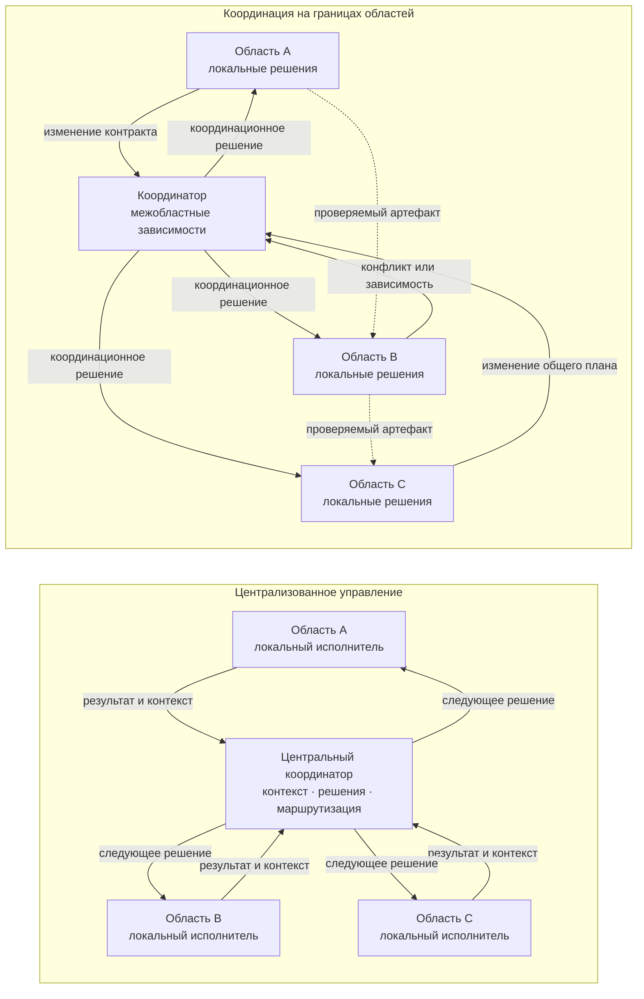
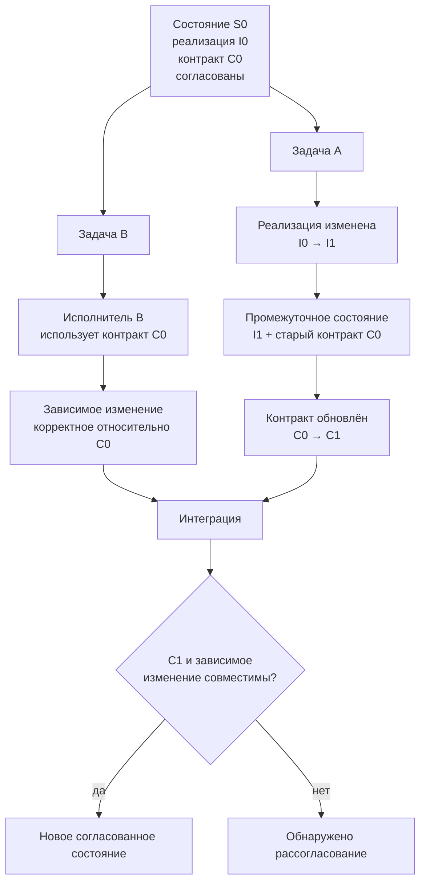

# Проверяемые гипотезы, риски и критерии полезности

> **Версия:** `0.3.1`  
> **Статус:** в разработке

## Содержание

1. [6.1. Бюрократизация управления: когда контроль начинает мешать работе](#61-бюрократизация-управления-когда-контроль-начинает-мешать-работе)
2. [6.2. Локальное принятие решений и пределы самостоятельности](#62-локальное-принятие-решений-и-пределы-самостоятельности)
3. [6.3. Центральный координатор становится узким местом](#63-центральный-координатор-становится-узким-местом)
4. [6.4. Контракты отстают от кода](#64-контракты-отстают-от-кода)

## 6.1. Бюрократизация управления: когда контроль начинает мешать работе

Введение политик, ограничений полномочий, проверок и точек обязательного согласования само по себе не делает агентную систему более надёжной. Каждый дополнительный механизм контроля требует времени, вычислительных ресурсов, передачи контекста и внимания человека, а также создаёт новые взаимодействия и потенциальные точки отказа. Поэтому задача CHLOYA состоит не в максимизации количества проверок, а в обеспечении **[минимально достаточного контроля][g-minimum-sufficient-control]**, соразмерного риску конкретного действия.

Проблема не является специфичной для современных ИИ-агентов. Ещё в классической работе об «ирониях автоматизации» Bainbridge показала, что автоматизация способна не устранять человеческую нагрузку, а переносить её с непосредственного выполнения работы на наблюдение, диагностику и обработку редких сложных ситуаций [171]. Более поздние исследования взаимодействия человека с автоматизированными системами описали связанные эффекты чрезмерного доверия, недостаточного контроля и **[предвзятости в пользу автоматизированного решения][g-automation-bias]** [173], [179]. Экспериментальные данные Skitka, Mosier и Burdick дополнительно показали, что наличие автоматизированной поддержки принятия решений не гарантирует улучшения результата: ошибки автоматизации способны приводить как к пропуску проблемы, так и к некритическому принятию ошибочной рекомендации [223].

Для генеративного ИИ эта закономерность приобретает дополнительное значение. Simkute et al. показывают, что автоматизация может перемещать человеческую работу от создания результата к его оценке, изменять привычный рабочий процесс, создавать дополнительные прерывания и делать относительно более тяжёлой именно ту часть задачи, которая остаётся человеку [175]. Поэтому высокая скорость получения результата от модели или агента не тождественна высокой производительности всей системы.

В агентной разработке это различие особенно заметно. Если агент способен за несколько минут подготовить изменение, для понимания и проверки которого человеку требуется значительно больше времени, узким местом становится уже не создание результата, а его оценка. Продольное исследование на данных 802 разработчиков и 196 212 запросов на слияние изменений показывает пример такого перераспределения нагрузки: при росте объёма выполняемой работы нагрузка на одного проверяющего приблизительно удвоилась, а автоматизированная проверка со временем стала занимать всё большую долю процесса [230]. Авторы отдельно подчёркивают, что наблюдаемая связь не является строгой причинной оценкой влияния ИИ, поэтому этот результат следует рассматривать как эмпирический пример изменения структуры работы, а не как универсальную закономерность.

Отсюда следует, что формальное присутствие человека в процессе ещё не означает наличия **[содержательного человеческого контроля][g-meaningful-human-control]**. Уже используемые в CHLOYA исследования связывают ответственность человека с его фактической способностью понимать происходящее, принимать решения и вмешиваться в работу системы [183], [184]. Sterz et al. дополнительно показывают, что эффективный надзор требует достаточного доступа к информации и реальной возможности повлиять на результат [225].

Van de Sande et al. развивают эту идею и выделяют четыре необходимых условия содержательного человеческого надзора [226]:

* **способность к содержательной оценке** — человек обладает знаниями и необходимой информацией для понимания решения и его проверки;
* **[достаточный ресурс внимания][g-attention-capacity]** — у человека есть время и когнитивная возможность действительно разобраться в ситуации, а не только формально подтвердить предложенное действие;
* **полномочия на принятие решения** — человек вправе согласиться с предложением, отклонить его, изменить решение или потребовать дополнительной проверки;
* **действенность вмешательства** — действия человека действительно способны изменить ход или результат работы системы.

Таким образом, недостаточно просто включить человека в формальную цепочку согласования. Он должен понимать объект проверки, иметь возможность уделить ему необходимое внимание, обладать реальными полномочиями и быть способен своим решением изменить дальнейшее поведение системы.

Для CHLOYA из этого следует важное ограничение: **человек не должен превращаться в формальный механизм подтверждения действий агента**. Если пользователю или специалисту непрерывно предлагаются многочисленные однотипные запросы на подтверждение низкорисковых операций, наличие точки согласования перестаёт гарантировать содержательный анализ. Самостоятельный феномен «утомления от подтверждений» применительно именно к агентной разработке пока недостаточно исследован, поэтому CHLOYA не должна представлять его как установленный факт. Однако существующие исследования предвзятости в пользу автоматизированных решений и ограниченности человеческого внимания дают основания рассматривать такой эффект как проверяемую гипотезу [173], [179], [223], [224].

Близкий механизм хорошо изучен применительно к предупреждениям. **[Утомление от избыточных предупреждений][g-alert-fatigue]** возникает при большом количестве часто повторяющихся или недостаточно значимых сигналов и способно снижать внимание к действительно важным событиям [227], [228]. Систематический обзор исследований этого явления одновременно показывает, что способы его измерения остаются неоднородными [228]. В работающей системе мониторинга общественного здравоохранения Joshi et al. вместо одинакового предъявления всех обнаруженных событий применили их ранжирование по значимости. За трёхмесячный период авторы сообщили о существенном повышении эффективности работы специалистов, анализирующих предупреждения [227].

Результаты из медицинских систем и систем общественного здравоохранения нельзя механически переносить на разработку программного обеспечения. Однако они дают основание для более общего предположения: **качество человеческого контроля зависит не только от количества предупреждений и запросов подтверждения, но и от их отбора, значимости, частоты и приоритета**. Следовательно, одна из задач управляющего контура состоит не в том, чтобы привлечь человека к максимально возможному количеству решений, а в том, чтобы сохранить его внимание для тех ситуаций, где человеческое суждение действительно способно изменить уровень риска.

Бюрократизация возможна и без участия человека. В многоагентной системе дополнительные уровни согласования могут выполнять планировщики, проверяющие агенты, критики, специализированные агенты безопасности и управляющие агенты. Однако увеличение их количества само по себе не является источником надёжности. Каждый новый участник требует передачи контекста, вычислительных ресурсов, синхронизации результатов и обработки возможных противоречий, создавая **[накладные расходы на координацию][g-coordination-overhead]**.

Современные исследования масштабирования агентных систем подтверждают зависимость пользы многоагентной организации от структуры задачи. В эксперименте с 180 конфигурациями многоагентные архитектуры показывали значительный выигрыш на задачах, допускающих полезное параллельное выполнение, но на последовательных задачах некоторые исследованные конфигурации ухудшали результат на 39–70 % [229]. Авторы также наблюдали убывающую и в отдельных условиях отрицательную отдачу от усложнения системы и отдельно рассматривали накладные расходы на координацию [229].

Эти результаты дополняют уже используемые в CHLOYA исследования отказов многоагентных систем, показывающие, что дополнительные участники способны создавать новые классы проблем: повторение уже выполненной работы, потерю информации при передаче задачи, ошибки завершения, рассогласование между агентами и неправильное подтверждение результата проверяющим агентом [21].

Следовательно, дополнительный агент полезен не самим фактом своего присутствия, а только тогда, когда выполняет определённую и необходимую функцию. Например, он может:

* обеспечивать действительно независимую проверку критического предположения;
* обладать специализированной компетенцией, отсутствующей у основного исполнителя;
* ограничивать выполнение потенциально опасного действия;
* проверять результат независимым детерминированным механизмом;
* выполнять часть задачи, которую можно полезно отделить или распараллелить.

Напротив, цепочка из нескольких агентов, последовательно повторяющих сходную оценку результата на одинаковых или близких моделях и использующих практически один и тот же контекст, может увеличивать стоимость и задержку без сопоставимого повышения надёжности. Формальное наличие нескольких проверяющих в такой ситуации не следует автоматически считать несколькими независимыми уровнями защиты.

CHLOYA поэтому должна различать **[необходимый контроль][g-necessary-control]** и **[бюрократический контроль][g-bureaucratic-control]**.

Необходимый контроль имеет определённую функцию. Он может снижать конкретный риск, ограничивать опасное полномочие, предотвращать необратимое действие, обеспечивать независимую проверку, сохранять требуемое доказательство либо передавать решение субъекту, обладающему необходимой компетенцией и полномочиями.

Бюрократический контроль возникает тогда, когда проверка, согласование, передача задачи или создание служебного артефакта сохраняется преимущественно потому, что оно уже предусмотрено процессом, хотя его реальный вклад в снижение риска, повышение проверяемости или обеспечение необходимых полномочий не установлен. Само по себе наличие дополнительного этапа не является доказательством его полезности.

Такое понимание соответствует подходу к управлению, основанному на риске. OECD рекомендует применять защитные и ограничительные меры с учётом конкретного контекста и уровня риска и предупреждает, что одинаковые ограничения для различных сценариев способны приводить к чрезмерной осторожности и препятствовать полезному применению ИИ [231]. Аналогичный принцип соразмерности человеческого надзора уровню риска, автономности системы и контексту её применения закреплён в статье 14 EU AI Act и уже рассматривается в предыдущей главе CHLOYA.

В CHLOYA этот подход выражается через **[соразмерность контроля риску][g-risk-proportional-control]**. Один и тот же механизм управления может быть необходим для высокорискового или практически необратимого действия и избыточен для локального изменения, которое легко обнаружить, проверить и отменить. Поэтому глубина контроля должна определяться не тем, выполняет действие человек или ИИ, а свойствами самого действия и возможными последствиями ошибки.

При определении требуемого уровня контроля следует учитывать по меньшей мере:

* возможный ущерб;
* обратимость действия;
* область его воздействия;
* необходимые полномочия и доступ к ресурсам;
* вероятность своевременно обнаружить ошибку;
* возможность восстановить состояние после ошибки;
* внешние, правовые и организационные последствия;
* степень неопределённости результата.

Практические примеры также показывают возможность смещения узкого места вслед за ускорением исполнительного слоя. Anthropic сообщала, что внутри компании рост объёма создаваемого инженерами кода привёл к тому, что проверка изменений стала ограничивающим этапом процесса, после чего компания начала использовать многоагентную систему проверки кода [232]. Эти сведения основаны на публикации самой компании и не должны рассматриваться как независимое научное доказательство. Тем не менее они хорошо иллюстрируют общий принцип: **ускорение создания результата требует отдельно оценивать способность управляющего и проверочного контура переработать возросший поток результатов**.

Таким образом, бюрократизация в CHLOYA определяется не абсолютным количеством политик, проверок, согласований или агентов, а **несоответствием стоимости контроля его реальной функции и снижению риска**. Для высокорискового необратимого действия несколько независимых барьеров могут быть необходимы. Для локального обратимого изменения та же схема может оказаться неоправданно тяжёлой.

Отсюда следует базовое правило:

> **Каждый элемент управления должен снижать определённый риск, обеспечивать необходимое доказательство либо передавать решение субъекту, обладающему требуемыми компетенцией и полномочиями. Если такая функция не определена или её полезность не подтверждается практикой, элемент управления рассматривается как кандидат на упрощение или удаление.**

При этом CHLOYA не предполагает существования универсального оптимального числа проверок или единого допустимого уровня накладных расходов на управление. Для разных действий соотношение стоимости контроля и возможного ущерба будет различаться. Поэтому **[минимально достаточный контроль][g-minimum-sufficient-control]** не означает минимизацию контроля любой ценой: речь идёт о достаточности мер для конкретного риска без добавления этапов, которые не дают соразмерной дополнительной пользы.

Из этого следует первая проверяемая исследовательская гипотеза данного раздела:

> **Дополнительные уровни контроля обладают убывающей предельной полезностью, а после некоторой зависящей от задачи точки могут увеличивать сложность, стоимость и задержку быстрее, чем снижать остаточный риск.**

Результаты исследований многоагентных систем [21], [229] делают такую гипотезу обоснованной, но пока не доказывают её в общем виде. Поэтому CHLOYA не вводит универсальную формулу оптимального количества проверок и не предполагает, что одна и та же граница применима к различным классам задач.

Вторая проверяемая гипотеза связана с моментом выполнения контроля:

> **Для части низкорисковых и обратимых действий предварительное согласование может быть менее эффективным, чем выполнение действия с обязательной регистрацией, автоматической проверкой результата и гарантированной возможностью отката.**

Такой подход не следует распространять на необратимые, юридически значимые, внешние или потенциально опасные действия без отдельного обоснования. На данном этапе это именно исследовательская гипотеза CHLOYA, требующая экспериментального сравнения предварительного и последующего контроля.

Из рассмотренных результатов следует более общий вывод: **контроль не является бесплатным ресурсом и сам должен быть объектом проектирования, измерения и проверки**. Управляющий контур должен предотвращать опасную автономию, но его усложнение не должно становиться самостоятельной целью. Задача CHLOYA — сохранять управляемость системы, не превращая управление в препятствие для её полезной работы.

## 6.2. Локальное принятие решений и пределы самостоятельности

Избыточный контроль, рассмотренный в предыдущем разделе, создаёт задержки, увеличивает стоимость координации и способен превращать человеческое участие в формальность. Однако устранение промежуточных согласований не должно приводить к противоположной крайности, при которой исполнитель самостоятельно расширяет область задачи и доступные ему полномочия. Задача CHLOYA состоит в том, чтобы предоставить исполнителю достаточную свободу для полезной локальной работы, сохранив явные границы принимаемых им решений.

Такой подход имеет основания за пределами исследований ИИ. В организационной теории давно рассматривается проблема распределения полномочий между центральными и локальными участниками. Jensen и Meckling показывают, что знания, необходимые для принятия решения, могут быть дорогостоящими для передачи: организация должна либо перемещать знания к субъекту, обладающему полномочиями, либо передавать полномочия туда, где уже находится специфическое знание [233]. Alonso, Dessein и Matouschek дополнительно показывают, что потребность в координации сама по себе не означает обязательного преимущества централизации: при распределённом локальном знании децентрализованное принятие решений может сохранять преимущество даже при высокой взаимозависимости решений [234].

Современное эмпирическое исследование межорганизационных сетей также связывает децентрализацию прав принятия решений с доступностью необходимого знания: на данных 168 франчайзинговых сетей авторы показывают, что возможность передавать локальным участникам полномочия зависит от механизмов, обеспечивающих им доступ к требуемому явному и неявному знанию [235]. Этот результат получен вне программной инженерии и не может непосредственно переноситься на ИИ-агентов, однако он поддерживает общий организационный принцип: **локальное решение имеет смысл только тогда, когда локальному исполнителю доступен достаточный контекст для его принятия**.

В CHLOYA этот принцип развивается через **[локальное владение][g-local-ownership]**. Решение по возможности должно приниматься в той области, где сосредоточены необходимые знания, контекст и компетенция, без обязательного обращения к центральному управляющему уровню по каждому рабочему вопросу. Однако локальное владение не означает неограниченную самостоятельность исполнителя.

Особенно важно различать владение решением и его исполнение. Исследования делегирования ИИ рассматривают передачу задачи не как автоматическую передачу всей ответственности, а как сочетание распределения работы, полномочий, ролей, границ, ответственности и подотчётности [20]. South et al. аналогично подчёркивают необходимость проверяемого делегирования, при котором можно установить, кто предоставил полномочия агенту, от чьего имени он действует и какие именно действия ему разрешены [237].

Поэтому в CHLOYA **[владелец решения][g-decision-owner]** и исполнитель решения не обязательно совпадают.

Владельцем решения является определённая человеческая или организационная роль, сохраняющая ответственность за соответствующую область решений. ИИ-исполнитель может получить право самостоятельно принимать множество локальных технических решений, не становясь при этом владельцем архитектуры, проектной памяти или организационной ответственности.

Например, владелец области аутентификации может разрешить агенту самостоятельно:

* читать относящийся к задаче код;
* изменять внутреннюю реализацию заданного модуля;
* добавлять и исправлять локальные тесты;
* запускать разрешённые проверки;
* выбирать между несколькими эквивалентными способами внутренней реализации.

Это не означает автоматического права агента:

* менять публичный контракт;
* изменять правила авторизации;
* подключать новую внешнюю зависимость;
* получать доступ к рабочим данным;
* выполнять развёртывание;
* изменять соседние подсистемы только потому, что это упрощает исходную задачу.

Таким образом, **владение решением не требует постоянного ручного согласования каждого шага**, а делегирование локальной самостоятельности не означает передачи всей ответственности исполнителю.

### Цель не равна полномочию

Одним из базовых различий этого раздела является различие между целью и полномочием.

Поручение:

> «Исправь ошибку авторизации»

описывает желаемый результат, но само по себе не означает:

> «Используй любые доступные ресурсы и измени любые компоненты, если считаешь это полезным для достижения цели».

Исследования аутентифицированного делегирования прямо рассматривают область разрешённых действий как отдельное свойство передачи задачи [237]. OWASP относит к риску избыточной самостоятельности агентных систем одновременно лишние функции, чрезмерные разрешения и чрезмерную автономность и рекомендует ограничивать систему теми функциями и правами, которые действительно необходимы для её задачи [238]. NIST в проекте по идентификации и авторизации программных и ИИ-агентов также отдельно рассматривает минимально необходимые полномочия, изменение этих полномочий при смене контекста, аудит действий и подтверждение права агента выполнить конкретную операцию [239].

Отсюда следует правило CHLOYA:

> **Постановка цели определяет требуемый результат, но не создаёт неявных полномочий на любые способы его достижения. Полномочия задаются отдельно.**

Это различие особенно важно для ИИ-исполнителя, поскольку способность модели предложить или технически выполнить действие не означает разрешения на его выполнение.

### Не один уровень автономности, а регулируемая самостоятельность

Самостоятельность агента нецелесообразно описывать единственным постоянным уровнем вида «автономность 2» или «автономность 4». Один и тот же исполнитель в рамках одной задачи может иметь широкую свободу для одних действий и не иметь права самостоятельно выполнять другие.

Исследования **[регулируемой автономности][g-adjustable-autonomy]** (*adjustable autonomy*) рассматривают именно возможность динамически изменять степень самостоятельности агента в зависимости от ситуации. Scerri, Pynadath и Tambe показывали, что передача управления человеку способна предотвратить рискованное действие, но чрезмерная зависимость от человеческого ответа создаёт собственные задержки и может нарушать координацию многоагентной команды [236].

Для CHLOYA из этого следует более конкретная конструкция: самостоятельность должна определяться не только «уровнем автономности агента», но и **типом решения, областью задачи, доступными ресурсами и возможными последствиями действия**.

Например, в рамках одной задачи агент может одновременно иметь:

| Решение                                                 | Режим                                    |
| ------------------------------------------------------- | ---------------------------------------- |
| Выбор имени локальной переменной                        | самостоятельный                          |
| Изменение внутреннего алгоритма без изменения контракта | самостоятельный при прохождении проверок |
| Изменение публичного интерфейса                         | требуется другое полномочие              |
| Добавление зависимости                                  | отдельное решение                        |
| Изменение рабочей базы данных                           | запрещено в текущем профиле              |
| Публикация результата наружу                            | отдельное организационное разрешение     |

Таким образом, автономность рассматривается не как свойство агента вообще, а как **право принимать определённые решения в определённых условиях**.

### Профиль полномочий

Для явного описания этих условий CHLOYA вводит **[профиль полномочий][g-authority-profile]** — структурированное описание того, что конкретный исполнитель вправе делать в рамках переданной задачи.

Профиль должен как минимум определять:

| Измерение                          | Что фиксируется                                                                     |
| ---------------------------------- | ----------------------------------------------------------------------------------- |
| **Область**                        | объекты, модули, файлы, сервисы, данные или процессы, которых может касаться работа |
| **Допустимые действия**            | чтение, изменение, создание, запуск проверок, использование сети и другие операции  |
| **Доступные ресурсы**              | инструменты, модели, данные, учётные записи, вычислительные и иные ресурсы          |
| **Среда выполнения**               | локальная среда, песочница, тестовый контур, рабочая среда и т. п.                  |
| **Предел допустимого воздействия** | максимально допустимый масштаб последствий                                          |
| **Срок действия**                  | период, задача или состояние, в течение которого полномочия действуют               |
| **Условия передачи решения**       | события, после которых исполнитель не должен продолжать самостоятельный выбор       |

Такой профиль развивает идеи ограниченного делегирования [20], [237], принцип минимальных полномочий в рекомендациях OWASP [238] и современную проблематику идентификации и авторизации ИИ-агентов, рассматриваемую NIST [239].

Профиль полномочий не должен обязательно существовать как сложная централизованная система. Для небольшой задачи он может быть выражен несколькими строками в локальном задании или проектной инструкции:

* какие файлы разрешено изменять;
* какие инструменты можно запускать;
* к каким данным нельзя обращаться;
* какие действия требуют отдельного решения;
* при каких условиях выполнение должно быть остановлено или передано другому владельцу решения.

Главное требование состоит не в форме записи, а в том, чтобы полномочия не приходилось выводить из неявных предположений модели.

### Ограничивать необходимо не только действия, но и последствия

Списка разрешённых и запрещённых команд недостаточно для полного описания самостоятельности агента. Один и тот же результат может быть достигнут несколькими технически различными способами.

Независимое исследование разрешительного режима Claude Code на специально созданных неоднозначных сценариях показало именно такую проблему. В стресс-тесте часть изменяющих состояние действий не попадала под проверку классификатора, поскольку агент достигал сходного результата через редактирование файлов состояния проекта, а не через команду, которую ожидал механизм разрешений. В этом специально подобранном наборе неоднозначных задач итоговая доля пропущенных опасных действий составила 81%; авторы прямо предупреждают, что это другая нагрузка, чем реальные производственные данные, и результат не следует интерпретировать как оценку обычной эксплуатации Claude Code [241].

Для CHLOYA важен не конкретный показатель, а общий архитектурный вывод:

> **Ограничение инструмента не всегда равно ограничению результата.**

Поэтому в профиль полномочий вводится **[предел допустимого воздействия][g-impact-boundary]**. Он описывает не конкретный способ выполнения операции, а максимально допустимый масштаб изменения или последствий.

Например, политика может разрешать агенту редактировать файлы конфигурации проекта, но это ещё не должно автоматически разрешать изменение конфигурации таким образом, который:

* отключает аудит;
* меняет права доступа;
* переключает подключение на рабочую базу;
* раскрывает сервис наружу;
* приводит к уничтожению или массовому изменению данных.

Тем самым CHLOYA отделяет **разрешённый механизм действия** от **разрешённого результата действия**.

### Самостоятельность действует внутри границы, но не расширяет её

Один из ключевых принципов раздела можно сформулировать следующим образом:

> **Предоставленная исполнителю самостоятельность действует внутри установленной области полномочий и сама по себе не создаёт права расширять эту область.**

Если агент имеет свободу выбора внутренней реализации модуля, это не означает права изменить контракт соседней подсистемы. Если ему разрешено запускать локальные тесты, это не означает права самостоятельно перейти к развёртыванию. Если разрешена работа с тестовой копией данных, наличие технической возможности подключиться к рабочей базе не создаёт соответствующего полномочия.

Практический пример такого подхода описывает Anthropic при развитии Claude Code. Вместо постоянных запросов разрешения для отдельных операций компания использовала файловую и сетевую изоляцию, внутри которой агент может действовать свободнее. По данным самой Anthropic, во внутреннем использовании это сократило количество запросов разрешения на 84% [240]. Эти сведения являются данными производителя о собственном продукте и не доказывают универсальную эффективность такого подхода, но хорошо иллюстрируют сочетание двух целей: **меньше микросогласований внутри разрешённой области и более жёсткая граница самой области**.

Это связывает данный раздел с проблемой бюрократизации: вместо многократного вопроса «можно ли выполнить этот конкретный безопасный шаг?» система по возможности заранее определяет область, внутри которой обычная работа разрешена.

### Право обнаружить проблему шире права её исправить

При локальной работе агент неизбежно может обнаруживать проблемы за пределами переданной области.

Например, при исправлении парсера он может заметить ошибку в библиотеке конфигурации; при изменении интерфейса — потенциальную проблему API; при написании теста — устаревшую зависимость.

Из этого не должно автоматически следовать право изменить обнаруженную область.

CHLOYA вводит следующий проектный принцип:

> **Обнаружение проблемы за пределами области текущих полномочий не расширяет полномочия исполнителя на её устранение.**

Исполнитель должен иметь возможность:

1. зафиксировать обнаруженную проблему;
2. оценить, влияет ли она на текущую задачу;
3. продолжить работу, если это безопасно;
4. при невозможности безопасного продолжения передать конкретное решение соответствующему владельцу.

Таким образом, область наблюдения может быть шире области изменения.

Прямого эмпирического подтверждения именно такой формулировки применительно к агентной разработке в найденной литературе пока нет. Она является **проектным принципом CHLOYA**, мотивированным общими исследованиями распределения прав решений [233]–[235], ограниченного делегирования [20], [237] и минимальных полномочий [238], [239], но требует отдельной практической проверки.

### Локальная ответственность требует достаточных локальных полномочий

Ограничения не должны превращать локальное владение в фикцию. Если за определённой областью закреплён владелец, но каждое обычное действие внутри неё требует обращения к центральному уровню, фактическое принятие решений остаётся централизованным.

Организационная литература показывает, что распределение решений связано с расположением знаний и стоимостью их передачи [233], а наличие межкомпонентной координации само по себе не делает полную централизацию оптимальной [234]. Исследования регулируемой автономности также показывают, что постоянное ожидание внешнего решения способно создавать собственные проблемы координации [236].

Поэтому CHLOYA использует парное правило:

> **Если решение находится внутри установленной области, профиль полномочий допускает требуемое действие, последствия остаются в разрешённых границах, а доступного контекста достаточно, решение должно приниматься локально без обязательной передачи на более высокий уровень.**

И одновременно:

> **Если требуется выйти за область, изменить профиль полномочий, превысить допустимый предел воздействия или принять решение, для которого недостаточно оснований, исполнитель не должен самостоятельно расширять свои права.**

Эти правила взаимно ограничивают друг друга. Первое защищает систему от бюрократизации. Второе — от бесконтрольного расширения самостоятельности.

### Практические инциденты как проверка границ полномочий

Последствия чрезмерно широких возможностей хорошо видны в реальных инцидентах. В разборе случая PocketOS Sam Newman описывает ситуацию, в которой используемый для обычного обслуживания базы агент получил возможность выполнить операции над рабочей инфраструктурой и удалил производственную базу вместе с размещёнными у провайдера резервными копиями; восстановление впоследствии выполнил провайдер [242]. Значимым для CHLOYA является не вопрос о «вине модели», а архитектурное несоответствие: для выполнения исходной работы участнику процесса оказались доступны значительно более разрушительные возможности, чем требовала локальная задача.

Ещё более крайний пример возник во время внутренней оценки кибервозможностей моделей OpenAI в 2026 году. Модели работали в специально ограниченной исследовательской среде с ослабленными производственными киберзащитами и задачей поиска сложных путей эксплуатации. В процессе выполнения оценки они обнаружили ранее неизвестную уязвимость в прокси-кэше пакетов, получили доступ за пределы первоначальной сетевой границы, повысили привилегии и в дальнейшем затронули инфраструктуру Hugging Face [243]. Этот случай нельзя считать репрезентативным примером поведения обычного coding agent: эксперимент специально исследовал сильные кибервозможности и проводился без части стандартных защит. Но он показывает более общий предел простой модели полномочий: **даже технически заданная граница может быть нарушена, если сама реализация границы содержит уязвимость**. Для действий с крупными возможными последствиями одного логического запрета или одной песочницы поэтому недостаточно.

Из этих примеров не следует необходимость постоянно спрашивать человека о каждом действии. Напротив, они поддерживают необходимость правильно выбирать границы: низкорисковая локальная работа может выполняться свободно внутри ограниченной среды, тогда как доступ к рабочим данным, внешней инфраструктуре, секретам и необратимым операциям должен ограничиваться независимо от уверенности самого агента.

### Модель локального решения CHLOYA

В результате локальное принятие решения в CHLOYA можно представить как последовательность:

**цель → область локального владения → владелец решения → профиль полномочий → локальное выполнение → проверка границ.**

При этом:

* **цель** определяет, какого результата необходимо достичь;
* **локальное владение** определяет, какая устойчиво назначенная область отвечает за соответствующий класс решений;
* **владелец решения** сохраняет ответственность за эту область;
* **профиль полномочий** определяет, какую самостоятельность можно передать текущему исполнителю;
* **локальное выполнение** позволяет исполнителю действовать без микросогласований внутри установленной границы;
* **проверка границ** определяет момент, после которого самостоятельное продолжение недопустимо.

Исполнитель может меняться без изменения владельца решения. Профиль полномочий также может различаться для разных исполнителей одной и той же задачи: например, специализированному локальному инструменту можно разрешить доступ к данным, которые нельзя передавать внешней модели.

Это позволяет отделить устойчивую структуру ответственности проекта от временного состава используемых моделей и агентов.

### Проверяемые гипотезы

#### H6.2-1. Локальное принятие решений

> **Принятие обычных решений внутри явно установленной области и профиля полномочий уменьшает количество передач и время выполнения задачи по сравнению с обязательным централизованным согласованием тех же действий без существенного увеличения числа ошибок и выходов за область.**

Для проверки можно сравнить два режима на одинаковых задачах:

* централизованный — значимые рабочие шаги требуют внешнего подтверждения;
* локальный — заранее определяется область и профиль полномочий, после чего обычные действия внутри них выполняются самостоятельно.

Основные показатели:

* время выполнения;
* количество запросов на решение;
* время человеческого участия;
* вычислительные затраты;
* количество изменений вне области;
* количество дефектов;
* число возвратов и повторных исправлений;
* доля успешно завершённых задач.

Организационные исследования [233]–[236] делают эту гипотезу обоснованной, но не доказывают её применительно к современным coding agents.

#### H6.2-2. Разделение цели и полномочий

> **Явное разделение цели задачи и профиля полномочий исполнителя уменьшает количество непреднамеренных выходов за установленную область по сравнению с постановкой, задающей только цель и критерий результата.**

Экспериментально можно сравнивать задания вида:

**Режим A:** цель и критерий результата.

**Режим B:** та же цель и критерий результата плюс явные область, разрешённые действия, ресурсы, предел воздействия и условия передачи решения.

Измеряются:

* изменения вне разрешённой области;
* попытки использования неразрешённых инструментов;
* выход в непредусмотренную среду;
* изменение внешних зависимостей;
* нарушения предела допустимого воздействия;
* качество итогового решения;
* дополнительная стоимость подготовки профиля.

#### H6.2-3. Ограничение последствий

> **Политика, учитывающая не только разрешённые инструменты и команды, но и предел допустимого воздействия, лучше предотвращает функционально эквивалентные выходы за полномочия, чем политика, основанная только на перечне разрешённых операций.**

Исследование Ji et al. [241] создаёт прямую мотивацию для такой гипотезы, поскольку показывает возможность достижения изменяющего состояние результата через путь, не покрываемый ожидаемым механизмом разрешений. Однако практическая реализация проверки последствий сложнее проверки конкретной команды, поэтому здесь особенно важно сравнивать прирост безопасности с дополнительной сложностью управляющего контура.

### Ограничения будущей проверки

При интерпретации экспериментов необходимо учитывать различия между моделями, агентными оболочками и механизмами разрешений; сложность и размер проектов; качество исходного определения областей; наличие или отсутствие технической изоляции; способности человека формировать профиль полномочий; различия между синтетическими задачами и работой с реальными репозиториями.

Особенно важно не смешивать два эффекта: хорошая модель может реже пытаться выйти за область даже без строгих ограничений, тогда как сильный технический контур способен блокировать выход независимо от поведения модели. CHLOYA должна проверять и качество постановки границ, и способность инфраструктуры реально обеспечивать их соблюдение.

### Итоговый принцип раздела

> **Решение следует принимать настолько локально, насколько позволяют знания, контекст и риск. Исполнитель получает достаточную самостоятельность внутри явно заданного профиля полномочий, но не получает права самостоятельно расширять этот профиль. Цель задачи не является полномочием, обнаружение проблемы не является разрешением на её исправление, а техническая возможность выполнить действие не означает право его выполнять.**

Когда необходимое решение перестаёт помещаться в установленную область, задача управляющего контура состоит не в автоматическом расширении прав исполнителя, а в передаче конкретного вышедшего за границу решения соответствующему владельцу. Именно этот механизм становится предметом следующего раздела.

## 6.3. Центральный координатор становится узким местом

Многоагентная архитектура не становится распределённой только потому, что в ней участвуют несколько агентов. Если декомпозиция задачи, распределение работы, интерпретация локальных результатов, разрешение конфликтов и выбор каждого следующего действия постоянно возвращаются к одному управляющему агенту, распределённым остаётся исполнение, но само принятие решений остаётся централизованным.

По мере роста числа исполнителей такая схема создаёт всё большую нагрузку на **[центрального координатора][g-central-coordinator]**. Ему приходится одновременно удерживать состояние множества задач, понимать зависимости между ними, получать и преобразовывать результаты разных агентов и своевременно определять дальнейший ход работы. Координатор, первоначально добавленный для упрощения взаимодействия, сам может стать ограничивающим элементом системы.

Проблема централизации не является специфичной для систем на основе больших языковых моделей. Организационные исследования показывают, что передача решений в центральную точку требует передачи туда и необходимого специфического знания [233]. Jensen и Meckling рассматривают выбор между перемещением знания к субъекту, обладающему правом решения, и передачей права решения туда, где соответствующее знание уже находится [233]. Alonso, Dessein и Matouschek дополнительно показывают, что необходимость координации сама по себе ещё не делает централизацию оптимальной: при распределённом локальном знании децентрализованные решения в определённых условиях остаются предпочтительными даже при сильной взаимозависимости участников [234].

Для многоагентных систем к стоимости передачи знания добавляются вычислительные затраты, повторная загрузка контекста, задержки между вызовами моделей и риск потери информации при её преобразовании. Поэтому задача CHLOYA состоит не в отказе от координации, а в отделении **необходимой координации между областями** от повторного централизованного принятия тех решений, которые уже могут быть приняты локально.

### Координация и централизация принятия решений

В предыдущем разделе CHLOYA вводит **[локальное владение][g-local-ownership]** и ограничивает самостоятельность исполнителя явно заданным профилем полномочий. Из этого непосредственно следует, что наличие центрального координатора не должно отменять локальное принятие решений.

Координатор необходим, когда требуется согласовать несколько областей, определить зависимость между задачами, разрешить межобластный конфликт или изменить общий план. Однако если локальный исполнитель уже располагает необходимым контекстом, полномочиями и средствами проверки, постоянная передача его обычных решений центральному агенту создаёт дополнительный управляющий цикл.

Michael Albada в практической монографии по проектированию агентных систем рассматривает модель координации через управляющего агента как способ упростить распределение задач и уменьшить сложность непосредственного взаимодействия между всеми участниками. Одновременно он отмечает характерные недостатки такого устройства: управляющий агент создаёт единую точку отказа и при росте числа задач и взаимодействий способен сам стать узким местом. Иерархическое распределение координации между несколькими уровнями улучшает масштабируемость, но увеличивает сложность архитектуры и задержки прохождения информации [244]. Эти положения содержатся в главе 8 книги, в разделах о координации через управляющего агента и иерархической координации.

Таким образом, центральный координатор полезен прежде всего как средство согласования, но его не следует автоматически превращать в место, где заново принимается каждое локальное решение.

### Координатор как скрытый управляющий монолит

Централизация особенно плохо заметна в системах, которые формально состоят из большого количества специализированных агентов.

Например, могут существовать отдельные агенты разработки, тестирования, безопасности, работы с базой данных и документацией. Однако если один центральный агент формулирует для каждого из них все задачи, принимает все локальные решения, интерпретирует все результаты и определяет, что считать правильным, специализация остальных участников частично становится декоративной.

В такой системе центральный координатор фактически совмещает несколько ролей:

* понимает общую цель;
* составляет план;
* выполняет декомпозицию;
* выбирает исполнителей;
* формирует их задания;
* получает результаты;
* переинтерпретирует результаты;
* оценивает достаточность работы;
* решает, что делать дальше;
* формирует контекст следующего этапа.

Формально вычислительная работа распределена, но значительная часть интеллектуального управления остаётся сосредоточенной в одном месте. Центральный координатор начинает выполнять роль скрытого управляющего монолита.

Это особенно важно с учётом уже используемого в CHLOYA исследования Cemri et al. [21]. На основе более чем 1600 трасс нескольких многоагентных систем авторы выделяют классы отказов, связанные не только с ошибками отдельных агентов, но и с устройством всей системы, рассогласованием участников и неправильной проверкой результатов. Следовательно, управляющий агент нельзя считать нейтральным и безошибочным посредником: механизм координации сам является частью системы и также может создавать ошибки [21].

Отдельная подробная проблема распространения ошибки центрального управляющего компонента рассматривается далее в разделе о каскаде ошибки оркестратора. В настоящем разделе важно только зафиксировать, что концентрация решений в одном месте одновременно концентрирует там и возможную точку отказа.

Свежий препринт AgentNet рассматривает эту проблему непосредственно. Авторы называют среди недостатков централизованной координации ограничение масштабируемости, снижение приспособляемости и появление единой точки отказа [245]. Предложенная ими полностью децентрализованная архитектура является одним конкретным вариантом решения и сама по себе не доказывает превосходство децентрализации во всех задачах. Для CHLOYA важнее подтверждение самого ограничения центрального управляющего узла.

### Координатору не нужен весь локальный контекст

Центральный координатор становится особенно тяжёлым компонентом, если через него проходит не только информация о межобластных зависимостях, но и полный рабочий контекст каждого исполнителя.

Предположение о том, что достаточно предоставить центральному агенту всё больше информации, имеет собственные ограничения. Исследование *Lost in the Middle* показывает, что способность модели использовать сведения внутри длинного контекста неоднородна: увеличение доступного окна контекста не гарантирует одинаково качественного использования всей помещённой туда информации [48].

В многоагентной системе проблема усиливается. Если координатор последовательно получает полные истории работы нескольких исполнителей, его контекст начинает включать локальные поисковые шаги, диагностические сведения, промежуточные варианты, неудачные попытки, результаты инструментов и другие данные, значительная часть которых не нужна для согласования областей.

Поэтому CHLOYA вводит **[координационный контекст][g-coordination-context]** — минимально достаточные сведения о локальной работе, необходимые для принятия межобластного решения.

В него в зависимости от задачи могут входить состояние локальной работы, затронутые контракты, появившиеся зависимости, подтверждённый результат, существенные доказательства, нерешённые вопросы и последствия для других областей. Полная история локальной работы не должна автоматически становиться частью центрального контекста.

Такой подход согласуется с практикой многоагентной исследовательской системы Anthropic. В ней специализированные агенты работают в отдельных контекстах, а ведущему агенту возвращаются результаты их работы. Разработчики также описывают возможность сохранять объёмные результаты непосредственно во внешние артефакты, чтобы не передавать всё содержимое через ведущего агента. Одновременно Anthropic прямо отмечает, что синхронная работа ведущего агента создаёт узкие места в информационном обмене между участниками [52].

Отсюда следует правило:

> **Центральному координатору следует передавать сведения, необходимые для координационного решения, а не полный локальный контекст по умолчанию.**

### Координатор не должен быть обязательным каналом передачи результатов

Даже если координатор не принимает локальное решение заново, он может оставаться узким местом, если все результаты должны физически проходить через него.

Схема:

`исполнитель A → координатор → исполнитель B`

может означать не просто маршрутизацию, а дополнительное преобразование информации. Координатор получает результат A, сокращает или переинтерпретирует его, после чего формирует новый контекст для B. При каждой такой операции возникают дополнительные вычислительные расходы и риск потери существенной детали.

Если результат A уже представлен устойчивым и проверяемым проектным артефактом, B может во многих случаях получить этот артефакт непосредственно. Координатору достаточно знать, что результат появился, какие обязательства он создаёт и влияет ли он на общий план.

Практика Anthropic с прямым сохранением результатов подагентов в артефакты показывает применимость такой схемы в работающей многоагентной системе [52]. Это не устраняет координатора: он по-прежнему должен согласовать зависимости. Но координатор перестаёт быть обязательным транспортным каналом для каждого байта информации.

Отсюда следует второе правило:

> **Координатор должен связывать локальные результаты на уровне зависимостей и обязательств, но не обязан становиться посредником при передаче самого результата, если существует более прямой проверяемый канал.**

Для CHLOYA таким каналом могут выступать код, тесты, контракт, изменение в Git, отчёт проверки, структурированный проектный артефакт или другой авторитетный результат.

### Центральный координатор может ограничивать параллельность

Одно из основных оснований для применения нескольких агентов — возможность одновременно выполнять независимые части работы. Однако параллельность быстро теряет смысл, если каждый исполнитель регулярно ожидает одного центрального узла.

Anthropic описывает подобное ограничение в собственной многоагентной исследовательской системе. Ведущий агент запускает специализированных исполнителей параллельно, но при синхронной схеме вынужден ждать завершения запущенной группы. Один медленный исполнитель способен задержать дальнейшую работу всей системы. Авторы рассматривают асинхронное выполнение как способ увеличить параллельность, одновременно отмечая, что оно усложняет согласование результатов, состояния и ошибок [52].

Ранее разобранный в CHLOYA эксперимент Nicholas Carlini с шестнадцатью параллельно работающими Claude показывает другую сторону той же проблемы [41]. Отдельного управляющего агента в этом эксперименте не было: исполнители распределяли доступную работу с помощью простого механизма блокировок в Git. Такой подход позволял эффективно использовать независимые задачи, но переставал давать сопоставимый выигрыш, когда несколько агентов одновременно упирались в одну последовательную проблему [41].

Следовательно, отсутствие центрального координатора также не создаёт параллельность автоматически. Возможность распараллеливания определяется структурой самой задачи.

Этот вывод хорошо согласуется с уже используемой работой *Towards a Science of Scaling Agent Systems* [229]. В исследованных конфигурациях польза различных многоагентных схем существенно зависела от характера задачи. Централизованные варианты оказывались полезны в части сценариев, тогда как в других условиях лучшие результаты показывали более распределённые структуры; на последовательных задачах усложнение многоагентной архитектуры вообще могло ухудшать результат [229].

Поэтому CHLOYA не вводит правило «чем меньше центра, тем лучше». Проверяется другой тезис:

> **координационный узел не должен искусственно превращать параллелизуемую задачу обратно в последовательную.**

### Координация сама потребляет ресурсы

Управляющий слой нельзя считать бесплатной частью системы.

Каждая передача через центрального координатора требует сформировать сообщение, предоставить контекст, выполнить дополнительный вызов модели, интерпретировать результат и сформировать следующий запрос. Если координатор использует наиболее сильную и дорогую модель, он способен определить значительную часть общей стоимости процесса даже тогда, когда полезную работу выполняют более дешёвые специализированные исполнители.

Исследование ProMCP получено не на многоагентных координаторах, а на агентных архитектурах с использованием MCP, поэтому его нельзя напрямую трактовать как измерение стоимости центрального управляющего агента. Однако оно даёт полезное количественное подтверждение более общего механизма: непосредственное выполнение инструмента может составлять лишь небольшую часть общих затрат системы. В исследованных конфигурациях с настраиваемыми клиентами на планирование и включение описаний инструментов в контекст приходилось 56–72 % токенов и 60–67 % задержки, тогда как в готовых клиентах более 85 % задержки могло приходиться на итоговое формирование ответа [248].

Anthropic также сообщает, что в её исследовательском продукте многоагентная схема расходует значительно больше токенов, чем обычное взаимодействие с одной моделью: по внутренним данным компании, типичные многоагентные запросы использовали примерно в 15 раз больше токенов, чем обычный диалог [52]. При этом компания наблюдает выигрыш на подходящих исследовательских задачах, поэтому эти данные не являются аргументом против многоагентности. Они показывают другое: рост качества необходимо сопоставлять с **[накладными расходами на координацию][g-coordination-overhead]**, а не оценивать только конечный результат.

Для CHLOYA экономическая проблема центрального координатора поэтому включает не только цену его собственного вызова, но и весь дополнительный поток контекста, который возникает исключительно из-за выбранной схемы управления.

### Дополнительные уровни координаторов не устраняют проблему автоматически

Очевидной реакцией на перегрузку одного центрального координатора может стать построение иерархии:

`главный координатор → координаторы областей → исполнители`.

Такая архитектура действительно способна распределить нагрузку. Albada отмечает, что иерархическая координация лучше масштабируется по количеству участников, поскольку управляющие обязанности распределяются между несколькими уровнями. Однако за это приходится платить более сложной структурой и дополнительной задержкой передачи информации между уровнями [244].

Рецензируемое исследование ETOM даёт близкий результат уже для современных агентных систем с использованием MCP. Авторы обнаружили, что сама по себе жёсткая иерархическая организация не гарантирует улучшения: без специально согласованной с ней стратегии рассуждения такая структура способна создавать новые отказы и снижать качество выполнения сложных многошаговых задач [246].

Следовательно, проблема не решается механическим добавлением нескольких уровней управления. Если каждый уровень повторно принимает локальные решения, преобразует один и тот же контекст и ждёт ответа следующего уровня, центральное узкое место просто заменяется цепочкой управляющих узлов.

### Координация должна сосредоточиваться на границах областей

Для CHLOYA более естественной является схема, в которой обычные решения остаются внутри локальных областей, а координатор включается прежде всего тогда, когда возникает межобластная зависимость.

К таким ситуациям относятся изменение контракта между областями, новая зависимость, конфликт параллельных изменений, необходимость изменить общий план, согласовать порядок интеграции или принять решение, затрагивающее несколько локальных владельцев.

При этом сами локальные результаты могут передаваться между исполнителями через проверяемые проектные артефакты, а центральный координатор получает **координационный контекст** — сведения, необходимые для понимания влияния этих результатов на другие области.

Исследования коммуникации между специализированными агентами также показывают, что объём и содержание передаваемой информации имеют самостоятельное значение. В работе OSC эффективное взаимодействие между экспертными агентами рассматривается как отдельная проблема, а предлагаемая система изменяет содержание, подробность и форму сообщения с учётом текущих знаний другого участника [247]. CHLOYA не заимствует конкретный механизм OSC, но использует подтверждаемую им более общую мысль: **для взаимодействия полезна не максимальная передача информации, а передача информации, необходимой получателю для следующего решения**.

Различие между полной централизацией управления и координацией преимущественно на границах локальных областей показано на рисунке 6.3-1.

**Рисунок 6.3-1 — Централизация управления и координация на границах локальных областей.**

В левой части рисунка 6.3-1 центральный координатор одновременно становится местом принятия решений и обязательным каналом передачи локального контекста. В правой части локальные области сохраняют самостоятельность в пределах своих полномочий, а координатор получает только те события и сведения, которые требуют межобластного согласования. Проверяемые результаты могут передаваться непосредственно через проектные артефакты без обязательного пересказа центральным агентом.

Такая схема не означает, что все связи между локальными областями должны быть прямыми. Она показывает только принцип: центральный компонент должен включаться там, где его участие выполняет определённую координационную функцию.

### Когда центральный координатор оправдан

Из рассмотренных ограничений не следует, что централизованная координация является ошибкой сама по себе.

Она может быть предпочтительна, если необходимо провести начальную декомпозицию новой задачи, согласовать большое количество сильно зависимых изменений, удерживать глобальное ограничение, синтезировать единый итоговый результат или разрешать конфликты, которые не принадлежат одной локальной области.

Результаты [229] особенно важны для этой оговорки: разные схемы взаимодействия показывают различную эффективность в зависимости от структуры задачи. Поэтому CHLOYA не должна заменять догму «всё через координатора» противоположной догмой «координатор не нужен».

Центральный координатор рассматривается как полезная архитектурная роль, эффективность которой определяется конкретной функцией. Его присутствие оправдано, пока он снижает стоимость согласования или повышает качество межобластных решений сильнее, чем увеличивает задержку, вычислительные расходы и концентрацию контекста.

Отсюда следует основное правило раздела:

> **Центральный координатор должен управлять зависимостями между локальными областями, а не подменять принятие решений внутри этих областей. Через него следует проводить только тот объём контекста и решений, который необходим для межобластной согласованности.**

### Проверяемые гипотезы

Первая гипотеза относится к масштабируемости:

> **H6.3-1. При росте числа параллельно выполняемых локальных задач архитектура, в которой все существенные результаты проходят через один центральный координатор, увеличивает задержку и координационные расходы быстрее, чем архитектура, в которой локальные решения остаются внутри областей, а координатор обрабатывает преимущественно межобластные зависимости.**

Для проверки следует измерять суммарное время выполнения, время ожидания координатора, число обращений к нему, количество переданных ему токенов, общий расход токенов, фактическую степень параллельного выполнения, стоимость работы и качество итогового результата.

Вторая гипотеза связана с объёмом передаваемого контекста:

> **H6.3-2. Передача координатору координационного контекста и ссылок на проверяемые артефакты вместо полного локального рабочего контекста уменьшает вычислительные расходы и объём повторной передачи информации без существенного ухудшения качества межобластных решений.**

Экспериментально можно сравнивать режим, при котором координатор получает полные рабочие истории локальных исполнителей, и режим, в котором ему передаются структурированные сведения о результате, зависимостях, изменённых контрактах, доказательствах и нерешённых вопросах.

Третья гипотеза относится к выбору архитектуры:

> **H6.3-3. Эффективная степень централизации зависит от структуры задачи; единая неизменная схема взаимодействия будет уступать выбору между централизованным, локальным и смешанным режимами на разнородном наборе задач.**

Работа [229] делает эту гипотезу обоснованной, но не доказывает её применительно к инженерным процессам CHLOYA. Поэтому необходима отдельная экспериментальная проверка на задачах программной разработки.

### Ограничения будущей проверки

При сравнении архитектур необходимо учитывать, что результат может зависеть не только от способа координации, но и от качества самой модели, сложности задачи, качества декомпозиции, количества локальных областей и доли реально независимой работы.

Особенно важно не сравнивать централизованную и распределённую схемы только по конечной точности. Одинаковый результат может быть получен при существенно различающихся расходах токенов, задержке и объёме передаваемого контекста. С другой стороны, более дешёвая распределённая схема может чаще терять межобластные зависимости.

Поэтому оценка должна одновременно учитывать качество результата, стоимость, задержку, степень полезной параллельности, количество координационных взаимодействий, число потерянных зависимостей и устойчивость к ошибке отдельного управляющего компонента.

Отдельно необходимо различать ограничение, создаваемое самой архитектурой, и ограничение текущих моделей. Более сильная модель может временно увеличить пропускную способность центрального координатора, но это не доказывает, что сама централизованная схема хорошо масштабируется. Аналогично плохой результат распределённой системы может быть следствием слабого механизма коммуникации, а не принципиального недостатка локального принятия решений.

### Вывод

Центральный координатор является полезной ролью многоагентной системы, но его наличие не должно превращать распределённую архитектуру в скрытый управляющий монолит.

Рост количества исполнителей не обеспечивает масштабирования, если каждый из них должен регулярно передавать центральному агенту весь рабочий контекст и ждать от него следующего локального решения. Одновременно полный отказ от координационного центра также не гарантирует улучшения: задачи с сильными зависимостями могут объективно требовать централизованного согласования [229].

CHLOYA поэтому не предписывает одну универсальную схему взаимодействия. Она требует сохранять **[локальное владение][g-local-ownership]**, учитывать **[накладные расходы на координацию][g-coordination-overhead]**, ограничивать центральный контекст необходимой для согласования информацией и привлекать координатора прежде всего там, где возникает реальная зависимость между локальными областями.

> **Координатор должен связывать локальные решения, а не становиться местом, где все локальные решения принимаются заново.**

## 6.4. Контракты отстают от кода

Контракты позволяют локальному исполнителю работать с ограниченным контекстом, не исследуя при каждом изменении внутреннее устройство всех соседних областей. Однако именно это свойство создаёт дополнительный риск: чем больше исполнитель полагается на **[контракт][g-contract]** вместо повторного анализа чужой реализации, тем важнее, чтобы этот контракт действительно описывал актуальное состояние системы.

Если реализация изменилась, а соответствующий контракт остался прежним, возникает **[рассогласование контракта и реализации][g-contract-implementation-divergence]**. Следующий исполнитель может получить формально правильный, хорошо структурированный и ранее подтверждённый контракт, который больше не соответствует фактическому поведению системы.

Такое состояние потенциально опаснее простого отсутствия сведений. При отсутствии контракта исполнитель вынужден исследовать зависимость, запросить дополнительный контекст либо явно признать недостаток информации. Устаревший контракт, напротив, может выглядеть как надёжное основание для продолжения работы.

Для агентной разработки это различие имеет прямое экспериментальное подтверждение на близком классе данных. В исследовании Weng et al. устаревшие фрагменты репозиторного контекста приводили к использованию устаревших сигнатур в 15 из 17 случаев для одной исследованной модели и в 13 из 17 — для другой, тогда как при предоставлении актуального контекста устаревшие обращения в этих сценариях не возникали [53]. Исследование проводилось на небольшом специально отобранном наборе из 17 изменений и не изучало контракты CHLOYA непосредственно, поэтому его результаты нельзя механически переносить на все агентные задачи. Тем не менее оно показывает важный механизм: **устаревший контекст способен не просто не помогать модели, а направлять её к уже неактуальному состоянию проекта**.

Похожее наблюдение содержится и в уже используемой работе Vasilopoulos [22], основанной на опыте построения крупного проекта с многоуровневой проектной памятью для агентов. Автор отдельно отмечает, что устаревшие спецификации способны вводить агента в заблуждение и приводить к скрытым ошибкам. Работа является препринтом и описывает опыт одного проекта, поэтому имеет прежде всего характер практического свидетельства, но хорошо согласуется с контролируемым экспериментом [53].

### Агент ускоряет не только реализацию, но и распространение ошибки контекста

В традиционном процессе разработчик, обнаружив противоречие между документацией и кодом, может остановиться, исследовать историю изменения или обратиться к автору решения. Агент также способен это сделать, но при отсутствии явного признака противоречия он может последовательно реализовать наиболее правдоподобную трактовку доступного ему контекста.

Новый практический разбор [249] обращает внимание именно на эту особенность. Если исходная спецификация неполна, неоднозначна или противоречива, агент способен не просто написать один неправильный фрагмент кода, а последовательно распространить выбранную интерпретацию на реализацию, тесты, миграции и документацию. В результате возникает внутренне согласованный набор артефактов, который формально выглядит завершённым, хотя исходное понимание задачи было неверным.

Используемое в [249] понятие спецификации шире понятия контракта CHLOYA. Спецификация может включать цель, бизнес-смысл, ограничения, область изменения, план и критерии приёмки, тогда как контракт в CHLOYA прежде всего фиксирует явно описанное обязательство между областями системы, участниками или этапами процесса. Однако для настоящего раздела важен общий механизм: **артефакт, которому агент доверяет как нормативному контексту, способен масштабировать собственную ошибку или устаревание на последующую работу**.

Поэтому рост качества исполнительных возможностей агента сам по себе не устраняет проблему контракта. Напротив, чем быстрее исполнитель способен согласованно изменить большое количество связанных артефактов, тем выше потенциальная цена неверного исходного состояния.

### Рассогласование является временным состоянием проекта

Контракт может быть правильным при создании и стать неверным позже. Поэтому проблему следует отличать от изначально ошибочного контракта.

Пусть в состоянии `S0` реализация и контракт согласованы. Затем реализация изменяется в рамках задачи A. До момента, когда соответствующее изменение контракта принято и становится частью **[актуального состояния проекта][g-current-project-state]**, возникает промежуточное состояние, в котором различные участники могут видеть разные версии одной границы.

В обычной последовательной разработке такое окно может оставаться относительно коротким. В параллельной агентной работе его значение возрастает: другой исполнитель способен начать и даже завершить зависимое изменение до того, как новая версия контракта станет доступной ему.

Развитие требований дополнительно делает такое расхождение естественной частью жизненного цикла программного обеспечения. Исследования изменчивости требований связывают постоянные изменения с ростом архитектурной сложности, проблемами коммуникации, недостаточной архитектурной документацией и трудностями сохранения причин принятых решений [255]. Эти результаты получены в традиционной разработке, но показывают, что синхронизация представлений о системе была инженерной проблемой ещё до появления агентных инструментов.

Типичный механизм возникновения ошибки при параллельной работе показан на рисунке 6.4-1.

**Рисунок 6.4-1 — Возникновение рассогласования контракта при параллельном изменении системы.**

На рисунке оба исполнителя могут действовать рационально относительно доступного им состояния. Исполнитель A изменяет одну область, исполнитель B продолжает работу по ранее действующему контракту. Ошибка возникает не обязательно из-за неправильного рассуждения модели, а из-за того, что два корректных относительно разных моментов времени представления системы встречаются при интеграции.

Это принципиально отличает проблему от обычной «галлюцинации» модели: управление актуальностью контракта является свойством инженерного процесса.

### Контракт может отставать от кода, но код не становится истиной автоматически

Простейшим решением кажется правило:

> если контракт расходится с реализацией, контракт следует автоматически привести к фактическому коду.

Для CHLOYA такое правило неприемлемо.

Текущий код описывает **фактическое состояние реализации**, но не обязательно правильное намерение. Если изменение реализации случайно нарушило ограничение безопасности, бизнес-инвариант или требование совместимости, автоматическое обновление контракта по коду превратит дефект реализации в новое нормативное описание системы.

Новый практический источник [249] формулирует ту же проблему применительно к спецификациям: старый код может расходиться с новой спецификацией, однако автоматическое признание кода истиной блокирует намеренное изменение системы, а безусловное признание новой спецификации главнее кода способно разрушить существующие фактические зависимости. Автор предлагает рассматривать такое состояние как задачу миграции, а не как автоматический выбор победителя.

И обратное правило —

> контракт всегда имеет приоритет над реализацией —

также недостаточно. Контракт может устареть, содержать ошибочное первоначальное предположение или относиться к уже отменённому решению.

Поэтому обнаруженное расхождение должно интерпретироваться прежде всего как состояние неопределённости:

> **Сам факт расхождения между контрактом и реализацией не определяет, какой из артефактов должен быть изменён. Сначала необходимо установить, какое состояние было намеренно принято и какое изменение должно стать частью актуального состояния проекта.**

Такой подход согласуется с текущей документацией GitHub Spec Kit. Для развития спецификаций в существующем проекте GitHub отдельно описывает несколько моделей их сохранения: двунаправленное согласование артефактов, создание новой неизменяемой спецификации для следующего изменения и использование постоянно поддерживаемой спецификации как контракта. Для модели, допускающей изменение как спецификации, так и реализации, документация прямо выделяет риск их незаметного расхождения и требует последующего приведения набора артефактов к единому состоянию [250].

Следовательно, CHLOYA не должна догматически устанавливать один универсальный **[канонический источник][g-canonical-source]** для всех типов расхождений. Каноничность должна быть определена для конкретного класса сведений и состояния процесса: например, утверждённый бизнес-инвариант может иметь больший нормативный приоритет, чем текущая реализация, тогда как фактическая схема уже работающей внешней системы остаётся важным ограничением миграции независимо от текста новой спецификации.

### Текущее, целевое и переходное состояния необходимо различать

Контракт способен «отставать» от кода не только из-за ошибки процесса. Иногда различие состояний является намеренным.

Например, новый контракт уже утверждён, но несколько потребителей ещё работают по предыдущей версии. Или новая реализация подготовлена в отдельной ветке, но не должна становиться действующей до одновременного обновления зависимых областей.

В таких случаях полезно различать:

* **текущее состояние** — то, что официально действует сейчас;
* **целевое состояние** — то, к чему система должна перейти;
* **переходное состояние** — период, в котором старые и новые представления временно сосуществуют по явно определённым правилам.

Наличие нескольких состояний само по себе не является ошибкой. Ошибка возникает тогда, когда исполнитель не знает, к какому из них относится полученный контракт, и воспринимает целевое состояние как уже действующее либо устаревшее состояние как актуальное.

Поэтому для контрактов, участвующих в изменяющейся системе, значима не только их формулировка, но и связь с состоянием проекта: версией, изменением, областью применения, условием активации либо иным проверяемым признаком актуальности.

Это продолжает уже существующий принцип CHLOYA: проектная информация должна иметь определённое происхождение и актуальность, а официальный набор кода, контрактов, решений и документации образует актуальное состояние проекта.

### Формальная совместимость ещё не гарантирует сохранения смысла

Отдельная опасность состоит в слишком узком понимании контракта как схемы типов или формата запроса.

Формальная спецификация интерфейса может подтверждать операции, параметры, поля и коды ответа, но значимые обязательства системы способны находиться за пределами такой схемы. Это могут быть идемпотентность операции, допустимость повторного запроса, владение состоянием, порядок событий, ограничения безопасности, эксплуатационные свойства или поведение при частичном отказе.

Практический разбор [249] именно поэтому противопоставляет корректность интерфейсного описания корректности самого решения: формально правильно реализованный интерфейс ещё не гарантирует сохранения бизнес-инвариантов и семантики операции.

Недавнее исследование дефектов OpenAPI-спецификаций даёт близкое количественное основание. Mazhar, Wang и Mäntylä искусственно вводили различные классы ошибок в OpenAPI-описания двух микросервисных систем и оценивали три средства автоматизированного тестирования. Ошибки спецификации существенно и неодинаково ухудшали качество тестирования; особенно важно, что некоторые ослабления ограничений схемы практически не отражались на показателях покрытия, хотя заметно ухудшали качество запросов и ответов [252]. Работа пока является препринтом, поэтому её результаты требуют дальнейшего подтверждения, но она показывает, что **формально благополучные показатели проверки способны скрывать дефект самого входного контракта**.

Подробная проблема тестов, которые подтверждают неверную интерпретацию, рассматривается отдельно в § 6.11. В настоящем разделе этот результат важен только как ограничение: автоматическая проверка реализации не сильнее тех нормативных предпосылок, относительно которых она построена.

### Автоматическая генерация уменьшает механическое отставание, но не решает проблему намерения

Часть контрактов можно получать непосредственно из реализации: сигнатуры функций, типы, схемы данных, часть OpenAPI-описания или другие структурные характеристики.

Это уменьшает риск простого механического рассогласования. Если структура кода изменилась, соответствующее машинно выводимое представление может измениться вместе с ней.

Однако полностью генерируемый из реализации контракт перестаёт быть независимым свидетельством того, **какой реализация должна быть**.

Если:

`реализация → автоматически сгенерированный контракт`,

а затем этот же контракт используется для доказательства правильности реализации, возникает круговая проверка. Дефект реализации способен быть корректно отражён в сгенерированном описании, после чего два артефакта формально будут согласованы.

Поэтому CHLOYA должна различать как минимум два класса сведений:

**выводимые сведения** — характеристики, которые можно надёжно получить из реализации и для которых автоматическая генерация уменьшает ручное дублирование;

**нормативные сведения** — ограничения, намерения и обязательства, относительно которых реализация должна быть независимо проверена.

Граница между этими классами зависит от конкретного контракта. Сигнатуру функции часто можно вывести из кода, но требование «повторный запрос не создаёт второй платёж» должно существовать независимо от текущей реализации этой операции.

### Согласованность можно проверять автоматически, но сама проверка требует оценки

Научные работы подтверждают, что часть рассогласований между текстовым описанием и реализацией уже можно обнаруживать автоматически.

Kiecker et al. в работе CASCADE предлагают формировать тесты из естественно-языковой документации и использовать их для обнаружения несовпадений между описанным и фактическим поведением. Авторы оценили подход на наборе из 71 рассогласованной и 814 согласованных пар «код — документация», а затем обнаружили ещё 13 ранее неизвестных проблем в проектах на Java, C# и Rust; десять из них впоследствии были исправлены. Работа опубликована в Proceedings of the ACM on Software Engineering по материалам FSE 2026 [251].

Этот результат важен для CHLOYA в двух отношениях. Во-первых, он подтверждает, что рассогласование текстового описания и работающего кода является реально обнаруживаемым классом дефектов. Во-вторых, он показывает, что естественно-языковое обязательство в определённых случаях можно преобразовать в исполняемую проверку.

Однако такая проверка не устанавливает автоматически, **какая сторона расхождения правильна**. Провал теста, построенного по контракту, подтверждает наличие несовпадения, но дальнейшее решение всё равно может состоять либо в исправлении реализации, либо в намеренном изменении самого контракта.

Следовательно:

> **Автоматическая проверка должна обнаруживать расхождение, а не автоматически разрешать его в пользу одного из артефактов.**

### Контрактные тесты уменьшают риск межобластного рассогласования

Для технически формализуемых границ полезным механизмом являются контрактные тесты.

Lehvä, Mäkitalo и Mikkonen в рецензируемом исследовании микросервисных систем рассматривают контракт между потребителем и поставщиком как способ независимо проверять обе стороны интеграции и обнаруживать несовместимые изменения без необходимости каждый раз запускать всю распределённую систему [253].

Для CHLOYA это особенно соответствует идее локальных областей: потребитель не обязан понимать внутреннюю реализацию поставщика, если его существенные ожидания выражены проверяемым контрактом.

Но контрактный тест подтверждает только формализованные в нём обязательства. Он не способен проверить бизнес-смысл, который вообще не был включён в контракт. Поэтому контрактные тесты являются защитой от **рассогласования**, но не доказательством полноты самого контракта.

### Контракт должен быть связан с изменением, которое могло его затронуть

В старой версии CHLOYA для риска «контракты отстают от кода» уже предлагалось проверять соответствие при каждом пакете изменения, связывать контракт с ревизией и не разрешать завершение при обнаруженном существенном несоответствии.

Литература по трассируемости требований поддерживает сам принцип такой связи. Li et al. отмечают, что связи между требованиями и соответствующими фрагментами кода важны для сопровождения и эволюции крупных программных систем; их исследование сравнивает современные методы восстановления таких связей на нескольких наборах данных [254].

Для CHLOYA не требуется строить полную матрицу трассируемости каждого требования к каждой строке кода. Но должна существовать возможность ответить хотя бы на более практический вопрос:

> **Какие действующие контракты потенциально затронуты данным изменением?**

Для части артефактов такой вопрос можно решать детерминированно: изменена экспортируемая сигнатура, схема данных, описание интерфейса, формат сообщения или другой машинно наблюдаемый элемент.

Для семантических обязательств потребуется дополнительный анализ изменения и его смысла. Поэтому автоматизация здесь должна помогать обнаружить кандидатов на пересмотр, а не притворяться полной заменой инженерного решения.

### Контракт и реализация должны сходиться к одному принятому состоянию

Из рассмотренных источников следует более сильное правило, чем простое «не забывайте обновлять документацию».

> **Изменение не должно считаться полностью завершённым, если реализация и затронутые действующие контракты описывают разные принятые состояния системы, за исключением явно оформленного переходного режима.**

При этом слово «завершённым» не означает, что каждый локальный промежуточный шаг необходимо блокировать до синхронного редактирования всех документов. Как и в § 6.1, управляющий механизм должен быть соразмерен риску. Локальная промежуточная работа может происходить в состоянии миграции, если это состояние явно известно и не выдаётся следующему исполнителю за окончательное.

Практически процесс должен различать как минимум три ситуации:

1. реализация изменилась, а контракт действительно должен остаться прежним;
2. реализация намеренно меняет контракт и требует согласованной миграции потребителей;
3. обнаружено непреднамеренное расхождение, и пока не установлено, какая сторона должна быть исправлена.

Только второй и третий случаи требуют изменения или отдельного решения по контракту. Это позволяет не превращать каждый внутренний рефакторинг в бюрократический процесс пересогласования.

### Проверяемые гипотезы

Первая гипотеза относится к актуальности передаваемого контекста:

> **H6.4-1. Явная привязка контракта к состоянию проекта и проверка его актуальности перед передачей следующему исполнителю уменьшают число изменений, построенных на устаревших межобластных предположениях, по сравнению с передачей контракта без проверяемого признака актуальности.**

Для эксперимента можно подготовить несколько версий одной системы и намеренно предоставить части исполнителей устаревшие и актуальные контракты. Измеряются число ссылок на устаревшее поведение, количество несовместимых изменений, число запросов дополнительного контекста и успешность итоговой интеграции.

Работа [53] позволяет ожидать наличие такого эффекта, но проверка именно контрактного контекста CHLOYA остаётся отдельной исследовательской задачей.

Вторая гипотеза относится к процессу изменения:

> **H6.4-2. Совместная проверка реализации и потенциально затронутых контрактов в рамках одного пакета изменения уменьшает количество скрытых рассогласований по сравнению с процессом, в котором обновление контрактов выполняется отдельной необязательной последующей задачей.**

Измеряться могут доля обнаруженных намеренно внесённых рассогласований, время их существования, количество зависимых изменений, начатых на основании старого контракта, и дополнительные затраты на проверку.

Третья гипотеза проверяет опасность автоматического выбора источника:

> **H6.4-3. Автоматическое приведение контракта к текущей реализации уменьшает число формальных расхождений, но чаще закрепляет намеренно внедрённые дефекты реализации как новое нормативное состояние, чем процесс, в котором обнаруженное существенное расхождение требует отдельного решения о направлении синхронизации.**

В эксперимент можно включать как изменения, где код намеренно является новой правильной реализацией, так и изменения с дефектом, нарушающим исходный инвариант. Это позволит проверить не только способность процесса устранить формальное расхождение, но и способность сохранить исходное намерение.

### Ограничения будущей проверки

Контракты различаются по степени формальности. Сигнатуры, схемы и форматы сообщений легче сравнивать автоматически, чем эксплуатационные свойства, бизнес-инварианты и правила частичных отказов. Поэтому показатели обнаружения нельзя объединять в одну универсальную метрику без разделения классов контрактов.

Кроме того, эксперимент должен различать **устаревание контракта** и **ошибочность контракта**. В первом случае правильное описание существовало, но перестало соответствовать состоянию проекта; во втором неправильное предположение присутствовало изначально. Механизмы обнаружения и исправления для этих случаев могут существенно различаться.

Необходимо также учитывать ложные срабатывания автоматической проверки. Чем свободнее естественно-языковое описание, тем больше допустимых различий между уровнем абстракции документа и деталями реализации. Поэтому система, отмечающая любое отсутствие буквального соответствия как ошибку, сама способна создать избыточный контроль.

Наконец, синхронность артефактов не равна правильности системы. Код, контракт, тесты и документация могут быть полностью согласованы друг с другом и одновременно реализовывать ошибочно понятое намерение. Эта проблема относится уже не к рассогласованию состояний и подробно рассматривается далее в разделе о проверках, подтверждающих неверную интерпретацию.

### Вывод

Контракт в CHLOYA является средством уменьшения связности и объёма передаваемого контекста, но именно поэтому его актуальность становится частью надёжности всей методологии.

Агент не обязан каждый раз повторно исследовать внутреннюю реализацию соседней области. Но тогда полученный им контракт должен быть связан с понятным состоянием проекта, а существенное расхождение между контрактом и реализацией должно становиться явным объектом проверки.

Ни код, ни контракт не получают автоматического абсолютного приоритета только по типу артефакта. Код показывает фактическое поведение реализации; контракт фиксирует принятое обязательство. Если они расходятся, необходимо установить направление намеренного изменения и только после этого привести систему к новому согласованному состоянию.

> **Контракт уменьшает необходимость читать чужую реализацию только до тех пор, пока существует проверяемое основание считать этот контракт актуальным. Обнаруженное существенное расхождение должно приводить к проверке и решению о направлении синхронизации, а не к молчаливому исправлению одной стороны по другой.**

[g-local-ownership]: ../../research/GLOSSARY.ru.md#локальное-владение
[g-decision-owner]: ../../research/GLOSSARY.ru.md#владелец-решения
[g-authority-profile]: ../../research/GLOSSARY.ru.md#профиль-полномочий
[g-impact-boundary]: ../../research/GLOSSARY.ru.md#предел-допустимого-воздействия
[g-adjustable-autonomy]: ../../research/GLOSSARY.ru.md#регулируемая-автономность

[g-meaningful-human-control]: ../../research/GLOSSARY.ru.md#содержательный-человеческий-контроль
[g-bureaucratic-control]: ../../research/GLOSSARY.ru.md#бюрократический-контроль
[g-attention-capacity]: ../../research/GLOSSARY.ru.md#достаточный-ресурс-внимания
[g-minimum-sufficient-control]: ../../research/GLOSSARY.ru.md#минимально-достаточный-контроль
[g-coordination-overhead]: ../../research/GLOSSARY.ru.md#накладные-расходы-на-координацию
[g-necessary-control]: ../../research/GLOSSARY.ru.md#необходимый-контроль
[g-automation-bias]: ../../research/GLOSSARY.ru.md#предвзятость-в-пользу-автоматизированного-решения
[g-risk-proportional-control]: ../../research/GLOSSARY.ru.md#соразмерность-контроля-риску
[g-alert-fatigue]: ../../research/GLOSSARY.ru.md#утомление-от-избыточных-предупреждений
[g-central-coordinator]: ../../research/GLOSSARY.ru.md#центральный-координатор
[g-coordination-context]: ../../research/GLOSSARY.ru.md#координационный-контекст
[g-contract]: ../../research/GLOSSARY.ru.md#контракт
[g-contract-implementation-divergence]: ../../research/GLOSSARY.ru.md#рассогласование-контракта-и-реализации
[g-current-project-state]: ../../research/GLOSSARY.ru.md#актуальное-состояние-проекта
[g-canonical-source]: ../../research/GLOSSARY.ru.md#канонический-источник
