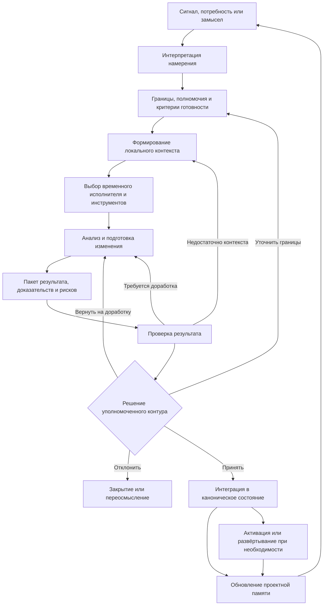
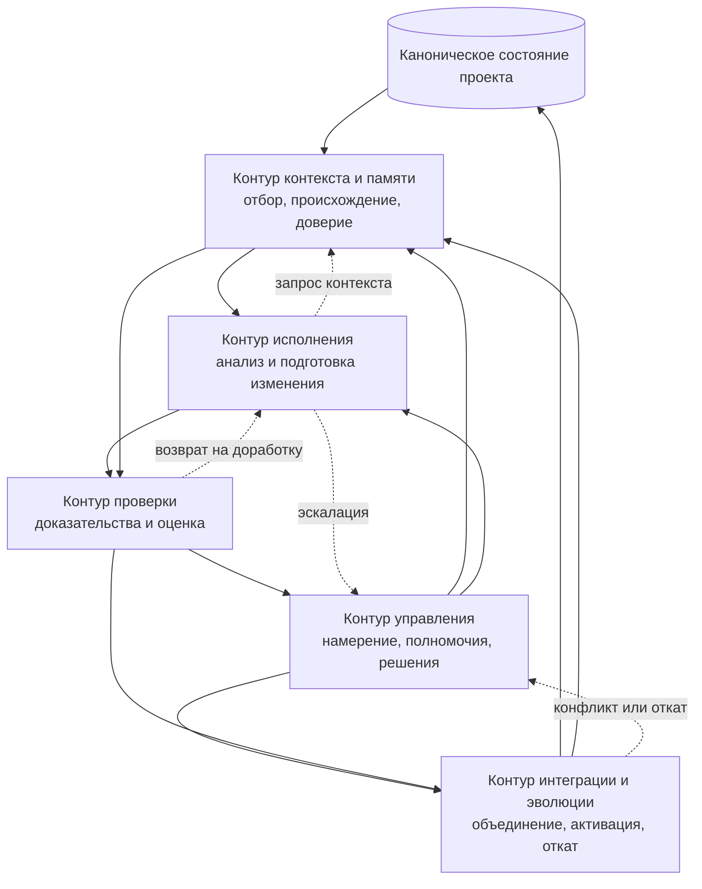
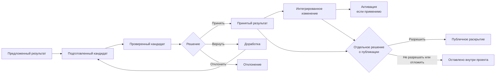

# 4. Операционная модель CHLOYA

> **Версия:** `0.3.1`
> **Статус:** на обсуждении

## 4.1. Назначение и уровень описания

Базовые принципы CHLOYA определяют, какими свойствами должна обладать разработка с участием человека и ИИ, однако сами по себе ещё не показывают, как эти свойства соединяются в единую работающую систему. Операционная модель заполняет этот промежуток. Она описывает общий порядок, в котором потребность, внешний сигнал или человеческий замысел преобразуются в ограниченное, проверенное и управляемо принятое изменение состояния проекта.

Операционная модель CHLOYA не является архитектурой конкретного программного продукта. Она не требует обязательного использования определённой агентной платформы, локального интерфейса командной строки, MCP-сервера, структуры каталогов или формата файлов. Эти средства могут упростить применение методологии, но не составляют её сущность. Один проект может использовать Markdown, Git и ручные проверки, другой — специализированные агенты, машиночитаемые политики и автоматизированную оркестрацию. Оба варианта могут соответствовать CHLOYA, если сохраняют её основные ограничения, точки контроля и требования к доказательствам.

На этом уровне необходимо различать три взаимосвязанных, но не тождественных слоя:

1. **Методология** определяет обязательные свойства процесса: человеческое управление, ограниченность полномочий, переносимость контекста, проверяемость результата, обратимость и разделение готовности, активации и публикации.
2. **Нормативные спецификации** описывают смысл и минимальный состав используемых сущностей: задачи, контекстного модуля, пакета изменения, доказательства, решения, риска или передачи работы.
3. **Референсные реализации** предлагают конкретные форматы, каталоги, команды, адаптеры и программные компоненты.

Такое разделение позволяет развивать инструменты без незаметного изменения самой методологии. Замена YAML на JSON, одного агента на другого или локального интерфейса на серверную систему не должна менять базовые правила управления работой. Одновременно методология не должна оставаться только декларацией: её требования должны быть выражаемы в наблюдаемых состояниях, артефактах и проверках.

В центре операционной модели находится не отдельный агент, чат или поставщик ИИ, а проект как продолжающаяся система. Проект сохраняет актуальное состояние, принятые решения, ограничения, контракты, доказательства и накопленные знания независимо от того, какой исполнитель участвует в очередной работе. ИИ-исполнитель подключается временно, получает необходимый и допустимый контекст, выполняет ограниченную часть задачи и возвращает результат в общий контур. После этого он может быть заменён другой моделью, человеком или иным инструментом без утраты проектной памяти и без необходимости считать внутреннюю память конкретного исполнителя источником истины.

Этот подход продолжает логику модульности: изменяемые решения должны быть локализованы за устойчивыми границами, а технические зависимости — согласованы с фактическими потоками координации [76]–[80]. В агентной разработке к этому добавляется ещё одна граница: между постоянным состоянием проекта и временным состоянием исполнителя. Контекст, доступный в одной сессии, не становится проектной памятью автоматически, а свободный пересказ предыдущего агента не заменяет зафиксированного решения с известным происхождением.

Операционная модель также не сводит человеческое управление к обязательному ручному подтверждению каждого шага. Человек может принимать решение непосредственно либо заранее задавать политики, в пределах которых разрешено автоматическое выполнение низкорисковых и обратимых операций. Исследования взаимодействия человека с автоматизацией показывают, что уровень автоматизации следует выбирать не для системы целиком, а отдельно для разных функций — получения информации, анализа, выбора решения и исполнения действия [99]. Поэтому один и тот же процесс CHLOYA может автоматически собирать диагностические данные, использовать ИИ для анализа, требовать человеческого решения и затем разрешать детерминированной системе выполнить утверждённое действие.

Близкая идея лежит в основе систем со смешанной инициативой: человек и автоматизированная система не должны быть жёстко закреплены в ролях постоянного руководителя и пассивного инструмента, но переход инициативы должен зависеть от цели, контекста, неопределённости и ожидаемых последствий [100]. CHLOYA дополняет эту модель требованиями к проектной памяти, происхождению контекста, полномочиям, доказательствам и управляемому изменению состояния.

Работа может начинаться не только с прямого поручения человека. Исходным сигналом способны стать обнаруженная ошибка, неудачный тест, сообщение мониторинга, новая уязвимость, изменение зависимости, пользовательское обращение, обновление внешнего требования или результат другой автоматизированной проверки. Однако сам факт появления сигнала ещё не означает разрешения на изменение проекта. Сигнал должен быть интерпретирован в рамках целей, ограничений и полномочий проекта. Только после этого он может стать задачей, предложением, риском или основанием для дальнейшего анализа.

Операционная модель, таким образом, описывает не последовательность команд для ИИ, а управляемый переход между состояниями проекта. Она связывает человеческое намерение, проектную память, локализованный контекст, временных исполнителей, детерминированные ограничения, проверяемые доказательства и контролируемую интеграцию результата.

## 4.2. Основной операционный цикл

В самом общем виде работа начинается с сигнала, потребности или замысла. Это ещё не готовая постановка задачи. Один и тот же сигнал может требовать исправления кода, изменения документации, дополнительного исследования, принятия риска, отказа от действия или простого наблюдения. Поэтому первой стадией является не исполнение, а интерпретация.

Человек либо уполномоченный контур управления определяет, какое изменение действительно требуется, зачем оно нужно и какой результат будет считаться приемлемым. На этой стадии отделяется наблюдаемая проблема от предполагаемого способа её решения. Сообщение о медленной работе системы, например, не должно автоматически превращаться в поручение переписать конкретный модуль: сначала необходимо подтвердить причину, область воздействия и допустимые компромиссы.

После определения намерения устанавливаются границы работы. Они могут включать разрешённую область проекта, запрещённые действия, доступные данные и инструменты, временные и финансовые ограничения, требования конфиденциальности, допустимый уровень риска, обязательные проверки и условия эскалации. Границы одновременно защищают проект от чрезмерного действия и самого исполнителя — от необходимости угадывать полномочия по косвенным признакам.

Затем для задачи формируется локальный контекст. Он должен быть достаточно полным для правильной работы, но не обязан содержать весь проект. Большое контекстное окно не гарантирует, что все переданные сведения будут одинаково хорошо замечены и применены; лишний, противоречивый или устаревший материал способен ухудшить результат [48], [51], [53]. Поэтому контекст в CHLOYA не просто накапливается, а отбирается по назначению, актуальности, происхождению и уровню доверия.

В контекст могут входить:

* намерение и критерии готовности;
* связанные части кода и документации;
* действующие архитектурные решения;
* контракты и ограничения;
* результаты предыдущих проверок;
* известные риски и открытые вопросы;
* сведения о разрешённых действиях;
* указание на недоверенные или непроверенные материалы.

Наличие информации в контексте не должно автоматически придавать ей нормативную силу. Внешний документ, issue, веб-страница, комментарий в коде или вывод инструмента могут содержать полезные данные, но не получают права изменять задачу, политики или полномочия исполнителя. Происхождение материала должно сохраняться при пересказе, индексации, переводе и передаче между агентами [83]–[85], [95].

После формирования контекста выбирается исполнитель и допустимое вычислительное усилие. Исполнителем может быть человек, одна модель, несколько специализированных агентов или комбинация вероятностных и детерминированных средств. Выбор зависит не только от общего качества модели, но и от характера задачи, риска раскрытия данных, стоимости, доступных инструментов и необходимости воспроизводимой проверки.

Исполнитель анализирует задачу, при необходимости предлагает план и создаёт изменение. Однако выходом этой стадии является не просто набор изменённых файлов. Вместе с результатом должен формироваться пакет, достаточный для его последующей оценки. Он может включать объяснение принятого решения, перечень затронутых областей, выполненные проверки, полученные доказательства, известные ограничения, остаточные риски и вопросы, которые исполнитель не смог разрешить самостоятельно.

Чем выше риск и шире последствия, тем меньше допустимость результата вида «код готов, всё работает». Утверждение исполнителя является лишь заявлением, пока оно не связано с проверяемыми свидетельствами. Доказательства могут быть автоматическими и ручными: тестами, статическим анализом, сравнением поведения, воспроизводимым сценарием, журналом выполнения, проверкой контракта, анализом безопасности или осмысленным человеческим обзором. Требование воспроизводимости не означает, что каждая задача нуждается в научном эксперименте, но значимые выводы должны быть прослеживаемы до данных, условий и действий, на которых они основаны [93]–[95].

Следующая стадия — проверка. Она может выполняться детерминированными инструментами, человеком, независимым агентом либо их сочетанием. Проверка должна оценивать не только внутреннее качество результата, но и соответствие исходному намерению, границам полномочий и критериям готовности. Успешное прохождение тестов не доказывает, что решена правильная задача; одобрение человеком не заменяет технических проверок; а согласованность текста объяснения не гарантирует соответствия фактическому изменению.

После проверки принимается решение о дальнейшей судьбе результата. Возможны принятие, возврат на доработку, ограниченное принятие, отклонение, отложенная активация или необходимость дополнительной эскалации. Принятое решение должно быть связано с лицом или контуром, который имел право его принять.

Если результат принят, он интегрируется в каноническое состояние проекта. Для программного кода это может означать объединение с основной ветвью или иной установленной точкой истины. Для архитектурного решения — фиксацию принятого варианта и последствий. Для исследовательской задачи — сохранение результатов, условий и уровня уверенности. При этом интеграция не всегда означает немедленную активацию: изменение может быть принято, но ожидать развёртывания, миграции, релиза, согласования или разрешения на публикацию.

Завершением цикла является обновление проектной памяти. В неё должны попасть не все промежуточные рассуждения, а те сведения, которые изменяют дальнейшее понимание проекта: принятое решение, новый контракт, обнаруженный риск, ограничение, подтверждённый факт, способ проверки или причина отклонения альтернативы. Следующая задача должна начинаться уже из обновлённого состояния, а не из прежней версии знаний.

Основной цикл можно представить следующим образом:

Рисунок 4.1 — Основной операционный цикл CHLOYA.

Схема показывает типовой маршрут, но не устанавливает обязательную бюрократическую последовательность. В небольшой обратимой задаче постановка, формирование контекста и выбор исполнителя могут занять несколько минут и существовать в рамках одного краткого задания. В критичном изменении те же функции могут быть разделены между несколькими людьми, системами и независимыми проверками. Сохраняться должен не одинаковый объём оформления, а смысл каждой стадии.

## 4.3. Взаимодействующие контуры

Линейное описание удобно для рассмотрения одной задачи, однако проект не прекращает существовать между отдельными заданиями. Одновременно продолжают действовать правила доступа, проектная память, тестовая инфраструктура, процессы интеграции и механизмы наблюдения. Поэтому CHLOYA описывает работу не только как цикл, но и как взаимодействие пяти функциональных контуров:

1. управления;
2. контекста и проектной памяти;
3. исполнения;
4. проверки;
5. интеграции и эволюции.

Эти контуры не обязательно соответствуют отдельным программам, командам или должностям. В небольшом проекте все функции может выполнять один разработчик с одним ИИ-помощником и набором обычных инструментов. В крупной организации им могут соответствовать разные роли, сервисы, репозитории, политики и уровни допуска. Разделение является прежде всего смысловым: оно не позволяет незаметно объединить предложение действия, разрешение на него, исполнение и подтверждение результата в один непрозрачный шаг.

### Контур управления

Контур управления связывает работу с целями проекта. Он определяет намерение, приоритет, область допустимого изменения, полномочия исполнителя, уровень необходимого контроля и лицо, ответственное за решение.

Часть решений может быть заранее выражена в политиках. Например, агенту может быть разрешено исправлять форматирование документации и запускать локальные тесты без отдельного подтверждения, но запрещено изменять публичный API, публиковать код, передавать данные внешнему сервису или выполнять необратимую миграцию. В этом случае человеческое управление реализуется не через постоянное присутствие человека в каждом переходе, а через заранее установленную и наблюдаемую границу автономности.

Контур управления также принимает эскалации. Исполнитель не должен самостоятельно расширять задачу только потому, что обнаружил смежную проблему. Он может зафиксировать её, предложить вариант и запросить решение, но техническая способность выполнить дополнительное изменение не создаёт соответствующего полномочия.

### Контур контекста и проектной памяти

Контур контекста и памяти предоставляет исполнителю достаточную основу для работы и принимает обратно знания, которые должны сохраниться после её завершения.

Его функция не сводится к поиску похожих фрагментов текста. Он должен различать актуальные и устаревшие сведения, нормативные решения и вспомогательные материалы, доверенные правила и недоверенные данные, каноническое состояние и локальные предположения. Для критичных объектов важны происхождение, авторство, время, версия и связь с исходным артефактом [22], [23], [95].

Проектная память шире документации. Документация объясняет систему пользователям и разработчикам, тогда как память также включает причины решений, отклонённые альтернативы, действующие ограничения, известные риски, проверочные сценарии и сведения, необходимые для восстановления контекста новым исполнителем.

При этом память не должна превращаться в бесконтрольное хранилище всех переписок. Сохранение каждого промежуточного рассуждения увеличивает объём, создаёт противоречия и затрудняет поиск канонической позиции. В проектную память включаются отобранные и получившие статус сведения, а исходные журналы при необходимости могут храниться отдельно как аудитный материал.

### Контур исполнения

Контур исполнения преобразует поставленную задачу и доступный контекст в предлагаемый результат. Здесь могут использоваться рассуждение модели, генерация кода, поиск по репозиторию, запуск инструментов, преобразование данных и локальное планирование.

Исполнитель остаётся временным и заменяемым. Он не должен получать скрытое владение проектом через уникальную внутреннюю память, недокументированные правила или неявные зависимости от одной платформы. Передача работы другому исполнителю должна происходить через состояние проекта и явные артефакты, а не через надежду на продолжение прежнего чата.

Временность не означает отсутствия инициативы. Исполнитель может выявлять противоречия, предлагать альтернативы, указывать на риски и запрашивать дополнительный контекст. Однако инициатива остаётся отделённой от полномочия: предложение изменить архитектуру, отправить данные наружу или опубликовать репозиторий не является разрешением выполнить такое действие.

### Контур проверки

Контур проверки устанавливает, насколько результат соответствует намерению, ограничениям и заявленным свойствам. Его задача — не создать видимость контроля, а уменьшить неопределённость до уровня, приемлемого для принятия решения.

Проверки могут включать:

* выполнение тестов;
* статический и динамический анализ;
* проверку контрактов и схем;
* анализ диффа;
* воспроизведение ошибки;
* проверку безопасности;
* сравнение с базовой версией;
* ручной обзор;
* независимое повторение части анализа;
* контроль происхождения использованных данных и кода.

Разные виды доказательств подтверждают разные утверждения. Прохождение модульных тестов может показать сохранение конкретного поведения, но не подтвердить лицензионную допустимость зависимости. Статический анализ может обнаружить определённый класс дефектов, но не доказать соответствие пользовательскому намерению. Человеческий обзор способен оценить смысл и последствия, но не должен подменять воспроизводимые проверки там, где они доступны.

Контур проверки должен сохранять различие между отсутствием обнаруженной проблемы и доказанным отсутствием проблемы. Для вероятностных, исследовательских и новых задач результатом проверки может быть не бинарное заключение, а уровень уверенности, область подтверждённости и явно обозначенные пробелы.

### Контур интеграции и эволюции

Контур интеграции переводит отдельное принятое изменение в новое согласованное состояние проекта. Он разрешает конфликты, проверяет совместимость с параллельными изменениями, управляет активацией и откатом и обеспечивает обновление проектной памяти.

Локально корректное изменение может оказаться несовместимым с другими частями системы или с работой, выполненной параллельно. Поэтому интеграция является самостоятельной функцией, а не технической формальностью после успешного завершения задачи. Связь архитектурных и организационных зависимостей особенно важна при параллельной агентной работе: разделение задач должно сопровождаться явными контрактами и ответственностью за объединение [77]–[80].

Контур эволюции также обеспечивает преемственность. После интеграции прежние предположения, схемы и инструкции должны быть пересмотрены, если новое состояние сделало их недействительными. Иначе проектная память начинает описывать несколько несовместимых версий системы одновременно.

Взаимодействие контуров можно представить так:

Рисунок 4.2 — Взаимодействие контуров операционной модели CHLOYA.

Контуры образуют не конвейер, а систему обратных связей. Управление без проверки рискует принимать решения на основе недостоверных заявлений. Проверка без контекста не знает, какие свойства существенны. Исполнение без границ может выйти за пределы задачи. Интеграция без обновления памяти оставляет следующим исполнителям устаревшую картину проекта.

## 4.4. Состояния результата и точки принятия решений

Одним из основных источников риска в ИИ-разработке является преждевременное признание работы завершённой. Агент сообщает, что задача выполнена; файл создан; код компилируется; тесты прошли. Каждое из этих утверждений может быть верным, но ни одно само по себе не означает, что результат принят проектом.

Операционная модель разделяет несколько состояний результата.

**Предложенный результат** существует как вариант решения, план, патч, документ или иной артефакт. Он может быть неполным и ещё не сопровождаться достаточными доказательствами.

**Подготовленный кандидат** приведён в состояние, в котором исполнитель считает работу завершённой в пределах полученной задачи. К нему приложены объяснение, результаты выполненных проверок, ограничения и известные риски.

**Проверенный кандидат** прошёл предусмотренные проверки. Это не означает абсолютной правильности, но означает, что выполнен заранее определённый набор действий, а их результаты доступны для принятия решения.

**Принятый результат** получил решение уполномоченного человека или допустимого политикой контура. Принятие означает согласие включить изменение в проект на определённых условиях, но не обязательно немедленную активацию.

**Интегрированное изменение** стало частью канонического состояния проекта. Оно больше не является только локальным результатом одного исполнителя.

**Активированное изменение** начало влиять на работающую систему, пользователей, данные или внешний мир. Для документации, исследований или внутренних проектных решений отдельной активации может не существовать; для конфигурации, миграции, релиза или инфраструктуры она имеет самостоятельное значение.

Публикация образует отдельную ось. Результат может быть принят и интегрирован во внутренний проект, но не разрешён к публичному раскрытию. И наоборот, публикационный материал может описывать концепцию без активации программного изменения. Поэтому разрешение на публикацию нельзя считать автоматическим следствием авторства, технической готовности или интеграции.

Рисунок 4.3 — Состояния результата и отдельная ось решения о публикации.

Между этими состояниями располагаются точки принятия решений.

Первая точка определяет, должен ли исходный сигнал вообще стать работой проекта. Не каждое предупреждение требует немедленной реакции, а не каждая идея соответствует текущим целям.

Вторая точка определяет допустимость делегирования: какую часть анализа, решения и действия можно передать ИИ или автоматизированной системе. Уровень делегирования зависит от контекста, а не только от возможностей модели [18], [20], [99].

Третья точка оценивает готовность кандидата. Здесь сравниваются исходное намерение, фактическое изменение и доказательства.

Четвёртая точка разрешает интеграцию и, при необходимости, активацию. В высокорисковых системах эти решения могут принадлежать разным ролям.

Пятая точка касается раскрытия результата за пределами установленной доверительной границы. Она может включать публикацию репозитория, статьи, issue, демонстрации, модели, данных или технических деталей.

Не каждая небольшая задача нуждается в пяти отдельных согласованиях. Несколько решений могут быть объединены, если риск невысок, последствия обратимы, а полномочия заранее установлены. Однако объединение стадий не должно уничтожать смысловое различие между ними. Человек, разрешивший агенту локально исправить опечатку, тем самым не обязательно разрешил отправить закрытый документ внешней модели или опубликовать весь репозиторий.

Исследования человеческого взаимодействия с ИИ отдельно подчёркивают необходимость сообщать пользователю о возможностях и ограничениях системы, поддерживать исправление ошибок, объяснять причины действий и предоставлять управляемые глобальные настройки [98]. Для CHLOYA это означает, что точки решения должны давать человеку не формальную кнопку подтверждения, а достаточное представление о том, что изменено, почему, с какими доказательствами и последствиями. 

## 4.5. Обратные переходы, остановка и эскалация

Операционная модель CHLOYA не предполагает, что начатая задача обязательно должна завершиться изменением проекта. Безопасный отказ, остановка или переосмысление могут быть более правильным результатом, чем продолжение работы на недостаточных основаниях.

Возврат на предыдущую стадию необходим, когда обнаруживается недостаток контекста, противоречие требований, изменение исходных условий, превышение полномочий, неудачная проверка или неприемлемый риск. Такой возврат не следует считать исключительной ошибкой процесса. Он является нормальным механизмом управления неопределённостью.

Если исполнитель не способен однозначно понять намерение, он должен запросить уточнение или представить ограниченный набор вариантов, а не скрывать пробел уверенным предположением. Если контекст не содержит необходимого контракта, работа возвращается к его поиску или формированию. Если проверка выявила дефект, кандидат возвращается на доработку. Если изменение затрагивает область, не предусмотренную заданием, требуется пересмотр границ или отдельная задача.

Эскалация требуется как минимум в четырёх случаях.

**Семантическая эскалация** возникает, когда невозможно определить, какой результат соответствует намерению. Это вопрос целей, приоритетов или допустимого компромисса.

**Рисковая эскалация** нужна, когда вероятный ущерб, чувствительность данных, необратимость или масштаб последствий превышают установленный порог.

**Полномочная эскалация** возникает, когда необходимое действие технически возможно, но не было разрешено исполнителю или текущему ответственному.

**Интеграционная эскалация** требуется при конфликте изменений, контрактов, архитектурных решений или интересов нескольких участников.

Эскалация не должна превращаться в автоматический перенос всей ответственности наверх. Исполнитель обязан передать достаточную информацию: что обнаружено, какие варианты рассмотрены, какие проверки выполнены, где проходит граница уверенности и какое решение требуется. Человеку не следует предлагать подтверждение непрозрачного действия только потому, что система исчерпала собственные возможности.

Безопасная остановка должна сохранять полезное состояние. Уже выполненный анализ, результаты проверок, обнаруженные риски и причина прекращения работы не должны теряться. При последующем возобновлении задачи новый исполнитель должен понимать, на каком основании работа была остановлена и что изменилось с того момента.

Для автоматизированного исполнения также необходимы операционные пределы: ограничения числа повторов, времени, стоимости, объёма изменяемых данных и числа внешних действий. Агент, не получивший ожидаемого результата, не должен бесконечно повторять попытку, расширять область поиска или повышать полномочия. Исчерпание установленного бюджета является основанием для остановки или эскалации, а не для скрытого изменения стратегии.

Особое значение обратные переходы имеют при работе с недоверенным содержимым. Если документ, веб-страница, issue или код пытаются изменить инструкции, запросить секреты или инициировать внешнее действие, исполнитель не должен «разрешать противоречие» в пользу встретившегося текста. Управляющие инструкции и политики должны оставаться в отдельном контуре, а подозрительный материал — сохранять статус данных [83]–[89].

Обратимость распространяется и на уже интегрированные изменения. Возможность отката должна рассматриваться до активации, особенно если действие меняет данные, права доступа, публичные интерфейсы или внешние системы. Для необратимых действий требуется более высокий уровень доказательств и отдельное принятие остаточного риска.

Таким образом, способность остановиться, вернуться и запросить решение является не признаком слабой автономности, а условием безопасной автономности.

## 4.6. Режимы применения и масштабирование

Одна и та же операционная модель может применяться вручную, с частичной автоматизацией или в составе развитой агентной инфраструктуры. Эти режимы не образуют обязательную лестницу зрелости. Проект может осознанно сохранять ручной процесс для редких высокорисковых изменений и одновременно полностью автоматизировать повторяющиеся низкорисковые проверки.

### Ручной режим

В ручном режиме человек формулирует задачу, отбирает контекст, взаимодействует с ИИ-помощником, просматривает изменения и самостоятельно выполняет интеграцию. Проектная память может существовать в Markdown-документах, решениях, issue, тестах и истории Git.

Такой режим достаточен для небольших проектов, если информация не остаётся только в переписке, значимые решения фиксируются, а результат проверяется до включения в каноническое состояние. CHLOYA не требует внедрять отдельную платформу там, где обычных средств достаточно.

### Полуавтоматический режим

В полуавтоматическом режиме повторяющиеся части процесса поддерживаются шаблонами, CI, структурированными файлами, автоматическим подбором контекста, политиками доступа и проверками готовности. Человек сохраняет контроль над постановкой задачи и значимыми решениями, но не выполняет вручную все технические операции.

Например, система может автоматически собирать связанные файлы, запускать тесты, проверять схему пакета результата и выявлять выход за разрешённую область. При этом решение об изменении публичного API или публикации кода остаётся за человеком.

### Оркестрируемый режим

В оркестрируемом режиме работа распределяется между несколькими специализированными исполнителями. Один агент анализирует проблему, другой реализует изменение, третий выполняет независимую проверку, а детерминированный контур контролирует доступ и переходы состояния.

Такой режим увеличивает производительность только при наличии устойчивых контрактов, наблюдаемой передачи работы и назначенной ответственности за интеграцию. Само добавление агентов не устраняет неоднозначность и может увеличить число ошибок координации [21]. Параллельность должна использоваться там, где работу действительно можно разделить, а стоимость объединения не превышает получаемый выигрыш.

Различия между режимами можно представить следующим образом:

| Функция           | Ручной режим                                               | Полуавтоматический режим                            | Оркестрируемый режим                                                 |
| ----------------- | ---------------------------------------------------------- | --------------------------------------------------- | -------------------------------------------------------------------- |
| Управление        | Человек непосредственно задаёт границы и принимает решения | Часть низкорисковых решений выражена политиками     | Политики распределяют работу, значимые решения эскалируются          |
| Контекст и память | Документы, Git, ручной отбор                               | Шаблоны, поиск, машиночитаемые метки                | Автоматизированная сборка и передача контекстных модулей             |
| Исполнение        | Человек и один ИИ-помощник                                 | Агент выполняет ограниченные задачи с инструментами | Несколько временных специализированных исполнителей                  |
| Проверка          | Ручной обзор и обычные тесты                               | CI, схемы, автоматические проверки и обзор          | Независимые проверяющие агенты и детерминированные шлюзы             |
| Интеграция        | Человек объединяет результат                               | Часть переходов автоматизирована                    | Оркестратор готовит интеграцию, ответственность остаётся назначенной |

Уровень формализации должен определяться не только размером команды. Один разработчик может работать с критичными персональными данными и нуждаться в строгих ограничениях, тогда как большая команда способна выполнять обратимую внутреннюю задачу с более лёгким процессом.

При выборе режима учитываются:

* возможный ущерб;
* обратимость;
* чувствительность данных;
* ширина области последствий;
* архитектурная связанность;
* новизна задачи;
* число параллельных исполнителей;
* стоимость независимой проверки;
* нормативные и договорные требования.

NIST AI RMF рассматривает управление риском как непрерывную деятельность, а функции управления, отображения контекста, измерения и обработки риска — не как обязательную линейную контрольную таблицу, а как взаимосвязанные части жизненного цикла [25], [39]. Аналогично CHLOYA не требует одинаковой тяжести процесса для всех задач: глубина контроля выбирается пропорционально контексту, риску и ресурсам.

При этом уровень автоматизации не должен задаваться одним общим переключателем. Проект может использовать высокую автоматизацию для сбора информации и запуска проверок, среднюю — для анализа и подготовки изменения и низкую — для решений с юридическими, финансовыми или репутационными последствиями. Модель уровней автоматизации отдельно для получения информации, анализа, решения и действия поддерживает именно такое дифференцированное распределение [99].

Смешанная инициатива также означает, что система может сама обнаруживать проблему и предлагать работу, но человек сохраняет возможность изменить направление, отклонить предложение или ограничить действие. Одновременно человек не обязан вручную инициировать каждый низкоуровневый шаг. Правильное распределение инициативы зависит от ожидаемой пользы, стоимости ошибки и доступной информации [100].

Во всех режимах должны сохраняться одни и те же инварианты. Автоматизация может менять способ выполнения функций, но не должна устранять происхождение контекста, границы полномочий, доказательства результата, ответственность за решение и возможность остановки.

## 4.7. Инварианты и связь с последующими главами

Операционная модель допускает разные инструменты, форматы и уровни формализации, но определённые свойства должны сохраняться независимо от конкретной реализации.

### 1. Проект является постоянным носителем состояния

Канонические знания, решения и ограничения не должны существовать только во внутренней памяти модели, отдельном чате или локальном понимании одного участника. Исполнитель может быть временным, проектное состояние — нет.

### 2. Намерение отделяется от предполагаемого решения

Работа начинается с понимания того, что и зачем требуется изменить. Предложенный способ реализации может пересматриваться, если не соответствует цели, ограничениям или фактической причине проблемы.

### 3. Полномочия определяются явно или выводятся из установленной политики

Техническая возможность прочитать данные, изменить файл, вызвать инструмент или опубликовать результат не означает разрешения сделать это.

### 4. Контекст должен быть локально достаточным и иметь известное происхождение

Исполнитель получает необходимые для задачи сведения вместе с их статусом, актуальностью и уровнем доверия. Недоверенные данные не становятся инструкциями только потому, что попали в контекст.

### 5. Исполнитель должен оставаться заменяемым

Смена модели, платформы, человека или сеанса не должна разрушать проект или требовать восстановления всех значимых решений по памяти.

### 6. Предложение, решение и действие разделяются

Исполнитель может анализировать и предлагать действия, не имея права самостоятельно их разрешать или выполнять. В простых задачах функции могут совмещаться одним человеком, но их смысловое различие сохраняется.

### 7. Результат передаётся вместе с достаточными доказательствами

Заявление о завершении не заменяет проверки. Объём доказательств пропорционален риску, а ограничения и остаточная неопределённость обозначаются явно.

### 8. Готовность не равна интеграции, активации или публикации

Проверенный результат может ожидать решения; принятое изменение — активации; внутренний материал — отдельного разрешения на публичное раскрытие.

### 9. Возврат, остановка и эскалация являются штатными переходами

При недостатке информации, превышении полномочий или неприемлемом риске исполнитель должен уменьшить область действия, запросить решение либо безопасно остановиться.

### 10. Принятое изменение обновляет проектную память

После завершения работы должны быть отражены решения и знания, которые влияют на следующие задачи. Иначе проект продолжает выдавать новым исполнителям устаревшую картину состояния.

Эти инварианты образуют общую рамку для последующих глав. Детерминированное ядро и политики уточняют, какие решения нельзя оставлять вероятностной модели. Главы о ролях и управлении определяют ответственность и уровни полномочий. Разделы о контексте, контекстных модулях и проектной памяти раскрывают правила отбора, происхождения и сохранения знаний. Жизненный цикл задачи детализирует переходы внутри отдельной работы. Контракты, параллельность и Git описывают согласование изменений. Главы о конфиденциальности, зависимостях, безопасности и интеллектуальной собственности устанавливают специальные ограничения. Раздел о проверяемой готовности раскрывает требования к доказательствам, а главы о применении и пилотной проверке переводят модель в практические профили.

Таким образом, операционная модель не заменяет подробные правила CHLOYA и не предписывает единственную техническую архитектуру. Её задача — показать, как отдельные принципы образуют целостную систему:

> сигнал или человеческий замысел интерпретируется в рамках целей проекта; работа получает явные границы и достаточный контекст; временный исполнитель готовит изменение и доказательства; результат проходит проверку и уполномоченное решение; принятое изменение включается в каноническое состояние, а полученное знание возвращается проекту.

Именно сохранение этого цикла и его инвариантов позволяет увеличивать автономность ИИ без передачи ему неограниченного владения проектом.
