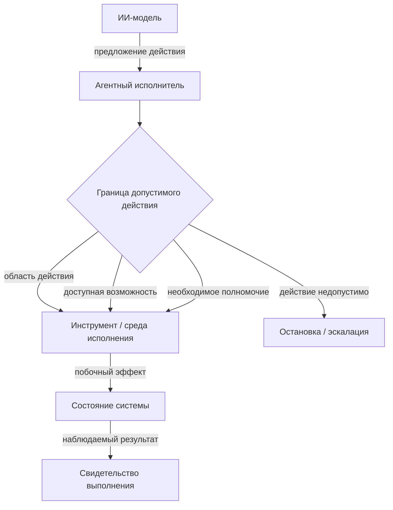
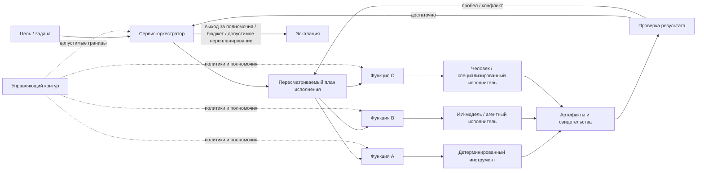
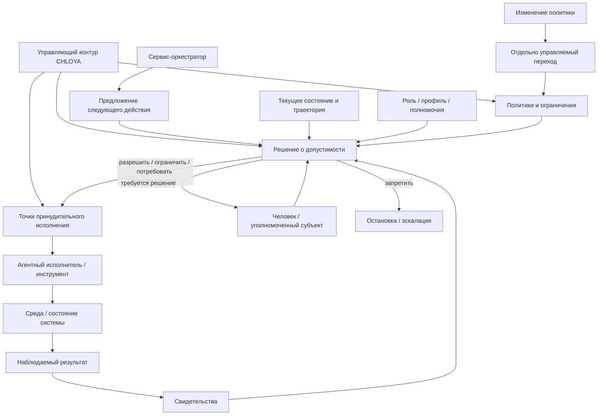
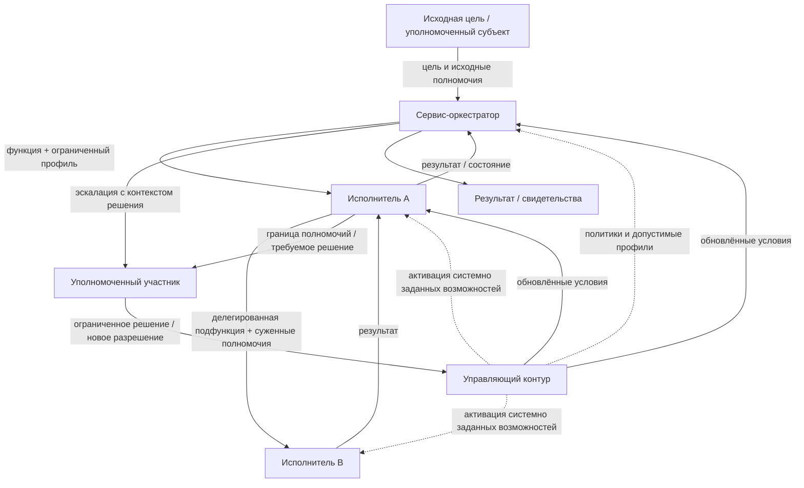
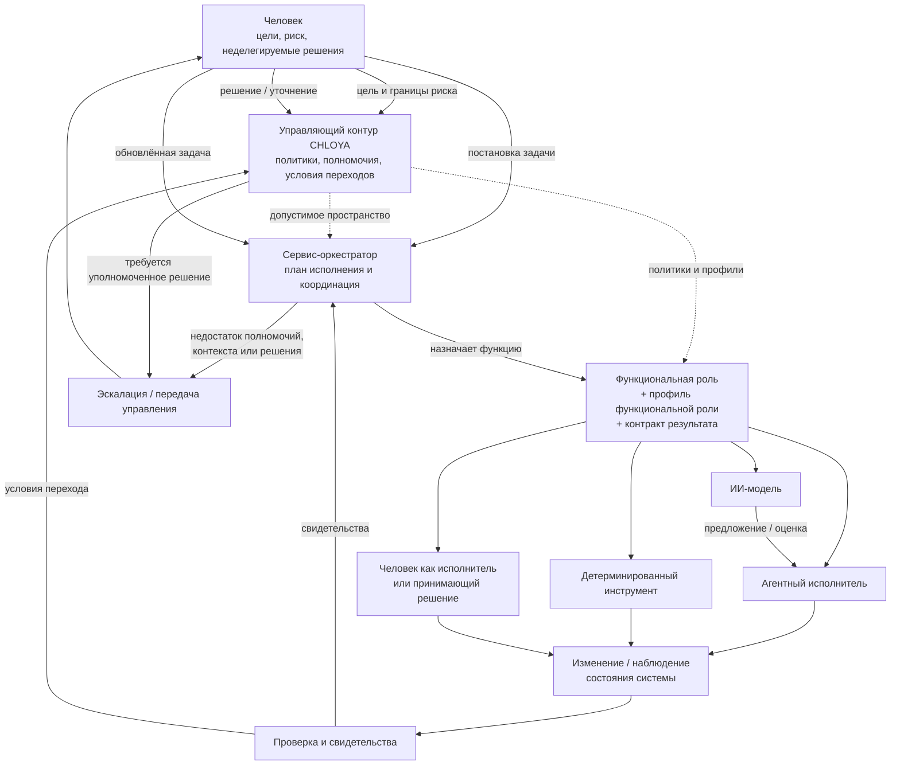

# Роли и контуры управления

> **Версия:** `0.3.1`  
> **Статус:** на обсуждении

## Содержание

- [7.1. Модель ролей и разделение полномочий](#71-модель-ролей-и-разделение-полномочий)
- [7.2. Человек](#72-человек)
- [7.3. ИИ-модель](#73-ии-модель)
- [7.4. Агентный исполнитель](#74-агентный-исполнитель)
- [7.5. Функциональные роли и профили возможностей](#75-функциональные-роли-и-профили-возможностей)
- [7.6. Сервис-оркестратор](#76-сервис-оркестратор)
- [7.7. Управляющий контур CHLOYA](#77-управляющий-контур-chloya)
- [7.8. Делегирование, передача управления и эскалация](#78-делегирование-передача-управления-и-эскалация)
- [7.9. Совмещение и разделение ролей](#79-совмещение-и-разделение-ролей)

## 7.1. Модель ролей и разделение полномочий

Агентная разработка требует различать не только участников процесса, но и функции управления, которые они выполняют. В традиционной инструментальной модели граница между рекомендацией и воздействием на систему обычно очевидна: программа предоставляет функцию, а решение о её использовании принимает человек. [Агентный исполнитель][g-agent-executor] способен самостоятельно читать проект, интерпретировать задачу, выбирать инструменты, изменять файлы, запускать команды и передавать часть работы другим исполнителям. Поэтому внутри одной технической системы могут оказаться объединены функции анализа, принятия решения, разрешения действия и его непосредственного выполнения.

CHLOYA рассматривает такое объединение как отдельный источник риска. Способность получить информацию или сформировать решение не должна автоматически означать право это решение принять, а техническая возможность выполнить действие — разрешение его выполнить. Такой подход продолжает классические принципы минимальных привилегий и [разделения полномочий][g-separation-of-privilege], сформулированные Saltzer и Schroeder: субъекту следует предоставлять только необходимые для конкретной операции права, а критически значимое действие не должно зависеть от одного неконтролируемого условия [202].

Для описания управления CHLOYA различает роль, [функциональную возможность][g-capability] и [полномочие][g-authority]. **Роль** определяет функцию, которую участник выполняет в конкретном процессе. **[Функциональная возможность][g-capability]** характеризует то, что участник технически способен сделать при помощи доступной ему модели, инструментов и среды. **[Полномочие][g-authority]** задаёт границу решений и действий, которые ему разрешено принимать или выполнять в данной ситуации.

Эти характеристики не следует считать взаимозаменяемыми. Агент может технически иметь доступ на запись ко всему репозиторию, но получить полномочие изменять только один модуль. Оркестратор может обладать возможностью вызвать средство развёртывания, но не иметь права разрешать изменение производственной среды. Человек, напротив, может обладать полномочием принять архитектурное решение или остаточный риск, не выполняя соответствующее техническое действие самостоятельно.

В современных агентных системах эта граница особенно важна, поскольку модель обычно включается в исполнительную среду, предоставляющую ей память, инструменты, внешние источники данных и возможность изменять состояние системы. Практические рекомендации по построению агентных систем поэтому также связывают безопасность не с общей «разумностью» агента, а с ограничением доступных ему инструментов, области действия и прав [194]. Для CHLOYA это означает, что технические возможности являются лишь одним из механизмов реализации полномочий, но не определяют их самостоятельно.

Право записи в каталог, например, ещё не отвечает на вопрос, допустимо ли изменить публичный интерфейс модуля. Доступ к системе управления базой данных не означает права изменить её схему. Возможность создать или подключить новый инструмент не предоставляет агенту права самостоятельно расширить собственную область действия. Поэтому технические разрешения операционной системы, API или среды исполнения являются необходимым, но недостаточным уровнем управления.

Путь от человеческого замысла до изменения актуального состояния проекта также состоит из нескольких логически различных функций. Сначала формируется намерение и исследуется ситуация, затем появляется предложение решения, принимается решение о выбранном варианте, [разрешается соответствующее действие][g-action-authorization], выполняется изменение, проверяется его результат и только после этого результат может быть принят как часть актуального состояния системы.

Такое разделение не означает, что для каждого шага необходим отдельный человек, агент или программный сервис. В небольшой обратимой задаче несколько функций могут выполняться одним участником. Однако их логическое различие должно сохраняться. Иначе становится невозможно установить, является ли сформированный моделью вариант лишь предложением, уже принятым решением или фактическим разрешением на изменение системы.

Особое значение это имеет при делегировании. Исследования интеллектуального делегирования подчёркивают, что передача работы включает не только описание задачи, но и границы роли, полномочий и ответственности [20]. CHLOYA развивает эту идею применительно к цепочкам агентного исполнения: передача задачи другому участнику не должна автоматически передавать ему весь объём полномочий передающей стороны.

Если оркестратор поручил агенту исследовать возможную миграцию базы данных, из этого не следует право выполнить эту миграцию. Если исполнитель привлекает субагента для анализа части задачи, субагент не должен автоматически наследовать все возможности и полномочия исходного исполнителя. Аналогично передача документа, сообщения или другого фрагмента контекста предоставляет информацию для обработки, но сама по себе не изменяет границы допустимого действия.

> **Полномочия не должны автоматически распространяться вместе с задачей, контекстом или цепочкой вызовов.**

Это требование особенно существенно для вероятностных исполнителей. Контекст способен содержать ошибки, устаревшие решения, недоверенные инструкции или результаты работы других агентов. Если появление некоторой инструкции в контексте может само по себе расширить набор разрешённых действий, граница между данными и управлением фактически исчезает. Поэтому изменение полномочий должно происходить через отдельный управляемый механизм, а не следовать из интерпретации текста самой моделью.

Из этого же следует необходимость различать пространство допустимого рассуждения и пространство допустимого исполнения. Исполнитель может обнаружить вариант, выходящий за первоначально предполагаемый способ решения, исследовать его и показать преимущества. Такая свобода полезна, поскольку чрезмерно ранняя фиксация способа реализации способна ухудшать качество решения. Однако возможность рассмотреть альтернативу не создаёт права немедленно её реализовать.

Если найденный вариант требует изменить действующий контракт, архитектурное решение, область задачи или уровень допустимого риска, исполнитель должен вынести это изменение на уровень, обладающий соответствующими полномочиями. Тем самым CHLOYA сохраняет пространство инженерного поиска, не превращая свободу рассуждения в неограниченную свободу действия.

Разделение функций должно быть пропорционально риску. Для локального, обратимого и хорошо проверяемого изменения предложение, разрешение, исполнение и проверка могут быть объединены в относительно лёгкий процесс. По мере роста необратимости, неопределённости, чувствительности данных и возможных последствий увеличиваются основания отделять формирование решения от его разрешения, а выполнение — от независимой проверки. Такой риск-зависимый подход согласуется с моделью градуированного человеческого контроля, в которой интенсивность надзора определяется характеристиками конкретного действия, а не одинаково применяется ко всем операциям [19].

При этом CHLOYA не стремится превратить агентную разработку в систему из множества формальных ролей и подтверждений. Разделение полномочий необходимо не ради количества участников, а ради предотвращения неявного накопления возможностей принятия решений и изменения системы внутри одного вероятностного компонента. Практическая агентная архитектура может физически объединять несколько функций, пока сохраняются проверяемые границы между тем, что компонент способен сделать, что ему разрешено сделать и какие действия требуют решения другого субъекта [194].

Делегирование исполнения также не устраняет человеческую и организационную ответственность. ИИ-модель может предложить решение, агент — реализовать его, оркестратор — распределить работу, а управляющий контур — применить установленные политики. Однако сама цепочка автоматизации не создаёт нового субъекта, которому можно безусловно передать ответственность за цели проекта и допустимость принятого риска [18; 20].

Таким образом, модель ролей CHLOYA строится не вокруг представления о наборе «виртуальных сотрудников», а вокруг разделения функций управления. Возможность не равна полномочию, предложение не равно решению, решение не равно разрешению действия, выполнение не равно доказательству корректности, а успешно завершённая операция ещё не означает принятия результата в актуальное состояние проекта.

> **В CHLOYA право действовать определяется не тем, что исполнитель технически способен сделать, а тем, что ему разрешено в рамках конкретной роли, области, решения и уровня риска.**

Последующие разделы конкретизируют эту модель для человека, ИИ-модели, агентного исполнителя, функциональных профилей, сервис-оркестратора и управляющего контура, а затем рассматривают передачу полномочий и допустимое совмещение ролей.

## 7.2. Человек

В CHLOYA человек рассматривается не как формальный участник цепочки подтверждений и не как обязательный ручной исполнитель каждого значимого шага. Его роль определяется тем, что именно человеческий субъект задаёт цели и границы проекта, принимает существенный [остаточный риск][g-residual-risk], обладает неделегируемыми полномочиями и вмешивается в работу автоматизированного контура там, где решение не должно приниматься только на основании вероятностного вывода модели. Такой подход согласуется с исследованиями человеческого надзора над агентными системами, в которых эффективность контроля связывается не с самим присутствием человека, а с его реальной способностью понимать ситуацию, вмешиваться в процесс и нести ответственность за принятое решение [18; 19].

Поэтому наличие человека в контуре само по себе не является достаточным признаком управляемости. Формальное подтверждение результата может практически не отличаться от автоматического, если человеку не хватает контекста, времени или компетенции для содержательной оценки. Dhanorkar, Passi и Vorvoreanu показывают, что человеческий надзор над агентными системами на практике ограничивается не только качеством интерфейсов, но и распределением ответственности, объёмом информации и способностью оператора действительно контролировать происходящее [18]. В CHLOYA это означает, что процедура подтверждения имеет смысл только тогда, когда человек способен понять предмет решения, его существенные последствия и остаточный риск.

[Содержательный человеческий контроль][g-meaningful-human-control] не требует повторного выполнения работы агента. Его задача состоит в возможности принять обоснованное решение на соответствующем уровне абстракции. Для локального и обратимого изменения достаточными могут быть краткое объяснение, итоговый diff и результаты автоматических проверок. Для изменения архитектурного контракта, производственной инфраструктуры, критических данных или прав доступа может потребоваться существенно более глубокое рассмотрение. Такой риск-зависимый подход соответствует модели градуированного контроля, предложенной в GAIE, где интенсивность человеческого участия связывается с последствиями действия, его обратимостью, чувствительностью данных и близостью к критическим бизнес-процессам [19].

Особая роль человека связана также с тем, что не все решения целесообразно делегировать автоматизированному контуру. К [неделегируемым решениям][g-non-delegable-decision] относятся прежде всего решения, которые изменяют цели проекта, принимаемые ограничения, допустимый уровень риска либо сами границы предоставленной автономности. При этом CHLOYA не устанавливает универсальный неизменный перечень таких решений: он зависит от среды, зрелости процесса и действующих политик. Исследование Tomašev и соавторов показывает, что делегирование в агентных системах следует рассматривать не как простую передачу задачи, а как передачу ограниченных полномочий при сохранении ясности относительно ответственности, границ роли и условий возврата управления [20].

Часть полномочий при этом может быть заранее формализована. Если организация определила допустимые условия, границы риска и проверяемые критерии выполнения, отдельные действия могут исполняться без ручного подтверждения каждого экземпляра. В таком случае человек делегирует ограниченное право действовать внутри заранее определённой области, но не предоставляет исполнителю право самостоятельно расширять эту область. Выход за установленные условия должен приводить к повторному решению или эскалации [19; 20].

Человек остаётся носителем более широкого контекста цели. Агент способен корректно оптимизировать локально сформулированную задачу и одновременно ухудшить систему в целом. Снижение задержки может увеличить эксплуатационную стоимость, упрощение реализации — уменьшить наблюдаемость, а локально удачное изменение — нарушить ранее принятое архитектурное решение. Поэтому важной функцией человека является не только выбор между предложенными вариантами, но и возможность пересмотреть саму постановку задачи, если обнаружено, что локальная цель не соответствует более широким интересам проекта.

Однако человеческое решение также не должно трактоваться как безусловный источник истины. Оно может быть ошибочным, противоречить действующим политикам или выходить за организационные полномочия конкретного участника. Поэтому CHLOYA рассматривает человека как один из субъектов управления, а не как универсальный механизм обхода ограничений. Полномочия человеческих участников, как и полномочия автоматизированных исполнителей, должны быть связаны с конкретной ролью, областью ответственности и типом решения.

Важным источником развития системы являются человеческие коррекции. Исправление результата агента содержит больше информации, чем итоговый патч: оно может выявлять неверное предположение, неявное ограничение, архитектурную норму или риск, которые отсутствовали в исходном контексте. Если такая информация остаётся только внутри отдельной сессии, последующие исполнители снова сталкиваются с той же неопределённостью. Поэтому значимые и повторяемые коррекции следует по возможности материализовать в устойчивой форме — в правиле, тесте, архитектурном решении, политике, примере или другом элементе проектной памяти. Такой подход превращает человеческое вмешательство из одноразового исправления в механизм накопления организационного знания.

Человек выполняет также функцию эскалации, однако основанием для неё не должна быть только субъективная уверенность модели. Вероятностный исполнитель способен быть уверенным и при этом ошибаться. Более надёжными основаниями являются наблюдаемые условия: выход за предоставленные полномочия, конфликт действующих правил, недостаток необходимых данных, необратимость действия, непройденная проверка, расхождение независимых оценок, изменение установленного контракта либо превышение допустимого риска или бюджета. В литературе по агентным системам эскалация также рассматривается как заранее проектируемый механизм, а не как произвольный запрос к человеку после возникновения проблемы [20].

Эскалация должна передавать человеку не только сам факт затруднения, но и контекст, необходимый для принятия решения: что исполнитель пытался сделать, почему действие остановлено, какие проверки уже проведены, какие варианты рассматривались и какого именно решения не хватает. Albada отдельно подчёркивает необходимость проектировать механизмы эскалации таким образом, чтобы человек сохранял возможность реально разобраться в ситуации и вмешаться в работу агента, а не выступал лишь формальным получателем предупреждений [194].

Избыточное количество запросов к человеку способно, напротив, ухудшать качество управления. Частые малозначимые подтверждения создают усталость от уведомлений и повышают вероятность автоматического согласия с рекомендациями системы. Albada связывает это с более общей проблемой автоматизационного доверия: человек постепенно перестаёт содержательно проверять решения системы, если большинство запросов оказываются рутинными или малорисковыми [194]. Поэтому задача CHLOYA состоит не в максимальном количестве человеческих ворот, а в выборе точек, где участие человека действительно влияет на качество решения и уровень риска.

При масштабировании агентной разработки возникает и количественное ограничение — пропускная способность человеческого контроля. Возможность оркестратора параллельно запускать множество исполнителей не означает, что человек способен с той же скоростью содержательно принимать их результаты. Если объём создаваемых изменений превышает способность участников процесса качественно их проверить, формальное сохранение ручного подтверждения начинает создавать ложное ощущение безопасности. Эта проблема согласуется с наблюдаемыми на практике ограничениями человеческого надзора над агентными системами [18].

Поэтому скорость и форма автоматизированной работы должны учитывать реальную способность человека к проверке на соответствующем уровне риска. Увеличение числа агентов не должно механически увеличивать число объектов, требующих одинаково глубокого ручного рассмотрения. Часть контроля может переноситься в автоматические доказательства, независимые проверки, агрегированные отчёты и риск-зависимые ворота, чтобы ограниченный человеческий ресурс внимания сохранялся для действительно значимых решений [18; 19].

CHLOYA при этом не исходит из предположения, что человек превосходит ИИ в каждой локальной операции. Автоматизированные исполнители способны быстрее анализировать большие объёмы кода, последовательнее применять формальные правила и эффективнее выполнять некоторые виды проверок. Специальная роль человека определяется не универсальным техническим превосходством, а тем, что человеческие и организационные субъекты остаются носителями целей, допустимого риска, ответственности и контекста, который невозможно полностью свести к инструкциям для модели [18; 20].

Форма человеческого участия поэтому должна быть пропорциональна последствиям действия. Для низкорисковых, обратимых и хорошо проверяемых изменений участие может ограничиваться постановкой рамок и последующим наблюдением. По мере роста необратимости, неопределённости и масштаба возможных последствий возрастает необходимость предварительного решения, содержательной проверки или явного разрешения [19].

При этом под «человеком» в CHLOYA не следует понимать одного универсального пользователя. Разные полномочия могут принадлежать разработчику, владельцу продукта, архитектору, специалисту по безопасности, администратору базы данных или ответственному за эксплуатацию. Человеческое участие определяется не должностью как таковой, а наличием необходимого контекста, ответственности и полномочий для конкретного класса решений.

Таким образом, человек в CHLOYA не является постоянным ручным посредником между агентом и системой. Его задача состоит в удержании целей и допустимых границ, принятии решений, которые не должны автоматически выводиться из возможностей исполнителя, обеспечении содержательной коррекции и участии там, где последствия превышают установленный уровень автономности. Эффективность такого участия определяется не количеством ручных подтверждений, а качеством информации, полномочиями участника и его реальной способностью оценить последствия решения.

> **Человеческий контроль в CHLOYA определяется не количеством подтверждений, а способностью человека содержательно понять решение, оценить его последствия и обладать полномочиями принять соответствующий риск.**

## 7.3. ИИ-модель

В CHLOYA [ИИ-модель][g-ai-model] рассматривается как вероятностный вычислительный компонент, который на основании предоставленного контекста формирует или оценивает возможный результат: текст, код, план, классификацию, объяснение либо структурированное предложение дальнейшего действия. Это принципиально более узкое понятие, чем агент. Возможности читать файлы, обращаться к внешним данным, использовать долговременную память, выполнять команды или изменять состояние системы возникают только тогда, когда модель включается в более широкий исполнительный контур.

Такое разграничение важно не только терминологически. Современные агентные системы обычно объединяют языковую модель с механизмами памяти, планирования, внешними источниками данных, инструментами и управляющей логикой. В обзоре Chowa и соавторов агентные архитектуры рассматриваются именно как композиция таких механизмов, позволяющая языковой модели переходить от генерации ответа к последовательному взаимодействию со средой [344]. Поэтому свойства всей агентной системы нельзя автоматически приписывать используемой в ней модели.

Это особенно заметно при работе с инструментами. Модель может сформировать структурированный запрос на вызов функции, API, терминальной команды или другого средства, однако фактическое изменение внешнего состояния выполняется исполнительной средой. Она предоставляет модели описание доступных инструментов, принимает сформированный вызов, проверяет или преобразует параметры, выполняет операцию и возвращает её результат в последующий контекст [339; 345]. Следовательно, даже корректно сформированный вызов инструмента следует рассматривать прежде всего как **[вывод модели][g-model-output] и [предложение действия][g-action-proposal]**, а не как само выполненное действие.

Это различие становится критическим для операций с побочными эффектами. Doshi и соавторы показывают, что расширение языковой модели инструментами создаёт новые классы системных рисков: отдельные вызовы могут быть допустимыми, но их последовательность или сочетание способны привести к утечке данных, повреждению состояния или иному нежелательному эффекту [343]. Поэтому безопасность использования инструментов нельзя сводить только к способности модели распознавать опасные команды. Она должна обеспечиваться также внешними ограничениями на доступные возможности, потоки данных и допустимые последовательности действий [343].

В CHLOYA отсюда следует разделение между вероятностным выбором действия и его разрешением. Модель может определить, что изменение файла, вызов API или миграция базы данных представляются рациональным следующим шагом, но право выполнить этот шаг определяется полномочиями исполнителя, действующими политиками, областью задачи и уровнем риска. Модельные ограничения способны уменьшать вероятность нежелательного поведения, однако не должны быть единственной границей безопасности; исследования безопасного использования инструментов также показывают необходимость внешне проверяемых ограничений вместо опоры только на внутренние защитные механизмы LLM [343].

Аналогичное различие действует между выводом модели и доказательством его корректности. Языковая модель способна сформировать убедительное объяснение, логически связный текст или уверенную оценку и при этом ошибаться. Поэтому самоописание модели, выраженная уверенность либо правдоподобность результата не рассматриваются CHLOYA как достаточное свидетельство готовности. Сформированный результат является кандидатом на решение, а необходимые свойства должны подтверждаться наблюдаемыми свидетельствами: тестами, статическим анализом, проверкой контрактов, результатами выполнения, независимой оценкой либо другими соответствующими задаче процедурами.

Такой подход не означает, что рассуждение модели не имеет ценности. Напротив, способность работать с неполными требованиями, естественным языком и большим пространством вариантов является одним из основных преимуществ современных моделей. Однако CHLOYA разделяет построение аргумента и подтверждение проверяемого свойства. Модель может объяснить, почему считает реализацию корректной, но это объяснение не заменяет проверку там, где такая проверка технически возможна.

Особого внимания требует и отношение между моделью и предоставленным ей контекстом. Передача документа, архитектурного решения или большого объёма проектной памяти не гарантирует, что вся доступная информация будет одинаково полно учтена при формировании результата. Исследования поведения моделей в длинном контексте показывают существенную зависимость качества от расположения релевантной информации и структуры контекста [48]. Поэтому утверждение «информация была передана модели» нельзя считать эквивалентом утверждения «информация была корректно использована».

Обратная ситуация также создаёт риск. Сведения, которые модель воспроизводит из параметрического знания, не обязательно соответствуют текущему состоянию проекта. Они могут относиться к другой версии технологии, общему случаю или ранее существовавшему архитектурному решению. Поэтому проектная память и действующие решения должны сохраняться во внешних управляемых источниках, а модель использоваться для их интерпретации и применения, но не как скрытое каноническое хранилище состояния проекта.

Разделение модели, контекста и исполнительной среды позволяет точнее локализовать причины ошибок. Неудачный результат агентной задачи может быть следствием недостаточного качества рассуждения, неверно подобранного контекста, устаревшего источника, ошибочного выбора инструмента, неправильных параметров вызова, отказа внешней системы или недостаточной последующей проверки. Оценка только конечного результата смешивает эти причины и затрудняет улучшение архитектуры. Поэтому при анализе отказа следует устанавливать, на каком именно уровне возникло отклонение.

ИИ-модель при этом не должна становиться жёстко закреплённым элементом методологии. Современные агентные архитектуры могут использовать разные модели в зависимости от требуемой функции, стоимости, задержки, доступного контекста, требований к конфиденциальности и качества решения [344]. Одна модель может использоваться для генерации кода, другая — для классификации или проверки, а часть задач может выполняться локально без передачи чувствительного контекста внешнему поставщику.

Архитектурная заменяемость, однако, не означает функциональной эквивалентности. Разные модели и даже разные версии одной модели могут отличаться по способности работать с длинным контекстом, следовать ограничениям, выбирать инструменты, выполнять программные задачи и поддерживать структурированные форматы. Поэтому замена модели должна рассматриваться как изменение потенциальных способностей системы и сопровождаться повторной проверкой тех свойств, на которые эта модель влияет. Сохранение совместимого интерфейса само по себе не доказывает сохранение поведения.

Такое разграничение позволяет отделить функциональную роль от конкретной реализации. «Разработчик», «проверяющий» или «анализатор требований» в агентной системе не должны определяться названием конкретной модели. Роль задаётся выполняемой функцией, доступным контекстом, инструментами и полномочиями, тогда как модель является одним из ресурсов, используемых для реализации этой функции. Такой подход делает возможной замену модели без перестройки всей модели управления и одновременно не скрывает необходимость повторной проверки после такой замены.

CHLOYA поэтому не стремится устранить вероятностную природу ИИ-модели. Именно она позволяет работать с неоднозначностью, неформализованными требованиями и задачами, для которых невозможно заранее перечислить все допустимые пути решения. Методологическая задача состоит в другом: сохранить свободу поиска и построения вариантов, не превращая её автоматически в свободу воздействия на систему.

Таким образом, ИИ-модель в CHLOYA является механизмом построения и оценки вариантов, но не самостоятельным источником полномочий, проектной истины или доказательства корректности. Её вывод становится инженерным действием только через внешний исполнительный слой, а допустимость и результат такого действия должны контролироваться на соответствующих уровнях системы.

> **Модель в CHLOYA предлагает и оценивает варианты; полномочия, фактическое исполнение и доказательство результата принадлежат другим слоям системы.**

## 7.4. Агентный исполнитель

[Агентный исполнитель][g-agent-executor] — это уровень системы, на котором вероятностный вывод ИИ-модели получает возможность воздействовать на внешнюю среду. Если модель формирует вариант решения или предложение действия, то исполнитель связывает этот вывод с инструментами, состоянием сессии, рабочим контекстом и доступными каналами воздействия. Именно на этом уровне рекомендация может превратиться в изменение файла, выполнение команды, запрос к базе данных, вызов внешнего API, создание коммита или изменение инфраструктуры.

Поэтому в CHLOYA модель и агентный исполнитель рассматриваются как принципиально разные сущности. Исполнитель может использовать одну или несколько ИИ-моделей, но его свойства определяются не только качеством их рассуждения. Существенное значение имеют предоставленные инструменты, права среды исполнения, область действия, доступное состояние и механизмы ограничения побочных эффектов. Практические архитектуры агентных систем также отделяют модельный вывод от [исполнительного контура][g-execution-contour], через который осуществляется фактическое использование инструментов [339; 345].

Такое разделение образует важную доверительную границу. Пока ошибочный вывод остаётся текстом или структурированным предложением, его последствия ограничены информационным уровнем. После исполнения ошибка может изменить актуальное состояние системы. Поэтому способность модели сформировать действие не должна автоматически означать возможность реализовать соответствующий эффект.

CHLOYA исходит из того, что исполнитель должен действовать только через явно предоставленные ему каналы воздействия. Классический принцип минимальных привилегий требует предоставлять субъекту только те права, которые необходимы для выполняемой функции [202]. В агентной среде этот принцип должен применяться не только к учётным записям и системным разрешениям, но и к инструментам, внешним сервисам и типам допустимых операций.

Подход на основе отслеживаемых функциональных возможностей развивает эту идею применительно к агентным системам. Odersky и соавторы предлагают явно связывать потенциальные эффекты агента с предоставленными ему [функциональными возможностями][g-capability] доступа к файловой системе, сети, процессам и другим ресурсам, не полагаясь на способность самой модели соблюдать сформулированные в естественном языке ограничения [345]. Для CHLOYA это означает, что границы действия должны по возможности обеспечиваться средой исполнения, а не существовать только в контексте модели.

При этом наличие инструмента не тождественно разрешению использовать все предоставляемые им операции. Один и тот же интерфейс способен объединять действия с принципиально разными последствиями. Возможность выполнить `git diff` не означает права выполнить `git push`, а доступ к клиенту базы данных не делает эквивалентными чтение данных и удаление объекта. Исследование реальной экосистемы MCP также показывает, что агентные инструменты могут получать широкие системные и сетевые возможности, тогда как недостаточное разделение привилегий создаёт дополнительные пути воздействия на данные и среду [346].

Поэтому CHLOYA различает доступность инструмента и разрешение конкретного действия. Проверяться должен не только факт наличия инструмента, но и допустимость операции в рамках текущей роли, задачи, области действия и уровня риска. Чем существеннее потенциальный эффект, тем меньше оснований использовать разрешение уровня «инструмент доступен целиком».

Одновременно с набором доступных операций исполнитель получает ограниченную [область действия][g-scope]. Она определяет, над какими объектами и в каких условиях разрешено применять предоставленные возможности. Для одного агента область может быть ограничена частью репозитория, для другого — тестовой базой данных или конкретным набором API. Тем самым одинаковая техническая возможность может быть допустимой в одном контексте и запрещённой в другом.

Изоляция среды исполнения является одним из способов реализации таких границ, но не должна рассматриваться как достаточная гарантия сама по себе. Контейнер, виртуальная машина или иная песочница способны ограничить доступные ресурсы и системные эффекты, однако не обязательно предотвращают нежелательное использование уже разрешённых возможностей. Если исполнитель одновременно имеет законный доступ к чувствительной информации и разрешённый канал её передачи, каждое действие по отдельности может удовлетворять технической политике, тогда как их композиция создаёт нежелательный результат [345].

Аналогичная проблема возникает при последовательном использовании нескольких инструментов. Doshi и соавторы показывают, что отдельные допустимые вызовы могут образовывать опасную цепочку, поэтому анализ безопасности должен учитывать не только единичные операции, но и их композицию [343]. Для CHLOYA это означает, что пространство допустимых эффектов не всегда может быть определено простым перечнем разрешённых инструментов.

Следовательно, внешняя оболочка исполнения должна ограничивать не только отдельные каналы воздействия, но и те сочетания действий, которые способны вывести процесс за пределы установленной задачи или политики. Это особенно важно для систем, в которых агент самостоятельно планирует многошаговую последовательность и выбирает инструменты на каждом её этапе.

Исполнение должно оставлять наблюдаемый результат. Утверждение агента о том, что операция выполнена, не является достаточным свидетельством её фактического завершения. После изменения файла доступен diff, после запуска тестов — код возврата и отчёт, после обращения к API — ответ внешней системы, после изменения базы данных — наблюдаемое состояние соответствующих объектов. Исполнитель должен по возможности возвращать такие свидетельства в управляющий процесс, чтобы последующая проверка основывалась на фактическом эффекте, а не только на его интерпретации моделью.

При этом факт выполнения ещё не является доказательством корректности. Команда может успешно завершиться и создать неправильное состояние, тестовый набор — быть неполным, а внешняя система — принять семантически ошибочные данные. Поэтому ответственность исполнителя состоит прежде всего в контролируемом осуществлении действия и фиксации его наблюдаемого результата; окончательная оценка достаточности полученных свидетельств относится к более широкому контуру проверки.

Не всякое действие также является атомарным. Агент может выполнить несколько операций и остановиться после того, как часть изменений уже была применена. Такая ситуация особенно значима для миграций, инфраструктурных изменений, внешних API и других процессов, где простое прекращение исполнения не возвращает систему к исходному состоянию. Поэтому исполнительный контур должен учитывать возможность частичного эффекта и, где это оправдано, использовать транзакции, идемпотентные операции, контрольные точки, снимки или предусмотренные процедуры отката.

Корректным исходом работы исполнителя может быть и отсутствие действия. Если выполнение требует отсутствующих полномочий, необходимый контекст недостаточен, возник конфликт политик или допустимый способ продолжения не найден, остановка является предпочтительным результатом по сравнению с попыткой завершить задачу любой ценой. При этом ограничение должно относиться к самому эффекту, а не только к одному конкретному инструменту. Запрет на удаление объекта не должен обходиться созданием скрипта, который достигает того же результата другим способом.

По той же причине возможность создавать новые инструменты, устанавливать зависимости, подключать дополнительные сервисы или порождать субагентов не должна автоматически расширять исходные полномочия исполнителя. Новый канал воздействия может увеличивать технические возможности системы, но право использовать его с дополнительными эффектами должно определяться отдельно. Самомодификация исполнительного контура не является самоавторизацией.

Это особенно существенно для развивающихся агентных систем, способных самостоятельно расширять набор средств решения задачи. Чем больше исполнитель может изменять собственную среду, тем важнее сохранять внешнюю границу, которую он не способен расширить только через собственное рассуждение. В противном случае политика ограничений становится частью того же вероятностного процесса, который она должна ограничивать.

Таким образом, агентный исполнитель в CHLOYA является не просто ИИ-моделью с подключёнными инструментами, а отдельным контуром преобразования вывода модели в контролируемое воздействие на систему. Его возможности должны быть явно ограничены, область действия — определена, существенные операции — разрешены на соответствующем уровне, а фактические эффекты — наблюдаемы и доступны для последующей проверки.

> **Агентный исполнитель превращает вероятностный вывод в изменение состояния системы, поэтому свобода рассуждения должна быть отделена от внешне ограниченного пространства допустимых эффектов.**

### Схема исполнительного контура

**Рисунок 7.4.1 — Переход от предложения действия к контролируемому эффекту.** ИИ-модель формирует предложение, но воздействие на состояние выполняется только через исполнительный контур и установленные для него границы. Наблюдаемый результат возвращается как свидетельство для последующей проверки.

## 7.5. Функциональные роли и профили возможностей

Разделение работы между несколькими участниками позволяет специализировать выполнение задач, уменьшать объём одновременно используемого контекста и не концентрировать все возможности внутри одного исполнительного контура. Современные многоагентные архитектуры широко используют специализацию исполнителей и распределение функций между ними [244; 345]. Однако само присвоение агенту названия роли ещё не определяет, что он действительно способен делать, какие решения вправе принимать и по каким признакам результат его работы должен считаться приемлемым.

Обозначения вроде «архитектор», «разработчик», «тестировщик» или «эксперт по безопасности» удобны для описания процесса человеком, но недостаточны как элемент модели управления. Одинаковая должность в разных организациях может предполагать существенно разные функции и полномочия. В агентной системе проблема усиливается тем, что название роли создаётся текстовой инструкцией и может приписывать исполнителю свойства, которые технически ничем не обеспечены. Название `reviewer` не делает проверку независимой, а название `architect` не предоставляет право изменять утверждённые архитектурные решения.

Поэтому CHLOYA описывает участников прежде всего через **[функциональные роли][g-functional-role]**. Такая роль определяется не тем, кем исполнитель назван, а тем, какую наблюдаемую функцию он выполняет в конкретном процессе. Вместо абстрактного «агента-тестировщика» может использоваться функция построения негативных тестов и проверки заданного свойства; вместо «архитектора» — анализ последствий изменения границ компонентов и подготовка вариантов решения; вместо «специалиста по безопасности» — поиск определённого класса нарушений с установленной областью анализа и ожидаемыми свидетельствами.

Такое описание позволяет отделить роль от конкретного способа её реализации. Функцию может выполнять человек, агентный исполнитель, специализированный сервис, детерминированный анализатор либо сочетание нескольких механизмов. Агентная реализация не должна использоваться только потому, что задача является частью агентного процесса. Если требуемое преобразование можно надёжно выразить через парсер, валидатор, компилятор, статический анализатор или другой детерминированный инструмент, такой механизм обычно создаёт меньше неопределённости и более простую поверхность проверки.

Практические кейсы применения MCP хорошо показывают различие между функцией и средством её реализации. При работе с большими локальными корпусами документов агенту необязательно передавать весь массив информации непосредственно в контекст: специализированный слой может индексировать данные и предоставлять только релевантные фрагменты [347]. В другом практическом случае миграции большого массива документации агентная обработка сочеталась с детерминированными проверками и последующей оценкой конечного представления материала [348]. Существенным здесь является не сам MCP, а возможность разделить семантическую работу модели, доступ к данным, инструментальные преобразования и проверку результата между различными механизмами.

[Функциональная роль][g-functional-role] реализуется через **[профиль функциональной роли][g-functional-role-profile]**. Если роль отвечает на вопрос, зачем участник включён в процесс, то профиль определяет, какой контекст, какие инструменты и какая область действия необходимы ему для выполнения этой функции. Тем самым удобное человеческое название перестаёт быть источником полномочий: реальное поведение исполнителя определяется явно предоставленной конфигурацией.

Профиль должен быть минимально достаточным. Классический принцип минимальных привилегий требует предоставлять субъекту только те права, которые необходимы для выполнения его функции [202]. Для агентной разработки это требование распространяется не только на системные права, но и на доступные инструменты, источники информации и область воздействия. Если функция заключается в создании тестов для определённого модуля, возможность изменять производственный код, выполнять публикацию или обращаться к административным секретам не улучшает выполнение этой функции, но увеличивает последствия потенциальной ошибки.

Capability-подходы к защите агентных систем развивают ту же идею на уровне исполнительной архитектуры: доступ к потенциальным эффектам должен задаваться явно, а не зависеть только от способности модели следовать естественно-языковой инструкции [345]. Поэтому профиль функциональной роли в CHLOYA должен описывать не абстрактную «силу агента», а конкретное пространство доступных воздействий.

Частью этого пространства является и доступный контекст. Ограничение действий при неограниченном доступе ко всей проектной информации оставляет существенную часть поверхности риска без управления. Для конкретной функции могут быть необходимы один контракт, несколько файлов реализации и определённый набор действующих правил, тогда как полная история проекта, содержимое других модулей или чувствительные данные не создают дополнительной пользы.

Практика локальной организации доступа к документации показывает, что большой корпус можно предоставлять модели через управляемое извлечение отдельных фрагментов, сохраняя при этом структуру и происхождение информации [347]. Для CHLOYA существенен общий принцип: профиль должен определять не только сам факт доступа к источнику, но и допустимую область получения контекста из него.

При этом доступ к контексту и полномочия на действие остаются разными измерениями. Если исполнителю передан документ с описанием административной операции, это не предоставляет права выполнить соответствующую операцию. И наоборот, техническая возможность выполнить действие не означает, что исполнитель обладает всей информацией, необходимой для его корректного выбора. Профиль объединяет эти характеристики для конкретной функции, но не смешивает их.

Одна и та же функциональная роль может реализовываться различными профилями в зависимости от среды и риска. Проверка миграции базы данных в локальном окружении может позволять исполнителю создавать тестовый экземпляр, выполнять миграцию и проверять откат. Та же функция в предварительной среде может ограничиваться запуском утверждённого конвейера, а в рабочей среде — анализом плана и результатов без права непосредственного изменения данных. Назначение роли сохраняется, но пространство допустимого действия различается.

Такое разделение согласуется и с классическими моделями взаимодействия человека с автоматизацией, в которых степень автоматизации может различаться для получения информации, анализа, выбора решения и его исполнения, а не задаваться одним общим уровнем автономности [169]. В CHLOYA из этого следует, что высокий уровень автоматизации одной функции не требует автоматически предоставлять такой же уровень автономности другим стадиям процесса.

Один исполнитель, в свою очередь, может последовательно выполнять несколько функциональных ролей. Однако смена текстовой инструкции сама по себе не должна изменять его возможности. Если новая функция требует дополнительного источника данных, инструмента, области записи или более высокого полномочия, соответствующий профиль должен быть предоставлен отдельно. Иначе изменение роли через prompt фактически превращается в неявный механизм повышения прав.

Функциональная роль также не должна жёстко связываться с конкретной ИИ-моделью. Разные модели могут применяться для разных функций в зависимости от сложности задачи, стоимости, задержки, требований к конфиденциальности и доступной инфраструктуры [244; 345]. Для одной операции может быть достаточна небольшая локальная модель, для другой — более сильная внешняя, а третья вообще может выполняться без LLM. Роль при этом остаётся частью архитектуры процесса, тогда как модель является заменяемым средством её реализации.

Выбор средства исполнения следует делать по принципу достаточности. Не каждая функция требует максимально автономного агента. Если задачу можно выполнить детерминированным преобразованием, нет необходимости добавлять вероятностный цикл планирования; если необходима только семантическая классификация, не требуется предоставлять модели возможность изменять среду; если работа требует последовательного взаимодействия с инструментами, появляется основание использовать агентного исполнителя. Такой подход уменьшает сложность системы и ограничивает число мест, где неопределённость модели может превратиться в побочный эффект.

Профиль определяется не только входами и доступными действиями, но и **ожидаемым результатом**. Формулировка «провести проверку» недостаточна, если неизвестно, какое свойство должно быть подтверждено и какие свидетельства считаются достаточными. Поэтому функциональная роль должна иметь [контракт результата][g-result-contract], связывающий её назначение с критериями приёмки и требуемыми доказательствами.

Практический случай миграции документации показывает, почему такое различие существенно. Корректный исходный Markdown, отсутствие ошибок преобразования и успешная сборка ещё не гарантировали корректность конечного визуального представления: часть дефектов становилась видимой только после рендеринга страницы [348]. Следовательно, критерий завершения должен соответствовать реальному свойству результата, а не только успешности удобной для автоматизации промежуточной стадии.

Эта проблема особенно важна для проверяющих ролей. Создание дополнительного агента и присвоение ему имени `reviewer` не обеспечивает независимой проверки автоматически. Если создающий и проверяющий исполнители используют одинаковые предположения, один и тот же источник требований и сходный способ оценки, их ошибки могут быть коррелированы. Разделение ролей приносит пользу только тогда, когда проверяющая функция действительно добавляет новый способ обнаружения дефекта: применяет независимый критерий, детерминированную проверку, другой источник свидетельств, иную среду либо другой подход к оценке.

Поэтому профиль проверяющей роли должен описывать не только право читать созданный результат, но и объект самой проверки. В случае документации проверка синтаксической корректности, успешной сборки и конечного отображения являются разными функциями, поскольку обнаруживают разные классы отклонений [348]. Аналогично для программного кода успешная компиляция, прохождение тестов, соответствие контракту и отсутствие определённого класса уязвимостей не должны неявно подменять друг друга.

Профиль функциональной роли может быть составным: исполнителю одновременно необходимы чтение части репозитория, запуск тестового контура и обращение к внешнему инструменту. Однако допустимость каждого компонента по отдельности не гарантирует допустимость их комбинации. Исследования безопасного использования инструментов показывают, что последовательность нескольких разрешённых операций способна создавать нежелательный системный эффект [343]. Аналогичный вывод следует из capability-подходов, где значение имеет совокупность доступных исполнителю эффектов, а не только безопасность каждой возможности в изоляции [345].

Это особенно заметно для инфраструктуры MCP. Эмпирический анализ MCP-экосистемы показывает, что серверы могут предоставлять агентам широкие системные и сетевые возможности, поэтому управление привилегиями должно учитывать фактические API и возможные комбинации операций, а не только факт подключения конкретного сервера [346]. Следовательно, составной профиль следует оценивать как единое пространство возможных эффектов.

Передача функциональной роли другому исполнителю также не означает автоматической передачи всех полномочий исходного участника. Работы по интеллектуальному делегированию подчёркивают необходимость явно определять границы роли, полномочий и ответственности [20]. В терминах CHLOYA делегироваться должна конкретная функция вместе с необходимым для неё профилем, а не неопределённая часть возможностей передающей стороны. Подробные правила такого перехода рассматриваются далее в разделе о делегировании и эскалации.

По мере развития системы профили становятся самостоятельными объектами управления. Изменение набора инструментов, доступных источников данных, области действия, используемой модели или критериев результата способно изменить фактическое поведение роли даже при сохранении её названия. Поэтому значимые версии профиля должны быть идентифицируемыми и воспроизводимыми. Это позволяет установить, в каких условиях был получен результат, сопоставлять поведение разных реализаций и понимать, требуется ли повторная проверка после изменения профиля.

Версионирование особенно важно при переходе от экспериментальной автоматизации к устойчивому процессу. Если `review` сегодня означает только чтение diff, а завтра получает право запускать дополнительные инструменты и извлекать сведения из внешних источников, формально имя роли не изменилось, но её возможности и поверхность риска стали другими. Воспроизводимость должна относиться именно к фактически использованному профилю, а не к его удобной метке.

CHLOYA тем самым не задаёт каталог обязательных «агентов-профессий». Конкретный проект может создавать столько функций, сколько необходимо его процессу, и реализовывать их разными средствами. Методология задаёт способ описания: функция должна быть наблюдаемой, контекст — минимально достаточным, доступные возможности и область действия — явными, ограничения — внешне контролируемыми, а результат — проверяемым.

Такой подход также подготавливает работу сервис-оркестратора. Ему не требуется выбирать персонажа с наиболее подходящим названием. Он может сопоставлять требуемую функцию с необходимым профилем и выбирать минимально достаточный способ исполнения — детерминированный инструмент, ИИ-модель, агентного исполнителя или их сочетание.

> **В CHLOYA роль определяется не тем, как называется агент, а тем, какую функцию он выполняет, какой контекст и возможности ему предоставлены, в какой области он действует и каким проверяемым результатом должна завершиться его работа.**

## 7.6. Сервис-оркестратор

[Сервис-оркестратор][g-service-orchestrator] в CHLOYA отвечает за координацию выполнения взаимозависимых функций. Его задача состоит не в том, чтобы быть «главным агентом» или универсальным источником решений, а в организации процесса: декомпозиции работы, определении зависимостей, выборе подходящих профилей и способов исполнения, управлении последовательностью и параллельностью шагов, сборе результатов и пересмотре плана при изменении ситуации.

Такое понимание оркестрации принципиально отделяет её от управления полномочиями. Оркестратор определяет, **как организовать выполнение уже допустимой работы**, но не должен самостоятельно устанавливать, какие действия системе разрешены. Границы допустимого задаются внешними политиками и управляющим контуром. В терминах CHLOYA оркестратор выбирает маршрут внутри разрешённого пространства, но не расширяет это пространство по собственному решению.

Современные многоагентные системы используют централизованные, иерархические и децентрализованные модели координации [244; 245]. Поэтому сервис-оркестратор следует рассматривать прежде всего как логическую функцию, а не как обязательный отдельный процесс или единственный центральный сервис. В небольшой системе эту функцию может выполнять один компонент, тогда как в крупной архитектуре она может распределяться между несколькими локальными координаторами или уровнями иерархии.

Единицей оркестрации в CHLOYA является не персонаж агента, а функциональная задача с определённым [профилем функциональной роли][g-functional-role-profile] и [контрактом результата][g-result-contract]. Вместо команды «вызвать агента-разработчика» оркестратор должен определить, какая функция требуется, какой контекст и какие возможности необходимы для её выполнения, какой класс исполнителя достаточен и какой проверяемый результат должен быть получен. Тем самым оркестрация продолжает модель функциональных ролей, введённую в предыдущем разделе.

Такой подход позволяет выбирать не только между разными агентами, но и между различными способами исполнения. Часть функций может надёжно выполняться детерминированным инструментом, часть — отдельным обращением к ИИ-модели, а для последовательного взаимодействия со средой может потребоваться агентный исполнитель. Для решений, которые не должны приниматься автономно, исполнителем соответствующей функции становится человек. Следовательно, задача оркестратора состоит не в максимальном использовании агентов, а в выборе минимально достаточного механизма для каждого элемента процесса.

Не каждая задача требует и одинаково сложного рабочего процесса. Исследование динамического планирования агентных workflow показывает, что дополнительные стадии проверки и многоагентного взаимодействия способны повышать качество, но одновременно увеличивают задержку и стоимость, тогда как часть запросов может быть эффективно обработана более простым способом [350]. Поэтому оркестратор должен выбирать не только исполнителя, но при необходимости и **глубину самого процесса**: простой вызов, инструментальный шаг, последовательный агентный цикл или более сложную многоступенчатую схему.

Оркестрация начинается с построения **[плана исполнения][g-execution-plan]** — представления необходимых функций, зависимостей между ними и условий перехода к последующим шагам. Однако такой план не должен рассматриваться как неизменный сценарий. Агентная разработка осуществляется в условиях неполной информации: проверка может обнаружить новый дефект, предполагаемое решение — оказаться несовместимым с действующим контрактом, а часть исходных предположений — потребовать пересмотра. Исследования динамической многоагентной координации также показывают необходимость корректировать взаимодействие участников по мере появления нового знания [247].

Практические архитектуры оркестрации используют для этого цикл, в котором первоначальный план преобразуется в граф зависимых задач, результаты проверяются, а обнаруженные пробелы вызывают целевой пересмотр последующих шагов [352]. Для CHLOYA ценен не конкретный алгоритм такой системы, а сам принцип: перепланирование должно опираться на наблюдаемый результат предыдущего исполнения, а не происходить только потому, что модель решила попробовать другой путь.

План исполнения поэтому является пересматриваемым. Оркестратор может изменять последовательность работ, добавлять проверку, повторно назначать функцию или выбирать другой способ исполнения, пока такие изменения остаются внутри предоставленных ему полномочий. Если пересмотр требует изменить цель, расширить область задачи, принять дополнительный риск или предоставить новые полномочия, это уже не обычное перепланирование, а основание для эскалации.

Управление зависимостями важнее максимальной параллельности. Возможность одновременно запускать большое число агентов не означает, что такое выполнение будет эффективнее. Исследования масштабирования агентных систем показывают, что выигрыш от дополнительных исполнителей зависит от структуры задачи и может исчезать по мере роста издержек координации [229].

Более свежие результаты подтверждают и более фундаментальное ограничение: активная коммуникация между большим числом агентов сама по себе не означает эффективной распределённой координации. В SILO-BENCH агенты могли активно обмениваться информацией, но по мере роста сложности задачи и числа участников способность превратить коммуникацию в корректное совместное вычисление резко ухудшалась [351]. Для CHLOYA отсюда следует, что количество сообщений, агентов или взаимодействий нельзя использовать как показатель качества координации.

Независимые функции действительно можно выполнять параллельно, но сильно связанные задачи требуют синхронизации и обмена промежуточным состоянием. Избыточная параллельность создаёт конфликты, повторную работу, устаревший контекст и необходимость интеграции нескольких несовместимых результатов. Поэтому цель оркестрации состоит не в максимизации числа одновременно работающих агентов, а в выборе такой структуры выполнения, при которой выигрыш от специализации и параллельности превышает стоимость их координации.

Эта проблема является частным случаем более общей задачи распределения знания и прав принятия решений. Исследования организационных структур давно показывают, что централизация упрощает согласование, но может ухудшать использование локального знания, тогда как децентрализация уменьшает часть информационных издержек и одновременно повышает стоимость координации [233–235]. Агентные системы воспроизводят ту же проблему в программной форме: локальный исполнитель может обладать наиболее подробным контекстом своей функции, тогда как оркестратор удерживает общую структуру зависимостей.

Поэтому оркестратор не должен стремиться централизовать весь рабочий контекст. При передаче функции следующему исполнителю должен формироваться контекст, достаточный именно для этой роли. Передача всей накопленной истории работы увеличивает стоимость обработки и способна переносить ошибочные предположения предыдущих участников. Особенно важно это для проверяющих функций, где полный перенос рассуждений автора результата может уменьшать независимость последующей оценки.

Оркестратор должен передавать прежде всего необходимые исходные требования, актуальные ограничения, соответствующие артефакты, критерии результата и полученные свидетельства. Такой контекст передачи позволяет сохранить существенное знание, не превращая историю всей цепочки выполнения в обязательную часть каждой следующей функции.

Человек при такой передаче не должен использоваться как формальный транспортный слой между ИИ-системой и следующим участником. Gruhn обозначает подобный анти-паттерн как **[«мясной прокси» (meat proxy)][g-meat-proxy]**: человек лишь пересылает полученный от модели ответ, не добавляя понимания, проверки или собственного решения [349]. В CHLOYA участие человека имеет смысл там, где он действительно привносит необходимый контекст, оценку, полномочие или принятие риска. Если требуется только техническая передача структурированного результата между компонентами, такую передачу следует автоматизировать, а не маскировать под человеческий контроль.

Получение результатов также не должно сводиться к свободной интерпретации текстовых ответов агентов. Оркестратор собирает артефакты, состояние выполнения и свидетельства, но не обязан самостоятельно становиться окончательным судьёй их корректности. Если контракт результата допускает детерминированную проверку, продвижение процесса должно основываться на её результате, а не на сообщении исполнителя о том, что задача «готова».

Это особенно важно для многоступенчатых процессов. Если несколько агентов формируют результаты, а затем один управляющий агент субъективно решает, что все ответы выглядят убедительно, многоагентная архитектура фактически снова сводится к одному вероятностному центру принятия решений. Оркестратор должен агрегировать состояние и свидетельства, тогда как критерии допустимости перехода определяются контрактами результата и правилами управляющего контура.

Проверка при этом может быть частью самого цикла оркестрации. Схемы вида `планирование -> исполнение -> проверка -> перепланирование` показывают практическую возможность использовать результат проверки как сигнал для изменения последующего графа работ и одновременно задавать условия остановки по качеству и ресурсным ограничениям [352]. Однако CHLOYA не требует, чтобы такая проверка обязательно выполнялась другой ИИ-моделью: где возможно, предпочтительны более сильные и независимо наблюдаемые свидетельства.

Расхождение результатов также не следует разрешать простым голосованием агентов. Если два исполнителя дали противоположные оценки, добавление третьего ответа не обязательно увеличивает достоверность, особенно если все участники получили одинаковую ошибочную постановку. Более надёжным подходом является выявление спорного свойства и назначение функции, способной получить дополнительное независимое свидетельство: запустить тест, проверить контракт, обратиться к каноническому источнику или использовать иной метод оценки.

Необходимость такого поведения усиливается тем, что ошибки оркестрации способны распространяться сразу на несколько исполнителей. Если исходная задача была неверно декомпозирована, каждый из подчинённых агентов может корректно выполнить свою часть и при этом внести вклад в общий неправильный результат. Исследования каскадов ошибок в многоагентных системах показывают, что начальное отклонение способно усиливаться по мере передачи между участниками [341]. Поэтому согласованность нескольких результатов не должна автоматически интерпретироваться как независимое подтверждение, если они происходят от одной исходной постановки.

Оркестратор должен также поддерживать возможность уточнения вместо угадывания. Если необходимая для построения плана информация отсутствует, корректным действием может быть запрос дополнительных данных, а не создание наиболее вероятного предположения. Эксперименты с многоагентными системами показывают ценность явного запроса недостающей информации вместо продолжения работы на неопределённой основе [340]. В CHLOYA такая остановка является частью нормального управления процессом.

Повторные попытки, изменение модели и переназначение исполнителей также должны быть ограничены. Автоматический повтор полезен для временных ошибок, но не должен превращаться в бесконечный поиск варианта, способного случайно пройти проверку. В практических моделях оркестрации для этого используются явные ограничения на число итераций, время, число вызовов инструментов или суммарный ресурсный бюджет [352].

Оркестратор поэтому действует в рамках установленных ограничений времени, стоимости, числа попыток, количества параллельных исполнителей и других значимых для проекта ресурсов. Когда дальнейшее автоматическое продолжение перестаёт быть рациональным, улучшение результата становится незначительным либо превышается установленный предел, процесс должен завершаться или переходить к эскалации.

Стоимость самой оркестрации также является значимым фактором. Исследования MCP- и многоагентных процессов показывают, что маршрутизация вызовов, передача контекста и многоступенчатое использование инструментов создают дополнительную задержку и расход токенов [246; 248]. Динамический выбор workflow способен уменьшать эти издержки за счёт отказа от тяжёлой многоступенчатой обработки там, где она не требуется [350]. Поэтому увеличение числа этапов и специализированных агентов должно иметь функциональное основание.

Это означает, что сервис-оркестратор не обязательно должен полностью строиться на ИИ-модели. Управление очередями, зависимостями, состояниями, тайм-аутами, повторными попытками и количественными бюджетами во многих случаях надёжнее реализуется детерминированным движком процесса. Вероятностный компонент нужен там, где необходимо интерпретировать неформализованную задачу, выполнить семантическую декомпозицию, выбрать нестандартную стратегию или пересмотреть план при появлении новой информации.

Таким образом, зрелая реализация оркестрации может сочетать детерминированное управление состоянием процесса с вероятностным планированием там, где оно действительно необходимо. Это позволяет не превращать всю координацию в свободное рассуждение одной модели и одновременно сохранять способность системы работать с неоднозначными задачами.

Важным ограничением остаётся разделение оркестратора и управляющего контура. Оркестратор может определить, что для устранения дефекта необходимо проанализировать контракт, изменить реализацию и выполнить несколько видов проверки. Но именно управляющий контур определяет, разрешено ли конкретному исполнителю изменять данный компонент, требуется ли отдельное решение для миграции базы данных, какие среды доступны и какие критерии должны быть выполнены перед переходом в актуальное состояние.

Это разделение предотвращает ситуацию, при которой компонент, отвечающий за достижение цели, одновременно получает возможность самостоятельно изменять правила, ограничивающие способы её достижения. Оркестратор оптимизирует маршрут выполнения; управляющий контур задаёт границы, внутри которых такая оптимизация допустима.

> **Сервис-оркестратор в CHLOYA организует выполнение допустимой работы, но не определяет границы собственной власти: он выбирает маршрут внутри разрешённого пространства, а не расширяет это пространство.**

### Схема сервис-оркестрации

**Рисунок 7.6.1 — Оркестрация выполнения в CHLOYA.** Сервис-оркестратор формирует и пересматривает план исполнения, распределяет функции между минимально достаточными классами исполнителей и агрегирует полученные артефакты и свидетельства. Проверка результата может вызывать целевое перепланирование, однако границы допустимых изменений задаются управляющим контуром.

## 7.7. Управляющий контур CHLOYA

[Управляющий контур CHLOYA][g-chloya-control-contour] определяет границы допустимого поведения системы и обеспечивает соблюдение этих границ во время исполнения. Его задача состоит не в выборе наилучшего способа достижения цели, а в ответе на другой вопрос: допустим ли предлагаемый переход системы в текущем контексте, данным участником и при данных условиях.

Это принципиально отличает управляющий контур от [сервис-оркестратора][g-service-orchestrator]. Оркестратор определяет, как организовать выполнение задачи, выбирает последовательность функций, исполнителей и способы их координации. Управляющий контур определяет, какие из предлагаемых действий и переходов вообще разрешены. Оркестратор может перестроить маршрут, если один из путей недопустим, но не должен самостоятельно изменять ограничения только потому, что они мешают достижению цели.

> **Компонент, оптимизирующий достижение цели, не должен одновременно обладать неограниченным правом изменять ограничения на способы её достижения.**

Логическое отделение управления от регулируемого исполнения не требует обязательного выделения отдельного сервиса или процесса. Конкретная реализация может включать несколько распределённых механизмов: политики доступа, изоляцию среды, защиту ветвей, проверки CI, правила публикации, шлюзы подтверждения, ограничения инструментов и другие [точки принудительного исполнения][g-policy-enforcement-point]. В CHLOYA они рассматриваются как части единого управляющего контура, если совместно определяют и обеспечивают пространство допустимого действия.

Такое разделение продолжает классические идеи reference monitor, минимальных привилегий и разделения полномочий [110; 202]. Однако для агентных систем традиционного контроля доступа недостаточно. Разрешение отдельной операции ещё не означает допустимость всей последовательности. Исполнитель может иметь законное право прочитать некоторый ресурс и отдельно иметь право передать данные во внешнюю систему, тогда как сочетание этих двух возможностей создаёт запрещённый информационный поток.

Поэтому объектом управления в CHLOYA является не только отдельный вызов инструмента, но и **переход состояния**, совершаемый в контексте текущей траектории исполнения. Работа по runtime governance показывает, что политики агентной системы могут зависеть от предшествующего пути выполнения, поскольку последовательность разрешённых по отдельности действий способна создавать недопустимый совокупный эффект [108]. Исследования безопасного использования инструментов приводят к аналогичному выводу: безопасность невозможно гарантировать только проверкой изолированных вызовов [343].

Такой подход позволяет отвязать политику от конкретного технического способа воздействия. Если удаление ресурса запрещено, это ограничение должно сохраняться независимо от того, предлагается выполнить его через специализированный инструмент, shell-команду, созданный скрипт или вызов API. Управляющий контур должен по возможности ограничивать предполагаемый эффект, а не только известный заранее интерфейс его достижения.

Следовательно, решение о допустимости действия может учитывать не только идентичность исполнителя. Существенными являются функциональная роль, действующий [профиль функциональной роли][g-functional-role-profile], задача, область действия, состояние среды, предшествующая траектория, характер предполагаемого эффекта, активные политики, уровень риска и уже полученные свидетельства. Один и тот же технически доступный вызов может быть допустим в одной задаче и запрещён в другой.

Это делает управление более широким понятием, чем RBAC или иной механизм назначения статических прав. Системы авторизации и policy engines остаются полезными средствами реализации отдельных частей контура [114–116], однако CHLOYA рассматривает полномочие как контекстное право совершить определённое действие или переход, а не как постоянное свойство аккаунта или агента.

Там, где правило возможно формализовать без существенной потери смысла, оно должно по возможности проверяться машинно. Например, требование наличия успешного теста перед переходом к следующему состоянию, запрет изменения определённой среды или необходимость отдельного подтверждения перед публикацией могут быть представлены как исполняемые политики. Подходы governance-by-construction демонстрируют возможность размещать такие политики непосредственно в жизненном цикле агента: до планирования, на границе использования инструментов, при необходимости человеческого подтверждения и при формировании конечного результата [353].

При этом CHLOYA не предполагает, что вся инженерная политика может быть исчерпывающе преобразована в код. Требования вроде сохранения архитектурной целостности, соответствия неформализованной цели продукта или приемлемости остаточного риска могут требовать содержательного анализа. Поэтому управляющий контур объединяет как детерминированно проверяемые правила, так и точки, в которых необходимо получить решение субъекта с соответствующими полномочиями.

Управление не должно ограничиваться моментом запуска задачи. Для длительного агентного процесса заранее невозможно точно перечислить все возникающие действия и состояния. Поэтому часть политик должна применяться во время выполнения — при выдаче дополнительных возможностей, перед существенным воздействием, при изменении области задачи, после появления новых данных и перед активацией результата [108; 354]. Управляющий контур в этом смысле является не только механизмом предварительного разрешения, но и средством runtime governance.

Это особенно важно для длительных и адаптивных процессов. Начальное разрешение выполнить задачу не означает разрешения на любую последовательность действий, которую оркестратор или исполнитель позднее сочтут полезной. Если по ходу работы появляется необходимость выйти за исходную область, получить новые возможности или изменить уровень риска, соответствующее расширение должно проходить отдельную проверку.

При этом управляющее воздействие не обязано быть бинарным. В зависимости от риска и характера перехода контур может разрешить действие, разрешить его с дополнительными ограничениями, потребовать предварительного свидетельства, направить запрос на человеческое решение либо заблокировать выполнение. Архитектуры runtime governance также рассматривают управление как набор различных механизмов вмешательства, а не только как простую пару `allow/deny` [355].

В CHLOYA степень такого вмешательства должна быть пропорциональна последствиям. Проверка каждой малозначимой операции через ручное подтверждение создаёт задержки, перегружает человека и превращает человеческое участие в формальность. С другой стороны, неопределённость относительно допустимости необратимого или высокорискового действия не должна автоматически трактоваться как разрешение.

Поэтому принцип безопасного отказа применяется не механически ко всему процессу, а с учётом риска. Для низкорискового действия допустимы автоматическое разрешение, дополнительная проверка или сужение области. Для действия с существенными и плохо обратимыми последствиями отсутствие достаточного основания для разрешения должно приводить к остановке или эскалации.

Управляющий контур также должен предотвращать самостоятельное расширение полномочий регулируемым исполнителем. Создание нового инструмента, запуск подпроцесса, подключение дополнительного сервиса, порождение субагента или изменение собственной конфигурации может увеличивать технические возможности системы, но не должно автоматически увеличивать объём разрешённых эффектов.

Иначе ограничение легко становится формальным. Агент, которому запрещена конкретная операция, может попытаться достичь того же результата через вновь созданный скрипт, альтернативный инструмент или делегированного исполнителя. Поэтому возможность создавать новые средства действия не равна праву использовать их для эффектов, выходящих за исходный профиль.

> **Полномочия не распространяются транзитивно через техническую композицию, делегирование или создание новых средств исполнения.**

Capability-подходы к агентным системам дают техническую основу для такого разделения [345]. Более поздние архитектуры runtime governance дополнительно рассматривают ослабление, а не усиление полномочий при прохождении цепочек делегирования как отдельное требование безопасности [355]. Подробно правила передачи полномочий рассматриваются в следующем разделе, однако управляющий контур должен обеспечивать саму невозможность их неявного расширения.

Особым объектом управления являются политики самого контура. Если исполнитель может свободно изменить правило, которое ограничивает его действия, внешняя граница фактически исчезает. Поэтому действующие политики должны рассматриваться как управляемые артефакты со своей областью действия, происхождением и версией, а их изменение — как отдельный переход, требующий соответствующих полномочий.

Это не означает, что политики неизменны. Напротив, по мере развития проекта они могут уточняться, ослабляться или усиливаться. Но изменение ограничения должно происходить через процесс управления, а не как побочный шаг выполнения задачи, для которой это ограничение оказалось неудобным.

Несколько политик могут одновременно применяться к одному действию и вступать в конфликт. Проект может разрешать автоматическое обновление зависимостей, политика безопасности — требовать проверки при изменении основной версии, а конкретная задача — запрещать любые изменения зависимостей. Такой конфликт не должен разрешаться исполнителем на основании того, какой вариант лучше помогает завершить задачу.

Там, где приоритет правил формализован, управляющий контур может разрешить конфликт детерминированно. Если такой порядок отсутствует или результат остаётся неоднозначным, действие должно быть остановлено и передано на эскалацию. Неразрешённый конфликт управляющих правил не является разрешением действовать.

Управляющий контур тесно связан с доказательной моделью CHLOYA. Разрешение следующего перехода может зависеть не только от того, кто его запросил, но и от наличия требуемых свидетельств. Успешное прохождение тестов, статического анализа, проверки контракта, миграции в тестовой среде или другого проверяемого условия может становиться непосредственной предпосылкой для последующего действия.

В таком случае свидетельство перестаёт быть только информацией для человека и становится частью управления состоянием:

`политика -> требуемое свидетельство -> разрешение перехода`.

Такой подход позволяет детерминированно блокировать часть недопустимых переходов и уменьшает необходимость субъективно интерпретировать утверждения агентов о готовности результата.

При этом управляющий контур не должен полагаться исключительно на самоотчёт регулируемого исполнителя. Сообщение агента о том, что тесты прошли или политика соблюдена, не эквивалентно наблюдаемому подтверждению. Там, где возможно, свидетельство должно происходить из независимого источника — результата инструмента, CI-системы, состояния среды или другого проверяемого механизма.

По той же причине аудит должен фиксировать не только выполненный инструментальный вызов. Для последующего анализа важно установить, кто предложил действие, в рамках какого профиля и задачи оно выполнялось, какая версия политики применялась, какое решение было принято, какие свидетельства использовались и какой эффект реально наблюдался. Runtime-governance архитектуры предлагают рассматривать такой аудит как структурированную доказательную основу, позволяющую восстанавливать ход принятия решений, а не только последовательность сообщений [355].

Управляющий контур при этом не является безошибочным доверенным оракулом. Политика может быть неполной, устаревшей, противоречивой или неверно реализованной. Чрезмерно жёсткое правило способно блокировать допустимую работу, а слишком широкое — пропускать опасные переходы. Современные обзоры controllability подчёркивают, что управление агентными системами требует сочетать ограничения времени проектирования, runtime-контроль, автоматизированный надзор и человеческое суждение, причём ни один из этих механизмов сам по себе не решает проблему полностью [354].

Поэтому сам управляющий контур также должен быть наблюдаемым, проверяемым и изменяемым через управляемый процесс. Его назначение состоит не в устранении любой возможности ошибки, а в уменьшении пространства, в котором вероятностный исполнитель способен неконтролируемо изменять систему.

Физически управляющий контур может быть распределён между несколькими существующими механизмами. Защита ветвей может контролировать интеграцию изменений, CI — наличие требуемых проверок, sandbox — доступное пространство воздействия, IAM — доступ к ресурсам, а отдельный approval-механизм — высокорисковые действия. CHLOYA не требует замены этих средств единым универсальным policy server. Важна согласованность их функций и наличие понятной логической границы между принятием решения о допустимости и регулируемым исполнением.

Тем самым управляющий контур становится оболочкой вокруг вероятностного процесса, а не ещё одним агентом внутри него. Он не обязан определять, какой вариант решения лучше, писать код или строить детальный план работы. Его роль состоит в другом: связать полномочия, состояние, политику, риск и доказательства так, чтобы свобода поиска решения не превращалась в неограниченную свободу изменения системы.

> **Управляющий контур CHLOYA не указывает исполнителю, как достигать цели; он определяет, какие переходы системы допустимы, какие условия должны быть выполнены и где право действия должно остановиться.**

### Схема управляющего контура

**Рисунок 7.7.1 — Управляющий контур CHLOYA.** Оркестратор и исполнитель формируют предложения и выполняют допустимые действия, тогда как управляющий контур принимает решение с учётом политики, состояния, траектории, профиля и доступных свидетельств. Решение реализуется через одну или несколько точек принудительного исполнения. Изменение самой политики также рассматривается как управляемый переход.

## 7.8. Делегирование, передача управления и эскалация

Агентная система редко выполняет сложную задачу одним непрерывным действием одного участника. Работа декомпозируется, отдельные функции передаются специализированным исполнителям, часть решений возвращается оркестратору или человеку, а возникающие ограничения могут требовать эскалации. При этом передача работы создаёт дополнительную границу управления: необходимо определить не только, **что поручается следующему участнику, но и какой контекст, возможности и полномочия он получает вместе с поручением**.

В CHLOYA передача задачи, передача контекста, предоставление технической возможности и делегирование полномочия рассматриваются как разные операции. Получение описания задачи не создаёт права выполнить любое технически возможное действие. Доступ к информации не означает права изменить соответствующий объект, а возможность вызвать инструмент не означает разрешения использовать его для любого доступного эффекта.

Поэтому базовый принцип делегирования формулируется следующим образом:

> **Делегирование задачи не означает автоматического делегирования полномочий.**

Делегирование в CHLOYA означает передачу конкретной функции вместе с тем объёмом контекста и полномочий, который необходим для её выполнения. Передаваться должна не копия возможностей делегирующей стороны, а минимально достаточный [профиль функциональной роли][g-functional-role-profile] для порученной функции. Такой подход продолжает принципы минимальных привилегий и разделения полномочий [202] и соответствует современным работам, рассматривающим делегирование агентам как отдельную задачу идентификации, авторизации и сохранения происхождения полномочий [237; 239].

Это особенно важно для многоступенчатых цепочек. Если исполнитель получает право выполнить определённое действие и затем поручает часть своей работы другому участнику, исходное полномочие не должно автоматически воспроизводиться в полном объёме на каждом следующем уровне. Современные подходы к проверяемому делегированию предлагают явно ограничивать производные полномочия по области, величине допустимого воздействия, сроку действия и глубине цепочки [356]. В общем случае производная часть полномочий должна сохранять принцип ослабления: последующий участник не получает из делегирования больше власти, чем было доступно для передачи.

Однако это правило не следует понимать как требование буквального наследования набора инструментов от непосредственного делегатора. В реальной системе оркестратор может не иметь непосредственного доступа к базе данных, но обладать правом назначить функцию специализированному исполнителю, профиль которого позволяет выполнить ограниченную диагностическую операцию. В таком случае доступ исполнителя к базе данных происходит не из полномочий оркестратора, а из отдельно определённой системной роли и политики её активации.

Поэтому CHLOYA различает **происхождение полномочия** и сам факт передачи функции. Делегатор может передать только ту часть права действия, которой он вправе распоряжаться. Дополнительная специализированная возможность может быть предоставлена управляющим контуром на основании роли, задачи и действующей политики, но она не должна ошибочно интерпретироваться как неявно унаследованное полномочие делегатора.

Это различие предотвращает две противоположные ошибки. Первая состоит в бесконтрольном распространении полномочий вниз по цепочке. Вторая — в предположении, что любой специализированный исполнитель обязан иметь буквальное подмножество технических возможностей своего непосредственного инициатора. Для управления существенно не совпадение наборов инструментов, а наличие проверяемого основания для каждого действующего полномочия.

Делегирование поэтому должно оставлять наблюдаемую **цепочку происхождения**. Для существенного действия должно быть возможно установить, какая исходная задача его породила, кто назначил соответствующую функцию, какой профиль функциональной роли был активирован, на каком основании были предоставлены полномочия и какие ограничения сохранялись на последующих уровнях. Концепция authenticated delegation также связывает агентное делегирование с идентификацией действующего субъекта, авторизацией и возможностью восстановить цепочку действий [237].

Такая цепочка не должна превращаться только в журнал вида «A вызвал B, B вызвал C». Важно сохранять семантическую границу поручения: какую функцию должен выполнить следующий участник, в какой области, с каким ожидаемым результатом и при каких ограничениях. Иначе технически наблюдаемая цепочка вызовов не позволяет определить, соответствовало ли фактическое действие исходному поручению.

Отдельного управления требует передаваемый контекст. Следующему исполнителю необязательно получать всю историю взаимодействия предыдущих участников. Для выполнения функции обычно достаточно актуальной цели, относящихся к ней ограничений, необходимых артефактов, текущего состояния работы, критериев результата и известных нерешённых вопросов. Передача полной истории увеличивает объём контекста, переносит устаревшие предположения и может снижать независимость последующей проверки.

Поэтому при смене исполнителя CHLOYA ориентируется на минимально достаточный **контекст передачи**. Он должен сохранять факты и основания, существенные для дальнейшей работы, но не обязан воспроизводить всю субъективную траекторию рассуждений предыдущего участника. Особенно важно это при передаче результата на независимую проверку: проверяющему нужны требования, изменения и свидетельства, а не обязательное следование логике автора решения.

При этом **[делегирование][g-delegation]** и **[передача управления][g-handoff]** не являются синонимами. Исполнитель может поручить специализированному участнику ограниченную функцию, продолжая удерживать управление общим процессом. Например, оркестратор может делегировать поиск информации или запуск проверки, после чего использовать полученный результат при дальнейшей координации. В этом случае функция делегирована, но управление процессом осталось у исходного участника.

**[Передача управления (handoff)][g-handoff]** означает другое: активное ведение определённой части процесса явно переходит к следующему участнику. Предыдущий исполнитель завершает или приостанавливает собственное ведение этой части работы, а следующий получает определённое состояние, контекст и ожидаемое следующее решение или действие. Такая передача должна быть явной, поскольку неясность относительно текущего владельца следующего шага создаёт риск дублирования действий, пропуска необходимых решений или одновременного изменения одного состояния несколькими участниками.

Особым видом передачи является **[эскалация][g-escalation]**. Она возникает, когда дальнейшее допустимое выполнение невозможно в пределах текущего профиля, имеющейся информации или полномочий. Причиной может быть необходимость изменить область задачи, принять существенный или плохо обратимый риск, разрешить конфликт политик, получить неделегируемое решение, устранить существенную неопределённость либо определить дальнейшее действие после повторного провала проверок.

Эскалация в CHLOYA не рассматривается как ошибка или поражение автоматизации.

> **Эскалация является штатным механизмом сохранения границ полномочий, когда следующий допустимый шаг лежит за пределами текущего контура принятия решений.**

Такой подход соответствует идее регулируемой автономности, в которой степень самостоятельности системы и участие человека могут изменяться в зависимости от состояния задачи [236]. Он также согласуется с исследованиями агентного воздержания от действия: способность прекратить выполнение при недостаточном основании является самостоятельным свойством надёжной агентной системы, а не просто отсутствием результата [199; 200].

Эскалация должна быть адресной. Формулировка «передать человеку» недостаточна, поскольку разные решения принадлежат разным областям полномочий и компетенции. Изменение публичного контракта может требовать решения владельца архитектурного или продуктового решения, операция с рабочей базой данных — полномочий ответственного за эту среду, а принятие остаточного риска безопасности — совсем другого субъекта.

Поэтому получателем эскалации должен становиться не произвольный человек, а участник, способный предоставить именно недостающее решение, знание или полномочие. Человеческая роль здесь определяется не биологическим присутствием в цепочке, а содержанием требуемого решения и правом его принять. Это продолжает принцип содержательного человеческого контроля, согласно которому человек должен не просто присутствовать, а понимать решение и обладать необходимыми полномочиями для принятия связанного с ним риска [18; 183; 184].

Вместе с эскалацией должен передаваться подготовленный контекст решения. Сообщение «не получилось, что делать?» перекладывает на следующего участника восстановление всей истории процесса. Более зрелая передача должна объяснять, какое действие планировалось, где возникло ограничение, почему автоматическое продолжение остановлено, какие проверки уже выполнены, какие варианты остаются и какое конкретное решение требуется.

Это требование одновременно ограничивает риск формального человеческого участия. В предыдущем разделе был введён анти-паттерн **[«мясной прокси» (meat proxy)][g-meat-proxy]** [349]: человек физически располагается между ИИ-системами или стадиями процесса, но фактически лишь копирует запрос и возвращает полученный ответ. Такое посредничество создаёт видимость человеческого контроля, не добавляя содержательной проверки.

В контексте делегирования проблема становится особенно заметной. Цепочка

`агент -> человек -> другой агент`

сама по себе не отличается по качеству управления от прямого автоматического вызова, если человек не понимает передаваемую информацию, не оценивает её, не изменяет границы решения и не принимает содержательного решения. Прохождение сообщения через человеческий интерфейс не превращает автоматическое решение в решение под человеческим контролем.

Следовательно, человек должен включаться в передачу там, где от него действительно требуется человеческая функция: интерпретация неформализованного контекста, выбор между вариантами, принятие риска, изменение цели или предоставление полномочия. Если же требуется только передать структурированный результат от одного компонента другому, такую передачу рациональнее автоматизировать и не обозначать как человеческий надзор.

При этом человеческое подтверждение не обязательно означает полную передачу выполнения человеку. Агентный процесс может остановиться только для получения конкретного решения — например, разрешения определённого действия — после чего продолжить работу автоматически. В таком случае человеку временно передаётся право принять конкретное решение, но не обязательно управление всей задачей.

Возврат управления после такой эскалации должен быть столь же явным, как и её начало. Решение человека или другого уполномоченного участника должно преобразовываться в понятное состояние процесса: что разрешено или запрещено, изменились ли область и условия задачи, какие ограничения остаются действующими и какой участник теперь отвечает за следующий шаг. Иначе формально полученное подтверждение может быть интерпретировано исполнителем значительно шире, чем предполагал субъект решения.

Разрешение конкретного действия также не должно автоматически превращаться в постоянное расширение профиля. Если уполномоченный участник разрешил выполнить определённую миграцию, из этого не следует бессрочное право агента выполнять любые последующие миграции. Полномочие может быть ограничено конкретной задачей, ресурсом, видом действия, величиной эффекта или временным интервалом. Принцип ограниченного срока и монотонного сужения полномочий используется и в современных технических предложениях по построению проверяемых цепочек агентного делегирования [356].

Жизненный цикл делегированного полномочия должен быть связан с жизненным циклом породившей его задачи и решения. Если задача отменена, область работы изменена или первоначальное разрешение отозвано, активные производные полномочия не должны продолжать существовать независимо от исходного основания. Для технических механизмов делегирования это приводит к использованию ограниченного срока действия и механизмов отзыва; современные предложения также рассматривают возможность распространения отзыва на связанные производные делегации [356].

Аналогично не должна быть неограниченной глубина автоматического делегирования. Каждый дополнительный переход создаёт новую границу контекста, новый источник возможной ошибки и дополнительную сложность аудита. В технических моделях проверяемой делегации поэтому вводятся ограничения глубины цепочки [356]. В CHLOYA конкретная величина такого ограничения определяется архитектурой и риском задачи, но бесконечное порождение последующих исполнителей не должно быть поведением по умолчанию.

Ограничение глубины не означает запрета многоуровневой специализации. Оно означает, что каждый новый уровень должен иметь функциональное основание. Если дополнительный исполнитель не предоставляет новую компетенцию, изоляцию, независимую проверку или иной значимый эффект, увеличение цепочки лишь повышает стоимость координации и усложняет происхождение решений.

Отказ одного исполнителя также не должен превращаться в поиск более разрешающего участника. Если действие было остановлено из-за отсутствия полномочия или явной политики, оркестратор не должен последовательно назначать ту же операцию другим агентам в надежде, что один из них согласится её выполнить. Иначе механизм распределения работы превращается в средство обхода управляющего контура.

Следует различать отказ по политике и отказ из-за отсутствия функциональной способности. Если конкретный исполнитель не способен выполнить допустимую функцию, её можно переназначить подходящему участнику. Если же сама операция запрещена в текущем состоянии и области, смена исполнителя не изменяет её допустимость. Отказ, основанный на управляющей политике, относится к действию, а не к личности отказавшего агента.

Не всякая эскалация должна немедленно достигать человека. Если недостающую информацию можно безопасно получить дополнительной проверкой или уточняющим запросом, оркестратор может сначала назначить соответствующую функцию. Исследования показывают, что многоагентным системам полезно явно запрашивать недостающую информацию, а не продолжать выполнение на основе собственного предположения [340]. Эскалация к человеку становится необходимой тогда, когда автоматический контур исчерпал допустимые способы устранения неопределённости или требуется полномочие, которое по политике не может быть предоставлено автоматически.

Делегирование также не должно разрывать происхождение исходного намерения. Передача выполнения машине не превращает действие в независимое решение машины и не устраняет связь с субъектом, инициировавшим цель. Экспериментальные исследования показывают, что интерфейс машинного делегирования способен изменять поведение принципала: люди чаще выбирают неэтичное поведение в некоторых формах делегирования, а исследованные ИИ-агенты существенно чаще людей-исполнителей соглашались выполнить явно неэтичные инструкции [357]. Этот результат нельзя напрямую переносить на любую инженерную задачу, однако он показывает, что делегирование не является нейтральной технической операцией и способно менять стимулы обеих сторон.

Для CHLOYA из этого следует более общий принцип: автоматизация исполнения не должна создавать разрыв между исходным намерением, предоставленным полномочием и наблюдаемым эффектом. Цепочка делегирования должна позволять восстановить происхождение значимого действия, даже если между человеком, поставившим цель, и инструментом, изменившим систему, находилось несколько автоматических участников.

При этом сохраняется различие между происхождением и непосредственным управлением. Инициатор задачи не обязан вручную подтверждать каждое производное действие, а оркестратор не обязан обладать всеми возможностями специализированных исполнителей. Требуется другое: каждое существенное полномочие должно иметь определённый источник, каждая передача — ограниченную область, а каждый выход за неё — явный механизм остановки или эскалации.

В результате делегирование в CHLOYA становится не механизмом копирования власти между агентами, а управляемым способом распределения функций. Контекст передаётся в объёме, необходимом следующей роли; делегируемые полномочия сужаются и ограничиваются; дополнительные специализированные возможности активируются только на самостоятельном основании; смена активного участника фиксируется как передача управления; а невозможность продолжать работу внутри текущих границ приводит к адресной эскалации.

> **В CHLOYA делегируется функция, а не весь объём власти делегирующей стороны: вместе с функцией передаются только необходимые контекст и полномочия, а происхождение, границы и срок действия такой передачи должны оставаться наблюдаемыми.**

### Схема делегирования, передачи управления и эскалации

**Рисунок 7.8.1 — Делегирование, передача управления и эскалация в CHLOYA.** Передача функции не копирует полный профиль делегатора: производные полномочия ограничиваются задачей и политикой, тогда как специализированные возможности могут предоставляться управляющим контуром на самостоятельном основании. Выход за действующие границы вызывает адресную эскалацию, после которой управление возвращается в процесс уже с явно определённым решением и обновлёнными условиями.

## 7.9. Совмещение и разделение ролей

Выделение в CHLOYA нескольких логических ролей не означает, что каждая из них должна реализовываться отдельным человеком, агентом, моделью или программным процессом. Такое буквальное отображение методологической модели на физическую архитектуру быстро привело бы к избыточному числу участников, росту стоимости координации и искусственному усложнению даже простых задач. В то же время объединение всех функций в одном универсальном агенте способно устранить именно те границы полномочий и проверки, ради которых роли были введены.

Поэтому CHLOYA различает **логическое разделение функций** и **физическое разделение исполнителей**. Один участник может последовательно выполнять несколько функциональных ролей, а одна функциональная роль, напротив, может реализовываться несколькими участниками или механизмами. Существенно не количество процессов или агентов, а сохранение тех свойств, которые требовалось получить разделением: ограничение полномочий, независимость проверки, специализацию, наблюдаемость решения и контроль риска.

> **Логическое разделение ролей не требует их обязательного физического разделения, но совмещение допустимо только пока оно не уничтожает необходимые границы полномочий, независимость проверки и проверяемость результата.**

Это продолжает общую логику распределения функций между человеком и автоматизацией. Исследования function allocation показывают, что эффективное распределение не сводится к закреплению неизменного набора задач за каждым типом участника: необходимо учитывать характер задачи, способности исполнителей и возникающие взаимодействия между функциями [174]. В агентной системе к этому добавляется ещё один фактор — полномочия. Совместимость двух функций определяется не только тем, способен ли один исполнитель качественно выполнить обе, но и тем, не создаёт ли их объединение нежелательную концентрацию права действия и права оценки собственного действия.

Поэтому вопрос о совмещении ролей нельзя решать по их названиям. Формула вида «разработчик и тестировщик могут совмещаться, а разработчик и проверяющий — нет» слишком груба. В одной задаче один исполнитель вполне может проанализировать код, внести локальное изменение, выполнить тесты и проверить форматирование. Создание отдельных агентов для каждой из этих операций не создаст автоматически более надёжную систему.

Проблема возникает тогда, когда один субъект получает возможность одновременно создать значимый эффект, определить критерий его допустимости, подтвердить собственное соответствие этому критерию и разрешить перевод результата в актуальное состояние. В таком случае несколько логически различных функций формально сохраняются, но перестают образовывать реальный контур контроля.

Это особенно важно при различении **самопроверки** и **[независимой проверки][g-independent-verification]**. Самопроверка является нормальной и полезной частью работы. Исполнитель, изменивший код или другой артефакт, должен иметь возможность проанализировать собственный результат, запустить доступные тесты, проверить очевидные ошибки и исправить найденные дефекты. Запрет такой проверки только ради формального разделения ролей увеличивал бы число переходов и стоимость процесса без очевидной пользы.

Однако самопроверка не становится независимой только потому, что тот же агент получил новое обозначение роли или другой системный prompt. Если исполнитель сначала сформировал решение, а затем в том же контексте получил команду «теперь выступай как независимый reviewer», сохраняются его исходные предположения, выбранная интерпретация задачи и значительная часть механизмов, породивших возможную ошибку.

Следовательно, самопроверка может уменьшать число дефектов, но не заменяет независимое свидетельство там, где независимость является требованием.

Стандарты верификации и валидации давно различают проверку соответствия результата заданным требованиям и подтверждение пригодности результата для предполагаемого применения [207; 208]. Для CHLOYA существенен более общий вывод: проверяющая функция должна быть определена через свой объект, критерий и необходимые свидетельства, а не через название участника, которому присвоена роль проверяющего.

Современные исследования агентных команд подтверждают эту проблему. TeamBench рассматривает Planner, Executor и Verifier как отдельные роли и сравнивает разделение, заданное только инструкциями, с разделением, поддерживаемым ограничениями операционной среды [358]. Исследование показывает, что формальное наличие нескольких ролей само по себе недостаточно: без технического ограничения verifier существенно чаще пытался изменять результат executor, то есть фактически выходил за границы предполагаемой проверяющей функции. При этом наличие отдельного verifier также не гарантировало качества окончательного решения: проверяющие могли подтверждать результаты, не прошедшие детерминированную оценку [358].

Для CHLOYA отсюда следует два взаимосвязанных вывода. Во-первых, границы существенных ролей нельзя считать существующими только потому, что они описаны в инструкциях. Если разделение необходимо для управления полномочиями, оно должно поддерживаться соответствующим профилем и внешними ограничениями исполнения. Во-вторых, отдельный проверяющий участник не имеет ценности сам по себе: он полезен только тогда, когда способен предоставить дополнительный способ обнаружения ошибки или необходимую независимую оценку.

Это принципиально отличает разделение ролей от простого увеличения числа агентов.

> **Разделение ролей является средством управления риском и независимостью, а не показателем зрелости агентной архитектуры.**

Многоагентная система поэтому не должна стремиться максимизировать количество специализированных участников. Исследования масштабирования агентных систем показывают, что увеличение числа исполнителей приносит пользу не для любой структуры задачи и может быть перекрыто издержками координации [229]. TeamBench также демонстрирует условность преимущества команды: когда одиночный исполнитель уже хорошо справляется с задачей, дополнительное разделение может не улучшить результат и одновременно увеличить коммуникационные потери [358].

В CHLOYA из этого следует принцип **минимально достаточного разделения**. Роли следует физически разводить настолько, насколько это необходимо для ограничения полномочий, получения значимо независимого свидетельства, использования требуемой специализации или управления уровнем риска. Разделение, которое не создаёт ни одного из этих эффектов, превращается в организационную накладную стоимость.

При этом независимость нельзя измерять числом участников. Несколько отдельных агентов могут оставаться тесно связанными общими причинами ошибки. Они могут использовать одну модель, получить одинаковый контекст, исходить из одного ошибочного требования и применять сходные эвристики. В результате три независимо запущенных агента иногда дают три одинаковых ответа не потому, что решение трижды подтверждено, а потому, что одна и та же причина ошибки воспроизвелась три раза.

Исследования многоагентной проверки показывают, что согласие нескольких моделей способно создавать ложную уверенность при коррелированных ошибках [342]. Дополнительную проблему создаёт сама структура взаимодействия. Исследование многоагентной генерации идей показывает, что плотная коммуникация между агентами может ускорять преждевременное схождение и сокращать разнообразие решений; авторы описывают этот эффект как структурную связанность системы [359]. Хотя исследование относится к открытым творческим задачам, архитектурный вывод шире: обмен информацией между участниками способен не только помогать координации, но и уничтожать независимость, ради которой участники были разделены.

Поэтому физическое разделение исполнителей не следует отождествлять с независимостью проверки. Независимость определяется тем, существует ли у проверяющего канала возможность обнаружить ошибку, не полностью зависящая от механизма, который эту ошибку породил.

Такой канал необязательно должен быть другим ИИ-агентом. Для программного изменения значительно более сильное независимое свидетельство иногда создаёт компилятор, статический анализатор, контрактный тест или наблюдение поведения системы. Агент может написать код, а детерминированный механизм — проверить конкретное свойство результата. В другом случае независимость действительно может потребовать второго агента с иным контекстом или отдельного человека, обладающего необходимой предметной компетенцией.

Следовательно, проверяющую архитектуру следует проектировать от **причины возможной ошибки**, а не от требования обязательно назначить второго исполнителя. Если ошибка могла возникнуть из-за неправильного понимания исходного требования, второй агент, получивший уже интерпретированное первым агентом описание этого требования, может воспроизвести ту же ошибку. Если проблема заключается в синтаксической корректности, независимым механизмом может быть компилятор. Если проверяется соблюдение формального контракта, более сильное свидетельство способен дать соответствующий тест. Если речь идёт о принятии остаточного риска, необходим субъект, обладающий правом такой риск принять.

Таким образом, независимость может обеспечиваться различием источников требований, контекста, критериев, методов проверки, инструментов или полномочий. Не требуется максимизировать различие по всем направлениям одновременно; требуется устранить ту общую причину ошибки, которая существенна для конкретного результата.

Эта логика позволяет точнее определить отношение производителя результата и проверяющего. Там, где требуется независимое подтверждение, производитель результата и источник окончательного подтверждения должны быть логически разделены. Однако это не означает, что проверяющий всегда должен быть лишён возможности исправлять найденные дефекты. В низкорисковой работе немедленное исправление может быть наиболее рациональным способом завершить задачу.

Для значимых изменений ситуация иная. Если тот же участник обнаруживает отклонение, изменяет проверяемый объект и немедленно подтверждает уже собственное исправление, независимость последующей оценки уменьшается. Поэтому для критичных переходов более сильной схемой является возврат замечания производителю или другому уполномоченному исполнителю, создание новой ревизии результата и повторная проверка уже этой ревизии.

Такое разделение создаёт не бюрократическую последовательность «один делает — другой смотрит», а наблюдаемую границу между созданием утверждения и получением свидетельства о его выполнении.

При этом необходимо различать **разделение ради компетенции** и **разделение ради контроля полномочий**. В первом случае функции разделяются потому, что разные исполнители обладают разными знаниями или эффективнее работают с различными типами задач. Такое разделение может быть свободно пересмотрено, если один участник способен надёжно выполнить обе функции.

Во втором случае разделение является частью архитектуры управления. Например, исполнитель не должен одновременно получать возможность произвести высокорисковое изменение и самостоятельно предоставить себе право на его активацию. Такое разделение нельзя отменить только потому, что один агент технически способен выполнить обе операции.

Классический принцип разделения полномочий исходит именно из того, что выполнение критичной операции не должно зависеть от единственного неограниченного субъекта [202]. В CHLOYA этот принцип распространяется на агентный процесс: совмещение функциональных ролей допустимо, но не должно неявно объединять те полномочия, которые управляющий контур намеренно разделяет.

Особенно существенным является различие производителя, проверяющего и субъекта, разрешающего окончательный переход. Производитель создаёт или изменяет результат. Проверяющая функция получает свидетельства о его свойствах. Уполномоченный субъект принимает решение о переходе, если такой переход требует отдельного принятия остаточного риска или другого неделегируемого решения.

Эти функции не обязаны всегда выполняться тремя физическими участниками. Для низкорискового изменения производитель может сам выполнить значительную часть проверок, а окончательный переход — происходить автоматически после прохождения детерминированных условий. По мере роста риска или необратимости последствия увеличивается и ценность разделения функций.

Условно процесс может развиваться от:

`исполнитель -> самопроверка -> детерминированные проверки`

к:

`производитель -> независимая проверка`

и далее к:

`производитель -> независимая проверка -> отдельно уполномоченное разрешение`.

Это не фиксированные уровни CHLOYA, а пример того, как степень разделения может расти вместе с последствиями ошибки. Выбор определяется не названием стадии разработки, а риском конкретного перехода.

Наиболее опасной является не любая комбинация ролей, а концентрация взаимно контролирующих функций. Если один субъект способен создать эффект, самостоятельно определить достаточность доказательств, разрешить его активацию и при необходимости изменить ограничивающую политику, управляющий контур перестаёт быть внешней границей и превращается в форму саморегулирования исполнителя.

Именно поэтому введённое ранее различие между capability и authority сохраняет значение даже внутри одного физического компонента. Один агент или сервис может последовательно выполнять несколько функций, но переход между ними не должен автоматически активировать новые полномочия. Формулировка в prompt «теперь действуй как администратор» не должна сама по себе предоставлять административные возможности.

Совмещение ролей поэтому не отменяет [профили функциональных ролей][g-functional-role-profile]. Если разные функции требуют разных прав, один физический исполнитель должен получать соответствующие возможности только на время и в области выполнения конкретной функции. Там, где изменение профиля влияет на допустимое пространство эффектов, такой переход остаётся наблюдаемым и контролируется управляющим контуром.

Обратная ситуация также возможна: одна логическая роль может выполняться несколькими механизмами одновременно. Проверяющая функция, например, может включать статический анализ, тесты, специализированный агентный анализ и человеческую оценку. Эти элементы не становятся отдельными функциональными ролями только из-за физического различия; вместе они реализуют требуемую проверяющую функцию и формируют набор свидетельств для последующего решения.

Такое понимание позволяет не привязывать методологию к конкретному количеству агентов или процессов. CHLOYA определяет необходимые функции и границы между ними, а физическая архитектура выбирается исходя из сложности, стоимости, риска и доступных механизмов.

Чрезмерное разделение при этом создаёт собственные риски. Каждый дополнительный участник требует передачи контекста, согласования состояния и интерпретации промежуточных результатов. Если planner лишён важной информации о реализации, implementer не понимает исходной цели, reviewer получает недостаточный контекст, а принимающий решение субъект видит только автоматически подготовленное резюме, формальное разделение может снизить качество всей системы.

Поэтому изоляция не должна уничтожать информацию, необходимую для выполнения функции. При разделении следует ограничивать лишний или опасно коррелирующий контекст, но сохранять достаточный контекст результата, требований, ограничений и свидетельств. Это продолжает модель контекста передачи, рассмотренную при оркестрации и передаче управления.

В результате проектирование ролей сводится не к поиску максимального числа независимых участников, а к поиску разумной границы между концентрацией функций и стоимостью их разделения. Недостаточное разделение позволяет одной ошибке или одному субъекту пройти через несколько стадий контроля без внешнего препятствия. Избыточное разделение создаёт информационные потери, задержки, дополнительные точки отказа и иллюзию надёжности за счёт количества участников.

> **CHLOYA разделяет роли не ради увеличения числа участников, а ради сохранения необходимых границ полномочий и независимости проверки. Роли могут совмещаться там, где это не разрушает эти свойства, и должны разделяться там, где один субъект иначе получает возможность одновременно создать эффект, определить его допустимость и окончательно подтвердить собственный результат.**

### Взаимодействие ролей и контуров CHLOYA

**Рисунок 7.9.1 — Взаимодействие ролей и контуров управления CHLOYA.** Человек задаёт цели, границы риска и принимает неделегируемые решения; управляющий контур определяет допустимое пространство действий; сервис-оркестратор организует выполнение; функциональные роли реализуются подходящими классами исполнителей; изменение состояния порождает свидетельства, используемые для проверки и последующих решений. Логические функции могут физически совмещаться, если такое совмещение не уничтожает требуемые границы полномочий и независимость проверки.

Схема не предполагает обязательного наличия отдельного компонента для каждого показанного блока. Она фиксирует логические функции и направления передачи решений, полномочий и свидетельств. В конкретной реализации несколько функций могут находиться в одном процессе или выполняться одним человеком либо агентом; напротив, одна функция может распределяться между несколькими техническими механизмами. Физическая архитектура является производной от требований к риску, независимости, производительности и стоимости, а не от количества блоков методологической модели.

Таким образом, глава 7 завершает переход от представления агентной разработки как взаимодействия человека с автономным «виртуальным сотрудником» к более строгой модели распределённых функций и полномочий. Человек, ИИ-модель, агентный исполнитель, оркестратор и управляющий контур различаются не по антропоморфным названиям, а по месту в цепочке принятия и реализации решений. Функциональные роли определяют требуемую работу, профили функциональных ролей — доступные возможности и область действия, управляющий контур — допустимые переходы, а делегирование и эскалация обеспечивают управляемое движение работы между участниками.

Главное следствие этой модели состоит в том, что архитектура CHLOYA не требует максимального числа агентов и не предполагает максимальной автономии каждого из них. Её задача — сохранить явный ответ на несколько вопросов независимо от конкретной реализации: кто предложил решение, кто имеет право его выполнить, на каком основании это право возникло, какие свидетельства подтверждают результат и кто вправе принять оставшийся риск. Пока эти границы остаются наблюдаемыми и обеспечиваются архитектурой, роли могут совмещаться. Когда совмещение уничтожает возможность ответить на эти вопросы независимо от самого исполнителя, роли должны быть разделены.

[g-action-authorization]: ../../research/GLOSSARY.ru.md#разрешение-действия
[g-action-proposal]: ../../research/GLOSSARY.ru.md#предложение-действия
[g-agent-executor]: ../../research/GLOSSARY.ru.md#агентный-исполнитель
[g-ai-model]: ../../research/GLOSSARY.ru.md#ии-модель
[g-authority]: ../../research/GLOSSARY.ru.md#полномочие
[g-capability]: ../../research/GLOSSARY.ru.md#функциональная-возможность
[g-chloya-control-contour]: ../../research/GLOSSARY.ru.md#управляющий-контур-chloya
[g-delegation]: ../../research/GLOSSARY.ru.md#делегирование
[g-escalation]: ../../research/GLOSSARY.ru.md#эскалация
[g-execution-contour]: ../../research/GLOSSARY.ru.md#исполнительный-контур
[g-execution-plan]: ../../research/GLOSSARY.ru.md#план-исполнения
[g-functional-role]: ../../research/GLOSSARY.ru.md#функциональная-роль
[g-functional-role-profile]: ../../research/GLOSSARY.ru.md#профиль-функциональной-роли
[g-handoff]: ../../research/GLOSSARY.ru.md#передача-управления
[g-meaningful-human-control]: ../../research/GLOSSARY.ru.md#содержательный-человеческий-контроль
[g-meat-proxy]: ../../research/GLOSSARY.ru.md#мясной-прокси
[g-model-output]: ../../research/GLOSSARY.ru.md#вывод-модели
[g-non-delegable-decision]: ../../research/GLOSSARY.ru.md#неделегируемое-решение
[g-policy-enforcement-point]: ../../research/GLOSSARY.ru.md#точка-применения-авторизационного-решения
[g-residual-risk]: ../../research/GLOSSARY.ru.md#остаточный-риск
[g-result-contract]: ../../research/GLOSSARY.ru.md#контракт-результата
[g-scope]: ../../research/GLOSSARY.ru.md#область-действия
[g-separation-of-privilege]: ../../research/GLOSSARY.ru.md#разделение-полномочий
[g-service-orchestrator]: ../../research/GLOSSARY.ru.md#сервис-оркестратор
[g-independent-verification]: ../../research/GLOSSARY.ru.md#независимая-проверка
