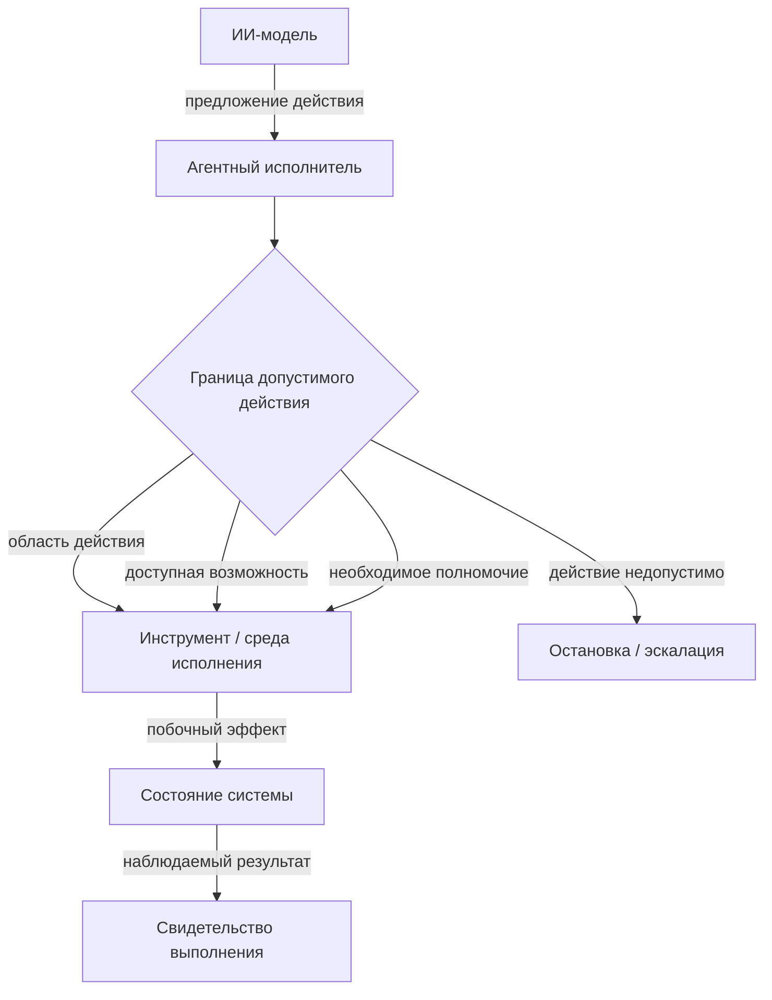

# Роли и контуры управления

> **Версия:** `0.3.1`  
> **Статус:** в разработке

## 7.1. Модель ролей и разделение полномочий

Агентная разработка требует различать не только участников процесса, но и функции управления, которые они выполняют. В традиционной инструментальной модели граница между рекомендацией и воздействием на систему обычно очевидна: программа предоставляет функцию, а решение о её использовании принимает человек. [Агентный исполнитель][g-agent-executor] способен самостоятельно читать проект, интерпретировать задачу, выбирать инструменты, изменять файлы, запускать команды и передавать часть работы другим исполнителям. Поэтому внутри одной технической системы могут оказаться объединены функции анализа, принятия решения, разрешения действия и его непосредственного выполнения.

CHLOYA рассматривает такое объединение как отдельный источник риска. Способность получить информацию или сформировать решение не должна автоматически означать право это решение принять, а техническая возможность выполнить действие — разрешение его выполнить. Такой подход продолжает классические принципы минимальных привилегий и [разделения полномочий][g-separation-of-privilege], сформулированные Saltzer и Schroeder: субъекту следует предоставлять только необходимые для конкретной операции права, а критически значимое действие не должно зависеть от одного неконтролируемого условия [202].

Для описания управления CHLOYA различает роль, [функциональную возможность][g-capability] и [полномочие][g-authority]. **Роль** определяет функцию, которую участник выполняет в конкретном процессе. **[Функциональная возможность][g-capability]** характеризует то, что участник технически способен сделать при помощи доступной ему модели, инструментов и среды. **[Полномочие][g-authority]** задаёт границу решений и действий, которые ему разрешено принимать или выполнять в данной ситуации.

Эти характеристики не следует считать взаимозаменяемыми. Агент может технически иметь доступ на запись ко всему репозиторию, но получить полномочие изменять только один модуль. Оркестратор может обладать возможностью вызвать средство развёртывания, но не иметь права разрешать изменение производственной среды. Человек, напротив, может обладать полномочием принять архитектурное решение или остаточный риск, не выполняя соответствующее техническое действие самостоятельно.

В современных агентных системах эта граница особенно важна, поскольку модель обычно включается в исполнительную среду, предоставляющую ей память, инструменты, внешние источники данных и возможность изменять состояние системы. Практические рекомендации по построению агентных систем поэтому также связывают безопасность не с общей «разумностью» агента, а с ограничением доступных ему инструментов, области действия и прав [339]. Для CHLOYA это означает, что технические возможности являются лишь одним из механизмов реализации полномочий, но не определяют их самостоятельно.

Право записи в каталог, например, ещё не отвечает на вопрос, допустимо ли изменить публичный интерфейс модуля. Доступ к системе управления базой данных не означает права изменить её схему. Возможность создать или подключить новый инструмент не предоставляет агенту права самостоятельно расширить собственную область действия. Поэтому технические разрешения операционной системы, API или среды исполнения являются необходимым, но недостаточным уровнем управления.

Путь от человеческого замысла до изменения актуального состояния проекта также состоит из нескольких логически различных функций. Сначала формируется намерение и исследуется ситуация, затем появляется предложение решения, принимается решение о выбранном варианте, [разрешается соответствующее действие][g-action-authorization], выполняется изменение, проверяется его результат и только после этого результат может быть принят как часть актуального состояния системы.

Такое разделение не означает, что для каждого шага необходим отдельный человек, агент или программный сервис. В небольшой обратимой задаче несколько функций могут выполняться одним участником. Однако их логическое различие должно сохраняться. Иначе становится невозможно установить, является ли сформированный моделью вариант лишь предложением, уже принятым решением или фактическим разрешением на изменение системы.

Особое значение это имеет при делегировании. Исследования интеллектуального делегирования подчёркивают, что передача работы включает не только описание задачи, но и границы роли, полномочий и ответственности [20]. CHLOYA развивает эту идею применительно к цепочкам агентного исполнения: передача задачи другому участнику не должна автоматически передавать ему весь объём полномочий передающей стороны.

Если оркестратор поручил агенту исследовать возможную миграцию базы данных, из этого не следует право выполнить эту миграцию. Если исполнитель привлекает субагента для анализа части задачи, субагент не должен автоматически наследовать все возможности и полномочия исходного исполнителя. Аналогично передача документа, сообщения или другого фрагмента контекста предоставляет информацию для обработки, но сама по себе не изменяет границы допустимого действия.

> **Полномочия не должны автоматически распространяться вместе с задачей, контекстом или цепочкой вызовов.**

Это требование особенно существенно для вероятностных исполнителей. Контекст способен содержать ошибки, устаревшие решения, недоверенные инструкции или результаты работы других агентов. Если появление некоторой инструкции в контексте может само по себе расширить набор разрешённых действий, граница между данными и управлением фактически исчезает. Поэтому изменение полномочий должно происходить через отдельный управляемый механизм, а не следовать из интерпретации текста самой моделью.

Из этого же следует необходимость различать пространство допустимого рассуждения и пространство допустимого исполнения. Исполнитель может обнаружить вариант, выходящий за первоначально предполагаемый способ решения, исследовать его и показать преимущества. Такая свобода полезна, поскольку чрезмерно ранняя фиксация способа реализации способна ухудшать качество решения. Однако возможность рассмотреть альтернативу не создаёт права немедленно её реализовать.

Если найденный вариант требует изменить действующий контракт, архитектурное решение, область задачи или уровень допустимого риска, исполнитель должен вынести это изменение на уровень, обладающий соответствующими полномочиями. Тем самым CHLOYA сохраняет пространство инженерного поиска, не превращая свободу рассуждения в неограниченную свободу действия.

Разделение функций должно быть пропорционально риску. Для локального, обратимого и хорошо проверяемого изменения предложение, разрешение, исполнение и проверка могут быть объединены в относительно лёгкий процесс. По мере роста необратимости, неопределённости, чувствительности данных и возможных последствий увеличиваются основания отделять формирование решения от его разрешения, а выполнение — от независимой проверки. Такой риск-зависимый подход согласуется с моделью градуированного человеческого контроля, в которой интенсивность надзора определяется характеристиками конкретного действия, а не одинаково применяется ко всем операциям [19].

При этом CHLOYA не стремится превратить агентную разработку в систему из множества формальных ролей и подтверждений. Разделение полномочий необходимо не ради количества участников, а ради предотвращения неявного накопления возможностей принятия решений и изменения системы внутри одного вероятностного компонента. Практическая агентная архитектура может физически объединять несколько функций, пока сохраняются проверяемые границы между тем, что компонент способен сделать, что ему разрешено сделать и какие действия требуют решения другого субъекта [339].

Делегирование исполнения также не устраняет человеческую и организационную ответственность. ИИ-модель может предложить решение, агент — реализовать его, оркестратор — распределить работу, а управляющий контур — применить установленные политики. Однако сама цепочка автоматизации не создаёт нового субъекта, которому можно безусловно передать ответственность за цели проекта и допустимость принятого риска [18; 20].

Таким образом, модель ролей CHLOYA строится не вокруг представления о наборе «виртуальных сотрудников», а вокруг разделения функций управления. Возможность не равна полномочию, предложение не равно решению, решение не равно разрешению действия, выполнение не равно доказательству корректности, а успешно завершённая операция ещё не означает принятия результата в актуальное состояние проекта.

> **В CHLOYA право действовать определяется не тем, что исполнитель технически способен сделать, а тем, что ему разрешено в рамках конкретной роли, области, решения и уровня риска.**

Последующие разделы конкретизируют эту модель для человека, ИИ-модели, агентного исполнителя, функциональных профилей, сервис-оркестратора и управляющего контура, а затем рассматривают передачу полномочий и допустимое совмещение ролей.

## 7.2. Человек

В CHLOYA человек рассматривается не как формальный участник цепочки подтверждений и не как обязательный ручной исполнитель каждого значимого шага. Его роль определяется тем, что именно человеческий субъект задаёт цели и границы проекта, принимает существенный [остаточный риск][g-residual-risk], обладает неделегируемыми полномочиями и вмешивается в работу автоматизированного контура там, где решение не должно приниматься только на основании вероятностного вывода модели. Такой подход согласуется с исследованиями человеческого надзора над агентными системами, в которых эффективность контроля связывается не с самим присутствием человека, а с его реальной способностью понимать ситуацию, вмешиваться в процесс и нести ответственность за принятое решение [18; 19].

Поэтому наличие человека в контуре само по себе не является достаточным признаком управляемости. Формальное подтверждение результата может практически не отличаться от автоматического, если человеку не хватает контекста, времени или компетенции для содержательной оценки. Dhanorkar, Passi и Vorvoreanu показывают, что человеческий надзор над агентными системами на практике ограничивается не только качеством интерфейсов, но и распределением ответственности, объёмом информации и способностью оператора действительно контролировать происходящее [18]. В CHLOYA это означает, что процедура подтверждения имеет смысл только тогда, когда человек способен понять предмет решения, его существенные последствия и остаточный риск.

[Содержательный человеческий контроль][g-meaningful-human-control] не требует повторного выполнения работы агента. Его задача состоит в возможности принять обоснованное решение на соответствующем уровне абстракции. Для локального и обратимого изменения достаточными могут быть краткое объяснение, итоговый diff и результаты автоматических проверок. Для изменения архитектурного контракта, производственной инфраструктуры, критических данных или прав доступа может потребоваться существенно более глубокое рассмотрение. Такой риск-зависимый подход соответствует модели градуированного контроля, предложенной в GAIE, где интенсивность человеческого участия связывается с последствиями действия, его обратимостью, чувствительностью данных и близостью к критическим бизнес-процессам [19].

Особая роль человека связана также с тем, что не все решения целесообразно делегировать автоматизированному контуру. К [неделегируемым решениям][g-non-delegable-decision] относятся прежде всего решения, которые изменяют цели проекта, принимаемые ограничения, допустимый уровень риска либо сами границы предоставленной автономности. При этом CHLOYA не устанавливает универсальный неизменный перечень таких решений: он зависит от среды, зрелости процесса и действующих политик. Исследование Tomašev и соавторов показывает, что делегирование в агентных системах следует рассматривать не как простую передачу задачи, а как передачу ограниченных полномочий при сохранении ясности относительно ответственности, границ роли и условий возврата управления [20].

Часть полномочий при этом может быть заранее формализована. Если организация определила допустимые условия, границы риска и проверяемые критерии выполнения, отдельные действия могут исполняться без ручного подтверждения каждого экземпляра. В таком случае человек делегирует ограниченное право действовать внутри заранее определённой области, но не предоставляет исполнителю право самостоятельно расширять эту область. Выход за установленные условия должен приводить к повторному решению или эскалации [19; 20].

Человек остаётся носителем более широкого контекста цели. Агент способен корректно оптимизировать локально сформулированную задачу и одновременно ухудшить систему в целом. Снижение задержки может увеличить эксплуатационную стоимость, упрощение реализации — уменьшить наблюдаемость, а локально удачное изменение — нарушить ранее принятое архитектурное решение. Поэтому важной функцией человека является не только выбор между предложенными вариантами, но и возможность пересмотреть саму постановку задачи, если обнаружено, что локальная цель не соответствует более широким интересам проекта.

Однако человеческое решение также не должно трактоваться как безусловный источник истины. Оно может быть ошибочным, противоречить действующим политикам или выходить за организационные полномочия конкретного участника. Поэтому CHLOYA рассматривает человека как один из субъектов управления, а не как универсальный механизм обхода ограничений. Полномочия человеческих участников, как и полномочия автоматизированных исполнителей, должны быть связаны с конкретной ролью, областью ответственности и типом решения.

Важным источником развития системы являются человеческие коррекции. Исправление результата агента содержит больше информации, чем итоговый патч: оно может выявлять неверное предположение, неявное ограничение, архитектурную норму или риск, которые отсутствовали в исходном контексте. Если такая информация остаётся только внутри отдельной сессии, последующие исполнители снова сталкиваются с той же неопределённостью. Поэтому значимые и повторяемые коррекции следует по возможности материализовать в устойчивой форме — в правиле, тесте, архитектурном решении, политике, примере или другом элементе проектной памяти. Такой подход превращает человеческое вмешательство из одноразового исправления в механизм накопления организационного знания.

Человек выполняет также функцию эскалации, однако основанием для неё не должна быть только субъективная уверенность модели. Вероятностный исполнитель способен быть уверенным и при этом ошибаться. Более надёжными основаниями являются наблюдаемые условия: выход за предоставленные полномочия, конфликт действующих правил, недостаток необходимых данных, необратимость действия, непройденная проверка, расхождение независимых оценок, изменение установленного контракта либо превышение допустимого риска или бюджета. В литературе по агентным системам эскалация также рассматривается как заранее проектируемый механизм, а не как произвольный запрос к человеку после возникновения проблемы [20].

Эскалация должна передавать человеку не только сам факт затруднения, но и контекст, необходимый для принятия решения: что исполнитель пытался сделать, почему действие остановлено, какие проверки уже проведены, какие варианты рассматривались и какого именно решения не хватает. Albada отдельно подчёркивает необходимость проектировать механизмы эскалации таким образом, чтобы человек сохранял возможность реально разобраться в ситуации и вмешаться в работу агента, а не выступал лишь формальным получателем предупреждений [339].

Избыточное количество запросов к человеку способно, напротив, ухудшать качество управления. Частые малозначимые подтверждения создают усталость от уведомлений и повышают вероятность автоматического согласия с рекомендациями системы. Albada связывает это с более общей проблемой автоматизационного доверия: человек постепенно перестаёт содержательно проверять решения системы, если большинство запросов оказываются рутинными или малорисковыми [339]. Поэтому задача CHLOYA состоит не в максимальном количестве человеческих ворот, а в выборе точек, где участие человека действительно влияет на качество решения и уровень риска.

При масштабировании агентной разработки возникает и количественное ограничение — пропускная способность человеческого контроля. Возможность оркестратора параллельно запускать множество исполнителей не означает, что человек способен с той же скоростью содержательно принимать их результаты. Если объём создаваемых изменений превышает способность участников процесса качественно их проверить, формальное сохранение ручного подтверждения начинает создавать ложное ощущение безопасности. Эта проблема согласуется с наблюдаемыми на практике ограничениями человеческого надзора над агентными системами [18].

Поэтому скорость и форма автоматизированной работы должны учитывать реальную способность человека к проверке на соответствующем уровне риска. Увеличение числа агентов не должно механически увеличивать число объектов, требующих одинаково глубокого ручного рассмотрения. Часть контроля может переноситься в автоматические доказательства, независимые проверки, агрегированные отчёты и риск-зависимые ворота, чтобы ограниченный человеческий ресурс внимания сохранялся для действительно значимых решений [18; 19].

CHLOYA при этом не исходит из предположения, что человек превосходит ИИ в каждой локальной операции. Автоматизированные исполнители способны быстрее анализировать большие объёмы кода, последовательнее применять формальные правила и эффективнее выполнять некоторые виды проверок. Специальная роль человека определяется не универсальным техническим превосходством, а тем, что человеческие и организационные субъекты остаются носителями целей, допустимого риска, ответственности и контекста, который невозможно полностью свести к инструкциям для модели [18; 20].

Форма человеческого участия поэтому должна быть пропорциональна последствиям действия. Для низкорисковых, обратимых и хорошо проверяемых изменений участие может ограничиваться постановкой рамок и последующим наблюдением. По мере роста необратимости, неопределённости и масштаба возможных последствий возрастает необходимость предварительного решения, содержательной проверки или явного разрешения [19].

При этом под «человеком» в CHLOYA не следует понимать одного универсального пользователя. Разные полномочия могут принадлежать разработчику, владельцу продукта, архитектору, специалисту по безопасности, администратору базы данных или ответственному за эксплуатацию. Человеческое участие определяется не должностью как таковой, а наличием необходимого контекста, ответственности и полномочий для конкретного класса решений.

Таким образом, человек в CHLOYA не является постоянным ручным посредником между агентом и системой. Его задача состоит в удержании целей и допустимых границ, принятии решений, которые не должны автоматически выводиться из возможностей исполнителя, обеспечении содержательной коррекции и участии там, где последствия превышают установленный уровень автономности. Эффективность такого участия определяется не количеством ручных подтверждений, а качеством информации, полномочиями участника и его реальной способностью оценить последствия решения.

> **Человеческий контроль в CHLOYA определяется не количеством подтверждений, а способностью человека содержательно понять решение, оценить его последствия и обладать полномочиями принять соответствующий риск.**

## 7.3. ИИ-модель

В CHLOYA [ИИ-модель][g-ai-model] рассматривается как вероятностный вычислительный компонент, который на основании предоставленного контекста формирует или оценивает возможный результат: текст, код, план, классификацию, объяснение либо структурированное предложение дальнейшего действия. Это принципиально более узкое понятие, чем агент. Возможности читать файлы, обращаться к внешним данным, использовать долговременную память, выполнять команды или изменять состояние системы возникают только тогда, когда модель включается в более широкий исполнительный контур.

Такое разграничение важно не только терминологически. Современные агентные системы обычно объединяют языковую модель с механизмами памяти, планирования, внешними источниками данных, инструментами и управляющей логикой. В обзоре Chowa и соавторов агентные архитектуры рассматриваются именно как композиция таких механизмов, позволяющая языковой модели переходить от генерации ответа к последовательному взаимодействию со средой [345]. Поэтому свойства всей агентной системы нельзя автоматически приписывать используемой в ней модели.

Это особенно заметно при работе с инструментами. Модель может сформировать структурированный запрос на вызов функции, API, терминальной команды или другого средства, однако фактическое изменение внешнего состояния выполняется исполнительной средой. Она предоставляет модели описание доступных инструментов, принимает сформированный вызов, проверяет или преобразует параметры, выполняет операцию и возвращает её результат в последующий контекст [339; 345]. Следовательно, даже корректно сформированный вызов инструмента следует рассматривать прежде всего как **[вывод модели][g-model-output] и [предложение действия][g-action-proposal]**, а не как само выполненное действие.

Это различие становится критическим для операций с побочными эффектами. Doshi и соавторы показывают, что расширение языковой модели инструментами создаёт новые классы системных рисков: отдельные вызовы могут быть допустимыми, но их последовательность или сочетание способны привести к утечке данных, повреждению состояния или иному нежелательному эффекту [344]. Поэтому безопасность использования инструментов нельзя сводить только к способности модели распознавать опасные команды. Она должна обеспечиваться также внешними ограничениями на доступные возможности, потоки данных и допустимые последовательности действий [344].

В CHLOYA отсюда следует разделение между вероятностным выбором действия и его разрешением. Модель может определить, что изменение файла, вызов API или миграция базы данных представляются рациональным следующим шагом, но право выполнить этот шаг определяется полномочиями исполнителя, действующими политиками, областью задачи и уровнем риска. Модельные ограничения способны уменьшать вероятность нежелательного поведения, однако не должны быть единственной границей безопасности; исследования безопасного использования инструментов также показывают необходимость внешне проверяемых ограничений вместо опоры только на внутренние защитные механизмы LLM [344].

Аналогичное различие действует между выводом модели и доказательством его корректности. Языковая модель способна сформировать убедительное объяснение, логически связный текст или уверенную оценку и при этом ошибаться. Поэтому самоописание модели, выраженная уверенность либо правдоподобность результата не рассматриваются CHLOYA как достаточное свидетельство готовности. Сформированный результат является кандидатом на решение, а необходимые свойства должны подтверждаться наблюдаемыми свидетельствами: тестами, статическим анализом, проверкой контрактов, результатами выполнения, независимой оценкой либо другими соответствующими задаче процедурами.

Такой подход не означает, что рассуждение модели не имеет ценности. Напротив, способность работать с неполными требованиями, естественным языком и большим пространством вариантов является одним из основных преимуществ современных моделей. Однако CHLOYA разделяет построение аргумента и подтверждение проверяемого свойства. Модель может объяснить, почему считает реализацию корректной, но это объяснение не заменяет проверку там, где такая проверка технически возможна.

Особого внимания требует и отношение между моделью и предоставленным ей контекстом. Передача документа, архитектурного решения или большого объёма проектной памяти не гарантирует, что вся доступная информация будет одинаково полно учтена при формировании результата. Исследования поведения моделей в длинном контексте показывают существенную зависимость качества от расположения релевантной информации и структуры контекста [48]. Поэтому утверждение «информация была передана модели» нельзя считать эквивалентом утверждения «информация была корректно использована».

Обратная ситуация также создаёт риск. Сведения, которые модель воспроизводит из параметрического знания, не обязательно соответствуют текущему состоянию проекта. Они могут относиться к другой версии технологии, общему случаю или ранее существовавшему архитектурному решению. Поэтому проектная память и действующие решения должны сохраняться во внешних управляемых источниках, а модель использоваться для их интерпретации и применения, но не как скрытое каноническое хранилище состояния проекта.

Разделение модели, контекста и исполнительной среды позволяет точнее локализовать причины ошибок. Неудачный результат агентной задачи может быть следствием недостаточного качества рассуждения, неверно подобранного контекста, устаревшего источника, ошибочного выбора инструмента, неправильных параметров вызова, отказа внешней системы или недостаточной последующей проверки. Оценка только конечного результата смешивает эти причины и затрудняет улучшение архитектуры. Поэтому при анализе отказа следует устанавливать, на каком именно уровне возникло отклонение.

ИИ-модель при этом не должна становиться жёстко закреплённым элементом методологии. Современные агентные архитектуры могут использовать разные модели в зависимости от требуемой функции, стоимости, задержки, доступного контекста, требований к конфиденциальности и качества решения [345]. Одна модель может использоваться для генерации кода, другая — для классификации или проверки, а часть задач может выполняться локально без передачи чувствительного контекста внешнему поставщику.

Архитектурная заменяемость, однако, не означает функциональной эквивалентности. Разные модели и даже разные версии одной модели могут отличаться по способности работать с длинным контекстом, следовать ограничениям, выбирать инструменты, выполнять программные задачи и поддерживать структурированные форматы. Поэтому замена модели должна рассматриваться как изменение потенциальных способностей системы и сопровождаться повторной проверкой тех свойств, на которые эта модель влияет. Сохранение совместимого интерфейса само по себе не доказывает сохранение поведения.

Такое разграничение позволяет отделить функциональную роль от конкретной реализации. «Разработчик», «проверяющий» или «анализатор требований» в агентной системе не должны определяться названием конкретной модели. Роль задаётся выполняемой функцией, доступным контекстом, инструментами и полномочиями, тогда как модель является одним из ресурсов, используемых для реализации этой функции. Такой подход делает возможной замену модели без перестройки всей модели управления и одновременно не скрывает необходимость повторной проверки после такой замены.

CHLOYA поэтому не стремится устранить вероятностную природу ИИ-модели. Именно она позволяет работать с неоднозначностью, неформализованными требованиями и задачами, для которых невозможно заранее перечислить все допустимые пути решения. Методологическая задача состоит в другом: сохранить свободу поиска и построения вариантов, не превращая её автоматически в свободу воздействия на систему.

Таким образом, ИИ-модель в CHLOYA является механизмом построения и оценки вариантов, но не самостоятельным источником полномочий, проектной истины или доказательства корректности. Её вывод становится инженерным действием только через внешний исполнительный слой, а допустимость и результат такого действия должны контролироваться на соответствующих уровнях системы.

> **Модель в CHLOYA предлагает и оценивает варианты; полномочия, фактическое исполнение и доказательство результата принадлежат другим слоям системы.**

## 7.4. Агентный исполнитель

[Агентный исполнитель][g-agent-executor] — это уровень системы, на котором вероятностный вывод ИИ-модели получает возможность воздействовать на внешнюю среду. Если модель формирует вариант решения или предложение действия, то исполнитель связывает этот вывод с инструментами, состоянием сессии, рабочим контекстом и доступными каналами воздействия. Именно на этом уровне рекомендация может превратиться в изменение файла, выполнение команды, запрос к базе данных, вызов внешнего API, создание коммита или изменение инфраструктуры.

Поэтому в CHLOYA модель и агентный исполнитель рассматриваются как принципиально разные сущности. Исполнитель может использовать одну или несколько ИИ-моделей, но его свойства определяются не только качеством их рассуждения. Существенное значение имеют предоставленные инструменты, права среды исполнения, область действия, доступное состояние и механизмы ограничения побочных эффектов. Практические архитектуры агентных систем также отделяют модельный вывод от [исполнительного контура][g-execution-contour], через который осуществляется фактическое использование инструментов [339; 345].

Такое разделение образует важную доверительную границу. Пока ошибочный вывод остаётся текстом или структурированным предложением, его последствия ограничены информационным уровнем. После исполнения ошибка может изменить актуальное состояние системы. Поэтому способность модели сформировать действие не должна автоматически означать возможность реализовать соответствующий эффект.

CHLOYA исходит из того, что исполнитель должен действовать только через явно предоставленные ему каналы воздействия. Классический принцип минимальных привилегий требует предоставлять субъекту только те права, которые необходимы для выполняемой функции [202]. В агентной среде этот принцип должен применяться не только к учётным записям и системным разрешениям, но и к инструментам, внешним сервисам и типам допустимых операций.

Подход на основе отслеживаемых функциональных возможностей развивает эту идею применительно к агентным системам. Odersky и соавторы предлагают явно связывать потенциальные эффекты агента с предоставленными ему [функциональными возможностями][g-capability] доступа к файловой системе, сети, процессам и другим ресурсам, не полагаясь на способность самой модели соблюдать сформулированные в естественном языке ограничения [346]. Для CHLOYA это означает, что границы действия должны по возможности обеспечиваться средой исполнения, а не существовать только в контексте модели.

При этом наличие инструмента не тождественно разрешению использовать все предоставляемые им операции. Один и тот же интерфейс способен объединять действия с принципиально разными последствиями. Возможность выполнить `git diff` не означает права выполнить `git push`, а доступ к клиенту базы данных не делает эквивалентными чтение данных и удаление объекта. Исследование реальной экосистемы MCP также показывает, что агентные инструменты могут получать широкие системные и сетевые возможности, тогда как недостаточное разделение привилегий создаёт дополнительные пути воздействия на данные и среду [347].

Поэтому CHLOYA различает доступность инструмента и разрешение конкретного действия. Проверяться должен не только факт наличия инструмента, но и допустимость операции в рамках текущей роли, задачи, области действия и уровня риска. Чем существеннее потенциальный эффект, тем меньше оснований использовать разрешение уровня «инструмент доступен целиком».

Одновременно с набором доступных операций исполнитель получает ограниченную [область действия][g-scope]. Она определяет, над какими объектами и в каких условиях разрешено применять предоставленные возможности. Для одного агента область может быть ограничена частью репозитория, для другого — тестовой базой данных или конкретным набором API. Тем самым одинаковая техническая возможность может быть допустимой в одном контексте и запрещённой в другом.

Изоляция среды исполнения является одним из способов реализации таких границ, но не должна рассматриваться как достаточная гарантия сама по себе. Контейнер, виртуальная машина или иная песочница способны ограничить доступные ресурсы и системные эффекты, однако не обязательно предотвращают нежелательное использование уже разрешённых возможностей. Если исполнитель одновременно имеет законный доступ к чувствительной информации и разрешённый канал её передачи, каждое действие по отдельности может удовлетворять технической политике, тогда как их композиция создаёт нежелательный результат [346].

Аналогичная проблема возникает при последовательном использовании нескольких инструментов. Doshi и соавторы показывают, что отдельные допустимые вызовы могут образовывать опасную цепочку, поэтому анализ безопасности должен учитывать не только единичные операции, но и их композицию [344]. Для CHLOYA это означает, что пространство допустимых эффектов не всегда может быть определено простым перечнем разрешённых инструментов.

Следовательно, внешняя оболочка исполнения должна ограничивать не только отдельные каналы воздействия, но и те сочетания действий, которые способны вывести процесс за пределы установленной задачи или политики. Это особенно важно для систем, в которых агент самостоятельно планирует многошаговую последовательность и выбирает инструменты на каждом её этапе.

Исполнение должно оставлять наблюдаемый результат. Утверждение агента о том, что операция выполнена, не является достаточным свидетельством её фактического завершения. После изменения файла доступен diff, после запуска тестов — код возврата и отчёт, после обращения к API — ответ внешней системы, после изменения базы данных — наблюдаемое состояние соответствующих объектов. Исполнитель должен по возможности возвращать такие свидетельства в управляющий процесс, чтобы последующая проверка основывалась на фактическом эффекте, а не только на его интерпретации моделью.

При этом факт выполнения ещё не является доказательством корректности. Команда может успешно завершиться и создать неправильное состояние, тестовый набор — быть неполным, а внешняя система — принять семантически ошибочные данные. Поэтому ответственность исполнителя состоит прежде всего в контролируемом осуществлении действия и фиксации его наблюдаемого результата; окончательная оценка достаточности полученных свидетельств относится к более широкому контуру проверки.

Не всякое действие также является атомарным. Агент может выполнить несколько операций и остановиться после того, как часть изменений уже была применена. Такая ситуация особенно значима для миграций, инфраструктурных изменений, внешних API и других процессов, где простое прекращение исполнения не возвращает систему к исходному состоянию. Поэтому исполнительный контур должен учитывать возможность частичного эффекта и, где это оправдано, использовать транзакции, идемпотентные операции, контрольные точки, снимки или предусмотренные процедуры отката.

Корректным исходом работы исполнителя может быть и отсутствие действия. Если выполнение требует отсутствующих полномочий, необходимый контекст недостаточен, возник конфликт политик или допустимый способ продолжения не найден, остановка является предпочтительным результатом по сравнению с попыткой завершить задачу любой ценой. При этом ограничение должно относиться к самому эффекту, а не только к одному конкретному инструменту. Запрет на удаление объекта не должен обходиться созданием скрипта, который достигает того же результата другим способом.

По той же причине возможность создавать новые инструменты, устанавливать зависимости, подключать дополнительные сервисы или порождать субагентов не должна автоматически расширять исходные полномочия исполнителя. Новый канал воздействия может увеличивать технические возможности системы, но право использовать его с дополнительными эффектами должно определяться отдельно. Самомодификация исполнительного контура не является самоавторизацией.

Это особенно существенно для развивающихся агентных систем, способных самостоятельно расширять набор средств решения задачи. Чем больше исполнитель может изменять собственную среду, тем важнее сохранять внешнюю границу, которую он не способен расширить только через собственное рассуждение. В противном случае политика ограничений становится частью того же вероятностного процесса, который она должна ограничивать.

Таким образом, агентный исполнитель в CHLOYA является не просто ИИ-моделью с подключёнными инструментами, а отдельным контуром преобразования вывода модели в контролируемое воздействие на систему. Его возможности должны быть явно ограничены, область действия — определена, существенные операции — разрешены на соответствующем уровне, а фактические эффекты — наблюдаемы и доступны для последующей проверки.

> **Агентный исполнитель превращает вероятностный вывод в изменение состояния системы, поэтому свобода рассуждения должна быть отделена от внешне ограниченного пространства допустимых эффектов.**

### Схема исполнительного контура

**Рисунок 7.4.1 — Переход от предложения действия к контролируемому эффекту.** ИИ-модель формирует предложение, но воздействие на состояние выполняется только через исполнительный контур и установленные для него границы. Наблюдаемый результат возвращается как свидетельство для последующей проверки.

[g-action-authorization]: ../../research/GLOSSARY.ru.md#разрешение-действия
[g-action-proposal]: ../../research/GLOSSARY.ru.md#предложение-действия
[g-agent-executor]: ../../research/GLOSSARY.ru.md#агентный-исполнитель
[g-ai-model]: ../../research/GLOSSARY.ru.md#ии-модель
[g-authority]: ../../research/GLOSSARY.ru.md#полномочие
[g-capability]: ../../research/GLOSSARY.ru.md#функциональная-возможность
[g-execution-contour]: ../../research/GLOSSARY.ru.md#исполнительный-контур
[g-meaningful-human-control]: ../../research/GLOSSARY.ru.md#содержательный-человеческий-контроль
[g-model-output]: ../../research/GLOSSARY.ru.md#вывод-модели
[g-non-delegable-decision]: ../../research/GLOSSARY.ru.md#неделегируемое-решение
[g-residual-risk]: ../../research/GLOSSARY.ru.md#остаточный-риск
[g-scope]: ../../research/GLOSSARY.ru.md#область-действия
[g-separation-of-privilege]: ../../research/GLOSSARY.ru.md#разделение-полномочий
