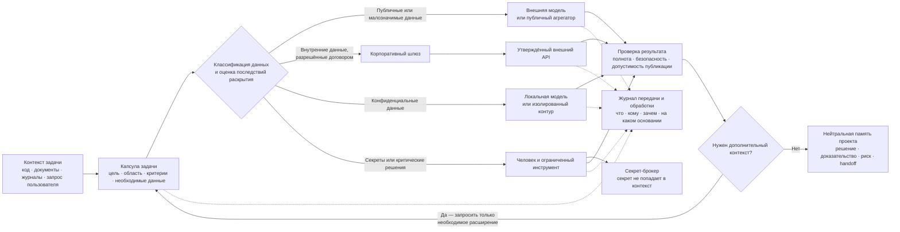
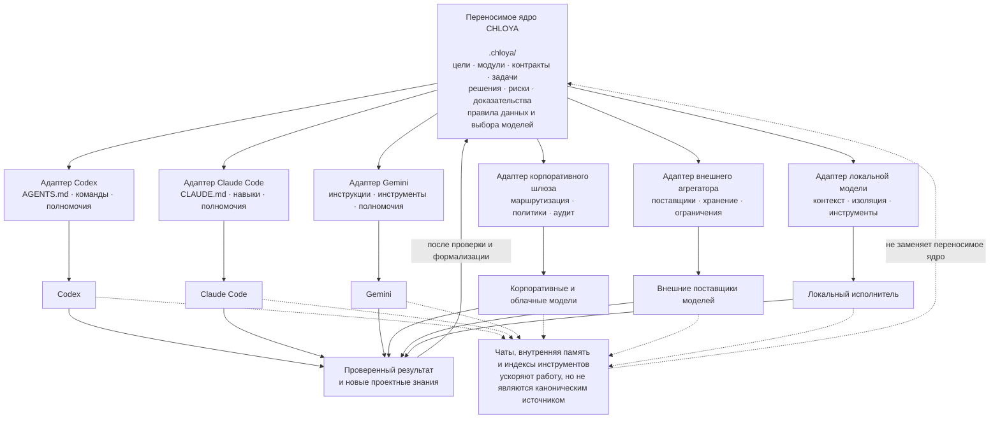

# Зачем нужна новая методология

> **Версия:** `0.3.1`  
> **Статус:** на обсуждении

## Содержание этого раздела

- [1.1. Проблема современной агентной разработки](#11-проблема-современной-агентной-разработки)
- [1.2. Почему полная автономность не является основной целью](#12-почему-полная-автономность-не-является-основной-целью)
- [1.3. Контекст и вычислительный бюджет как архитектурные ресурсы](#13-контекст-и-вычислительный-бюджет-как-архитектурные-ресурсы)
  - [1.3.1. Контекстное окно не является памятью проекта](#131-контекстное-окно-не-является-памятью-проекта)
  - [1.3.2. Цена избыточного и недостаточного контекста](#132-цена-избыточного-и-недостаточного-контекста)
  - [1.3.3. Архитектура как средство локализации внимания](#133-архитектура-как-средство-локализации-внимания)
  - [1.3.4. Семантическая передача системных изменений](#134-семантическая-передача-системных-изменений)
  - [1.3.5. Размножение контекста в многоагентной работе](#135-размножение-контекста-в-многоагентной-работе)
  - [1.3.6. Контекстные слои и капсула задачи](#136-контекстные-слои-и-капсула-задачи)
  - [1.3.7. Позиция CHLOYA](#137-позиция-chloya)
- [1.4. Конфиденциальность, владение проектными знаниями и независимость от поставщика](#14-конфиденциальность-владение-проектными-знаниями-и-независимость-от-поставщика)
  - [1.4.1. Конфиденциальными являются не только исходные данные](#141-конфиденциальными-являются-не-только-исходные-данные)
  - [1.4.2. Внешний ИИ не является единым классом среды](#142-внешний-ии-не-является-единым-классом-среды)
  - [1.4.3. Многомодельные платформы, корпоративные шлюзы и дополнительная доверительная граница](#143-многомодельные-платформы-корпоративные-шлюзы-и-дополнительная-доверительная-граница)
  - [1.4.4. Политика поставщика не заменяет полномочие на передачу](#144-политика-поставщика-не-заменяет-полномочие-на-передачу)
  - [1.4.5. Доверительная граница проходит через весь агентный процесс](#145-доверительная-граница-проходит-через-весь-агентный-процесс)
  - [1.4.6. Локальная модель уменьшает не все риски](#146-локальная-модель-уменьшает-не-все-риски)
  - [1.4.7. Проектная память должна принадлежать проекту](#147-проектная-память-должна-принадлежать-проекту)
  - [1.4.8. Переносимое ядро и адаптеры поставщиков](#148-переносимое-ядро-и-адаптеры-поставщиков)
  - [1.4.9. Независимость не означает идентичность моделей](#149-независимость-не-означает-идентичность-моделей)
  - [1.4.10. Пример: анализ двойного списания в платёжном модуле](#1410-пример-анализ-двойного-списания-в-платёжном-модуле)
  - [1.4.11. Позиция CHLOYA](#1411-позиция-chloya)

## 1.1. Проблема современной агентной разработки

Современные программирующие агенты способны читать репозитории, изменять код, запускать команды и тесты, создавать интерфейсы, писать документацию и готовить изменения к публикации. Однако скорость их действий существенно опережает зрелость процессов управления ими.

Распространённый сценарий выглядит так:

- человек кратко описывает большую идею;
- агент получает широкий доступ к репозиторию, терминалу, базам и облачной инфраструктуре;
- агент самостоятельно выбирает архитектуру и стек;
- в процессе создаёт файлы, ветки, зависимости, миграции и сервисы;
- человек оценивает уже почти готовый результат, не всегда понимая путь и последствия решений.

Такой подход способен быстро создать демонстрацию, но не гарантирует, что результат:

- соответствует реальному замыслу человека;
- предсказуем по стоимости;
- понятен и сопровождаем человеком;
- безопасен для данных и инфраструктуры;
- переносим между Codex, Claude Code, Gemini CLI, локальными моделями и будущими инструментами;
- пригоден для постепенного развития;
- не содержит скрытых допущений агента;
- не породил архитектуру, которую дешевле переписать, чем сопровождать.

Агентные инструменты способны воздействовать на файловую систему, сеть и инфраструктуру, поэтому безопасность определяется не только качеством модели, но и технически enforced-песочницей, сетевыми ограничениями, политикой подтверждений и обратимостью действий. Публикация Friendly Fire дополнительно показывает, что даже задача защитного анализа стороннего кода может быть превращена в канал выполнения вредоносных инструкций. [1](https://ainowinstitute.org/publications/friendly-fire-exploit-brief), [3](https://developers.openai.com/codex/agent-approvals-security), [4](https://docs.anthropic.com/en/docs/claude-code/security)

## 1.2. Почему полная автономность не является основной целью

Запрос вида «сделай мне большую систему или игру» и длительная автономная работа агента уже нельзя рассматривать только как гипотетический сценарий. Современные программирующие агенты способны часами и днями работать без постоянного участия человека, создавать многофайловые приложения, запускать и исправлять тесты, генерировать графические материалы, распределять работу между несколькими исполнителями и последовательно развивать один проект.

Поэтому вопрос состоит уже не в том, **может ли ИИ самостоятельно создать значительный программный артефакт**, а в том, при каких условиях полученный результат можно считать соответствующим замыслу, проверяемым, сопровождаемым, экономически оправданным и безопасным.

ИИ хорошо комбинирует известные решения, быстро реализует типовые конструкции и помогает анализировать варианты. Однако без явно заданных границ он может:

- преждевременно выбрать привычный стек;
- буквально реализовать неполное требование;
- не заметить неформальную цель пользователя;
- создать похожее на требуемое, но не то решение;
- переусложнить архитектуру;
- добавить функции, которые не создают пользовательской ценности;
- многократно переделывать уже приемлемый результат;
- не найти нестандартный обходной путь, который предложил бы человек с предметным опытом;
- продолжать расходовать вычислительные ресурсы после того, как ценность следующих изменений стала ниже их стоимости.

### 1.2.1. Что уже удавалось создавать в автономном режиме

Показательным примером стала демонстрация OpenAI, в которой Codex создал трёхмерную гоночную игру Voxel Velocity на Three.js. В игру вошли восемь трасс, восемь персонажей, семь компьютерных соперников, предметы, несколько уровней сложности, интерфейс, звук и игровая физика. По сообщению OpenAI, агент выполнял функции проектировщика, разработчика и тестировщика, запускал игру и проверял её поведение. На создание итоговой версии было израсходовано более семи миллионов токенов [40](https://openai.com/index/introducing-the-codex-app/).

Однако формула «игра создана по одному запросу» без пояснений может вводить в заблуждение. Исходный запрос представлял собой достаточно подробную спецификацию. В нём были перечислены режим игры, число трасс и персонажей, правила управления, характеристики заноса и ускорения, длительность эффектов, поведение компьютерных соперников и требования к интерфейсу. Кроме того, агент получил специализированные навыки разработки браузерных игр и генерации изображений [40](https://openai.com/index/introducing-the-codex-app/).

После первоначальной постановки задачи Codex автоматически получал дополнительные общие указания продолжать работу: запускать игру, искать отсутствующие возможности, добавлять функции, исправлять ошибки и снова тестировать результат. OpenAI показывает промежуточные версии после приблизительно 60 тысяч, 800 тысяч и 7 миллионов токенов [40](https://openai.com/index/introducing-the-codex-app/).

Этот пример демонстрирует значительную автономность исполнения, но одновременно подтверждает роль:

- подробной спецификации;
- специализированных инструментов и навыков;
- исполняемой среды;
- возможности визуальной и функциональной проверки;
- повторяющегося управляющего цикла;
- большого вычислительного бюджета.

Он ближе не к запросу «придумай и сделай хорошую игру», а к длительному автономному выполнению достаточно подробно описанного проекта.

Рисунок 1.1 — Интерфейс Voxel Velocity.

[Интерактивная итоговая версия игры](https://cdn.openai.com/gpt-examples/7fc9a6cb-887c-4db6-98ff-df3fd1612c78/racing_v2.html) доступна по состоянию на 2026-07-19.

Более сложный эксперимент Anthropic был связан с созданием нового компилятора языка C. Команда из 16 экземпляров Claude Opus 4.6 работала над общей кодовой базой почти в двух тысячах сеансов. При расходах около 20 тысяч долларов агенты создали на Rust компилятор объёмом приблизительно 100 тысяч строк, способный собирать загружаемое ядро Linux 6.9 для архитектур x86, ARM и RISC-V [41](https://www.anthropic.com/engineering/building-c-compiler).

Опубликованный репозиторий также сообщает об успешной сборке или прохождении тестов для QEMU, FFmpeg, SQLite, PostgreSQL, Redis, QuickJS, Lua, musl, DOOM и ряда других проектов [42](https://github.com/anthropics/claudes-c-compiler).

Этот случай иногда можно неточно пересказать как «ИИ написал или переписал Linux». В действительности агенты не создавали саму операционную систему Linux: они реализовали новый компилятор, достаточно функциональный, чтобы собрать её ядро. Достижение от этого не становится менее значительным, но точное описание важно для оценки реального уровня автономности.

Эксперимент не сводился к свободной работе моделей над общей фразой «напишите компилятор». Человек:

- определил проверяемую цель;
- подготовил контейнерную среду;
- создал управляющую обвязку;
- организовал непрерывный цикл выдачи заданий;
- запустил параллельную работу агентов;
- предоставил тестовые наборы, направлявшие дальнейшую разработку.

Когда один сеанс завершался, управляющий цикл запускал следующий. Агенты должны были разбивать проблему на небольшие части, отслеживать сделанное, выбирать следующую задачу и продолжать работу. Отдельные агенты могли специализироваться на реализации, тестировании, документации или качестве кода [41](https://www.anthropic.com/engineering/building-c-compiler).

Таким образом, впечатляющий результат был достигнут не отсутствием управления, а созданием специализированного процесса управления автономностью.

При этом компилятор имеет существенные ограничения. Для отдельных этапов загрузки x86 он обращается к GCC, не содержит полностью собственного стабильного ассемблера и компоновщика и не является полноценной заменой промышленного компилятора общего назначения [41](https://www.anthropic.com/engineering/building-c-compiler). Следовательно, факт сборки ядра Linux подтверждает высокий уровень технической результативности, но не равен доказательству производственной готовности всего решения.

**Материалы эксперимента Anthropic с командой агентов:** [видео на YouTube](https://www.youtube.com/watch?v=vNeIQS9GsZ8).

Существуют и более прямые эксперименты по созданию операционных систем. Открытый проект VibeOS описывает любительскую операционную систему для ARM64, разработанную совместно с Claude Code за 64 документированных сеанса. Она запускается в QEMU и на Raspberry Pi Zero 2W, содержит собственное ядро, файловую систему, графическую среду, сетевой стек и ряд пользовательских программ [43](https://github.com/kaansenol5/VibeOS).

Одновременно сам автор предупреждает, что не всё работает и часть возможностей не была протестирована. Для сборки также требуется внешний кросс-компилятор, а некоторые функции зависят от стороннего кода. Поэтому VibeOS полезна как подтверждение способности ИИ существенно участвовать в создании системного программного обеспечения, но недостаточна как доказательство готовности автономно создавать надёжные операционные системы промышленного уровня.

Рисунок 1.2 — Рабочий стол VibeOS.

### 1.2.2. Почему отдельные демонстрации не доказывают общую надёжность

Успешный крупный эксперимент показывает, что конкретная конфигурация модели, инструментов, спецификации, тестов и управляющего контура смогла создать конкретный результат. Он не доказывает, что тот же агент с сопоставимой вероятностью создаст произвольную систему по другому запросу.

Исследования автоматизированной разработки игр показывают различие между впечатляющим отдельным результатом и устойчивой воспроизводимостью.

Система OpenGame использует не только языковую модель, но и специализированную модель GameCoder-27B, библиотеку проектных шаблонов, накапливаемый протокол исправления ошибок и отдельную среду проверки сборки, визуальной пригодности и соответствия замыслу. Авторы отмечают, что обычные агенты часто теряют согласованность между файлами, неправильно связывают сцены и создают формально работающие, но логически несвязные проекты [44](https://arxiv.org/abs/2604.18394).

Набор испытаний GameCraft-Bench включает 140 заданий для игрового движка Godot. Даже лучший из проверенных агентов получил итоговый результат 41,46%, а большинство систем не достигло 40%. Агенты сравнительно успешно воспроизводили отдельные игровые механики, но хуже справлялись с полнотой содержания, визуальной обратной связью и общей связностью готовой игры [45](https://arxiv.org/abs/2606.17861).

Следовательно, наличие одной …7635 tokens truncated… инструкции, конфиденциальные данные либо недоверенное содержимое.

Однако противоположная крайность также опасна. Если локальному агенту передать только файлы его модуля, скрыв значимые системные ограничения, он может:

- нарушить внешний контракт;
- неправильно интерпретировать формат данных;
- создать несовместимое изменение;
- продублировать уже существующий механизм;
- не учесть требования безопасности;
- нарушить сквозной бизнес-процесс;
- принять связанную задачу за полностью локальную.

Поэтому CHLOYA не стремится к минимальному контексту как самоцели. Она стремится к **минимально достаточному контексту с управляемым расширением**.

Исследование Repoformer подтверждает, что безусловное получение дополнительного репозиторного контекста не всегда полезно. Авторы обнаружили, что значительная часть извлечённых материалов могла быть бесполезной или вредной для дополнения кода. Выборочное получение контекста позволило в исследованной конфигурации ускорить обработку до 70% без ухудшения качества [51](https://arxiv.org/abs/2403.10059).

Важен не только тематический отбор, но и актуальность материалов. Диагностическое исследование 2026 года на 17 примерах изменений сигнатур из пяти Python-репозиториев показало, что передача устаревших фрагментов могла направлять модели к использованию уже неактуальных интерфейсов. Авторы отдельно ограничивают выводы рамками небольшой контролируемой выборки, поэтому эти результаты нельзя считать универсальной количественной оценкой. Однако они подтверждают качественный риск: устаревший контекст способен активно направлять агента к неправильному состоянию проекта [53](https://arxiv.org/abs/2605.14478).

Следовательно, контекстная капсула должна описывать не только содержание, но и его состояние:

- источник;
- версию или момент актуальности;
- уровень доверия;
- область применимости;
- связь с текущей задачей;
- признаки, при которых сведения необходимо перепроверить.

### 1.3.3. Архитектура как средство локализации внимания

В традиционной разработке модульность уменьшает связанность системы и упрощает сопровождение. В агентной разработке она получает дополнительное назначение: сокращает объём информации, который необходимо повторно передавать ИИ для каждого изменения.

Хорошо выделенный модуль должен иметь:

- определённую ответственность;
- явные входы и выходы;
- документированные контракты;
- контролируемые зависимости;
- локальные критерии готовности;
- известные системные ограничения;
- понятные условия, при которых изменение перестаёт быть локальным.

Если эти сведения формализованы, исполнителю не требуется читать внутреннюю реализацию всех соседних компонентов. Он может работать на основании контракта и запрашивать дополнительный контекст только при обнаружении неопределённости.

Архитектура становится не только структурой исполнения программы, но и **структурой распределения внимания ИИ**.

Это не означает, что локальный исполнитель должен быть изолирован от системы. Он должен знать:

- какую часть системы изменяет;
- с какими контрактами взаимодействует;
- какие ограничения являются обязательными;
- какие соседние компоненты могут быть затронуты;
- в каких случаях он обязан остановиться и запросить расширение контекста.

Таким образом, локальность в CHLOYA является не отсутствием знания о системе, а контролируемым ограничением глубины доступа к её внутренним деталям.

### 1.3.4. Семантическая передача системных изменений

Если изменение одного модуля влияет на другие, самым простым решением кажется передача всем агентам полного набора изменений с предложением самостоятельно определить последствия. Однако такой подход заставляет каждого исполнителя повторно анализировать чужой код и создаёт риск различных интерпретаций одного решения.

CHLOYA предлагает отделять реализацию изменения от его значения для потребителей.

Предположим, что модуль авторизации изменил формат токена и добавил обязательное поле `tenant_id`.

Агенту, отвечающему за модуль уведомлений, обычно не требуется получать:

- полный diff модуля авторизации;
- внутреннюю реализацию криптографии;
- все классы генерации токенов;
- историю обсуждения решения;
- полный набор внутренних тестов авторизации.

Для его работы важнее получить формализованное значение изменения:

- в токене появилось поле `tenant_id`;
- поле обязательно для новых токенов;
- токены старого формата поддерживаются до определённой даты или версии;
- при отсутствии поля потребитель должен выполнить явно заданное действие;
- изменён конкретный контракт;
- совместимость проверяется указанными тестами;
- активация нового поведения происходит при определённом условии.

Такое представление называется в CHLOYA **семантической передачей изменения**.

Её задача — передать исполнителю не весь чужой код, а проверяемое описание последствий изменения для его области ответственности.

Семантическая передача не отменяет доступ к исходной реализации. Если агент обнаруживает противоречие, недостаточность контракта или непредусмотренную зависимость, он должен иметь возможность запросить исходные материалы. Но полное чтение чужого модуля становится исключением, обоснованным конкретной необходимостью, а не обязательным началом каждой задачи.

### 1.3.5. Размножение контекста в многоагентной работе

Стоимость контекста особенно быстро растёт при параллельной работе агентов.

Рассмотрим условный проект, в котором значимая часть репозитория, инструкций и истории занимает 400 тысяч токенов. Над изменением работают пять агентов, каждый выполняет четыре существенные итерации.

Если каждый раз передавать каждому агенту весь объём, суммарная обработка составит:

> 400 000 × 5 × 4 = 8 000 000 входных токенов.

Если для каждого исполнителя формируется локальная контекстная капсула объёмом 40 тысяч токенов:

> 40 000 × 5 × 4 = 800 000 входных токенов.

Разница составляет десять раз ещё до учёта ответов моделей, результатов инструментов, повторных проверок и дополнительных координационных сообщений.

Это упрощённый пример. В реальных системах используются кеширование, поиск, индексирование и повторное применение уже обработанных префиксов. Но он показывает основной эффект: даже сравнительно недорогая модель становится дорогой, если один и тот же объём проектной информации многократно передаётся нескольким агентам.

Опыт Anthropic при создании многоагентной исследовательской системы показывает, что слабая постановка подзадач приводила к дублированию работы, пропущенным областям и чрезмерному количеству исполнителей. Для снижения таких потерь координатору потребовались правила масштаба, чёткие цели подзадач, формат результата и явные границы работы каждого агента [52](https://www.anthropic.com/engineering/multi-agent-research-system).

Следовательно, параллельность сама по себе не является преимуществом. Она полезна, когда:

- задачи действительно независимы или контролируемо связаны;
- каждому агенту назначена отдельная ответственность;
- пересечение областей явно определено;
- результаты возвращаются в согласованном формате;
- стоимость координации ниже получаемого выигрыша;
- существует условие остановки дальнейшего размножения задач.

Кеширование может снизить стоимость повторяющихся префиксов и задержку. OpenAI использует совпадение начальной части запроса для повторного применения кеша и рекомендует размещать стабильные инструкции и примеры в начале, а изменяемые данные — после них [50](https://developers.openai.com/api/docs/guides/prompt-caching).

Однако кеширование решает проблему повторной обработки, а не проблему релевантности. Дешёвый нерелевантный контекст остаётся нерелевантным. Кроме того, изменение ранней части запроса может уменьшить долю повторно используемого кеша.

### 1.3.6. Контекстные слои и капсула задачи

В CHLOYA целесообразно различать три уровня проектного контекста.

| Уровень | Содержание | Режим использования |
|---|---|---|
| Активный контекст | Текущая задача, локальный код, действующие контракты, ограничения, риски и критерии готовности | Передаётся исполнителю непосредственно |
| Контекст по запросу | Соседние модули, расширенная архитектурная документация, связанные решения и дополнительные тесты | Загружается при обнаружении зависимости или неопределённости |
| Долговременная память проекта | Полная история решений, завершённые задачи, журналы, доказательства, старые версии и большие отчёты | Хранится вне активного окна и используется выборочно |

Базовая контекстная капсула задачи должна содержать:

- цель;
- ожидаемый артефакт;
- область разрешённых изменений;
- локально значимый код;
- применимые контракты;
- актуальные архитектурные решения;
- запрещённые действия;
- критерии приёмки;
- бюджет времени и вычислений;
- уровень доверия к источникам;
- признаки, требующие расширения контекста;
- формат возвращаемого результата.

Состав капсулы зависит от риска. Для локального изменения документации может быть достаточно нескольких файлов и правил оформления. Для изменения авторизации, схемы данных, платёжной логики или механизма обновления потребуется более широкий системный контекст и дополнительные проверки.

Агент не должен скрыто расширять область задачи. Если предоставленной информации недостаточно, он должен:

1. остановить затронутую часть работы;
2. описать обнаруженную зависимость или противоречие;
3. указать, какой именно информации не хватает;
4. запросить конкретное расширение контекста;
5. оценить влияние расширения на стоимость и границы задачи;
6. продолжить работу после получения разрешения или уточнённого контракта.

Такой механизм предотвращает обе крайности: бесконтрольное чтение всей системы и опасную работу в искусственно узком контексте.

### 1.3.7. Позиция CHLOYA

CHLOYA исходит из того, что архитектура агентной разработки должна отвечать не только на вопрос «какие компоненты существуют и как они взаимодействуют», но и на вопрос:

> **Кому, когда и в каком объёме необходимо передать знания об этих взаимодействиях?**

Поэтому контекст проектируется вместе с модулями, контрактами и полномочиями.

Основная цель состоит не в том, чтобы передать агенту как можно меньше информации. Цель состоит в том, чтобы каждый исполнитель получил:

- достаточно сведений для правильного понимания задачи;
- минимум нерелевантных материалов;
- только актуальные и допустимые источники;
- ясные границы ответственности;
- возможность запросить расширение;
- доказуемую связь между полученным контекстом и выполняемым изменением.

Контекстный бюджет при этом является не жёстким лимитом, запрещающим сложные задачи, а механизмом осознанного управления. Его превышение может быть оправдано, если обнаружилась ранее неизвестная зависимость, вырос риск или первоначальная декомпозиция оказалась ошибочной. Однако расширение должно быть зафиксировано и объяснено.

Таким образом, CHLOYA рассматривает архитектуру как способ локализовать не только код и ответственность, но также внимание, знания и вычислительные расходы ИИ.

> **Проектная память должна быть полной и восстанавливаемой. Рабочий контекст должен быть локальным, актуальным, доверенным, минимально достаточным и расширяемым по явной необходимости.**

## 1.4. Конфиденциальность, владение проектными знаниями и независимость от поставщика

Код, архитектура, производственные журналы, данные клиентов, коммерческие алгоритмы, внутренняя переписка и сведения об эксплуатации могут содержать конфиденциальную информацию. Поэтому техническая доступность материала для агента не должна автоматически означать разрешение передать его внешней модели.

При этом конфиденциальность в агентной разработке не сводится к защите уже существующих файлов и баз данных. В ходе совместной работы человека и ИИ возникают новые знания: требования уточняются, обнаруживаются исключения, проверяются и отклоняются решения, формируются критерии качества, накапливаются способы исправления ошибок модели. Со временем такая информация превращается в самостоятельный актив проекта и может оказаться ценнее отдельных фрагментов кода.

CHLOYA рассматривает как связанные задачи защиту исходных данных, сохранение знаний, возникших в процессе разработки, и возможность продолжить работу с другим исполнителем без потери накопленного состояния.

Под владением проектными знаниями здесь понимается не юридическое заключение о правах интеллектуальной собственности, а практический контроль над памятью проекта. Владелец должен иметь возможность сохранять её в собственной среде, проверять происхождение и актуальность сведений, ограничивать их передачу и переносить между моделями и инструментами.

### 1.4.1. Конфиденциальными являются не только исходные данные

В агентной разработке полезно различать исходные материалы проекта и производные знания, возникающие в процессе работы. Оба класса имеют самостоятельную ценность, но отличаются по происхождению и способу накопления.

#### Исходные материалы проекта

К ним относится информация, уже существующая в рабочих системах, репозиториях, документах и инфраструктуре.

Исходный код раскрывает внутреннее устройство продукта, используемые алгоритмы, зависимости и возможные слабые места. Даже если часть проекта опубликована, закрытыми могут оставаться экспериментальные функции, конфигурация, способы развёртывания и связи с внутренними сервисами.

Схема базы данных позволяет восстановить основные сущности продукта, связи между ними и состав собираемой информации. Даже без самих записей она способна показать, как устроены бизнес-процессы, какие действия пользователей отслеживаются и какие сведения организация считает значимыми.

Содержимое базы может включать персональные, финансовые, медицинские, договорные и другие регулируемые данные. Возможность выгрузить таблицу из рабочей системы ещё не создаёт права передать её внешнему исполнителю.

Документы, требования, договоры, протоколы и внутренняя переписка нередко содержат больше сведений о реальной деятельности организации, чем исходный код. Из них можно узнать о ценах, обязательствах, конфликтах, планах развития, клиентах и функциях, которые ещё не были опубликованы.

Производственные журналы и трассировки необходимы при расследовании ошибок, но часто включают идентификаторы пользователей, параметры операций, фрагменты запросов, внутренние пути, адреса сервисов и части обрабатываемых документов. Диагностическая ценность таких материалов не делает безопасной их передачу целиком.

Конфигурация и описание инфраструктуры показывают расположение сервисов, версии компонентов, сетевые связи и применяемые защитные механизмы. По отдельности эти сведения могут выглядеть безобидно, но в совокупности позволяют восстановить архитектуру среды и возможные точки воздействия.

Особое место занимают пароли, ключи и токены доступа. Они не должны включаться в контекст модели как обычный текст. Когда агенту необходимо совершить разрешённое действие, безопаснее предоставить ему ограниченную операцию через отдельный инструмент или секрет-брокер, не раскрывая само значение секрета.

Данные пользователей, заказчиков и партнёров также нельзя считать собственностью технической системы только потому, что они в ней хранятся. Их обработка может быть ограничена законом, договором, согласием, территорией или первоначальной целью сбора.

#### Производные проектные знания

Второй класс информации формируется постепенно — в задачах, обсуждениях, ревью, исправлениях и результатах испытаний.

Код обычно показывает, что было реализовано, но не объясняет, почему выбран именно этот вариант. Причины архитектурных и продуктовых решений сохраняют ограничения, риски и деловые соображения, которые повлияли на выбор.

Не менее важны отклонённые альтернативы. Если сведения о них остались только в истории чата, следующий исполнитель может снова предложить уже проверенный и признанный неподходящим подход. Проект повторно оплачивает исследование и рискует вернуться к ранее обнаруженной ошибке.

Исправления ответов модели отражают особенности предметной области и внутренние стандарты качества. Повторяющиеся замечания человека постепенно образуют практическое знание о слабых местах агента, типичных заблуждениях и необходимых проверках.

Удачные последовательности действий, способы декомпозиции и шаблоны анализа со временем превращаются во внутреннюю технологию разработки. Если эта технология существует только в памяти внешнего сервиса, организация фактически теряет контроль над собственным способом работы.

Критерии качества также не исчерпываются автоматическими тестами. Владелец проекта может учитывать понятность реализации, удобство сопровождения, соответствие исходному замыслу, допустимый риск, стоимость эксплуатации и влияние на пользователя. Эти критерии необходимо сохранять как часть проектной памяти.

Особую ценность имеют неявные исключения бизнес-процессов. Они обнаруживаются при разборе реальных случаев и часто отличают формально правильное решение от пригодного к эксплуатации.

Наконец, чувствительными являются сведения о слабых местах системы: известных дефектах, нестабильных компонентах, неисправленных уязвимостях и сценариях отказа. Даже при открытом исходном коде собранная карта таких проблем может представлять отдельный риск.

Сатья Наделла описал связанный с этим «обратный информационный парадокс»: пользователь не только оплачивает ИИ-сервис, но и передаёт поставщику контекст, исправления, рабочие процессы и знания, благодаря которым система становится полезной для его деятельности [17](https://x.com/satyanadella/article/2076323181154230284). Это отраслевое наблюдение, а не самостоятельное научное доказательство, однако оно указывает на реальную проблему: значительная часть операционной памяти организации может постепенно переместиться в среду, которой она не управляет.

Отсюда следует первый принцип:

> **Конфиденциальность в агентной разработке относится не только к передаваемым файлам, но и к знаниям, возникающим в ходе взаимодействия человека с ИИ.**

Если причины решений, критерии качества и накопленные исправления существуют только внутри чатов или памяти конкретного агента, проект одновременно теряет переносимость и ослабляет контроль над собственным способом работы.

### 1.4.2. Внешний ИИ не является единым классом среды

При оценке допустимости передачи данных недостаточно знать название модели или поставщика. Одна компания может предоставлять несколько продуктов, различающихся по технической архитектуре, условиям хранения, доступным настройкам и договорным гарантиям.

Потребительский чат подходит для общих вопросов и экспериментов, но его стандартные условия не всегда рассчитаны на закрытые материалы организации. Пользователь может не контролировать сроки хранения, внутреннее журналирование и административный доступ в той мере, которая требуется для рабочего проекта.

Корпоративный аккаунт обычно предоставляет дополнительные средства управления, аудита и договорной защиты. Однако сам факт использования бизнес-тарифа не превращает любые данные компании или заказчика в допустимый контекст.

API позволяет точнее определять состав передаваемой информации и встраивать собственную предварительную фильтрацию. Вместе с тем необходимо учитывать не только основной запрос, но и серверное состояние, журналы мониторинга, хранение файлов, кеширование и работу подключённых инструментов.

Облачный программирующий агент обладает более широкой доверительной поверхностью, чем обычный диалог. Он может читать репозиторий, выполнять команды, обращаться к системе задач, использовать браузер и взаимодействовать с внешними сервисами. Поэтому его следует оценивать как полноценного участника инфраструктуры, а не только как языковую модель.

Управляемая корпоративная платформа может обеспечивать централизованные политики, региональное размещение, интеграцию с системой идентификации и аудит. Фактические гарантии всё равно зависят от договора, настроек и набора используемых функций.

Развёртывание модели в инфраструктуре клиента уменьшает передачу данных внешнему поставщику, но переносит ответственность за защиту вычислительной среды, журналов, хранилищ, каналов обновления и сетевого доступа на владельца проекта.

Полностью локальная модель без внешней сети подходит для наиболее чувствительных материалов, хотя её качество, скорость и доступные инструменты могут уступать облачным решениям.

Наконец, любой из перечисленных вариантов может использовать браузер, поиск, плагины или MCP-серверы. Даже если основная модель находится в допустимой среде, внешний инструмент способен сохранить данные, передать их другой стороне или вернуть значительно больше информации, чем требовалось [5](https://modelcontextprotocol.io/specification/2025-11-25/server/tools), [27](https://modelcontextprotocol.io/docs/tutorials/security/security_best_practices).

Условия могут различаться и внутри одного продукта. На них влияют тариф, регион, настройки организации, тип конечной точки, включённые инструменты и договорные положения. Текстовый запрос, загрузка файла, долговременная сессия и выполнение кода не обязательно подчиняются одинаковым правилам. Отдельные функции способны использовать собственную инфраструктуру и сроки хранения.

Поэтому CHLOYA оценивает не абстрактную модель и не репутацию поставщика, а конкретный эксплуатационный контур:

> **поставщик + продукт + тариф + регион + настройки + договорные условия + инструменты.**

OpenAI указывает, что данные API по умолчанию не используются для обучения моделей. При стандартной обработке пользовательское содержимое может сохраняться в журналах мониторинга злоупотреблений до 30 дней; для соответствующих требованиям организаций предусмотрены дополнительные режимы Modified Abuse Monitoring и Zero Data Retention [54](https://developers.openai.com/api/docs/guides/your-data).

Anthropic также отделяет стандартные условия хранения API от соглашения Zero Data Retention. Такой режим применяется на уровне организации, но отдельные возможности могут иметь собственные ограничения или не поддерживать нулевое хранение [55](https://docs.anthropic.com/en/docs/build-with-claude/zero-data-retention).

Документация Google Cloud показывает, что фактическое отсутствие хранения зависит от конкретных функций и настроек. Журналирование запросов, восстановление сеансов и отдельные интеграции способны иметь самостоятельные правила [56](https://docs.cloud.google.com/gemini-enterprise-agent-platform/resources/zero-data-retention).

Эти примеры не предназначены для составления рейтинга поставщиков. Условия сервисов меняются, а специальные режимы могут зависеть от договора и конфигурации. Здесь важно другое:

> **Заявление «данные не используются для обучения» не означает, что они нигде не сохраняются, не журналируются, не передаются вспомогательным компонентам и автоматически допустимы к отправке.**

Перед включением продукта в допустимый контур CHLOYA требует проверить его действующие условия в конкретной конфигурации.

### 1.4.3. Многомодельные платформы, корпоративные шлюзы и дополнительная доверительная граница

Развитие генеративного ИИ привело к появлению отдельного слоя инфраструктуры, расположенного между пользователем и конкретной моделью. Через единый интерфейс или API такие системы предоставляют доступ сразу к нескольким поставщикам, выбирают модель по стоимости и качеству, переключают запросы при сбоях, ведут общую историю и иногда сохраняют память между диалогами.

Под одним понятием «агрегатор» при этом скрываются существенно различающиеся решения. Потребительская платформа объединяет множество моделей и пользовательских приложений. Маршрутизатор API позволяет программно выбирать поставщика. Программирующий помощник получает доступ к коду и рабочей среде. Облачная корпоративная платформа предоставляет организации управляемый каталог моделей. Наконец, сама компания может развернуть внутренний шлюз поверх локальных и внешних систем.

Объединяет их наличие промежуточного слоя. Однако его значение зависит не от названия и не от страны происхождения, а от архитектуры: кто управляет маршрутом, какие участники получают содержимое, где сохраняется история и какие последствия может иметь раскрытие контекста.

#### Польза внешних многомодельных платформ

Внешние агрегаторы решают реальную практическую задачу. Вместо отдельных договоров, ключей, библиотек и способов оплаты проект получает одну точку подключения. Модели можно сравнивать по качеству, стоимости и времени ответа, а при недоступности основного поставщика использовать резервный маршрут. OpenRouter, например, позволяет ограничивать список поставщиков, задавать порядок маршрутизации и направлять запросы только конечным точкам с политикой нулевого хранения [57](https://openrouter.ai/docs/guides/routing/provider-selection), [58](https://openrouter.ai/docs/guides/privacy/data-collection).

Такая схема особенно полезна там, где передаваемая информация не представляет существенной тайны. Публичный помощник на сайте может отвечать по открытой документации, переводить опубликованные материалы, распределять неконфиденциальные обращения или обрабатывать синтетические данные. Если возможное сохранение отдельного запроса не способно причинить значимый ущерб человеку, заказчику или организации, низкая цена и автоматическое переключение моделей могут быть важнее полного контроля над каждым техническим переходом.

Поэтому CHLOYA не предлагает отказываться от агрегаторов. Обязательное прямое подключение к каждому поставщику увеличило бы стоимость и сложность даже в тех сценариях, где дополнительная защита не даёт практической пользы.

Проблема возникает тогда, когда единый интерфейс воспринимается как прозрачный переключатель, который не участвует в обработке. Для выбора модели и возврата ответа посредник технически получает переданный контекст. В зависимости от устройства сервиса он может сохранять историю, вести журналы, формировать пользовательскую память, выполнять аналитику и направлять части одного рабочего процесса разным поставщикам.

Реальный путь информации способен выглядеть так:

> проект → агрегатор → маршрутизатор → поставщик модели → модель и её инструменты → агрегатор → проект.

Если внутри платформы работают сторонние боты, приложения или плагины, к этой цепочке добавляются их разработчики и используемые ими сервисы. Общая память создаёт ещё один канал: сведения, сообщённые одной модели, могут позднее войти в контекст другой.

Poe описывает такую передачу прямо: «We share the contents of your chats with AI model providers» — содержание диалогов передаётся поставщикам моделей. При включённой памяти извлечённые из разговоров сведения могут использоваться при последующих обращениях к другим поставщикам. Отдельные приложения сторонних разработчиков способны получать диалоги и использовать их для обучения собственных моделей [60](https://poe.com/pages/privacy-center).

Это не означает, что платформа нарушает обещания. Напротив, открытое описание цепочки позволяет оценить её заранее. Оно показывает, что удобное переключение между моделями расширяет круг систем, которым потенциально доступен контекст.

#### Код не становится безопасным после удаления персональных данных

Особого внимания требуют многомодельные программирующие платформы. Через них проходит не один изолированный вопрос, а значительная часть рабочего процесса: фрагменты репозитория, команды терминала, описание дефекта, ответ модели, замечания разработчика, результаты испытаний и итоговое исправление.

В условиях BLACKBOX AI пользователь сохраняет права на свой код и результаты, но одновременно предоставляет платформе лицензию на материалы, которыми делится через сервис. В документе прямо указано право «use, store, copy, display, and distribute» такое содержимое, включая пользовательский код, а также изменять его и создавать производные материалы [61](https://www.blackbox.ai/terms-of-service).

Само наличие широкой лицензии ещё не доказывает продажу или неправомерное использование конкретного кода. Подобные положения могут быть необходимы для технической работы сервиса. Однако владелец проекта должен понимать, что сохранение за ним авторских прав и предоставление платформе права использовать загруженный материал — разные юридические вопросы.

Удаление имени, адреса или идентификатора аккаунта также не устраняет ценность программы. Формально обезличенный фрагмент способен раскрыть коммерческий алгоритм, структуру API, правила авторизации, внутренние сущности, неопубликованную функцию или неисправленную уязвимость.

Поэтому обезличивание персональных данных и обезвреживание проектного контекста являются разными задачами. Код может не содержать никаких сведений о физическом лице, но оставаться коммерческой тайной, объектом авторских прав или материалом, передача которого ограничена договором.

#### Настройка способна полностью изменить режим обработки

Краткое рекламное описание, страница конфиденциальности и полный текст пользовательского соглашения могут описывать разные режимы одного сервиса.

OpenRouter заявляет, что содержание запросов по умолчанию не требуется для обычной маршрутизации, а пользователь может ограничивать передачу поставщикам, которые сохраняют данные или используют их для обучения [58](https://openrouter.ai/docs/guides/privacy/data-collection). При добровольном включении журналирования, однако, начинает действовать отдельная лицензия. В её условиях среди разрешённых вариантов прямо указано право «license or sell your User Content in anonymized form» — лицензировать или продавать пользовательское содержимое в обезличенном виде [59](https://openrouter.ai/terms).

Эта формулировка относится к определённому режиму, а не ко всем запросам сервиса. Тем не менее она наглядно показывает, насколько сильно одна настройка способна изменить статус переданного материала.

Подобный обмен может быть осознанным и экономически оправданным. Пользователь получает бесплатный или более дешёвый доступ, а платформа — материал для улучшения своих систем или коммерческого использования. Если передаются публичные вопросы, синтетические примеры или сведения, не обладающие самостоятельной ценностью, такой выбор может быть приемлемым.

Риск возникает, когда тот же режим применяется к закрытому репозиторию, внутренней документации или рабочим диалогам, из которых можно восстановить бизнес-процесс.

Существенные права не всегда обозначаются словом «обучение». Они могут раскрываться через более широкие понятия: улучшение сервиса, исследования, аналитика, коммерческое использование, создание производных материалов, сублицензирование, передача аффилированным лицам или работа с обезличенными данными. Каждая формулировка может иметь законное техническое назначение, но её необходимо оценивать применительно к конкретному контексту.

#### Условия не остаются неизменными

Проверка посредника не заканчивается в момент первоначального подключения. Пользовательские соглашения, политика хранения, набор поставщиков и назначение отдельных функций способны меняться уже после внедрения.

OpenRouter прямо предусматривает возможность изменить политику конфиденциальности «at any time, without prior notice». Для существенных изменений зарегистрированным пользователям обещано предварительное уведомление, однако продолжение использования после публикации новой редакции означает её принятие [59](https://openrouter.ai/terms).

Это не уникальное свойство конкретной платформы, а обычный риск облачного сервиса. Изменения могут быть вынесены в отдельную политику модели, описание новой памяти, правила бесплатной программы или настройки журналирования. В результате пользователь замечает новую функцию, но не всегда сразу понимает, что изменился круг получателей данных или предоставленная лицензия.

Поэтому решение о допустимости маршрута должно связываться не только с названием сервиса, но и с датой проверки, редакцией условий, включёнными настройками и перечнем конечных поставщиков. Существенное изменение любого из этих элементов требует повторной оценки.

Для чувствительного проекта важно заранее сохранять возможность отключить посредника и перейти на другой канал без утраты задач, решений и накопленной памяти.

#### Оферта не доказывает фактическое поведение

Даже внимательно изученные условия не позволяют технически доказать, что реальная обработка полностью им соответствует. Пользователь обычно не способен самостоятельно проверить внутренние журналы, резервные копии, аналитические системы, действия администраторов и полный перечень инфраструктурных партнёров.

Это не означает, что любой посредник следует считать недобросовестным. Методология исходит из более осторожного положения: договорные обещания уменьшают неопределённость и создают обязательства, но не устраняют техническую возможность ошибочного или скрытого сохранения и передачи.

Показателен случай DeepSeek, хотя этот сервис не относится к агрегаторам моделей в строгом смысле. В апреле 2025 года южнокорейский регулятор сообщил, что содержание пользовательских запросов вместе с данными устройства, сети и приложения передавалось компании Beijing Volcano Engine Technology без надлежащего согласия. После проверки передача содержимого запросов была прекращена, а регулятор потребовал удалить ранее переданные материалы и создать законное основание для последующей трансграничной обработки [68](https://www.reuters.com/technology/south-korea-agency-says-deepseek-transferred-user-info-prompts-without-consent-2025-04-24/).

Для CHLOYA этот случай важен не как аргумент против конкретной компании или страны. Он показывает общий архитектурный риск: пользователь видит один сервис, тогда как фактическая цепочка получателей может оказаться шире.

Чем тяжелее последствия раскрытия, тем меньше контекста следует передавать внешнему посреднику даже при благоприятной редакции его условий.

#### История взаимодействия может быть ценнее отдельного запроса

Самостоятельную ценность представляет не только исходный код, но и последовательность работы вокруг него.

Сессия программирующего агента может включать постановку задачи, выбранные части репозитория, первоначальный ответ, обнаруженную ошибку, исправление человека, результат испытаний и окончательно принятое решение. Это уже не набор случайных фрагментов, а частично размеченный материал, показывающий, какие решения сработали, какие были отвергнуты и почему.

В феврале 2026 года Anthropic заявила, что DeepSeek, Moonshot и MiniMax организовали более 16 миллионов взаимодействий с Claude через приблизительно 24 тысячи учётных записей, пытаясь извлечь возможности модели для совершенствования собственных систем [69](https://www.anthropic.com/news/detecting-and-preventing-distillation-attacks). Сама Anthropic назвала эти кампании «industrial-scale», то есть промышленными по масштабу.

Это утверждение принадлежит Anthropic и не должно восприниматься в рамках CHLOYA как установленный судебный факт или окончательная правовая оценка действий названных компаний. Сама дистилляция является широко применяемым и допустимым способом обучения, когда используются собственные модели, разрешённые данные и законные права доступа. Спор возникает вокруг предполагаемого обхода условий и несанкционированного массового извлечения результатов.

CHLOYA не занимает сторону участников таких конфликтов, не защищает интересы отдельного поставщика и не поощряет обход технических или договорных ограничений. Наличие нарушения, состав ответственности и допустимые меры относятся к компетенции судов, регуляторов и других уполномоченных органов.

Для методологии важен более общий вывод:

> **История взаимодействия с ИИ может иметь самостоятельную ценность и поэтому нуждается в защите не только от случайной утечки, но и от целенаправленного массового сбора.**

Если память агрегатора постепенно накапливает требования, причины решений, замечания разработчиков, результаты испытаний и особенности бизнес-процессов, посредник получает значительно больше, чем набор отдельных запросов.

Одновременно усиливается зависимость проекта. История может существовать только в закрытом формате платформы, экспортироваться не полностью и стать недоступной после прекращения подписки или работы сервиса.

#### Корпоративные многомодельные платформы образуют другой уровень

Публичный агрегатор нельзя автоматически ставить в один ряд с платформой, которую организация использует для централизованного предоставления ИИ сотрудникам.

Крупные облачные среды уже предлагают управляемый доступ к нескольким моделям. Microsoft Foundry использует маршрутизатор, который выбирает модель для запроса с учётом качества и стоимости [62](https://learn.microsoft.com/en-us/azure/foundry/openai/concepts/model-router). Amazon Bedrock предоставляет доступ к моделям нескольких поставщиков, причём AWS утверждает, что сами поставщики не имеют доступа к журналам Bedrock, запросам и ответам клиентов [63](https://docs.aws.amazon.com/bedrock/latest/userguide/data-protection.html). Google Vertex AI позволяет развёртывать отдельные партнёрские модели внутри проекта и VPC клиента [64](https://docs.cloud.google.com/vertex-ai/generative-ai/docs/partner-models/deploy-partner-models). Alibaba Cloud Model Studio объединяет Qwen и сторонние модели, включая DeepSeek, Kimi и GLM, и предоставляет разграничение доступа по рабочим областям [65](https://www.alibabacloud.com/help/en/model-studio/what-is-model-studio).

Эти платформы также являются посредниками, но их архитектура, договорная модель и степень контроля отличаются от потребительского приложения. Их нельзя объявить безопасными только на основании корпоративного позиционирования, однако и приравнивать к случайному публичному прокси некорректно.

Организация может пойти дальше и развернуть собственный шлюз. LiteLLM, например, предоставляет единый API к множеству моделей, централизованную авторизацию, ограничения бюджета, журналирование и резервную маршрутизацию [66](https://docs.litellm.ai/). Open WebUI позволяет подключать через самостоятельно размещённый интерфейс как локальные модели, так и внешние API; при полностью изолированном развёртывании внешние функции отключаются, а локальные модели продолжают работать внутри сети [67](https://docs.openwebui.com/getting-started/quick-start/connect-a-provider/).

Такой шлюз способен выполнять несколько принципиально разных ролей.

Если модели, поиск, журналы и память расположены внутри контролируемого контура, организация получает единое рабочее пространство без передачи контекста публичному агрегатору. Однако внутренняя платформа концентрирует значительную часть корпоративных знаний и сама становится критически важной системой.

Если тот же интерфейс обращается к внешним API, он уменьшает хаотичное использование сотрудниками случайных чатов и позволяет централизованно выбирать поставщиков, фильтровать секреты, учитывать расходы и отключать нежелательные маршруты. При этом запрос всё равно покидает инфраструктуру организации и подчиняется условиям конечной модели.

Наиболее гибок смешанный шлюз. Публичный текст можно направить недорогой внешней модели. Внутренний, но некритичный документ — корпоративному API с договорными гарантиями. Закрытый код или чувствительный журнал — локальной модели. Секреты не попадают в текстовый контекст, а необходимые действия выполняются через ограниченные инструменты.

Такой посредник реализует не только выбор модели, но и политику проекта:

> содержание задачи и класс данных → допустимые исполнители → выбор по качеству, стоимости и доступности → выполнение → сохранение результата в нейтральной проектной памяти.

#### Корпоративный ИИ не является личным пространством сотрудника

Внутренний шлюз создаётся работодателем как рабочая информационная система. Организация обладает технической возможностью регистрировать запросы и ответы, учитывать расходы, проверять соблюдение правил, расследовать утечки и оценивать качество выполненной работы.

Правовые пределы такого контроля зависят от страны, трудовых отношений, уведомления сотрудника, внутренних документов и характера обрабатываемых данных. CHLOYA не устанавливает универсальную юридическую модель контроля. Однако с практической точки зрения сотрудник не должен считать диалоги с корпоративным ИИ приватными так же, как личную переписку.

Рабочая платформа предназначена для служебных задач. Личные вопросы, частная переписка и сведения, не относящиеся к работе, не должны переноситься туда в расчёте на конфиденциальность от работодателя.

Одновременно техническая возможность компании видеть всё не означает, что неограниченный доступ разумен и безопасен. В журналах могут накапливаться коммерческие тайны, персональные данные, сведения заказчиков, результаты внутренних расследований и чувствительная информация о самих сотрудниках.

Если любой администратор способен читать все диалоги без основания и аудита, внутренняя система создаёт новый канал утечки. Доступ следует разграничивать по ролям и служебной необходимости. Служба безопасности, руководитель подразделения, оператор инфраструктуры и разработчик платформы не обязательно должны видеть одинаковый объём содержимого. Просмотр чувствительной истории требует фиксируемого основания, а срок хранения должен определяться целью, а не возможностью сохранять всё бессрочно.

Таким образом, корпоративный шлюз переносит доверительную границу внутрь организации, но не устраняет её. Пользователь доверяет уже не публичному агрегатору, а работодателю, администраторам и внутренним правилам обработки.

> **Внутренний ИИ-шлюз является контролируемой рабочей средой организации, но не личным пространством сотрудника и не системой без внутренних рисков.**

#### Допустимость определяется последствиями раскрытия

CHLOYA не вводит универсального запрета на посредников. Оценка зависит от ценности контекста и возможного ущерба, а не от самого слова «агрегатор».

Если помощник работает по открытой базе знаний, не получает персональные данные и не содержит закрытых инструкций, внешний маршрутизатор может быть наиболее рациональным выбором. Даже возможное сохранение отдельного запроса не изменит положение компании или пользователя, тогда как снижение цены и устойчивость при сбоях дадут измеримую пользу.

Непубличные документы и рабочая диагностика требуют более строгого режима. Здесь уже имеют значение выбранные поставщики, запрет обучения, политика хранения, контролируемая память и возможность удалить или экспортировать историю.

Полный закрытый репозиторий, уникальные коммерческие алгоритмы, секреты, необезличенные данные пользователей, материалы под соглашением о конфиденциальности, журналы безопасности и сведения о неисправленных уязвимостях не следует передавать обычному агрегатору только на основании удобного интерфейса и текущего обещания конфиденциальности.

Для такого контекста может потребоваться корпоративный канал с договорными гарантиями, локальная обработка, изолированный внутренний шлюз либо отказ от использования модели на соответствующем этапе.

Ключевой вопрос звучит не так:

> «Можно ли доверять этому агрегатору?»

Более точная формулировка:

> **Что произойдёт с человеком, заказчиком и проектом, если переданный контекст будет сохранён, использован повторно, получен другим поставщиком или станет публичным?**

Если последствия заранее признаны приемлемыми, посредник может быть экономически и технически оправдан. Если возможный ущерб неприемлем, благоприятной оферты и настройки конфиденциальности недостаточно: контекст необходимо сократить, обезвредить, направить в другую среду или не передавать вовсе.

#### CHLOYA не стремится стать собственным агрегатором

Описанные ограничения не служат попыткой вытеснить существующие платформы или обосновать создание обязательного посредника CHLOYA.

Методология не должна становиться центральным сервисом, через который проходят запросы, код и память всех проектов. Такая архитектура лишь перенесла бы зависимость от внешнего агрегатора на инфраструктуру CHLOYA и противоречила бы принципу независимости от поставщика.

Задача CHLOYA состоит в другом: сохранить цели, правила, контракты, решения и накопленные знания в нейтральном виде, чтобы для каждой работы можно было выбрать наиболее подходящий способ выполнения.

В одном случае таким способом станет прямой API. В другом — внешний агрегатор с привлекательной стоимостью. Организация может использовать управляемую облачную платформу, собственный смешанный шлюз или полностью локальную модель. Простую операцию иногда надёжнее выполнить специализированным алгоритмом без языковой модели, а наиболее чувствительное решение оставить человеку.

CHLOYA не определяет единственного правильного поставщика и не подменяет выбор пользователя собственным сервисом. Она создаёт условия, при которых инструменты можно сравнивать и заменять по цели, качеству, стоимости, конфиденциальности и допустимому риску без утраты проектного состояния.

Итоговый принцип подраздела:

> **Посреднический слой не является защитой или угрозой сам по себе. Внешний агрегатор способен расширить доверительную цепочку, а правильно устроенный корпоративный шлюз — ограничить и контролировать её. Выбор оправдан тогда, когда маршрут соответствует цели задачи, ценности контекста и допустимым последствиям раскрытия. CHLOYA не занимает место посредника, а помогает проекту осознанно выбирать и заменять подходящие инструменты.**

### 1.4.4. Политика поставщика не заменяет полномочие на передачу

Благоприятные условия сервиса являются важным свойством среды, но не дают универсального разрешения отправлять туда любые доступные проекту материалы.

Требования закона продолжают действовать независимо от того, используются ли данные для обучения. Персональные, медицинские, финансовые и иные регулируемые сведения требуют законного основания, определённой цели и соблюдения установленных ограничений.

Договор с заказчиком может запрещать передачу материалов третьим лицам либо допускать её только через согласованные сервисы и территории обработки.

Режим коммерческой тайны также требует не декларации, а реальных мер: ограничения доступа, учёта передачи и контроля получателей.

Территориальные требования могут касаться не только основной обработки, но и резервных копий, журналов и вспомогательных сервисов.

Внутренняя политика организации вправе быть строже минимальных требований закона или договора. Кроме того, даже разрешённые данные не следует передавать полностью, если задачу можно решить по сокращённой или обезличенной выборке.

До формирования внешнего контекста необходимо ответить на несколько вопросов.

Прежде всего определяется, какие именно файлы, записи, поля и временные интервалы действительно нужны агенту. Полный доступ к источнику «на всякий случай» обычно повышает риск, но не гарантирует качество анализа.

Затем устанавливается, кому принадлежат данные и кто вправе разрешить их обработку. Владелец репозитория не всегда может распоряжаться сведениями пользователей, партнёров или заказчика.

Цель передачи также должна быть явной. Материал, допустимый для расследования одного инцидента, не обязательно можно использовать для долговременного индексирования или обучения внутреннего помощника.

Следующий вопрос — можно ли сократить объём. Вместо полной базы часто достаточно небольшой выборки, а вместо необработанного архива журналов — локально построенной последовательности событий.

После этого выбирается допустимая среда. Одни сведения можно передать внешнему API, другие требуют локальной обработки, изолированного инструмента или участия человека.

Отдельно оценивается срок существования информации за пределами исходной системы. Необходимо учитывать журналы, кеши, сохранённые сеансы, временные файлы и резервные копии.

Также фиксируется круг дополнительных компонентов, которые получат доступ: поисковые службы, браузер, терминал, вспомогательные агенты, системы наблюдаемости и внешние API.

Для чувствительных материалов сохраняется запись о составе переданного контекста, цели, получателе и основании обработки.

Некоторые данные нельзя отправлять модели как обычный контекст независимо от удобства такого решения.

Секреты доступа позволяют действовать от имени проекта и должны заменяться ограниченным вызовом инструмента. Персональные данные требуют самостоятельного основания обработки. Медицинские и банковские сведения предполагают повышенные последствия раскрытия. Материалы под соглашением о конфиденциальности могут быть запрещены к передаче даже поставщику с развитой системой защиты. Сведения о неисправленных уязвимостях увеличивают риск компрометации, а полные производственные журналы почти всегда содержат больше информации, чем необходимо для разбора конкретной ошибки.

Принцип CHLOYA формулируется так:

> **Политика поставщика описывает свойства среды, но решение о допустимости передачи остаётся ответственностью владельца проекта и применимой политики данных.**

### 1.4.5. Доверительная граница проходит через весь агентный процесс

Конфиденциальная информация может попасть во внешний контур не только через сообщение пользователя.

Система индексирования способна автоматически выбрать файл, который кажется релевантным задаче, но не разрешён к передаче. В выводе терминала могут оказаться переменные среды, параметры запуска и диагностические сообщения. Трассировка исключения нередко содержит внутренние пути, пользовательские значения и части запросов. Дамп базы, приложенный для воспроизведения ошибки, почти всегда включает больше записей, чем требуется.

Снимок экрана может случайно раскрыть имена, адреса, внутреннюю панель или ключ. Внешний инструмент способен вернуть избыточный результат. Подагент — переслать координатору исходный чувствительный фрагмент. Система наблюдаемости — сохранить запросы, ответы и результаты выполнения. Кеш, векторный индекс, временный файл и резервная копия образуют отдельные хранилища со своими сроками жизни и правилами доступа.

Поэтому доверительная граница охватывает весь путь данных — от источника до сохранения результата.

На входе устанавливаются происхождение информации и полномочия проекта. Данные самой организации, заказчика и пользователя могут подчиняться разным правилам.

При сборе контекста выбираются только относящиеся к задаче материалы. Возможность прочитать источник не означает, что его содержимое целиком должно оказаться в запросе.

До обращения к модели удаляются секреты, лишние персональные поля, избыточные строки журналов и сведения, которые не влияют на решение.

Затем проверяется допустимость конкретной модели, продукта, тарифа и региона для оставшегося класса данных.

Инструменты получают отдельные полномочия. Разрешение анализировать информацию не означает автоматического права передавать её браузеру, терминалу, базе данных или MCP-серверу.

Вспомогательный агент работает со своей ограниченной капсулой и не наследует весь контекст координатора без явной необходимости.

Для журналов, кешей и сохранённых состояний определяются состав, место размещения, срок хранения и порядок доступа.

Наконец, контролируется выход системы. Ответ модели может повторить секрет, персональное значение или закрытый фрагмент документа, поэтому перед публикацией, сохранением или передачей другому исполнителю результат также проходит проверку.

Для чувствительного контекста применяется сочетание мер, а не один универсальный фильтр.

Классификация заранее определяет допустимые среды. Минимизация уменьшает материал до объёма, необходимого для задачи. Маскирование скрывает отдельные значения, а псевдонимизация заменяет реальные идентификаторы стабильными обозначениями, сохраняя возможность сопоставлять события.

Локальная предварительная обработка позволяет построить временную последовательность, извлечь статистику или выбрать релевантные фрагменты без передачи полного источника. Исходный материал при этом остаётся внутри доверенной среды, а внешнему исполнителю направляется подготовленная выжимка.

Секрет-брокер выполняет разрешённую операцию, не раскрывая агенту ключ. Сетевые ограничения блокируют незаявленные обращения к внешним сервисам. Журнал экспорта фиксирует состав, цель и получателя переданных сведений. Когда стандартной политики недостаточно, решение об исключении принимает ответственное лицо.

Обезличивание нельзя сводить к удалению имени. Сочетание времени, суммы операции, географии, устройства и редкого события иногда позволяет повторно определить человека или организацию. Достаточность преобразования зависит от состава данных и возможности сопоставить их с другими источниками.

Подробные классы данных, допустимые среды и процедуры исключений определяются в главе 18. Здесь фиксируется архитектурное правило:

> **Маршрутизация и сокращение контекста должны происходить до вызова модели, а не после обнаружения утечки.**

Рисунок 1.3 — Маршрутизация проектного контекста по доверительным средам.

### 1.4.6. Локальная модель уменьшает не все риски

Локальная обработка может быть обязательной для сведений, которые нельзя передавать внешнему поставщику. Однако размещение модели внутри инфраструктуры не делает агентный процесс безопасным автоматически.

Слишком широкие файловые права позволяют прочитать посторонние каталоги. Переменные среды могут раскрыть секреты. Журналирование — сохранить чувствительный контекст в доступном другим пользователям месте. Подключённый инструмент способен выполнить сетевой запрос и вывести данные за пределы локального контура.

Отдельный риск создают плагины и MCP-серверы с собственными механизмами хранения. Контекст может остаться во временном каталоге, кеше или резервной копии. Недоверенный документ способен содержать инструкцию, которую агент ошибочно воспримет как управляющую. Самостоятельная установка пакетов открывает путь к скомпрометированной зависимости.

Поэтому локальный контур также требует минимальных файловых полномочий, контролируемой сети, изолированного выполнения, отдельного управления секретами, правил журналирования, проверки инструментов и очистки временных данных.

> **Локальность является свойством размещения. Безопасность определяется всей архитектурой исполнения.**

Для некоторых задач наиболее безопасным исполнителем остаётся человек без передачи полного материала модели. В других случаях локальный инструмент подготавливает обезличенную или агрегированную выжимку, с которой затем работает внешний ИИ.

### 1.4.7. Проектная память должна принадлежать проекту

Агент является временным исполнителем и не должен оставаться единственным носителем состояния задачи, причин принятых решений, известных рисков и результатов проверки.

Когда существенная информация существует только в истории чата, она может исчезнуть вместе с сессией или стать недоступной при смене сервиса. Происхождение решения становится трудно проверить, а новому исполнителю приходится читать старый диалог либо повторять уже проведённое исследование.

Так возникает зависимость не от модели как таковой, а от её внутренней памяти и формата хранения. Одновременно конфиденциальные знания накапливаются за пределами контролируемой среды. Со временем реальный проект может измениться, тогда как сохранённая сессия продолжит опираться на устаревшее состояние.

Поэтому значимые результаты взаимодействия преобразуются в нейтральные артефакты.

Задача сохраняет цель, область, ограничения и критерии приёмки. Архитектурное решение — выбранный вариант, причины и отклонённые альтернативы. Контракт — проверяемые условия взаимодействия. Риск — возможный ущерб, меры контроля и остаточную неопределённость. Доказательство связывает утверждение о готовности с тестом или отчётом. Пакет изменения описывает состав модификации, её последствия и порядок активации. Handoff позволяет продолжить работу без обязательного доступа к предыдущей переписке.

Каноническая память должна оставаться человекочитаемой, версионируемой и пригодной для сравнения изменений [22](https://arxiv.org/abs/2602.20478), [23](https://arxiv.org/html/2606.12329v1). Индексы, базы, эмбеддинги, кеши и серверная память могут ускорять поиск, но не должны быть единственным способом восстановить состояние проекта.

Это относится и к собственной инфраструктуре CHLOYA. Если продолжение работы возможно только при наличии определённого закрытого сервера и его внутренней базы, зависимость от внешнего поставщика просто заменяется зависимостью от собственного инструмента [5](https://modelcontextprotocol.io/specification/2025-11-25/server/tools), [27](https://modelcontextprotocol.io/docs/tutorials/security/security_best_practices).

### 1.4.8. Переносимое ядро и адаптеры поставщиков

Полностью устранить различия между агентными средами невозможно. Они используют собственные файлы инструкций, форматы навыков, команды, API, схемы разрешений и механизмы памяти.

CHLOYA не запрещает такие возможности: они могут заметно улучшать работу. Однако зависимость от них должна оставаться локальной и не проникать в каноническую память проекта.

Для этого выделяются два слоя.

#### Переносимое ядро

В нейтральном формате хранятся цель проекта, карта модулей, контракты, задачи, решения, риски, доказательства, пакеты изменений, правила данных, правила выбора моделей и история утверждённых переходов.

Цель объясняет, какую проблему решает проект. Карта модулей задаёт границы ответственности. Контракты определяют условия взаимодействия. Решения сохраняют не только итог, но и основания выбора. Риски показывают возможные последствия ошибки. Доказательства подтверждают готовность воспроизводимыми проверками. Правила данных устанавливают допустимые среды обработки.

В совокупности эти материалы образуют каноническое состояние, достаточное для восстановления и продолжения работы.

#### Адаптер поставщика

Адаптер переводит нейтральное состояние в форму конкретного инструмента.

В одной среде это может быть `AGENTS.md`, в другой — `CLAUDE.md`, набор навыков, профиль разрешений, MCP-ресурс или специальный шаблон запроса. Поставщикоспецифичные инструкции могут создаваться автоматически, но их содержание должно выводиться из переносимого ядра и не становиться отдельным конкурирующим источником истины [26](https://developers.openai.com/codex/agent-configuration/agents-md).

Схематично:

> переносимое ядро CHLOYA 
> → адаптер Codex 
> → адаптер Claude Code 
> → адаптер Gemini 
> → адаптер локальной модели.

При смене инструмента заменяется адаптер. Цели, решения, риски и текущее состояние проекта сохраняются.

Рисунок 1.4 — Переносимое ядро CHLOYA и адаптеры исполнителей.

### 1.4.9. Независимость не означает идентичность моделей

Нейтральный формат не гарантирует, что разные модели одинаково поймут один и тот же материал.

Одна система лучше соблюдает длинные инструкции, другая чаще теряет отдельные ограничения. Один агент замечает неоднозначность и запрашивает уточнение, другой самостоятельно заполняет пробелы предположениями. Различаются способы использования инструментов, оценки риска, выбора глубины анализа и написания кода.

Поэтому независимость от поставщика нельзя понимать как мгновенную и бесплатную взаимозаменяемость.

> **Независимость от поставщика означает возможность восстановить состояние проекта и продолжить работу другим исполнителем с измеримыми затратами, а не гарантию идентичного поведения разных моделей.**

Переносимость должна проверяться на практике. Новый исполнитель должен суметь объяснить цель проекта, определить разрешённую область, правильно прочитать контракты и назвать действующие ограничения. При нехватке сведений он запрашивает конкретное расширение, а не скрыто восполняет пробелы предположениями.

Результат сохраняется в совместимом формате, а новые знания возвращаются в нейтральную память проекта. Если при смене агента регулярно теряется важное ограничение, наличие одинаковых файлов само по себе не доказывает переносимость.

### 1.4.10. Пример: анализ двойного списания в платёжном модуле

Предположим, необходимо исследовать ошибку двойного списания. Проект располагает исходным кодом платёжного модуля, производственными журналами, идентификаторами клиентов, суммами и временем операций, токенами платёжной системы, описанием бизнес-правил и историей предыдущих инцидентов.

Простейший, но неправильный путь — передать внешнему агенту весь репозиторий и необработанный архив журналов.

Подход CHLOYA начинается с определения того, какая информация действительно нужна для восстановления последовательности событий.

| Материал | Решение и обоснование |
|---|---|
| Код спорной операции | Передаётся только среде, допущенной политикой проекта. Закрытые инфраструктурные части при необходимости заменяются локальной выжимкой. |
| Ключи и платёжные токены | Исключаются из контекста. Разрешённые операции выполняются через секрет-брокер или тестовые значения. |
| ФИО, телефоны и номера договоров | Удаляются либо заменяются стабильными псевдонимами, поскольку личность клиента не влияет на техническую последовательность списания. |
| Идентификаторы транзакций | Сохраняются в псевдонимизированном виде, если без них невозможно сопоставить события. |
| Полные производственные журналы | Остаются внутри доверенной среды как избыточный и чувствительный источник. |
| Временная последовательность событий | Строится локально и передаётся после фильтрации, поскольку именно порядок вызовов необходим для поиска причины. |
| Бизнес-ограничения | Включаются в задачу как обязательные условия корректного поведения. |
| История прошлых случаев | Передаётся без лишних персональных и договорных сведений для проверки повторяемости сценария. |
| Итог анализа | Сохраняется в нейтральной памяти вместе с доказательствами, отклонёнными гипотезами и остаточным риском. |

Локальный инструмент выбирает относящиеся к инциденту события, удаляет секреты, заменяет идентификаторы псевдонимами и строит компактную временную последовательность.

Внешний исполнитель получает код спорной операции, обезличенную выжимку, применимое бизнес-правило, ожидаемое поведение и перечень ограничений анализа.

Если этих сведений недостаточно, он указывает, какое конкретное поле или событие необходимо и почему. Исходные журналы не раскрываются автоматически: решение о расширении контекста принимает ответственное лицо либо доверенный локальный контур.

После завершения в проектной памяти фиксируются причина ошибки, подтверждающие данные, отклонённые гипотезы, исправление, регрессионный тест, остаточный риск и сведения о контексте, переданном внешнему исполнителю.

Так проект получает пользу от ИИ, не превращая доступность данных в автоматическое разрешение на их распространение.

### 1.4.11. Позиция CHLOYA

CHLOYA исходит из того, что данные, накопленные знания и память принадлежат проекту, а не временному исполнителю.

Внешняя модель получает только необходимый и разрешённый контекст. Условия обработки проверяются для конкретного продукта и конфигурации. Секреты заменяются ограниченными операциями, а чувствительная информация направляется в среду, допустимую для её класса.

Локальные модели также работают с минимальными полномочиями и контролируемыми инструментами. Существенные решения, исправления и доказательства не остаются только в чатах, а преобразуются в нейтральные проектные артефакты.

Поставщикоспецифичные возможности изолируются в адаптерах и не заменяют переносимое ядро. Способность продолжить работу проверяется практической сменой исполнителя, а собственная инфраструктура CHLOYA не должна превращаться в новую обязательную закрытую зависимость.

Главный вопрос состоит не в том, доверяет ли организация определённой компании, модели или агрегатору вообще. Необходимо установить:

> **Какие конкретно данные и знания получит исполнитель, для какой цели, на каких условиях, через какие инструменты и как проект продолжит работу после его замены?**

Итоговый принцип CHLOYA:

> **Проект должен сохранять контроль над тем, какие данные и знания передаются ИИ, на каких условиях они обрабатываются и может ли работа быть продолжена другим исполнителем без утраты накопленного состояния.**

---
